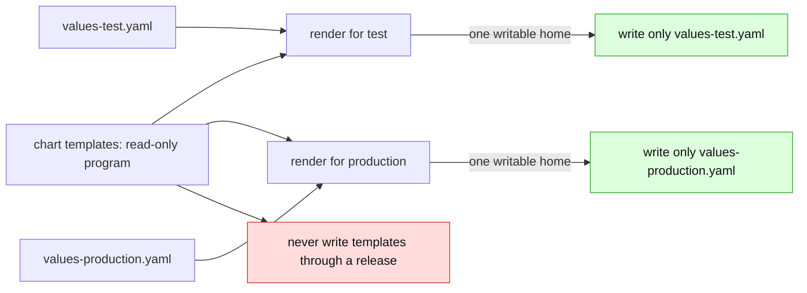

# Helm-light: the local-chart support boundary

> **design** — a proposal, not a plan of record. Nothing here binds until scheduled.
> Index: [`../../INDEX.md`](../../INDEX.md)
>
> Date: 2026-08-27. The verdicts in [support-contract.md](support-contract.md) remain
> authoritative. This document argues for narrowing two of its Helm rows, and names exactly
> which sentences it would amend if scheduled — see
> [What this deliberately does not open](#what-this-deliberately-does-not-open).

## The one-sentence proposal

> **A Helm chart that lives inside the GitOps repository, renders deterministically, and
> declares its input surface with a schema can be reversed with the same oracle discipline
> as an un-fancy kustomize overlay: the templates are the read-only base, the
> per-environment values file is the fan-in = 1 write surface, and every write is proven by
> re-render.**

We call that subset **helm-light**. A chart either satisfies its acceptance requirements
and gets the full reverse loop, or the folder is refused by name at GitTarget acceptance —
per field where possible, per folder when the failure is structural. Helm-light is not a
subset of Helm we failed to finish; it is the subset where reversing is *provable*.

## Why the blanket refusal is too coarse

The contract's Helm rows were written against the chart people fetch: a remote artifact,
versioned elsewhere, rendered by an engine we refuse to emulate. For that chart the
refusal stands, permanently.

But the app-of-apps pattern common in Argo CD shops is a different animal: a chart
directory **inside the GitOps repository itself**, with one `Application` per environment
pointing at it through `helm.valueFiles`. The chart is hand-written by the same team that
owns the repo, the values files are the environment axis, and the whole construct is
already inside a GitTarget's write jail. Refusing it as "a Helm chart" throws away the
locality that makes it tractable.

The same narrowing happened once before. "We do not do kustomize" was true until the
un-fancy subset was carved out with an allowlist and a verification renderer
([kustomize-support-boundary.md](kustomize-support-boundary.md)). This document is the
same carving, applied to the one Helm shape that shares kustomize's decisive properties.

## The five properties, and which ones a local chart recovers

What shipped for kustomize was never "kustomize support"; it was a subset holding five
properties. The table is the whole argument:

| # | Property | Un-fancy kustomize | Remote chart | Local chart under helm-light |
|---|---|---|---|---|
| 1 | Deterministic render (a sound oracle) | yes, by construction | no (`lookup`, hooks, rand) | **checkable**: double-render must be byte-identical, forbidden functions refused statically |
| 2 | Traceable input → output | yes, ~identity transform | undecidable | **per field**, via the probe map; untraceable fields refuse individually |
| 3 | A findable candidate edit | closed-form (the entry to author is determined) | unbounded search | **bounded search**: the schema closes the leaf set, the probe map names candidates |
| 4 | Locality (self-contained build) | remote bases refused | violated by definition | **required**: chart, values, and every read stay inside the tree |
| 5 | Checkable fan-in | visible in the tree | one chart, thousands of installs | templates are fan-in = N and read-only; **each values file is fan-in = 1** and is the write surface |

Property 3 is the only genuinely new machinery. Kustomize never searches — the overlay
entry to author is determined by the edit. Helm-light searches a *finite, declared* input
surface and then proves the candidate with the same oracle. Search-and-verify replaces
closed-form; nothing replaces the proof.

## The shape: base and overlay, transplanted



- `templates/` (and `_helpers.tpl`) is the shared base: read-only build context, exactly
  like `../../base` under [render-root scoping](render-root-scoping.md).
- Each per-environment values file is the overlay: the one document with fan-in = 1, and
  the only write destination.
- The Argo `Application` (or its equivalent) is the render-root declaration: which chart,
  which values files, which environment.

**First cut targets the Argo CD render semantics.** Argo renders charts with
`helm template` client-side: no release storage, `lookup` returns nothing, hooks become
sync-phase annotations. The offline render therefore *is* the deployed truth, which is
what makes the oracle sound. Flux's helm-controller performs a real install (hooks
execute, the rendered manifest lands in release storage), so a Flux-deployed local chart
is a follow-up with its own caveats — though its release Secret is itself a
fidelity-perfect record of the applied render, which the read side can use either way.

## The write path: probe, search, verify

1. **Probe once per chart digest.** For each leaf the schema declares, perturb it,
   re-render, and record which rendered fields moved. The result is a sensitivity map from
   values leaves to output fields. Hand-written app charts have tens of leaves; the map is
   cached keyed on the chart tree's digest, and the chart is in-tree, so every
   invalidation is a commit we already see.
2. **Invert by lookup.** A live edit to field F consults the map. Exactly one candidate
   leaf → propose the values edit. Zero candidates (the chart does not parameterize F) or
   several (the leaf fans out, or F is a join) → **refuse that field**, naming it, exactly
   like a field owned by a strategic-merge patch refuses today.
3. **Prove it.** Re-render with the proposed values file. The write is permitted only if
   the edited object equals the requested live object **and every other rendered object in
   every environment sharing the chart is unchanged** — the
   [`VerifyBatchRenders`](../../../internal/manifestanalyzer/render_verify.go) discipline,
   pointed at a second renderer. The blast-radius half of the check is what keeps a
   fanned-out leaf from ever slipping through as a "single" edit.
4. **New objects are refused into the chart.** Placing a new document would mean authoring
   a template, and authoring the template is authoring the program — see
   [Editing the chart itself](#editing-the-chart-itself) below.

The end-to-end loop this buys is the reverse loop, with Helm inside it: a live edit in the
test environment → a proven edit to `values-test.yaml` → commit → the deployer re-renders
→ the cluster converges on the value Git now declares.

## Acceptance requirements

Enforced where folder verdicts already live — GitTarget acceptance
([unsupported-folder-refusal-plan.md](../../spec/unsupported-folder-refusal-plan.md)) —
and refused **by name**, the way `patchesJson6902` refuses under its own name today.

1. The chart directory lies wholly inside the target's write jail, and every file the
   build reads (values files included) is local to the tree.
2. **`values.schema.json` is required**, and its closure has to be **effective and
   recursive**. A root-level `additionalProperties: false` closes only the root: every
   nested object's effective schema must reject undeclared keys too, including through
   `$ref` and through `allOf`/`anyOf`/`oneOf` composition, and the boundary has to say what
   `patternProperties` and an unresolved reference mean for closure before any of this is
   built. The schema is the chart author *declaring* the input surface, a closed leaf set,
   which is the same declared-over-inferred principle the layout model rests on
   ([gittarget-layout-model.md](../gittarget-layout-model.md)). A values key the schema
   does not declare refuses the folder.
3. No `dependencies:` in `Chart.yaml`, no `charts/` directory, no `Chart.lock`. The chart
   is one program, not a graph of them. (Vendored dependencies are a conceivable later
   widening; they are not v1.)
4. The static template scan (below) finds no refused construct.
5. **Two consecutive renders are byte-identical.** The dynamic determinism gate, backing
   up the static one.
6. The render root is declared: an in-scope `Application` (or the layout-model
   declaration, once #293 lands) names the chart and its values files. Whether helm-light
   surfaces as its own `layout.kind` or as a second renderer under the existing structural
   kind is an open question for the API wave, not for this boundary.
7. **The render root identifies exactly one writable values file, exclusively.** Argo
   applies value inputs by precedence: later `valueFiles` override earlier ones, and
   `parameters`, `valuesObject` and inline `values` override the files. A render root that
   uses any of those, or that shares a values file with another render root, has no unique
   write destination, so an edit could land in the wrong file or move several environments
   at once. Either refuse those inputs, or carry every input file, its source identity and
   its precedence in the probe key, and prove the writable file is referenced by this render
   root alone.
8. **The render context is pinned, or the charts that read it are refused.** The local
   oracle is only sound while its inputs match the ones Argo renders with. Argo supplies
   `kubeVersion`, `apiVersions`, the release name, its own Helm version and build-environment
   values, and any of them can change the output. The double-render gate does not catch
   this: it repeats the same local context twice. The verifier must render under the target
   Argo CD's context, or the boundary must refuse charts that read these inputs at all.

## The refusal taxonomy

Every refused construct names the property it breaks. The taxonomy outlives the list: a
Sprig function we have not met yet is judged by which row it lands in, not by whether it
was enumerated here.

### Breaks determinism — the oracle cannot exist

| Construct | Verdict | Detection |
|---|---|---|
| `randAlphaNum`, `randBytes`, `randNumeric`, `uuidv4` | refuse folder | static scan |
| `now`, `date`, and friends | refuse folder | static scan |
| `genCA`, `genSelfSignedCert`, `genPrivateKey`, `derivePassword` | refuse folder | static scan |
| `lookup` | refuse folder | static scan |
| Anything the scan missed that renders differently twice | refuse folder | double-render gate |

`lookup` is refused even though Argo's renderer returns nothing for it: a template whose
author reached for cluster state has declared that the offline render is not the whole
truth.

### Breaks injectivity — the edit cannot be attributed

| Construct | Verdict | Detection |
|---|---|---|
| A digest of values: `sha256sum`, `adler32sum`, `htpasswd` | refuse folder (v1; see the carve-out below) | static scan |
| A field joining several leaves: `printf "%s/%s:%s" …` | **refuse per field** | probe map (many candidates) |
| A field no leaf reaches | **refuse per field** | probe map (zero candidates) |
| `default` / `coalesce` shadowing an absent leaf | refuse per field (v1) | probe map |

The digest is the sharpest case and the reason this group exists: a rendered
`sha256sum` of two values carries no information about which input moved. No oracle,
however good, can attribute that edit — the information is destroyed in transit. This is
a mathematical boundary, not an implementation gap.

The per-field rows are the taxonomy's teeth doing normal work: the rest of the chart
stays editable, and the refusal message names the field and the reason, matching the
patch-owned-field refusals in the kustomize contract.

### Breaks document-set stability — placement cannot be pinned

| Construct | Verdict | Detection |
|---|---|---|
| `range` over a values list emitting N documents | refuse folder (v1; per-index editing is a conceivable widening) | static scan |
| `if` toggling a whole resource on a leaf | refuse folder (v1; boolean inversion is a conceivable widening) | static scan + render-set comparison |
| `tpl` — values that are themselves templates | **refuse folder, permanently** | static scan |

`tpl` is the one permanent row in this group: once values contain program text, the input
surface is no longer data, and the schema requirement above is unenforceable in spirit.

### Breaks locality — the render is not self-contained

| Construct | Verdict | Detection |
|---|---|---|
| `dependencies:`, `charts/`, `Chart.lock` | refuse folder | acceptance scan |
| `.Files.Get` reaching outside the chart | refuse folder | static scan |
| Values sourced from another `Application` source or repository | refuse folder | render-root declaration |
| `helm.sh/hook` annotations | refuse folder (v1) | static scan |

Hooks are a locality refusal rather than a determinism one: under Argo they become sync
lifecycle, which the mirror cannot represent as document content.

## The checksum carve-out, designed for even though v1 refuses it

Two different things hash. A digest **of values** (the group-two row above) destroys
attribution and is refused outright. But the ubiquitous pod-annotation pattern

```yaml
checksum/config: '{{ include "app.configmap" . | sha256sum }}'
```

is a digest **of other rendered output** — a derived field, not an edit target. The oracle
recomputes it correctly for free on every re-render; what breaks is only the
live-comparison step, because a human's live edit to the ConfigMap does not update the
Deployment's checksum annotation until the deployer syncs.

The eventual fix is a **render-owned field**: excluded from the live diff, always taken
from the render. That is a comparison-policy carve-out, not an inversion feature. v1
refuses all checksum functions for simplicity — but the refusal is *phrased* against the
edit-attribution property, so opening the render-owned carve-out later widens the
comparison policy without reshaping the contract. Without this carve-out, helm-light would
exclude half of the hand-written charts that are otherwise perfectly un-fancy; it should
open early.

## Detection: static first, dynamic backstop

The Go template parser yields the template AST, so the acceptance scan walks
`templates/` for refused function nodes and constructs before any render happens. That
buys precise refusals — `templates/deployment.yaml:12 uses sha256sum` — instead of
"renders differ." Three layers, cheapest first:

1. **Static AST scan** at acceptance: refused functions, `tpl`, `range`/`if` over
   resources, `.Files` escapes, hook annotations. Names file and line.
2. **Double-render gate** at acceptance: catches nondeterminism the scan cannot see.
3. **Probe residual check** at write time: a rendered field that moved during probing with
   no attributable leaf is refused per field, which catches attribution failures the first
   two layers missed.

## Editing the chart itself

The "Helm editor" question: should the operator ever write `templates/`? Three cases,
three verdicts.

| Case | Verdict | Why |
|---|---|---|
| A human edits the chart through Git | **Supported by reaction** | Git stays the write path for the program. The chart digest changes in a commit we watch: the probe cache invalidates, acceptance re-runs, renders re-verify. The operator is the verifier of chart edits, never their author. |
| The operator writes a template from a live edit | **Refused** | `templates/` renders into every environment: fan-in = N, the exact violation the L2 rule exists to refuse. And a template is text-with-holes, not KRM — there is no sparse-document edit model for it. |
| "Promote this field to a new values leaf" | **Permanently human** | Adding a leaf plus a schema entry plus a `{{ .Values.… }}` hole is chart API design. A tool that does this silently is redesigning the chart's contract on the user's behalf. |

One narrow exception is *statable* and deliberately not planned: a chart with exactly one
release, where the edited value appears as a verbatim literal outside any `{{ }}` action,
has fan-in = 1 — the same reason a single-consumer kustomize base is in-principle
writable. Even then the text-not-KRM hazard remains, so it stays a recorded possibility,
not a roadmap item.

## What this deliberately does not open

- **Remote charts.** Every objection this document dissolves is dissolved by locality;
  none of it transfers to a fetched artifact.
- **Heuristic inversion without the oracle.** The probe map proposes; only the re-render
  proof permits. No write ever rests on the map alone.
- **Chart inflation inside a kustomization.** The `helmCharts:` row in the kustomize
  contract is a different construct and stays refused.
- **`tpl`, hooks, and chart authoring**, per their rows above.

If scheduled, the contract sentences this amends are: the chart-folder row
("planned: skipped as a unit") gains an "unless accepted as helm-light" branch, and "we
never render a chart" in [support-contract.md](support-contract.md) becomes "we never
render a chart we cannot prove deterministic, and never a remote one" — with the render
performed by the same verification-renderer discipline that already governs kustomize:
locally, no plugins, no network, in-memory filesystem as the jail.

## Sequencing

1. **Values-file projection Move 2** ([values-file-projection.md](values-file-projection.md))
   — the write target must exist as an editable surface first.
2. **The renderer seam** ([renderer-abstraction-idea.md](renderer-abstraction-idea.md)) —
   helm-light is the second renderer behind the seam the kustomize oracle already defines.
3. **Acceptance gate + static scan** — the folder verdicts and the taxonomy above, with
   corpus fixtures for accepted and refused local charts under
   [`test/fixtures/gitops-layouts/`](../../../test/fixtures/gitops-layouts/).
4. **Probe + inversion + per-field refusals** — the write path proper.
5. **The render-owned carve-out** for checksum annotations, early after v1.

How helm-light surfaces on the API (`layout.kind`, or a renderer property of the
structural kind) belongs to the GitTarget API wave
([gittarget-api-wave.md](../gittarget-api-wave.md)), not to this boundary.

## Where the arguments live

| Doc | What it settles |
|---|---|
| [support-contract.md](support-contract.md) | the authoritative verdicts this proposal would amend |
| [kustomize-support-boundary.md](kustomize-support-boundary.md) | the precedent: allowlist + verification renderer |
| [gittarget-granularity-and-cross-environment-edits.md](gittarget-granularity-and-cross-environment-edits.md) | fan-in = 1, the rule the values file satisfies and the template violates |
| [values-file-projection.md](values-file-projection.md) | how a non-KRM values file becomes an editable surface |
| [renderer-abstraction-idea.md](renderer-abstraction-idea.md) | the seam a second renderer plugs into |
| [expansion-boundary-and-corpus-organisation.md](expansion-boundary-and-corpus-organisation.md) | why chart-expanded live objects are classified, never mirrored |
