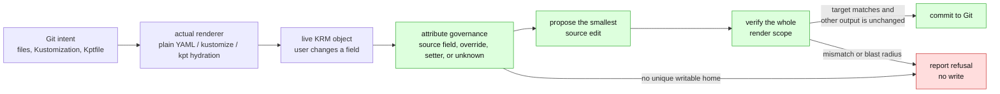
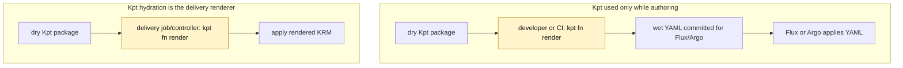
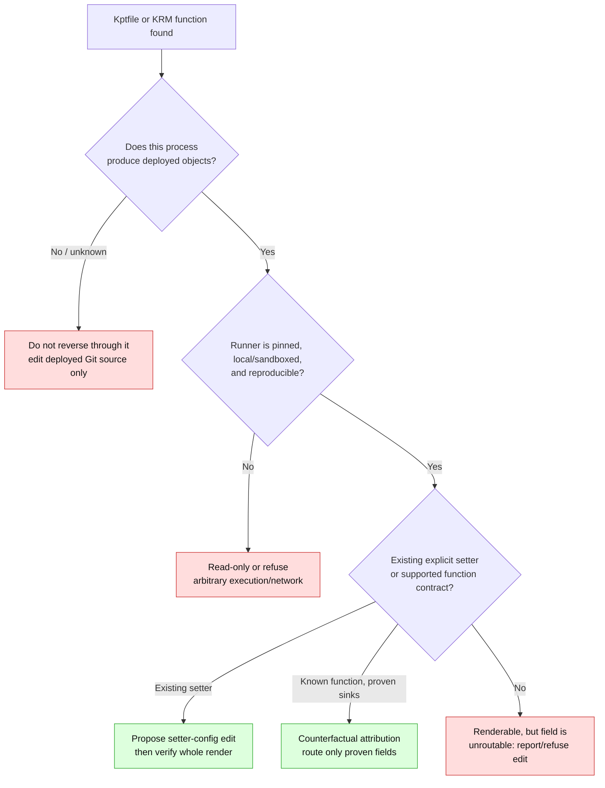

# Kpt and KRM functions: a safe place in the reverse-GitOps model

> **design** — an orientation note. Captured: 2026-07-14.
>
> Related: [render attribution](render-attribution.md),
> [render-root scoping](render-root-scoping.md),
> [the support contract](support-contract.md), and the
> `kustomize-tracer` plans (ConfigButler/kustomize-tracer, `plans/` — a local checkout under
> `external-sources/`, not tracked here).

Kpt and KRM functions have a useful place in GitOps Reverser, but they do not make a
generic rendered object reversible. The product's central question remains:

> Given a live field change, is there exactly one writable place in Git that can
> produce it again without changing anything else?

Kustomize, Kpt, a CI hydration job, and an Argo or Flux controller are all possible
parts of the answer. They are not interchangeable. The renderer we use to attribute
and verify a write must be the renderer that produced the objects the delivery system
applies.

## 1. The common model

Every supported configuration system fits the same pipeline. The stages in green are
capabilities, not promises: an unfamiliar transform may stop at the red refusal.



The current Kustomize work already implements the important safety half. A candidate
write is rendered against the exact post-write bytes; the intended object must match
the live object and every object outside the write batch must be unchanged. This is the
**oracle**. Attribution can improve over time, but it must never become the only proof
that a write is safe.

This explains two rules that apply equally to Kustomize and Kpt:

1. **Causation is not governance.** A transform that made no visible change can still
   override a later source edit. An idempotent Kustomize `images:` entry and an
   idempotent KRM function parameter are both "invisible and armed."
2. **A render result is not a source map.** It says what exists after rendering, not
   which exact configuration field a user should edit to reproduce one value.

## 2. Why Kustomize is the first renderer

Kustomize is unusually tractable because its configuration language has named entries
such as `images[0]`, `replicas[0]`, and `patches[0]`. The tracer work observes the
before/after state around each transformer entry, so it can say both *which entry* and
*which field* changed.

```yaml
# overlays/prod/kustomization.yaml
resources:
  - ../../base

images:
  - name: ghcr.io/acme/web
    newTag: "2.4.1"

patches:
  - path: production-tuning.yaml
    target:
      kind: Deployment
      name: web
```

```yaml
# overlays/prod/production-tuning.yaml
apiVersion: apps/v1
kind: Deployment
metadata:
  name: web
spec:
  replicas: 3
```

For `containers[name=web].image`, an `images[0]` event can route the edit to
`kustomization.yaml`. For `spec.replicas`, a patch may be the governing input. The
important result is not "always edit the patch"; Kustomize ordering can make a patch
dead text when a later `replicas:` entry wins. The renderer, rather than a hand-written
ordering model, decides that.

The two complementary attribution techniques are:

| Question | Technique | Result |
|---|---|---|
| What actually changed this field in this build? | Observer around each transformer entry | exact causal field events and lineage |
| Which configured input will win even when it agrees with its source? | Counterfactual dye | governance of safe, dyeable values |

Neither is permission to write. Both feed the oracle, which checks the proposed edit over
the whole render root and its read scope. Fields changed by unobserved mechanisms—such
as generator hashes and reference rewrites—are **unattributable**, not source-owned by
default.

## 3. What Kpt adds

Kpt is package-centred rather than Kustomization-centred. A `Kptfile` can declare an
upstream package, package metadata, inventory, and a function pipeline. A function takes
KRM resources plus configuration, then emits KRM resources. This produces three useful
ideas for this project.

### Packages are render roots

A Kpt package can be treated as another candidate unit in repo discovery, much as a
Kustomize render root is today. Its read scope includes the package and any declared
inputs that its actual hydration process reads. Its write scope must still remain inside
the `GitTarget` path.

This is only meaningful when Kpt hydration is in the delivery path. There are two
materially different repository shapes:



In the first shape, GitOps Reverser sees the wet YAML as its ordinary Git source; it
cannot safely reverse through an unobserved CI step into the dry package. In the second,
Kpt is part of the renderer and needs a dedicated renderer adapter, provenance rules, and
the same post-write verification as Kustomize.

### Setters are an explicit inverse contract

The most promising Kpt concept is the setter. It marks a resource value with the name of
the parameter that controls it. That is much better than inferring ownership from a final
rendered value.

```yaml
# deployment.yaml
apiVersion: apps/v1
kind: Deployment
metadata:
  name: web
spec:
  replicas: 2 # kpt-set: ${web-replicas}
  template:
    spec:
      containers:
        - name: web
          image: ghcr.io/acme/web:2.4.1 # kpt-set: ghcr.io/acme/web:${web-tag}
```

```yaml
# setters.yaml -- function configuration, not an applied workload
apiVersion: v1
kind: ConfigMap
metadata:
  name: setters
  annotations:
    config.kubernetes.io/local-config: "true"
data:
  web-replicas: "2"
  web-tag: "2.4.1"
```

```yaml
# Kptfile
apiVersion: kpt.dev/v1
kind: Kptfile
pipeline:
  mutators:
    - image: ghcr.io/kptdev/krm-functions-catalog/apply-setters:v0.2
      configPath: setters.yaml
```

An edit to the live Deployment's replicas can propose changing
`setters.yaml:data.web-replicas`, rather than overwriting the annotated Deployment
field. This is an **existing-setter** capability only. Creating comments, creating a
setter configuration, or guessing that equal values share a parameter is authoring and
must be a separate future feature.

A setter is shared context. If `web-tag` controls ten resources, changing it for one
resource is valid only when the intended batch includes all ten resulting changes. The
whole-render oracle makes this check mechanical.

### Function pipelines are a renderer extension point, not an inverse API

Kpt's pipeline has useful structure: ordered mutators, validators, per-function
configuration, and selectors. It does **not** turn an arbitrary function into a reversible
operation. The function can be a container image or an executable, and selectors can fan
one configuration value out to many resources.

```yaml
# This is renderable only under a deliberately approved runner policy.
apiVersion: kpt.dev/v1
kind: Kptfile
pipeline:
  mutators:
    - image: ghcr.io/example/organisation-policy@sha256:REPLACE_WITH_PINNED_DIGEST
      configMap:
        team: payments
      selectors:
        - kind: Deployment
          labels:
            app.kubernetes.io/part-of: checkout
```

Even if the output has `metadata.labels.team: payments`, that does not identify a
source-field write location, prove that the function is deterministic, or prove it did
not change another object. Treat this form as **renderable read-only context** until a
specific function contract is supported.

## 4. Support levels for Kpt and KRM functions

The right boundary is additive and per capability, rather than "Kpt supported" or
"Kpt refused."



| Level | Example | Operator behaviour |
|---|---|---|
| 0 — metadata only | `Kptfile` without a pipeline in a raw-YAML delivery repo | Ignore it as a deployment transform; preserve it as package metadata. |
| 1 — observable but unroutable | A known pipeline renders the object, but no explicit ownership exists | Render for comparison; report the field as unreflectable; do not write. |
| 2 — explicit route | Existing `apply-setters` comment and config | Edit the named setter value; verify every render output. |
| 3 — narrow function contract | A pinned, allowlisted function with a tested sink-only configuration field | Dye or otherwise perturb the configuration, count fan-out, and write only after verification. |
| never generic | Arbitrary container/exec function, network access, unpinned tag, opaque generated output | No source routing. Refuse the edit or operate only on a separately committed rendered artifact. |

The KRM Functions Catalog is therefore a source of **candidate contracts**, not a list to
enable. `apply-setters` is a strong candidate because it declares the inverse coordinate.
Bulk transforms such as `set-labels`, `set-namespace`, `set-image`, Starlark, Helm
rendering, or generic search-and-replace should begin at level 1. Each needs independent
evidence about determinism, selector fan-out, safe-to-dye values, and a comment-preserving
write location before it can move higher.

## 5. Extending the render-plan idea

The Kustomize tracer's proposed render plan is a useful *shape* that can eventually cover
more than Kustomize. It is an inverse-build artifact: a lookup hint for routing, never
permission to write.

```yaml
apiVersion: gitopsreverser.io/v1alpha1
kind: RenderPlan
renderer:
  type: kpt
  packageRoot: apps/web
  pipelineFingerprint: sha256:REPLACE_WITH_REAL_CONTENT_HASH
inputs:
  Kptfile: sha256:REPLACE_WITH_REAL_CONTENT_HASH
  deployment.yaml: sha256:REPLACE_WITH_REAL_CONTENT_HASH
  setters.yaml: sha256:REPLACE_WITH_REAL_CONTENT_HASH
objects:
  - id: apps/v1/Deployment/default/web
    origin: deployment.yaml
    fields:
      spec.replicas:
        source:
          kind: setter
          file: setters.yaml
          path: data.web-replicas
          function: apply-setters
unattributable:
  - object: apps/v1/Deployment/default/web
    field: metadata.labels.team
    reason: function-contract-not-supported
```

The fingerprint prevents a plan made for old inputs from posing as current knowledge. A
matching plan can propose the setter edit; a missing, stale, or incomplete plan causes a
fallback to live counterfactual attribution where that is safe, otherwise a refusal. In
all cases the post-write render remains decisive.

This artifact could eventually serve three consumers without creating three analyses:

- **writer:** field-to-source proposals and clear refusals;
- **repository map:** render roots/packages, inputs, and ownership edges; and
- **metrics:** counts of `unattributable` fields and the transforms that cause them.

## 6. Practical sequencing

Do not let Kpt exploration interrupt the current Kustomize support-boundary work.
`patches:` is the immediate, measured opportunity: make folders renderable first, move
refusals to individual unroutable fields, then add tightly bounded attribution and routing.

After that, the smallest useful Kpt slice is:

1. Detect `Kptfile` during repo discovery and report whether a pipeline is present.
2. Record whether the deployment path actually executes Kpt. Do not assume that it does.
3. Support **existing setters only** for a locally reproducible, pinned `apply-setters`
   pipeline, with a fixture that proves single-field and fan-out behaviour.
4. Reuse the existing full-batch oracle over the Kpt render scope.
5. Add one function contract at a time, only when its safe inputs and writeback coordinate
   are explicit and covered by counterfactual tests.

The desired outcome is not universal transformation support. It is a growing set of
honest answers: *this live field belongs to this source coordinate and we can prove the
round-trip*, or *this renderer produced the field but we cannot safely write it back.*
