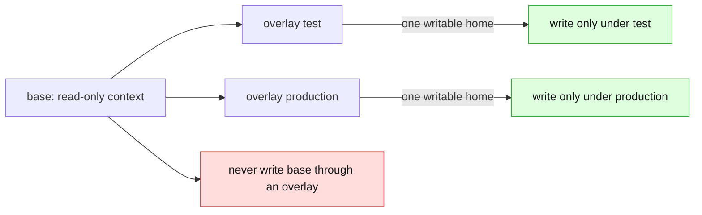

# Kustomize support boundary

> **Current design and implementation record.** The verdicts in
> [support-contract.md](support-contract.md) are authoritative; this document explains the
> Kustomize-specific reasoning and the narrow route to future expansion.

Kustomize is safe to reverse only when a change has one writable expression in the
repository. We use Kustomize to verify a proposal; we do not try to invert its entire
language.

## 1. Field taxonomy

| Class | Fields | Boundary |
|---|---|---|
| Editable declarations | local `resources`/`bases`, `namespace`, `images`, `replicas` | supported where the layout provides one write home |
| Tolerated build context | `patches:` with local strategic-merge `path:` documents | rendered and retained, but neither authored nor edited |
| Planned authoring surface | scalar strategic-merge patch for an inherited field | see [patch authoring](patch-authoring.md) |
| Refused | inline/JSON6902/deprecated patches, generators, `components`, `namePrefix`/`nameSuffix`, remote bases, `helmCharts`, plugins, `replacements`, `vars` | no safe or owned inverse in the current model |
| Refused for editor safety | `configurations`, `openapi`, `crds` | they alter merge semantics that the writer must not guess |

`labels`, `commonLabels`, and `commonAnnotations` are not field-authoring channels.
The source-form projection keeps render-supplied values out of source bytes when the
source already renders to the live value. That avoids transformer leakage without making
these fields a general reverse-edit feature.

## 2. Accepted layouts

| Layout | Status | Write rule |
|---|---|---|
| Plain manifest folder | Shipped | edit its KRM documents in place |
| Self-contained Kustomize root | Shipped | edit a local document or declared `images`/`replicas` entry |
| External-base overlay | Shipped, narrow | read the base as context; write only inside the selected overlay |

An external-base overlay can edit an existing overlay-local document and a declared
image/replica entry. Its shared base is read-only. Creating a new overlay-local resource
and adding its `resources:` entry is **planned** pending a placement/write-path correction;
it must not be advertised as shipped yet. `scan-repo` still reports external-base overlays
as unsupported while its classification catches up with the runtime.

## 3. The invariant

The write contract has one home in
[GitTarget granularity §1](gittarget-granularity-and-cross-environment-edits.md):

1. **L1: write scope.** A write never leaves the target's `spec.path`.
2. **L2: fan-in.** A file reached by more than one render root is never edited in place.

Reads may include a shared base so we can build the selected overlay; writes may not. A
violation aborts the whole flush before any commit and reports `WriteBoundaryRefused`.
This makes an inherited base field (an env var, resource limit, or argument) deliberately
unwritable until patch authoring supplies an overlay-local expression.

## 4. Rendering and verification

The operator embeds the real `sigs.k8s.io/kustomize/api` implementation. It is a
verification renderer, not a deployment engine: Flux, Argo CD, or another controller still
deploys the repository.

For every planned batch, [`VerifyBatchRenders`](../../../internal/manifestanalyzer/render_verify.go)
rebuilds the affected root in an in-memory filesystem. A write is permitted only if the
edited object equals the requested live object and every other rendered object is unchanged.
The filesystem is the jail; `LoadRestrictionsNone` is needed to match Flux's valid
out-of-root local references. Plugins are disabled and remote bases are refused before the
build, so an in-memory build cannot fetch or execute user code.

This proof lets us tolerate a local strategic-merge patch as context: an image or replica
entry can remain editable even when a patch exists. It does not make patch authoring safe by
itself. A field owned by a patch remains refused until the proposal, attribution, and proof
described in [patch authoring](patch-authoring.md) exist.

## 5. Deliberate non-goals

- No chart inflation or remote-base resolution.
- No plugin execution or controller-side transform emulation.
- No write-through to a shared base or another environment.
- No generic inversion of patches, generators, name references, or merge keys.

The fixture corpus under [`test/fixtures/gitops-layouts/`](../../../test/fixtures/gitops-layouts/)
is the executable evidence for these verdicts. The more detailed history of the renderer and
overlay implementation lives in [render-root scoping](render-root-scoping.md).
