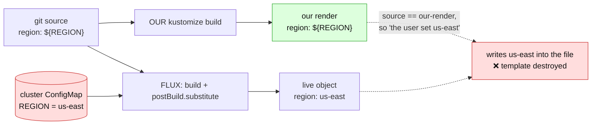
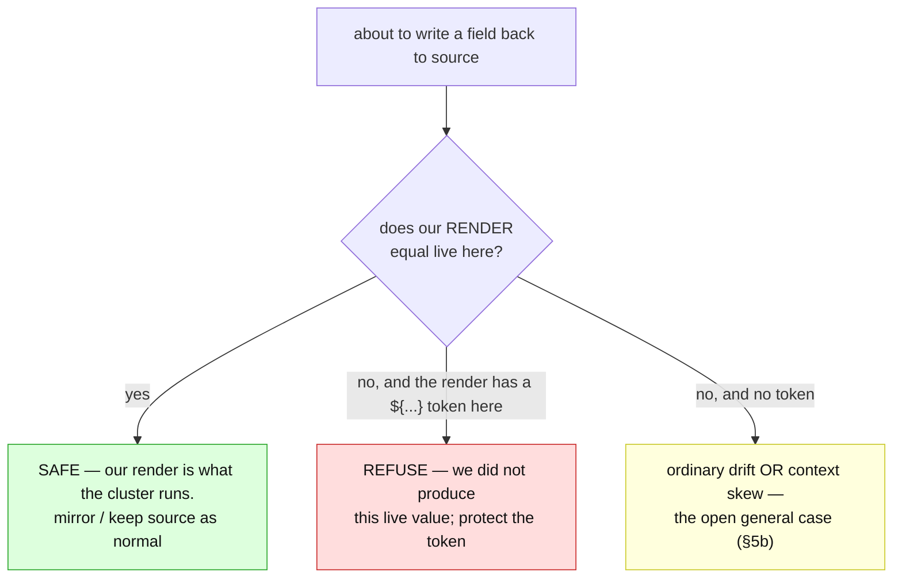
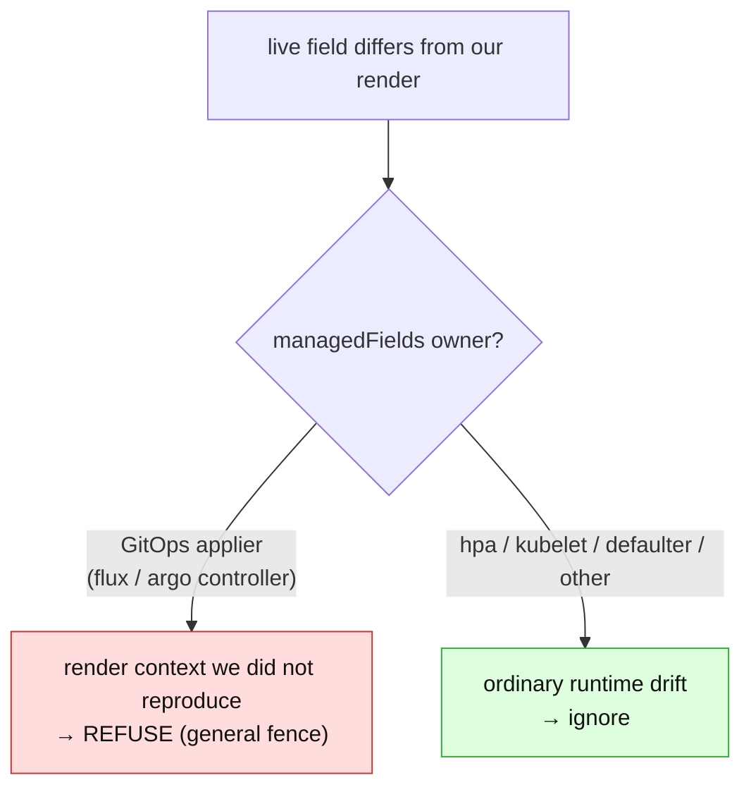

# The `${...}` token writeback problem, explained

> **explainer** — a teaching companion to the decided design in
> [render-fidelity.md](render-fidelity.md) and its fixtures in
> [render-fidelity-scenarios.md](render-fidelity-scenarios.md). Nothing here is new policy;
> this doc exists so the *why* is legible later without re-deriving it. Captured 2026-07-15.
> Related fact: [`../../facts/kustomize-never-emits-dollar-brace.md`](../../facts/kustomize-never-emits-dollar-brace.md).

## The one-sentence problem

We reverse live changes back into Git by comparing the live object to what our render
produces — but when the live object holds a value our render **did not** produce (a Flux
`postBuild` variable, an Argo override), naively writing that value back **destroys the
parameterisation it came from**.

## The corruption, concretely

A folder is managed by Flux. The source parameterises a region:

```yaml
# git: configmap.yaml
data:
  region: ${REGION}
```

Flux builds the folder, then runs `postBuild.substitute` **after** the build, replacing
`${REGION}` from a cluster ConfigMap. So the live object is:

```yaml
# live (what the cluster runs)
data:
  region: us-east
```

Now a user edits something unrelated on that object and we go to mirror it back. Our own
render of the folder still says `${REGION}` (our kustomize never touches a `${...}` token).
The naive writer compares:

```text
git source:   region = ${REGION}
our render:   region = ${REGION}     ← kustomize passed the token through untouched
live object:  region = us-east       ← Flux substituted it, out of our sight
```

It sees `source == our-render`, concludes *the user must have set `us-east`*, and writes
`us-east` into the file. **The `${REGION}` template is gone.** Worse, it looks fine: next
reconcile Flux substitutes again (now a no-op — the value is already literal), so the object
converges. The damage only surfaces later, when someone changes `REGION` and the file no
longer follows.



## Why "just run kustomize" does not fix this

This is the most common misconception, so it is worth stating flatly. Running kustomize
(and the source-form projection built on it) solved a **different** leak: the one where
*our own render* introduces a value — a `commonLabels`/`images`/`replicas` transform makes
our render produce `env: prod`, and the writer would mirror `prod` back into a file that
only said `${ENV}`. Source-form fixes that: *where our render equals live, keep the source
bytes.*

`postBuild` is not that. It runs in the **orchestrator**, **after** our build, on a token
our kustomize **passes through verbatim**. Our render of `${REGION}` is `${REGION}`; we
have no way, from the folder alone, to know it should be `us-east`. So:

- our render **cannot** tell us the correct live value (we'd have to read the Flux object
  and the cluster ConfigMap — the unbuilt "orchestrator awareness" fence), and
- the post-write oracle **cannot** catch the bad write either: it re-renders with *our*
  kustomize, which also leaves `${REGION}` literal, so it agrees with the corruption.

Running kustomize is blind to `postBuild` by construction. The fence covers exactly the gap
kustomize cannot see.

## The fence: measure the render against the live object

The discriminator we lack on disk we already hold at write time: **the live object is the
orchestrator's render.** So we do not predict the orchestrator's context — we observe its
output.

> `diverges(render, live)` := the **render** carries a `${...}` token at a field where the
> live object holds a **different** value.

On a divergence we refuse the write (nothing is committed) and raise the independent
`RenderMatchesLive=False` condition. We do **not** claim *what* caused it ("substituted"
would be a guess); we claim only the fact we can stand behind — *our render did not produce
this value* — under the reason `RenderDoesNotMatchLive`.



### Why key on the token at all?

Because it is the one field-class where "different ⇒ dangerous" holds **for free**.
kustomize provably never emits or resolves a `${...}` token; an HPA never writes one; a
defaulting webhook never writes one. So a `${...}` in our *render output* is guaranteed to
be an unresolved input parameter — and if live differs there, the difference can only be
something resolving it out of band. On token fields the check has ~zero false positives,
**without** needing to solve the hard general question of "is this divergence context or
drift?" (see the managedFields section below).

### Read the render, not the source

Two small examples show why the comparison is against `dm.Rendered.Object` (or, for a plain
manifest, the Git document itself), never the raw source bytes:

| Fixture | Source | Render | Live | Verdict | Reason |
|---|---|---|---|---|---|
| `label-overwrites-source-token` | `env: ${ENV}` | `env: prod` (a `labels:` transform overwrote it) | `prod` | **mirror** | render == live; a git-vs-live check would falsely refuse |
| `label-injects-render-token` | *(no `env`)* | `env: ${ENV}` (a `labels:` transform injected it) | `prod` | **refuse** | a token the source never had still reaches the cluster |

And the "must still mirror" guardrails — where the token is genuinely literal because the
live object carries it verbatim too:

| Fixture | Field | Live | Verdict |
|---|---|---|---|
| `literal-crd-description` | CRD schema `description: ${var:=default}` | same literal | **mirror** |
| `literal-kro-template` | `${schema.spec.replicas}` | same literal | **mirror** |
| `literal-nginx-config` | `nginx.conf: ...${host}...` | same literal | **mirror** |
| `native-dollar-paren` | `$(POD_IP)` | any value | **mirror** (parens are native syntax, outside the predicate) |
| `comment-only-token` | `# ${REGION}` in a comment | — | **mirror** (comments are not parsed values) |

## Tried simplifications that did *not* work

Recorded so they are not re-attempted.

1. **A structural on-disk regex — "refuse any managed file containing `${...}`."** No live
   comparison at all; cheapest possible. **Reverted — it broke CRD mirroring.** A CRD schema
   `description` literally contains `${var:=default}` (the Flux Kustomization CRD documents
   `postBuild` in its own schema), and a structural check cannot tell a *literal* token from a
   *substituted* one. The acceptance gate is all-or-nothing over a folder, so one such CRD
   refused every unrelated write in the folder. **Lesson: the discriminator — was this token
   actually substituted? — is not on disk. You must look at the live object.**

2. **git-vs-live instead of render-vs-live.** Comparing the *source* bytes to live seems
   equivalent and simpler. It is wrong twice: it **falsely refuses** `label-overwrites-source-token`
   (source `${ENV}` ≠ live `prod`, but the render is `prod` == live, so the folder is faithful),
   and it **misses** `label-injects-render-token` (a token a `patches:`/`labels:` block injects
   into the render that the source never had). The render is what the cluster actually gets, so
   the render is what must be compared.

3. **`task test-e2e 2>&1 | tail -N` to check the result.** A smaller lesson, but real: the
   pipeline reports `tail`'s exit code (0), not the suite's — a **failing** suite reads as green.
   Assert on the `Passed | Failed` summary line, or redirect to a file. (Easy to hit; it was hit
   again during review of this very workstream.)

## Could managedFields simplify this?

Short answer: **managedFields does not make the token check simpler — it makes the token
check largely unnecessary, by enabling a more powerful check that subsumes it.**

The token check is narrow on purpose. The token is a *free discriminator* for one question —
"is this divergence out-of-band context, or ordinary runtime drift?" — but it only answers
that question for fields that happen to carry a `${...}`. It is blind to divergences that
leave **no token**: an Argo `spec.source.kustomize.images` override, a `replicas` override, a
kustomize **version** difference. Those change the applied object with no `${...}` anywhere,
so the token gate never fires.

The **general** fence (§5b of [render-fidelity.md](render-fidelity.md)) would catch all of
them: *before trusting our render as the baseline, require it to reproduce the live object for
every field the write does not deliberately change.* The reason it is not the fence today is a
single hard problem — **a live object legitimately drifts from Git for reasons that are not
out-of-band render context**: an HPA changed `replicas`, a defaulting webhook filled a field,
another controller populated something. A naive "live ≠ render ⇒ refuse" would refuse nearly
every folder, not "a shade too eagerly."

`managedFields` is the candidate discriminator that would make the general fence safe. Every
field records *which field manager last set it*:

- A field owned by the **GitOps applier** (Flux `kustomize-controller`, Argo's controller) but
  **differing from our render** ⇒ the applier had input we did not — `postBuild`, an override:
  **render context we failed to reproduce ⇒ refuse.**
- A field owned by **`hpa`, `kubelet`, a defaulter, another controller** ⇒ **runtime drift ⇒
  ignore.**



If that holds, a diverged `${...}` token becomes just **one special case** of "the applier
owns a field our render did not produce," and the dedicated token predicate can retire in
favour of the general rule — which is arguably *simpler* (one ownership question, no token
regex, no list-pairing) **and** strictly more powerful (it also catches the tokenless Argo /
version-skew cases).

So the honest framing:

- managedFields is **not** a simplification *of* the token logic; the token logic is already
  near-minimal for what it covers.
- managedFields is what lets you **replace** the token gate with a general render-vs-live gate
  that covers everything the token gate does and more.
- It is filed as **"promising — measure it"**, not done, because ownership has sharp edges:
  server-side vs client-side apply, shared/co-ownership, `force` conflicts, and whether the
  live object's `managedFields` even survives our sanitization intact. It must be measured
  against **real** Flux and Argo `managedFields`, not assumed — the same discipline that caught
  the structural check: measure against real content, do not reason about it.

Until then, the token gate is the safe down payment; the general fence is the endgame it is a
down payment on.

## See also

- [render-fidelity.md](render-fidelity.md) — the decided design (the fence, §5a/§5b, the state
  machine, where it runs).
- [render-fidelity-scenarios.md](render-fidelity-scenarios.md) — the executable fixtures every
  example above is drawn from.
- [orchestrator-knowledge-boundary.md](orchestrator-knowledge-boundary.md) — reading the Flux /
  Argo object directly (the third, most complete fence).
- [renderer-abstraction-idea.md](renderer-abstraction-idea.md) — where a `FluxKustomize`
  renderer that *models* `postBuild` would sit, turning "detect and refuse" into "reproduce
  correctly."
