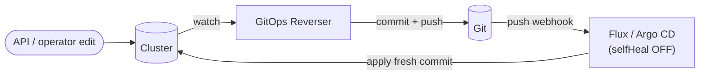
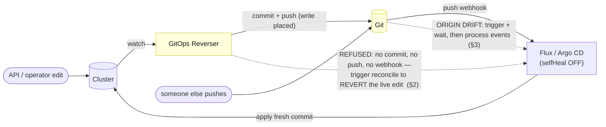
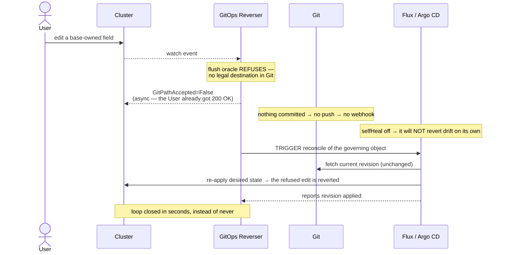
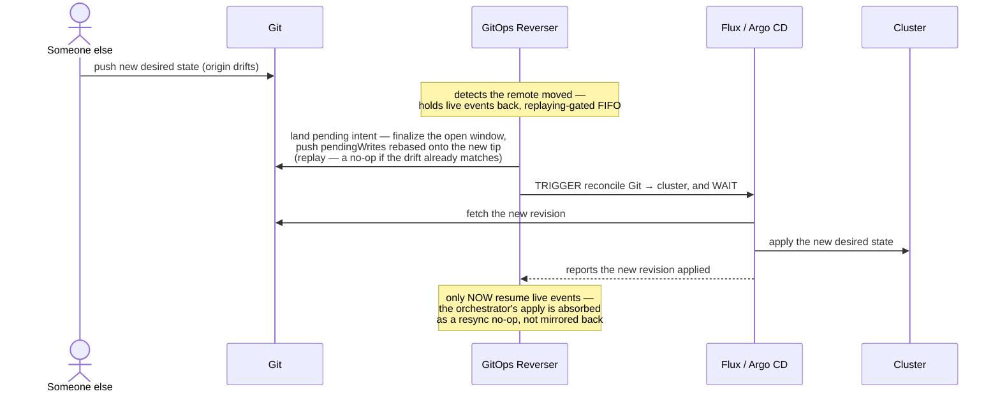

# The orchestrator reconcile trigger: revert a refusal, and order around origin drift

> **design** — direction-setting; no orchestrator trigger or origin-drift barrier described here is
> implemented. `RenderMatchesLive` is shipped, but it deliberately stays closed after a Git repair
> until this document's safe remote-revision path exists.
> Captured: 2026-07-15; implementation status updated: 2026-07-15.
> Related:
> [README.md](README.md),
> [../../bi-directional.md](../../bi-directional.md) — **the user-facing model this expands: the
> reconciler as a *triggered applier***,
> [argocd-bi-directional.md](argocd-bi-directional.md) — why `selfHeal` must be off, and why that
> means nothing reverts a refused edit,
> [orchestrator-knowledge-boundary.md](orchestrator-knowledge-boundary.md) — **the ownership model
> this rides on; it is the first *write* action built on it**,
> [render-fidelity.md](render-fidelity.md) — the shipped gate whose automatic Git-repair recovery depends on this barrier,
> [admission-consent.md](admission-consent.md) — the sibling half: deciding *whether* a write happens,
> [gittarget-granularity-and-cross-environment-edits.md](gittarget-granularity-and-cross-environment-edits.md)

This is one half of a two-part design. [The other half](admission-consent.md) decides *whether* a
write happens, at admission time. This half is about the operator gaining **one new outward action —
asking the GitOps orchestrator (Flux/Argo) to reconcile now** — and the two places it is needed:
reverting a refused edit promptly, and ordering our processing behind an incoming origin change.

It is not a replacement for the write correctness layers: the flush-time render oracle
([`VerifyBatchRenders`](../../../internal/manifestanalyzer/render_verify.go)) and the shipped
[`RenderMatchesLive`](render-fidelity.md) token fence remain the decision points. This document is
about closing the loop *fast* and *visibly* once a "no" has been decided, and about safely refreshing
Git after origin drift so a repaired render-fidelity gate can be measured again.

---

## 1. The gap: a triggered applier that is never triggered on the two cases that need it

[bi-directional.md](../../bi-directional.md) already establishes the model: the reconciler is not an
always-on loop, it is a **triggered applier**. After the operator commits, it triggers the reconciler
to apply *that exact commit* and waits for the SHA — and because the applied revision equals the
committed revision, the loop is closed. The guide draws it as a steady-state loop:

That loop only closes on the **happy path**, where a commit is produced and a push fires the webhook.
Two cases fall straight through it, and they are exactly the ones where the operator must trigger the
reconciler *directly* rather than via a push that never happens:

The two dotted arrows are the whole of this document: the reconcile trigger, and where it sits.

---

## 2. Use one: revert a refused edit

### Why it is necessary, not merely nice

With Argo `selfHeal: false` — *required* for bi-directional editing, because with it on Argo reverts
the live edit sub-second from cached Git and thrashes against us
([argocd-bi-directional.md](argocd-bi-directional.md)) — **nothing reverts a refused edit.** It is
`OutOfSync` until a human intervenes: the push webhook never fires (there was no commit, no push), and
the poll re-resolves an *unchanged* Git and does nothing. Under Flux it is milder but the same shape —
reverted only on the next interval reconcile. So triggering a reconcile is not a speed-up; for Argo it
is the *only* thing that ever reverts a refused edit.

And the operator is uniquely entitled to do it. [argocd-bi-directional.md](argocd-bi-directional.md)
names the missing ingredient precisely: a system that can *distinguish authorized drift from
unauthorized*, which Argo cannot. **At refusal time the operator has exactly that signal** — the
refused edit is, by construction, the drift with no home in Git. So an operator-triggered reconcile of
a refused edit is the **targeted, per-write substitute for the blanket self-heal the operator had to
switch off.**

Compare this to the guide's happy-path triggered-applier sequence: the shape is identical, but the
trigger fires on a **refusal** (nothing was committed) instead of on a commit, and its job is to
*revert* the drift rather than to *apply* a fresh commit.

### What "trigger" means, per orchestrator

The [orchestrator-knowledge-boundary](orchestrator-knowledge-boundary.md) rule is absolute: **never
depend on the `argoproj` or `fluxcd` Go modules.** The trigger is a patch on an object, matched by
group+kind over `unstructured`. But the two orchestrators differ, and the difference matters:

| | **Flux** | **Argo CD** |
|---|---|---|
| Trigger | patch `reconcile.fluxcd.io/requestedAt` on the `Kustomization` | see below |
| Does it revert drift? | **Yes, cleanly** — Flux server-side-applies desired state, which reverts drift as a side effect | **Not with a plain refresh.** `argocd.argoproj.io/refresh` re-reads Git and re-compares, but with `selfHeal` off it only marks `OutOfSync` — it does **not** revert |
| To actually revert | (nothing more) | requires a **sync operation** — a deliberate, one-shot self-heal of the specific refused object |

So Flux is a one-annotation, correct-outcome trigger. Argo needs the stronger action — a sync — which
writes to the cluster and must therefore be an explicitly granted authority, scoped so it can only
ever revert the specific refused object, never sync the whole app.

---

## 3. Use two: reconcile-before-process, as an ordering barrier

The same trigger answers a different, subtler problem — **origin moved under us** — and here it is a
*barrier*, not a revert.

### The operating model this assumes

Three invariants from the existing pipeline underpin everything below. The barrier is a *consequence*
of them, not a new policy:

- **The cluster leads.** The cluster is the editing surface; live watch events flow cluster → Git
  ([bi-directional.md](../../bi-directional.md) — the reconciler as a *triggered applier*). Git is a
  mirror of cluster intent, re-derivable at any time by the mark-and-sweep resync. Nothing in the
  operator treats Git as authority *over* the cluster.
- **Git drift is a supported input, not an error.** Someone else pushing to the branch is expected and
  handled, never rejected. The commit direction is already safe against it (below); what this document
  adds is the missing *cluster*-side handling of that same drift.
- **Optimistic push, and the queue clears only on a landed push.** Cluster changes are committed
  locally into a retained queue — `pendingWrites` — and pushed; **only a successful push clears that
  queue**, and a failed push retains it for retry
  ([`branch_worker.go`](../../../internal/git/branch_worker.go), `pushPending`). We do not pull-then-push
  in steady state: we push optimistically and reconcile with the remote only when the push is rejected.
  (The *first* commit of a fresh cycle does re-base the local worktree on the current remote tip first,
  but the queue is empty at that point, so no intent is at stake — the re-pull/replay of *retained*
  intent happens only on a rejected push.)

### What is, and isn't, already handled

The commit direction is already safe against a moved remote. `PushAtomic`
([`git_atomic_push.go`](../../../internal/git/git_atomic_push.go)) is a compare-and-swap, never a
force-push; if the remote advanced, the push is rejected and `pushPendingCommits`
([`branch_worker.go`](../../../internal/git/branch_worker.go)) **rebases by replay** — hard-reset to
the new tip, then re-plan and re-commit the *retained pending writes* on top (the local commit objects
are discarded; the durable intent behind them is not), and re-push with an updated CAS. Because the
replay re-derives each commit from cluster intent rather than replaying opaque diffs, it can even
produce **no commit at all**: if the drift already carries the same content, the re-plan finds nothing
to change and the whole rebase collapses to a no-op. So we never clobber someone else's push, our own
intent survives, and a push conflict never manufactures a spurious commit. This path is covered by unit
tests that push a competing commit to the remote and assert the rebase resolves cleanly
(`TestBranchWorker_ConflictResolution`, `TestBranchWorker_ConcurrentOperations` in
[`git_operations_test.go`](../../../internal/git/git_operations_test.go)).

What is **not** handled is the *cluster* side. When origin gains new desired state, the orchestrator is
about to apply it, producing a flood of watch events. Two problems follow:

1. **The reconcile echo.** Those events came *from* Git via the orchestrator. If the operator processes
   them as user intent and mirrors them back, it is round-tripping the orchestrator's own apply into
   Git — noise at best, a fight at worst.
2. **The stale baseline.** The operator's model of "what this folder renders to" was computed against
   the *old* tree, so its refusal/attribution decisions for the transitional state can be wrong until
   the cluster reflects the new origin.

### The barrier

The fix is an ordering rule: **on origin drift, trigger the orchestrator to reconcile Git → cluster,
wait for it, and only then resume processing live events.** After the reconcile, the operator's own
mark-and-sweep resync absorbs the orchestrator's apply as a **no-op against the new tree**, instead of
mirroring it as intent.

This rides machinery that already exists. There is already a *reconcile-before-process* barrier: on
watch (re)establishment the operator enqueues a scoped mark-and-sweep ahead of live events, gated by
the `replaying` flag, all on one FIFO so order is preserved
([`target_watch.go`](../../../internal/watch/target_watch.go),
[`resync_flush.go`](../../../internal/git/resync_flush.go)). Two additions turn it into what we need: a
new **trigger** (proactive origin-drift detection — see *The trigger*, below; the groundwork method
`SyncAndGetMetadata` exists but is dormant, uncalled today), and a stronger **wait** (the barrier's
"reconcile" step now waits for the *orchestrator* to apply Git → cluster, not only the operator's own
sweep).

> **Terminology, because "reconcile" is overloaded and this doc would mislead without saying so.**
> There are two. The **orchestrator reconcile** (Flux/Argo applies Git → cluster) is what this
> document triggers and waits on. The operator's internal **resync** (a mark-and-sweep that rebuilds
> the Git-side model from the cluster, cluster → Git) is what runs *after* the barrier to absorb the
> apply. Where this doc means the internal one, it says "resync."

### The trigger: a Git push webhook, not lazy discovery

Today the operator has **no proactive drift signal at all.** It notices a moved origin only at *push
time* — when `PushAtomic`'s compare-and-swap is rejected and `pushPendingCommits` rebases by replay —
and a push only happens after a *cluster* edit produces a commit. So a foreign push into an otherwise
quiet branch stays invisible until the next cluster edit collides with it: the conflict path *is* the
discovery mechanism. (`SyncAndGetMetadata` was meant to be a cached remote-drift check, but it is
dormant — nothing calls it, and the steady 5-minute reconcile never fetches the remote.)

The better trigger is the one the orchestrator already consumes: the **Git host's push webhook.** The
same event that tells Flux/Argo "apply this revision now" is exactly the signal the operator needs —
"origin drifted, engage the barrier" — and it arrives at the same moment, so the operator can raise the
barrier *concurrently* with the orchestrator beginning its apply, rather than discovering the drift
mid-flood. This flips detection from lazy to proactive and **demotes the conflict/replay path from the
common case to a rarely-hit backstop.** Three properties make it a clean fit:

- **It stays a backstop, never a correctness dependency — and must be tested as one.** Webhooks are
  lost, delayed, misrouted, or **never configured at all**, and the operator cannot tell a webhook that
  will never come from one that is merely late. So the CAS-rejection rebase-by-replay must remain the
  correctness net, and **a kept e2e must exercise the drift-recovery path with the webhook switched
  off** — proving a foreign push is still absorbed correctly on the next push attempt with no webhook in
  play. If that test is ever allowed to lapse, a webhook regression turns silently into a data-loss bug.
  (An optional periodic poll, reviving `SyncAndGetMetadata`, is a reasonable middle fallback, but it
  replaces neither the backstop nor its test.)
- **It must suppress our own push.** The operator's own commit fires the very same webhook. The
  receiver has to compare the webhook's new revision against the SHA it last pushed for that
  `(provider, branch)`: equal ⇒ our own commit, ignore; different ⇒ foreign drift, engage. Without this
  the operator would raise the barrier against every commit it makes.
- **Its routing is trivial — lighter than §4's.** A push webhook names `(repo, branch)`, and
  BranchWorkers are already keyed by `(provider, branch)`, so the signal maps straight to the worker
  with no path-level lookup. And *receiving* a drift notification is not a boundary *write*, so it
  clears a much lower bar than the orchestrator-ownership claim §4 needs to *fire* the reconcile
  trigger — though it is still a new inbound surface (a Service plus a shared secret to validate
  signatures), opt-in like everything else here.

### The hazard: pending intent vs. the reconcile that overwrites it

There is a real ordering trap, drawn as the first `Rev->>Git` step above. When origin drifts, the
operator may hold **not-yet-remote** intent in two places: the **open commit window** (`openWindow` —
events coalesced in memory but not yet committed) and the **committed-but-unpushed queue**
(`pendingWrites`). Triggering the orchestrator reconcile *now* would apply the new origin over those
live edits on the cluster, erasing them before they reach Git.

So the ordering must be: **land pending intent to Git first, *then* trigger the reconcile, *then*
resume.** "Landing" it is the ordinary finalize-then-push — the open window is finalized into a commit,
joins `pendingWrites`, and the whole queue is pushed, rebased onto the new tip by the replay above (and
a no-op if the drift already matches). This is only safe because the intent is durably recoverable: the
cluster is the source of truth and the mark-and-sweep resync re-derives it, so even a pod that dies
mid-barrier rebuilds the same intent on restart. The barrier's safety rests on that durability, stated
here as a precondition rather than discovered as a bug.

A note on the commit window, because it is tempting to picture the barrier as "pause the window, reset,
replay, resume the same window." It is **not** that. The open window is in-memory event state,
*orthogonal* to the git worktree: the push-side reset/replay touches only `pendingWrites` and never the
window — which is exactly why a plain push conflict "just works" without any window ever being closed or
reopened; its eventual finalize simply commits on top of whichever tip the worktree now holds. The
barrier does not suspend and resume a window either. It *finalizes* the open one — closing it — before
the reconcile, and lets live events **open a fresh window** only after the barrier lifts. Holding those
live events back for the duration is the existing `replaying`-gated FIFO
([`target_watch.go`](../../../internal/watch/target_watch.go)) — the same mechanism that already
sequences a mark-and-sweep ahead of live events on watch (re)establishment.

### What is proven, and what needs a test

The commit-direction replay is proven by the unit tests named above. The *cluster-side* barrier this
document proposes is unbuilt, so nothing exercises it end to end yet. When it lands it needs an e2e that
pushes origin drift **while the operator holds uncommitted intent**, and asserts, in order: the intent
reaches Git rebased onto the new tip (a no-op when the drift already matches); the orchestrator
reconcile is triggered and awaited; and the resulting apply is absorbed as a resync no-op rather than
mirrored back as a fresh commit. Until then, treat "the whole thing just works" as a *design intent*,
not a tested guarantee.

**Two drift e2es, both kept, both required — because the webhook is best-effort.** The webhook is an
accelerator that can fail or simply never be configured, so correctness cannot rest on it. Coverage must
split, and neither half may be allowed to lapse:

1. **Webhook present (the fast path).** A foreign push fires the webhook; assert the barrier engages
   promptly and the orchestrator's apply is absorbed as a no-op.
2. **Webhook absent (the backstop).** The *same* foreign push with **no webhook delivered**; assert the
   operator still recovers on its next push — CAS rejection → rebase-by-replay → clean landing — with no
   clobber and no spurious commit.

The second is the one that must never rot: it is the guarantee that a missing or broken webhook degrades
gracefully to correct-but-slower, never to data loss. Keep it green as a required check for the life of
the feature.

---

## 4. The prerequisite: this is the first *write* on the ownership model

The operator today **cannot name the Flux/Argo object that deploys a GitTarget's path.** A GitTarget
knows only `(provider, branch, path)`; there is no field, no lookup, and no code that reaches an
orchestrator object (confirmed across `internal/`, `api/`). That capability is designed but unbuilt:
[orchestrator-knowledge-boundary.md](orchestrator-knowledge-boundary.md) proposes per-orchestrator
*interpreters* (`internal/gitops/{flux,argocd}`) emitting **claims about paths** — e.g.
`RenderRootFor{path, by}` naming the object that renders a folder.

The reconcile trigger is the **first write action** built on that model, which until now is a purely
read/claim vocabulary. It needs one new claim — *"object O reconciles path P"* — and the ability to
patch O. So this feature does not stand alone: **it is gated on the ownership interpreters landing
first.** Stated as a dependency, not smuggled as an assumption.

---

## 5. The boundary: opt-in, and never on a mirror

Patching another controller's object, and (on Argo) issuing a sync, are boundary crossings. They are
off by default and enabled per GitTarget, alongside the tier-3 write gate — e.g. a
`spec.reconcileTrigger: Off | OnRefusal | OnDrift` knob. Two hard rules:

- **Never on a cluster the operator merely mirrors.** As with the write gate, we do not get to drive
  someone's orchestrator because our mirror is lossy. Only where the cluster is an *editing surface*
  whose changes are meant to flow to Git.
- **Absent orchestrator ⇒ no-op, not error.** If no interpreter claims the path, there is nothing to
  trigger; the operator falls back to today's behavior (report and wait). The trigger is an
  accelerator layered on top.

---

## 6. Open questions

- **The Argo sync decision.** Reverting a refused edit needs a *sync operation*, not just a refresh —
  a deliberate one-shot self-heal. Is issuing it an authority the operator should hold, and how is it
  scoped so it can only ever revert the specific refused object, never sync the whole app?
- **Wait semantics for the barrier.** How long to wait for the orchestrator to finish; timeout and
  fallback (resume anyway, or stay blocked?); how to observe "done" without depending on the
  orchestrator's Go types (its status conditions over `unstructured` — e.g.
  `Kustomization.status.lastAppliedRevision`, `Application.status.sync.revision`).
- **How confident must the ownership claim be before we *write* on it?** A wrong "object O reconciles
  path P" claim triggers the wrong controller. This is a higher bar than a claim used only to *read*.
- **Interaction with the happy path.** When a commit *does* land, `bi-directional.md`'s webhook already
  triggers the apply. Does the operator still issue an explicit trigger (and wait for the SHA, closing
  the handshake the guide describes), or defer to the webhook? Likely: trigger only where the webhook
  cannot help — refusal and drift — and let the push webhook cover the happy path.
- **Webhook delivery and trust** (the drift trigger, §3). Delivery is best-effort: how is a missed
  webhook caught up — a poll fallback cadence (reviving `SyncAndGetMetadata`), or a fetch on the next
  reconcile — so the CAS-replay backstop is not the *only* thing that ever notices a lost notification?
  And how is the receiver authenticated per provider (shared secret, signature scheme) so a forged push
  notification cannot make the operator barrier or replay on demand?
