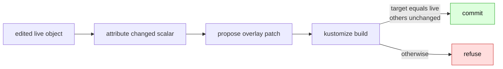

# Patch authoring: the remaining route for base-owned fields

> **active design** — path-based strategic-merge patches are now tolerated as read-only
> build context. This document covers the still-unshipped step: authoring a narrow patch
> when an overlay must change a field inherited from its base.
>
> Related: [support contract](support-contract.md),
> [render-root scoping](render-root-scoping.md), and
> [render attribution](render-attribution.md).

An external-base overlay must never write an inherited field into the shared base. For
an image or replica, the Kustomize declaration has an obvious editable home. For an
environment-specific env var, resource limit, or argument, it does not. A strategic-merge
patch is the only honest destination — but only after we can prove that the patch expresses
exactly the requested change.

## Current boundary

- A `patches:` entry using a local `path:` strategic-merge document is **tolerated**.
  It no longer refuses the whole overlay merely by existing.
- The patch document is **read-only context**. Changes to fields it owns are refused rather
  than guessed or written through.
- Inline patches, JSON6902 patches, deprecated patch spellings, and out-of-tree paths remain
  refused; they do not provide the narrow sparse-KRM unit this design relies on.
- **`$patch: delete` is now authored (shipped), as a slice distinct from field patching.**
  Deleting an object the overlay inherits from its base writes a small `$patch: delete` document
  under the overlay and names it in `patches:`, verified by the re-render oracle (the object must
  leave the render, everything else unchanged; a non-matching patch is refused). It needs no
  field attribution — the target is identified by apiVersion/kind/namespace/name — so it does not
  wait on the scalar-attribution work below. See
  [render-root scoping §1/§4](render-root-scoping.md). What is still refused is authoring a patch
  that *edits a field* of a base-owned object.

## Narrow first slice

Start with scalar replacement only:

- one rendered object with a unique overlay-local identity;
- a field whose source value can be attributed to the inherited base rather than an existing
  patch or transformer;
- a local strategic-merge patch file under the overlay, creating it only when its name and
  placement are deterministic;
- no list merge-key inference, deletes, renames, label selectors, or arbitrary structural
  changes.

The writer dyes candidate sources, proposes the smallest patch, then relies on the real
kustomize build as the decision procedure. A patch can be committed only when the target
render equals the edited live object and every other rendered object remains unchanged.
That proof is what permits a modest attribution heuristic; without it, patch creation is
too easy to get quietly wrong.

## Delivery sequence

1. Attribute base-owned scalar differences precisely enough to distinguish an existing
   patch from the base source.
2. Add a deterministic overlay-local patch file and a `patches:` path entry when needed.
3. Verify target equality and whole-build non-interference before the write plan commits.
4. Extend only from fixture-backed counterexamples. Lists, deletes, and non-scalar merges
   are separate decisions, not an automatic consequence of scalar support.

Until that work lands, the correct runtime behaviour is refusal with no base write. The
historical implementation prompt was removed because this concise page and the render-root
record now contain the live design and status.
