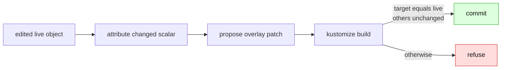

# Patch authoring: the remaining route for base-owned fields

> **active design** — path-based strategic-merge patches are now tolerated as read-only
> build context. This document covers the still-unshipped step: authoring a narrow patch
> when an overlay must change a field inherited from its base.
>
> **Two of the three delivery steps below already shipped, for a different reason.** The
> `$patch: delete` work built step 2 (author a patch file, name it in `patches:`) and the render
> oracle built step 3 (verify target equality and whole-build non-interference). What is left is
> step 1 plus a lifecycle the sequence does not mention. See
> [What already exists](#what-already-exists) — recorded 2026-08-31 so it is not re-derived.
>
> Related: [support contract](support-contract.md),
> [render-root scoping](render-root-scoping.md),
> [render attribution](render-attribution.md), and
> [layout shape 8](../../../test/fixtures/layout-corpus/shapes/8-base-owned-field-edit/README.md), which is this
> document's refusal as an executable scenario.

An external-base overlay must never write an inherited field into the shared base. For
an image or replica, the Kustomize declaration has an obvious editable home. For an
environment-specific env var, resource limit, or argument, it does not. A strategic-merge
patch is the only honest destination — but only after we can prove that the patch expresses
exactly the requested change.

```mermaid
flowchart LR
    L[edited live object] --> A[attribute changed scalar]
    A --> P[propose overlay patch]
    P --> K[kustomize build]
    K -->|target equals live<br/>others unchanged| C[commit]
    K -->|otherwise| R[refuse]

    classDef yes fill:#dfd,stroke:#3a3,color:#111
    classDef no fill:#fdd,stroke:#c33,color:#111
    class C yes
    class R no
```

## Current boundary

**The gate is a fail-closed allowlist, not a list of bad features.**
[`unmodelledFields`](../../../internal/manifestanalyzer/kustomization_parse.go) reflects over
kustomize's own `Kustomization` struct and marks the folder unsupported for **any non-zero field not
on the allowlist**. Nothing enumerates generators or plugins anywhere; they refuse because they are
not allowed, and a field a future kustomize release adds refuses on arrival rather than being
silently ignored. One consequence worth stating for this design: everything below is a property of
that allowlist, so moving a construct between rows is a deliberate edit to one function.

Three statuses, and the difference between the middle and the bottom row is the question this
document exists to move.

| Construct | Status | What that means |
|---|---|---|
| `namespace:` | **modelled** | read, and it supplies the namespace a document may omit |
| `resources:` (and `bases:`, which `FixKustomization` folds in) | **modelled** | read, and a new file is registered into it |
| `images:`, `replicas:` | **modelled** | read, **and authored into** — an edit to a base-owned image or replica count becomes an entry here |
| `patches:`, every entry a local sparse-KRM `path:` document | **tolerated** | read as build context. Never authored into. An edit to a field it owns is refused |
| `commonLabels:`, `labels:`, `commonAnnotations:` | **tolerated** | read. They inject metadata into every rendered object; `sourceForm` leaves that to the build so it cannot be absorbed back into a file |
| `metadata:`, `sortOptions:`, `generatorOptions:`, `buildMetadata:` | **tolerated (inert)** | render nothing on their own |
| a remote `resources:` entry | **refused** | `remote-base` — the render is not reproducible from the repository |
| an inline patch, in either spelling | **refused** | `patches-inline` — no file an authoring step could ever edit |
| a `patches:` path holding a JSON6902 op list | **refused** | `patches-json6902` — not a sparse KRM document |
| a `patches:` path outside the scanned tree, or unreadable | **refused** | `patches-outside-tree` — a file we never read is a file we cannot reason about |
| `patchesStrategicMerge:`, `patchesJson6902:` | **refused** | the deprecated spellings are **not** folded into `Patches` — measured, not assumed, and pinned by `TestParse_DeprecatedPatchSpellings` |
| malformed `images:` / `replicas:`, an unparseable file | **refused** | `malformed-images`, `malformed-replicas`, `unparseable` |
| `generators:`, `helmCharts:`, `components:`, `configMapGenerator:`, `secretGenerator:`, `replacements:`, `vars:`, `transformers:`, `namePrefix:`, `nameSuffix:`, `openapi:`, `crds:`, and every other field | **refused** | not on the allowlist. No named constant, no enumeration — absence is the refusal |

**`$patch: delete` is now authored (shipped), as a slice distinct from field patching.** Deleting an
object the overlay inherits from its base writes a small `$patch: delete` document under the overlay
and names it in `patches:`, verified by the re-render oracle (the object must leave the render,
everything else unchanged; a non-matching patch is refused). It needs no field attribution — the
target is identified by apiVersion/kind/namespace/name — so it does not wait on the
scalar-attribution work below. See [render-root scoping §1/§4](render-root-scoping.md). So `patches:`
is already half-authored: the object-level delete is written, and what is still refused is a patch
that **edits a field** of a base-owned object. **This document is the proposal to move the
`patches:` row from tolerated to modelled, for a narrow field set.**

### Why tolerated rather than refused

A reasonable objection: if a construct is not fully supported, why not refuse the folder outright
instead of declaring part of it read-only? The line is drawn at **whether the render is provable from
the repository**, and it holds for four reasons.

- **Tolerated is enforced, not trusted.** A change to a field a patch owns is refused at the write
  path against the actual render, and the object-level refusal shape is the same one every write
  boundary uses. The safety is identical to a folder refusal; only the blast radius differs.
- **It is safe because of `sourceForm`, and only because of it.** The projection leaves every field
  the *build* supplies to the build, so a patched base is not something the writer can absorb one
  environment's values into. Tolerating patches without that rule would be silent corruption no
  re-render could catch — the patch re-imposes its value, so the render comes out identical either
  way. The allowlist comment says so at the point of decision.
- **A structural refusal would be less precise than the check already running.** A patch's
  *presence* does not say which fields it owns; only the render does. "This folder has `patches:`, so
  refuse it" rejects a folder whose patch sets one label nobody will ever edit — the same shape as
  the `${...}` acceptance check that was built, measured against real content, and reverted in
  [#234](https://github.com/ConfigButler/gitops-reverser/pull/234). The render is computed anyway for
  the oracle, so folder-level refusal discards information already in hand.
- **`patches:` and `commonLabels:` are in a large share of real overlays.** Refusing on presence
  means the operator cannot be pointed at most base/overlay repositories at all, which is the
  adoption claim rather than an edge case.

**Where the objection is right, and it is not about safety.** A tolerated construct silently narrows
what a target can do, and **nothing in status says so today**. The user finds out per edit, later,
through a coarse target-level refusal with no per-edit record. That is a legibility gap, and the fix
is the post-scan validation pass and `status.placement` that
[the layout model](../../layout/model.md) already queues — report at scan time, while `suspend: true`,
that this folder holds N patch-owned fields whose edits will be refused. It gives what a refusal
would give, before anything is written, without making the repository unadoptable. Recorded here
because the reasoning otherwise lives only in a comment on the allowlist.

Refusing would also foreclose this document: tolerated is the state a construct can be promoted
*from*.

## What already exists

Measured against the tree on 2026-08-31, not recalled. Three of the four pieces a scalar slice
needs are built and in production use for other cases.

| Piece | Status | Where |
|---|---|---|
| Deciding this document is base-owned and this overlay may be authored into | **shipped** | `overlayAuthorKustomization` in [`plan_flush.go`](../../../internal/git/plan_flush.go) — returns the overlay's kustomization only when the matched file is out of the write jail and the overlay has a supported root of its own |
| Writing a patch file into the overlay and naming it in `patches:` | **shipped** | `authorInheritedDelete` + `AppendKustomizationPatch` — deterministic file name, a guard that refuses to clobber a path holding something else, `patches:` sequence created when absent, idempotent on resync |
| Proving the result | **shipped, and stronger than step 3 asks** | `VerifyBatchRenders` in [`render_verify.go`](../../../internal/manifestanalyzer/render_verify.go) renders *every* render target before and after and compares *every* object against the flush's declared intents. Whole-build non-interference is not a thing to build; it is the existing gate |
| Turning a live/rendered difference into the smallest patch document | **not built** | this is the slice |

So `$patch: delete` was not a detour: it is this design's step 2 and step 3, delivered against a
case that needed no attribution because an object's identity is enough to address it.

**Step 1 is also smaller than this document assumed.** The dye
([`dye.go`](../../../internal/manifestanalyzer/dye.go)) answers *which override entry supplied this
value*, which a field patch does not ask. The question here is whether an existing patch in this
overlay already owns this field path — a structural fact, read off the overlay's own `patches:` — and
an ambiguous answer is a refusal. §5's verdict, *attribution may be heuristic, verification may not*,
is what makes that acceptable: the oracle is the decision procedure, and the heuristic only decides
what to propose to it.

### The lifecycle the delivery sequence omits

**Authoring without updating is worse than refusing.** Once a field is patch-owned, this document's
current boundary refuses edits to it — so a slice that only ever creates a patch makes the *second*
change to the same env var fail, where today the first one already fails honestly. Three verbs ship
together or none of them do:

- **author** the patch when the field is base-owned and no patch owns it;
- **update** our own patch — identified by its deterministic name — when the value changes again;
- **retract** it, and its `patches:` entry, when the live value returns to what the base renders,
  or the repository accumulates dead patches that pin fields nobody is editing any more.

Retract is the one with teeth: a patch left behind keeps overriding the base after the reason for it
is gone, and nothing in the render says so.

## What a patch can and cannot express

The boundary is often stated as *"lists are the problem"*. That is close, and the sharper version is
worth having, because it decides the slice: **the problem is a list kustomize cannot address by a
key.** Strategic merge takes its merge keys from the openapi schema, so the answer is a property of
the type, not of our code. Verified against `k8s.io/api@v0.36.4`.

| Change | Expressible narrowly? | Why |
|---|---|---|
| `spec.template.spec.containers[name=web].env[name=LOG_LEVEL].value` | **yes** | `containers` merges on `name`, `env` merges on `name`. The patch names one container and one variable and touches nothing else |
| A container's `resources.limits.cpu` | **yes** | a map under a merge-keyed list |
| `metadata.annotations.foo`, a `data:` key on a ConfigMap | **yes** | plain map paths; no list is crossed |
| **Adding** an env var, a volume, a port | **yes** | merge-by-key adds an element it does not find. `volumes` (`name`), `ports` (`containerPort`), `volumeMounts` (`mountPath`) |
| A scalar under a map in a **CRD** with no schema | **yes** | maps merge regardless of schema |
| `args`, `command` | **expressible, but not narrow** | plain `[]string`, no `patchStrategy`, so merge semantics are **replace**: changing one argument pins the whole list |
| `tolerations` | same | no `patchStrategy` on the field |
| **Any** list inside a schema-less CRD | same | no schema means no merge key means replace |
| **Removing** one element from a list | **no** | needs element-level `$patch: delete` or `$deleteFromPrimitiveList`, a different slice from the object-level delete that shipped |
| Reordering a list | **no** | order is `$setElementOrder` territory |
| A rename, or a structural move | **no** | not a scalar edit at a stable path |

Row 6 onward is where the interesting judgment sits, and it is **not a correctness risk**. A
replace-semantics patch that reproduces the live object today passes the oracle honestly, because it
does render to the live object. What it also does is freeze that list against every future change to
the base — and the oracle cannot see that, because it only ever compares the present render. So the
failure mode for these rows is not a wrong write; it is **silent over-reach that surfaces months
later**, when a base gains an argument and one environment mysteriously does not.

That asymmetry is the argument for restricting slice 1 to the first five rows: not because the others
cannot be written, but because the oracle cannot vouch for them in the dimension that matters.

## Narrow first slice

Start with scalar replacement only:

- one rendered object with a unique overlay-local identity;
- a field whose source value can be attributed to the inherited base rather than an existing
  patch or transformer;
- a local strategic-merge patch file under the overlay, creating it only when its name and
  placement are deterministic;
- no list merge-key inference, deletes, renames, label selectors, or arbitrary structural
  changes.

The writer dyes candidate sources, proposes the smallest patch, then relies on the real
kustomize build as the decision procedure. A patch can be committed only when the target
render equals the edited live object and every other rendered object remains unchanged.
That proof is what permits a modest attribution heuristic; without it, patch creation is
too easy to get quietly wrong.

## Delivery sequence

1. Attribute base-owned scalar differences precisely enough to distinguish an existing
   patch from the base source. **Remaining**, and narrower than written: the question is
   ownership of a field path, not provenance of a value.
2. Add a deterministic overlay-local patch file and a `patches:` path entry when needed.
   **Shipped** by `authorInheritedDelete`; reuse it rather than rebuilding it.
3. Verify target equality and whole-build non-interference before the write plan commits.
   **Shipped** as `VerifyBatchRenders`; nothing to add.
4. Extend only from fixture-backed counterexamples. Lists, deletes, and non-scalar merges
   are separate decisions, not an automatic consequence of scalar support.

Plus the one the original sequence missed: **update and retract ship with author**, per the lifecycle
above.

**Cost, as a ballpark rather than a plan.** A spike over env vars alone is a couple of days, because
the seam and the oracle are both there. A slice worth shipping — scalars at map paths and under
merge-keyed lists, all three lifecycle verbs, fixtures, and the corpus scenario — is on the order of
one and a half to two weeks. The slope after that is gentle: a resource limit is the same builder
with a different path.

**Backing it out is cheap, and that is worth knowing before starting.** There is no API surface, no
CRD field, no migration, and no persisted state; disabling it returns to today's refusal. Patch files
already committed stay valid kustomize, and the operator would treat them as read-only context, which
is exactly what it does with third-party patches now. The durable commitment is not technical: it
moves the boundary from *we invert what kustomize declares* to *we author patches*, and people will
reason from that. Decide it deliberately rather than as a consequence of the slice being easy.

Until that work lands, the correct runtime behaviour is refusal with no base write. The
historical implementation prompt was removed because this concise page and the render-root
record now contain the live design and status.
