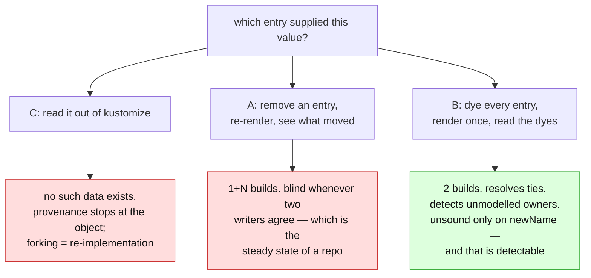

# Render attribution: which override entry supplied this value?

> **design** — direction-setting. Captured: 2026-07-14
> Related:
> [kustomize-support-boundary.md](kustomize-support-boundary.md) §4 — the decision to embed the renderer ·
> [render-root-scoping.md](render-root-scoping.md) — the oracle, and §6's tolerate-don't-author plan ·
> *patching-kustomize.md* (ConfigButler/kustomize-tracer, `plans/`) — **revises §4**: the fork is
> ~30 lines, and it is built ·
> [finished/images-and-replicas-edit-through.md](finished/images-and-replicas-edit-through.md) — what shipped ·
> [unreflectable-edits-and-write-gating.md](unreflectable-edits-and-write-gating.md)
>
> **Status: shipped (§7 stages 1-3).** `renderRootWith` is the counterfactual primitive;
> verification is a real re-render (`VerifyBatchRenders`); attribution is the dye (`dye.go`,
> `overrides_attribution.go`). `renderImage`, `imageSuppliers`, `simulateImageRender` and
> `isReplicaKind` are deleted, and **B1, B2 and B3** with them. Stage 4 (chain to set) is not
> done.
>
> Building it corrected two things, both marked below: **B4 is worse than recorded** (a
> rendered object is not a valid `unstructured` at all; `DeepCopyJSON` *panics* on the Go
> `int` kustomize returns), and **the rename-chain guard must use kustomize's compiled regex,
> not the string equality §3 proposed** (an entry `name:` is a regex, so `mirror/ap.` matches
> `mirror/app` without equalling it).
>
> §5's verdict, *attribution may be heuristic, verification may not*, is what made the rest
> safe to delete. But see *patching-kustomize.md* (ConfigButler/kustomize-tracer, `plans/`):
> the dye is now the **fallback** for an unpatched build, not the destination.

This document is the record of how attribution was decided: the approach we had settled on,
a second that is better, and a third that keeps getting proposed and cannot work. Each is
**measured against kustomize v0.21.1**, not argued from its source. §6 is the bug ledger the
measuring produced.

---

## 1. The question the renderer cannot answer

Routing an edit needs **attribution**: the live Deployment runs `web:2.0`, and we must
know *who supplied that `2.0`* — the source manifest, or an `images:` entry in one of the
kustomizations above it, and if an entry, **which one**. Only then do we know which file
to write.

A render does not tell us. `kustomize build` returns `web:2.0`; it never says where the
`2.0` came from. And that gap does not close by looking harder:

> **kustomize has no field-level provenance, anywhere, at any visibility level.** The
> image filter (`api/filters/imagetag/`) rewrites the field and records nothing about
> having done so. kyaml carries comment-based `SetBy` machinery
> (`kyaml/fieldmeta/fieldmeta.go:29`) and `api` never imports it. A build is a fold over a
> flat `ResMap` — each transformer mutates in place — so there is no value lineage to
> expose, and no API, exported or internal, that maps
> `spec.template.spec.containers[0].image` to the thing that wrote it.

So attribution cannot be *read out of* kustomize. It can only be *inferred by questioning*
it: perturb an input, render, see what moves. **Every viable design is a query strategy**,
and they differ only in how many questions they ask and how distinguishable the answers
are. That framing is the whole document.

### What kustomize does give us — and what #232 says about it that isn't true

`alpha.config.kubernetes.io/transformations` is object-level provenance, and #232 reads
the override chain off it. Right move; but the annotation is weaker than the code's
comments claim, in two measured ways.

| [`override_chain.go`](../../../internal/manifestanalyzer/override_chain.go) says | kustomize actually does |
|---|---|
| *"kustomize records the transformers that touched each resource"* | It records every transformer that **ran**, on **every object in the build**, modified or not (`api/resmap/reswrangler.go:527-548` loops the whole ResMap with no diff check). A ConfigMap no image transformer could touch still collects `ImageTagTransformer` records. |
| *"attributed per OBJECT, not per file"* | It is attributed **per build**. Every object in one build gets the same records. |

And it is coarser again. kustomize builds **one `ImageTagTransformer` per `images:` entry**
(`api/internal/target/kusttarget_configplugin.go:405-423`), but all N share one `*Origin`
whose `configuredBy` carries only `{apiVersion: builtin, kind: ImageTagTransformer}` — no
index, no image name, no field — and records are appended without dedupe. Measured: two
`images:` entries stamp **two byte-identical records** on every object. So
[`chainOf`](../../../internal/manifestanalyzer/override_chain.go), which appends *all* of
a file's entries once per record, builds a chain containing every entry **N times**.

Benign today (re-applying an entry lands on the same result) and not a reason to hold

**232.** But it means the annotation answers *"which kustomizations' transformers ran in the
pipeline that produced this object"* — never *"what touched this object"*, and **never
which entry**. The mechanism is sound; the comments describing it are not, and they should
be fixed rather than inherited.

---

## 2. Approach A — differential probing (leave-one-out)

The settled design: to find a value's supplier, **re-render the root with one entry
removed**; whatever moves is what that entry supplied. Walk the chain last-to-first so the
first hit is the last writer. `1 + N` builds per root.

Clean, needs no model of kustomize — and **wrong**. Not subtly: wrong on the two most
ordinary configurations in the wild, and measurably *worse than the code it replaces*.

**The idempotent pin.** A base holding `image: app:v1` under an overlay declaring
`newTag: v1` — the state every repo is in the moment a release lands in both places.

```text
source=app:v1, entry newTag:v1 PRESENT  ->  app:v1
source=app:v1, entry REMOVED            ->  app:v1     # nothing moved
```

Removal moves nothing, so the probe concludes *the source file supplies the tag*. The user
then sets `v2`; we write `v2` into the **base manifest**; the overlay's `newTag: v1`
overrides it straight back on the next render. The edit never lands — and never lands
again, on every reconcile, forever.

**The tie.** Two entries in the chain declaring the same tag:

```text
two entries, both newTag:v9   ->  app:v9
entry[1] removed              ->  app:v9     # nothing moved
```

Neither is attributable. Same outcome.

The cause is structural, not a detail to patch: **removal probes the *value*, and values
collide.** Attribution by "what changed" is blind to a writer whose write is invisible
because something else wrote the same bytes — and "the overlay pins the tag the base
already has" is not a corner case, it is the steady state of a GitOps repo.

The `renderImage` this replaced got both right, because it attributed by *position in the
chain* (last matching entry wins) and never compared values. So Approach A was not merely
imperfect: **shipping it would have regressed behaviour that already worked**, in exchange
for deleting the code that made it work. Worth saying plainly, because the design was settled
before the measurement contradicted it.

---

## 3. Approach B — the dye, and why it is Approach A done right

Put a **unique, self-identifying value into every override entry**, render once, read the
dyes off the output. Wherever a dye lands, *that entry supplied that field*.

```yaml
# what the user wrote            # what we render, in memory, once
images:                          images:
  - name: app                      - name: app
    newTag: v1                       newTag: grdye-0001
  - name: app                      - name: app
    newTag: v1                       newTag: grdye-0002
```

Render → `app:grdye-0002` → **entry 2 supplied the tag.** The tie removal cannot see, the
dye reads straight off the output. Measured, on both of §2's failing cases:

```text
idempotent pin, entry DYED   ->  app:grdye-0001         # attributed to the entry.  correct.
tie, both entries DYED       ->  app:grdye-0001 (=[1])  # the LAST writer.          correct.
```

This is not an alternative to differential probing — **it is differential probing with the
flaw removed.** Both perturb an input and watch the output. Removal perturbs an entry into
*absence*, and absence is indistinguishable from "someone else wrote the same value". A dye
perturbs it into a value **nothing else can produce**, so every writer stays
distinguishable — and because the dyes are mutually distinguishable, they can all go in at
once: **2 builds per root, constant in N**, instead of `1 + N`.

The cost win is real but secondary, and I don't want the design sold on it: N is small and
builds are milliseconds. The dye is right because it is **correct**, not because it is
cheap.

### Measured: kustomize does not validate the dye. It *matches* on it

The obvious objection — "a tag can't hold that" — is half false, and the instinct to insert
*long describing strings* is closer to viable than it deserves to be. There is **no
validation of `newTag` or `digest` anywhere in kustomize**. Measured: a 200-character tag,
a tag containing `/` and `#`, a tag containing `:`, and a digest of `gr-probe-0002` that
isn't even sha-shaped all render straight through, verbatim.

But **the matcher is a regex over the whole image string**, and that is where the freedom
ends (`api/internal/image/image.go:17`):

```go
pattern, _ := regexp.Compile("^" + name + "(:[a-zA-Z0-9_.{}-]*)?(@sha256:[a-zA-Z0-9_.{}-]*)?$")
```

An out-of-charset dye leaves the image un-matchable, so **every later entry silently stops
firing** — no error, a different render. Measured:

| dye | renders | next entry (`newTag: FINAL`) |
|---|---|---|
| `newTag: zzprobe-1` | `nginx:zzprobe-1` | ✅ applies |
| `newTag: "zz/probe"` | `nginx:zz/probe` | ❌ **silently skipped** |
| `digest: zzprobe-4` | `nginx@zzprobe-4` | ❌ **silently skipped** |
| `digest: sha256:zzprobe4b` | `nginx@sha256:zzprobe4b` | ✅ applies |

So the charset is not a style preference, it is a **correctness requirement**, and it is
narrow enough to state once and enforce in one place:

- **tag** → `[a-zA-Z0-9_.{}-]+`. Still roomy enough to be self-describing:
  `grdye.0007.overlays-prod.images-2.newTag` is legal.
- **digest** → `sha256:` + `[a-zA-Z0-9]+`. The prefix is **mandatory** — the regex requires it.
- **replica count** → a reserved integer (`2_000_000_000 + n`). Measured: renders through untouched.
- **`name:` → never dye it.** It is a raw regex (`name: "ngin."` matches `nginx` — measured),
  and a malformed one **nil-derefs kustomize** (§6, P1).

Collisions with real values are excluded by construction and *checkable* for free: we hold
the undyed render too, so "this nonce appears nowhere in the real output" is an assertion,
not a hope. And the dye is applied to the typed `kustypes.Kustomization` — the same struct
[`withBuildMetadata`](../../../internal/manifestanalyzer/kustomize_render.go) already
re-serialises — so YAML quoting is the encoder's problem, not ours. (It has to be: `newTag: y`
is a YAML **boolean**, and kustomize's own `Unmarshal` rejects it. Measured.)

### The soundness condition, stated exactly

A dye is a counterfactual, and it is sound exactly when the dyed field is a **pure sink** —
never an input to a matcher.

| Dyed field | Sink? | Measured |
|---|---|---|
| `newTag` (in charset) | ✅ | dyeing a tag never changes whether a later entry matches |
| `digest` (sha256-prefixed) | ✅ | same |
| `replicas[].count` | ✅ | nothing selects on a count |
| **`newName`** | ❌ | **it is the join key for every later entry** |

The last one bites, and it is the reason the dye needs a guard rather than a caveat:

```text
images: [{name: app, newName: renamed}, {name: renamed, newTag: "4.0"}]
undyed          ->  renamed:4.0
newName DYED    ->  grdye-0000:v1        # entry 2 stopped matching. the render changed shape.
tag-only DYED   ->  renamed:grdye-0001   # correct, even inside a rename chain
```

The mitigation needs no model of kustomize's matching, only string equality over fields
kustomize already parsed for us: **dyeing `newName` can only change a matching decision if
some entry's `name:` matches some other entry's `newName:`.** Where no rename chain exists
(essentially every real repo), dye names too. Where one does, don't dye names in that root —
probe them by removal, or refuse. A confound you can *detect* is a confound you can manage.

### What the dye buys that nothing else does

It separates **"no entry supplies this field"** from **"something we do not model supplies
this field"**. A `patches:` entry (or a `replacements:` block) that clobbers the image
field *erases the dye*. No dye, and the value differs from source → an unmodelled owner
exists → refuse, don't route.

The code this replaced could not make that distinction. `simulateImageRender` "verified" the
inversion against a simulation that **shared its own blind spot**, so a value owned by a patch
was confidently written into a file that does not own it. Path-based `patches:` are now
tolerated as read-only context: the folder renders, while a field the patch owns is refused
per field. Per-field refusal requires attribution. **The dye is the mechanism that milestone
is waiting for**, which puts it on the critical path rather than beside it.

And the technique was never about images, so it *can* generalise — to a `vars` value, a
`replacements` source, a generator literal, a scalar inside a patch. But "any knob" is
exactly the overclaim this design must not make. **Each new field costs a sink proof.**
Dyeing is sound only where the dyed value is a pure sink (below), and the fields worth
reaching for next are precisely the ones most likely not to be: a `replacements` source is
read *by* a selector, a generator literal feeds a *name hash*, and a patch's `containers[].name`
is a merge key. Extending the dye to a field means showing that field is a sink and keeping
the baseline-first guardrail (§7) that catches it when the showing is wrong — not assuming
the mechanism travels for free.

Within that bound it remains the only field-level provenance available for kustomize at any
price, and it costs one build.

---

## 4. Approach C — "just get the DAG out of kustomize"

Two different graphs hide under this, and separating them settles it.

**The base/accumulation DAG** (which kustomization includes which) is real, and we should
take whatever kustomize will give us — which is exactly what #232 does. But there is no API
for it: `KustTarget` and `ResAccumulator` are under `api/internal/`, `krusty.Run` returns a
**flat** `ResMap`, and — the part worth internalising — **even internally there is no DAG
object**. `accumulateTarget` merges children depth-first into a flat accumulator; the graph
is *control flow*, never a retained structure. What survives a build is per-resource
annotation: `config.kubernetes.io/origin` (which file) and `configuredIn` (which
kustomization). We reconstruct what we need from those.

**The dataflow DAG** (field ← entry) is the one we actually want, and it **does not exist
in kustomize at any level**. Not exported, not internal, not computed-and-discarded —
never computed. §1 says why.

So "get it from the source" reduces, stated honestly, to **fork kustomize and add
provenance**: vendor `internal/builtins` and `internal/image`, thread an origin through the
filters, redo it every bump. That is re-implementation wearing a better hat, and it fails
in precisely the way §7 decided to stop failing — *our fork's semantics are not the
semantics Flux ships*. The reason to embed kustomize was to stop having a second opinion
about what a folder renders to. Forking it re-creates the second opinion and adds a
maintenance bill.

There is one legitimate version of the idea, and it is upstream: propose field-level
provenance to kustomize (`buildMetadata: [fieldOriginAnnotations]`). `kustomize edit` would
benefit too. Worth an issue; not worth blocking on — and the dye is what we would build in
the meantime regardless.



---

## 5. Attribution may be heuristic. Verification may not

None of the above is the safety property, and the difference has to be explicit, because it
is what makes it safe to prefer a cheaper, less-than-total attribution.

The safety property is the one [render-root-scoping.md §3](render-root-scoping.md) already
names: **apply the proposed entry edits and the projected source document in memory,
re-render, and require the result to reproduce the live object exactly — and to leave every
other object in the build byte-identical.** That check is total, and it does not care how
the proposal was arrived at.

So attribution's job is only to produce *a candidate good enough to usually pass*. When a
dye's precondition fails, or a rename chain defeats it, we route nothing, and the proposal
falls to what the source document alone can carry — which the re-render then adjudicates.

It is worth being exact about that, because "we fall back to today's write-through" is the
comfortable phrasing and it is not quite true. Writing a live value into a source document
whose field an **entry governs does not converge**: the entry overrides it on the next
render, which is the same non-convergence §2 convicts leave-one-out of. What makes the
fallback safe is not that write-through is harmless — it is that the verification re-render
*catches* it: the proposed source write does not reproduce the live object, so the flush is
refused instead of landing and quietly doing nothing forever.

That is what licenses reasoning probabilistically at all, and it is exactly why
`simulateImageRender` must die. It is a verification step that shares the blind spot of the
thing it verifies — it replays *our* chain, not kustomize's, over only the images it planned —
so it cannot catch this, and it converts a wrong attribution into a *confident* wrong write.

**Replace the simulation with a real re-render first, before anything else changes.** Then
every later deletion in this workstream is protected by a check that cannot share the bug it
is checking for.

---

## 6. The bug ledger: what the probes found

> **All of it is closed.** P1 and C1 shipped in #232. **B1, B2 and B3 are not fixed — they are
> DELETED**, along with the `renderImage` / `isReplicaKind` / fieldspec code that caused them
> (see [UPGRADING.md](../../UPGRADING.md)). B4 was found to be worse than recorded and is
> handled by a type switch (`renderedReplicaCount`) plus a JSON normalisation in the tests.
> The ledger is kept as written, because *how* each was found is the argument for the method:
> not one came from reading kustomize's source. Every one came from asking it.

Every stage of this workstream found a shipped bug by making kustomize the arbiter. Writing
this document found more — none by reading code, all from ~60 lines of throwaway probe
against the existing `imageFixture` harness. **P1 and C1 block #232.**

| | What | Measured | Effect |
|---|---|---|---|
| **P1** | **`images[].name` is a raw regex, and kustomize discards the compile error** (`pattern, _ := regexp.Compile(...)`, then dereferences it). A malformed name — `- name: "ngin["` — **nil-derefs inside the build**. | `*** PANIC *** invalid memory address or nil pointer dereference` | krusty has no non-test caller on `main`; **#232 is what makes it reachable**, from the store build, on **user-controlled repo content**. controller-runtime recovers reconciler panics by default (v0.24.1), so the operator does not die — it hot-loops: panic → recover → requeue → panic, forever, on a GitTarget nobody can fix except by editing the repo. The `manifest-analyzer` CLI has no such net and simply crashes. **Merge blocker. Also a genuine upstream kustomize bug — worth the PR.** |
| **C1** | **A disconnected cycle has no render root.** For `a → b → a`, every directory is referenced, so `renderRoots` returns nothing, `renderChains` builds nothing and records **no failure**. (Found by CodeRabbit on #232; confirmed here.) | `renderRoots=[]`, `renderChains → 0 chains, 0 failures`. Asked directly, kustomize says `cycle detected` | This is the exact hole #232's own comment says it closes: *"a root that does not build yields no chain, so no ambiguity is recorded, so the write-fan-in guard never fires."* An unbuildable component bypasses the refusal path entirely. **Merge blocker.** |
| **B1** | **Our matcher is string equality; kustomize's is that regex over the full image string.** Two witnesses: an entry whose `name:` carries a tag (`- name: app:v1`) matches in kustomize and not in ours; and `- name: "ngin."` / `- name: ".*"` match in kustomize and not in ours. | `kustomize=nginx:X`, `renderImage=nginx:v1` — **diverge** (all three forms) | We believe the folder renders `app:v1` where it renders `app:X`. The projection reads the difference as a user edit, writes `app:X` into the **source manifest**, and silently kills the `images:` entry (it now matches nothing). Same species as the digest/tag corruption in #231. **Shipped.** |
| **B2** | **ReplicationController.** kustomize's replica fieldspec is `[Deployment, StatefulSet, ReplicaSet, ReplicationController]`; [`isReplicaKind`](../../../internal/manifestanalyzer/overrides_projection.go) lists three of four. | `count: 7` applied to an RC by kustomize; our projection sees no governing entry | A scale on an RC governed by a `replicas:` entry gets written into the source document, where the transformer overrides it. Non-converging drift, silently, forever. **Shipped.** |
| **B3** | **`ephemeralContainers` and OCI volume images.** kustomize's traversal is *any element of any `containers`/`initContainers` sequence, at any depth* ∪ a fieldspec including `spec/volumes[]/image/reference` — it does **not** touch `ephemeralContainers`. [`collectContainerSlots`](../../../internal/manifestanalyzer/overrides_projection.go) collects `ephemeralContainers` (kustomize won't rewrite them) and misses OCI volume images (kustomize will). | rendered: `containers[0].image=app:DYED`, `ephemeralContainers[0].image=app:v1`, `volumes[0].image.reference=app:DYED`; we collect the first two and not the third | Both directions produce a field we mis-attribute. Low blast radius today; it is the *fieldspec* being re-derived, which is the thing we are deleting. |
| **B4** | Rendered objects carry Go **`int`**, not `int64`. `unstructured.NestedInt64(rendered, "spec", "replicas")` returns **`found=false`**. | `value=2000000001 found=false gotype=int` | Not a bug — a landmine directly under step 1 of the plan ("attach the rendered object to each document"). The first code to read a number off a rendered object with the standard helper silently gets zero. |

**B1, B2 and B3 exist only because `renderImage`, `isReplicaKind` and `collectContainerSlots`
exist.** They are not bugs to fix; they are bugs to *delete*. That is this workstream's
argument, made three more times — and it is a warning about
[`kustomize_render_semantics_test.go`](../../../internal/manifestanalyzer/kustomize_render_semantics_test.go):
eleven hand-picked hard cases, and B1 is not among them. **A table of cases we thought of is
not a substitute for making kustomize the arbiter at runtime.** The probe rows belong in that
table — where they will fail — and then get deleted along with the code they indict.

One near-miss worth recording: `tagSuffix` looked like another B1, and it is not.
[`imageOverrides`](../../../internal/manifestanalyzer/kustomization_parse.go) refuses any
entry declaring it, on purpose, with a comment saying exactly why. The fence works where
someone thought to build it. (For the record, kustomize applies `tagSuffix` **twice** —
`nginx:v1` → `nginx:v1-debug-debug` — because two filters run per entry. Nobody would have
re-implemented *that* correctly, which is the thesis in one line.)

---

## 7. The shape of the change

**The primitive** — all three approaches need it; it is the entire new API:

```go
// renderRootWith builds rootDir with `replace` layered over the scanned files: the
// counterfactual render. Dyed entries, proposed edits, and the verification re-render
// are the same call with a different overlay.
func renderRootWith(files []manifestedit.FileContent, rootDir string,
    replace map[string][]byte) ([]renderedObject, error)
```

**In order. Each stage is independently shippable, and the risky one is last:**

0. **Land #232 clean** — P1 and C1 first. Neither is optional: one hot-loops a GitTarget on
   a hostile repo, the other silently disarms the write-fan-in guard. Fix the annotation
   comments (§1) while there.
1. **`renderRootWith`.** `renderRoot` becomes it with an empty map.
2. **Verification by real re-render** — delete `simulateImageRender`. Attribution still comes
   from `renderImage`, so no routing changes; it only makes everything after it safe. *Ship
   this alone if the rest slips.*
3. **Attribution by dye** — one dyed render per root at store build; a side table mapping
   nonce → (kustomization path, entry index, field); names dyed only when the rename-chain
   guard is clear. Delete `renderImage`, `imageSuppliers`, `isReplicaKind` — and with them
   B1, B2, and the fieldspec half of B3.
4. **The chain shrinks to a set.** With dye attribution, `KustomizeOverrides` no longer needs
   to be an *ordered chain* — order is kustomize's problem now. It needs only the *set* of
   entries and where they live, so §1's N-fold duplication stops mattering, and the fan-in
   ambiguity test can become the sharper question it was always trying to ask: *do two roots
   attribute this field to different entries?*

**The test net.** The 12 `TestSplitDesired_*` tests construct `(gitRaw, desired, overrides)`
by hand and must be rebuilt **in the same change** that changes the signature. Rebuild them
against real fixtures: build a small in-memory tree, render it with kustomize, drive the
projection with the result. They stop testing our re-derivation and start testing an
inversion against ground truth — the only kind that would have caught B1, #231, or the digest
bug.

**Guardrails the dye needs** (all measured; see §8 for provenance):

- **Baseline first, then dye.** If the dyed build errors where the real one didn't, that is
  the `replacements`-consumes-the-image class, and it is reliably detectable. **"Fall back"
  means fall back to NO ATTRIBUTION — never to another heuristic.** Not to `renderImage`, not
  to leave-one-out, not to a guess at the last matching entry. Those are the silent-corruption
  paths this design exists to delete, and reaching for one at the moment the renderer says *I
  cannot tell you* is the worst possible time to trust them. No attribution means no entry
  edits; the proposal is then whatever the source document alone can carry, and it still has
  to survive the verification re-render (§5) — which, for a field an entry governs, it will
  not. The edit becomes a refused flush. That is the correct outcome and it must be reported,
  not absorbed.
- **Only read the dye in the fields you are attributing.** Never grep the whole output: `vars`
  and `replacements` can leak a dyed value into `args`, `env`, or ConfigMap data.
- **Never align real↔dyed objects by resource name.** A generator hash suffix can drift
  between the two builds.
- **Only dye an entry that already declares the field.** Injecting a `newTag` into a
  `newName`-only entry fabricates a supplier that does not exist.

**Honest costs.** Two builds per render root at store build (was one), one more at flush for
verification. Milliseconds on these trees — but the flush one is on the hot path, and whether
store-build renders can be cached across reconciles is an **open question, not an answered
one**.

---

## 8. Open

- **A dyed value can escape the field we dyed** — this is measured, not speculative.
  `replacements` may take a container image as its **source** (`fieldPath:
  …containers.[name=app].image`), and `vars` may `fieldref` it. Consequences seen: a
  `delimiter`/`index` on a replacement source **fails the dyed build** where the real build
  succeeds (`options.index 2 is out of bounds`); a replacement target pinned to
  `[image=nginx:1.21.0]` **errors** under dye; a `vars` fieldref silently carries the dye into
  `args`. All three are caught by the baseline-first guardrail, and none is silent — but the
  guardrail is load-bearing, not belt-and-braces.
- **Never dye a merge key.** A patch's `containers[].name` is a selector. The sink/selector
  distinction (§3) is the rule, and it must be restated for every field the dye is extended to.
- **Version skew** — unchanged and unfixable: we render with the kustomize we pinned; Flux
  renders with theirs.
- **P1 is an upstream bug.** `pattern, _ := regexp.Compile(...)` followed by a dereference, in
  `api/internal/image/image.go`. Report it; a two-line fix upstream is worth more than our
  workaround, and we need the workaround anyway.
- **B1 and B2 are shipped**, and want `fix:` commits plus an [UPGRADING.md](../../UPGRADING.md)
  entry, whether they arrive as fixes or as deletions.
