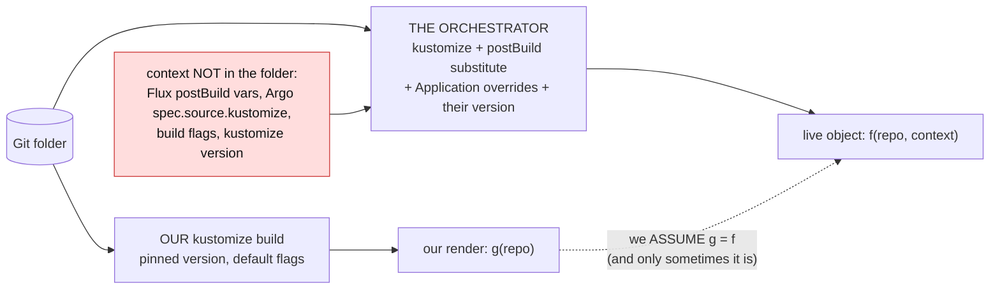
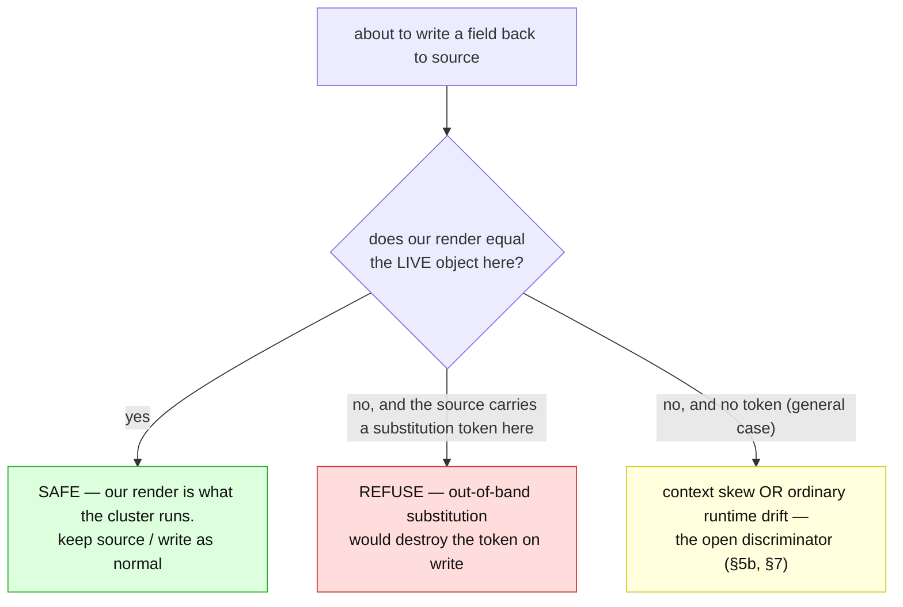

# Render fidelity: our render is not the orchestrator's

> **design** — direction-setting; ships no code. Nothing it describes is supported today.
> Captured: 2026-07-15
> Related:
> [README.md](README.md),
> [render-root-scoping.md](render-root-scoping.md) §3 — the version-skew caveat this generalises,
> [render-attribution.md](render-attribution.md) §5 — *attribution may be heuristic, verification may not*, and the "shared blind spot" failure,
> [orchestrator-knowledge-boundary.md](orchestrator-knowledge-boundary.md) — reading the Flux/Argo object; the `TransformedOutOfBand` claim,
> [gittarget-granularity-and-cross-environment-edits.md](gittarget-granularity-and-cross-environment-edits.md),
> [finished/images-and-replicas-edit-through.md](finished/images-and-replicas-edit-through.md)

We run `kustomize build` on the folder. Flux and Argo run kustomize on the folder **plus a layer
of context that is not in the folder** — so the object the cluster runs is not the object our
render produces, and every guarantee we make by rendering is only as good as that gap being empty.

This document names the gap, records a fence that looked obvious and was **wrong** (and why), and
proposes the fence that is right: **measure our render against the live object, and refuse where
they disagree.** It is the same discipline as the rest of this workstream — do not reason about
what the renderer does, ask it — applied one level up: do not assume our render is the
orchestrator's, *check* it.

---

## 1. The context the folder does not hold

Grounded against the vendored trees, not assumed:

- **Argo CD** keeps a *second kustomize layer in the Application object*, not the repo:
  `spec.source.kustomize` overrides `images`, `replicas`, `patches`, `components`, `nameSuffix`,
  `namePrefix`, `commonLabels`, `commonAnnotations`, `namespace`, and even the kustomize **`version`**
  (measured in the vendored `argo-cd/pkg/apis/application/v1alpha1/types.go:723`, under
  `external-sources/`). A folder we render to `X`, Argo can apply as `Y` — with the very features we
  build edit-through around (`images`, `replicas`, `patches`) supplied from a place we never read.
- **Flux** runs `postBuild.substitute` / `substituteFrom` **after** the build, replacing `${var}`
  tokens from cluster ConfigMaps/Secrets (measured in the vendored `flux2/internal/build/build.go:631`,
  `kustomize.SubstituteVariables`), plus `targetNamespace` and object-level `patches`/`images` on the
  Kustomization.
- **Both** run *their* kustomize version with *their* build flags (Argo's `kustomize.buildOptions`),
  possibly through a config-management plugin.

So `applied = f(repo, orchestrator-object, their-kustomize)`, while we compute `g(repo, our-defaults)`.
`g = f` only when the orchestrator adds no context. That is common — but not guaranteed, and **we
cannot tell from the repo which case we are in.**



This is not a new admission. [render-root-scoping.md §3](render-root-scoping.md) already concedes a
*version*-skew caveat — the guarantee is only *"this renders to what you edited, under the kustomize
we pinned."* This document generalises it: **it is not only the version that can differ, it is the
whole render context**, and version is the *least* likely axis to bite.

---

## 2. Why it bites, and why the source-form fix does not close it

The [source-form projection](finished/images-and-replicas-edit-through.md) stops **our** render's
output leaking into the source: where the live object and *our* render agree, the source keeps its
bytes. But context we do **not** render makes `live ≠ our-render` for a reason that is *not a user
edit* — and the projection has no way to tell the two apart. It reads the divergence as an edit and
writes the orchestrator's value into the source.

Concretely, with Flux `postBuild`:

```text
git source:   env REGION = ${REGION}
our render:   env REGION = ${REGION}      (kustomize never touches a ${...} token)
live object:  env REGION = us-east        (Flux substituted it from a cluster ConfigMap)
```

The projection sees source == our-render (`${REGION}`) but live differs, concludes the user set
`us-east`, and **writes `us-east` into the source — destroying the `${REGION}` parameterisation.**
Next reconcile, Flux substitutes again (now a no-op, the value is already literal), so it *looks*
converged while the template is gone; change `REGION` later and the file no longer follows.

And the oracle does not catch it. [`VerifyBatchRenders`](../../../internal/manifestanalyzer/render_verify.go)
re-renders the write with **our** kustomize, which also leaves `${REGION}` literal — so it agrees
with the corrupt write. This is precisely the failure
[render-attribution.md §5](render-attribution.md) warns about — *a verification that shares the blind
spot of the thing it verifies* — one level up: **our whole renderer shares the orchestrator's blind
spot.**

---

## 3. What we learned: the structural `${...}` check is the wrong fence

The obvious fence is structural and cheap, and it was tried (and reverted): refuse, at the
acceptance gate, any managed document whose values carry a `${...}` token. It is wrong, and the way
it is wrong is the reason the right fence looks the way it does — so it is recorded here rather than
quietly dropped.

**`${...}` is ambiguous, and the repo cannot disambiguate it.** The same token is, with equal
frequency:

- **literal, and safe to mirror** — a CRD schema `description` (the Flux Kustomization CRD documents
  postBuild with `${var:=default}` *in its own schema text*), a KRO `${schema.spec.*}` template, an
  nginx or envsubst ConfigMap. In every one of these the **live object carries the token verbatim
  too** — nothing substitutes it — so `live == our-render` and there is no risk at all.
- **substituted, and dangerous** — the Flux `postBuild` case of §2, where live is `us-east` and our
  render kept `${REGION}`.

A structural check fires on both, and the measurement was unambiguous: **it broke CRD mirroring
outright.** The acceptance gate is all-or-nothing over a folder, so a single CRD whose description
merely *mentions* `${var:=default}` refused the entire folder — every unrelated write with it. A
folder of ordinary CRDs (Flux, cert-manager, prometheus-operator all ship `${}` in their schemas)
became unmanageable. This is not "over-refuse a little and be right"; it is breaking a core feature.

**The lesson is not "narrow the regex."** No structural refinement helps, because the
discriminator — *was this token actually substituted?* — **is not in the repo.** A CRD's
`${var:=default}` and a Deployment's substituted `${REGION}` are identical on disk; they differ only
in whether the *cluster's* copy still holds the token. The fence therefore cannot be structural, and
cannot live at the structure-only acceptance gate.

> A smaller lesson, recorded so it is not relearned: `task test-e2e 2>&1 | tail -N` reports `tail`'s
> exit status (0), not the suite's — a failing suite read as green. Capture the full log, or assert
> on the summary line.

---

## 4. The right fence: measure against the live object

The discriminator we lack on disk, we already hold at write time: **the live object *is* the
orchestrator's render.** It is what the orchestrator actually applied — postBuild, overrides, its
kustomize version, all of it. So we need not *predict* the orchestrator's context; we can *observe
its output*.

> **Our edit-through is sound exactly where our render equals the live object at the fields we did
> not set out to change. Where it does not, the orchestrator did something we cannot see — refuse,
> do not guess.**

This is the workstream's own method, one level up. The dye measures *which entry supplies a value*;
the oracle measures *whether a write reproduces the live object*; this measures *whether our render
is even the right baseline to reason from*. And it is **precise where the structural check was
blunt** — same tokens, opposite verdicts, each correct because it is read off the live object rather
than guessed from disk:



| document | token | our render vs live | structural check | render-vs-live |
|---|---|---|---|---|
| Flux CRD, `${var:=default}` in a description | yes | **equal** (live has it too) | ❌ refused (wrong) | ✅ mirror |
| KRO RGD, `${schema.spec.*}` template | yes | **equal** | ❌ refused (wrong) | ✅ mirror |
| nginx ConfigMap, `${host}`, no postBuild | yes | **equal** | ❌ refused (wrong) | ✅ mirror |
| Deployment env `${REGION}`, Flux postBuild | yes | **differ** (`us-east`) | ✅ refused | ✅ refuse |

---

## 5. Two shapes of the fence, and which to build first

### 5a. The precise instance — refuse a write over a diverged token

The cheapest correct fence, and the one with **no false positives**: *when a write would replace a
source value that still carries a `${...}` token with a different live value, refuse it.* This is the
render-vs-live rule scoped to the one case we can be certain of. kustomize provably never touches a
`${...}` token, so **our render always keeps it**; if the live object has a *different* value there,
something out of band changed it — not the user, not our build. It catches the Flux
postBuild / envsubst class, per field, and it fires on none of the literal-token documents in §4's
table, because there the live value still *is* the token.

It applies to **any** mirrored document, not only kustomize-governed ones: for a plain folder our
"render" is the source itself, so the rule reduces to *"live differs from a source token ⇒ refuse,"*
which is exactly right for a plain folder Flux deploys with postBuild.

### 5b. The general version — our render must reproduce live for the untouched set

The broader fence catches more than tokens — Argo `spec.source.kustomize` overrides, version skew,
anything that makes the applied object differ: *before trusting our render as the baseline, require
it to reproduce the live object for every field the write does not deliberately change.*

It is strictly more powerful and strictly harder, for one honest reason: **a live object legitimately
drifts from Git for reasons that are not out-of-band render context.** An HPA changed `replicas`; a
defaulting webhook filled a field; another controller populated something. A naive *"live ≠ render ⇒
refuse"* would abort a flush because an HPA scaled a Deployment — which is not ours to police.
Distinguishing *context skew* from *ordinary runtime drift* is the open problem of the general fence
(§7), and it is why **5a is the right thing to build first**: it sidesteps the problem entirely by
keying on a token kustomize is *guaranteed* never to produce.

---

## 6. Two surfaces of the one measurement

The measurement — *does our render equal the live object?* — needs the live object, so it runs at
**reconcile time**, where the operator holds both the Git content and the watched live state. That
rules out only the **structure-only** acceptance gate (the CLI scan, the initial dry validation),
which has no cluster to look at — the trap the reverted structural check fell into. It does **not**
rule out the operator, which has live state in hand on every reconcile. And once the measurement runs
there, the answer is worth exposing two different ways.

### 6a. A per-write refusal (§5)

Point-in-time, per field: a write that would overwrite a source token whose live value diverged is
refused, in the family of `WriteBoundaryRefused`, naming the file, field, and token. This is the guard
that stops the corruption at the moment it would happen. It sits beside the source-form projection —
that decides *keep-source vs write-live* per field; this turns a *write-live* into a refusal when the
field it would overwrite holds a token the live object no longer has. It is per field, per object, so
one diverged token refuses one write, never a whole folder (the failure that broke CRD mirroring).

### 6b. A GitTarget status you can read *before* you edit

The same measurement, aggregated to the folder and surfaced as a standing **GitTarget condition** —
e.g. `RenderFaithful` — answers a more fundamental question than any single write does:

> **Do we even have a chance of tracking this folder?**

Because if our render does not match what the cluster runs, *nothing* we do on the folder is
trustworthy — not the mirror, not edit-through, not the refusal decisions themselves — since all of
them reason from a baseline that is wrong. A per-write refusal tells you *this edit* could not land; a
`RenderFaithful=False` condition tells you *this whole folder* is deployed with context we cannot
reproduce (Flux postBuild, Argo `spec.source.kustomize`, a divergent version), so you learn it **up
front, from status, before you waste an edit** — rather than one refusal at a time.

It carries a bounded sample of the diverging `(file, field)` pairs, in the style of the
`FullyReflected` condition in
[unreflectable-edits-and-write-gating.md](unreflectable-edits-and-write-gating.md), and it is a
sibling of that condition: `FullyReflected` says *everything you edited was expressed*;
`RenderFaithful` says *our render matches what is running, so we can be trusted at all* — the more
fundamental of the two. It is recomputable: the mark-and-sweep resync rebuilds it from scratch,
steady-state events keep it current.

This is exactly what the reverted structural check was reaching for and could not have — a
folder-level *"can we track this?"* verdict. It failed because it tried to answer from the **disk**;
the same question, answered from the **live object**, is both correct and precisely the up-front
signal a user wants.

### How it composes with the oracle

`VerifyBatchRenders` checks our render reproduces live **after** a write, sharing our render's blind
spot. The fidelity measurement checks our render reproduces live **before** it, at the fields we are
not touching — catching the blind spot the oracle cannot.

---

## 7. Open questions

- **Does `RenderFaithful=False` block, or only inform?** (§6b) A folder we cannot render-faithfully
  is one where edit-through is unsafe — but the *mirror* (audit, drift reporting) may still have
  value even when writes must be refused. So: does the condition gate adoption (`Ready=False` /
  `GitPathAccepted=False`, the folder is not tracked at all), or does it stay a non-blocking
  observability signal (`Ready=True`, the folder is mirrored, but edit-through is refused per §5)? The
  honest lean is non-blocking-but-loud — keep the read-only value, refuse the writes, and say so — but
  it is a real decision, and it is the one that most changes the product's shape.
- **5a vs 5b, and sequencing.** 5a (token) is precise and cheap — build first. 5b (general
  render-vs-live) is the complete answer but needs the runtime-drift discriminator before it is safe.
- **The runtime-drift discriminator.** Can we separate "an HPA changed replicas" from "postBuild
  changed an env" without hand-written per-field policy? **`managedFields` looks promising and should
  be measured**: a field owned by the GitOps controller's apply is render context; a field owned by
  `hpa`, `kubelet`, or a defaulter is drift. If that holds, 5b becomes safe.
- **Argo overrides leave no token.** `spec.source.kustomize.images` produces no `${}`; only 5b — or
  orchestrator awareness — catches it. Is it acceptable to catch the token class first and the
  Application-override class later, or do they need to land together?
- **Orchestrator awareness as the third, most complete fence.** Reading the Flux Kustomization / Argo
  Application (the [interpreter model](orchestrator-knowledge-boundary.md)) would let us *know*
  postBuild/overrides are configured and refuse — or eventually model — them directly, emitting the
  `TransformedOutOfBand` claim that doc already reserves. It is the most work; 5a is the same
  protection for the substitution class **without** reading the orchestrator's object.
- **Version skew.** Neither fence fully catches a pure version difference that changes a render
  subtly but touches nothing we compare; [render-root-scoping.md §3](render-root-scoping.md)'s "pin
  to the version Flux ships" stays the mitigation. 5b *does* catch a version difference that actually
  moves an untouched object.
