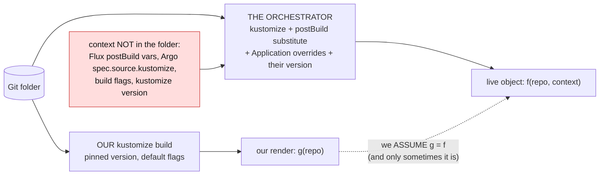

# Render fidelity: our render is not the orchestrator's

> **design + implementation record** — the token form of this fence (5a), its write gate,
> condition, and fixture suite shipped on 2026-07-15. The general fence (5b), remote-Git
> revision detection, and the orchestrator reconcile barrier remain design work.
> Captured: 2026-07-15; implementation status updated: 2026-07-15.
> Related:
> [README.md](README.md),
> [render-root-scoping.md](render-root-scoping.md) §3 — the version-skew caveat this generalises,
> [render-attribution.md](render-attribution.md) §5 — *attribution may be heuristic, verification may not*, and the "shared blind spot" failure,
> [render-fidelity-scenarios.md](render-fidelity-scenarios.md) — the red-first fixture and gate-state matrix,
> [orchestrator-knowledge-boundary.md](orchestrator-knowledge-boundary.md) — reading the Flux/Argo object; the `TransformedOutOfBand` claim,
> [gittarget-granularity-and-cross-environment-edits.md](gittarget-granularity-and-cross-environment-edits.md),
> [finished/images-and-replicas-edit-through.md](finished/images-and-replicas-edit-through.md)

We run `kustomize build` on the folder. Flux and Argo run kustomize on the folder **plus a layer
of context that is not in the folder** — so the object the cluster runs is not the object our
render produces, and every guarantee we make by rendering is only as good as that gap being empty.

## Implementation status

The shipped implementation is deliberately the narrow, safe token form (§5a):

- `RenderTokenDivergences` walks parsed render values and compares every non-empty `${...}` scalar
  with sanitized live state. It uses the kustomize render for governed documents and the parsed Git
  document for plain manifests; comments and `$(...)` are outside the predicate.
- A divergence aborts both live-event and scoped-resync writes with
  `IssueRenderDoesNotMatchLive`. No file is changed or committed by that refused operation.
- `RenderMatchesLive` is an independent three-state GitTarget condition. Its per-target gate keeps
  normal writes closed while an epoch is `Unknown` or `False`; scoped resync remains allowed so it can
  measure the current watch set.
- The fixture corpus covers literal CRD/KRO/ConfigMap tokens, comments, `$(...)`, missing live
  fields, nested lists, and source-versus-render label transforms. The gate, writer, watch, and
  controller seams have unit coverage.
- The direct Flux end-to-end fixture applies a real `postBuild.substitute` value, then proves the
  resulting divergence stalls the GitTarget and preserves the unresolved source token and later live
  edits.

Not shipped: a remote-Git revision observer that starts a fresh fidelity epoch after someone changes
the source, the required retained-intent/orchestrator reconciliation barrier for doing that safely,
and the general non-token fence (§5b). Until the revision observer exists, a Git repair alone does
**not** automatically reopen a false gate.

This document names the gap, records a fence that looked obvious and was **wrong** (and why), and
proposes the fence that is right: **measure our render against the live object, and refuse where
they disagree.** It is the same discipline as the rest of this workstream — do not reason about
what the renderer does, ask it — applied one level up: do not assume our render is the
orchestrator's, *check* it.

---

## 1. The context the folder does not hold

Grounded against the vendored trees, not assumed:

- **Argo CD** keeps a *second kustomize layer in the Application object*, not the repo:
  `spec.source.kustomize` overrides `images`, `replicas`, `patches`, `components`, `nameSuffix`,
  `namePrefix`, `commonLabels`, `commonAnnotations`, `namespace`, and even the kustomize **`version`**
  (measured in the vendored `argo-cd/pkg/apis/application/v1alpha1/types.go:723`, under
  `external-sources/`). A folder we render to `X`, Argo can apply as `Y` — with the very features we
  build edit-through around (`images`, `replicas`, `patches`) supplied from a place we never read.
- **Flux** runs `postBuild.substitute` / `substituteFrom` **after** the build, replacing `${var}`
  tokens from cluster ConfigMaps/Secrets (measured in the vendored `flux2/internal/build/build.go:631`,
  `kustomize.SubstituteVariables`), plus `targetNamespace` and object-level `patches`/`images` on the
  Kustomization.
- **Both** run *their* kustomize version with *their* build flags (Argo's `kustomize.buildOptions`),
  possibly through a config-management plugin.

So `applied = f(repo, orchestrator-object, their-kustomize)`, while we compute `g(repo, our-defaults)`.
`g = f` only when the orchestrator adds no context. That is common — but not guaranteed, and **we
cannot tell from the repo which case we are in.**



This is not a new admission. [render-root-scoping.md §3](render-root-scoping.md) already concedes a
*version*-skew caveat — the guarantee is only *"this renders to what you edited, under the kustomize
we pinned."* This document generalises it: **it is not only the version that can differ, it is the
whole render context**, and version is the *least* likely axis to bite.

---

## 2. Why it bites, and why the source-form fix does not close it

The [source-form projection](finished/images-and-replicas-edit-through.md) stops **our** render's
output leaking into the source: where the live object and *our* render agree, the source keeps its
bytes. But context we do **not** render makes `live ≠ our-render` for a reason that is *not a user
edit* — and the projection has no way to tell the two apart. It reads the divergence as an edit and
writes the orchestrator's value into the source.

Concretely, with Flux `postBuild`:

```text
git source:   env REGION = ${REGION}
our render:   env REGION = ${REGION}      (kustomize never touches a ${...} token)
live object:  env REGION = us-east        (Flux substituted it from a cluster ConfigMap)
```

The projection sees source == our-render (`${REGION}`) but live differs, concludes the user set
`us-east`, and **writes `us-east` into the source — destroying the `${REGION}` parameterisation.**
Next reconcile, Flux substitutes again (now a no-op, the value is already literal), so it *looks*
converged while the template is gone; change `REGION` later and the file no longer follows.

And the oracle does not catch it. [`VerifyBatchRenders`](../../../internal/manifestanalyzer/render_verify.go)
re-renders the write with **our** kustomize, which also leaves `${REGION}` literal — so it agrees
with the corrupt write. This is precisely the failure
[render-attribution.md §5](render-attribution.md) warns about — *a verification that shares the blind
spot of the thing it verifies* — one level up: **our whole renderer shares the orchestrator's blind
spot.**

---

## 3. What we learned: the structural `${...}` check is the wrong fence

The obvious fence is structural and cheap, and it was tried (and reverted): refuse, at the
acceptance gate, any managed document whose values carry a `${...}` token. It is wrong, and the way
it is wrong is the reason the right fence looks the way it does — so it is recorded here rather than
quietly dropped.

**`${...}` is ambiguous, and the repo cannot disambiguate it.** The same token is, with equal
frequency:

- **literal, and safe to mirror** — a CRD schema `description` (the Flux Kustomization CRD documents
  postBuild with `${var:=default}` *in its own schema text*), a KRO `${schema.spec.*}` template, an
  nginx or envsubst ConfigMap. In every one of these the **live object carries the token verbatim
  too** — nothing substitutes it — so `live == our-render` and there is no risk at all.
- **substituted, and dangerous** — the Flux `postBuild` case of §2, where live is `us-east` and our
  render kept `${REGION}`.

A structural check fires on both, and the measurement was unambiguous: **it broke CRD mirroring
outright.** The acceptance gate is all-or-nothing over a folder, so a single CRD whose description
merely *mentions* `${var:=default}` refused the entire folder — every unrelated write with it. A
folder of ordinary CRDs (Flux, cert-manager, prometheus-operator all ship `${}` in their schemas)
became unmanageable. This is not "over-refuse a little and be right"; it is breaking a core feature.

**The lesson is not "narrow the regex."** No structural refinement helps, because the
discriminator — *was this token actually substituted?* — **is not in the repo.** A CRD's
`${var:=default}` and a Deployment's substituted `${REGION}` are identical on disk; they differ only
in whether the *cluster's* copy still holds the token. The fence therefore cannot be structural, and
cannot live at the structure-only acceptance gate.

> A smaller lesson, recorded so it is not relearned: `task test-e2e 2>&1 | tail -N` reports `tail`'s
> exit status (0), not the suite's — a failing suite read as green. Capture the full log, or assert
> on the summary line.

---

## 4. The right fence: measure against the live object

The discriminator we lack on disk, we already hold at write time: **the live object *is* the
orchestrator's render.** It is what the orchestrator actually applied — postBuild, overrides, its
kustomize version, all of it. So we need not *predict* the orchestrator's context; we can *observe
its output*.

> **Our edit-through is sound exactly where our render equals the live object at the fields we did
> not set out to change. Where it does not, our render did not produce that value — refuse, do not
> guess *what* did.**

The divergence proves only that our render is not the source of the live value; the *cause* — Flux
substitution, a direct live edit, an admission mutation, another controller — is neither knowable
here nor needed. We cannot faithfully reverse a value we did not render, so refusing is the safe
answer regardless, and `RenderDoesNotMatchLive` is a claim we can actually stand behind (where "must
have been substituted" would be a guess).

This is the workstream's own method, one level up. The dye measures *which entry supplies a value*;
the oracle measures *whether a write reproduces the live object*; this measures *whether our render
is even the right baseline to reason from*. And it is **precise where the structural check was
blunt** — same tokens, opposite verdicts, each correct because it is read off the live object rather
than guessed from disk:


| document | token | our render vs live | structural check | render-vs-live |
|---|---|---|---|---|
| Flux CRD, `${var:=default}` in a description | yes | **equal** (live has it too) | ❌ refused (wrong) | ✅ mirror |
| KRO RGD, `${schema.spec.*}` template | yes | **equal** | ❌ refused (wrong) | ✅ mirror |
| nginx ConfigMap, `${host}`, no postBuild | yes | **equal** | ❌ refused (wrong) | ✅ mirror |
| Deployment env `${REGION}`, Flux postBuild | yes | **differ** (`us-east`) | ✅ refused | ✅ refuse |

---

## 5. Two shapes of the fence, and which to build first

### 5a. The precise instance — refuse a write over a diverged token

The cheapest correct fence: *when a write would replace a **rendered** value that still carries a
`${...}` token with a different live value, refuse it.* kustomize never creates or resolves a `${...}`
token ([the token fact](../../facts/kustomize-never-emits-dollar-brace.md)), so a token still present
in our **render output** came through verbatim from an input. If the live object holds a *different*
value there, our render did not produce that live value — and it does not matter what did (Flux
postBuild, a direct live edit, an admission mutation, another controller); we cannot reproduce the
live value from the source, so we refuse.

**Compare the render, not the source.** kustomize does not *preserve* every token-bearing source
field: a supported `labels` / `commonLabels` transform overwrites `metadata.labels[...]` wholesale
(`SetEntry`), so a source `env: ${ENV}` under `labels: {env: prod}` renders to `env: prod` — no token,
and equal to live. Comparing the *source* to live would falsely refuse that faithful folder; comparing
the *render* to live does not. The render is `dm.Rendered.Object` for a kustomize-governed document
and the Git document itself for a plain one — and reading the render also catches a token a `patches:`
block *injects*, which a source scan would miss.

It never refuses a folder whose render already equals live (the §4 table — CRD descriptions, KRO
templates, nginx ConfigMaps all pass). And where it *does* refuse, refusing is safe even when the
cause was a benign live edit: **we would rather block a folder a shade too eagerly than mirror a value
we cannot faithfully reverse.** Blocking a shade too soon is a nuisance; failing to block writes a
corrupted source file.

### 5b. The general version — our render must reproduce live for the untouched set

The broader fence catches more than tokens — Argo `spec.source.kustomize` overrides, version skew,
anything that makes the applied object differ: *before trusting our render as the baseline, require
it to reproduce the live object for every field the write does not deliberately change.*

It is strictly more powerful and strictly harder, for one honest reason: **a live object legitimately
drifts from Git for reasons that are not out-of-band render context.** An HPA changed `replicas`; a
defaulting webhook filled a field; another controller populated something. A naive *"live ≠ render ⇒
refuse"* would abort a flush because an HPA scaled a Deployment — which is not ours to police. And
*"block a shade too soon"* (§5a) does **not** rescue it here: nearly every live object drifts from
Git in some field, so a naive 5b would block nearly everything, not a shade too eagerly.
Distinguishing *context skew* from *ordinary runtime drift* is the open problem of the general fence
(§8), and it is why **5a is the right thing to build first**: keying on a token kustomize is
*guaranteed* never to produce means the only over-blocking it can do is on a field a template
already governs — narrow, and safe.

---

## 6. Two surfaces of the one measurement

The measurement — *does our render equal the live object?* — needs the live object, so it runs at
**reconcile time**, where the operator holds both the Git content and the watched live state. That
rules out only the **structure-only** acceptance gate (the CLI scan, the initial dry validation),
which has no cluster to look at — the trap the reverted structural check fell into. It does **not**
rule out the operator, which has live state in hand on every reconcile. And once the measurement runs
there, the answer is worth exposing two different ways.

### 6a. A per-write refusal (§5)

Point-in-time, per field: a write that would overwrite the source representation of a **rendered** token
whose live value diverged is refused, in the family of `WriteBoundaryRefused`, naming the file, field,
and token. This is the guard that stops the corruption at the moment it would happen. It sits beside the
source-form projection — that decides *keep-source vs write-live* per field; this turns a *write-live*
into a refusal when the corresponding **rendered** field still holds a token the live object no longer
has. It is per field, per object, so one diverged token refuses one write, never a whole folder (the
failure that broke CRD mirroring).

Comments are not parsed fields and never participate. A CRD schema `description` **is** a parsed scalar,
so it participates exactly like any other scalar: it is safe when render and live both retain the literal
token, and it is deliberately refused if the live description differs. There is no kind- or field-name
exception; equality with live is the discriminator.

### 6b. A GitTarget status you can read *before* you edit

The same measurement, aggregated to the folder and surfaced as a standing **GitTarget condition** —
`RenderMatchesLive` — answers a more fundamental question than any single write does:

> **Do we even have a chance of tracking this folder?**

Because if our render does not match what the cluster runs, *nothing* we do on the folder is
trustworthy — not the mirror, not edit-through, not the refusal decisions themselves — since all of
them reason from a baseline that is wrong. A per-write refusal tells you *this edit* could not land; a
`RenderMatchesLive=False` condition tells you *this whole folder* has live values our render did not
produce (Flux postBuild, an Argo override, a direct live edit, admission mutation, or a divergent
version), so you learn it **up front, from status, before you waste an edit** — rather than one refusal
at a time.

The current condition carries one representative `(field, token)` in its message; the per-write
refusal retains the file path as well. Scope reduction and the parsed-field walk are deterministic,
but the first diverging document in one scope follows API replay order, so the representative is not
a stable cross-run API. It is a sibling of the planned
`FullyReflected` condition in
[unreflectable-edits-and-write-gating.md](unreflectable-edits-and-write-gating.md): `FullyReflected` says *everything you edited was expressed*;
`RenderMatchesLive` says *our render matches what is running, so we can be trusted at all* — the more
fundamental of the two. It is recomputable when the watch manager begins a new epoch; steady-state
write refusals can close it, but cannot clear it.

This is exactly what the reverted structural check was reaching for and could not have — a folder-level
*"can we track this?"* verdict. It failed because it tried to answer from the **disk**; the same
question, answered from the **live object**, is both correct and precisely the up-front signal a user
wants.

`RenderMatchesLive` is deliberately **separate from `GitPathAccepted`**. The latter remains the
structure/write-boundary claim (*can we parse and route this path safely?*). Fidelity is a live,
epoch-scoped claim (*do the currently replayed watch scopes match the local render?*). Conflating them
would let one clean scoped resync erase either a structural refusal or a still-diverging sibling scope.

#### The folder-gate state machine

The gate is a per-`GitTarget` data-plane state machine. Its unit of evidence is a watch **scope**:
`(GVR, namespace)`, not only a GVR. In the shipped implementation, a fidelity **epoch** is the
immutable set of active scopes installed by a target-watch declaration. It does not yet carry a Git
revision or independently detect source changes. Results from another epoch are stale and discarded.

| Derived condition | Scope evidence for the current epoch | Normal live writes |
|---|---|---|
| `Unknown` / `Rechecking` | One or more active scopes are pending. A newly declared target starts here. | Deny |
| `False` / `RenderDoesNotMatchLive` | At least one completed scope found a rendered token whose live value differs. Expose one representative. | Deny |
| `True` / `RenderMatchesLive` | Every active scope completed cleanly for the same epoch. | Allow |

The transitions are deliberately strict:

1. The first target-watch declaration, or a replacement whose scope set changes, begins a new epoch.
   It snapshots the scopes, marks each pending, sets `RenderMatchesLive=Unknown`, and closes normal
   writes. This is **not** yet tied to every `GitTarget` generation or to an incoming Git revision.
   Beginning an epoch does not enqueue a separate branch-worker control item; if an already-open window
   later tries to finalize, the worker sees the closed gate and discards that window rather than
   committing it.
2. Each scoped replay runs through the target's branch-worker FIFO. Its resync computes the predicate
   for that scope and records `Clean` or `Diverged(sample)` **before** it replies and the worker accepts
   the next queued write for that target. A stale `(epoch, scope)` result is ignored.
3. The condition is derived from the complete scope map, never from the last result: any `Diverged`
   result makes it `False`; otherwise any `Pending` result keeps it `Unknown`; only all `Clean` makes it
   `True`.
4. A steady-state per-write divergence immediately records `Diverged` for its scope, flips the target
   `False`, refuses that write, and keeps later normal writes closed. A later clean result from one scope
   cannot clear it.
5. A resync is allowed while the gate is `Unknown` or `False`, because it is how a new epoch is
   measured. It evaluates before writing and commits nothing when it finds divergence. Recovery requires
   a **new complete epoch** only from `False`; it is never inferred from one unrelated clean scope or a
   status update.

The denial is deliberately target-wide. One active scope that cannot finish replaying — for example,
because RBAC permanently forbids its GVR — leaves the whole target `Unknown`, so normal writes for its
otherwise healthy sibling scopes are denied too. The target-watch retry loop retries the same epoch;
once access recovers, that scope can report clean and reopen the target without a re-declaration. If
the scope is intentionally unavailable, an operator must repair access or remove/replace the scope.
This pending-scope case is distinct from `False`: only a fresh complete epoch can clear a recorded
divergence, and an incoming Git repair does not start one yet.

The missing transition is intentional and visible: the controller does **not** yet observe an incoming
Git revision, refresh the source, and begin a complete epoch. Therefore a human Git repair cannot by
itself reopen a false gate. Adding that transition requires the retained-intent ordering barrier in
[orchestrator-reconcile-trigger.md](orchestrator-reconcile-trigger.md), so a source refresh cannot
discard or race an open live-edit window. The enforcement check already belongs in the branch worker,
not status projection: the worker rejects a `WriteRequest` before it opens a commit window. The
controller projects the same state as `Ready=False` / `Stalled=True` for `False`, and as
`Ready=False` / `Reconciling=True` for `Unknown`.

This is deliberately strict. A `GitTarget` claims that a folder can be reverse-GitOps'd — live changes
captured faithfully back to Git. While the claim is unmeasured or false, the folder is not tracked for
writes. We can later loosen that to an audit-only mode if there is demand; we cannot undo a parameter we
silently replaced.

### How it composes with the oracle

`VerifyBatchRenders` checks our render reproduces live **after** a write, sharing our render's blind
spot. The fidelity measurement checks our render reproduces live **before** it, at the fields we are
not touching — catching the blind spot the oracle cannot.

---

## 7. Shipped implementation: where the comparison runs

The blocking decision forces the timing: `RenderMatchesLive` is computed where the operator holds both
the Git content and the live objects, and **before the affected write** — because the first mirror of a
diverging folder is the corruption. That path is now implemented.

### The one predicate, computed once, read by both surfaces

Everything reduces to a single per-document test:

> **diverges(doc) := the RENDER carries a `${...}` token at a field where the live object holds a
> different value** — where the render is `dm.Rendered.Object` for a kustomize-governed document and
> the Git document itself for a plain one.

kustomize never creates or resolves a `${...}` token, so a token in the render output came from an
input; if the live object holds a *different* value there, our render did not produce it (whatever
did). Read the **render**, not the source: a transformer can overwrite a token-bearing source field
(§5a's `labels` case), and a `patches:` block can inject a token the source never had — the render is
what the cluster actually gets. The per-write refusal (§6a) is this predicate on the one document a
write touches; the folder condition (§6b) is the same predicate ORed across the folder. Build it once
and read it twice.

It is the **token** form (5a) we block on, not the general render≠live form (5b), and that is a
*requirement* of blocking rather than a shortcut: 5b would flag an HPA that scaled a Deployment, and
blocking a folder for ordinary runtime drift would refuse to track a folder that is perfectly fine. A
`${...}` token — which kustomize provably never produces and an HPA never introduces — has no such
false positive. 5b, and the `managedFields` discriminator it needs, is the follow-on (§8).

### Where it runs

**(A) Fold it into the reconcile that runs on acceptance — shipped.** When a folder is accepted, the
watch manager first starts the fidelity epoch, then each watch opens with `SendInitialEvents` and enqueues
a scoped **mark-and-sweep resync ahead of any live event** (the `replaying` barrier;
[`target_watch.go`](../../../internal/watch/target_watch.go),
[`resync_flush.go`](../../../internal/git/resync_flush.go)). That resync already scans the whole
subtree *and* replays the live objects — the one moment both halves are in hand and nothing has been
written. The predicate runs as a **resync write precondition**, beside the write-boundary ones: render the roots
(already done for the oracle), walk each rendered object against its live counterpart for a token
divergence, and record the scope result in the epoch. A diverging scope aborts that resync's writes and
sets the aggregate condition `False`; a clean scope merely advances the epoch toward `True`. The gate
being `Unknown` before the first scope result is what prevents an early live event from opening a write
window. *Cost:* one field-walk on top of a render we already do — milliseconds.

**(B) A distinct live-aware acceptance layer.** Keep structure-only `Accept` as it is (fast, no
cluster), and add a *second* gate — `AcceptRenderMatchesLive(store, liveObjects)` — that runs at the same
resync moment but is named and tested as its own function. Behaviourally this is (A); the difference is
packaging. Worth it only if the seam buys clarity: structure-only acceptance answers *"can we parse
and route this?"*, the fidelity gate answers *"does our render match reality?"*, and separate pure
functions keep each independently testable.

**(C) Derive the folder verdict purely from per-write refusals.** Don't compute a folder pass at all —
refuse each diverging write (§6a) and flip `RenderMatchesLive=False` the first time one is refused for
this reason. Simplest, and it keeps 6a and 6b in one code path — but it makes the folder *"assumed to
match until proven otherwise, one write at a time"*, so a user only learns it is untrackable **after**
attempting an edit. That is exactly the up-front property 6b exists to give, so (C) delivers 6a and
loses the point of 6b.

**(A) is shipped.** It is where the reads already happen, it runs before any write — so it both sets
the verdict and prevents the corruption in one step — and it produces the up-front folder answer. (B)
is (A) with a cleaner seam, a reasonable refinement. (C) is the fallback that keeps only the per-write
half. Whichever computes the folder pass, the steady-state per-write check (§6a) still runs between
resyncs, so a folder that starts diverging later (postBuild added after adoption) flips the
condition the moment the first such write is refused — 6a keeps 6b current.

### How it blocks, and how it clears

The state machine in §6b is the blocking mechanism: an initial or refreshed epoch closes normal writes
until every active `(GVR, namespace)` scope is clean, and a divergence keeps them closed. `GitPathAccepted`
is the independent structural gate; `RenderMatchesLive` is the live-fidelity gate. Both must be `True`
before the folder is writable.

It is recomputable only when a complete fresh epoch begins. Today that happens when target watches are
installed or their scope set is replaced. Removing postBuild configuration or changing the source in Git
does **not** yet start that epoch automatically, so it does not automatically reopen writes. The planned
remote-revision transition must refresh safely behind the barrier in
[orchestrator-reconcile-trigger.md](orchestrator-reconcile-trigger.md); once that exists, a full clean
replay can reopen the gate without manual acknowledgement.

---

## 8. Open questions

- **5a is the gate we build; 5b is deferred** (decided). The token form (5a) is what
  `RenderMatchesLive` blocks on — precise, cheap, and free of the runtime-drift false positive. The
  general render-vs-live form (5b) is the complete answer (it also catches Argo overrides and version
  skew) but must wait on the drift discriminator below before it is safe to block on.
- **The runtime-drift discriminator.** Can we separate "an HPA changed replicas" from "postBuild
  changed an env" without hand-written per-field policy? **`managedFields` looks promising and should
  be measured**: a field owned by the GitOps controller's apply is render context; a field owned by
  `hpa`, `kubelet`, or a defaulter is drift. If that holds, 5b becomes safe.
- **Argo overrides leave no token.** `spec.source.kustomize.images` produces no `${}`; only 5b — or
  orchestrator awareness — catches it. Is it acceptable to catch the token class first and the
  Application-override class later, or do they need to land together?
- **Orchestrator awareness as the third, most complete fence.** Reading the Flux Kustomization / Argo
  Application (the [interpreter model](orchestrator-knowledge-boundary.md)) would let us *know*
  postBuild/overrides are configured and refuse — or eventually model — them directly, emitting the
  `TransformedOutOfBand` claim that doc already reserves. It is the most work; 5a is the same
  protection for the substitution class **without** reading the orchestrator's object.
- **Version skew.** Neither fence fully catches a pure version difference that changes a render
  subtly but touches nothing we compare; [render-root-scoping.md §3](render-root-scoping.md)'s "pin
  to the version Flux ships" stays the mitigation. 5b *does* catch a version difference that actually
  moves an untouched object.
