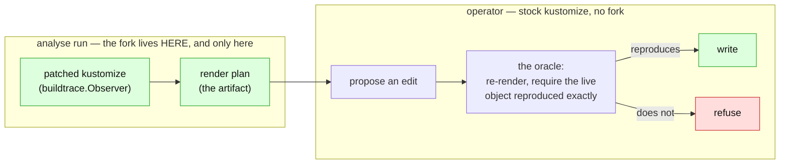

# The render plan: attribution as an artifact, not a capability

> **design** — direction-setting; ships no code. Nothing it describes is supported today.
> Captured: 2026-07-14
> Related:
> [patching-kustomize.md](patching-kustomize.md),
> [render-attribution.md](render-attribution.md),
> [render-root-scoping.md](render-root-scoping.md),
> [generated-repo-map.md](generated-repo-map.md),
> [support-contract.md](support-contract.md),
> [acceptance-precision.md](acceptance-precision.md)

The fork ([patching-kustomize.md](patching-kustomize.md)) can tell us exactly which
kustomization entry supplied which field. But carrying a forked kustomize in the operator —
on the reconciliation hot path, in the same process that must render byte-identically to
the user's controller — is a cost we would rather not pay, and a `replace` directive does
not even survive being consumed as a library (§6 there).

So don't. **Run the fork offline, once, and emit a file.**

The operator links stock kustomize and reads the file. Attribution stops being something
the operator can *do* and becomes something it can *look up*. This doc is about what that
file has to contain to be safe, and about the one way of monetising it that does not
destroy the product.

## 1. The shape



Three properties fall out of this and they are the whole argument:

- **The fork leaves the hot path.** The operator's render fidelity against Flux is
  unimpeachable, because the operator renders with the same stock library Flux does.
- **The blast radius of the fork shrinks to one offline tool.** It is no longer linked into
  the thing that writes to people's repositories.
- **The plan is a *hint*, never an authority.** See §2, which is the load-bearing section.

## 2. The plan proposes; the oracle disposes

The instinct that a precomputed plan is dangerous is correct, and the reason is staleness:
a plan describes how a repo rendered at commit *X*, and **our own writes produce commit
X+1**. Every write we make invalidates the plan that authorised it.

That would be fatal — *if the plan were trusted*. It must not be.

The oracle from [render-root-scoping.md](render-root-scoping.md) §3 already exists in the
design and, crucially, **needs no plan and no fork**: propose a source edit, re-render the
render root with stock kustomize, and require that the proposal reproduces the live object
exactly *and leaves every other object byte-identical*. That check is what the operator
already has to do anyway.

So the plan only ever generates a *proposal*, and a wrong proposal is *caught*:

| Plan state | Proposal | Oracle | Outcome |
|---|---|---|---|
| correct | right file, right entry | reproduces | **write** |
| stale / wrong | wrong file or wrong entry | does not reproduce | **refuse** |
| missing | fall back to the dye | either | write or refuse |

**A bad plan degrades to a refusal, never to a corruption.** That converts staleness from a
correctness problem into an availability problem, and it is the single property that makes
this whole scheme safe to ship. It also means the plan does not have to be *perfect* — it
has to be *verifiable*, which is a far weaker and far more achievable requirement.

This is the same reason [render-attribution.md](render-attribution.md) §5 insists that
attribution may be heuristic but verification may not. The plan is the heuristic. The
oracle is the verification. **Never let the plan be both.**

## 3. Even so: fingerprint the inputs

The oracle makes a stale plan safe. It does not make it *free* — every stale-plan proposal
costs a full re-render and ends in a refusal the user did not deserve. So the plan must be
able to say "I no longer describe this repo" without being run through the oracle to find
out.

That means the plan is keyed by **a content hash of every input it depends on**: every file
in the render root's read scope, including the bases outside the root that the overlay
reaches into. Not the git commit — the *content* — because the operator writes to a branch
and the plan must remain valid for the files it did not touch.

This is `go.sum`, and it fails the same way if you skip it: **a lockfile nobody verifies is
not a lockfile, it is a rumour.** A plan whose fingerprint does not match the repo it is
being applied to must be treated as absent (fall back to the dye), not as approximately
right.

## 4. The tier must gate scope, not accuracy

The commercial instinct — free tier gets the dye, paid tier gets the plan — is right in
outline and lethal in one specific formulation.

**The trap.** The dye is *sound only for pure sinks*
([render-attribution.md](render-attribution.md) §3): it cannot attribute `newName`, it is
blind to an idempotent pin, and it says nothing about `patches:`. If the free tier *guesses*
in those cases while the paid tier *knows*, then correctness is the paid feature. The first
free-tier user whose base gets silently corrupted takes the paid tier's reputation with
them. You cannot sell "we write to the right file" as an upgrade from "we write to a file."

**The fix, and it is one word.** Both tiers are **correct**. The paid tier is more
**capable**:

| | Free (dye) | Paid (plan) |
|---|---|---|
| `images` / `replicas` pure sinks | **edits** | **edits** |
| idempotent pin, `newName` | **refuses** | **edits** |
| `patches:`, components | **refuses** | **edits** |
| ever writes the wrong file | **no** | **no** |

What the customer buys is **a bigger support boundary, not a more accurate one.** The free
tier never lies; it says *"I cannot edit this."* The paid tier says *"I can."* That is a
defensible upsell precisely because it is the product's existing ethos — refusal is already
our honest answer, and [support-contract.md](support-contract.md) is built on it. The plan
turns refusals into edits. It must never turn refusals into guesses.

A corollary worth stating, because it is a real constraint on the open-source operator: **the
operator must be fully correct with no plan present.** The plan is an enrichment. If the
operator's correctness depends on a file only paying customers get, the open-source project
is a trap, and it will be treated as one.

## 5. What is in the plan

Not the render. The **inverse** of the render — which is the thing that does not otherwise
exist ([generated-repo-map.md](generated-repo-map.md) §2, tier 4).

```yaml
# renderplan.v1
renderRoot: overlays/prod
inputs:                      # §3 — every file in the READ scope, not just the subtree
  base/deployment.yaml: sha256:...
  base/kustomization.yaml: sha256:...
  overlays/prod/kustomization.yaml: sha256:...
objects:
  - id: apps/v1/Deployment/prod/web
    origin: base/deployment.yaml          # exact, from kustomize
    fields:
      spec.replicas:
        source: {kind: entry, file: overlays/prod/kustomization.yaml, stanza: replicas, index: 0}
      spec.template.spec.containers[0].image:
        source: {kind: entry, file: overlays/prod/kustomization.yaml, stanza: images, index: 0}
      spec.template.spec.containers[1].image:
        source: {kind: file, file: base/deployment.yaml}   # no entry changed it
unattributable:              # §6 — the plan MUST record its own gaps
  - object: apps/v1/Deployment/prod/web
    field: spec.template.metadata.labels.version
    reason: changed-by-transformer-we-cannot-invert
    transformer: PatchStrategicMergeTransformer
```

Two things about this schema are not negotiable.

**It records what it could NOT attribute.** A plan that lists only its successes is
indistinguishable from a plan that is incomplete, and the operator cannot tell "this field
has no override" from "this field's override was not understood". The first is editable in
place; the second must be refused. `unattributable` is what keeps those apart.

**Entry references are (file, stanza, index).** Not a transformer kind — kustomize builds
one transformer instance per entry, so the index is the only thing that identifies *which*
`images:` entry, and it is exactly what the observer emits.

## 6. One artifact, three consumers

This is why it is worth building once rather than three times. The plan is the serialized
tier-4 graph, and everything downstream is a *rendering* of it:

| Consumer | Uses |
|---|---|
| **The writer** | `fields[].source` — route each changed field to a file or an entry (and refuse on `unattributable`). |
| **The diagram** ([generated-repo-map.md](generated-repo-map.md)) | the whole thing — this *is* the graph, and "renders graphically" is a viewer over this file, not a second pipeline. |
| **The metrics** | entries that appear in no `fields[].source` are **dead configuration**; `unattributable[]` grouped by transformer measures **the support boundary itself**, across every repo we see. |

That last one is the sleeper. Every other question in these docs — *should we support
`patches:`? how common are components, really?* — is currently argued from fixtures and
intuition. `unattributable[]` answers it with a count from real repositories.

## 7. Where does it live?

Genuinely open, and the two options trade differently.

**Committed to the customer's repo.** It is reviewable, it diffs in a pull request (*"this
change alters how your repo renders"*), and it is versioned alongside the content it
describes, which makes §3's fingerprint check natural. But our own writes churn it, and
there is a self-collision worth noticing: **a stray file in a GitTarget folder is currently
grounds for refusing the whole folder** ([acceptance-precision.md](acceptance-precision.md)
§1). We would be adding a file that trips our own acceptance gate. It must go on the inert
allowlist (`DefaultAllowlist`) in the same change, or we ship a product that refuses repos
because of a file it wrote itself.

**Out of band** (object storage, a CR, the GitTarget status). No repo churn, no acceptance
collision — but invisible to the user, and it loses the "explain my repo in a PR" value that
is half the point.

Leaning committed-in-repo, precisely *because* it is visible: the artifact that explains the
repo is worth more in the repo than in our database.

## 8. Order of work

1. **The oracle first, and unconditionally.** It is what makes every later step safe, it is
   needed by the dye path anyway, and it needs no fork and no plan. Nothing else here should
   be built before it.
2. **The plan schema + the fingerprint** (§3, §5), with `unattributable` from day one.
3. **The offline emitter** — the analyse run, linking the fork, producing the file.
4. **The operator reads it**, falling back to the dye when it is absent or its fingerprint
   does not match.
5. **The diagram and the metrics**, which are then free (§6).

## Still open

- **What regenerates the plan after we write?** Our write invalidates the fingerprint of the
  file we wrote. The cheapest honest answer is that the operator refuses the *next* edit to
  that root until the analyse run reruns — correct, but a poor experience. The better answer
  is probably that the operator can update the plan's fingerprint itself for a write whose
  effect it fully understood (it just verified it with the oracle, after all), and only a
  *foreign* change to the repo forces a full reanalysis. That is a nice property and it needs
  proving, not asserting.
- **Does the plan cross the licence boundary cleanly?** The fork is Apache-2.0 (private use
  is unrestricted; distributing a binary built from it requires the notices and a statement
  of changes). The *plan* is our output and carries none of that. Running the fork as a
  hosted analyse run and shipping only the file is the cleanest position, and it is worth
  confirming with someone who is not me.
- **Is the plan per render root, or per repo?** Per root is simpler and matches the
  fingerprint's read-scope. Per repo is what a diagram wants. Probably per root, with the
  repo view being a join.
