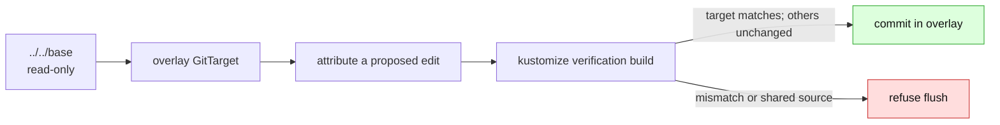

# Render-root scoping

> **Implementation record.** External-base overlay support is shipped for existing
> overlay-local documents, declared `images`/`replicas` entries, **creating a new
> overlay-local object** (a new file plus its `resources:` entry), **authoring a missing
> `images`/`replicas` entry** when a base-supplied image or replica count is changed in one
> environment, and **`$patch: delete`** for an object the overlay inherits from its base — all
> verified by re-render. Strategic-merge patch authoring for a base-owned *field* (not an
> image/replica) remains separate work.
>
> Related: [support contract](support-contract.md),
> [Kustomize boundary](kustomize-support-boundary.md),
> [render attribution](render-attribution.md), and
> [GitTarget granularity](gittarget-granularity-and-cross-environment-edits.md).

An overlay is a **write partition**. It may render `../../base`, but a GitTarget rooted at
that overlay must never write the base or another overlay. This document records the design
that makes the split safe and what is still intentionally absent.

## 1. Shipped boundary

- The writer expands its **read scope** to the render base needed by the selected overlay,
  while the **write scope** remains `spec.path`.
- An existing overlay-local document is edited in place. An existing `images:` or `replicas:`
  declaration receives the corresponding edit-through change.
- When a **base** supplies an image or replica count and it is changed in one environment (the
  classic "bump the image in dev"), the writer **authors a new `images:`/`replicas:` entry** in
  the overlay's own kustomization — creating the section if the overlay has none yet — rather
  than writing the read-only base. The re-render verifies the entry produces the live value and
  moves nothing else; an entry that would over-reach (an image name shared by another object) is
  refused there, not committed.
- A **brand-new object** with no existing document is created as an overlay-local file and
  registered in the overlay's **own** `resources:` entry — never the base's — with the
  re-render verifying it before the commit. A new object whose field a folder-level
  `images:`/`replicas:` entry would override is refused loudly by that oracle instead of
  committed as a non-converging write.
- Deleting an object the overlay **inherits from its base** authors a `$patch: delete` in the
  overlay (a patch file plus a `patches:` entry) rather than deleting the read-only base — the
  base, and every other environment that reads it, is untouched. The re-render verifies the
  object leaves the overlay's render; a patch that does not match is refused there, not committed.
- A source file reached by more than one render root is read-only. The entire flush is refused
  before a commit when a plan would write it.
- A path-based strategic-merge patch is read-only build context. It no longer rejects the
  whole overlay merely by existing.
- A base-owned *field* (not an image, replica, or whole-object delete) is refused rather than
  written through to the shared base — strategic-merge field patch authoring is still planned.

The discovery report has caught up: `scan-repo` runs the same adoption gate over an
external-base overlay's render scope, so a `kustomize-overlay` candidate is now reported
**accepted** (the `overlay-fan-out-unsupported` reason is retired) with its `editable` count
showing how much the overlay owns.

## 2. Why verification, not inversion

Kustomize is lossy and many-to-one; a general source inverse does not exist. We only need a
much smaller decision procedure:

> Propose an overlay-local source edit, rebuild the root, and commit only when it reproduces
> the edited object exactly while leaving every other object unchanged.

[`VerifyBatchRenders`](../../../internal/manifestanalyzer/render_verify.go) runs this test as a
write-plan precondition. It uses Kustomize's implementation in an in-memory filesystem,
with plugins disabled. Remote bases are rejected before the build, because Kustomize may
otherwise invoke Git; invalid image-name regular expressions are also rejected before they
can panic the renderer.

The renderer uses `LoadRestrictionsNone` deliberately. The in-memory filesystem is the
jail, and Flux accepts local `../shared.yaml` references that `RootOnly` would reject. A
stricter path option would create a false refusal and leave a real production render outside
the proof.

## 3. Source form and attribution

The source-form projection avoids treating a transformer's output as a user edit: when the
source render already agrees with live state, source bytes remain untouched. This closes the
old metadata-transformer leak and lets a patched folder be mirrored without copying the
patch's values into its base input.

Attribution may be a heuristic; verification is not. A candidate source is dyed and rebuilt
to prove which declaration supplied a value. Where the writer cannot prove ownership, it
refuses the edit. See [render attribution](render-attribution.md) for the method.

## 4. Current routing table

| Observed change in selected overlay | Destination | Status |
|---|---|---|
| Image tag or repository | overlay `images:` entry — edited if declared, **authored if the base supplies it** | Editable |
| Replica count | overlay `replicas:` entry — edited if declared, **authored if the base supplies it** | Editable |
| Existing overlay-local document field | that document | Editable |
| New object | overlay-local file plus `resources:` entry | **Editable** — placed in the overlay, registered in its own kustomization, verified by re-render |
| Delete inherited object in one overlay | overlay `$patch: delete` (patch file plus `patches:` entry) | **Editable** — authored in the overlay, verified by re-render; the base is untouched |
| Base-owned field (not image/replica/delete) | operator-authored strategic-merge patch | Refused pending [patch authoring](patch-authoring.md) |

Entry creation is distinct from editing an entry, and both are now shipped for images/replicas.
Creating a **new object** — an overlay-local file plus a `resources:` entry in the overlay's
**own** kustomization (the base's is out of the write jail) — is shipped. **Authoring a missing
`images:`/`replicas:` entry** is too: when a base supplies an image component or replica count
and the environment changes it, the writer creates the entry (and the section, if absent) in the
overlay rather than writing the read-only base, and the re-render adjudicates the proposal.
**Deleting an inherited object** authors a `$patch: delete` in the overlay under the same
verification. What remains is a strategic-merge patch for a base-owned field that is *not* an
image, replica, or whole-object delete.

## 5. Remaining work

1. Add a dedicated cluster end-to-end overlay case (discovery classification is already flipped —
   an external-base overlay reports accepted).
2. Author a narrow scalar strategic-merge patch for a base-owned *field*; list merges, element
   deletes, and structural merges require separate decisions.

Overlay-local new-object placement (a new file plus its `resources:` entry), authoring a missing
`images:`/`replicas:` entry, and `$patch: delete` for an inherited object are all done, covered by
`TestPlacement_ExternalBaseOverlay_NewObject`, `TestOverlayAuthors_ImageEntry_ForBaseSuppliedImage`
/ `..._ReplicaEntry_ForBaseSuppliedCount`, and `TestOverlayAuthors_DeletePatch_ForInheritedObject`;
they left the list as the write path proved them end-to-end. `scan-repo`'s discovery flip landed
separately in #243.

The earlier exploratory prompt material was consolidated into this implementation record and
[patch authoring](patch-authoring.md). Git history retains the detailed experiments without
making the active support boundary harder to read.
