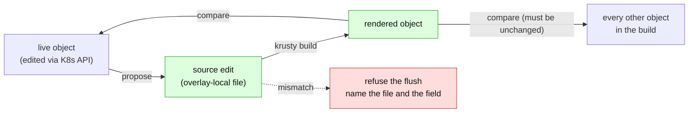

# Render-root scoping: an overlay is a write partition, and the renderer is the proof

> **design** — direction-setting; ships no code. Nothing it describes is supported today.
> Captured: 2026-07-14
> Related:
> [README.md](README.md),
> [support-contract.md](support-contract.md),
> [kustomize-support-boundary.md](kustomize-support-boundary.md),
> [gittarget-granularity-and-cross-environment-edits.md](gittarget-granularity-and-cross-environment-edits.md),
> [unreflectable-edits-and-write-gating.md](unreflectable-edits-and-write-gating.md),
> [orchestrator-knowledge-boundary.md](orchestrator-knowledge-boundary.md),
> [acceptance-precision.md](acceptance-precision.md),
> [finished/images-and-replicas-edit-through.md](finished/images-and-replicas-edit-through.md)

A `GitTarget` may point at a kustomize overlay. The overlay reads a base through
`../../base`; the operator reads that base as context and writes only inside the overlay.
This is the layout half of Kustomize support, and it is launch-critical.

It is **not** patch authoring. That stays deferred — see §6, which also explains why the
folder should nonetheless stop being refused for containing a patch.

---

## 1. The problem, stated honestly

An overlay's live object is `render(base, overlay)`. `render` is lossy and many-to-one:
transformers rename, generate, derive, and drop. **A general inverse does not exist**, and
any design that claims one is lying.

We do not need one. We need two much weaker things:

1. a **proposal** — a guess at which file an edit belongs in, and
2. a **decision procedure** — something that tells us whether the guess was right.

The second is the whole design. It is cheap, total, and already prototyped in the shipped
code:

> **Propose a source edit, re-render, and compare. If the render does not reproduce the
> live object exactly — and leave every other object in the build byte-identical — refuse
> the write.**

> **This shipped.** It is [`VerifyBatchRenders`](../../../internal/manifestanalyzer/render_verify.go),
> run as a write-plan precondition once per flush. See
> [render-attribution.md](render-attribution.md) §5.

This is not a new idea imported from outside. F1 shipped the *shape* of it in
`simulateImageRender`: propose the entry edits, replay, and discard the whole inversion
unless every planned source image comes back as its live value.

But be precise about how far short of the statement above that falls, because the gap is the
work: `simulateImageRender` replayed **our re-implemented image chain, not kustomize**, and it
checked **only the images it planned** — never that the rest of the build is untouched. So it
was image-specific verification, and it shared a blind spot with the thing it verified: a
value owned by a patch, or by a matching rule we got wrong, reproduces perfectly in the
simulation and wrongly in reality. (It is deleted; the re-render replaced it.) F1 shipped the
pattern. **What F1 did not have is a
renderer** — and without one, neither half of the guarantee above is actually in force. See
[render-attribution.md](render-attribution.md) §5.

---

## 2. What we had instead of a renderer

> **Historical.** When this was written, `sigs.k8s.io/kustomize` was **not a dependency of
> this module** — zero hits in `go.mod` — and what the code called a render was a hand-written
> structural model. That is what the section argues against, and the argument won:
> [kustomize-support-boundary.md](kustomize-support-boundary.md) §7 took the decision, and
> #229/#231/#232 shipped it. `krusty` is now the renderer, `kustomization.yaml` is parsed with
> kustomize's own type, and the resource-DAG walk is gone. **The projection's transformers are
> the last of the re-implementation still standing** — see
> [render-attribution.md](render-attribution.md), which is the design for deleting them.
>
> The inventory below is kept because it is the *evidence*, and because the last two rows are
> still true today.

| Piece | What it is | Status |
|---|---|---|
| [`renderRoots`](../../../internal/manifestanalyzer/override_chain.go) | every kustomization directory no other kustomization references | **kept** — something must decide which directories a build is invoked on. Everything the walk did *beyond* that now comes from the renderer. |
| `renderImage` | a ~20-line reimplementation of kustomize's image transformer | **deleted.** It diverged from kustomize (its matcher was string equality where kustomize's is a *regex over the whole image string*). Attribution now reads a dyed render: [render-attribution.md](render-attribution.md) §3. |
| `isReplicaKind` | the replica transformer's fieldspec, hardcoded to three kinds | **deleted.** kustomize's fieldspec has four; it missed `ReplicationController`. There is no list of kinds any more. |
| [`unsupportedKustomizeFeatureKeys`](../../../internal/manifestanalyzer/store.go) | 17 keys that refuse the folder outright | **replaced** (#229): the unsupported set is now derived by *reflecting over kustomize's own struct*, so a field we have never heard of refuses rather than being silently tolerated. |

The deny-list is not a statement about what is editable. **It is a fence around the
reimplementation** — a list of everything we chose not to re-derive. That is why
[images-and-replicas-edit-through.md](finished/images-and-replicas-edit-through.md) says it
plainly: *"No `kustomize build`, no source maps."*

The fence has a cost we are already paying, and it is not the cost we think:

- **`vars` is not on the list.** A source document containing `$(SOME_VAR)` renders to a
  substituted value. Mirroring that live object writes the *substituted* value over the
  `$(VAR)` in the source. That is silent corruption, in a folder we accept **today**.
  (`vars` was moved off the tolerated set by #229 and now refuses the folder.)
- **`labels` / `commonLabels` / `annotations` are explicitly classed as benign.** They
  inject metadata into every rendered object; mirroring bakes it into the source file as
  drift. This is the metadata-transformer leak, live today, in supported folders.

So the inversion problem is not something overlay support introduces. **We already have it,
and we currently handle it in three inconsistent ways**: explicitly and verified for
`images`/`replicas`; by blanket folder refusal for `patches` and friends; and silently,
incorrectly, for the transformers we called benign.

A renderer replaces three policies with one.

> **The leak is fixed, and the fix is one rule, not three policies.**
> [`sourceForm`](../../../internal/manifestanalyzer/source_form.go): *where the live object and
> the render agree, the source keeps its bytes; where they disagree, the user changed something,
> and that is what we write.* Agreement means the build already produces exactly what the cluster
> runs, so the source is — by construction — what produced it, and there is nothing to write. It
> needs no model of `commonLabels`, of `namespace`, or of a patch, which is precisely why it
> closes all three at once and is what makes §6 possible at all.
>
> The leak was measured before it was fixed, and it was not theoretical: a folder declaring
> `labels:` + `commonAnnotations:` and nothing else committed the overlay's `env: prod` into the
> base manifest on the first reconcile of an *unchanged* folder. The corpus no-op invariant now
> compares the **whole document** rather than only its images, which is how a projection that
> quietly rewrote every field we had not modelled passed that test for as long as it did.

---

## 3. The oracle

[kustomize-support-boundary.md](kustomize-support-boundary.md) §7 already sanctions the
move, and names the seat it sits in:

> *"The worthwhile upgrade is kustomize's Go API (`krusty`) as a **verification oracle, not
> a renderer**: build each render root in-memory and compare against our own projection;
> mismatch → refuse."*

Adopt it, with the sandbox stated as part of the contract:

> **This section proposed `LoadRestrictionsRootOnly`. The shipped renderer
> ([`kustomize_render.go`](../../../internal/manifestanalyzer/kustomize_render.go), #231/#232)
> uses `LoadRestrictionsNone`, and the reasoning below is why the proposal was wrong.** The
> contract as built is recorded here rather than quietly corrected.

| Sandbox setting, as shipped | Consequence |
|---|---|
| `LoadRestrictionsNone` | what **Flux itself** builds with. The in-memory filesystem holds only the scanned tree, so **the filesystem is the jail** — "unrestricted" loading cannot reach the real disk. `RootOnly` would be the wrong kind of strict: it forbids `resources: [../shared.yaml]`, which Flux renders happily, so we would fail to build a root that deploys in production — and failing to build a root silently disarms the write-fan-in guard. Refusing to look is not a safety property. |
| `DisabledPluginConfig` | no exec, no Go plugins — *"arbitrary code = unknowable render"* stays true by construction |
| **pre-build refusal** | remote bases, and `images:` entry names kustomize cannot compile. Both are properties of the *build*, not of what we can model, and both must be caught before krusty is called. |

**The sandbox does not stop the network, and this was measured rather than assumed.** Given
a remote base, kustomize shells out to `/usr/bin/git fetch` — under
`LoadRestrictionsRootOnly` *and* under an in-memory filesystem. Both were tried; both
fetched.

So `hasRemoteResource`/`isRemoteResource` are **not** made redundant by the renderer. They
are promoted to a **security precondition that runs before krusty is ever called**, and they
are the one piece of the current kustomize code that must survive. *"We do not run kustomize
on a remote base"* stays literally true — now enforced, rather than merely implied by having
no renderer at all.

The same slot now also holds a second precondition, found the same way: an `images:` entry's
`name:` is a **regular expression**, and kustomize compiles it while discarding the compile
error before dereferencing it — so `- name: "ngin["` does not fail the build, it **panics
inside it**, on bytes from a user's repository. Refused before the build, with a `recover()`
under krusty for the panics not yet found. See
[render-attribution.md](render-attribution.md) §6.

The oracle guards two directions:

The blast-radius half — *every other object in the build is unchanged* — is what makes it
safe to guess. A proposal that would move another environment's object cannot land, so the
proposal function is allowed to be simple.

### What the oracle does not promise

We would run *a* kustomize; Flux and Argo run *theirs*. A version skew between our pinned
library and the orchestrator's is a residual risk, and it should be written down rather than
finessed: pin to the version Flux ships, and accept that the guarantee is *"this renders to
what you edited, under the kustomize we pinned."*

That is strictly better than the guarantee we have now, which is *"this renders to what you
edited, under twenty lines we wrote by hand."*

---

## 4. The proposal function

It is nearly trivial, and it is forced by decisions already made.

> **An edit to an object rendered by an overlay lands in that overlay. Never in the base.**

Not merely unsafe — *wrong*. A user who edits production's replicas did not ask to change
staging. Writing the base would change what another environment renders, and
[gittarget-granularity-and-cross-environment-edits.md](gittarget-granularity-and-cross-environment-edits.md)
already forecloses it four times over: Option A, base read-only by **L1**, the filesystem
guarantee that cannot be wrong. Nothing here opens a base-write path. The only route to a
base write remains Option C (base-as-variant, its own `GitTarget`, its own RBAC role), and
it stays deferred.

So routing is: *which file **inside this overlay** should carry this field?* — and the
oracle adjudicates.

### The launch scope

Unchanged from [kustomize-support-boundary.md](kustomize-support-boundary.md) §2 and §5:

| Observed change in overlay X | Lands in | Status |
|---|---|---|
| image tag / repository | overlay X's `images:` entry | **Editable** |
| replica count | overlay X's `replicas:` entry | **Editable** |
| new object | new overlay-local file **+ a `resources:` entry** | **Editable** |
| overlay-local document's own fields | that document, in place | **Editable** |
| a base-owned field (env var, limits, args…) | an operator-authored patch | **Refused** — deferred, §6 |
| delete of a base-owned object in one env | a `$patch: delete` directive | **Refused** |

Two mechanical extensions the current writer does not have, both small and both gated by
the oracle:

- **Create an entry, not just turn a knob.** [`applyKustomizationEdit`](../../../internal/git/manifestedit/kustomization.go)
  today requires the field to already exist as a scalar; it never adds an entry. An overlay
  that has no `replicas:` at all cannot receive a replica edit. Adding an entry to an
  existing sequence is the same shape as
  [`AppendKustomizationResource`](../../../internal/git/manifestedit/kustomization.go), which
  already exists.
- **Create the sequence.** Same rule, one level up. Guard both with the oracle: an entry we
  add must render to the value the user set, or it does not get written.

### Read scope grows; write scope does not

Render-root scoping's one concrete new capability, per §5 of the granularity doc: **follow
`../../base` for reading** (today it is dropped), while the write jail stays at `spec.path`.
That asymmetry *is* L1 — *"reads may reach shared context; writes never leave it"* — and it
is already enforced and tested in
[`pathScopePrecondition`](../../../internal/git/plan_flush.go).

### L2's blind spot closes here

[`fanInPrecondition`](../../../internal/git/plan_flush.go) refuses a write to a file reached
by more than one override chain **with override entries at stake** (`anyOverrides`). Its
generalisation — *any file reachable from more than one render root* — is exactly this
workstream's job. With render roots first-class, the check stops leaning on the emergent
side effect that a namespace-ambiguous base document never becomes dirty.

---

## 5. What the corpus says

Every `refused-structural` row in
[support-today.md](../../../test/fixtures/gitops-layouts/support-today.md) is an overlay,
and the corpus has already sorted them by difficulty for us.

| Fixture candidate | Refused on | Reading |
|---|---|---|
| `flux-monorepo/apps/{staging,production}` | **`patches` only** | `namespace` + `resources` + one strategic-merge patch on a base Deployment. **No name mutation, stable name, known namespace.** The most tractable overlay in the corpus — and a *category-1 desired-state* layout, the kind we claim to support. |
| `rendered-manifests/src/frontend/overlays/{staging,production}` | **`namePrefix` only** | The overlay dirs contain *nothing but* a kustomization.yaml. `namespace`, `resources`, `images` all pass. Deleting one key is the entire delta between refused and accepted. |
| `flux-helmrelease/apps/frontend` | **`configMapGenerator` only** | With `generatorOptions.disableNameSuffixHash: true`. The output name is deterministic (`frontend-values`); there is no hash, no prefix, no patch. Refused solely because the key is on the list at all. |
| `kustomize-overlays/apps/frontend/overlays/*` | the full zoo | `patches` + generators + `namePrefix`/`nameSuffix` + a hidden `.argocd-source-*.yaml` that silently outranks the `images:` block. Correctly refused. |
| `kustomize-overlays/apps/backend/overlays/production` | `remote-base` | `0/0/0` — literally zero local files. Nothing to render, nothing to edit. Correctly refused — and it must be refused *before* the build, because kustomize would fetch it (§3). |

Three things the corpus makes visible that no design doc had said out loud:

1. **We accept the generated artifact and refuse its source.** In `rendered-manifests`,
   `rendered/production/` is **accepted** (`3/3/0`) — a file carrying `# DO NOT EDIT`,
   regenerated by `src/render.sh`, which will clobber anything we write. Meanwhile the
   authored overlay it came from is refused. We have the polarity exactly backwards. The
   `Generated{path}` claim already exists in
   [orchestrator-knowledge-boundary.md](orchestrator-knowledge-boundary.md)'s vocabulary;
   nothing emits it. See [acceptance-precision.md](acceptance-precision.md).
2. **In-repo bases are invisible.** A base referenced by an in-repo overlay is not reported
   as a candidate at all — `flux-monorepo/apps/base/frontend`,
   `kustomize-overlays/apps/frontend/base` and `rendered-manifests/src/frontend/base` are
   all absorbed. Any design that starts rendering overlays must decide what those bases
   become. **They become read-only context**, which is the right answer and should be said
   explicitly rather than achieved by accident.
3. **No fixture exercises the `kustomize-overlay` layout at all.** Every overlay in the
   corpus also uses `patches` or `namePrefix`, so `refused-structural` fires first and
   hides the verdict — `overlay-fan-out-unsupported` has never been observed. **A minimal
   overlay fixture (`namespace` + `images` over `../../base`, nothing else) is a
   prerequisite**, not a nice-to-have: it is the only way to see the code path this
   document is about.

---

## 6. Why a patch still blocks the folder — and why it should not

Patch authoring is deferred, and this document does not un-defer it. Writing a
strategic-merge patch means modelling merge keys, `$patch` directives, and CRD fallback
behaviour, and it is priced against the tier-2 metrics for a reason.

But **accepting a folder and being able to express every edit in it are two different
questions, and today one deny-list answers both.**

A `patches:` entry refuses the entire `GitTarget`. Not the edit — the *target*. Acceptance
is all-or-nothing (`Accepted = len(issues) == 0`), and a refusal aborts the whole flush
before a byte is written. So `flux-monorepo/apps/production` — whose patch touches
`spec.replicas`, an env var, and CPU requests — also loses `images:` and `replicas:`
edit-through, which the patch has nothing to do with.

Separate the gates:

| Gate | Question | Granularity |
|---|---|---|
| **Renderable** | can we compute the objects this folder produces? | per folder |
| **Routable** | can we place *this* edit in a file, and prove it? | **per (object, field)** |

With the oracle, a folder containing a hand-written patch is perfectly **renderable**. The
patch is a sparse KRM document; the fields it sets are readable directly from it. So:

- **Tolerate `patches` as read-only context.** Render it, mirror the result, accept the
  folder.
- **Route what we can already route.** An `images:` or `replicas:` edit goes to its entry,
  as today — and the oracle *proves* it, including the interesting case where the patch
  itself pins `spec.replicas` and the transformer overrides it anyway. We do not have to
  reason about kustomize's transformer ordering. We check.
- **Refuse the edits we cannot express**, per field, naming the patch that owns the field
  and the fact that authoring one is not supported.

This changes one decided position — §5's *"pre-existing hand-written patches would still
refuse the folder"* — and it should be argued, not smuggled. The argument: that sentence was
written when the only way to know what a patch does was to model it. With a renderer we do
not model it, we execute it. The reason for the refusal was the fence, and the fence is what
we are removing.

**Prerequisite, not a follow-on.** None of this may ship before the tier-2 unreflected-edit
accounting in [unreflectable-edits-and-write-gating.md](unreflectable-edits-and-write-gating.md):
*"overlay support without the unreflected set would reintroduce silent divergence."* A
per-field refusal is only honest if the refused edit is **reported and reverted, never
silently lost**. That is the gate on all of this, and it is the right one.

---

## 7. The order of work

1. **The minimal-overlay fixture.** Until it exists, the overlay code path is unobserved.
2. **Tier-2 accounting** — `FullyReflected` per edit; refused edits reported and reverted.
3. ~~**The oracle**~~ — **done.** krusty, sandboxed, in the acceptance gate (#232) and in the
   write-plan precondition (`VerifyBatchRenders`). The differential test against
   `simulateImageRender` was overtaken: the simulation is deleted, and the corpus test that
   replaced it makes the stronger claim that an in-sync folder projects to a no-op.
4. **Render-root scoping proper**: read `../../base`; bases become declared read-only
   context; generalise `fanInPrecondition` to any file reachable from more than one render
   root.
5. **Entry creation** (`replicas:`/`images:` entries that do not yet exist), oracle-gated.
6. **Tolerate-don't-author**: patches, `namePrefix`/`nameSuffix`, and hash-free generators
   become read-only context; refusals move from the folder to the edit.

Steps 1–4 are the launch unit. Steps 5–6 are what turn `flux-monorepo` and
`rendered-manifests` from refused into supported, and they are worth stating as the goal
because they are what the corpus is asking for.

## 8. Still open

- **Does the oracle run in the gate, the write path, or both?** §7 of the kustomize doc says
  the gate. The blast-radius check only means something on an actual planned write. Probably
  both, with different failure modes: gate → `GitPathAccepted=False`; write → refuse the
  flush.
- **Cost per flush.** A build is milliseconds on these trees, but it is not free, and it is
  on the hot path.
- **Generators with `disableNameSuffixHash: true`.** `flux-helmrelease/apps/frontend` is the
  case: deterministic name, single file input. It is refused as a generator, but it is not
  *structurally* non-invertible — the hash is what makes generators non-invertible, and it
  is switched off. This is the seam between here and
  [values-file-projection.md](values-file-projection.md), which needs the same file.
- **Version skew** between our kustomize and the orchestrator's (§3).
