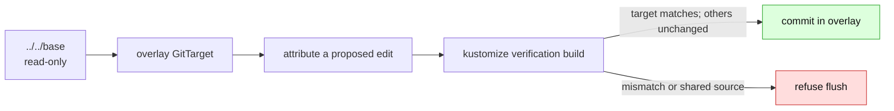

# Render-root scoping

> **Implementation record.** External-base overlay support is shipped for existing
> overlay-local documents and declared `images`/`replicas` entries. New-resource entry
> creation and patch authoring remain separate work.
>
> Related: [support contract](support-contract.md),
> [Kustomize boundary](kustomize-support-boundary.md),
> [render attribution](render-attribution.md), and
> [GitTarget granularity](gittarget-granularity-and-cross-environment-edits.md).

An overlay is a **write partition**. It may render `../../base`, but a GitTarget rooted at
that overlay must never write the base or another overlay. This document records the design
that makes the split safe and what is still intentionally absent.

## 1. Shipped boundary

- The writer expands its **read scope** to the render base needed by the selected overlay,
  while the **write scope** remains `spec.path`.
- An existing overlay-local document is edited in place. An existing `images:` or `replicas:`
  declaration receives the corresponding edit-through change.
- A source file reached by more than one render root is read-only. The entire flush is refused
  before a commit when a plan would write it.
- A path-based strategic-merge patch is read-only build context. It no longer rejects the
  whole overlay merely by existing.
- A base-owned field is refused rather than written through to the shared base.

The discovery report has caught up: `scan-repo` runs the same adoption gate over an
external-base overlay's render scope, so a `kustomize-overlay` candidate is now reported
**accepted** (the `overlay-fan-out-unsupported` reason is retired) with its `editable` count
showing how much the overlay owns.

## 2. Why verification, not inversion

Kustomize is lossy and many-to-one; a general source inverse does not exist. We only need a
much smaller decision procedure:

> Propose an overlay-local source edit, rebuild the root, and commit only when it reproduces
> the edited object exactly while leaving every other object unchanged.

[`VerifyBatchRenders`](../../../internal/manifestanalyzer/render_verify.go) runs this test as a
write-plan precondition. It uses Kustomize's implementation in an in-memory filesystem,
with plugins disabled. Remote bases are rejected before the build, because Kustomize may
otherwise invoke Git; invalid image-name regular expressions are also rejected before they
can panic the renderer.

The renderer uses `LoadRestrictionsNone` deliberately. The in-memory filesystem is the
jail, and Flux accepts local `../shared.yaml` references that `RootOnly` would reject. A
stricter path option would create a false refusal and leave a real production render outside
the proof.

## 3. Source form and attribution

The source-form projection avoids treating a transformer's output as a user edit: when the
source render already agrees with live state, source bytes remain untouched. This closes the
old metadata-transformer leak and lets a patched folder be mirrored without copying the
patch's values into its base input.

Attribution may be a heuristic; verification is not. A candidate source is dyed and rebuilt
to prove which declaration supplied a value. Where the writer cannot prove ownership, it
refuses the edit. See [render attribution](render-attribution.md) for the method.

## 4. Current routing table

| Observed change in selected overlay | Destination | Status |
|---|---|---|
| Image tag or repository | declared overlay `images:` entry | Editable |
| Replica count | declared overlay `replicas:` entry | Editable |
| Existing overlay-local document field | that document | Editable |
| New object | overlay-local file plus `resources:` entry | **Planned** — placement/write-path correction required |
| Base-owned field | operator-authored strategic-merge patch | Refused pending [patch authoring](patch-authoring.md) |
| Delete inherited object in one overlay | `$patch: delete` | Refused |

Entry creation is distinct from editing an entry. The current writer does not safely add a
missing `images:`/`replicas:` declaration or create a resource entry for a new object, so the
contract labels those paths planned rather than relying on the existing generic placement
feature.

## 5. Remaining work

1. Correct overlay-local new-object placement, including a deterministic `resources:` entry.
2. Add missing `images:` and `replicas:` declarations only under the same verification proof.
3. Discovery classification is flipped (an external-base overlay reports accepted); a dedicated
   cluster end-to-end overlay case remains.
4. Author a narrow scalar strategic-merge patch for base-owned fields; lists, deletes, and
   structural merges require separate decisions.

The earlier exploratory prompt material was consolidated into this implementation record and
[patch authoring](patch-authoring.md). Git history retains the detailed experiments without
making the active support boundary harder to read.
