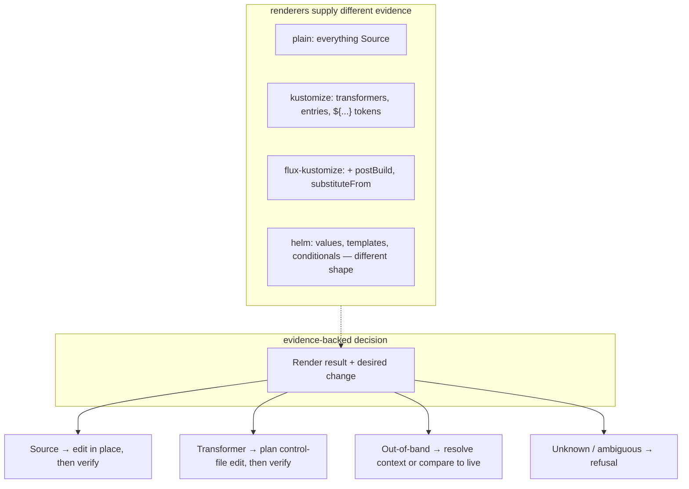

# A renderer abstraction: idea and reasoning

> **exploration — not decided, nothing shipped.** A design sketch for pulling the
> "what does the build do, and can a change be reflected safely?" knowledge behind a stable
> seam, so the rest of the code reasons against evidence and explicit refusals rather than
> scattered kustomize-specific branches. Captured 2026-07-15. Grew out of the render-fidelity work
> ([render-fidelity.md](render-fidelity.md),
> [kustomize-token-writeback-explained.md](kustomize-token-writeback-explained.md)).

## The itch

The kustomize model leaks across the codebase as ad-hoc branches — `dm.Rendered != nil`,
`putToKustomize`, `kustomizationsListing`, the override-split routing in
[`internal/git/plan_flush.go`](../../../internal/git/plan_flush.go), and more in
`internal/manifestanalyzer/` and `internal/watch/`. Each is a small, correct decision, but
collectively they mean "how kustomize behaves" is *diffuse*: to reason about one write you
consult knowledge spread over three packages. And there is a forward path — Helm, and
orchestrator-aware rendering (Flux `postBuild`, Argo `spec.source.kustomize`) — that today has
nowhere clean to live.

The proposal: **name the seam.** Put the build's behaviour behind explicit results and plans,
with kustomize as the first implementation, so adding a renderer, or reasoning about the
current one, is local. This does *not* mean that every source format must implement one large
Go interface.

## The key reframe: "render" is not one operation

The word "render" hides at least four jobs. Lumping them behind a single `Render()` is where
these abstractions usually go wrong, because they abstract at very different quality:

| # | Job | Kustomize | Abstracts cleanly? |
|---|---|---|---|
| 1 | **Forward render** — `inputs → []object` | `kustomize build` | **Yes.** Clean signature, obvious contract. |
| 2 | **Field ownership / inverse** — where does a live change belong in source so a re-render reproduces it? | images/replicas → entry; labels → transformer-owned; patch-injected → nobody | **Only as an evidence-backed plan.** An ownership enum alone loses needed context. |
| 3 | **Placement / wiring** — new-file location + editing `resources:` | `kustomization.yaml` | **Poorly.** Helm's model (`templates/` + `values.yaml`) shares no shape. |
| 4 | **External-input / blind-spot declaration** — what must be known to reproduce the build, and what is unsupported? | `${...}` is unresolved without postBuild inputs; version/flags may differ | **Yes, if operational.** A static list documents a gap; a render result must identify the missing input or refusal. |

Job 1 is nearly free to abstract. Job 4 is cheap and valuable once it produces operational
requirements. Jobs 2 and 3 are the real design work, and the trap is an interface that makes
them *look* uniform when they are not: forcing Helm's placement through kustomize-shaped methods
it then stubs out is **worse** than today's explicit branches, because the branches are at least
honest about the coupling.

## We are already at N ≈ 1.5 — the plain-manifests control case

An important correction to "don't abstract from a single implementation": the plain-manifests
path is a useful **control case**. It is a degenerate input mode, not an independent source
model, and the `dm.Rendered != nil` branches are some of the polymorphism done by hand:

| Interface job | Kustomize | **Plain manifest** |
|---|---|---|
| Forward render | `kustomize build` | **identity** — `render(x) = x` (the Git document itself) |
| Field ownership | transformer/entry-aware | **all `Source`** — every field is owned by the file |
| Placement / wiring | append to `resources:` | placement only, **no wiring** (no-op) |
| Blind spots | postBuild, overrides, version | **still non-empty** — a plain file inside a Flux Kustomization is *also* subject to `postBuild` |

That last row is the subtle, important one: "plain" does **not** mean "no out-of-band context."
The token fence runs on plain documents too (`plain-postbuild-token`), because a plain manifest
under a Flux Kustomization can still be substituted. So plain is a renderer whose *forward* and
*ownership* jobs are trivial but whose *blind spots* are real.

This materially strengthens the case: the seam is not speculative, it already exists as a
runtime `if`. But be honest about what plain proves and what it does not:

- ✅ It exercises jobs **1 and 2** (the ownership seam) — plain is the identity/all-`Source`
  end of that axis.
- ❌ It barely exercises job **3** (placement/wiring) and does **not** exercise a *different
  source model* at all — a plain file is still "a YAML document," the same leaf kustomize edits.

So we are at N ≈ 1.5, not N = 2-that-covers-everything. Enough to justify *naming* a render
result and projection seam; not enough to *freeze* an interface. Helm is the model with a
genuinely different source shape, and it is the honesty test the interface must eventually pass.

## The seam must carry evidence, not just ownership

Most of the branches that bother us ask a related question: *what source edit, if any, can
reproduce this desired live change?* Field ownership is useful vocabulary, but this is not a
static question of a rendered object and a field path. For Kustomize it can depend on:

- the selected render root and the exact source-document bytes and index;
- renderer provenance and source-to-rendered-object mapping;
- the desired live value, not just the current rendered value;
- the current render's external inputs and version/flag identity; and
- counterfactual rendering to prove that the planned edit produces the requested result.

One source document may also be reached by several render roots. If their required changes differ,
the answer is not `Source`: it is an ambiguity refusal. An `images:` entry is likewise not
merely the owner of a scalar field; it is a specific control-file edit selected by pattern and
then verified by rendering. Patches, generated names, and list reshaping can make the inverse
unsupported even though forward rendering succeeds.

The shape to expose is therefore an **evidence-backed projection plan**:

```text
Render(request, context snapshot)
  -> RenderResult { objects, source mapping, provenance, render identity,
                    resolved inputs, unresolved requirements }

PlanChange(render result, source document, desired live object)
  -> EditPlan { source/control-file edits, explanation, verification inputs }
   | Refusal { AmbiguousSource | UnsupportedInverse | MissingExternalInput | ... }
```

`Ownership` can remain part of the explanation (`Source`, `Transformer`, `OutOfBand`, or
`Unknown`), but it is not sufficient authority to write. The current source-form rule,
images/replicas edit-through, and render-fidelity gate become consumers of this richer result:

- **source form** can preserve an untouched source scalar while an edit plan updates a
  transformer entry;
- **images/replicas** can name the exact override entry and prove it by counterfactual render;
- **out-of-band or unknown** can require a live comparison, external-input resolution, or a
  refusal.

Root selection and source-graph analysis should remain explicit rather than becoming hidden
methods on the renderer. They are format-specific policy and are already needed to enforce the
write fan-in boundary.



A sketch of **separate capabilities** (illustrative, **not** prescriptive):

```go
type RenderEngine interface {
    Render(req RenderRequest, snapshot ContextSnapshot) (RenderResult, error)
}

type ChangeProjector interface {
    PlanChange(result RenderResult, change DesiredChange) (EditPlan, *Refusal)
}

// Optional: a format-specific capability, not a method every renderer must fake.
type NewObjectPlacer interface {
    PlanNewObject(obj Object, layout SourceLayout) (EditPlan, *Refusal)
}
```

`RenderResult` must include enough evidence to explain and reproduce its answer: selected root,
source identity, render provenance, renderer/version/flag identity, and the identities and
resource versions of external inputs. It must never expose Secret values in status or logs.
`MissingExternalInput` and `Unsupported` are results, not hidden implementation failures.

This makes the design tension visible: `plain` and `kustomize` are answerable today;
`flux-kustomize` needs a declared context snapshot; and Helm's new-object and inverse semantics
must be answered on paper *before* any interface is frozen.

## Cases the seam must preserve

The abstraction earns its keep only if the following behaviours stay explicit and testable.
These are contract cases, not merely implementation examples.

| Case | Required result |
|---|---|
| Plain YAML, no external context | A direct source edit may be planned and verified. |
| Kustomize label overwrites a source `${TOKEN}` | If the *rendered* value equals live, mirror it; source text alone is not the oracle. |
| Kustomize label injects a rendered `${TOKEN}` which differs from live | Refuse; rendering revealed a fidelity mismatch. |
| `images:` / `replicas:` override | Plan an edit to the selected override entry, preserve the source field, and counterfactually re-render. |
| Patch/list reshaping or generated-name ambiguity | Return `UnsupportedInverse`/`AmbiguousSource`; never guess an indexed source edit. |
| One source reached by conflicting render roots | Refuse because write fan-in is not one, even if each individual render succeeds. |
| Flux `postBuild` / `substituteFrom` | Require a stable context snapshot. If an input is inaccessible, unresolved, or changes during the operation, refuse rather than render with a partial view. |
| Admission/runtime mutation after apply | Keep the render-vs-live verification fence; a renderer cannot claim ownership of mutation it cannot reproduce. |

The existing [render-fidelity scenarios](render-fidelity-scenarios.md) are the initial corpus for
the second and third rows. New renderer work should add equivalent contract fixtures before it
changes write authority.

## The strongest motivation: FluxKustomize / ArgoKustomize

This is more than pluggability, and it is why the abstraction is worth doing even if Helm never
ships. The whole render-fidelity problem is that `applied = f(repo, orchestrator-context)` while
we compute `g(repo)`, and the token gate is a *detector* for `g ≠ f`. A `FluxKustomizeRenderer`
that reads the Flux Kustomization and applies `postBuild`/`substituteFrom` attempts to make
**`g` closer to `f`** by modelling the context — the "orchestrator awareness / interpreter model"
third fence the design already reserves
([orchestrator-knowledge-boundary.md](orchestrator-knowledge-boundary.md)).

It does not make the fidelity gate disappear. First we must establish that the live object belongs
to one particular Flux Kustomization and snapshot. Overlapping orchestrators, unreadable
`substituteFrom` inputs, unsupported plugins or version semantics, and admission/runtime mutation
remain independent reasons to withhold a write. An orchestrator-aware renderer can become a
stronger input to the gate; it cannot relax the gate until its projected edit survives the same
counterfactual verification.

Be clear-eyed about why it is not a free drop-in:

- **It is not a pure function of the folder.** `substituteFrom` reads cluster ConfigMaps and
  Secrets, so rendering needs a selected orchestrator binding and an immutable context snapshot,
  not an unrestricted mutable `ClusterContext`. The snapshot identifies every external input and
  its resource version, has least-privilege reads, and is rechecked before writing. (Same reason
  the fidelity check cannot run at the offline structure-only gate.)
- **Version/flag fidelity.** Flux and Argo run *their* kustomize version with *their* flags. A
  Go library linked into this controller cannot magically use the exact version embedded in a
  running Flux controller. The design needs an explicit support matrix, or a deliberate way to
  evaluate the orchestrator's own semantics; the interface only gives that responsibility a home.
- **The inverse must be context-aware too.** If live `us-east` came from a `postBuild` var, the
  correct edit-through may be "edit the substitution ConfigMap" or "you cannot edit this here,"
  not "write the source file." A forward model that reports "no divergence" while the reverse
  still writes to the wrong place is worse than refusing.

## Recommendation and sequencing

1. **Extract a result type, not a broad interface, without changing behaviour.** Make the
   existing Kustomize renderer's current contract explicit: render provenance, source mapping,
   counterfactual replacement, ambiguity, and existing refusal reasons. Keep outputs and write
   decisions byte-identical. This is a locality win with no new authority.
2. **Pin those facts with contract fixtures.** Preserve the cases above, including rendered-not-
   source token checks, override routing, fan-in refusal, and unsupported inverse cases. A future
   implementation is conforming only if it keeps the same refusals as well as the same successes.
3. **Add a read-only Flux context resolver before a Flux writer.** Resolve one Flux binding into a
   redacted, versioned snapshot and shadow-compare its render with the existing fidelity oracle.
   On missing evidence, retain today's refusal. Do not grant it edit-through authority yet.
4. **Add context-aware projection only with counterfactual verification.** A planned source or
   control-file edit must re-render, against the same snapshot, to the intended object. Recheck
   snapshot identity before committing. Otherwise refuse.
5. **Only then judge Helm.** With render, projection, and context seams tested, write Helm's
   new-object and inverse semantics on paper. If it needs different capabilities, add them; do
   not force it to stub kustomize-shaped methods.
6. **Do not freeze interfaces until Flux exists in code and Helm exists on paper.** Freezing from
   Kustomize plus the degenerate plain case alone is how Kustomize's shape becomes "the" shape.

## Risks to hold in view

- **Premature abstraction from a degenerate N.** Plain validates the ownership axis, not the
  source-model axis. Treat the interface as provisional until a non-degenerate second renderer
  stresses jobs 3 and 4.
- **Leaky abstraction.** An interface that hosts Helm only by having Helm stub kustomize methods
  is a step backward. The forcing function is: *could a new renderer implement this without
  lying?*
- **Mutable context is a correctness and security boundary.** Reads of a substitution Secret or
  ConfigMap must be minimal, snapshotted, and evidenced without exposing values. Rendering with a
  different set of inputs from the one used to verify a write is a time-of-check/time-of-use bug.
- **A successful forward render is not write authority.** The inverse can remain ambiguous or
  unsupported. Keep refusal as the default until a planner identifies an edit and a
  counterfactual render verifies it.
- **Deleting load-bearing knowledge.** Some kustomize `if`s encode real semantics — a `labels`
  transform overwrites `metadata.labels` wholesale via `SetEntry`; a strategic-merge patch
  *prepends* a container, so you cannot align lists by position (see `IssueUnplaceableEdit`).
  The goal is to **relocate** that knowledge into the `KustomizeRenderer` behind a stable
  question, **not** to erase it. If the abstraction deletes the knowledge, it deletes the
  correctness.

## Bottom line

Yes to a seam — but its centre of gravity is **evidence-backed projection and explicit
blindness/refusal**, not `Render` alone and not a static `Owns` enum. `Render` is the easy 20%;
source mapping, inverse planning, context identity, and counterfactual verification are the 80%
that make the machinery safe to extend. Start by naming the current Kustomize result contract,
then let a read-only `FluxKustomize` experiment teach the context seam before it receives any
write authority or anything is frozen.

## See also

- [render-fidelity.md](render-fidelity.md) — the independent render-vs-live fence that remains
  the verification oracle while modelled and live semantics can differ.
- [kustomize-token-writeback-explained.md](kustomize-token-writeback-explained.md) — the concrete
  problem a `FluxKustomize` renderer would model away.
- [orchestrator-knowledge-boundary.md](orchestrator-knowledge-boundary.md) — reading the Flux /
  Argo object; the `TransformedOutOfBand` claim these renderers would emit.
- [finished/images-and-replicas-edit-through.md](finished/images-and-replicas-edit-through.md) —
  the source-form / projection machinery an evidence-backed edit planner would generalise.
