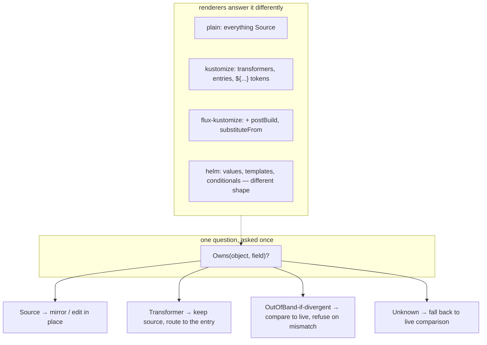

# A renderer abstraction: idea and reasoning

> **exploration — not decided, nothing shipped.** A design sketch for pulling the
> "what does the build do?" knowledge behind a stable seam, so the rest of the code reasons
> against a contract instead of against scattered kustomize-specific branches. Captured
> 2026-07-15. Grew out of the render-fidelity work
> ([render-fidelity.md](render-fidelity.md),
> [kustomize-token-writeback-explained.md](kustomize-token-writeback-explained.md)).

## The itch

The kustomize model leaks across the codebase as ad-hoc branches — `dm.Rendered != nil`,
`putToKustomize`, `kustomizationsListing`, the override-split routing in
[`internal/git/plan_flush.go`](../../../internal/git/plan_flush.go), and more in
`internal/manifestanalyzer/` and `internal/watch/`. Each is a small, correct decision, but
collectively they mean "how kustomize behaves" is *diffuse*: to reason about one write you
consult knowledge spread over three packages. And there is a forward path — Helm, and
orchestrator-aware rendering (Flux `postBuild`, Argo `spec.source.kustomize`) — that today has
nowhere clean to live.

The proposal: **name the seam.** Put the build's behaviour behind an interface, with kustomize
as one implementation, so adding a renderer, or reasoning about the current one, is local.

## The key reframe: "render" is not one operation

The word "render" hides at least four jobs. Lumping them behind a single `Render()` is where
these abstractions usually go wrong, because they abstract at very different quality:

| # | Job | Kustomize | Abstracts cleanly? |
|---|---|---|---|
| 1 | **Forward render** — `inputs → []object` | `kustomize build` | **Yes.** Clean signature, obvious contract. |
| 2 | **Field ownership / inverse** — where does a live change belong in source so a re-render reproduces it? | images/replicas → entry; labels → transformer-owned; patch-injected → nobody | **Partly.** This is where the scattered `if`s live; the *shape* differs per renderer. |
| 3 | **Placement / wiring** — new-file location + editing `resources:` | `kustomization.yaml` | **Poorly.** Helm's model (`templates/` + `values.yaml`) shares no shape. |
| 4 | **Blind-spot declaration** — what does this renderer know it *cannot* see? | "I never resolve `${...}`; postBuild/overrides/version are invisible to me" | **Yes**, and this is underused today. |

Job 1 is nearly free to abstract. Job 4 is cheap and valuable. Jobs 2 and 3 are the real design
work, and the trap is an interface that makes them *look* uniform when they are not: forcing
Helm's placement through kustomize-shaped methods it then stubs out is **worse** than today's
explicit branches, because the branches are at least honest about the coupling.

## We are already at N ≈ 2 — the plain-manifests path

An important correction to "don't abstract from a single implementation": **we already have a
second renderer.** The plain-manifests path is a degenerate implementation of exactly this
interface, and the `dm.Rendered != nil` branches *are* the polymorphism, done by hand:

| Interface job | Kustomize | **Plain manifest** |
|---|---|---|
| Forward render | `kustomize build` | **identity** — `render(x) = x` (the Git document itself) |
| Field ownership | transformer/entry-aware | **all `Source`** — every field is owned by the file |
| Placement / wiring | append to `resources:` | placement only, **no wiring** (no-op) |
| Blind spots | postBuild, overrides, version | **still non-empty** — a plain file inside a Flux Kustomization is *also* subject to `postBuild` |

That last row is the subtle, important one: "plain" does **not** mean "no out-of-band context."
The token fence runs on plain documents too (`plain-postbuild-token`), because a plain manifest
under a Flux Kustomization can still be substituted. So plain is a renderer whose *forward* and
*ownership* jobs are trivial but whose *blind spots* are real.

This materially strengthens the case: the seam is not speculative, it already exists as a
runtime `if`. But be honest about what plain proves and what it does not:

- ✅ It exercises jobs **1 and 2** (the ownership seam) — plain is the identity/all-`Source`
  end of that axis.
- ❌ It barely exercises job **3** (placement/wiring) and does **not** exercise a *different
  source model* at all — a plain file is still "a YAML document," the same leaf kustomize edits.

So we are at N ≈ 1.5, not N = 2-that-covers-everything. Enough to justify *naming* the seam;
not enough to *freeze* it. Helm is the model with a genuinely different source shape, and it is
the honesty test the interface must eventually pass.

## The seam that actually kills the scattered `if`s

Most of the branches that bother us ask the **same question** in different ad-hoc ways: *who
owns this field?* The token check, the source-form keep-source rule, and the images/replicas
routing are three instances of one polymorphic call:

```text
Owns(object, fieldPath) -> { Source | Transformer | OutOfBand | Unknown }
```

- **source-form** = "for `Transformer`-owned fields, keep the source bytes."
- **images/replicas edit-through** = "for `Transformer`-owned fields that route to an entry,
  write the entry, not the source."
- **the fidelity gate** = "for fields I'd call `OutOfBand`-if-divergent, refuse." The `${...}`
  token is just kustomize's cheap way of answering `OutOfBand-if-divergent`.

And `Unknown` is first-class: it is *exactly* when we fall back to the live comparison. The
fidelity gate exists because ownership is not always statically decidable — so a renderer that
answers `Unknown` and defers to "compare against live" is not a cop-out, it is the honest model.



A sketch of the full interface (illustrative, **not** prescriptive):

```go
type Renderer interface {
    Render(inputs Tree, ctx ClusterContext) ([]Object, error) // job 1
    Owns(obj Object, field Path) Ownership                     // job 2 — the unifier
    PlaceNew(obj Object) (Placement, error)                    // job 3
    WireIn(p Placement) Edits ; WireOut(p Placement) Edits     // job 3
    BlindSpots() []BlindSpot                                   // job 4
}
```

Fill the columns and the design tension is visible at a glance: `plain` and `kustomize` are
answerable today; `flux-kustomize` needs `ctx` (cluster reads); `helm`'s `PlaceNew`/`WireIn`
have questions marks that should be answered on paper *before* the interface is frozen.

## The strongest motivation: FluxKustomize / ArgoKustomize

This is more than pluggability, and it is why the abstraction is worth doing even if Helm never
ships. The whole render-fidelity problem is that `applied = f(repo, orchestrator-context)` while
we compute `g(repo)`, and the token gate is a *detector* for `g ≠ f`. A `FluxKustomizeRenderer`
that reads the Flux Kustomization and applies `postBuild`/`substituteFrom` is an attempt to make
**`g = f`** by modelling the context — the "orchestrator awareness / interpreter model" third
fence the design already reserves ([orchestrator-knowledge-boundary.md](orchestrator-knowledge-boundary.md)).
If you make `g = f`, the token gate largely *evaporates* and edit-through becomes correct
*through* `postBuild`.

Be clear-eyed about why it is not a free drop-in:

- **It is not a pure function of the folder.** `substituteFrom` reads cluster ConfigMaps and
  Secrets, so the signature is `Render(inputs, clusterContext)`, not `Render(folder)`. (Same
  reason the fidelity check cannot run at the offline structure-only gate.)
- **Version/flag fidelity.** Flux and Argo run *their* kustomize version with *their* flags —
  and here the abstraction *helps*: `FluxKustomizeRenderer` gets to own "use the version Flux
  ships," a concern scattered today.
- **The inverse must be context-aware too.** If live `us-east` came from a `postBuild` var, the
  correct edit-through may be "edit the substitution ConfigMap" or "you cannot edit this here,"
  not "write the source file." A forward model that reports "no divergence" while the reverse
  still writes to the wrong place is worse than refusing.

## Recommendation and sequencing

1. **Name the seam without changing behaviour first.** Refactor the existing kustomize + plain
   branching behind `Render` + `Owns`, keeping outputs byte-identical. This is safe *because*
   plain and kustomize already exercise the ownership axis — it is a pure locality win, no new
   capability, and it makes the remaining coupling explicit and located.
2. **Spike `FluxKustomizeRenderer` next — before Helm.** It reuses the kustomize machinery you
   already have (cheap), it attacks the actual #1 divergence cause (`postBuild`), and it forces
   exactly the "render needs cluster context + version pinning + context-aware inverse" seam
   **without** also forcing the "entirely different source model" seam. Use it to *discover* the
   real shape of `ClusterContext` and the inverse.
3. **Only then judge Helm.** With the context seam known, write the Helm `PlaceNew`/`WireIn`/
   `Owns` on paper and see what genuinely generalises. If Helm fits without stubbing
   kustomize-shaped methods, the interface is honest; if it forces stubs, bend the interface —
   do not bend Helm.
4. **Do not freeze the interface until FluxKustomize exists in code and Helm exists on paper.**
   Freezing from kustomize (plus degenerate plain) alone is how kustomize's shape becomes "the"
   shape.

## Risks to hold in view

- **Premature abstraction from a degenerate N.** Plain validates the ownership axis, not the
  source-model axis. Treat the interface as provisional until a non-degenerate second renderer
  stresses jobs 3 and 4.
- **Leaky abstraction.** An interface that hosts Helm only by having Helm stub kustomize methods
  is a step backward. The forcing function is: *could a new renderer implement this without
  lying?*
- **Deleting load-bearing knowledge.** Some kustomize `if`s encode real semantics — a `labels`
  transform overwrites `metadata.labels` wholesale via `SetEntry`; a strategic-merge patch
  *prepends* a container, so you cannot align lists by position (see `IssueUnplaceableEdit`).
  The goal is to **relocate** that knowledge into the `KustomizeRenderer` behind a stable
  question, **not** to erase it. If the abstraction deletes the knowledge, it deletes the
  correctness.

## Bottom line

Yes to the interface — but its centre of gravity is **field ownership + declared blind spots**
(`Owns` and `BlindSpots`), not `Render` alone. `Render` is the easy 20%; ownership + declared
blindness is the 80% that makes the machinery stop being hard to reason about. Start by naming
the seam over today's plain + kustomize pair (a behaviour-preserving refactor), then let
`FluxKustomize` — which is also the highest-value renderer — teach you the context seam before
anything is frozen.

## See also

- [render-fidelity.md](render-fidelity.md) — the fence this would eventually subsume by making
  `g = f`.
- [kustomize-token-writeback-explained.md](kustomize-token-writeback-explained.md) — the concrete
  problem a `FluxKustomize` renderer would model away.
- [orchestrator-knowledge-boundary.md](orchestrator-knowledge-boundary.md) — reading the Flux /
  Argo object; the `TransformedOutOfBand` claim these renderers would emit.
- [finished/images-and-replicas-edit-through.md](finished/images-and-replicas-edit-through.md) —
  the source-form / ownership machinery the `Owns` seam would generalise.
