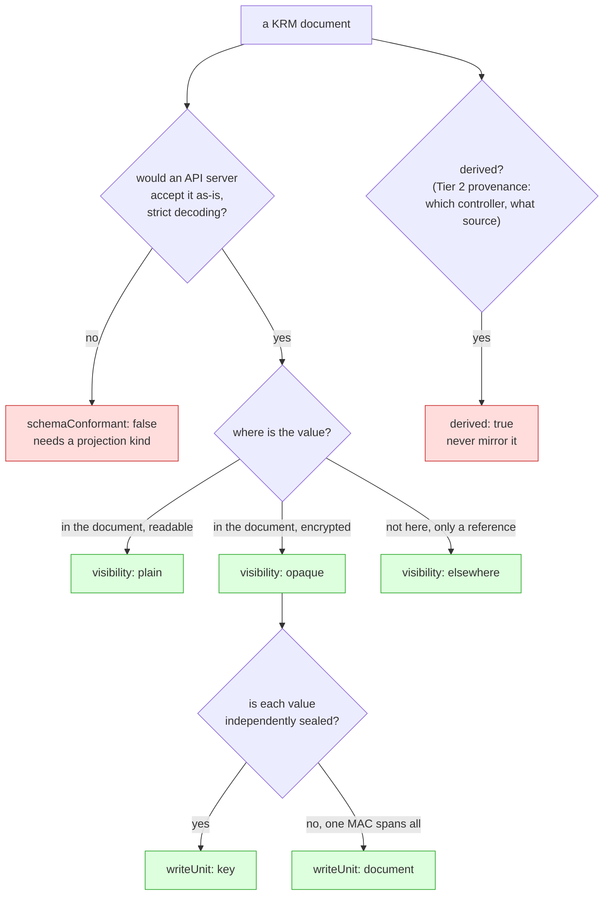

# Resource capability model: what may I do to this document?

> Status: direction-setting; proposes one small registry, ships no code.
> Captured: 2026-07-10
> Related:
> [orchestrator-knowledge-boundary.md](orchestrator-knowledge-boundary.md),
> [sealed-secrets-and-external-secrets.md](sealed-secrets-and-external-secrets.md),
> [write-only-encrypted-secrets.md](write-only-encrypted-secrets.md),
> [README.md](README.md)

## Purpose

Some resources do not fully align with "read it, edit it, write it back." A
value may be unreadable, may live in another system entirely, or may be owned by
a controller. Today the writer discovers this one special case at a time.

This doc proposes the smallest vocabulary that lets **any present or future
kind** declare what may be done to it, without core learning anything about that
kind's controller.

Four knobs and a lookup table. Not a plugin system.

SOPS is deliberately **not** the subject here. It is one row in the table, and
the point of the table is that it stops being a special case.

## Where this sits

[The boundary doc](orchestrator-knowledge-boundary.md) tiers knowledge. This adds
the missing half-tier, and its defining property is *who asserts the fact*:

| Tier | Question | Asserted by |
|---|---|---|
| **0** | Is this a Kubernetes object at all? | the bytes |
| **0b** | **What may I do to this object?** | **the document itself** |
| 1 | How does kustomize render it? | the kustomization |
| 2 | Who else claims this path? | *another object* (Argo `Application`, Flux `Kustomization`, `ImageUpdateAutomation`) |

Tier 0b is self-describing, which is exactly why it must not live with the
orchestrator interpreters. A `SealedSecret` announces its own opacity. Nothing
external has to tell us.

## The evidence: schema conformance, not encryption

The instinct is that encrypted things are hard because they are encrypted. That
is wrong, and a real API server settles it. Every result below is from
`kubectl apply --dry-run=server` against Kubernetes v1.36.

| # | Document | Result |
|---|---|---|
| 1 | `Secret` with `data:` holding `ENC[AES256_GCM,...]` | `BadRequest: illegal base64 data at input byte 3` |
| 2 | `Secret` with `stringData:` ciphertext plus a top-level `sops:` field | `BadRequest: strict decoding error: unknown field "sops"` |
| 3 | `Secret` with *valid* base64 plus a top-level `sops:` field | `BadRequest: strict decoding error: unknown field "sops"` |
| 4 | as (3), with `--validate=false` | **created** — `sops:` silently dropped |
| 5 | as (2), with `--validate=false` | **created** — value stored as the literal string `ENC[AES256_GCM,...]` |
| 6 | A CRD field typed `string` holding the *identical* ciphertext | **created**, round-tripped byte for byte |

Read rows 1 and 6 together. The same ciphertext is rejected inside a `Secret` and
accepted inside a CRD.

> A SOPS `Secret` is not hard because it is encrypted. It is hard because it
> stores ciphertext in `data`, a field the `Secret` schema types as
> base64-encoded bytes, and adds a top-level `sops` field the schema does not
> have. A `SealedSecret` stores the same kind of ciphertext in a field its own
> CRD types as `string`, so it is ordinary, valid KRM.

**Encryption is orthogonal. Schema conformance is the discriminator.**

Row 5 is the one to be frightened of: with validation disabled, the API server
accepts the document and an application later reads its password as the literal
text `ENC[AES256_GCM,...]`. No error anywhere. Anything that applies documents on
our behalf must use strict decoding.

## The four knobs



**1. `schemaConformant`** — would an API server accept this document as written,
under strict decoding? If not, it can never be stored, hydrated, or edited as
itself, and it needs a projection kind. This is the *only* reason to mint a new
kind, and it is why [`EncryptedSecret`](write-only-encrypted-secrets.md) exists.

**2. `visibility`** — `plain` (the value is here and readable), `opaque` (the
value is here and encrypted), or `elsewhere` (there is no value here, only a
reference to one). Note `elsewhere` is not a degraded `opaque`: an
`ExternalSecret` is entirely readable, it simply is not the secret.

**3. `writeUnit`** — `document`, `key`, or `none`. Whether a single value can be
replaced without knowing the others. SOPS is `document` because one `mac` spans
every plaintext value. Sealed Secrets is `key` because each value is sealed
independently. `none` means the document is not ours to write at all.

**4. `derived`** — this object was produced by a controller from another object.
It is an *output*, not desired state, and mirroring it to Git creates a second
source of truth.

> ⚠️ **The evidence for this knob is NOT a controller `ownerReference`.** That was
> this doc's claim, and it is empirically false. Measured against live controllers,
> an `ownerReference` catches **one expansion producer in five**: objects rendered
> by a Flux `HelmRelease` and objects expanded by a flux-operator `ResourceSet` —
> both of which have no home in Git and must be refused — carry **none at all**.
> A gate keyed on `ownerReference` would mirror both.
>
> `derived` is a **Tier 2 provenance claim**, not a Tier 0 field check: the answer
> depends on *which controller applied the object and what that controller's source
> is* — a folder of files (has a home) or a template inside a CR (no home). The
> measured evidence table is in
> [`../../facts/expansion-provenance-markers.md`](../../facts/expansion-provenance-markers.md);
> the argument is in
> [expansion-boundary-and-corpus-organisation.md](expansion-boundary-and-corpus-organisation.md).

That knob is not hypothetical, and the sanitizer makes it worse.
`internal/sanitize/sanitize.go` **deletes** `ownerReferences` before a document
reaches Git, and nothing gates on them first — so what evidence there is gets
destroyed rather than used. The best signal, the applying field manager, lives in
`metadata.managedFields` and never reaches the sanitized document at all. **The gate
must run on the live object, before the sanitizer.**
See [sealed-secrets-and-external-secrets.md](sealed-secrets-and-external-secrets.md)
for what that costs.

## The table

| Kind | `schemaConformant` | `visibility` | `writeUnit` | New kind needed? |
|---|---|---|---|---|
| `ConfigMap`, `Deployment`, … | ✅ | `plain` | `document` | no |
| `Secret` (plain) | ✅ | `plain` | `document` | no |
| `Secret` + `sops:` stanza | ❌ | `opaque` | `document` | **yes** — `EncryptedSecret` |
| `SealedSecret` | ✅ | `opaque` | `key` | no |
| `ExternalSecret` | ✅ | `elsewhere` | `document` | no |
| any object a controller **expanded** (no home file in Git) | ✅ | — | `none` (`derived`) | no |
| a file claimed by `ImageUpdateAutomation` | ✅ | `plain` | `none` | no (a Tier 2 claim) |

The punchline of the whole exercise:

> **Exactly one row needs a new kind, for exactly one reason, and that reason is
> not encryption.**

## Shape of the registry

The classifier cannot be a constant per GVK, because `Secret` is `plain` or
`opaque` depending on whether the document carries a `sops:` stanza. So the
registry maps a group/kind to a **classifier**, and the classifier reads the
document.

```go
type Visibility int // Plain | Opaque | Elsewhere
type WriteUnit int  // Document | Key | None

type Capability struct {
    SchemaConformant bool
    Visibility       Visibility
    WriteUnit        WriteUnit
    Derived          bool
    // Reason is prose for a human. Never switch on it.
    Reason string
}

type Classifier interface {
    // Handles is version-tolerant: group and kind only.
    Handles(group, kind string) bool
    Classify(doc *Document) Capability
}
```

Default for an unknown kind: `schemaConformant: true`, `plain`, `document` — the
ordinary KRM assumption that already holds today. The registry only ever *narrows*
what may be done, never widens it, which keeps it safe to add classifiers
incrementally.

## Deliberately not

- **Not a plugin API.** A compiled-in table of three or four classifiers. If
  users need to describe their own CRDs, the escape hatch is the existing
  `.gittargetignore`, not a DSL.
- **Not a decryption interface.** No knob asks for a key. `opaque` is terminal.
- **Not controller emulation.** The registry never unseals, fetches, or renders.
- **Not a fifth knob.** If a kind seems to need one, check first whether the fact
  is asserted by *another object* — in which case it is a Tier 2 claim, and it
  belongs in the claim vocabulary, not here.

## Open questions

1. **Where does `schemaConformant` come from?** Today it would be hardcoded for
   the SOPS case. It could instead be *derived*: fetch the OpenAPI schema and try
   a strict decode. That is exact, and it needs a cluster — which
   [`ScanRepo` explicitly does not have](repo-discovery-and-onboarding-scan.md).
   Is a hardcoded classifier acceptable, or does this belong to a cluster-aware
   second pass?
2. **Is `visibility` per-document or per-field?** A `SealedSecret` is `opaque` in
   `spec.encryptedData` and `plain` in `spec.template`, which is fully editable.
   `writeUnit: key` covers the practical need, but a per-field model would be
   more truthful. Is the extra dimension worth it?
3. **Does `derived` belong here at all?** It is a fact about the *live* object
   (an `ownerReference`), not about the Git document — every other knob reads the
   document. Perhaps `derived` is a fifth thing: a **live-state** gate on the
   mirror path, sibling to this registry rather than inside it.
4. **What is the default for an unknown CRD carrying obvious ciphertext?** We
   cannot know that `spec.encryptedData` is opaque for a kind we have never heard
   of. Treating it as `plain` means we would happily rewrite it. Is that
   acceptable, given we would rewrite it with values from the live cluster, which
   is the same source the controller derived it from?
