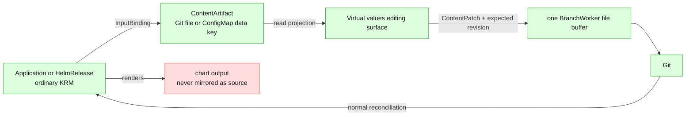

# Editing values content: architecture and delivery plan

> **Status: direction-setting.** This records the architecture needed to expose Git-authored
> values as an editing surface. It does not make Helm rendering, free-standing values-file
> editing, or Kustomize generators supported today.
>
> **Related:** [support contract](support-contract.md),
> [values-file projection](values-file-projection.md),
> [orchestrator knowledge boundary](orchestrator-knowledge-boundary.md),
> [resource capability model](resource-capability-model.md), and the
> [layout corpus](../../../test/fixtures/gitops-layouts/).

## The short answer

A Helm `Application` or `HelmRelease` should **not** be modified to contain the contents of a
`values.yaml` it references. The Kubernetes object contains a *reference* to a source input, not a
copy of that input. Argo CD and Flux read that input while they render the chart; the resulting
objects are expansion output, not a place from which the values file can be reconstructed.

The neat way to edit a values file is therefore:

1. prove that a Git-authored content artifact is an input to exactly one release;
2. expose that artifact as a virtual editing surface, with clear provenance; and
3. write the requested YAML-node change back to its one real Git location.

The virtual surface may eventually be served through an aggregated API, but it must stay a
projection of Git. It is not an additional copy of the content, is not a watched cluster object,
and must never be inserted into the normal KRM mirror/sweep model.

It is also an explicit **Git authoring** boundary. It must create a Git change first and let the
normal GitOps reconciler apply it later; it must not mutate the chart output or an in-cluster
release as a shortcut.



## The mental-model correction

The operator already treats an `Application` or `HelmRelease` as ordinary, editable intent-layer
KRM. A watch observes a changed object and the normal writer updates its Git document. That works
for fields actually held by the object, including inline values such as `HelmRelease.spec.values`
or Argo `helm.valuesObject`.

`valueFiles`, `valuesFiles`, and `valuesFrom` are different. They are indirections:

| Release field | What is stored in the release object | Actual value location |
|---|---|---|
| Argo `helm.valuesObject`; Flux `spec.values` | YAML values | a field of the release document |
| Argo `helm.values` | YAML encoded as one string | a field of the release document; today it is an opaque blob |
| Argo `helm.valueFiles`; Flux `spec.chart.spec.valuesFiles` | a path | a file in the selected source repository |
| Flux `spec.valuesFrom` | object name, optional key, and optional target path | `ConfigMap`/`Secret` data in another KRM object |

Copying file contents into `Application.spec` or `HelmRelease.spec` would produce two competing
sources of configuration and would also change the release's semantics. Editing a values file must
instead target the source named by the reference. Once Git is committed, the existing Argo/Flux
reconciliation detects the source revision and applies it in its normal direction.

This also keeps the expansion boundary intact. A chart-rendered `Deployment` does not reliably say
which values key created a field, and one values key can affect many rendered objects. The operator
must not infer a values-file edit from a rendered object change.

## The authority boundary: Git authoring is a product decision

The values-content proposal crosses a boundary that normal GitOps reconcilers deliberately do not
cross. Their direction is:

```text
Git desired state  -->  Argo CD / Flux  -->  cluster state
```

The current GitOps Reverser has a different, reverse-mirroring capability: it can observe selected
KRM changes in the cluster and write their source documents to Git. That is useful for a deliberate
capture workflow, but it is not the same as ordinary Git-authoritative reconciliation. A values
editing surface must not quietly blend the two directions.

There are three coherent product modes:

| Mode | Initiator | Write path | Cluster change | Values-file fit |
|---|---|---|---|---|
| **Strict GitOps** | developer edits Git or raises a PR | Git only | Argo/Flux applies the merged revision | The operator may inspect/prove inputs, but does not edit them |
| **Git authoring gateway** | authenticated user sends an explicit content-edit request | operator makes a Git commit or PR | Argo/Flux later applies that Git revision | **Recommended future values experience** |
| **Reverse capture** | a selected live KRM object changes | watcher mirrors the object back to Git | the change already happened | Existing product direction; not a way to infer or edit a free values file |

The second mode is still GitOps in the important sense: Git remains the sole desired-state authority
after the request. The service is an authoring client for Git, much like a UI that opens a pull
request. It does *not* call the Kubernetes API to change a `Deployment`, and it does not make an
`Application` or `HelmRelease` contain copied values. The user asks to change a Git artifact; the
reconciler notices the new Git revision afterwards.

This is a meaningful expansion of the product, so it needs explicit consent and a separate API
contract. It should not arrive accidentally through a `WatchRule` or as a side effect of observing
a rendered resource.

### Requirements for a Git authoring gateway

An eventual `ContentPatch` request must carry the same accountability expected of a direct Git
author:

- **Authorisation and identity:** Kubernetes authentication identifies the requester; the Git
  commit/PR records that identity and the exact artifact, YAML path, old revision, and new value.
- **Git-first acknowledgement:** success means the expected Git revision was changed (or a PR was
  opened), not that the cluster was mutated. A later status may report that Argo/Flux observed or
  applied the revision, but that is a separate asynchronous fact.
- **Proven deployment source:** before authoring, the binding must prove that the target Git
  repository, revision, and path are the source the `Application` or `HelmRelease` consumes.
  Otherwise the operator could commit a valid file that no deployed release reads.
- **No direct object shortcut:** the request may only change its resolved `ContentArtifact` in Git.
  It may not rewrite the release object, a generated ConfigMap, or a chart-rendered workload to
  simulate the outcome.
- **Loop discipline:** a later Argo/Flux apply will produce normal Kubernetes events. The capture
  pipeline must recognise the already-committed source form as a no-op and must not create a second
  reverse-mirror commit.

The open policy choice is whether this gateway pushes directly to a protected branch or always
creates a branch/PR. A PR is the safer initial shape: it makes the new authoring role visible and
preserves the normal review gate. Direct pushes should require an explicit repository policy, not a
default hidden behind a values editor.

## User-facing use cases

The corpus already contains the important shapes. They are related, but they need distinct backing
locations and safety rules.

| User goal | Source of truth | Proposed experience | Initial verdict |
|---|---|---|---|
| Change inline Helm values | `Application`/`HelmRelease` document | normal KRM editing | Supported today where the field is structured |
| Change a whole values document in a hand-written ConfigMap | `ConfigMap.data[valuesKey]` | normal ConfigMap edit; later expose the nested YAML view | Supported as ordinary KRM today |
| Change one scalar supplied by `valuesFrom.targetPath` | `ConfigMap.data[valuesKey]` | edit the ConfigMap key, with the target-path provenance shown | Normal KRM edit today; nested-value UX is future work |
| Change a private, single-release `values.yaml` | free-standing Git file | virtual values editing surface writes the file | Planned |
| Inspect a private values file without editing it | free-standing Git file | virtual read-only surface with provenance | Planned before writing |
| Change a shared `common.yaml` | one file consumed by several releases | show the consumers and refuse the edit | Refuse initially |
| Change a generated ConfigMap's source `values.yaml` | file read by `configMapGenerator` | edit the file, then prove the Kustomize render | Deferred: generators are currently refused |
| Change chart templates or rendered output | chart package / controller output | no surface | Permanent refusal |

The useful product promise is not "edit whatever Helm rendered." It is: **edit an authored
configuration input when the system can prove its one writable home and its effects are not
ambiguous.**

## Where the current branch is

The branch delivers a deliberately small Move 1: a recognised values file can be **read-only
context**, rather than a stray non-KRM YAML document that refuses its whole folder.

The current implementation is:

1. `FolderScan` retains YAML bytes, while `ManifestStore.FilesByPath` materialises only KRM-bearing
   files.
2. `helmValueFileRefs` in
   [`internal/manifestanalyzer/valuefiles.go`](../../../internal/manifestanalyzer/valuefiles.go)
   minimally decodes Argo `Application` and Flux `HelmRelease` documents and gathers path-shaped
   values entries.
3. It records matching non-KRM YAML paths in `ManifestStore.ValueFileRefs`.
4. The acceptance gate suppresses `ReasonNotKRM` for those paths, and `scan-repo` stops counting
   them as non-KRM noise.
5. The file remains outside `FilesByPath`; the writer has no route into it, so it is not patched,
   swept, or deleted.

That separation is the correct first principle: context must not accidentally become managed KRM.
It is not yet an editable-file architecture.

There is no current virtual content API and no current direct-cluster values write. The branch only
changes acceptance classification; it neither commits values content nor changes an `Application`,
`HelmRelease`, ConfigMap, or chart output.

### A path-shaped reference is not yet a proven deployment input

`ValueFileRefs` is only a `map[path]struct{}`. It remembers neither the consumer nor why the path
was selected. The current matcher tries relative, scan-root, and basename-co-located candidates
without proving that the release's source is this GitTarget repository.

This is acceptable **only** because Move 1 has the narrow classification claim: a matching YAML
file is retained *read-only context* and is never materialised, patched, swept, or deleted. The
product may choose to accept such a file as a benign, named passenger even when it cannot prove the
deployer consumes it. That choice keeps the door open to a permanent read-only policy for external
values files.

It must not be described as source awareness or as proof that the release consumes the local file.
The branch currently proves a path-shaped match, not the Git/source relationship. Comments,
fixtures, status text, and future API labels should say **"named read-only context"**, not
**"deployment input"**. A proven binding is compulsory for a read projection that claims
provenance and for every write feature; it is not a prerequisite for this deliberately harmless
Move 1 acceptance policy.

### How Argo CD and Flux resolve values-file paths

The tool semantics matter most once the product makes a claim beyond benign context. The following
describes the current upstream resolution models; it is not behaviour implemented by this branch.

| Tool and spelling | Where the deployer resolves it | Is a co-located GitTarget file necessarily consumed? | Consequence for a future editor |
|---|---|---|---|
| Argo `helm.valueFiles: [$values/platform/app/values.yaml]`, with a `sources[]` item `ref: values` | The `$values` prefix selects that ref source; the remainder is relative to the **root of the referenced Git repository**. | No; the analyzer must still prove the ref source is the GitTarget repository and revision it may write. | Potentially editable after exact `ref` and repository/revision proof. This is the standard external-chart + Git-hosted-values pattern. |
| Argo `helm.valueFiles: [values.yaml]` on a Git application source | The path is resolved in that source's application path. | No; it is local only when that source is proven to be this Git target and path. | Potentially editable only after source proof. |
| Argo `helm.valueFiles: [values.yaml]` on a Helm/OCI chart source (`repoURL` plus `chart`) | The path is resolved in the fetched/extracted chart. | **No.** A same-named YAML file next to the `Application` in the operator's Git checkout is unrelated. | Never offer that co-located file as an editable release input. |
| Flux `HelmChart.spec.valuesFiles` (including the `HelmRelease.spec.chart.spec` template form) with `sourceRef.kind: GitRepository` | The path is relative to the referenced Git source artifact. | No; the referenced `GitRepository` must be proven to identify this writable Git target and revision. | Potentially editable after source-object and repository proof. |
| The same Flux field with `sourceRef.kind: HelmRepository` | The path is read from the fetched chart package. | **No.** A local file beside the `HelmRelease` is not what Flux reads. | Never offer that co-located file as an editable release input. |
| Flux `valuesFrom` | A named in-cluster `ConfigMap` or `Secret` data key, merged in declared order. | Not a free-standing file question. | Model it as a KRM-field artifact; ConfigMaps and Secrets have distinct capability rules. |

Argo documents the `$ref` form specifically for an external/public chart with Git-hosted custom
values: the ref maps to a Git source and `$ref/...` is rooted at that source's repository
root. It also documents ordinary value-file ordering, glob expansion, and environment substitution.
Flux documents `valuesFiles` as paths relative to the `sourceRef`, with `HelmRepository`,
`GitRepository`, and `Bucket` being distinct source kinds and later files overriding earlier
ones. See the upstream [Argo Helm guide](https://argo-cd.readthedocs.io/en/latest/user-guide/helm/),
[Argo multiple-sources guide](https://argo-cd.readthedocs.io/en/latest/user-guide/multiple_sources/),
and [Flux HelmChart guide](https://fluxcd.io/flux/components/source/helmcharts/).

Globbed, environment-expanded, remote-URL, missing/optional, and dynamically generated entries
are not one statically identifiable file. A future binding interpreter must represent them as such,
not use basename matching to turn them into a writable local path.

The three branch fixtures illustrate why this distinction is useful:

- The Argo `$values/...` fixture represents the right **shape** for externally hosted charts with
  Git values. The current test proves only that the matcher recognizes the spelling; it does not
  validate the declared `ref` or repository identity.
- The bare-path external-Argo fixture and the Flux `HelmRepository` fixture are useful Move 1
  regression cases: they show a harmless local values-shaped YAML can be accepted as context. They
  must not be used as evidence that changing the local file changes a deployment.

### What must be added before a provenance or editability claim

The matcher is insufficient for any stronger safety claim:

- it does not resolve an Argo `$ref` to a declared source or validate that source's canonical Git
  identity and revision against the target the operator may write;
- it does not follow a Flux `sourceRef` to its `GitRepository`/`HelmRepository` object and source
  identity;
- it cannot tell whether a path is a glob/environment expansion, one consumer or many consumers,
  nor whether a later values layer overrides the change.

Those omissions are intentionally outside a read-only acceptance classification. They are blockers
for source-aware read APIs and writes.

## The missing model: an input graph

The analyser needs to retain the relationship it has discovered, rather than collapse it to a path
set. The terms below are deliberately tool-neutral.

```go
// Sketch only: this is a design vocabulary, not an API proposal.
type ContentArtifact struct {
    // File names free-standing Git bytes. KRMString names a string-valued field
    // inside one KRM document, for example ConfigMap.data["values.yaml"].
    Kind     ArtifactKind
    FilePath string
    Document RecordRef
    Field    []string
}

type InputBinding struct {
    Consumer   RecordRef
    Artifact   ContentArtifact
    Semantics  BindingSemantics // ArgoValueFile, FluxChartValueFile, FluxValuesFrom, ...
    Order      int              // precedence order, never guessed from a map
    Resolution Resolution       // ProvenLocal, External, Missing, Ambiguous, Unsupported
    Reason     string
}
```

The graph is built during analysis from the already-parsed KRM documents, but source resolution
also needs immutable GitTarget context: canonical repository identity, checked-out revision, scan
root, and write scope. A structural `fs.FS` scan does not know the repository URL, so it may report
an association as *unverifiable*; the live writer can supply the actual GitProvider origin.

The graph supplies three different answers that a path set cannot:

1. **Acceptance:** is this non-KRM path a proven input to content the target owns?
2. **Readability:** what release and field consume this artifact, and in what order?
3. **Editability:** is there one writable artifact, one consumer, no disqualifying layer or other
   writer, and a precise source-aware edit route?

The existing Kustomize write fan-in covers only Kustomize `resources:` reachability. Values-file
fan-in must be calculated from `InputBinding`s; it is a separate invariant, even though it has the
same user-facing rule: do not write through into shared context.

## A single backing buffer, including ConfigMaps

There must be exactly one mutable copy of each Git file per commit. The current `writeBatch` already
has the right lower-level shape: it hydrates a file once into a commit-scoped buffer and flushes only
that buffer if it changed.

Content editing should add a `ContentPatch` operation to that batch rather than create another cache
or another writer:

1. The read side derives a `ContentArtifact` and a content revision/hash from the current store
   snapshot.
2. A caller requests a YAML-path edit with that expected revision.
3. The writer rechecks eligibility and revision, edits a `yaml.Node` in the artifact, and writes
   the result into the existing buffer for the containing Git file.
4. The normal Git path, ignore, scope, fan-in, and applicable render preconditions run before the
   branch worker commits.

For a free-standing file, the buffer target is simply `values.yaml`. For a hand-written ConfigMap,
the artifact is a nested view:

```text
ConfigMap document in values-configmap.yaml
  data["values.yaml"]  -- a YAML string --> parsed nested YAML node
```

The nested node is transient. A successful patch is encoded back into that one `data` scalar and
then into the same `values-configmap.yaml` file buffer. A normal watch-driven ConfigMap update and a
content-surface update therefore serialize in the same branch worker and never compete through two
in-memory copies.

Secrets need a separate capability decision: their data representation and encryption policy may
make a nested editable view unsafe. They must not inherit ConfigMap behaviour by accident.

## Layering and generated inputs

Values are ordered inputs, not a single map. Argo has `parameters`, `valuesObject`, `values`, and
multiple `valueFiles`; Flux has inline values and ordered `valuesFrom` entries, including
`targetPath` splices. A file can be a legitimate input while a particular key in it has no effect.

The first editable release should use a deliberately strict document-level rule:

- exactly one proven local content artifact;
- exactly one consuming release;
- no glob, environment expansion, remote source, or unresolved reference;
- no other supported layer that can override it; and
- no Kustomize generator, external writer, or source-form ambiguity.

Later work may offer per-key eligibility by evaluating a complete precedence graph. It should not
pretend that generic YAML values can be safely merged without preserving the source tool's ordering
and semantics.

`configMapGenerator` is a separate multi-hop graph, not a ConfigMap special case:

```text
values.yaml --generator input--> generated ConfigMap.data["values.yaml"]
            --valuesFrom--> HelmRelease
```

The writable home is the file, never the generated ConfigMap. Supporting it requires Kustomize
generator support and a render proof that the proposed source edit changes only the intended derived
content. The current support boundary correctly refuses this shape; it should remain deferred.

## Recommended delivery sequence

1. **Choose the authority mode.** Treat values editing as an explicit Git authoring gateway or keep
   the product strict-GitOps/read-only. Define authentication, commit/PR policy, and the distinction
   between Git commit success and later reconciliation success before exposing a write endpoint.
2. **Make Move 1's policy explicit.** Keep the current path match only as named, never-written
   context, or narrow acceptance to proved inputs if that stronger product policy is desired. In
   either case, correct comments and fixture descriptions so they do not claim the matcher proved
   runtime consumption. Add a multi-document decode regression: a malformed/unrelated document
   must not prevent a later release from contributing its Move 1 context classification.
3. **Add the source-aware read model only if it is valuable.** Replace `ValueFileRefs` with
   `InputBinding`s that resolve source identity, field, precedence, and fan-in. Its output should
   distinguish `named-context`, `proven-local-input`, `external-input`, and `unresolved` rather than
   treating all matches as writable candidates. This step is useful for inspection even if the
   product permanently declines free-standing file writes.
4. **Write one free-standing file through Git.** Support an exact, single-release, unlayered local
   values file through an authenticated `ContentPatch` plus an optimistic content revision. Prove
   byte-stable no-op behaviour, branch-worker conflict handling, and an Argo/Flux apply that follows
   the Git change rather than a direct Kubernetes mutation.
5. **Add ConfigMap data-key views.** Reuse the same artifact/editor contract, but bind a nested YAML
   view to the existing ConfigMap document buffer. Test a simultaneous ordinary ConfigMap update and
   virtual-content edit.
6. **Consider generators last.** Only after Kustomize generator modelling and before/after render
   verification can establish source form and blast radius.

Every source-aware or write step should add corpus fixtures and an integration test that uses a real
source relationship: an Argo `$ref` whose repo is the test GitTarget, or a Flux Git source that
demonstrably contains the values file. A Move 1 test that only proves the GitTarget accepts a folder
is sufficient for its narrow no-write classification—but it does not prove the release consumes the
file.

## Non-goals

- Rendering a chart to reverse-map a live `Deployment` field to a Helm value.
- Treating chart output, Helm templates, or generated ConfigMaps as editable source.
- Duplicating file contents inside `Application` or `HelmRelease` objects.
- Adding synthetic values objects to the ordinary Kubernetes watch/resync/sweep lifecycle.
- Using a values edit to mutate a release or workload directly in the cluster.
- Making a Secret editable as if it were a plain ConfigMap.

These limits are what let a future editing experience be powerful without turning GitOps Reverser
into a Helm renderer or a second configuration authority.
