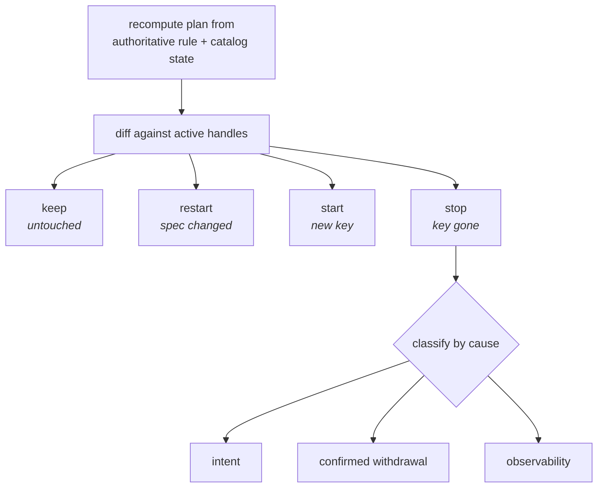
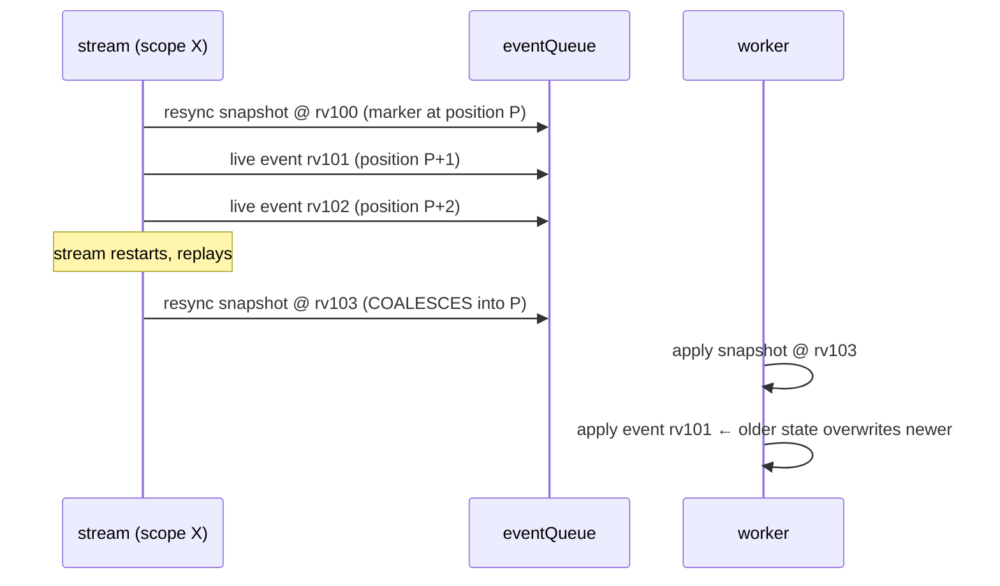

# TargetWatchPlan: incremental stream reconciliation

> **design** — open, not yet built. Index: [`../INDEX.md`](../INDEX.md)

Parent architecture:
[Watch and catalog architecture](watch-and-catalog-architecture.md), whose cells,
confidence model, and managed projection this plan implements for the target
watch layer. Motivation and the failure that prompted it:
[Data-plane triggering](data-plane-triggering.md).

Today a GitTarget's watch set is replaced wholesale. Any change to the declared
set cancels every stream and replays all of them, so adding one WatchRule
re-replays state that did not change and floods the branch worker's shared queue.
This document specifies the incremental replacement: a **plan** that is diffed,
not rebuilt.

It is written to be implementable. Where a contract is not yet decided, it says
so rather than implying one.

---

## 1. Types

```go
// CellKey identifies one watched slice of one GitTarget. It is the identity that
// ResyncScope already uses, and the two MUST agree: a cell's key and the scope
// its sweep runs under are the same value viewed from two layers.
type CellKey struct {
    GVR       schema.GroupVersionResource
    Namespace string // "" is cluster-wide, a PEER of any named namespace
}

// StreamSpec is everything about a cell that, when changed, invalidates the
// running stream. It is immutable and compared by value.
type StreamSpec struct {
    Operations OperationSet
    // Add here, never elsewhere, anything else that changes what the stream
    // delivers. A field that belongs here but is stored outside it is a silent
    // "keep" for a stream that should have restarted.
}

type TargetWatchPlan struct {
    Generation uint64                    // monotonic per GitTarget
    Cells      map[CellKey]StreamSpec
}
```

`CellKey` deliberately reuses `ResyncScope`'s identity semantics. A cell whose key
does not round-trip to the scope its sweep runs under is a defect, because the
sweep boundary and the gather boundary would differ.

---

## 2. Classification: four outcomes, not three

The earlier sketch in [data-plane-triggering.md](data-plane-triggering.md) said
`start` / `stop` / `keep`. That is wrong: it silently keeps a stream whose
**spec** changed while its key did not.

```text
keep    = key in both, StreamSpec equal        leave the handle running
restart = key in both, StreamSpec differs      cancel, then start fresh
start   = key only in new plan                 start fresh
stop    = key only in old plan                 cancel, then classify by cause (§3)
force   = operator or recovery override        restart every key
```

`restart` is not a rare case. `targetWatchSpecs` already keys on `(GVR,
namespace)` with the **operation filter as the value**, so an edit that changes
only which verbs a rule follows produces exactly this shape, and today's
whole-set replacement handles it correctly by accident. An incremental diff that
compares keys alone would regress it.



---

## 3. Why a cell left decides what happens to Git

This is the normative table. It supersedes the single rule proposed in
[data-plane-triggering.md](data-plane-triggering.md) §7.2.1, which collapsed all
removals into one coverage sweep.

| Cause | Example | Authoritative? | Action on the mirror |
|---|---|---|---|
| **Intent** | WatchRule deleted or narrowed, namespace deselected, label revoked | yes | Remove the cell's managed projection (subject to §3.1) |
| **Confirmed withdrawal** | `TypeRemoved` after `RemovalGrace` settles | yes | Per-type untracking, on the settled event only |
| **Observability** | discovery wobble, list failure, RBAC denial, source cluster unreachable | **no** | **Hold.** Keep the handle and the files. Never delete |

The third row is the one that must never be got wrong, and it is why a
"walk the folder and delete anything uncovered" rule cannot stand on its own: an
incomplete plan is indistinguishable from a narrowed one at the moment of the
walk. Coverage is a useful *invariant to assert*, not a safe *action to take*.

[Type lifecycle events and wobble settling](../spec/type-lifecycle-events-and-wobble-settling.md)
already encodes the middle row: `TypeWobbling` must not sweep, and only a settled
`TypeRemoved` triggers untracking for that type. This plan does not re-decide
that. It consumes it.

### 3.2 The withdrawal signal exists; it has no consumer

Worth being precise, because it is a build dependency rather than a design gap.

**Already built.** CRDs and APIServices are watched as catalog triggers
(`crdTriggerGVR`, `apiServiceTriggerGVR`, with `get;list;watch` RBAC), so a CRD
delete is *observed*, not inferred from discovery going quiet. The registry emits
a per-type lifecycle in [`internal/typeset/lifecycle.go`](../../internal/typeset/lifecycle.go)
(`TypeActivated`, `TypeWobbling`, `TypeRecovered`, `TypeRemoved`, `TypeRefused`),
and `RemovalGrace` is what separates a wobble from a removal, so the waiting
before calling a type gone is part of the abstraction rather than something this
plan has to add.

**Not yet wired.** `Registry.Subscribe` has no production caller.
`Materializer.OnLifecycleEvent` handles `TypeRemoved` by force-releasing the
checkpoint while keeping the claim, so a reappearance re-syncs, and its comment
describes itself as the observer "the future driver wires onto
`Registry.Subscribe`".

So the confirmed-withdrawal row of the table above is implementable by
**connecting an existing producer to a consumer**, not by building a detector.
The plan's `stop` classification is the natural consumer: a settled `TypeRemoved`
is one authoritative cause of a cell leaving the plan, and it arrives already
graced.

### 3.1 Intent-driven removal and `prune.mode`: an open API question

The product intent recorded during review is that the cluster is the source of
truth and Git is a ledger kept in sync, so removing a WatchRule should remove what
that rule mirrored, while deleting the whole GitTarget should not (mirroring ends;
the ledger stands).

Two things stand in the way, and both need an explicit decision rather than an
implementation choice.

**It contradicts a shipped recommendation.**
[Namespace-scoped resync](watchrule-source-namespace/pr1-namespace-scoped-resync.md)
states, under "Revocation leaves prior content, a decision, not an oversight":
*"Recommended: retain, and make it visible."* If intent-driven removal now
deletes, this document supersedes that recommendation and must say so in the same
words, so a reader of the older page is not misled.

**It changes an API contract.** `spec.prune.mode` is documented as: `Never`
suppresses all deletes, `OnEvent` (the default) mirrors only observed DELETE
events, and only `Always` permits inferred resync sweeps. A rule-removal delete
that ignores `prune.mode` is an API semantic change, not a detail.

Three defensible resolutions:

1. **Honor `prune.mode`.** Rule removal deletes only under `Always`. Consistent
   with the documented contract; means the default leaves content behind, which
   is what the product intent objects to.
2. **A third category.** Intent-driven deselection is neither an observed DELETE
   nor an inferred sweep, so it is governed by its own field, leaving
   `prune.mode` untouched. Most honest, costs a new API field.
3. **Redefine `OnEvent`.** Treat a deselection as an "event". Cheapest to build,
   and the most likely to surprise a user who read the current documentation.

This document does not pick one. It records that picking one is a prerequisite,
because every option below assumes the watch layer has already decided the
deletion policy before any work reaches the worker.

---

## 4. Ordering: the fence this design requires

[Data-plane triggering](data-plane-triggering.md) §4 argues that a snapshot and
the events behind it cannot be separated. That argument was stated as though
ordering were purely intra-stream. It is not:

- **Overlapping streams are concurrent peers.** A cluster-wide stream and a
  named-namespace stream on one GVR both deliver the same object, on two
  goroutines, as
  [stream scope collapse](watchrule-source-namespace/pr2-stream-scope-collapse.md)
  records. Their relative order is not guaranteed by the apiserver.
- **A restart re-enters the same scope.** The principal `restart` case produces a
  second snapshot for a scope whose earlier events may still be queued.

### 4.1 A live hazard in the current coalescing

Verified in the code as it stands on `main`. `ResourceVersion` is carried on
written content and used for the sensitive-content marker, but **no worker-side
fence compares it before applying a write**. Ordering rests entirely on FIFO
position.

Coalescing replaces a queued resync's payload while keeping the original marker
position. So:



Before coalescing, the second snapshot took its own position at the tail and the
order was correct. This is a regression introduced with the coalescing fix, it is
self-healing on the next event for that object, and it is narrow: it needs a
restart while events for the same scope are still queued. It is nevertheless a
stale write and must be fenced.

### 4.2 What the design must guarantee

Exactly one of these has to be chosen, stated, and tested:

1. **Never coalesce past a tail.** Coalesce only while no work item for that
   scope has been enqueued after the marker. Requires a per-scope enqueue
   sequence: record the sequence at which the marker was placed, track the last
   event sequence per scope, and coalesce only when no event followed. This is
   the smallest change and preserves today's semantics exactly.
2. **Carry a monotonic fence.** A snapshot records the revision it covers, and
   the worker suppresses any event for that scope at or below it. Stronger, and
   it also fixes the overlapping-stream case, but it needs a revision comparison
   that is valid across the two streams that deliver one object.
3. **Restrict coalescing to a pre-tail state.** Coalesce only during replay,
   before any live event for the scope has been admitted.
4. **Coordinate overlapping scopes.** Give one GVR a single ordering domain
   across its streams, which is the largest change and the only one that removes
   the class rather than the instance.

Option 1 is recommended for the immediate fix and option 2 for the target state.
Option 1 does not address overlapping streams; that gap should be recorded rather
than assumed away.

---

## 5. Epoch and lease: a delta contract, not a reset

Stream readiness is already per stream. The obstacle is the target-level render
fidelity gate: beginning an epoch replaces the whole scope set and requires every
scope to report clean before writes reopen. That is why an unchanged scope cannot
resume today, and it is the enabling change.

The gate needs a `BeginDelta` alongside `Begin`:

```text
BeginDelta(target, generation, delta) where
    keep     -> carry the existing per-scope result forward, unchanged
    start    -> pending
    restart  -> pending, discarding any prior result for that key
    stop     -> remove the scope from the epoch entirely
```

with three properties that are easy to get wrong:

- **A kept scope's clean result survives.** Otherwise the delta is a reset with
  extra steps.
- **An unrelated change must not clear an existing divergence.** A target held
  open by a render-fidelity divergence must stay held: adding a WatchRule is not
  evidence that the divergence was resolved. Writes reopen only when the
  diverged scope itself reports clean.
- **Cancellation is not a join.** A canceled stream's goroutine may still be in
  flight with a replay result, a live event, a cursor update, or a resync reply.
  Each stream therefore carries a **generation lease**, and every external effect
  it produces is tagged with it. The manager rejects any effect whose lease is
  not current. `MarkTargetRenderFidelityScopeClean` already ignores a stale epoch;
  the same fencing has to cover cursor writes, stream-state marks, and enqueued
  resyncs.

---

## 6. Removing a cell is a worker operation

A cell removal must not be expressed as an ordinary `ResyncRequest` with an empty
desired set. That overloads "the cluster has nothing here" to also mean "this
scope was deliberately deselected", and the two must reach the prune policy
differently.

Introduce an explicit projection delta, applied by the branch worker in order with
live writes:

```go
type ProjectionDelta struct {
    Target      types.ResourceReference
    Generation  uint64      // the plan generation that decided this
    Cell        CellKey     // same identity semantics as ResyncScope
    Cause       RemovalCause // intent | confirmed-withdrawal
    Policy      DeletionDecision // decided by the watch layer, not re-derived here
}
```

Properties:

- It rides the same FIFO, so it is ordered against live writes like everything
  else.
- The **watch layer decides the policy**; the worker applies it. The worker must
  not re-derive intent from an empty desired set.
- It carries the plan generation, so retention, render fidelity, status, and
  metrics can all be updated from one consistent view.
- Its scope of deletion is the cell's **managed projection**: the files that cell
  owns. Auxiliary and retained files inside an accepted folder are not the cell's
  and are never touched, per the acceptance rules.

The managed projection is the piece
[Watch and catalog architecture](watch-and-catalog-architecture.md) §1.7 names as
required and which does not exist yet. Until it does, "delete the cell's files" is
not a well-defined operation, and this is the dependency that gates §3.

---

## 7. Build order

Each step is independently shippable and leaves the system correct.

1. **Fence the coalescing regression** (§4.1, option 1). Small, and it removes a
   live stale-write path. No plan work required.
2. **Introduce the types** (§1) and compute the plan without acting on it. Log
   the classification. This validates the diff against real workloads with zero
   behavior change.
3. **`BeginDelta` and the generation lease** (§5). Still no incremental
   application: prove that a kept scope can carry its result and that stale
   effects are rejected.
4. **Apply `keep` / `restart` / `start`** (§2). At this point unrelated replays
   stop, which is the performance goal. `stop` continues to behave as today.
5. **Wire the lifecycle** (§3.2): subscribe to the registry so a settled
   `TypeRemoved` reaches the plan as an authoritative `stop` cause. The producer
   and the grace already exist.
6. **Decide §3.1**, then build the managed projection and `ProjectionDelta` (§6),
   then enable `stop` for intent-driven removal.
7. **Revisit the ordering fence** for overlapping streams (§4.2 option 2 or 4).

Steps 1 through 4 deliver the speed and reliability improvement. Steps 5 through 7
are where the semantics live, and none of them should be rushed to reach them.

---

## 8. Acceptance scenarios

A scenario list, not a test plan. Each needs a failing-first test.

**Classification**

- An operation-filter edit on an existing key restarts that stream and only that
  stream.
- Adding a WatchRule starts one stream; no other stream replays.
- Removing one of several rules stops one stream; the others are untouched.
- A no-op edit (a status write, an unrelated spec field) classifies everything as
  `keep` and starts nothing.

**Overlap**

- A cluster-wide stream and a named-namespace stream on one GVR coexist; stopping
  the wider one does not remove documents the narrower one still covers.
- An object in the overlapping namespace, delivered on both streams, converges to
  one state.

**Cancellation and staleness**

- A canceled stream's in-flight replay result is rejected by lease.
- A canceled stream's cursor write does not resurrect a stale resume point.
- A canceled stream's queued resync does not apply after its replacement's.

**Ordering**

- A restart while events for that scope are queued does not apply an older event
  after a newer snapshot (§4.1).
- Queue saturation drops or coalesces without any accepted request failing to
  run.

**Cause and policy**

- A discovery wobble holds every cell: no stream stops, nothing is deleted.
- A settled `TypeRemoved` untracks that type only.
- An unreachable source cluster holds; it never presents as deselection.
- Each `prune.mode` behaves as §3.1 decides, including the default.

**Render fidelity**

- A diverged scope stays diverged across an unrelated plan change; writes do not
  reopen.
- The diverged scope reporting clean reopens writes, once.
