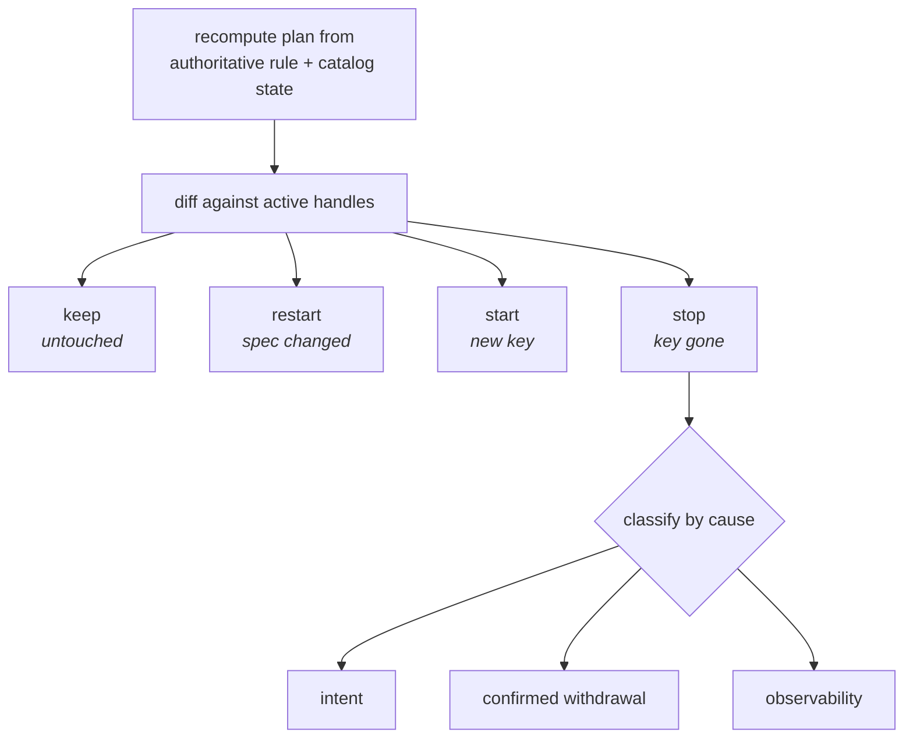
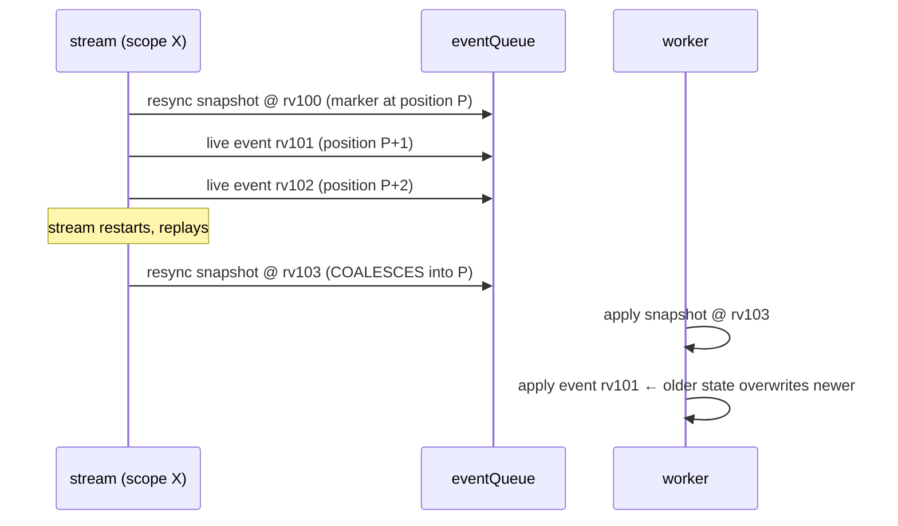

# TargetWatchPlan: incremental stream reconciliation

> **design** — open, not yet built. Index: [`../INDEX.md`](../INDEX.md)

Parent architecture:
[Watch and catalog architecture](watch-and-catalog-architecture.md), whose cells,
confidence model, and managed projection this plan implements for the target
watch layer. Motivation and the failure that prompted it:
[Data-plane triggering](data-plane-triggering.md).

Today a GitTarget's watch set is replaced wholesale. Any change to the declared
set cancels every stream and replays all of them, so adding one WatchRule
re-replays state that did not change and floods the branch worker's shared queue.
This document specifies the incremental replacement: a **plan** that is diffed,
not rebuilt.

It is written to be implementable. Where a contract is not yet decided, it says
so rather than implying one.

---

## 1. Types

```go
// CellKey identifies one watched slice of one GitTarget. BUILT, in internal/types:
// group/resource/namespace, with the served version carried as data beside it (§1.1).
type CellKey struct {
    Group     string
    Resource  string
    Namespace string // "" is cluster-wide, a PEER of any named namespace
}

// StreamSpec is everything about a cell that, when changed, invalidates the
// running stream. It MUST be comparable with ==, which rules out holding an
// OperationSet directly: that is a map[string]struct{}, so it is both mutable
// and not comparable. Hold the canonical rendering instead, which
// targetWatchSpecs already produces as its map value.
type StreamSpec struct {
    Operations string // canonical, sorted; the existing spec value
}

// ActiveCell is a running stream. The lease, not the plan generation, is what
// fences its effects.
type ActiveCell struct {
    Spec   StreamSpec
    Lease  uint64 // advances ONLY on start and restart of this cell
    Cancel context.CancelFunc
}

type TargetWatchPlan struct {
    Generation uint64                 // advances on every plan change
    Cells      map[CellKey]StreamSpec
}
```

**Plan generation and cell lease are different things, and conflating them is a
bug.** If every plan change advanced a single target-wide generation, a `keep`
stream that was never touched would start producing effects tagged with a stale
generation the moment an unrelated cell changed, and a generation-based fence
would reject its perfectly valid work.

So: the plan generation orders **plan transitions**; a cell's lease fences **that
cell's effects**, and advances only when that cell is started or restarted. A
`stop` leaves a **tombstone** (the key with its retired lease) for long enough to
reject work that is still queued from the canceled stream. A tombstone is
retired once no work carrying that lease can remain in flight.

### 1.1 `CellKey` and `ResyncScope` are not identical today

The intent is that a cell's key and the scope its sweep runs under are one
boundary. They are not yet:

- `ResyncScope` holds a full `GVR`, **including version**.
- `ResyncScope.Matches` compares group, resource, and namespace, and **ignores
  version**.

So two cells differing only in served version are distinct keys but one sweep
boundary. Before either type claims to reuse the other's identity, pick one:

1. **Enforce one active served version per logical resource**, making the version
   in the key redundant but harmless; or
2. **Make the key group/resource/namespace**, matching what `Matches` actually
   compares, and carry the served version as data on the cell rather than as
   identity.

**Settled: option 2.** `types.CellKey` is group/resource/namespace, and the
served version travels as data on whatever carries the cell — on `ResyncScope`,
which still renders `{{.APIVersion}}` in a reconcile commit message, and on the
watch key, which has to open a watch at a concrete version. It is the shared
identity of the three things that must agree: the stream, the render-fidelity
scope it reports into, and the sweep boundary its resync runs under.
`RenderFidelityScope` is gone; it was the same fields under a third name.

The producer now guarantees what the identity assumes: `targetWatchStreams`
declares **one stream per cell**, choosing the served version once (the preferred
record, else the higher-sorting version, stable across declaration order) and
unioning the collapsed record's operation filter so no rule loses coverage. Two
streams over one cell would have been two snapshots sweeping each other's
documents. A cluster-wide scope stays a peer of any named namespace: those are
different cells, and both stream.

---

## 2. Classification: four outcomes, not three

The earlier sketch in [data-plane-triggering.md](data-plane-triggering.md) said
`start` / `stop` / `keep`. That is wrong: it silently keeps a stream whose
**spec** changed while its key did not.

```text
keep    = key in both, StreamSpec equal        leave the handle running
restart = key in both, StreamSpec differs      cancel, then start fresh
start   = key only in new plan                 start fresh
stop    = key only in old plan                 cancel, then classify by cause (§3)
```

`force` is not a fifth outcome. It is an **override** that skips the diff
entirely, applied by an operator or a recovery path, and its effect is to
classify every key as `restart` regardless of what the diff would have said. It
therefore has no cause to classify (§3) and no bearing on the mirror: nothing
left the plan.

`restart` is not a rare case. `targetWatchSpecs` already keys on `(GVR,
namespace)` with the **operation filter as the value**, so an edit that changes
only which verbs a rule follows produces exactly this shape, and today's
whole-set replacement handles it correctly by accident. An incremental diff that
compares keys alone would regress it.



---

## 3. Why a cell left decides what happens to Git

This is the normative table. It supersedes the single rule proposed in
[data-plane-triggering.md](data-plane-triggering.md) §7.2.1, which collapsed all
removals into one coverage sweep.

| Cause | Example | Authoritative? | Action on the mirror |
|---|---|---|---|
| **Intent** | WatchRule deleted or narrowed, namespace deselected, label revoked | yes | Remove the cell's managed projection (subject to §3.1) |
| **Confirmed withdrawal** | `TypeRemoved` after `RemovalGrace` settles | yes | Per-type untracking, on the settled event only. **What untracking does to the files is open: see §3.2** |
| **Observability** | discovery wobble, list failure, RBAC denial, source cluster unreachable | **no** | **Hold.** Keep the handle and the files. Never delete |

The third row is the one that must never be got wrong, and it is why a
"walk the folder and delete anything uncovered" rule cannot stand on its own: an
incomplete plan is indistinguishable from a narrowed one at the moment of the
walk. Coverage is a useful *invariant to assert*, not a safe *action to take*.

[Type lifecycle events and wobble settling](../spec/type-lifecycle-events-and-wobble-settling.md)
already encodes the middle row: `TypeWobbling` must not sweep, and only a settled
`TypeRemoved` triggers untracking for that type. This plan does not re-decide
that. It consumes it.

### 3.1 Intent-driven removal and `prune.mode`: an open API question

The product intent recorded during review is that the cluster is the source of
truth and Git is a ledger kept in sync, so removing a WatchRule should remove what
that rule mirrored, while deleting the whole GitTarget should not (mirroring ends;
the ledger stands).

Two things stand in the way, and both need an explicit decision rather than an
implementation choice.

**It contradicts a shipped recommendation.**
[Namespace-scoped resync](../finished/watchrule-source-namespace/pr1-namespace-scoped-resync.md)
states, under "Revocation leaves prior content, a decision, not an oversight":
*"Recommended: retain, and make it visible."* If intent-driven removal now
deletes, this document supersedes that recommendation and must say so in the same
words, so a reader of the older page is not misled.

**It changes an API contract.** `spec.prune.mode` is documented as: `Never`
suppresses all deletes, `OnEvent` (the default) mirrors only observed DELETE
events, and only `Always` permits inferred resync sweeps. A rule-removal delete
that ignores `prune.mode` is an API semantic change, not a detail.

Three defensible resolutions:

1. **Honor `prune.mode`.** Rule removal deletes only under `Always`. Consistent
   with the documented contract; means the default leaves content behind, which
   is what the product intent objects to.
2. **A third category.** Intent-driven deselection is neither an observed DELETE
   nor an inferred sweep, so it is governed by its own field, leaving
   `prune.mode` untouched. Most honest, costs a new API field.
3. **Redefine `OnEvent`.** Treat a deselection as an "event". Cheapest to build,
   and the most likely to surprise a user who read the current documentation.

This document does not pick one. It records that picking one is a prerequisite,
because every option below assumes the watch layer has already decided the
deletion policy before any work reaches the worker.

---

### 3.2 What "untracking" does to the files is not yet decided

The table says a settled `TypeRemoved` untracks that type. It deliberately does
not say whether untracking **deletes** the files, **retains** them, or **follows
`prune.mode`**, because the existing material points two ways:

- [Watch and catalog architecture](watch-and-catalog-architecture.md) proposes
  **retaining** files on CRD withdrawal, while treating intent-driven
  deselection as a separate decision.
- The product intent recorded in §3.1 is that the ledger tracks the cluster, and
  a type that no longer exists arguably has nothing left to track.

They are reconcilable, and the argument for retaining is stronger than it first
looks: a withdrawn CRD is frequently an operator upgrade in progress, and its
custom resources are the thing a user would most regret losing. Retention is also
recoverable, deletion is not.

**Recommendation, not a decision:** retain on confirmed withdrawal, delete on
intent. The asymmetry is the same one §3.1 draws for GitTarget deletion: we sweep
when the user narrowed what we mirror, and hold when the world changed under us.

This must be written down before §6's `ProjectionDelta` carries a `Cause`, since
the cause is only useful if each value maps to a decided action.

### 3.3 The withdrawal signal exists; it has no consumer

Worth being precise, because it is a build dependency rather than a design gap.

**Already built.** The registry emits
a per-type lifecycle in [`internal/typeset/lifecycle.go`](../../internal/typeset/lifecycle.go)
(`TypeActivated`, `TypeWobbling`, `TypeRecovered`, `TypeRemoved`, `TypeRefused`),
and `RemovalGrace` is what separates a wobble from a removal, so the waiting
before calling a type gone is part of the abstraction rather than something this
plan has to add.

The guarantee to rely on is that settled `TypeRemoved`, **not** direct
observation of a CRD delete. Local CRD and APIService informers exist as catalog
triggers, but they run in the operator's own control plane; a **remote** source
cluster's API surface is learned through discovery refresh and the registry's
judgement across scans, where a failed group keeps serving last known facts
rather than looking like an empty surface. Treating "we watch CRDs" as the
mechanism would be right for the local cluster and wrong for every mirrored
one.

**Not yet wired.** `Registry.Subscribe` has no production caller. The registry
computes and dispatches the events on every scan, and nothing receives them. The
one consumer that existed, the `Materializer`'s demand axis, was deleted in
August 2026 once the watch-first rewrite left it unreachable.

So the confirmed-withdrawal row of the table above needs a consumer built, not a
detector: the producer is already correct and already graced. The plan's `stop`
classification is the natural consumer, because a settled `TypeRemoved` is one
authoritative cause of a cell leaving the plan.

## 4. Ordering: the fence this design requires

[Data-plane triggering](data-plane-triggering.md) §4 argues that a snapshot and
the events behind it cannot be separated. That argument was stated as though
ordering were purely intra-stream. It is not:

- **Overlapping streams are concurrent peers.** A cluster-wide stream and a
  named-namespace stream on one GVR both deliver the same object, on two
  goroutines, as
  [stream scope collapse](../finished/watchrule-source-namespace/pr2-stream-scope-collapse.md)
  records. Their relative order is not guaranteed by the apiserver.
- **A restart re-enters the same scope.** The principal `restart` case produces a
  second snapshot for a scope whose earlier events may still be queued.

### 4.1 A live hazard in the coalescing, since fenced

**Status: fixed.** The hazard is described below as it stood, because the fence
only holds while the reason for it is legible. What shipped is in §4.3.

`ResourceVersion` is carried on
written content and used for the sensitive-content marker, but **no worker-side
fence compares it before applying a write**. Ordering rests entirely on FIFO
position.

Coalescing replaces a queued resync's payload while keeping the original marker
position. So:



Before coalescing, the second snapshot took its own position at the tail and the
order was correct. This is a regression introduced with the coalescing fix, it is
self-healing on the next event for that object, and it is narrow: it needs a
restart while events for the same scope are still queued. It is nevertheless a
stale write and had to be fenced.

### 4.2 What the design must guarantee

Exactly one of these has to be chosen, stated, and tested:

1. **Never coalesce past a tail.** Coalesce only while no work item for that
   scope has been enqueued after the marker. This needs a per-scope enqueue
   sequence, and therefore needs **provenance on queued items** (§5.1): today a
   queued `Event` carries the object's identity but not the cell that produced
   it, and with a cluster-wide and a namespaced stream both delivering one
   object, the producing cell cannot be recovered from the object's namespace.
   So this option is smallest in concept but is gated on provenance, and the two
   should be built together.
2. **Carry a monotonic fence.** A snapshot records the revision it covers, and
   the worker suppresses any event for that scope at or below it. Stronger, and
   it also fixes the overlapping-stream case, but it needs a revision comparison
   that is valid across the two streams that deliver one object.
3. **Restrict coalescing to a pre-tail state.** Coalesce only during replay,
   before any live event for the scope has been admitted.
4. **Coordinate overlapping scopes.** Give one GVR a single ordering domain
   across its streams, which is the largest change and the only one that removes
   the class rather than the instance.

Option 3 was drafted here as the immediate fix, on the grounds that it needs no
provenance. It does not hold as stated: whether the **arriving** request is a
replay says nothing about whether writes were queued behind the **existing
marker**, and the marker's position is the one coalescing reuses. The condition
has to be a property of the pending entry. §4.3 is what shipped instead — option
1, made available without provenance by over-matching.

Provenance (§5.1) does **not** narrow this test, and an earlier draft here was
wrong to suggest it would. Matching a queued write against the pending snapshot
by *producing cell* would let a write from an overlapping peer — the cluster-wide
stream delivering an object the named cell also covers — pass the fence and be
overwritten by that cell's next snapshot. The tail test stays identity-based and
over-matching for as long as two cells can deliver one object. What provenance
buys the fence is the lease, which no identity match can recover. Option 2 or 4
is the target if overlapping streams are to be ordered rather than merely fenced.
None of 1, 3, or the shipped fence addresses overlapping streams; that gap is
recorded, not assumed away.

### 4.3 The shipped fence

Option 1 — never coalesce past a tail — turns out not to be gated on provenance,
provided the tail test is allowed to over-match. `BranchWorker.pendingResyncs`
holds, per `(GitTarget, scope)`, the request that will run and a flag recording
whether anything for that scope has been queued **behind its marker**:

- enqueuing a write marks every pending entry whose GitTarget and scope `Matches`
  one of the write's events. The target is read from the **event**, not from the
  `WriteRequest`: the live path wraps one event per request and leaves the
  request-level fields empty, so a fence reading the request would never trip on
  the only path it exists for;
- enqueuing a CommitRequest attach marks every pending entry of that GitTarget,
  since an attach decides which commit window later work joins and carries no
  resource identity to match on;
- a resync arriving at a marked entry does not coalesce. It releases the key and
  takes a fresh marker at the tail, and the earlier marker runs the payload it
  carried, at its own position — the pre-coalescing behavior, restored exactly
  for the case that needs it.

The match is by object identity, not by producing cell: with a cluster-wide and a
namespaced stream both delivering one object, the cell cannot be recovered from
the event. Over-matching is the safe direction, because it can only forgo a
coalesce, never wrongly permit one. Coalescing therefore still absorbs the storm
that motivated it — a deleted GitTarget replaying with no writes of its own marks
nothing — while writes into a scope bound how far its snapshot can move.

The mark and the FIFO send are **one critical section**, on the same mutex
`EnqueueResync` holds across its own send. Marking before an unlocked send leaves
a window in which a resync sees the mark, declines to coalesce, and takes its tail
position before the write it is fencing against has entered the queue — the same
inversion, one step removed. Both sends are non-blocking, so holding the lock
across them cannot deadlock.

Entries are identified by their marker pointer, not by the key alone. Once a key
has been released and reclaimed by a later request, the older marker must run
what it carried rather than pick up the newer entry, which is the same
stale-write bug reached from the other side.

---

## 5. Epoch and lease: a delta contract, not a reset

Stream readiness is already per stream. The obstacle is the target-level render
fidelity gate: beginning an epoch replaces the whole scope set and requires every
scope to report clean before writes reopen. That is why an unchanged scope cannot
resume today, and it is the enabling change.

The gate needs a `BeginDelta` alongside `Begin`:

```text
BeginDelta(target, generation, delta) where
    keep     -> carry the existing per-scope result forward, unchanged
    start    -> pending
    restart  -> pending, discarding any prior result for that key
    stop     -> remove the scope from the epoch entirely
```

with three properties that are easy to get wrong:

- **A kept scope's clean result survives.** Otherwise the delta is a reset with
  extra steps.
- **An unrelated change must not clear an existing divergence.** A target held
  open by a render-fidelity divergence must stay held: adding a WatchRule is not
  evidence that the divergence was resolved. Writes reopen only when the
  diverged scope itself reports clean.
- **Cancellation is not a join.** A canceled stream's goroutine may still be in
  flight with a replay result, a live event, a cursor update, or a resync reply.
  Each stream therefore carries a **generation lease**, and every external effect
  it produces is tagged with it. The manager rejects any effect whose lease is
  not current. `MarkTargetRenderFidelityScopeClean` already ignores a stale epoch;
  the same fencing has to cover cursor writes, stream-state marks, and enqueued
  resyncs.

---

### 5.1 The lease has to reach the branch worker

A lease that only the manager knows is not a fence. Once an item is on the FIFO,
the manager cannot withdraw it, and the worker has nothing to check it against:
neither `Event` nor `ResyncRequest` carries a source cell or lease today, and
there is no validation hook on the way in.

So every queued item needs provenance:

```go
type Provenance struct {
    Cell  types.CellKey
    Lease uint64
}
```

The GitTarget is deliberately absent: every item that carries provenance already
names its target, and a second copy is a second answer waiting to disagree — the
coalescing fence had to choose between a request-level and an event-level target,
and reading the wrong one made it silently never fire (§4.3).

attached to write requests, resync requests, and projection deltas alike, with
one defined checkpoint: **the worker validates provenance when it dequeues an
item, before applying it**, and drops anything whose lease is not current for its
cell (including anything matching a tombstone). Dropping must be counted, not
silent, because a nonzero rate means streams are being restarted more than the
plan intends.

What this does **not** do is let the coalescing tail test key on the producing
cell: while a cluster-wide and a namespaced stream can both deliver one object, a
write from the peer cell must still fence the named cell's snapshot, so that test
stays identity-based and over-matching (§4.3). Provenance is what a *lease* fence
needs, and a lease is the one thing an item's content can never yield — an
object's identity is unchanged by the restart that retired the stream.

## 6. Removing a cell is a worker operation

A cell removal must not be expressed as an ordinary `ResyncRequest` with an empty
desired set. That overloads "the cluster has nothing here" to also mean "this
scope was deliberately deselected", and the two must reach the prune policy
differently.

Introduce an explicit projection delta, applied by the branch worker in order with
live writes:

```go
type ProjectionDelta struct {
    Target      types.ResourceReference
    Generation  uint64      // the plan generation that decided this
    Cell        CellKey     // same identity semantics as ResyncScope
    Cause       RemovalCause // intent | confirmed-withdrawal
    Policy      DeletionDecision // decided by the watch layer, not re-derived here
}
```

Properties:

- It rides the same FIFO, so it is ordered against live writes like everything
  else.
- The **watch layer decides the policy**; the worker applies it. The worker must
  not re-derive intent from an empty desired set.
- It carries the plan generation, so retention, render fidelity, status, and
  metrics can all be updated from one consistent view.
- Its scope of deletion is the cell's **managed projection**: the files that cell
  owns. Auxiliary and retained files inside an accepted folder are not the cell's
  and are never touched, per the acceptance rules.

The managed projection is the piece
[Watch and catalog architecture](watch-and-catalog-architecture.md) §1.7 names as
required and which does not exist yet. Until it does, "delete the cell's files" is
not a well-defined operation, and this is the dependency that gates §3.

---

## 7. Build order

Each step is independently shippable and leaves the system correct.

1. ~~**Fence the coalescing regression** (§4.1).~~ **Done**, as §4.3: option 1
   with an over-matching tail test, which needs no provenance.
2. ~~**Add provenance to queued items** (§5.1).~~ **Done.** Every live event and
   every replay snapshot carries the cell and the lease of the stream that
   produced it; an enqueue, a coalesce and a queue-full drop name them. Nothing
   enforces a lease yet — that is step 5 — but the field cannot be added to items
   already in flight, which is why it lands first.
3. ~~**Settle the identity question** (§1.1)~~ **Done**, as option 2, with one
   stream per cell at the producer.
4. **Introduce the types** (§1) and compute the plan without acting on it. Log
   the classification. This validates the diff against real workloads with zero
   behavior change.
5. **`BeginDelta` and per-cell leases** (§5). Still no incremental application:
   prove that a kept cell carries its result forward and that stale effects are
   rejected by lease.
6. **Apply `keep` / `restart` / `start`** (§2). At this point unrelated replays
   stop, which is the performance goal. `stop` continues to behave as today.
7. **Wire the lifecycle** (§3.3): subscribe to the registry so a settled
   `TypeRemoved` reaches the plan as an authoritative `stop` cause. The producer
   and the grace already exist.
8. **Decide §3.1 and §3.2**, then build the managed projection and
   `ProjectionDelta` (§6), then enable `stop`.
9. **Revisit the ordering fence** for overlapping streams (§4.2 option 2 or 4).

Steps 1 through 6 deliver the speed and reliability improvement. Steps 7 through 9
are where the semantics live, and none of them should be rushed to reach them.

---

## 8. Acceptance scenarios

A scenario list, not a test plan. Each needs a failing-first test.

### Classification

- An operation-filter edit on an existing key restarts that stream and only that
  stream.
- Adding a WatchRule starts one stream; no other stream replays.
- Removing one of several rules stops one stream; the others are untouched.
- A no-op edit (a status write, an unrelated spec field) classifies everything as
  `keep` and starts nothing.

### Overlap

- A cluster-wide stream and a named-namespace stream on one GVR coexist; stopping
  the wider one does not remove documents the narrower one still covers.
- An object in the overlapping namespace, delivered on both streams, converges to
  one state.

### Cancellation and staleness

- A canceled stream's in-flight replay result is rejected by lease.
- A canceled stream's cursor write does not resurrect a stale resume point.
- A canceled stream's queued resync does not apply after its replacement's.

### Ordering

- A restart while events for that scope are queued does not apply an older event
  after a newer snapshot (§4.1).
- Queue saturation drops or coalesces without any accepted request failing to
  run.

### Cause and policy

- A discovery wobble holds every cell: no stream stops, nothing is deleted.
- A settled `TypeRemoved` untracks that type only.
- An unreachable source cluster holds; it never presents as deselection.
- Each `prune.mode` behaves as §3.1 decides, including the default.

### Render fidelity

- A diverged scope stays diverged across an unrelated plan change; writes do not
  reopen.
- The diverged scope reporting clean reopens writes, once.
