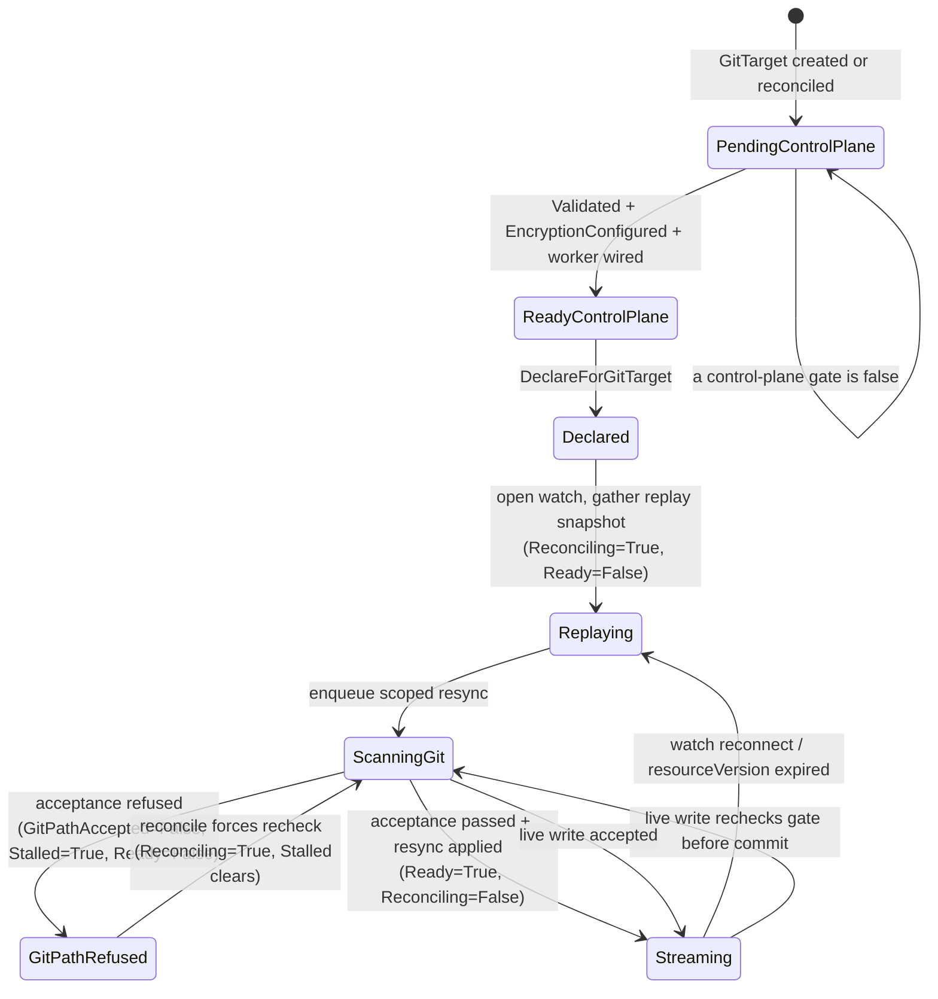

# Refuse unsupported folder content — design + implementation plan

> Status: PROPOSAL — 2026-06-26, **revised 2026-06-27**. The mechanics (refuse a GitTarget path the
> operator cannot safely manage) are settled. The **status surface** is reopened: this revision records the
> back-and-forth that turned a single overloaded `StreamsReady=Blocked` refusal into a deliberate
> two-sided status model, and then — after the `k8s-crd-design-review` skill grew a `kstatus-readiness`
> reference — into a **two-layer kstatus model** (positive `Ready` + abnormal-true `Reconciling`/`Stalled`
> over domain conditions). §3 lays the discarded options next to the chosen one so the reasoning survives;
> the goal is a status contract legible to Flux / Argo CD / `helm --wait`, not just to humans reading YAML.
>
> **Decision recorded** in
> [e2e-coverage-gaps-and-improvements-plan.md §4.1](e2e-coverage-gaps-and-improvements-plan.md): the
> operator must **refuse** a GitTarget path it cannot safely manage, for the cases where we already
> know the content is a problem — not silently keep writing. Written against the **actual** current code,
> not the superseded `Synced`/`materialization` model in
> [status-design-git-target.md](status-design-git-target.md).

---

## 1. The problem, precisely

The acceptance gate ([manifestanalyzer/acceptance.go](../../internal/manifestanalyzer/acceptance.go))
already classifies a folder's content and produces blocking refusals — but it is wired **only into the
`manifest-analyzer` CLI**, never the running controller. The live writer builds its store with an empty
allowlist and **never calls `Accept`**:

- [plan_flush.go:95](../../internal/git/plan_flush.go#L95) (live) — `BuildStoreFromFiles(..., Allowlist{})`,
  comment at :94 says the gate is "applied upstream, not here" — but no upstream caller applies it.
- [resync_flush.go](../../internal/git/resync_flush.go) (first-materialization / mark-and-sweep) — builds
  a plan directly, no acceptance.

So today a folder with duplicate identities, impure managed files, non-KRM passengers, or a
hard-Kustomize `kustomization.yaml` is **detected but not refused**: the operator writes anyway. We will
change that.

## 2. What "the cases where we know it's a problem" means (scope)

Two tiers. We implement **both**, because the second is the user's literal example.

**Tier 1 — structure-only refusals (already fully implemented in `Accept`).** These need no API source,
no registry, no scope predicate — they are unambiguous, purely structural facts about the folder:

| Refusal | IssueKind | Source |
|---|---|---|
| Duplicate manifest identity | `IssueDuplicate` | [acceptance.go:180](../../internal/manifestanalyzer/acceptance.go#L180) |
| Impure managed file (managed file with an empty / non-KRM / invalid passenger) | `IssueImpureManagedFile` | [acceptance.go:207](../../internal/manifestanalyzer/acceptance.go#L207) |
| Standalone non-KRM / invalid YAML | `IssueNonKRM` / `IssueInvalidYAML` | [acceptance.go:228](../../internal/manifestanalyzer/acceptance.go#L228) |
| Managed resource hiding in an allowlisted `kustomization.yaml` | `IssueMixedFile` | [acceptance.go:268](../../internal/manifestanalyzer/acceptance.go#L268) |

`Accept` already runs all of these with no API source ([acceptance.go:165](../../internal/manifestanalyzer/acceptance.go#L165)
gates the *mapping-aware* refusals behind `hasAPISource`, so a structure-only store skips them cleanly).

**Tier 2 — hard-Kustomize refusal (NEW, the named example).** A `kustomization.yaml` that uses
generators / patches / components / helmCharts / replacements / transformers / namePrefix|Suffix /
remote bases is **detected** today (`kustomizationDoc.unsupported` via
[store.go:687](../../internal/manifestanalyzer/store.go#L687) `hasUnsupportedKustomizeFeature`) but only
used to disqualify it as a namespace source — it is **not** a refusal. We add a new acceptance issue
that refuses it, because the operator cannot map such a folder back to editable source documents.

**Out of scope (deliberately):** the mapping-aware refusals (`IssueUnresolvedKRM`, `IssueOutOfScope`)
need a live followability registry + a namespace `InScope` predicate. They depend on cluster discovery
and can blink on a discovery wobble (see [typeset-owns-discovery-grace.md](typeset-owns-discovery-grace.md)).
Refusing on those risks false refusals on a transient. **Defer to a follow-up.**

---

## 3. Status model — the core design question

This is the part that moved during review. The mechanics below (§5–§6) are stable; **how the refusal is
surfaced** went through three rounds. We record all three so the chosen contract is defensible and the
discarded options are not silently lost.

### 3.1 The first draft, and the two critiques that reopened it

**Draft (v1).** Reuse the existing per-type stream state: mark the refused type's stream
`Blocked` with a new reason `UnsupportedContent`, flipping the existing `StreamsReady` condition to
`False`. No new API field. `Ready` stays control-plane-only (provider/branch/encryption/worker valid);
the data-plane refusal never touches it.

Two independent critiques landed against v1:

1. **The "Blocked" framing is inaccurate.** `StreamStateBlocked` is documented as *"the watch cannot
   currently run"* ([stream_readiness.go:42](../../internal/watch/stream_readiness.go#L42)). But a folder
   refusal is **not** a watch failure — the cluster watch runs perfectly. What is unsafe is the **write
   target** (the Git path). Saying "the watch can't run" to describe "the Git path is rejected"
   overloads one axis with two unrelated failure modes, which §7 already flagged as a risk.

2. **`Ready=True` while refusing to mirror is misleading, and it contradicts our own conventions.**
   - Kubernetes convention: a Deployment with a bad image is **not** `Available` even though its spec is
     valid and the controller parsed it; Deployments report `Available`/`Progressing`
     (`ProgressDeadlineExceeded`), not a control-plane-only `Ready`. Pod `Ready` means "operational when
     last probed." Gateway API splits `Accepted` (config understood) from `Programmed`/`Ready` (took
     effect). The GitOps peer (Flux) flips `Ready=False` on invalid source content.
   - **Our own docs say the same.** [status-conditions-guide.md:25-26](status-conditions-guide.md#L25-L26):
     *"Always have a summary condition. `Ready` for long-running objects… This is what operators and
     scripts will `kubectl wait` on,"* with `Ready` glossed as *"summary — True when everything is
     healthy."* The installed `k8s-crd-design-review` skill agrees
     ([conditions-and-status.md:13-24](../../.agents/skills/k8s-crd-design-review/references/conditions-and-status.md#L13-L24)):
     one high-signal **summary** `Ready`, and *"prefer Conditions over state-machine style `status.phase`
     for new APIs."*

   v1 made `Ready` control-plane-only and parked the aggregate health in `status.phase` (`Degraded`) —
   which is exactly the `phase`-as-aggregate pattern the skill tells us to avoid, and it makes
   `kubectl wait --for=condition=Ready` return `True` on a GitTarget that is actively refusing its folder.

### 3.2 The reframe: status for both sides of the sync

The operator's whole job is a **two-sided sync: cluster (source) → Git (target).** The status should name
those two sides directly instead of cramming both into one stream condition. That gives two data-plane
conditions, one per side:

| Condition | Side | True means | False driver |
|---|---|---|---|
| `StreamsRunning` (was `StreamsReady`) | **Source** — cluster | the watches are past initial sync and reconciling **live, continuously** — as designed | initial sync in progress, `WatchError`, `WatchNotPermitted` |
| `GitPathAccepted` (NEW) | **Target** — Git | the selected Git path is safe to materialize | acceptance gate refused: unsupported kustomize, duplicate identity, impure / non-KRM file |

This directly fixes both critiques:

- **Honesty (critique 1).** A folder refusal sets `GitPathAccepted=False` and leaves `StreamsRunning`
  telling the truth about the watch. We no longer claim "the watch can't run" when it can. The source side
  and the target side fail independently and report independently.
- **Right granularity.** The acceptance gate is **whole-folder** (§6.1), so `GitPathAccepted` is naturally a
  **target-level** condition — a cleaner fit than the per-type `Blocked` stream v1 used to approximate it.
- **It is the condition v1 already foreshadowed.** v1's own note said *"if we later want a dedicated
  `Writable`/acceptance condition … this refusal is the first concrete driver for it."* `GitPathAccepted`
  **is** that condition; this reframe just promotes it from "later" to "now," because we have a concrete
  driver today.

> **Naming note (D1 — decided: `StreamsRunning` + `GitPathAccepted`).** The source-side condition ships
> today as `StreamsReady`; we **rename it to `StreamsRunning`**. "Running" states the truth precisely: once
> past the initial sync the streams reconcile *continuously*, exactly as designed — and that steady live
> state is what the condition asserts. They are **not** running during the initial sync (still downloading
> the first snapshot), so `StreamsRunning=True` ⟺ initial sync complete and live. (*StreamsStarted* was
> considered and rejected — "started" is too weak; a stream can be started but still mid-download.) The
> rename touches GitTarget, WatchRule, and ClusterWatchRule (shared condition + printer columns) and the
> `internal/watch` `StreamSummary` — mechanical, and safe while on `v1alpha2`.

### 3.3 The model kstatus pushes us to: two layers

The updated `k8s-crd-design-review` skill now carries a
[`kstatus-readiness.md`](../../.agents/skills/k8s-crd-design-review/references/kstatus-readiness.md)
reference, and it changes the target shape. The point of kstatus
(`sigs.k8s.io/cli-utils/pkg/kstatus/status`) is that **generic tooling** — Flux health polling, Argo CD
health checks, `helm --wait` (HIP-0022), `kubectl wait` — reads a small, fixed condition vocabulary to
answer one question: *is this object done, still progressing, or blocked?* Our highly-technical target
users live in exactly those tools. So the conditions split into two layers:

```
LAYER 1 — kstatus generic trio (the contract tooling reads)
  Ready        positive polarity   True  = latest observed generation satisfies the GitTarget contract
                                            (control plane valid AND data plane live)
  Reconciling  abnormal-true       True  = progress in flight (initial replay, scoped resync, CP settle)
  Stalled      abnormal-true       True  = blocked, won't self-heal (Git path refused, RBAC denied,
                                            provider/branch invalid, encryption misconfigured)
  status.observedGeneration        already present & set (gittarget_controller.go:125); per-condition too

LAYER 2 — domain conditions (the "why", for operators reading the object)
  Validated             control plane: provider + branch resolve, no conflicts
  EncryptionConfigured  control plane: SOPS/age usable (or not required)
  StreamsRunning        SOURCE side:  past initial sync, reconciling live (continuous), as designed
  GitPathAccepted (NEW)  TARGET side:  Git path safe to materialize
```

Layer 2 explains Layer 1: `GitPathAccepted=False` is *why* `Stalled=True`; `StreamsRunning=False` during
the initial sync is *why* `Reconciling=True`. GitTarget no longer carries `status.phase`; the condition
set is the lifecycle API.

### 3.4 The open debate — what does `Ready` aggregate?

With two named data-plane sides, the live question is exactly the one you posed: **do both sides feed
`Ready`, or not?** Three coherent positions, side by side. We do **not** pick one here unilaterally; the
table is the artifact for the team to decide against (**Open — see decision D2**).

| | **A. Control-plane only** (v1) | **B. Full aggregate** | **C. Hard-blocks aggregate** (author's lean) |
|---|---|---|---|
| `Ready=True` means | spec/provider/branch/encryption valid | fully mirroring *right now* | configured **and** no unrecoverable block |
| `kubectl wait Ready` | misleads — True while refusing the folder | truthful | truthful for real faults; tolerates replay |
| Source replaying | `Ready` True | `Ready` **False** (flaps on every watch reconnect) | `Ready` True (replay is progress, not a fault) |
| `GitPathAccepted=False` | `Ready` True (only `phase=Degraded`) | `Ready` False | `Ready` False |
| `WatchNotPermitted` (RBAC) | `Ready` True | `Ready` False | `Ready` False |
| Matches our status guide / skill | ✗ (`Ready` not a summary; aggregate hidden in `phase`) | ✓ | ✓ |
| Matches k8s convention | ✗ (control-plane-only `Ready` is unusual) | ~ (replay shouldn't read as broken) | ✓ (replay ≈ `Progressing`, blocks ≈ not `Available`) |
| Churn / flapping | none | flaps `Ready` on benign reconnects | moderate; stable across reconnects |

The hinge between B and C is the asymmetry the team cares about (controller comment at
[gittarget_controller.go:194](../../internal/controller/gittarget_controller.go#L194): *"a still-replaying
data plane never reports as a misconfigured GitTarget"*):

- **Replay is transient and self-healing** — it should not drop `Ready` (rules out pure B).
- **A folder refusal or an RBAC denial is a real, non-transient, human-fixable fault** — it *should* drop
  `Ready` (rules out A).

So C draws the `Ready` line at **"any hard, non-transient block"** rather than "any not-yet-streaming
state." Concretely: `Ready=False` when `GitPathAccepted=False` **or** a stream is `Blocked` for a
non-replay reason; `Ready` stays `True` while streams are merely `Replaying`.

A sub-variant worth noting: **the two sides need not be symmetric in their effect on `Ready`.** One could
argue `GitPathAccepted=False` should drop `Ready` (the user must edit Git) while *all* source-side
non-readiness is treated as operational and kept out of `Ready`. C rejects that only because
`WatchNotPermitted` is a source-side fault that is **not** transient and **is** human-fixable — so the
clean line is "transient vs hard," not "source vs target."

> **These three options all predate kstatus.** §3.5 shows kstatus supersedes them: it keeps B's honesty
> (`Ready=False` whenever not fully live) *without* B's flapping, because the transient-vs-hard line C was
> reaching for is precisely the `Reconciling` vs `Stalled` split that tooling already understands.

### 3.5 kstatus supersedes A/B/C — the recommendation

Option C was reaching for "Ready False on hard blocks, True during transient replay." kstatus says: do
**not** keep `Ready=True` during replay — that reads to tooling as `Current` (done), which a replaying
mirror is not. Instead express the *same intent* through the trio:

| Situation | Ready | Reconciling | Stalled | kstatus computes | Tooling shows |
|---|---|---|---|---|---|
| Control plane settling / initial replay / resync running | False | **True** | False | `InProgress` | progressing, not broken |
| Fully mirroring (steady state) | **True** | False | False | `Current` | healthy / done |
| **Folder refused (`UnsupportedContent`)** | False | False | **True** | `Failed` | blocked — needs a human |
| RBAC denied (`WatchNotPermitted`) | False | False | **True** | `Failed` | blocked — needs a human |
| Provider/branch invalid, encryption broken | False | False | **True** | `Failed` | blocked — needs a human |

This is strictly better than C. The team's actual worry — *"a still-replaying data plane must not look
misconfigured"* ([gittarget_controller.go:194](../../internal/controller/gittarget_controller.go#L194)) —
is satisfied by `Reconciling=True → InProgress`, **without** C's small lie of `Ready=True`-while-not-ready.
The conflation the original design made ("Ready=False == looks broken") is exactly what the trio dissolves:
`Ready=False + Reconciling=True` is "working on it"; `Ready=False + Stalled=True` is "broken."

**Recommendation: adopt the two-layer model (§3.3) with kstatus polarity.**

- **Folder refusal → `GitPathAccepted=False` (domain) ⟹ `Stalled=True`, reason `UnsupportedContent`,
  `Ready=False`, `Reconciling=False`.** kstatus computes `Failed`, so Flux/Argo/`helm --wait` flag it as a
  blocked resource a human must fix — the literal truth of a refused folder. This single mapping is the
  biggest compatibility win in the whole design. And it is genuinely `Stalled`, not soft progress: the
  folder is **operator-maintained** — the kube-API is the source of truth and humans do not normally edit
  it — so a refusal stays stuck until someone intervenes. `Failed` is the right alarm to wake GitOps
  tooling, not a `Reconciling` that quietly spins forever.
- **Recovery:** the forced acceptance recheck (§4.1) runs as `Reconciling=True` (`Stalled` clears); on
  pass, `GitPathAccepted=True`, `Ready=True`.
- `Ready=True` is defined per kstatus as *"the latest observed generation satisfies the GitTarget
  contract"* — control plane valid **and** the data plane live — **not** "the whole universe is healthy."
- **observedGeneration is already there**
  ([gittarget_controller.go:125](../../internal/controller/gittarget_controller.go#L125)); confirm it is
  set even on failure paths and stamped per-condition.

Polarity caveat: `Reconciling`/`Stalled` are **abnormal-true**, the opposite polarity of `Ready`/the
domain conditions. That is the one sanctioned exception to "keep polarity consistent" — they are the
*recognized* kstatus conditions and tooling expects exactly this shape (Flux's own
`Ready`/`Reconciling`/`Stalled` do the same). Document it so it does not read as an inconsistency bug.

Implementation guard: do **not** toggle `Reconciling` on every live event — a continuous mirror would flap
`Ready` and hang every `kubectl wait`/`helm --wait`. Reserve `Reconciling=True` for coarse progress
(initial sync, scoped resync, control-plane settle); steady-state streaming is
`Ready=True, Reconciling=False` even though events flow continuously (same as a Deployment staying
`Available` while serving traffic).

#### Sharpening D2: `Ready` and the initial sync

You raised the case where streams are established and have *started* their initial download — should
`Ready` be `True` already, before `StreamsRunning`? Recommendation: **no**, and the reason is the same
insight that fixed Option C, one level finer.

A GitTarget watching many resources can spend real wall-clock on its first full materialization. The
temptation is to call that `Ready=True` — "it is set up correctly and actively working." But kstatus has a
dedicated state for *"working correctly, not yet done"*: `Ready=False, Reconciling=True, Stalled=False` →
`InProgress`. That is **not** "broken" — it is precisely "wait, it's coming." So the wish behind
"`Ready` while still downloading" (a slow initial sync must not *look* broken) is already fully served by
`Reconciling=True → InProgress`; you do not need a premature `Ready` to express it.

Therefore:

- `Ready=True` ⟺ control plane valid **and** `GitPathAccepted=True` **and** `StreamsRunning=True` (initial
  sync complete, now live) **and** `observedGeneration == generation`.
- Initial sync (streams established, first snapshot still downloading): `StreamsRunning=False`,
  `Reconciling=True`, `Ready=False`, `Stalled=False` → `InProgress`. This is your "kstatus returns
  reconciling while we move into `StreamsRunning`" — done on the canonical path.

Two concrete reasons **not** to flip `Ready=True` before `StreamsRunning`:

1. **Canonical kstatus reads pair `Reconciling=True` with `Ready=False`.** `Ready=True` + `Reconciling=True`
   is an off-book combo; kstatus still resolves it as `InProgress`, but some consumers render it oddly.
   Stay on the documented path so every tool agrees.
2. **A half-built mirror is not a faithful mirror.** `Ready=True` would tell `helm --wait` or a Flux
   dependency "go" *before* the folder reflects the cluster. Anything gating on this GitTarget would act on
   an incomplete mirror — a real correctness bug, not a cosmetic one.

So `Ready` tracks `StreamsRunning`, and `Reconciling` carries the "still catching up" signal. This drops
the "`Ready` before `StreamsRunning`" idea, but keeps everything it was reaching for.

### 3.6 How this decision evolved (record of the back-and-forth)

1. **v1** — refuse via `StreamsReady=Blocked / UnsupportedContent`; `Ready` control-plane-only;
   aggregate lives in `phase`. (Pragmatic, minimal, but overloads one axis.)
2. **Conventions critique** — Deployment/Pod/Gateway/Flux precedent says `Ready` should mean
   "operational," and a control-plane-only `Ready` mis-signals. First reaction: keep v1 because the code
   already treats `Ready` as control-plane *consistently* across replay/watch errors.
3. **Our own docs entered evidence** — [status-conditions-guide.md](status-conditions-guide.md) + the
   `k8s-crd-design-review` skill both say `Ready` is the **summary** condition and to prefer conditions
   over `phase`. That showed v1's `Ready` already **deviates from our own guide**, weakening "it's
   consistent with the code" — the code was consistent with itself but offside the documented contract.
4. **Two-sided reframe** — name the two halves of the sync as their own conditions (`StreamsReady`
   source, `GitPathAccepted` target). This dissolves critique 1 entirely and turns the `Ready` question
   into a clean aggregation choice (A/B/C) rather than an overloading hack.
5. **kstatus (this revision)** — the skill's new `kstatus-readiness.md` reframes the aggregation choice as
   a *solved* problem: positive `Ready` + abnormal-true `Reconciling`/`Stalled` + fresh
   `observedGeneration`. Option C's "Ready stays True during replay" is dropped in favour of
   `Ready=False + Reconciling=True`, and the folder refusal becomes a first-class `Stalled=True` that
   generic GitOps tooling reads as `Failed`. The domain conditions (`StreamsRunning`, `GitPathAccepted`)
   survive as the "why" layer beneath the trio.

---

## 4. The surface, mechanically

Under the recommended two-layer kstatus model (§3.3, §3.5), a refusal produces status as follows:

- The acceptance gate refuses the first-materialization resync → the resync **commits nothing** and
  replies with a typed `AcceptanceRefusedError` naming the offending file(s).
- The controller projects that into **`GitPathAccepted=False`**, reason `UnsupportedContent`, message
  naming the file — a **target-level** condition (whole-folder gate → whole-target condition).
- `status.streams` continues to report the **source** truth (watches may stay `Streaming`); we do **not**
  fake a `Blocked` stream for a write-target problem.
- The trio is then set: **`Stalled=True`** (reason `UnsupportedContent`, message names the file),
  `Reconciling=False`, **`Ready=False`** — so a kstatus poll computes `Failed`. `phase` derives `Degraded`
  (human sugar only).

> Migration note vs v1: the previously-planned path set a per-type `Blocked` stream with reason
> `UnsupportedContent` ([stream_readiness.go:55-61](../../internal/watch/stream_readiness.go#L55-L61)). If
> we adopt `GitPathAccepted`, that stream reason becomes redundant for *folder* refusals and should be
> retired in favour of the condition (keep `Blocked` strictly for genuine "watch cannot run" cases). If
> the team instead keeps v1's overloaded `Blocked`, §3 critique 1 stands unresolved — call it out.

### 4.1 Recovery is not sticky

A human can update Git so the folder becomes compatible. The GitTarget reconcile must **recheck**
`GitPathAccepted` even when the watched-type set did not change. The current `DeclareForGitTarget` path is
idempotent when watch specs are unchanged, so recovery needs an explicit hook: if `GitPathAccepted=False`,
enqueue a fresh scoped resync during reconcile. That resync rescans the folder and reruns the gate; when
it passes, `GitPathAccepted` flips back to `True` (and `Ready` recovers) with no CRD schema change or manual
status reset. **There is no sticky refusal bit.**

### 4.2 Init and recovery state machine



The important edge is `GitPathRefused --> ScanningGit`: the reconcile loop must force a fresh acceptance
scan for a refused target. No sticky bit.

---

## 5. The seam: refuse at first-materialization resync

The acceptance gate is a **whole-folder, first-materialization** check (the M4 "adoption gate"). The
natural moment is the resync / mark-and-sweep apply, which scans the entire GitTarget subtree:

- `applyResync` ([resync_flush.go:102](../../internal/git/resync_flush.go#L102)) already builds the plan,
  and on a build/commit error replies `ResyncResult{Err: ...}` and **commits nothing**
  ([resync_flush.go:120-131](../../internal/git/resync_flush.go#L120)). This is the abort path we reuse.
- The error flows back to `drainScopedResync`
  ([event_router.go:227](../../internal/watch/event_router.go#L227)), the one place that already handles a
  resync outcome — the seam where we translate a refusal into status.

We also guard the **live** path ([flushEventsToWorktree](../../internal/git/plan_flush.go#L52)) with the
same check, so a refusal that races a live event refuses the live flush too rather than writing into an
unsafe folder. Both share one helper.

### Data flow

```
watch replay → enqueueScopedResync → BranchWorker.applyResync
   └─ scan subtree → build store (DefaultAllowlist) → Accept(structure-only + hard-kustomize)
        ├─ accepted  → commit as today                      → GitPathAccepted=True
        └─ REFUSED   → reply ResyncResult{Err: *AcceptanceRefusedError{Issues}}  (commit nothing)
                          └─ drainScopedResync sees the typed error
                               └─ controller projects GitPathAccepted=False,
                                      reason "UnsupportedContent", message "<file>: <why>"
                                    └─ Ready derived per §3.4 ; phase Degraded
```

---

## 6. Implementation phases

Each phase is independently compilable and unit-testable; validate per phase before moving on.

### Phase 1 — manifestanalyzer: structure-only + hard-Kustomize gate

- Add a typed refusal error usable by the writer: `AcceptanceRefusedError` (wraps `[]AcceptanceIssue`,
  `Error()` names the first offending file + count). Lives in `manifestanalyzer`.
- Add a convenience entrypoint the writer can call on an already-built store, e.g.
  `AcceptStructureOnly(store) Acceptance` (or reuse `Accept(store, AcceptancePolicy{})` — confirm the zero
  policy yields the structure-only set; the live store *does* carry a `mapper`, so it may present an API
  source. If so, add an explicit structure-only entrypoint that skips `mappingRefusals`).
- **Tier 2:** surface `kustomizationDoc.unsupported` to the store's public model and add a new
  `IssueUnsupportedKustomize` refusal in `Accept` for any retained kustomization marked unsupported.
- Unit tests: duplicates → refused; impure file → refused; non-KRM standalone → refused; hard-Kustomize
  `kustomization.yaml` (patches) → refused; a clean folder + plain `kustomization.yaml` (only `namespace:`
  + `resources:`) → **accepted** (no false refusal).

### Phase 2 — git writer: call the gate, abort the commit

- In the resync apply path, scan and run the gate **before** any bootstrap files are staged or indexed. On
  refusal return the typed `AcceptanceRefusedError` and leave the worktree/index clean. Mirror the same
  ordering in live `flushEventsToWorktree`.
- Build the store with `manifestanalyzer.DefaultAllowlist()` (not `Allowlist{}`) so a legitimate
  `kustomization.yaml` is *retained*, not mis-refused as non-KRM.
- Unit tests at `internal/git`: a seeded worktree with an unsupported file → flush/resync returns the
  refusal error and writes nothing, **including no staged `.sops.yaml`**; a clean worktree → unchanged.

### Phase 3 — status: surface refusal on `GitPathAccepted` (model-dependent)

> This phase encodes the §3 decision: the two-layer kstatus model (§3.3) with the trio derivation (§3.5).
> If the team keeps v1's overloaded `Blocked` stream instead, replace this phase with the v1 plan and note
> the unresolved critique 1.

- **Rename `StreamsReady` → `StreamsRunning` (D1)** across the three CRDs (condition + printer columns) and
  the `internal/watch` `StreamSummary` (incl. the `StreamsReady()` helper → `StreamsRunning()`).
- **Remove the v1 Blocked-stream refusal path (D3) — this undoes already-committed code.** Delete
  `StreamReasonUnsupportedContent` ([stream_readiness.go:55-61](../../internal/watch/stream_readiness.go#L55)),
  its marking in [event_router.go:272](../../internal/watch/event_router.go#L272), and the assertion in
  `event_router_test.go`. Folder refusal no longer touches stream state; `Blocked` stays only for genuine
  "watch cannot run" reasons (`WatchError`, `WatchNotPermitted`).
- Add the kstatus trio condition types `Reconciling` and `Stalled` (abnormal-true) alongside the existing
  positive `Ready`, plus the domain `GitPathAccepted` condition + reason constant
  `GitTargetReasonUnsupportedContent` (now a **condition** reason, not a stream reason). Document them as
  stable condition types (do **not** CEL-enum the allowed set — that makes adding a condition later a
  breaking change; see the skill's conditions reference).
- In `drainScopedResync`, detect `errors.As(result.Err, *AcceptanceRefusedError)` and route it to a
  controller-visible signal that sets `GitPathAccepted=False` with the offending file in the message. Keep
  the existing failure metric. Do **not** fabricate a `Blocked` stream for the folder refusal.
- Derive the trio (supersedes Option C, see §3.5): `Stalled=True` when `GitPathAccepted=False` **or** a
  stream is `Blocked` for a hard reason (`WatchError`, `WatchNotPermitted`) **or** a control-plane gate
  failed; `Reconciling=True` while any stream is in initial sync (`StreamsRunning=False`) / scoped resync /
  control-plane settle; `Ready=True` **only** when control plane valid AND `GitPathAccepted=True` AND
  `StreamsRunning=True` AND `observedGeneration == generation`. Do **not** flap `Reconciling` on individual
  live events. Update the stream-status projection (`applyStreamsReadyConditionAndPhase` / successor) and
  `setReadyCondition`.
- Confirm `status.observedGeneration` is stamped on every status write (incl. failure paths) and on each
  condition (the field already exists, set at
  [gittarget_controller.go:125](../../internal/controller/gittarget_controller.go#L125)).
- On GitTarget reconcile, if `GitPathAccepted=False` (`Stalled` for `UnsupportedContent`), force a fresh
  acceptance recheck for that target even if `replaceGitTargetWatches` would otherwise no-op.
- Add/adjust **printer columns**: keep `Ready`; add `Reconciling` and `Stalled` (or a single `Status`
  column off `Ready`'s reason/message) so `kubectl get` tells the same story kstatus computes, and ensure
  the refusal **reason/message survive into a column** — the offending file name must be reachable from
  `kubectl get`, not collapsed to a bare count.
- Unit tests: a resync drain with a refusal error sets `GitPathAccepted=False` (reason + file) and the trio
  to `Stalled=True, Reconciling=False, Ready=False` (kstatus `Failed`); a transient replay keeps
  `Reconciling=True, Ready=False` (kstatus `InProgress`); a clean recheck returns the trio to `Ready=True`;
  a reconcile with `GitPathAccepted=False` enqueues a fresh acceptance recheck.

### Phase 4 — tests: prove the kstatus contract flips as designed

The existing [unsupported_folder_e2e_test.go](../../test/e2e/unsupported_folder_e2e_test.go) asserts the
**v1** surface (`waitForGitTargetStreamsBlocked` → `StreamsReady=False, reason UnsupportedContent`,
`Ready=True`). It must be **rewritten** to the new contract. Test at three levels — each answers a
different question — because most users will drive reverse-GitOps settings *through* their GitOps tooling,
so the real acceptance criterion is "does generic tooling read this the way we expect?"

**4a — kstatus-library test (the faithful proxy; highest signal).** Add `sigs.k8s.io/cli-utils` as a
**test** dependency and call `status.Compute(<GitTarget as unstructured>)` on the live object; assert it
returns exactly what Flux/Argo would compute:
  - initial sync in flight → `InProgress`
  - fully mirrored → `Current`
  - refused folder → `Failed` (the computed message names the file)
  - control-plane gate false (e.g. bad provider) → `Failed`
Flux's health polling *is* kstatus, so a green `status.Compute` is the closest thing to "GitOps tooling
sees what we expect" without standing up Flux. Cheap enough to run in `envtest` against fabricated status,
and once in e2e against a real object. The controller itself does **not** import kstatus — it only has to
*set* the conditions; kstatus is a consumer-side check.

**4b — `kubectl wait` operator-facing smoke (e2e).** Prove the human/CLI contract:
  - healthy: `kubectl wait --for=condition=Ready=true gittarget/<n> --timeout=120s` succeeds.
  - refused: `kubectl wait --for=condition=Stalled=true gittarget/<n> --timeout=120s` succeeds
    (and `--for=condition=Ready=false`).
  Caveat (answering "is it verbose / can it show the waiting state?"): **no.** `kubectl wait` blocks
  silently, then prints `condition met` or times out; it cannot display the intermediate `InProgress`. To
  *observe* the flip, poll
  `kubectl get gittarget <n> -o jsonpath='{range .status.conditions[*]}{.type}={.status} {end}'` (or
  `kubectl get -w`) and log the trio as it moves `Reconciling`→`Ready`. The kstatus poll in 4a is the
  clean way to see the *computed* state change.

**4c — bigger-dataset flip test (e2e; makes the `InProgress` window observable).** With a tiny folder the
initial sync is instant and the `Reconciling=True` window is unobservable. Seed a non-trivial dataset
(≈50–100 ConfigMaps across two namespaces) so the first materialization takes long enough to capture, in
order: `InProgress` (`StreamsRunning=False, Reconciling=True`) → `Current` (`Ready=True`). Then, in the
same spec, swap in the hard-Kustomize folder (and, as a Tier-1 case, a duplicate-identity folder) and
assert the flip to `Failed` (`Stalled=True`, `GitPathAccepted=False`) with **no commit** (reuse the
`remoteBranchHead`/`Consistently` pattern already in the spec). Finally clean the folder, reconcile, and
assert recovery back through `InProgress` → `Current`.

**4d — (optional, deferred) real-Flux e2e.** The ultimate proof is a real Flux `Kustomization` /
health-check watching the GitTarget go `Ready`/`Failed`. Heavy and flaky; defer — 4a is a faithful
stand-in. Log the deferral so coverage intent is explicit.

### Phase 5 — validation & docs

- Add `sigs.k8s.io/cli-utils` as a test dependency (`go get` + `go mod tidy`); it is consumer-side only.
- `task fmt` → `task generate` → `task manifests` (new conditions / printcolumns; the `StreamsReady`→
  `StreamsRunning` rename regenerates CRD YAML) → `task vet` → `task lint` → `task test` (commit the
  coverage-baseline bump if it rises) → `task test-e2e` (sequential; needs Docker).
- Update [architecture.md](../architecture.md): the "untracked, non-Kubernetes, unresolved, or unsafe YAML
  is left alone per analyzer policy" line is now only half-true — structure-unsafe and hard-Kustomize
  content is **refused**, not left alone. Update [Mark and Sweep Resync](../architecture.md#mark-and-sweep-resync)
  and Operational Boundaries.
- **Reconcile [status-conditions-guide.md](status-conditions-guide.md)** with the kstatus trio so the
  project has **one** story (its current `Ready`=summary gloss and stale `Available`/`Active`/`Synced`
  example predate `GitTarget`; align the example to the two-layer model:
  `Ready`/`Reconciling`/`Stalled` + `Validated`/`EncryptionConfigured`/`StreamsRunning`/`GitPathAccepted`,
  and document the four canonical kstatus reads). Add a `kubectl`/kstatus smoke note so reviewers can
  confirm a refused folder polls as `Failed`.
- Flip the e2e plan's Test D from "blocked" to "implemented."

---

## 7. Decisions — settled and open

### Settled

1. **Whole-folder vs type-scoped refusal.** Evaluate whole-folder (the gate's natural unit). Under the
   two-sided model this surfaces as a **target-level** `GitPathAccepted` condition rather than per-type
   state. Revisit only if per-type granularity proves necessary.
2. **Default allowlist in the writer.** Use `DefaultAllowlist()` (not `Allowlist{}`) so a legit kustomize
   entrypoint is retained, not mis-refused as non-KRM. Verify no placement regression.
3. **Live-path gating.** Gate both resync and live paths; share one helper — a refused folder must not be
   written by a racing live event.
4. **Mapping-aware refusals (unwatched/out-of-scope).** Out of scope here (discovery-blink risk); separate
   follow-up with the followability registry + `InScope` predicate.
5. **observedGeneration is already wired.** `status.observedGeneration` exists and is set
   ([gittarget_controller.go:125](../../internal/controller/gittarget_controller.go#L125)); the kstatus
   work only needs to ensure it is stamped on failure paths and per-condition. No new field.

### Decided this round

- **D1 — condition naming — DECIDED.** Rename `StreamsReady` → **`StreamsRunning`** (source/cluster) and
  add **`GitPathAccepted`** (target/Git). "Running" = past initial sync, reconciling live continuously as
  designed; **not** running during the initial sync. Rename touches all three CRDs + `internal/watch`.
- **D2 — what `Ready` aggregates — DECIDED (§3.5).** `Ready=True` ⟺ control plane valid AND
  `GitPathAccepted=True` AND `StreamsRunning=True` (initial sync complete) AND `observedGeneration` current.
  Initial sync → `Reconciling=True, Ready=False` (`InProgress`); folder refusal / RBAC / config →
  `Stalled=True, Ready=False` (`Failed`). `Ready` is **not** flipped True during the initial download —
  `InProgress` already expresses "working, not done" (refines the first-pass idea; see §3.5).
- **D3 — retire the `UnsupportedContent` stream reason — DECIDED: remove it fully.** Folder refusal is
  carried only by `GitPathAccepted=False` + `Stalled=True`. Delete `StreamReasonUnsupportedContent`
  ([stream_readiness.go:55-61](../../internal/watch/stream_readiness.go#L55)), its marking in
  [event_router.go:272](../../internal/watch/event_router.go#L272), the `event_router_test.go` assertion,
  and rewrite [unsupported_folder_e2e_test.go:106](../../test/e2e/unsupported_folder_e2e_test.go#L106) to
  assert `GitPathAccepted=False`/`Stalled=True`. `Blocked` stays only for `WatchError`/`WatchNotPermitted`.

### Still open

- **D4 — adopt the kstatus trio across all three CRDs?** `StreamsRunning` printer columns will exist on
  GitTarget, WatchRule, and ClusterWatchRule alike. *Decision:* **yes** — add `Reconciling`/`Stalled` +
  define `Ready` as the kstatus aggregate on GitTarget, WatchRule, and ClusterWatchRule. Keep
  `StreamsRunning`/`GitPathAccepted` as the domain "why" layer, and add `GitTargetReady` on WatchRule and
  ClusterWatchRule so target-side refusals are visible without overloading source stream status.

---

## 8. Risks

- **False refusals** break a previously-working folder. Mitigation: Tier-1 set is purely structural and
  already unit-tested in `acceptance_test.go`; Tier-2 reuses the tested `hasUnsupportedKustomizeFeature`.
  Phase-1 tests explicitly assert a clean kustomize folder is accepted.
- **e2e flakiness.** Keep Test D `Serial`/small; reuse existing repo-setup + readiness wait helpers.
- **Dirty worktree after refusal.** Bootstrap staging must not happen before acceptance, or it must be
  rolled back on refusal — otherwise a later commit can carry a stray `.sops.yaml` from a refused attempt.
- **Lost diagnostic.** The refusal message (the file name) must survive into the `GitPathAccepted` condition
  message **and** a printer column; the user needs it to fix Git.
- **Two-doc drift (resolved by Phase 5).** Until [status-conditions-guide.md](status-conditions-guide.md)
  is reconciled, the repo holds two contradictory stories about what `Ready` means. The D2 decision must be
  written back into the guide, not just here.
- **Naming / contract churn.** Adding `GitPathAccepted`/`Reconciling`/`Stalled` and redefining `Ready` as
  the kstatus aggregate changes the public status contract. It is safe **now** (`v1alpha2`), but it is a
  breaking semantic change for any client gating on `Ready`'s old control-plane meaning — land it before
  stabilizing the API.
- **kstatus mis-mapping (flapping).** If `Reconciling` toggles on every live event, `Ready` oscillates and
  every `kubectl wait` / `helm --wait` / Flux poll thrashes. Reserve `Reconciling` for coarse progress
  (replay, resync, control-plane settle); steady-state streaming stays `Ready=True, Reconciling=False`.
- **Polarity exception not documented.** `Reconciling`/`Stalled` are abnormal-true (opposite of `Ready`);
  without a doc note they read as a polarity bug. State that they are the sanctioned kstatus conditions,
  as Flux does, so reviewers don't "fix" them back to positive polarity.
