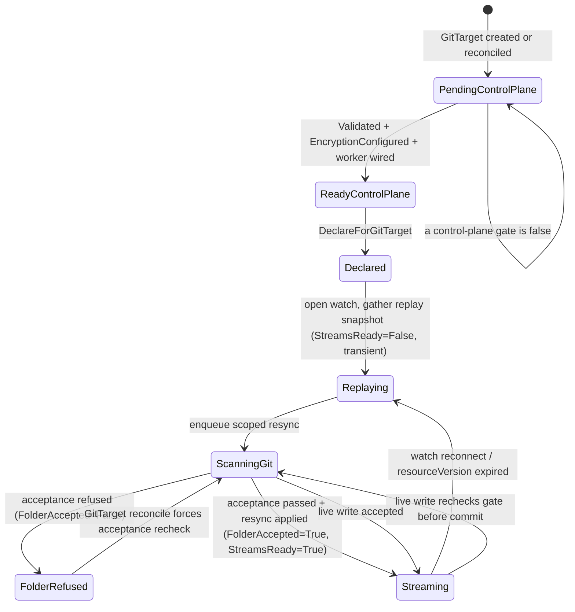

# Refuse unsupported folder content — design + implementation plan

> Status: PROPOSAL — 2026-06-26, **revised 2026-06-27**. The mechanics (refuse a GitTarget folder the
> operator cannot safely manage) are settled. The **status surface** is reopened: this revision records the
> back-and-forth that turned a single overloaded `StreamsReady=Blocked` refusal into a deliberate
> two-sided status model, and lays the `Ready`-aggregation options next to each other instead of picking
> one silently.
>
> **Decision recorded** in
> [e2e-coverage-gaps-and-improvements-plan.md §4.1](e2e-coverage-gaps-and-improvements-plan.md): the
> operator must **refuse** a GitTarget folder it cannot safely manage, for the cases where we already
> know the content is a problem — not silently keep writing. Written against the **actual** current code,
> not the superseded `Synced`/`materialization` model in
> [status-design-git-target.md](status-design-git-target.md).

---

## 1. The problem, precisely

The acceptance gate ([manifestanalyzer/acceptance.go](../../internal/manifestanalyzer/acceptance.go))
already classifies a folder's content and produces blocking refusals — but it is wired **only into the
`manifest-analyzer` CLI**, never the running controller. The live writer builds its store with an empty
allowlist and **never calls `Accept`**:

- [plan_flush.go:95](../../internal/git/plan_flush.go#L95) (live) — `BuildStoreFromFiles(..., Allowlist{})`,
  comment at :94 says the gate is "applied upstream, not here" — but no upstream caller applies it.
- [resync_flush.go](../../internal/git/resync_flush.go) (first-materialization / mark-and-sweep) — builds
  a plan directly, no acceptance.

So today a folder with duplicate identities, impure managed files, non-KRM passengers, or a
hard-Kustomize `kustomization.yaml` is **detected but not refused**: the operator writes anyway. We will
change that.

## 2. What "the cases where we know it's a problem" means (scope)

Two tiers. We implement **both**, because the second is the user's literal example.

**Tier 1 — structure-only refusals (already fully implemented in `Accept`).** These need no API source,
no registry, no scope predicate — they are unambiguous, purely structural facts about the folder:

| Refusal | IssueKind | Source |
|---|---|---|
| Duplicate manifest identity | `IssueDuplicate` | [acceptance.go:180](../../internal/manifestanalyzer/acceptance.go#L180) |
| Impure managed file (managed file with an empty / non-KRM / invalid passenger) | `IssueImpureManagedFile` | [acceptance.go:207](../../internal/manifestanalyzer/acceptance.go#L207) |
| Standalone non-KRM / invalid YAML | `IssueNonKRM` / `IssueInvalidYAML` | [acceptance.go:228](../../internal/manifestanalyzer/acceptance.go#L228) |
| Managed resource hiding in an allowlisted `kustomization.yaml` | `IssueMixedFile` | [acceptance.go:268](../../internal/manifestanalyzer/acceptance.go#L268) |

`Accept` already runs all of these with no API source ([acceptance.go:165](../../internal/manifestanalyzer/acceptance.go#L165)
gates the *mapping-aware* refusals behind `hasAPISource`, so a structure-only store skips them cleanly).

**Tier 2 — hard-Kustomize refusal (NEW, the named example).** A `kustomization.yaml` that uses
generators / patches / components / helmCharts / replacements / transformers / namePrefix|Suffix /
remote bases is **detected** today (`kustomizationDoc.unsupported` via
[store.go:687](../../internal/manifestanalyzer/store.go#L687) `hasUnsupportedKustomizeFeature`) but only
used to disqualify it as a namespace source — it is **not** a refusal. We add a new acceptance issue
that refuses it, because the operator cannot map such a folder back to editable source documents.

**Out of scope (deliberately):** the mapping-aware refusals (`IssueUnresolvedKRM`, `IssueOutOfScope`)
need a live followability registry + a namespace `InScope` predicate. They depend on cluster discovery
and can blink on a discovery wobble (see [typeset-owns-discovery-grace.md](typeset-owns-discovery-grace.md)).
Refusing on those risks false refusals on a transient. **Defer to a follow-up.**

---

## 3. Status model — the core design question

This is the part that moved during review. The mechanics below (§5–§6) are stable; **how the refusal is
surfaced** went through three rounds. We record all three so the chosen contract is defensible and the
discarded options are not silently lost.

### 3.1 The first draft, and the two critiques that reopened it

**Draft (v1).** Reuse the existing per-type stream state: mark the refused type's stream
`Blocked` with a new reason `UnsupportedContent`, flipping the existing `StreamsReady` condition to
`False`. No new API field. `Ready` stays control-plane-only (provider/branch/encryption/worker valid);
the data-plane refusal never touches it.

Two independent critiques landed against v1:

1. **The "Blocked" framing is inaccurate.** `StreamStateBlocked` is documented as *"the watch cannot
   currently run"* ([stream_readiness.go:42](../../internal/watch/stream_readiness.go#L42)). But a folder
   refusal is **not** a watch failure — the cluster watch runs perfectly. What is unsafe is the **write
   target** (the Git folder). Saying "the watch can't run" to describe "the Git folder is rejected"
   overloads one axis with two unrelated failure modes, which §7 already flagged as a risk.

2. **`Ready=True` while refusing to mirror is misleading, and it contradicts our own conventions.**
   - Kubernetes convention: a Deployment with a bad image is **not** `Available` even though its spec is
     valid and the controller parsed it; Deployments report `Available`/`Progressing`
     (`ProgressDeadlineExceeded`), not a control-plane-only `Ready`. Pod `Ready` means "operational when
     last probed." Gateway API splits `Accepted` (config understood) from `Programmed`/`Ready` (took
     effect). The GitOps peer (Flux) flips `Ready=False` on invalid source content.
   - **Our own docs say the same.** [status-conditions-guide.md:25-26](status-conditions-guide.md#L25-L26):
     *"Always have a summary condition. `Ready` for long-running objects… This is what operators and
     scripts will `kubectl wait` on,"* with `Ready` glossed as *"summary — True when everything is
     healthy."* The installed `k8s-crd-design-review` skill agrees
     ([conditions-and-status.md:13-24](../../.agents/skills/k8s-crd-design-review/references/conditions-and-status.md#L13-L24)):
     one high-signal **summary** `Ready`, and *"prefer Conditions over state-machine style `status.phase`
     for new APIs."*

   v1 made `Ready` control-plane-only and parked the aggregate health in `status.phase` (`Degraded`) —
   which is exactly the `phase`-as-aggregate pattern the skill tells us to avoid, and it makes
   `kubectl wait --for=condition=Ready` return `True` on a GitTarget that is actively refusing its folder.

### 3.2 The reframe: status for both sides of the sync

The operator's whole job is a **two-sided sync: cluster (source) → Git (target).** The status should name
those two sides directly instead of cramming both into one stream condition. That gives two data-plane
conditions, one per side:

| Condition | Side | True means | False driver |
|---|---|---|---|
| `StreamsReady` (a.k.a. *StreamsStarted*, see naming note) | **Source** — cluster | the cluster watches are live and past replay | replay in progress, `WatchError`, `WatchNotPermitted` |
| `FolderAccepted` (NEW) | **Target** — Git | the selected Git folder is safe to materialize | acceptance gate refused: unsupported kustomize, duplicate identity, impure / non-KRM file |

This directly fixes both critiques:

- **Honesty (critique 1).** A folder refusal sets `FolderAccepted=False` and leaves `StreamsReady`
  telling the truth about the watch. We no longer claim "the watch can't run" when it can. The source side
  and the target side fail independently and report independently.
- **Right granularity.** The acceptance gate is **whole-folder** (§6.1), so `FolderAccepted` is naturally a
  **target-level** condition — a cleaner fit than the per-type `Blocked` stream v1 used to approximate it.
- **It is the condition v1 already foreshadowed.** v1's own note said *"if we later want a dedicated
  `Writable`/acceptance condition … this refusal is the first concrete driver for it."* `FolderAccepted`
  **is** that condition; this reframe just promotes it from "later" to "now," because we have a concrete
  driver today.

> **Naming note.** The source-side condition already exists as `StreamsReady` (its `StreamsReady()` helper
> means *all streams caught up and live*). The proposed name *StreamsStarted* reads as a weaker bar
> ("opened" vs "caught up & live") and would change the contract. Recommendation: keep `StreamsReady` for
> the source axis and pair it with `FolderAccepted` for the target axis. If symmetry is preferred, the
> cleaner pair is `SourceReady` / `TargetReady` (or `SourceReady` / `FolderAccepted`) — but that is a
> rename of a shipped condition; only worth it while still on `v1alpha2`. **Open — see decision D1.**

### 3.3 Condition inventory under the two-sided model

```
control plane (granular):  Validated            — provider + branch resolve, no conflicts
                           EncryptionConfigured — SOPS/age config usable (or not required)
                           (worker wiring gate — currently folded into Ready, no own condition)

data plane (two sides):    StreamsReady          — SOURCE: cluster watches live & past replay
                           FolderAccepted (NEW)  — TARGET: Git folder safe to materialize

summary:                   Ready                 — aggregate (what aggregate? → §3.4, the open debate)

human glance:              status.phase          — derived projection (Pending/Initializing/Synced/Degraded)
```

### 3.4 The open debate — what does `Ready` aggregate?

With two named data-plane sides, the live question is exactly the one you posed: **do both sides feed
`Ready`, or not?** Three coherent positions, side by side. We do **not** pick one here unilaterally; the
table is the artifact for the team to decide against (**Open — see decision D2**).

| | **A. Control-plane only** (v1) | **B. Full aggregate** | **C. Hard-blocks aggregate** (author's lean) |
|---|---|---|---|
| `Ready=True` means | spec/provider/branch/encryption valid | fully mirroring *right now* | configured **and** no unrecoverable block |
| `kubectl wait Ready` | misleads — True while refusing the folder | truthful | truthful for real faults; tolerates replay |
| Source replaying | `Ready` True | `Ready` **False** (flaps on every watch reconnect) | `Ready` True (replay is progress, not a fault) |
| `FolderAccepted=False` | `Ready` True (only `phase=Degraded`) | `Ready` False | `Ready` False |
| `WatchNotPermitted` (RBAC) | `Ready` True | `Ready` False | `Ready` False |
| Matches our status guide / skill | ✗ (`Ready` not a summary; aggregate hidden in `phase`) | ✓ | ✓ |
| Matches k8s convention | ✗ (control-plane-only `Ready` is unusual) | ~ (replay shouldn't read as broken) | ✓ (replay ≈ `Progressing`, blocks ≈ not `Available`) |
| Churn / flapping | none | flaps `Ready` on benign reconnects | moderate; stable across reconnects |

The hinge between B and C is the asymmetry the team cares about (controller comment at
[gittarget_controller.go:194](../../internal/controller/gittarget_controller.go#L194): *"a still-replaying
data plane never reports as a misconfigured GitTarget"*):

- **Replay is transient and self-healing** — it should not drop `Ready` (rules out pure B).
- **A folder refusal or an RBAC denial is a real, non-transient, human-fixable fault** — it *should* drop
  `Ready` (rules out A).

So C draws the `Ready` line at **"any hard, non-transient block"** rather than "any not-yet-streaming
state." Concretely: `Ready=False` when `FolderAccepted=False` **or** a stream is `Blocked` for a
non-replay reason; `Ready` stays `True` while streams are merely `Replaying`.

A sub-variant worth noting: **the two sides need not be symmetric in their effect on `Ready`.** One could
argue `FolderAccepted=False` should drop `Ready` (the user must edit Git) while *all* source-side
non-readiness is treated as operational and kept out of `Ready`. C rejects that only because
`WatchNotPermitted` is a source-side fault that is **not** transient and **is** human-fixable — so the
clean line is "transient vs hard," not "source vs target."

### 3.5 Author's recommendation (lean, not yet decided)

**Adopt the two-sided model (§3.2) + Option C.** It satisfies our own written conventions, fixes the
inaccurate "watch can't run" framing, keeps `kubectl wait --for=condition=Ready` honest for faults users
must act on, and does not flap `Ready` on benign watch reconnects. `v1alpha2` makes the new condition and
the refined `Ready` semantics cheap to land now.

What each stakeholder must accept under C:
- `Ready` stops being "is the GitTarget configured" and becomes "is this GitTarget actually doing its job
  (modulo transient replay)." Automation that only wanted control-plane validity should gate on
  `Validated` + `EncryptionConfigured`, which remain granular.
- `phase` stops being the *only* home of aggregate health; it becomes a redundant human glance over the
  conditions (acceptable, but per the guide we should not let it carry contract weight).

### 3.6 How this decision evolved (record of the back-and-forth)

1. **v1** — refuse via `StreamsReady=Blocked / UnsupportedContent`; `Ready` control-plane-only;
   aggregate lives in `phase`. (Pragmatic, minimal, but overloads one axis.)
2. **Conventions critique** — Deployment/Pod/Gateway/Flux precedent says `Ready` should mean
   "operational," and a control-plane-only `Ready` mis-signals. First reaction: keep v1 because the code
   already treats `Ready` as control-plane *consistently* across replay/watch errors.
3. **Our own docs entered evidence** — [status-conditions-guide.md](status-conditions-guide.md) + the
   `k8s-crd-design-review` skill both say `Ready` is the **summary** condition and to prefer conditions
   over `phase`. That showed v1's `Ready` already **deviates from our own guide**, weakening "it's
   consistent with the code" — the code was consistent with itself but offside the documented contract.
4. **Two-sided reframe (this revision)** — name the two halves of the sync as their own conditions
   (`StreamsReady` source, `FolderAccepted` target). This dissolves critique 1 entirely and turns the
   `Ready` question into a clean aggregation choice (A/B/C) rather than an overloading hack.

---

## 4. The surface, mechanically

Under the recommended model, a refusal produces status as follows (independent of the A/B/C choice for
`Ready`; only the last hop differs):

- The acceptance gate refuses the first-materialization resync → the resync **commits nothing** and
  replies with a typed `AcceptanceRefusedError` naming the offending file(s).
- The controller projects that into **`FolderAccepted=False`**, reason `UnsupportedContent`, message
  naming the file — a **target-level** condition (whole-folder gate → whole-target condition).
- `status.streams` continues to report the **source** truth (watches may stay `Streaming`); we do **not**
  fake a `Blocked` stream for a write-target problem.
- `Ready` is then derived per the chosen option (A: unaffected; B/C: `False` because `FolderAccepted` is
  `False`). `phase` derives `Degraded`.

> Migration note vs v1: the previously-planned path set a per-type `Blocked` stream with reason
> `UnsupportedContent` ([stream_readiness.go:55-61](../../internal/watch/stream_readiness.go#L55-L61)). If
> we adopt `FolderAccepted`, that stream reason becomes redundant for *folder* refusals and should be
> retired in favour of the condition (keep `Blocked` strictly for genuine "watch cannot run" cases). If
> the team instead keeps v1's overloaded `Blocked`, §3 critique 1 stands unresolved — call it out.

### 4.1 Recovery is not sticky

A human can update Git so the folder becomes compatible. The GitTarget reconcile must **recheck**
`FolderAccepted` even when the watched-type set did not change. The current `DeclareForGitTarget` path is
idempotent when watch specs are unchanged, so recovery needs an explicit hook: if `FolderAccepted=False`,
enqueue a fresh scoped resync during reconcile. That resync rescans the folder and reruns the gate; when
it passes, `FolderAccepted` flips back to `True` (and `Ready` recovers) with no CRD schema change or manual
status reset. **There is no sticky refusal bit.**

### 4.2 Init and recovery state machine



The important edge is `FolderRefused --> ScanningGit`: the reconcile loop must force a fresh acceptance
scan for a refused target. No sticky bit.

---

## 5. The seam: refuse at first-materialization resync

The acceptance gate is a **whole-folder, first-materialization** check (the M4 "adoption gate"). The
natural moment is the resync / mark-and-sweep apply, which scans the entire GitTarget subtree:

- `applyResync` ([resync_flush.go:102](../../internal/git/resync_flush.go#L102)) already builds the plan,
  and on a build/commit error replies `ResyncResult{Err: ...}` and **commits nothing**
  ([resync_flush.go:120-131](../../internal/git/resync_flush.go#L120)). This is the abort path we reuse.
- The error flows back to `drainScopedResync`
  ([event_router.go:227](../../internal/watch/event_router.go#L227)), the one place that already handles a
  resync outcome — the seam where we translate a refusal into status.

We also guard the **live** path ([flushEventsToWorktree](../../internal/git/plan_flush.go#L52)) with the
same check, so a refusal that races a live event refuses the live flush too rather than writing into an
unsafe folder. Both share one helper.

### Data flow

```
watch replay → enqueueScopedResync → BranchWorker.applyResync
   └─ scan subtree → build store (DefaultAllowlist) → Accept(structure-only + hard-kustomize)
        ├─ accepted  → commit as today                      → FolderAccepted=True
        └─ REFUSED   → reply ResyncResult{Err: *AcceptanceRefusedError{Issues}}  (commit nothing)
                          └─ drainScopedResync sees the typed error
                               └─ controller projects FolderAccepted=False,
                                      reason "UnsupportedContent", message "<file>: <why>"
                                    └─ Ready derived per §3.4 ; phase Degraded
```

---

## 6. Implementation phases

Each phase is independently compilable and unit-testable; validate per phase before moving on.

### Phase 1 — manifestanalyzer: structure-only + hard-Kustomize gate

- Add a typed refusal error usable by the writer: `AcceptanceRefusedError` (wraps `[]AcceptanceIssue`,
  `Error()` names the first offending file + count). Lives in `manifestanalyzer`.
- Add a convenience entrypoint the writer can call on an already-built store, e.g.
  `AcceptStructureOnly(store) Acceptance` (or reuse `Accept(store, AcceptancePolicy{})` — confirm the zero
  policy yields the structure-only set; the live store *does* carry a `mapper`, so it may present an API
  source. If so, add an explicit structure-only entrypoint that skips `mappingRefusals`).
- **Tier 2:** surface `kustomizationDoc.unsupported` to the store's public model and add a new
  `IssueUnsupportedKustomize` refusal in `Accept` for any retained kustomization marked unsupported.
- Unit tests: duplicates → refused; impure file → refused; non-KRM standalone → refused; hard-Kustomize
  `kustomization.yaml` (patches) → refused; a clean folder + plain `kustomization.yaml` (only `namespace:`
  + `resources:`) → **accepted** (no false refusal).

### Phase 2 — git writer: call the gate, abort the commit

- In the resync apply path, scan and run the gate **before** any bootstrap files are staged or indexed. On
  refusal return the typed `AcceptanceRefusedError` and leave the worktree/index clean. Mirror the same
  ordering in live `flushEventsToWorktree`.
- Build the store with `manifestanalyzer.DefaultAllowlist()` (not `Allowlist{}`) so a legitimate
  `kustomization.yaml` is *retained*, not mis-refused as non-KRM.
- Unit tests at `internal/git`: a seeded worktree with an unsupported file → flush/resync returns the
  refusal error and writes nothing, **including no staged `.sops.yaml`**; a clean worktree → unchanged.

### Phase 3 — status: surface refusal on `FolderAccepted` (model-dependent)

> This phase encodes the §3 decision. The steps below assume the **recommended** two-sided model +
> Option C. If the team picks A or B, adjust the `Ready` derivation accordingly; if the team keeps v1's
> overloaded `Blocked` stream, replace this phase with the v1 plan and note the unresolved critique 1.

- Add the `FolderAccepted` condition type + a reason constant `GitTargetReasonUnsupportedContent`. Document
  it as a stable condition type (do **not** CEL-enum the allowed condition set — that would make adding a
  condition later a breaking change; see the skill's conditions reference).
- In `drainScopedResync`, detect `errors.As(result.Err, *AcceptanceRefusedError)` and route it to a
  controller-visible signal that sets `FolderAccepted=False` with the offending file in the message. Keep
  the existing failure metric. Do **not** fabricate a `Blocked` stream for the folder refusal.
- Derive `Ready` per Option C: `False` when `FolderAccepted=False` **or** a stream is `Blocked` for a
  non-replay reason; unaffected by transient `Replaying`. Update `applyStreamsReadyConditionAndPhase`
  (or its successor) and the final `setReadyCondition` accordingly.
- On GitTarget reconcile, if `FolderAccepted=False`, force a fresh acceptance recheck for that target even
  if `replaceGitTargetWatches` would otherwise no-op.
- Add/adjust **printer columns**: keep `Ready`, add a `FolderAccepted` (or `Accepted`) column and ensure
  the refusal **reason/message survive into a column** — do not collapse to a bare count. Per the skill's
  printer-columns reference, columns are operator UX; the file name must be reachable from `kubectl get`.
- Unit tests: a resync drain with a refusal error sets `FolderAccepted=False` with reason + file;
  a normal error keeps today's behavior; `Ready` goes `False` under C; a clean recheck flips both back; a
  reconcile with `FolderAccepted=False` enqueues a fresh acceptance recheck.

### Phase 4 — e2e (Test D from the e2e plan)

- New `test/e2e/unsupported_folder_e2e_test.go`: seed a GitTarget path with a hard-Kustomize
  `kustomization.yaml` (a `patches:` block), create the GitTarget + a WatchRule, and assert:
  - `FolderAccepted` goes `False` with reason `UnsupportedContent` (message names the file),
  - `Ready` goes `False` (Option C) while the source watch is otherwise healthy, and
  - **no commit** is produced for the refused folder (the folder is not mutated).
- A second case (cheap): a duplicate-identity folder → same refusal, proving Tier 1.
- A recovery phase (cheap, same spec): remove the unsupported construct, reconcile, and assert
  `FolderAccepted` and `Ready` recover and the target reaches `Streaming`.

### Phase 5 — validation & docs

- `task fmt` → `task generate` → `task manifests` (new condition reason / printcolumn) → `task vet` →
  `task lint` → `task test` (commit the coverage-baseline bump if it rises) → `task test-e2e`
  (sequential; needs Docker).
- Update [architecture.md](../architecture.md): the "untracked, non-Kubernetes, unresolved, or unsafe YAML
  is left alone per analyzer policy" line is now only half-true — structure-unsafe and hard-Kustomize
  content is **refused**, not left alone. Update [Mark and Sweep Resync](../architecture.md#mark-and-sweep-resync)
  and Operational Boundaries.
- **Reconcile [status-conditions-guide.md](status-conditions-guide.md)** with the chosen `Ready` semantics
  so the project has **one** story (its current `Ready`=summary gloss and stale `Available`/`Active`/`Synced`
  example predate `GitTarget`; align the example to `Validated`/`EncryptionConfigured`/`StreamsReady`/
  `FolderAccepted`/`Ready`).
- Flip the e2e plan's Test D from "blocked" to "implemented."

---

## 7. Decisions — settled and open

### Settled

1. **Whole-folder vs type-scoped refusal.** Evaluate whole-folder (the gate's natural unit). Under the
   two-sided model this surfaces as a **target-level** `FolderAccepted` condition rather than per-type
   state. Revisit only if per-type granularity proves necessary.
2. **Default allowlist in the writer.** Use `DefaultAllowlist()` (not `Allowlist{}`) so a legit kustomize
   entrypoint is retained, not mis-refused as non-KRM. Verify no placement regression.
3. **Live-path gating.** Gate both resync and live paths; share one helper — a refused folder must not be
   written by a racing live event.
4. **Mapping-aware refusals (unwatched/out-of-scope).** Out of scope here (discovery-blink risk); separate
   follow-up with the followability registry + `InScope` predicate.

### Open (decide before Phase 3)

- **D1 — condition naming for the two sides.** Keep `StreamsReady` (source) + add `FolderAccepted`
  (target)? Or rename to a symmetric `SourceReady` / `TargetReady` pair while still on `v1alpha2`?
  *Lean:* keep `StreamsReady`, add `FolderAccepted` — least churn, `StreamsReady` already means
  "caught-up & live" (stronger than *StreamsStarted*).
- **D2 — what `Ready` aggregates (§3.4).** A (control-plane only) / B (full aggregate) / C (hard-blocks
  aggregate). *Lean:* **C** — matches our own status guide + k8s convention, keeps `kubectl wait Ready`
  honest for human-fixable faults, does not flap on benign replay.
- **D3 — retire the `UnsupportedContent` stream reason?** If `FolderAccepted` is adopted, the
  per-stream `Blocked / UnsupportedContent` reason becomes redundant and should be retired (keep `Blocked`
  for true "watch cannot run" cases). *Lean:* retire it.

---

## 8. Risks

- **False refusals** break a previously-working folder. Mitigation: Tier-1 set is purely structural and
  already unit-tested in `acceptance_test.go`; Tier-2 reuses the tested `hasUnsupportedKustomizeFeature`.
  Phase-1 tests explicitly assert a clean kustomize folder is accepted.
- **e2e flakiness.** Keep Test D `Serial`/small; reuse existing repo-setup + readiness wait helpers.
- **Dirty worktree after refusal.** Bootstrap staging must not happen before acceptance, or it must be
  rolled back on refusal — otherwise a later commit can carry a stray `.sops.yaml` from a refused attempt.
- **Lost diagnostic.** The refusal message (the file name) must survive into the `FolderAccepted` condition
  message **and** a printer column; the user needs it to fix Git.
- **Two-doc drift (resolved by Phase 5).** Until [status-conditions-guide.md](status-conditions-guide.md)
  is reconciled, the repo holds two contradictory stories about what `Ready` means. The D2 decision must be
  written back into the guide, not just here.
- **Naming / contract churn.** Adding `FolderAccepted` and refining `Ready` semantics changes the public
  status contract. It is safe **now** (`v1alpha2`), but it is a breaking change for any client already
  gating on `Ready`'s old control-plane meaning — land it before stabilizing the API.
