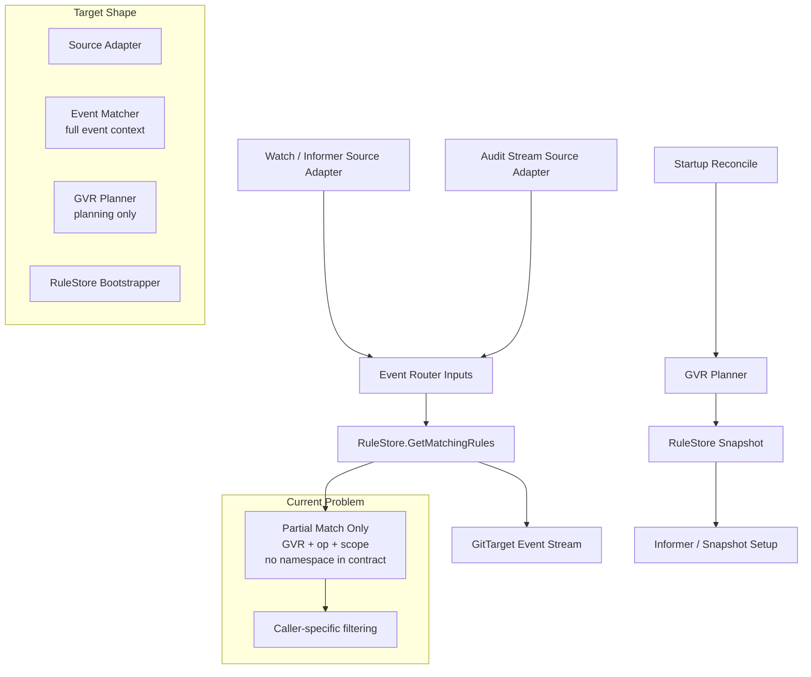

# Watch And Audit Rule Matching Improvement Note

## Purpose

This note captures two reproduced bugs and turns them into an implementation-ready guide:

- namespaced `WatchRule`s can route events for objects from other namespaces
- operator restart does not rebuild the in-memory `RuleStore` from existing `WatchRule` and
  `ClusterWatchRule` CRs before startup reconcile

This document is intentionally written so a human or an LLM can use it to:

1. understand the current architecture
2. see where the abstractions drifted away from intent
3. implement a safe fix without accidentally removing future capabilities
4. strengthen e2e assertions so this class of bug is caught earlier next time

## Executive Summary

The current system has two separate source adapters for live-ish information:

- watch/informer ingestion
- audit-stream ingestion

Both of them eventually rely on the same `RuleStore` matcher contract, but that matcher is only a partial
match for namespaced `WatchRule`s. Namespace is stored on the compiled rule, yet namespace is not part of
the `GetMatchingRules` contract.

That mismatch stayed partially hidden while informer scoping did some of the filtering implicitly. After the
audit webhook became authoritative for live events, the hidden assumption became much easier to violate,
because audit events naturally arrive from all namespaces.

Separately, startup reconcile depends on the same in-memory rule cache, but there is no explicit cache warm-up
step before `watch.Manager.Start()` performs its initial reconcile.

## Status Update

### 2026-04-17

The minimal-fix implementation described later in this note has now landed.

Implemented:

- namespaced `WatchRule` matching is now namespace-aware in `RuleStore.GetMatchingRules`
  - [store.go](/workspaces/gitops-reverser/internal/rulestore/store.go:244)
- both live routing paths now pass namespace context into the matcher
  - watch/informer path: [informers.go](/workspaces/gitops-reverser/internal/watch/informers.go:63)
  - audit consumer path: [redis_audit_consumer.go](/workspaces/gitops-reverser/internal/queue/redis_audit_consumer.go:317)
- watch-manager startup now bootstraps the in-memory `RuleStore` from existing `WatchRule` and
  `ClusterWatchRule` objects before initial reconcile
  - [bootstrap.go](/workspaces/gitops-reverser/internal/watch/bootstrap.go:31)
  - [manager.go](/workspaces/gitops-reverser/internal/watch/manager.go:99)
- the previously skipped `RuleStore` namespace-contract tests were un-skipped and updated to enforce the new behavior
  - [store_test.go](/workspaces/gitops-reverser/internal/rulestore/store_test.go:837)

Additional hardening discovered during validation:

- startup could fail if the audit consumer tried to initialize its Redis consumer group before Redis DNS/service
  readiness settled, which temporarily left the webhook service without endpoints during e2e startup
- `AuditConsumer.Start()` now retries consumer-group initialization instead of crashing the manager process
  - [redis_audit_consumer.go](/workspaces/gitops-reverser/internal/queue/redis_audit_consumer.go:153)

Validation completed after the implementation:

- targeted red tests were first confirmed failing, then re-run green after the fix
- `task fmt`
- `task vet`
- `task lint`
- `task test`
- `docker info`
- `task test-e2e`

Current status against this note:

- the two reproduced correctness bugs in this note are fixed
- the startup timing issue for audit-consumer Redis initialization is also fixed
- the larger architectural follow-up remains open:
  - separate planner-vs-matcher semantics more explicitly
  - introduce a first-class full event-match input if we want the cleaner long-term API
  - strengthen e2e assertions around exact touched-path sets and cross-namespace negative assertions

Note:

- the red/green inventory below is preserved as the original analysis and implementation guide
- where it says "red" or "skipped", read that as historical context rather than current status

## Graphic



## Named Abstractions

These names are recommended so the implementation and future design discussion stay precise.

### Existing abstractions

- `RuleStore`
  - current role: compiled cache of `WatchRule` and `ClusterWatchRule`
- watch source adapter
  - current implementation: informer path in `internal/watch/informers.go`
- audit source adapter
  - current implementation: audit consumer path in `internal/queue/redis_audit_consumer.go`
- GVR planner
  - current implementation: `ComputeRequestedGVRs`, `getNamespacesForGVR`, and related watch-manager planning code
- event router
  - current implementation: `EventRouter` plus `GitTargetEventStream`

### Missing or under-specified abstractions

- event matcher
  - desired role: perform a full rule match for one concrete event
- rule-store bootstrapper
  - desired role: load and compile existing rules before startup reconcile
- source envelope
  - desired role: represent the source and fidelity of an event without coupling source-specific logic into routing

## Red/Green Test Inventory

All tests below are written to assert the **desired** behavior. Tests that expose bugs fail today (red) and will
turn green when the fix lands. Guard-rail tests already pass (green) and protect against over-correction.

### 1. Cross-namespace routing for namespaced `WatchRule`

#### Bug tests (red — fail today)

| Test | File | Asserts |
|---|---|---|
| `TestHandleEvent_NamespacedWatchRuleMustNotRouteForeignNamespaceObject` | [informers_test.go](/workspaces/gitops-reverser/internal/watch/informers_test.go) | watch path must NOT route a `Service` from `gitops-reverser` via a `WatchRule` in `tilt-playground` |
| `TestProcessMessage_NamespacedWatchRuleMustNotRouteForeignNamespaceAuditEvent` | [redis_audit_consumer_test.go](/workspaces/gitops-reverser/internal/queue/redis_audit_consumer_test.go) | audit path must NOT route a `Service` from `gitops-reverser` via a `WatchRule` in `tilt-playground` |
| `TestHandleEvent_MixedRules_OnlyClusterWatchRuleMatchesForeignNamespace` | [informers_test.go](/workspaces/gitops-reverser/internal/watch/informers_test.go) | event from `ns-b`: `WatchRule` in `ns-a` must NOT match, `ClusterWatchRule` MUST match |
| `TestProcessMessage_MixedRules_OnlyClusterWatchRuleMatchesForeignNamespace` | [redis_audit_consumer_test.go](/workspaces/gitops-reverser/internal/queue/redis_audit_consumer_test.go) | same as above via audit path |

#### Guard-rail tests (green — pass today, protect against over-correction)

| Test | File | Asserts |
|---|---|---|
| `TestHandleEvent_NamespacedWatchRuleRoutesOwnNamespaceObject` | [informers_test.go](/workspaces/gitops-reverser/internal/watch/informers_test.go) | watch path MUST route a `Service` from the same namespace as the `WatchRule` |
| `TestProcessMessage_NamespacedWatchRuleRoutesOwnNamespaceAuditEvent` | [redis_audit_consumer_test.go](/workspaces/gitops-reverser/internal/queue/redis_audit_consumer_test.go) | audit path MUST route a `Service` from the same namespace as the `WatchRule` |

#### RuleStore contract tests (skipped — waiting for API change)

| Test | File | Asserts |
|---|---|---|
| `TestGetMatchingRules_MustFilterByNamespaceForNamespacedWatchRule` | [store_test.go](/workspaces/gitops-reverser/internal/rulestore/store_test.go) | documents the desired namespace filtering contract; skipped until matcher API accepts namespace |
| `TestGetMatchingRules_NamespacedWatchRule_NamespaceContract` | [store_test.go](/workspaces/gitops-reverser/internal/rulestore/store_test.go) | three sub-tests for same-ns/foreign-ns/cluster-rule; skipped until API change, then un-skip |

#### Root cause

- `RuleStore.GetMatchingRules` matches by `{resourcePlural, operation, apiGroup, apiVersion, scope}` and explicitly
  leaves namespace filtering to callers
  - [store.go](/workspaces/gitops-reverser/internal/rulestore/store.go:242)
- the live watch path does not perform a namespace check after calling `GetMatchingRules`
  - [informers.go](/workspaces/gitops-reverser/internal/watch/informers.go:63)
- the audit consumer also does not perform a namespace check after calling `GetMatchingRules`
  - [redis_audit_consumer.go](/workspaces/gitops-reverser/internal/queue/redis_audit_consumer.go:303)

This means the rule-store API is currently under-specified for namespaced rules. The source namespace is stored on the
compiled rule, but it is not part of the matcher contract.

### 2. Restart does not warm the in-memory rule cache

#### Bug tests (red — fail today)

| Test | File | Asserts |
|---|---|---|
| `TestManagerStart_MustSeedRuleStoreFromExistingWatchRules` | [manager_startup_test.go](/workspaces/gitops-reverser/internal/watch/manager_startup_test.go) | `SnapshotWatchRules()` and `ComputeRequestedGVRs()` must be non-empty after `Start()` |
| `TestManagerStart_MustSeedRuleStoreFromExistingClusterWatchRules` | [manager_startup_test.go](/workspaces/gitops-reverser/internal/watch/manager_startup_test.go) | `SnapshotClusterWatchRules()` and `ComputeRequestedGVRs()` must be non-empty after `Start()` |

Observed behavior:

- `watch.Manager.Start()` performs an initial reconcile
- that reconcile reads requested GVRs from `RuleStore`
- on a fresh process start, `RuleStore` is empty until controllers reconcile `WatchRule` / `ClusterWatchRule`
- there is no startup bootstrap step that loads existing CRs into the store first

Relevant code:

- startup reconcile in [manager.go](/workspaces/gitops-reverser/internal/watch/manager.go:97)
- requested GVR computation reads only `RuleStore` in [gvr.go](/workspaces/gitops-reverser/internal/watch/gvr.go:37)
- controller reconciliation is what currently populates the store:
  - [watchrule_controller.go](/workspaces/gitops-reverser/internal/controller/watchrule_controller.go:194)
  - [clusterwatchrule_controller.go](/workspaces/gitops-reverser/internal/controller/clusterwatchrule_controller.go:171)

This makes startup behavior implicitly dependent on controller replay timing instead of making cache warm-up an explicit
part of watch-manager startup.

## Why This Became Easier To Miss After Audit Became Authoritative

The audit decision record is still directionally correct:

- [audit-ingestion-decision-record.md](/workspaces/gitops-reverser/docs/design/audit-ingestion-decision-record.md)

Audit should remain the authoritative live source when the product wants correct user attribution for mutating API
operations.

The problem is not the decision itself. The problem is that the routing contract underneath both sources is incomplete.

The important architectural shift was:

- live routing is now split across two source adapters
  - informer path for snapshot/reconcile support and optional live fallback
  - audit stream for authoritative live mutations
- both adapters still depend on the same rule matching contract

That means an under-specified matcher that was once partially masked by informer scoping now leaks into the
cluster-wide audit path immediately.

In short:

- watch did not guarantee correctness; it sometimes masked incompleteness
- audit did not create the bug; it made the bug much easier to observe

## Future Direction: Watch Must Remain A Useful Source Of Information

Watch should not be treated as a mistake or as something to phase out entirely.

The future system should still allow watch-derived information to be valuable in at least four ways:

1. snapshot and reconcile
2. discovery and rule planning
3. reduced-fidelity mode when audit is unavailable
4. corroboration and repair signals even when audit is authoritative

### Desired semantic split

- audit path
  - authoritative for live mutating-user attribution
  - best source for "who changed what"
- watch path
  - authoritative for cluster state discovery and resync
  - valid source of information about resulting object state
  - optionally a live source in reduced-fidelity mode

### Important nuance

The future should not frame watch as "not a real source."

Instead:

- watch is a real source of state information
- audit is the higher-fidelity source for mutating user attribution

That distinction matters because a future product mode may intentionally support:

- `audit + watch`
- `watch only`
- or `audit live authority + watch repair`

The fix should preserve that flexibility rather than baking in source-specific routing rules everywhere.

## Abstractions That Are No Longer Pulling Their Weight

### 1. `RuleStore.GetMatchingRules` is not a complete namespaced-rule matcher

Current reality:

- it returns namespaced `WatchRule` matches without considering object namespace
- callers must remember to filter `rule.Source.Namespace` themselves

Problem:

- the API shape suggests "matching" is complete, but it is only partial
- each caller has to remember extra semantics that are not represented in the function signature

Desired direction:

- make the matcher take the full event context, including namespace
- or rename/split the API so it is obvious that this is only GVR+operation prefiltering

### 2. Event planning and event routing use the same rule cache, but not the same semantics

There are really two different jobs here:

- planning which GVRs need watchers or snapshots
- deciding whether one concrete object event should route to one concrete target

Those jobs need different inputs:

- planning can work at GVR granularity
- routing must work at full object-event granularity, including namespace and eventually cluster identity

Desired direction:

- keep a GVR planning layer for watcher/snapshot setup
- add a distinct event matcher for concrete object events

### 3. Startup cache warm-up is implicit instead of owned

Current reality:

- controllers populate `RuleStore`
- watch manager assumes `RuleStore` is already warm when startup reconcile runs

Problem:

- process startup becomes timing-sensitive
- restart behavior depends on controller replay rather than on an explicit bootstrap contract

Desired direction:

- one component should own initial rule-store warm-up from the API server before startup reconcile
- this can live in watch manager startup or in a dedicated rule-store bootstrapper

### 4. Source identity is only partially modeled

The audit path already carries `clusterID`:

- [redis_audit_consumer.go](/workspaces/gitops-reverser/internal/queue/redis_audit_consumer.go:309)

The watch path does not, because it is implicitly local-cluster.

That split is fine, but the routing model should still be explicit about the dimensions that define a match:

- source cluster
- resource GVR
- namespace
- object name
- operation
- source fidelity

Right now namespace is already under-modeled for namespaced `WatchRule`. If multi-cluster audit ingestion grows,
`clusterID` becomes the next dimension that must be first-class in the event matching contract.

## Proposed Target Architecture

### 1. Source adapters

Introduce a clean conceptual split:

- `WatchEventSourceAdapter`
- `AuditEventSourceAdapter`

Both of these produce a shared source envelope.

Example:

```go
type EventSourceKind string

const (
    EventSourceWatch EventSourceKind = "watch"
    EventSourceAudit EventSourceKind = "audit"
)

type EventFidelity string

const (
    EventFidelityAuthoritative EventFidelity = "authoritative"
    EventFidelityStateOnly     EventFidelity = "state_only"
)

type SourceEnvelope struct {
    Kind      EventSourceKind
    Fidelity  EventFidelity
    ClusterID string
}
```

### 2. Full event-match input

Recommended new routing input:

```go
type RuleMatchInput struct {
    Source          SourceEnvelope
    Group           string
    Version         string
    Resource        string
    Namespace       string
    Name            string
    Operation       configv1alpha1.OperationType
    ClusterScoped   bool
    NamespaceLabels map[string]string
}
```

Both watch and audit should route through this single matcher.

### 3. Planner separated from matcher

Suggested split:

- `ComputeRequestedGVRs()` remains a planner concern
- `MatchEventToRules(input RuleMatchInput)` becomes the routing concern

This keeps informer setup logic from leaking into concrete event-routing assumptions.

### 4. Startup bootstrapper

Add a bootstrap phase before startup reconcile:

1. list existing `WatchRule`
2. resolve each `GitTarget` and `GitProvider`
3. compile and load them into `RuleStore`
4. list existing `ClusterWatchRule`
5. resolve their references
6. compile and load them into `RuleStore`
7. only then run initial watch-manager reconcile

## Invariants

Any fix should preserve these invariants.

### Namespaced `WatchRule`

- a namespaced `WatchRule` must only match namespaced objects in the same namespace as the rule
- this must be true regardless of source adapter
- this must be true even if a cluster-wide informer is active for the same GVR

### `ClusterWatchRule`

- a cluster-scoped rule may match cluster-scoped resources when `scope=Cluster`
- a cluster-scoped rule may match namespaced resources across namespaces when `scope=Namespaced`
- future namespace selectors should refine this explicitly, not implicitly

### Startup

- startup reconcile must operate on a warmed rule cache
- restart behavior must not depend on controller replay timing

### Future source support

- watch must remain valid as a source of state information
- audit must remain usable as authoritative live mutation input
- routing correctness must not depend on which source adapter delivered the event

## Concrete Code Touchpoints

These are the likely first-pass implementation touchpoints.

### Routing and matching

- [internal/rulestore/store.go](/workspaces/gitops-reverser/internal/rulestore/store.go)
- [internal/watch/informers.go](/workspaces/gitops-reverser/internal/watch/informers.go)
- [internal/queue/redis_audit_consumer.go](/workspaces/gitops-reverser/internal/queue/redis_audit_consumer.go)
- [internal/watch/manager.go](/workspaces/gitops-reverser/internal/watch/manager.go)

### Startup bootstrap

- [cmd/main.go](/workspaces/gitops-reverser/cmd/main.go)
- [internal/watch/manager.go](/workspaces/gitops-reverser/internal/watch/manager.go)
- [internal/controller/watchrule_controller.go](/workspaces/gitops-reverser/internal/controller/watchrule_controller.go)
- [internal/controller/clusterwatchrule_controller.go](/workspaces/gitops-reverser/internal/controller/clusterwatchrule_controller.go)

### Tests

Unit tests (red/green TDD — see "Red/Green Test Inventory" above for full matrix):

- [internal/watch/informers_test.go](/workspaces/gitops-reverser/internal/watch/informers_test.go) — 3 new tests (2 red, 1 green guard rail)
- [internal/queue/redis_audit_consumer_test.go](/workspaces/gitops-reverser/internal/queue/redis_audit_consumer_test.go) — 3 new tests (2 red, 1 green guard rail)
- [internal/watch/manager_startup_test.go](/workspaces/gitops-reverser/internal/watch/manager_startup_test.go) — 2 new tests (both red)
- [internal/rulestore/store_test.go](/workspaces/gitops-reverser/internal/rulestore/store_test.go) — 2 new tests (skipped, waiting for API change)

E2E tests (existing, to be strengthened per the E2E section below):

- [test/e2e/e2e_test.go](/workspaces/gitops-reverser/test/e2e/e2e_test.go:717)
- [test/e2e/tilt_playground_e2e_test.go](/workspaces/gitops-reverser/test/e2e/tilt_playground_e2e_test.go:55)
- [test/e2e/audit_redis_e2e_test.go](/workspaces/gitops-reverser/test/e2e/audit_redis_e2e_test.go:54)

## E2E Evidence From A Real Repo History

The issue is not just theoretical. During analysis, the current `playground` repo contained commits for resources
outside `tilt-playground`.

Concrete examples observed in the cloned `playground` repo:

- `db2825c` created `live-cluster/apps/v1/deployments/gitops-reverser/gitops-reverser.yaml`
- `06480bf` updated that same `gitops-reverser` deployment file
- `170f25b` updated that same `gitops-reverser` deployment file again
- `f52da76` created `live-cluster/v1/services/gitops-reverser/gitops-reverser-webhook.yaml`
- `d7a9844` created `live-cluster/v1/services/gitops-reverser/gitops-reverser-service.yaml`
- `ac94292` created `live-cluster/v1/services/gitops-reverser/gitops-reverser-audit.yaml`
- `e63f371`, `f05e5c4`, and `113fd81` created/updated/deleted
  `live-cluster/v1/configmaps/gitops-reverser/audit-test-cm.yaml`

At the same time, the intended playground content also existed:

- `live-cluster/v1/configmaps/tilt-playground/playground-sample-config.yaml`
- `live-cluster/v1/secrets/tilt-playground/...`

This is strong evidence that the e2e suite already exercises enough cluster activity for bleed to happen, but the
assertions are not currently looking for it.

## Why Existing E2E Assertions Did Not Catch It

The current e2e tests mostly assert positive expectations:

- expected file exists
- expected content exists
- latest commit message contains a resource path

What they usually do **not** assert:

- no unrelated namespace files changed
- only the expected file changed
- repo path stayed confined to the rule's namespace for namespaced rules
- the playground repo remained free of controller-install namespace objects

That means a test can pass even if:

- the expected file was written
- and additional unrelated files were also written in the same repo

This is exactly the kind of gap that allows cross-namespace bleed to survive in a production-grade test suite.

## Suggested E2E Assertion Improvements

### 1. Assert the exact changed file set

After each action, inspect the latest commit with:

```bash
git diff-tree --no-commit-id --name-only -r HEAD
```

For a namespaced `WatchRule` test, assert:

- exactly one expected file changed for create/update
- or exactly one expected file was removed for delete
- and no path under another namespace changed in the same commit

### 2. Add negative namespace assertions

For namespaced `WatchRule` tests, explicitly assert that the repo path does **not** contain touched files under:

- `gitops-reverser/`
- `flux-system/`
- `kube-system/`
- any sibling test namespace in the same suite run

This should be done as part of the repo verification step, not as a separate optional debug check.

### 3. Add a dedicated playground bleed e2e

Recommended scenario:

1. bootstrap `tilt-playground`
2. confirm the playground repo starts clean and namespace-confined
3. create or update resources in `gitops-reverser`
4. create or update resources in one random e2e namespace
5. assert the playground repo did **not** change outside `tilt-playground`

This is the closest e2e approximation of the real bug.

### 4. Add a restart recovery e2e

Recommended scenario:

1. create `WatchRule` and `ClusterWatchRule`
2. restart the operator deployment
3. wait for operator readiness
4. mutate a watched resource
5. assert the expected repo change occurs without reapplying the rules

This catches the startup bootstrap bug directly.

### 5. Add helper assertions instead of repeating ad hoc checks

Recommended helpers:

- `assertLatestCommitTouchesOnly(repoDir, []string{...})`
- `assertNoPathsUnderNamespaces(repoDir, []string{...})`
- `assertRepoTreeConfinedToNamespace(repoDir, basePath, namespace)`
- `assertOperatorRestartRebuildsRuleCache(...)`

This reduces the risk that future tests only assert the happy path again.

## LLM Implementation Guide

This section is intentionally precise enough for an LLM-based coding agent.

### Bug statements

1. `GetMatchingRules` does not include namespace in the namespaced `WatchRule` match contract.
2. Both watch and audit routing paths rely on that partial matcher.
3. Startup reconcile runs before the in-memory rule cache is explicitly warmed.

### Required outcomes

1. Namespaced `WatchRule` routing must be namespace-correct for both watch and audit source adapters.
2. Startup reconcile must see the current rule set after process restart.
3. Future watch-only or mixed-fidelity modes must remain possible.

### Preferred implementation order

1. Introduce a full event-match input type.
2. Add a matcher function that performs complete namespaced rule evaluation.
3. Migrate watch routing to the new matcher.
4. Migrate audit routing to the same matcher.
5. Add explicit rule-store bootstrap before startup reconcile.
6. Verify unit tests turn green (the red/green tests are already in place — see "Red/Green Test Inventory").
7. Un-skip the `RuleStore` contract tests in `store_test.go` once the matcher API accepts namespace.
8. Strengthen e2e assertions with exact touched-path checks.

### Implementation note: minimal vs. full refactor

The namespace bug can be fixed at two levels of ambition:

**Minimal fix** (recommended first step):
- Add `namespace string` to `GetMatchingRules` and filter inside the store by comparing
  `rule.Source.Namespace` against the passed namespace for namespaced `WatchRule`s.
- Both callers (watch path and audit path) already have access to the object namespace — just
  pass it through.
- This makes all red tests green without introducing new types or restructuring the routing.

**Full refactor** (recommended follow-up):
- Introduce `RuleMatchInput` and `MatchEventToRules` as described in "Proposed Target Architecture".
- Separate GVR planning from event routing cleanly.
- This is the right long-term shape, but should not block the bug fix.

The existing red/green tests work with either approach — they test behavior at the caller level,
not the matcher API shape.

### Do not do

- do not hard-code audit-specific namespace behavior in only one path
- do not "fix" this only by relying on informer scoping
- do not remove watch as a future valid source of state information
- do not let startup correctness depend on controller replay timing

### Acceptance criteria

Unit tests (all must pass — these are the red/green TDD boundary):

- `TestHandleEvent_NamespacedWatchRuleMustNotRouteForeignNamespaceObject` passes
- `TestHandleEvent_NamespacedWatchRuleRoutesOwnNamespaceObject` still passes (guard rail)
- `TestHandleEvent_MixedRules_OnlyClusterWatchRuleMatchesForeignNamespace` passes
- `TestProcessMessage_NamespacedWatchRuleMustNotRouteForeignNamespaceAuditEvent` passes
- `TestProcessMessage_NamespacedWatchRuleRoutesOwnNamespaceAuditEvent` still passes (guard rail)
- `TestProcessMessage_MixedRules_OnlyClusterWatchRuleMatchesForeignNamespace` passes
- `TestManagerStart_MustSeedRuleStoreFromExistingWatchRules` passes
- `TestManagerStart_MustSeedRuleStoreFromExistingClusterWatchRules` passes
- `TestGetMatchingRules_NamespacedWatchRule_NamespaceContract` sub-tests un-skipped and passing

E2E (follow-up — defense in depth):

- e2e tests prove namespaced repos do not absorb unrelated namespace files
- e2e restart scenario proves operator restart recovers without manual rule reapply

## Concrete Next Steps

1. Decide whether to:
   - keep `RuleStore` as a partial prefilter and add a new event matcher
   - or evolve `RuleStore` itself into the full event matcher
2. Add a startup bootstrap path for `RuleStore` before `watch.Manager.Start()` performs its initial reconcile.
3. Tighten e2e repo assertions so they check both presence and absence.
4. Add a dedicated playground bleed e2e and operator-restart recovery e2e.

## Bottom Line

These are not isolated bugs. They point to two architectural mismatches:

- "matching rules for an event" is currently modeled too weakly
- "the watch manager has the current rules at startup" is currently assumed rather than guaranteed

The audit-webhook shift amplified the problem because audit is inherently cluster-wide input, while the old watch path
could accidentally rely on informer scoping to hide an incomplete matcher contract.

The fix should improve correctness **without** closing the door on a future where watch remains a valid source of
information, state repair, and reduced-fidelity operation.
