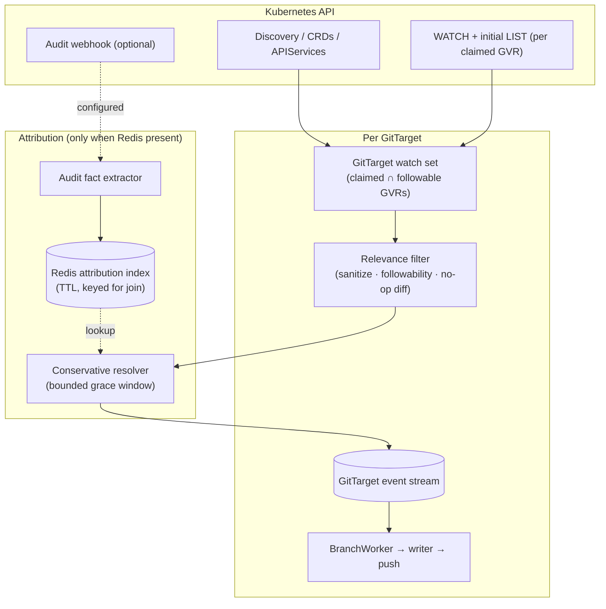

# Watch-first ingestion architecture

> Status: **accepted direction — big-bang rewrite**
> Date: 2026-06-25 (rewritten from the 2026-06-25 proposal after the per-GitTarget / Redis-optional / big-bang decisions)
> Related:
> [Current architecture](../architecture.md),
> [Mutation Capture Lab](mutation-capture-lab-design.md),
> [HA improvements](stream/ha-improvements.md),
> [Demand-driven materialization lifecycle](../finished/demand-driven-type-materialization-lifecycle.md),
> [API-source-of-truth reconcile](../finished/api-source-of-truth-reconcile.md),
> [Mutation lab corpus](../../test/mutationlab/corpus/),
> [Mutation lab README](../../test/mutationlab/README.md)

## Summary

GitOps Reverser today treats the **audit webhook** as the authoritative live mutation stream, and
spends a large amount of machinery making that stream ordered, gap-free, demand-gated, and
attributable. The mutation-capture corpus proved that Kubernetes **WATCH** is a strictly better source
for persisted object state on exactly the cases that hurt today (aggregated APIs, shallow bodies, CRD
conversion, deletecollection fan-out). This document is the decided target: **make WATCH the only
source of object state, run one watch set per GitTarget, and demote audit to an optional attribution
lookup table.**

Three decisions frame this rewrite:

1. **Per-GitTarget watches.** Each GitTarget opens and owns the watches for the resource types it
   claims. A GitTarget becomes a self-contained unit — its watches, its event stream, its branch
   worker, its commit window — which makes horizontal scaling and HA a matter of *assigning GitTargets
   to replicas*, not coordinating a shared per-type pipeline.
2. **Redis is optional, and it is the toggle for attribution.** With no Redis reachable, the product
   runs in **committer-only** mode: it mirrors cluster state to Git, authored by the configured bot/
   committer identity, and needs neither Redis nor the audit webhook. With Redis present (and the audit
   webhook configured to post to it), the product additionally resolves the **author** from audit facts
   when the evidence is strong. No Redis → committer. Redis → committer **and** author.
3. **Big-bang.** The audit-as-correctness pipeline is removed, not kept behind a flag. The current
   design is not perfect and is not worth preserving in parallel; the simplification is large enough
   that a clean replacement is cheaper to reason about than a dual-mode coexistence.

The conceptual core: **the Git tree is a projection of persisted state observed by watch.** Audit
explains *who* caused a change when it can; it never defines *what* changed.

## The realization that deletes a subsystem

Once a live informer is the source of truth, two facts follow that erase most of the current engine:

- **The informer cache is the lookup table.** Current desired state for a claimed type is the
  informer's store. There is no need to reconstruct it from a per-type Redis object log.
- **The apiserver delivers events already ordered by `resourceVersion` per type.** There is nothing to
  re-order. The entire reason the current system exists — making interleaved, out-of-order audit
  batches into a per-type ordered stream — goes away.

So the following all disappear, not as an optimization but as dead concepts:

- the per-type Redis audit streams and their RV-anchored stream positions;
- the **late-lane / divert / nudge** machinery (out-of-order numeric cross-writes were an audit-batch
  artifact; watch has no such thing) — the recurring flaky invariant retires with it;
- the **demand gate** (it existed to stop a per-type *mirror* exploding across cluster types; there is
  no mirror to bound);
- the **checkpoint + log splice** as a correctness store (the informer's initial LIST *is* the
  checkpoint; relist-after-`410` *is* the recovery);
- the **materialization phase machine** (Dormant→Requested→Syncing→Synced…) and its durable
  `:objects:state` — informer sync state replaces it, and the "re-claimed type stuck in phase=removed"
  class of bug retires with the phase machine.

"If the watch has been live afterwards we really don't need any new mechanism" is essentially correct.
The mechanism is not *zero*, but it stops being hand-rolled: a `SharedInformer` gives us the initial
LIST (replay), ordered live deltas, automatic relist on `410 Gone`, and a periodic resync as the
missed-delete backstop. We delete our checkpoint/splice/tail/divert code and lean on the library.

## What each question is answered by

| Question | Source |
|---|---|
| **What changed?** | WATCH + initial LIST over claimed, followable types. The only correctness path. |
| **Who caused it?** | Optionally, audit facts in Redis — only on strong evidence, only when Redis is present. |

A missing, late, shallow, conflicting, failed, dry-run, or simply absent audit fact never blocks or
alters state capture. It can only change the commit *author* from the bot to a named user/service
account.

## Target architecture

In this shape:

- A GitTarget reconcile resolves its claimed `(GVR, scope)` set, then opens a watch (LIST+WATCH) per
  GVR. There is no global per-type pipeline; ownership is per GitTarget.
- The **relevance filter** — owned by product code — discards the controller noise the cluster's audit
  policy used to discard for free (status churn, runtime-owned subresources, no-op diffs).
- Every Git write derives from persisted state observed by watch (or the initial LIST).
- The **resolver** attaches an author only when Redis is present *and* an audit fact matches strongly;
  otherwise the commit is authored by the configured committer.
- Audit events never create object changes and never repair object bodies.

This is still "watch + LIST," not "watch without LIST": a reliable watch needs initial state,
bookmarks, and relist after `410`. "Watch-first" means watch/LIST is the *only* object-state ingestion
mechanism. Audit is advisory and optional.

## State ingestion: informer-based

A per-GitTarget informer set replaces the per-type audit stream as the live object log.

| Current audit-first concept | Watch-first replacement |
|---|---|
| `...:audit:stream` (per type, in Redis) | informer cache (in memory, per GitTarget) |
| Audit event payload | sanitized watch object |
| Audit tail reader (blocking XREAD per type) | informer delta handler |
| Checkpoint + audit log splice | informer initial LIST + relist-on-`410` |
| Audit body joiner | removed (watch carries the body) |
| Shallow-audit drop / wait-for-body | not relevant to state content |
| Demand gate (bound the mirror) | open informers only for claimed ∩ followable GVRs |
| **Audit policy noise filter** | **product-owned relevance filter** (new responsibility) |

Each delta the informer hands us carries everything Git needs: GVR, scope, event type (ADDED/MODIFIED/
DELETED/BOOKMARK), namespace/name/UID/resourceVersion/generation/deletionTimestamp, and the sanitized
object for object-bearing events. It flows into the existing per-GitTarget
[`GitTargetEventStream`](../../internal/reconcile/git_target_event_stream.go) as a
[`git.Event`](../../internal/git/types.go), then to the BranchWorker — the same seam audit events use
today, so the entire downstream writer is untouched.

### The integrity backstop stays, but it is the informer's

The current fail-closed rule still holds: **a sweep/relist is authoritative only after a successful
LIST for that type.** A missed watch event costs *freshness* until the next relist, not correctness.
With informers this is free: the resync period triggers a periodic relist, and `410 Gone` forces one.
We keep one product rule on top: a delete observed only by relist (object gone between two LISTs)
commits as a reconcile/bot change, never attributed.

### Relevance filtering becomes product code (the cost that does not shrink)

This is the one place the rewrite *adds* work, and it must be counted honestly. The committed e2e
audit policy ([test/e2e/cluster/audit/policy.yaml](../../test/e2e/cluster/audit/policy.yaml)) is not a
passthrough — it is a three-tier relevance filter that drops `*/status`, HPA `*/scale`, leases,
events, node heartbeats, and keeps human-meaningful create/update/patch/delete. **Watch has no such
policy.** It delivers every persisted `MODIFIED`, including all the churn the policy dropped at the
source before it ever reached the webhook.

Watch-first mode must reproduce that filter in product code, on the hot path:

1. **No-op suppression.** A `*/status` write bumps `resourceVersion` and produces a `MODIFIED` whose
   sanitized desired-state projection equals the prior commit. The writer already diffs to no-op, but
   now we pay per-event CPU on every status churn before discarding it.
2. **Followability encodes "controller-owned."** [`internal/typeset`](../../internal/typeset/) is the
   home for "we do not mirror this type's churn" — the analogue of audit policy Rule 1.
3. **Sanitization is mandatory and on the hot path.** [`internal/sanitize`](../../internal/sanitize/)
   strips status, managedFields, and volatile metadata before diffing so runtime churn never
   masquerades as a desired-state change.

We are not removing a filter; we are *moving* it from the cluster's audit policy into the product. That
is more honest and version-portable, but the event-volume cost is real and continuous for status-heavy
clusters. The filter must be observable (see metrics), so a mis-tuned filter is visible rather than
silently dropping intent.

### History granularity changes (accept and document)

Watch carries only the versions it observes. While connected it sees each `MODIFIED`; across a relist
after `410`, a compaction, or process downtime, it **collapses every intermediate version into current
state**. Those become one resync/bot commit (or none, if the net diff is empty), not the N user commits
audit would have produced.

Honest guarantee: **watch-first delivers every persisted mutation observed while watching, and
collapses to current state across gaps.** It is a *state mirror with opportunistic per-mutation
history*, not a guaranteed per-mutation change log. This must be explicit in user docs.

## Per-GitTarget ownership and HA

A GitTarget owns the watches for its claimed types. This is the deliberate design choice and it buys
the HA story almost for free:

- **Sharding is per GitTarget.** Assign whole GitTargets to replicas (leader-elected ownership or a
  lease per GitTarget). A replica runs the watch sets for the GitTargets it owns. There is no shared
  per-type pipeline to coordinate, no per-type handoff to lose.
- **Failover rebuilds by relisting.** A replica taking over a GitTarget opens fresh informers; the
  initial LIST reconstructs state. No durable checkpoint is required for correctness — the informer is
  the resume mechanism. (An optional last-committed-RV cursor in Redis can shorten the catch-up, but is
  a freshness optimization, not a correctness input.)
- **State needs no Redis.** Because failover is "relist," the HA path does not depend on Redis at all.
  Redis remains exclusively the attribution store.

**The dedup tradeoff, stated plainly.** Per-GitTarget watches mean that if two GitTargets both claim
`ConfigMaps`, two ConfigMap informers run — duplicate API watch load and duplicate cache memory, ×N for
a widely-claimed or wildcard type. The first cut accepts this for conceptual simplicity. The available
optimization, when overlap proves costly, is to **share one informer per GVR within a replica** and
fan its deltas out to every owned GitTarget event stream that claims it (scope-filtered) — the
event-router fan-out seam already exists. That optimization does not change the ownership model
(GitTarget is still the unit); it only deduplicates the transport. Defer it until measured.

## Attribution: an optional lookup table with slack

Audit ingestion becomes an optional fact extractor that runs **only when Redis is configured**. It
stores the smallest facts needed to name an author, not an authoritative object log.

Fact shape (minimized):

| Field | Purpose |
|---|---|
| `auditID` | diagnostics / dedupe |
| `user` / `impersonatedUser` | author candidate (human *or* service account) |
| `verb`, `subresource` | explain the write |
| `responseStatus.code`, `dryRun` | reject failures and non-persistent requests |
| GVR, namespace, name, UID (when available) | exact join keys |
| response object RV (when available) | exact watch-event match |
| request/stage timestamps | bounded time matching |

The index is keyed for the join, strongest first:

- `(group, resource, namespace, name, uid, responseRV)` — exact;
- `(group, resource, namespace, name, responseRV)` — exact when UID absent;
- `(group, resource, namespace, name, time-bucket)` — weak, last resort.

Retention is bounded by max audit delay + the attribution grace period — minutes, not hours. Old facts
are never needed for correctness because watch owns state.

**The "slack."** A watch event waits a **bounded grace window** for a matching fact to arrive in the
index, then ships regardless. This is the one place watch-first still waits on audit, and it is what
makes "a late audit arrival must not rewrite a shipped commit" enforceable: we wait briefly *before*
shipping rather than rewrite afterwards. It is per-event, bounded, never a barrier, and it expires to
committer-authored rather than blocking state.

### Confidence policy (strict — a wrong author is worse than no author)

Because audit captures service-account activity too, a matched non-human actor is a *named*
attribution, not "unknown." Naming `system:serviceaccount:flux-system:kustomize-controller` is useful.

| Confidence | When | Author |
|---|---|---|
| Exact (human) | watch UID/name/GVR/RV matches audit response; success; non-dry-run; real user | real user |
| Exact (service account) | same match strength; actor is an SA/controller | named SA (policy: name / collapse-to-bot / label) |
| Strong causal | finalizer or scale subresource with matching parent objectRef + RV | real user / SA |
| Weak | same GVR/name/time only, missing RV/body, or multiple candidates | committer |
| Conflict | failure, dry-run, mismatched UID/RV, multiple users, stale | committer, with metric |
| Absent | no Redis, no audit, policy dropped the write, or no match | committer |

Two knobs the product exposes: the **service-account naming policy** (name / bot / label), and a
machine-readable **reason code** on every outcome (`exact-user`, `exact-sa`, `weak-no-rv`,
`conflict-multi-user`, `absent-no-redis`, `absent-policy-dropped`, `expired`) so unknown rates are
explainable, not mysterious.

## Commit windows and authors

The current `BranchWorker` window accepts one `(author, GitTarget)` pair at a time
([open_window.go](../../internal/git/open_window.go), keyed on `event.UserInfo.Username`). Watch-first
needs only small adjustments:

- exact-attributed events (human or named SA) use that actor as the author bucket — unchanged;
- everything else uses the configured committer identity;
- the bounded grace window may delay routing a watch event while a fact arrives; on expiry it routes as
  committer and is **not** rewritten later;
- resync/relist changes use the committer identity;
- committer and attributed events must not be grouped into one real user's commit (the existing
  no-blended-authors safety property is preserved).

This means watch-first can produce *more* commits than audit-first when attribution is mixed, and
sometimes *fewer* when bursts/downtime collapse to current state. Both are acceptable and documented.

## CommitRequest implications

`CommitRequest` currently **fails closed** if it cannot attribute the requester
([commitrequest_controller.go](../../internal/controller/commitrequest_controller.go),
`attributionFailedMessage`). That does not fit a no-Redis install.

New behavior:

- the controller-runtime watch on the `CommitRequest` object still triggers finalization;
- attribution is optional: with Redis + a matching fact, the requester is named; otherwise the request
  **finalizes as committer** with a status note that finalization happened without end-user
  attribution;
- the request must never fail solely because Redis/audit is absent.

If preserving the CommitRequest submitter matters without audit, that needs an explicit user field or a
signed request — Kubernetes object state alone does not identify the human who created it.

## Operating modes

| Mode | State source | Redis / audit | Author fidelity | Use |
|---|---|---|---|---|
| **Committer-only** | watch + LIST | neither | committer identity | simplest install, state mirror |
| **Attributed** | watch + LIST | Redis + audit webhook | named user/SA on strong match; committer otherwise | recommended target |

The product must not imply committer-only equals attributed mode, nor that attributed mode recovers
every author (the audit policy still bounds which writes carry a fact, and the CommitRequest submitter
is not recoverable from state alone). Both modes deliver a continuously updated Git mirror of desired
cluster state.

## Keep / cut / reshape inventory

What the big-bang touches, by package. Roughly **~5–6k LOC deleted**, replaced by **~1–1.5k** of
informer ingestion plus a small attribution index.

| Package | Verdict | Notes |
|---|---|---|
| [internal/git](../../internal/git/) | **KEEP** | The whole downstream writer is source-agnostic. Only `open_window.go` (committer/SA/unknown buckets + grace) and `commit_request_attach*.go` (attribution optional) change. |
| [internal/manifestanalyzer](../../internal/manifestanalyzer/), [internal/manifestreport](../../internal/manifestreport/) | **KEEP** | Runtime manifest planning/diff/report. Source-agnostic. |
| [internal/typeset](../../internal/typeset/) | **KEEP, promote** | Followability/registry becomes the home of the relevance filter ("controller-owned → don't mirror"). |
| [internal/sanitize](../../internal/sanitize/) | **KEEP, promote** | Now mandatory on the hot path before every diff. |
| [internal/controller](../../internal/controller/) | **KEEP, reshape** | GitTarget reconcile opens watches instead of consuming a splice; CommitRequest flips fail-closed → finalize-as-committer. |
| [internal/reconcile](../../internal/reconcile/) | **KEEP** | `GitTargetEventStream` is the per-GitTarget seam the design leans on. |
| [internal/watch](../../internal/watch/) | **KEEP core, gut LIST/checkpoint half** | Keep discovery/catalog, `event_router`, `type_lifecycle`, `scope_resolve`, `watched_type_table`. Promote `watch_state.go`/`watch_compare.go` to the real path. Cut the `materialization.go` phase machine, `audit_tail.go`, `splice_snapshot.go`, `target_type_watermark.go`, the checkpoint mirror in `type_objects_mirror.go`. |
| [internal/queue](../../internal/queue/) | **CUT ~90%** | Delete `redis_bytype_queue`, `redis_type_splice`, `redis_objects_snapshot`, `redis_audit_queue`, `redis_watch_splice`, `redis_watch_stream`, `subresource_translate`. Keep only the attribution-fact pieces (`commitrequest_author` folds into the new index). |
| [internal/gate](../../internal/gate/) | **CUT** | Demand-gating existed to bound the per-type mirror. No mirror, no gate. |
| [internal/webhook](../../internal/webhook/) | **SHRINK hard** | `audit_joiner.go` (body-joining) → **gone**. `audit_handler.go` → shrinks to fact extraction → index. `admission_allow_handler.go` stays as the future-policy seam. |
| [internal/auditutil](../../internal/auditutil/) | **SHRINK** | Keep only what feeds attribution facts. |
| giteaclient, ssh, sshsig, telemetry, types, rulestore, mutationlab | **KEEP** | Provider/credential/signing/metrics/test infra, all source-agnostic. |

## Change plan (big-bang, deletion-forward)

Done as a single replacement on a branch; mostly deletion, so it should be quick relative to its
footprint. Validation gate is the full e2e suite green (`task lint` → `task test` → `task test-e2e`),
with the watch-vs-audit object-set diff used as the parity check during bring-up.

**Stage 1 — Informer ingestion as the GitTarget event source.**
Build a per-GitTarget watch manager: on GitTarget reconcile, resolve claimed ∩ followable GVRs and open
a `SharedInformer` per GVR. Wire its deltas through the relevance filter (sanitize → followability →
no-op diff) into the existing `GitTargetEventStream` → BranchWorker. This replaces the materialization
phase machine + audit tail + splice as the desired-set source. *Net: new code is small; it plugs into
existing seams.*

**Stage 2 — Optional attribution.**
When Redis is configured: extract minimal audit facts in the (shrunk) audit handler → Redis index with
TTL; add the conservative resolver with the bounded grace window and SA-naming policy. When Redis is
absent: skip the audit handler and index entirely; commits are committer-authored. Flip
`CommitRequest` to finalize-as-committer without attribution.

**Stage 3 — Demolition.**
Delete the audit-as-correctness machinery now that nothing imports it: `internal/queue` (minus the
moved attribution bits), `internal/gate`, `webhook/audit_joiner.go`, the materialization phase machine,
`audit_tail.go`, `splice_snapshot.go`, `target_type_watermark.go`, the objects snapshot/checkpoint, and
the late-lane/divert/nudge code. Shrink `audit_handler.go` to fact extraction.

**Stage 4 — Config, wiring, docs.**
Make Redis and the audit webhook optional in `cmd/main.go` (no `--audit-redis-addr` reachable → boot in
committer-only mode rather than failing). Remove the dead audit-stream flags
(`--audit-redis-max-len`, `--audit-bytype-*`, `--watch-state-stream`, body TTL/wait, etc.). Update the
Helm chart and `config/` so the audit webhook and Redis are opt-in. Rewrite `docs/architecture.md` to
the watch-first model and document the two operating modes and the history-granularity guarantee.

## Reliability rules (non-negotiable)

1. Audit/Redis must never be required for object correctness.
2. A watch event with no confident audit match must still write state (as committer).
3. A failed, rejected, or dry-run audit fact must never create state.
4. Conflicting attribution facts produce committer, not "first wins."
5. A later audit arrival must not rewrite a commit already shipped as committer.
6. Relist/sweep must fail closed when the LIST is missing or partial.
7. Every attribution outcome carries a machine-readable reason code.
8. Unknown-author rate is visible by GitTarget, GVR, verb/event type, and reason.
9. The relevance filter is observable: how many watch events were dropped as no-op/noise, by GVR.

## Metrics

| Metric | Why |
|---|---|
| `gitopsreverser_watch_events_total{gvr,type,outcome}` | watch volume and drops |
| `gitopsreverser_watch_events_filtered_total{gvr,reason}` | relevance-filter behavior (no-op/status/runtime) |
| `gitopsreverser_watch_restarts_total{gvr,reason}` | watch stability / `410 Gone` pressure |
| `gitopsreverser_watch_relist_lag_seconds{gvr}` | freshness of the integrity backstop |
| `gitopsreverser_attribution_total{result,reason,gvr}` | exact-user / exact-sa / weak / conflict / absent / expired |
| `gitopsreverser_attribution_wait_seconds{result}` | grace-window latency cost |

## Decision table

| Question | Answer |
|---|---|
| Source of object state? | WATCH + initial LIST, per GitTarget. The only correctness path. |
| Is audit ever required for committing state? | No. It only changes the author. |
| Is Redis required? | No. Without it: committer-only. With it: committer + author. |
| Watch ownership granularity? | Per GitTarget. HA = assign GitTargets to replicas; failover relists. |
| Per-GVR dedup across GitTargets? | Deferred optimization (share informer within a replica); does not change the ownership model. |
| Guess an author from timing alone? | No. Weak matches commit as committer. |
| Does watch-first preserve per-mutation history? | No across gaps — it collapses to current state. State mirror with opportunistic history. |
| Migration shape? | Big-bang: remove the audit-as-correctness pipeline, don't keep it in parallel. |
| What gets harder? | The relevance filter (now product code on the hot path) and honest, deterministic attribution. |

## Bottom line

The corpus settled the question the original proposal hedged: watch is the better source for persisted
object state, and the audit-as-correctness pipeline is the part of the system carrying the most
incidental complexity (ordering, late-lane, demand-gating, the materialization phase machine). Making
watch the only state source per GitTarget deletes that complexity, makes Redis and the audit webhook
optional, and turns shallow/aggregated audit events from correctness problems into attribution
limitations.

Two prices are accepted in exchange: the audit *policy's* relevance filtering moves into product code
on the hot path, and authorship becomes probabilistic with per-observation (not per-mutation) history
granularity. The product stays honest about both — name a user or service account when the evidence is
strong, otherwise commit as the committer and say why, and filter controller churn deliberately rather
than relying on a cluster's audit policy to do it.
