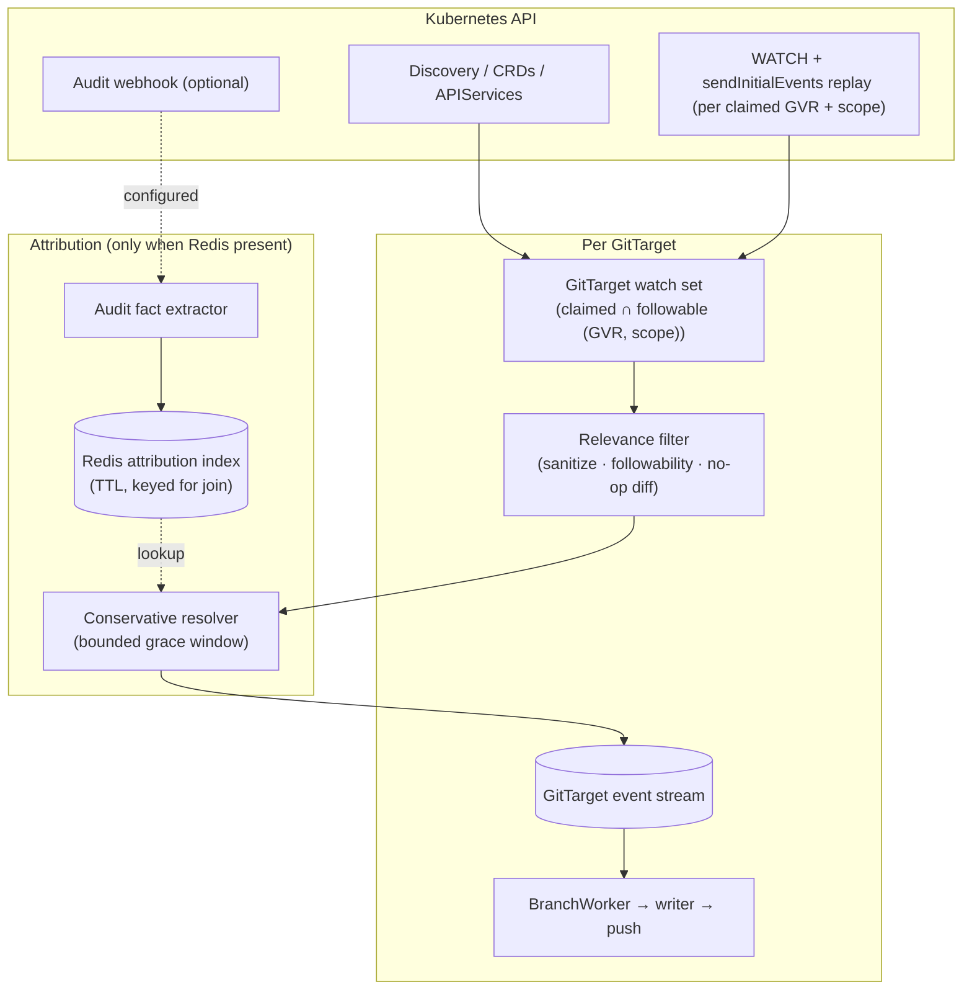

# Watch-first ingestion architecture

> Status: **accepted direction — big-bang rewrite**
> Date: 2026-06-25
>
> **Correction (2026-06-28): Redis/Valkey is REQUIRED, not optional.** This document's Decision 2 and
> several passages below call Redis optional and describe a "no Redis → committer-only" mode. That framing
> is superseded: Redis holds each GitTarget's watch **resume cursors** (state continuity / work
> re-pickup) and is the substrate for HA and the planned durable branch-worker queue, so it is a hard
> dependency in every mode. The **only** optional capability is **audit attribution** (the audit webhook),
> toggled by `--audit-attribution-enabled` (chart `attribution.enabled`). "Committer-only" now means
> *attribution off, Redis still on*. Wherever the text below says "no Redis," read "attribution disabled."
>
> **Correction (2026-06-28): no service-account naming policy.** The "name / bot / label" SA-naming knob
> floated below (the "Two knobs" passage, the confidence table's `collapse-to-bot`, and the Stage-2
> "SA-naming policy" note) was **not** shipped. A matched actor — human **or** service account — is always
> named by its own username; there is no option to collapse service accounts to the committer. The
> `serviceaccount_collapsed` reason code does not exist.
> See [architecture.md](../architecture.md) and [watch-first-merge-readiness.md](watch-first-merge-readiness.md).
> Related:
> [Current architecture](../architecture.md),
> [Mutation Capture Lab](mutation-capture-lab-design.md),
> [HA improvements](stream/ha-improvements.md),
> [Demand-driven materialization lifecycle](../finished/demand-driven-type-materialization-lifecycle.md),
> [API-source-of-truth reconcile](../finished/api-source-of-truth-reconcile.md),
> [Mutation lab corpus](../../test/mutationlab/corpus/),
> [Mutation lab README](../../test/mutationlab/README.md)

## Summary

GitOps Reverser today treats the **audit webhook** as the authoritative live mutation stream, and
spends a large amount of machinery making that stream ordered, gap-free, demand-gated, and
attributable. The mutation-capture corpus proved that Kubernetes **WATCH** is a strictly better source
for persisted object state on exactly the cases that hurt today (aggregated APIs, shallow bodies, CRD
conversion, deletecollection fan-out). This document is the decided target: **make WATCH the only
source of object state, run one watch set per GitTarget, and demote audit to an optional attribution
lookup table.**

Three decisions frame this rewrite:

1. **Per-GitTarget watches.** Each GitTarget opens and owns the watches for the resource types it
   claims. A GitTarget becomes a self-contained unit — its watches, its event stream, its branch
   worker, its commit window — which makes horizontal scaling and HA a matter of *assigning GitTargets
   to replicas*, not coordinating a shared per-type pipeline. It also keeps each watch's replay and
   mark-and-sweep bound to a single Git tree, which is what makes them simple (see the dedup note under
   [HA](#per-gittarget-ownership-and-ha)). Sharing watches across GitTargets is an explicit future
   enhancement, not the first cut.
2. **Redis is optional, and it is the toggle for attribution.** With no Redis reachable, the product
   runs in **committer-only** mode: it mirrors cluster state to Git, authored by the configured bot/
   committer identity, and needs neither Redis nor the audit webhook. With Redis present (and the audit
   webhook configured to post to it), the product additionally resolves the **author** from audit facts
   when the evidence is strong. No Redis → committer. Redis → committer **and** author.
3. **Big-bang.** The audit-as-correctness pipeline is removed, not kept behind a flag. The current
   design is not perfect and is not worth preserving in parallel; the simplification is large enough
   that a clean replacement is cheaper to reason about than a dual-mode coexistence.

The conceptual core: **the Git tree is a projection of persisted state observed by watch.** Audit
explains *who* caused a change when it can; it never defines *what* changed.

## The realization that deletes a subsystem

Once a live watch is the source of truth, two facts follow that erase most of the current engine:

- **Git is the materialized state; the watch is the only feed into it.** Each watch event is sanitized
  and diffed against current Git content — there is no per-type Redis object log to reconstruct, and no
  separate in-memory cache to keep authoritative (Git already holds current state).
- **The apiserver delivers events already ordered by `resourceVersion` per type.** There is nothing to
  re-order. The entire reason the current system exists — making interleaved, out-of-order audit
  batches into a per-type ordered stream — goes away.

So the following all disappear, not as an optimization but as dead concepts:

- the per-type Redis audit streams and their RV-anchored stream positions;
- the **late-lane / divert / nudge** machinery (out-of-order numeric cross-writes were an audit-batch
  artifact; watch has no such thing) — the recurring flaky invariant retires with it;
- the **demand gate** (it existed to stop a per-type *mirror* exploding across cluster types; there is
  no mirror to bound);
- the **audit log splice fold**, its RV-anchored stream position, and the **periodic checkpoint LIST +
  timer-driven drift sweep** — a mark-and-sweep survives, but only on watch re-establishment, never on a
  timer (see [Resume and recovery](#resume-and-recovery));
- the **materialization phase machine** (Dormant→Requested→Syncing→Synced…) and its durable
  `:objects:state` — the live watch plus the Redis RV cursor replace it, and the "re-claimed type stuck
  in phase=removed" class of bug retires with the phase machine.

The whole engine is one raw watch per `(GVR, scope)` with `sendInitialEvents`, a Redis resume cursor,
and a mark-and-sweep on replay — **no periodic LIST, no informer resync, no `SharedInformer`** (a
`SharedInformer`'s reflector re-LISTs on every process start and exposes no cross-restart resume cursor,
which is exactly what we rely on). See [State ingestion](#state-ingestion-raw-watch-per-type) and
[Resume and recovery](#resume-and-recovery).

## What each question is answered by

| Question | Source |
|---|---|
| **What changed?** | WATCH (with `sendInitialEvents` replay) over claimed, followable types. The only correctness path. |
| **Who caused it?** | Optionally, audit facts in Redis — only on strong evidence, only when Redis is present. |

A missing, late, shallow, conflicting, failed, dry-run, or simply absent audit fact never blocks or
alters state capture. It can only change the commit *author* from the bot to a named user/service
account.

## Target architecture

In this shape:

- A GitTarget reconcile resolves its claimed `(GVR, scope)` set, then opens one watch (replay + live) per
  `(GVR, scope)`. **Scope is part of the watch identity:** a namespaced WatchRule opens a namespaced
  watch (or a field-selector-bounded one), never a cluster-wide watch filtered in-process — that would
  be both an RBAC/privilege escalation and a load multiplier. The existing namespace tracking
  (`NamespaceOps` / `SnapshotNamespaces`) supplies the scope. There is no global per-type pipeline;
  ownership is per GitTarget.
- The **relevance filter** — owned by product code — discards the controller noise the cluster's audit
  policy used to discard for free (status churn, runtime-owned subresources, no-op diffs).
- Every Git write derives from persisted state observed by watch (live, or via the `sendInitialEvents` replay).
- The **resolver** attaches an author only when Redis is present *and* an audit fact matches strongly;
  otherwise the commit is authored by the configured committer.
- Audit events never create object changes and never repair object bodies.

This is still "watch + replay," not "watch from nothing": a reliable watch needs an initial replay of
current state (`sendInitialEvents`) and a fresh replay after `410`. "Watch-first" means the watch is the
*only* object-state ingestion mechanism — there is no separate LIST/checkpoint path. Audit is advisory
and optional.

## State ingestion: raw watch per type

A per-GitTarget set of raw watches replaces the per-type audit stream as the live object log.

| Current audit-first concept | Watch-first replacement |
|---|---|
| `...:audit:stream` (per type, in Redis) | raw watch event loop → diff against Git (no separate object store) |
| Audit event payload | sanitized watch object |
| Audit tail reader (blocking XREAD per type) | raw watch per `(GVR, scope)` |
| Checkpoint + audit log splice | `sendInitialEvents` replay-as-ADD on every (re)connect; `(GVR,scope)→RV` resume cursor in Redis |
| Audit body joiner | removed (watch carries the body) |
| Shallow-audit drop / wait-for-body | not relevant to state content |
| Demand gate (bound the mirror) | open watches only for claimed ∩ followable `(GVR, scope)` |
| **Audit policy noise filter** | **product-owned relevance filter** (new responsibility) |

Each watch event carries everything Git needs: GVR, scope, event type (`ADDED` / `MODIFIED` / `DELETED`,
plus the transport-level `BOOKMARK` and `ERROR` a raw watch delivers),
namespace/name/UID/resourceVersion/generation/deletionTimestamp, and the sanitized object for
object-bearing events. We consume `BOOKMARK` directly: the `initial-events-end` bookmark marks the end
of the replay, and bookmark RVs advance the resume cursor we persist to Redis; an `ERROR` (e.g. `410
Gone`) triggers a fresh `sendInitialEvents` reconnect. Each event flows into the existing per-GitTarget
[`GitTargetEventStream`](../../internal/reconcile/git_target_event_stream.go) as a
[`git.Event`](../../internal/git/types.go), then to the BranchWorker — the same seam audit events use
today, so the entire downstream writer is untouched.

### Resume and recovery

Losing a watch — pod eviction, rollout, crash, `410 Gone` — is normal, and the design's job is to come
back *correctly*, never silently dropping a delete. There are exactly two resume modes, and the choice
between them is the choice between "we still know precisely where we were" and "we don't."

**Mode A — resume from the exact point (efficient, preferred).** We persist
`(GVR, scope) → last resourceVersion` to Redis as events arrive, and keep it fresh with watch bookmarks
even when the type is quiet. On restart we re-open the watch *from that RV* — a plain delta watch, no
replay. If the apiserver still holds that RV in its watch cache, it streams every event since,
**including the `DELETED`s we missed**, and we simply continue. No replay, no sweep. This is the common
case for short gaps, and it is the efficient path: we pick up exactly where we left off.

**Mode B — replay with mark-and-sweep (the correctness fallback).** If the exact RV is gone (compacted
→ `410 Gone`, no cursor, no Redis, or a cold start), a delta is untrustworthy — objects may have been
deleted while we were away and a delta from an unknown point would never reveal it. So we open with
`sendInitialEvents=true` and run a **mark-and-sweep** over the replay:

1. **Mark** every object the replay delivers as `ADDED`, up to the `initial-events-end` bookmark.
2. **Sweep** at the bookmark: for this `(GVR, scope)`, any Git file whose object was *not* marked no
   longer exists — emit a `DELETED` for it (committer-authored; we never witnessed the actual delete).
3. Then stream live.

**This mark-and-sweep is load-bearing and must not be dropped.** It is the *only* thing that reconciles
a delete that happened while no watch was running — replay-as-ADD alone tells us what *exists*, never
what is *gone*, so without the sweep an orphaned Git file would linger indefinitely. Mode B is what
makes watch-first safe to lose and restart. It reuses the existing reconcile/sweep writer machinery;
what changes from the old design is the **trigger** — it fires on watch re-establishment (a replay),
**not** on a periodic timer. We deliberately do **not** run an hourly sweep: it runs exactly when
continuity was lost, and never while the watch has been continuously live.

Net: keep the watch live and every delete is seen directly; resume from the exact RV and the delta
carries the deletes; otherwise replay and the mark-and-sweep reconciles them. **No path silently loses a
delete.**

### Relevance filtering becomes product code (the cost that does not shrink)

This is the one place the rewrite *adds* work, and it must be counted honestly. The committed e2e
audit policy ([test/e2e/cluster/audit/policy.yaml](../../test/e2e/cluster/audit/policy.yaml)) is not a
passthrough — it is a three-tier relevance filter that drops `*/status`, HPA `*/scale`, leases,
events, node heartbeats, and keeps human-meaningful create/update/patch/delete. **Watch has no such
policy.** It delivers every persisted `MODIFIED`, including all the churn the policy dropped at the
source before it ever reached the webhook.

Watch-first mode must reproduce that filter in product code, on the hot path:

1. **No-op suppression.** A `*/status` write bumps `resourceVersion` and produces a `MODIFIED` whose
   sanitized desired-state projection equals the prior commit. The writer already diffs to no-op, but
   now we pay per-event CPU on every status churn before discarding it.
2. **Followability encodes "controller-owned."** [`internal/typeset`](../../internal/typeset/) is the
   home for "we do not mirror this type's churn" — the analogue of audit policy Rule 1.
3. **Sanitization is mandatory and on the hot path.** [`internal/sanitize`](../../internal/sanitize/)
   strips status, managedFields, and volatile metadata before diffing so runtime churn never
   masquerades as a desired-state change.

We are not removing a filter; we are *moving* it from the cluster's audit policy into the product. That
is more honest and version-portable, but the event-volume cost is real and continuous for status-heavy
clusters. The filter must be observable (see metrics), so a mis-tuned filter is visible rather than
silently dropping intent.

### History granularity changes (accept and document)

Watch carries only the versions it observes. While connected it sees each `MODIFIED`; across a replay
after `410`, a compaction, or process downtime, it **collapses every intermediate version into current
state**. Those become one replay/committer commit (or none, if the net diff is empty), not the N user
commits audit would have produced.

Honest guarantee: **watch-first delivers every persisted mutation observed while watching, and
collapses to current state across gaps.** It is a *state mirror with opportunistic per-mutation
history*, not a guaranteed per-mutation change log. This must be explicit in user docs.

## Per-GitTarget ownership and HA

A GitTarget owns the watches for its claimed types. This is the deliberate design choice and it buys
the HA story almost for free:

- **Sharding is per GitTarget.** Assign whole GitTargets to replicas (leader-elected ownership or a
  lease per GitTarget). A replica runs the watch sets for the GitTargets it owns. There is no shared
  per-type pipeline to coordinate, no per-type handoff to lose.
- **Failover resumes from the cursor.** A replica taking over a GitTarget re-opens each watch with
  `sendInitialEvents=true`, floored at the `(GVR, scope) → RV` cursor in Redis when present, or from
  current state when not. Either way the replay-as-ADD reconstructs state idempotently against Git; no
  durable object checkpoint is needed.
- **Correctness needs no Redis.** Without Redis the HA path still works — each failover just replays
  from current state instead of resuming from a cursor. Redis, when present, stores two small things:
  the resume cursors and the attribution facts. Neither is a correctness input.

**The dedup tradeoff — accepted, and why.** Per-GitTarget watches mean that if two GitTargets both
claim `ConfigMaps` in the same scope, two ConfigMap watches run — duplicate API watch load and a
duplicate connection, ×N for a widely-claimed or wildcard type. We accept that inefficiency, and not
only for simplicity: **the replay makes per-GitTarget the natural unit.** Resume state is inherently
per-GitTarget — each watch's Mode-A cursor and its Mode-B mark-and-sweep are tied to *one* GitTarget's
Git tree, and two GitTargets sharing a `(GVR, scope)` can be in different resume modes at once (one
resuming from an exact RV, the other cold and needing a full replay). A single shared watch cannot be
both, so it would have to decouple the transport from the per-GitTarget replay/sweep and run N
independent mark-and-sweeps off one stream — exactly the fragility we are avoiding. So the watch
identity is `(GitTarget, GVR, scope)`, and each replay stays clean.

**Future enhancement (explicit).** When overlap proves costly, share one watch per `(GVR, scope)` within
a replica and fan its events out to every owned GitTarget event stream that claims it (scope-filtered) —
the event-router fan-out seam already exists. The hard constraint is that it must preserve per-GitTarget
resume cursors and per-tree mark-and-sweep; it may deduplicate only the transport, never the replay
bookkeeping. Deferred until measured.

## Attribution: an optional lookup table with slack

Audit ingestion becomes an optional fact extractor that runs **only when Redis is configured**. It
stores the smallest facts needed to name an author, not an authoritative object log.

Fact shape (minimized):

| Field | Purpose |
|---|---|
| `auditID` | diagnostics / dedupe |
| `user` / `impersonatedUser` | author candidate (human *or* service account) |
| `verb`, `subresource` | explain the write |
| `responseStatus.code`, `dryRun` | reject failures and non-persistent requests |
| GVR, namespace, name, UID (when available) | exact join keys |
| response object RV (when available) | exact watch-event match |
| request/stage timestamps | bounded time matching |

The index is keyed for the join, strongest first:

- `(group, resource, namespace, name, uid, responseRV)` — exact;
- `(group, resource, namespace, name, uid)` — for `deletecollection`, expand the response List into one
  candidate per item and join the watch `DELETED` by UID, **without** RV equality;
- `(group, resource, namespace, name, responseRV)` — exact when UID absent;
- `(group, resource, namespace, name, time-bucket)` — weak, last resort.

Retention is bounded by max audit delay + the attribution grace period — minutes, not hours. Old facts
are never needed for correctness because watch owns state.

**The "slack."** A watch event waits a **bounded grace window** for a matching fact to arrive in the
index, then ships regardless. This is the one place watch-first still waits on audit, and it is what
makes "a late audit arrival must not rewrite a shipped commit" enforceable: we wait briefly *before*
shipping rather than rewrite afterwards. It is per-event, bounded, never a barrier, and it expires to
committer-authored rather than blocking state.

### Confidence policy (strict — a wrong author is worse than no author)

Because audit captures service-account activity too, a matched non-human actor is a *named*
attribution, not "unknown." Naming `system:serviceaccount:flux-system:kustomize-controller` is useful.

| Confidence | When | Author |
|---|---|---|
| Exact (human) | watch UID/name/GVR/RV matches audit response; success; non-dry-run; real user | real user |
| Exact (service account) | same match strength; actor is an SA/controller | named SA (its own username) |
| Strong causal | scale subresource with matching parent objectRef + response RV (the parent watch event lands at exactly that RV) | real user / SA |
| Deletecollection | a `deletecollection` audit fact whose `responseObject` is a List is expanded into per-object candidates; each watch `DELETED` joins by **GVR + namespace + name + UID** — **not** RV (audit lists the pre-delete RV, watch the later delete RV; UID is the stable key) | real user / SA (reason `exact-deletecollection-item`) |
| Terminal delete (finalizer / cascade) | finalizer-removal or owner-ref cascade: the watch `DELETED` lands at a later RV and the actor that removed the object is a controller (corpus Rows 8/10) | committer, unless an *exact* match to the removing actor's audit fact exists (then that named SA) |
| Weak | same GVR/name/time only, missing RV/body, or multiple candidates | committer |
| Conflict | failure, dry-run, mismatched UID/RV, multiple users, stale | committer, with metric |
| Absent | no Redis, no audit, policy dropped the write, or no match | committer |

`deletecollection` is the one delete case strong enough to attribute: implement it as a fact *expander*
— one collection fact becomes N per-object candidates keyed by GVR/namespace/name/UID — and join each
watch `DELETED` by UID. This holds only when audit captures the `responseObject` List; if the policy
gives request bodies only, or an aggregated API omits the response, it falls back to weak selector/time
matching or committer. Do **not** apply the expander to finalizer-delayed terminal deletes.

The finalizer/cascade downgrade is deliberate, and it is exactly the case the strict rule exists for:
attributing a terminal `DELETED` to the human who *asked* for the delete looks right but commits the
file removal under the wrong actor. The human's `delete` only stamped `deletionTimestamp` (an earlier
event at an earlier RV); a controller removed the finalizer and caused the actual removal. Per "a wrong
author is worse than no author," that commits as committer unless we match the finalizer-removing patch
exactly — which usually names a service account, not the human.

Two knobs the product exposes: the **service-account naming policy** (name / bot / label), and a
machine-readable **reason code** on every outcome (`exact-user`, `exact-sa`, `exact-deletecollection-item`,
`weak-no-rv`, `conflict-multi-user`, `absent-no-redis`, `absent-policy-dropped`, `expired`) so unknown
rates are explainable, not mysterious.

## Commit windows and authors

The current `BranchWorker` window accepts one `(author, GitTarget)` pair at a time
([open_window.go](../../internal/git/open_window.go), keyed on `event.UserInfo.Username`). Watch-first
needs only small adjustments:

- exact-attributed events (human or named SA) use that actor as the author bucket — unchanged;
- everything else uses the configured committer identity;
- the bounded grace window may delay routing a watch event while a fact arrives; on expiry it routes as
  committer and is **not** rewritten later;
- replay/reconcile changes use the committer identity;
- committer and attributed events must not be grouped into one real user's commit (the existing
  no-blended-authors safety property is preserved).

This means watch-first can produce *more* commits than audit-first when attribution is mixed, and
sometimes *fewer* when bursts/downtime collapse to current state. Both are acceptable and documented.

## CommitRequest implications

`CommitRequest` currently **fails closed** if it cannot attribute the requester
([commitrequest_controller.go](../../internal/controller/commitrequest_controller.go),
`attributionFailedMessage`). That does not fit a no-Redis install.

New behavior:

- the controller-runtime watch on the `CommitRequest` object still triggers finalization;
- attribution is optional: with Redis + a matching fact, the requester is named; otherwise the request
  **finalizes as committer** with a status note that finalization happened without end-user
  attribution;
- the request must never fail solely because Redis/audit is absent.

If preserving the CommitRequest submitter matters without audit, that needs an explicit user field or a
signed request — Kubernetes object state alone does not identify the human who created it.

## Operating modes

| Mode | State source | Redis / audit | Author fidelity | Use |
|---|---|---|---|---|
| **Committer-only** | watch | neither | committer identity | simplest install, state mirror |
| **Attributed** | watch | Redis + audit webhook | named user/SA on strong match; committer otherwise | recommended target |

The product must not imply committer-only equals attributed mode, nor that attributed mode recovers
every author (the audit policy still bounds which writes carry a fact, and the CommitRequest submitter
is not recoverable from state alone). Both modes deliver a continuously updated Git mirror of desired
cluster state.

## Keep / cut / reshape inventory

What the big-bang touches, by package. Roughly **~5–6k LOC deleted**, replaced by **~1–1.5k** of
raw-watch ingestion plus a small attribution index and RV-resume cursor.

| Package | Verdict | Notes |
|---|---|---|
| [internal/git](../../internal/git/) | **KEEP** | The whole downstream writer is source-agnostic. Only `open_window.go` (committer/SA/unknown buckets + grace) and `commit_request_attach*.go` (attribution optional) change. |
| [internal/manifestanalyzer](../../internal/manifestanalyzer/), [internal/manifestreport](../../internal/manifestreport/) | **KEEP** | Runtime manifest planning/diff/report. Source-agnostic. |
| [internal/typeset](../../internal/typeset/) | **KEEP, promote** | Followability/registry becomes the home of the relevance filter ("controller-owned → don't mirror"). |
| [internal/sanitize](../../internal/sanitize/) | **KEEP, promote** | Now mandatory on the hot path before every diff. |
| [internal/controller](../../internal/controller/) | **KEEP, reshape** | GitTarget reconcile opens watches instead of consuming a splice; CommitRequest flips fail-closed → finalize-as-committer. |
| [internal/reconcile](../../internal/reconcile/) | **KEEP** | `GitTargetEventStream` is the per-GitTarget seam the design leans on. |
| [internal/watch](../../internal/watch/) | **KEEP core, gut LIST/checkpoint half** | Keep discovery/catalog, `event_router`, `type_lifecycle`, `scope_resolve`, `watched_type_table`. Promote `watch_state.go`/`watch_compare.go` to the real path. Cut the `materialization.go` phase machine, `audit_tail.go`, `splice_snapshot.go`, `target_type_watermark.go`, and the heavy Redis objects-snapshot write in `type_objects_mirror.go` — but **keep that file's `sendInitialEvents` watch as the replay/resume path**, swapping the snapshot write for a tiny `(GVR,scope)→RV` cursor. |
| [internal/queue](../../internal/queue/) | **CUT ~90%** | Delete `redis_bytype_queue`, `redis_type_splice`, `redis_objects_snapshot`, `redis_audit_queue`, `redis_watch_splice`, `redis_watch_stream`, `subresource_translate`. Keep only the attribution-fact pieces (`commitrequest_author` folds into the new index). |
| [internal/gate](../../internal/gate/) | **CUT** | Demand-gating existed to bound the per-type mirror. No mirror, no gate. |
| [internal/webhook](../../internal/webhook/) | **SHRINK hard** | `audit_joiner.go` (body-joining) → **gone**. `audit_handler.go` → shrinks to fact extraction → index. `admission_allow_handler.go` stays as the future-policy seam. |
| [internal/auditutil](../../internal/auditutil/) | **SHRINK** | Keep only what feeds attribution facts. |
| giteaclient, ssh, sshsig, telemetry, types, rulestore, mutationlab | **KEEP** | Provider/credential/signing/metrics/test infra, all source-agnostic. |

## Change plan (big-bang, deletion-forward)

Done as a single replacement on a branch; mostly deletion, so it should be quick relative to its
footprint. Validation gate is the full e2e suite green (`task lint` → `task test` → `task test-e2e`),
with the watch-vs-audit object-set diff used as the parity check during bring-up.

**Stage 1 — Raw-watch ingestion as the GitTarget event source.**
Build a per-GitTarget watch manager: on GitTarget reconcile, resolve claimed ∩ followable
`(GVR, scope)` and open one raw watch per `(GVR, scope)` with `sendInitialEvents=true`. Persist
`(GVR, scope) → last RV` to Redis (when present) and resume from it; on `410`/disconnect, re-open with a
fresh replay. Wire each event through the relevance filter (sanitize → followability → no-op diff) into
the existing `GitTargetEventStream` → BranchWorker. **No timer sweep**; deletes are reconciled by the
Mode-A delta resume or the Mode-B mark-and-sweep on replay (see
[Resume and recovery](#resume-and-recovery)). This replaces the materialization phase machine + audit
tail + splice as the desired-set source. *Net: new code is small; it plugs into existing seams, and
`type_objects_mirror.go` already does the `sendInitialEvents` watch.*

**Stage 2 — Optional attribution.**
When Redis is configured: extract minimal audit facts in the (shrunk) audit handler → Redis index with
TTL; add the conservative resolver with the bounded grace window and SA-naming policy. When Redis is
absent: skip the audit handler and index entirely; commits are committer-authored. Flip
`CommitRequest` to finalize-as-committer without attribution.

**Stage 3 — Demolition.**
Delete the audit-as-correctness machinery now that nothing imports it: `internal/queue` (minus the
moved attribution bits), `internal/gate`, `webhook/audit_joiner.go`, the materialization phase machine,
`audit_tail.go`, `splice_snapshot.go`, `target_type_watermark.go`, the objects snapshot/checkpoint, and
the late-lane/divert/nudge code. Shrink `audit_handler.go` to fact extraction.

**Stage 4 — Config, wiring, docs.**
Make Redis and the audit webhook optional in `cmd/main.go` (no `--audit-redis-addr` reachable → boot in
committer-only mode rather than failing). Remove the dead audit-stream flags
(`--audit-redis-max-len`, `--audit-bytype-*`, `--watch-state-stream`, body TTL/wait, etc.). Update the
Helm chart and `config/` so the audit webhook and Redis are opt-in. Rewrite `docs/architecture.md` to
the watch-first model and document the two operating modes and the history-granularity guarantee.

## Reliability rules (non-negotiable)

1. Audit/Redis must never be required for object correctness.
2. A watch event with no confident audit match must still write state (as committer).
3. A failed, rejected, or dry-run audit fact must never create state.
4. Conflicting attribution facts produce committer, not "first wins."
5. A later audit arrival must not rewrite a commit already shipped as committer.
6. A resume replay's mark-and-sweep is authoritative only after it reaches `initial-events-end`; a
   partial replay must not be treated as complete current state. Deletes missed while not watching are
   reconciled by the Mode-A delta resume or the Mode-B mark-and-sweep — never silently dropped.
7. Every attribution outcome carries a machine-readable reason code.
8. Unknown-author rate is visible by GitTarget, GVR, verb/event type, and reason.
9. The relevance filter is observable: how many watch events were dropped as no-op/noise, by GVR.

## Metrics

| Metric | Why |
|---|---|
| `gitopsreverser_watch_events_total{gvr,type,outcome}` | watch volume and drops |
| `gitopsreverser_watch_events_filtered_total{gvr,reason}` | relevance-filter behavior (no-op/status/runtime) |
| `gitopsreverser_watch_restarts_total{gvr,scope,reason}` | watch stability / `410 Gone` pressure (replay reconnects) |
| `gitopsreverser_watch_replay_seconds{gvr,scope}` | time to reach `initial-events-end` on (re)connect — resume cost |
| `gitopsreverser_attribution_total{result,reason,gvr}` | exact-user / exact-sa / weak / conflict / absent / expired |
| `gitopsreverser_attribution_wait_seconds{result}` | grace-window latency cost |

## Decision table

| Question | Answer |
|---|---|
| Source of object state? | WATCH with `sendInitialEvents` replay, per GitTarget. No separate LIST/checkpoint. |
| Is audit ever required for committing state? | No. It only changes the author. |
| Is Redis required? | No. Without it: committer-only + replay-from-current on every restart. With it: committer + author + RV resume cursor. |
| Watch ownership granularity? | Per GitTarget. HA = assign GitTargets to replicas; failover resumes from the Redis RV cursor (or replays). |
| Periodic LIST / drift sweep? | No *timer* sweep. Deletes are reconciled by the Mode-A delta resume (exact RV) or a **mark-and-sweep on replay** (Mode B); the sweep fires on watch re-establishment, never hourly. |
| Dedup watches across GitTargets? | No — one watch per `(GitTarget, GVR, scope)`, because resume cursors and mark-and-sweep are per-GitTarget. Sharing the transport is an explicit future enhancement, deferred. |
| Guess an author from timing alone? | No. Weak matches commit as committer. |
| Does watch-first preserve per-mutation history? | No across gaps — it collapses to current state. State mirror with opportunistic history. |
| Migration shape? | Big-bang: remove the audit-as-correctness pipeline, don't keep it in parallel. |
| What gets harder? | The relevance filter (now product code on the hot path) and honest, deterministic attribution. |

## Bottom line

Watch is the better source for persisted object state, and the audit-as-correctness pipeline carries
the most incidental complexity (ordering, late-lane, demand-gating, the materialization phase machine).
Making watch the only state source per GitTarget deletes that complexity, makes Redis and the audit
webhook optional, and turns shallow/aggregated audit events from correctness problems into attribution
limitations.

Two prices are accepted in exchange: the audit *policy's* relevance filtering moves into product code
on the hot path, and authorship becomes probabilistic with per-observation (not per-mutation) history
granularity. The product stays honest about both — name a user or service account when the evidence is
strong, otherwise commit as the committer and say why, and filter controller churn deliberately rather
than relying on a cluster's audit policy to do it.
