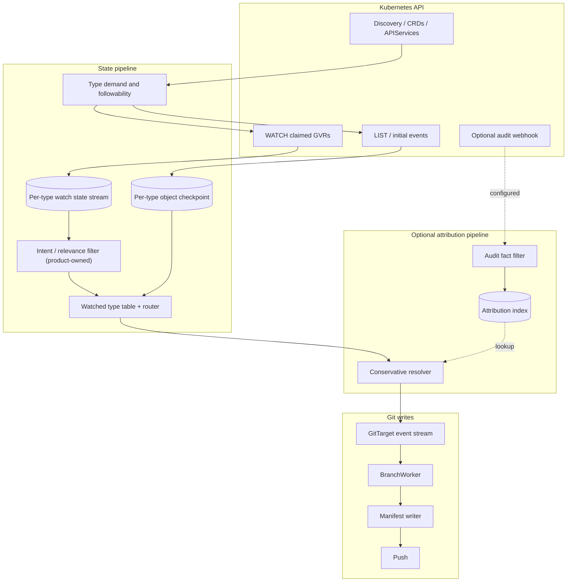

# Watch-only ingestion architecture

> Status: proposal / architecture spike
> Date: 2026-06-25 (revised 2026-06-25 after corpus + audit-policy + HA review)
> Related:
> [Current architecture](../architecture.md),
> [Mutation Capture Lab](mutation-capture-lab-design.md),
> [Audit ingestion decision record](audit-ingestion-decision-record.md),
> [HA improvements](stream/ha-improvements.md),
> [Demand-driven materialization lifecycle](../finished/demand-driven-type-materialization-lifecycle.md),
> [API-source-of-truth reconcile](../finished/api-source-of-truth-reconcile.md),
> [Mutation lab corpus](../../test/mutationlab/corpus/),
> [Mutation lab README](../../test/mutationlab/README.md)

## Summary

GitOps Reverser currently treats audit as the authoritative live mutation stream. Kubernetes watches
and LIST checkpoints are still essential, but they mainly support discovery, checkpointing, freshness,
and reconciliation. The mutation-capture lab makes a different architecture credible: use Kubernetes
WATCH as the only source of object state, and treat audit as an optional attribution lookup table.

This proposal intentionally separates two questions:

1. **What changed?** Answered only by LIST/WATCH over claimed, followable resource types.
2. **Who likely caused it?** Answered opportunistically from audit events, only when the match is
   strong enough. If the match is uncertain or audit is not configured, the commit is made by the
   configured bot identity and does not name a user.

That trade moves the product from "audit-backed live history" to "watch-backed state history with
best-effort attribution." It simplifies object capture substantially, especially for shallow audit
events and aggregated APIs, but it makes author attribution an explicit confidence problem instead of
a built-in property of the live stream.

**The load-bearing realization this revision adds:** the current audit stream is not "naturally"
clean — it is clean because the audit *policy* does heavy semantic filtering (it drops `*/status`, HPA
`*/scale`, leases, events, node heartbeats, and keeps human-meaningful create/update/patch/delete).
Audit captures *all* authenticated activity by default, including service accounts and background
controllers; the policy is what curates it down to intent. So the current architecture has an
**unpriced dependency on a well-tuned audit policy**. Watch sees everything the policy throws away,
which means watch-only mode must re-implement that relevance filtering itself. This is the single
biggest cost the original draft under-counted, and it reframes "what becomes simpler" honestly: we are
not removing a filter, we are *moving* it from the cluster's audit policy into the product.

The core recommendation:

- Use watch events and checkpoint LISTs as the only correctness path for Git content.
- Keep audit ingestion optional and store only small attribution facts, not an authoritative object
  log.
- Attribute a watch event to a user only on exact or near-exact evidence; a non-human actor (service
  account / controller) is a *named* attribution, not "unknown."
- Surface unattributed commits honestly rather than guessing.
- Allow clusters to run without audit webhook configuration, with reduced attribution fidelity.
- Own, as product code, the relevance/intent filtering that the audit policy does today.

A short verdict on cost/benefit is in [Is this worth it?](#is-this-worth-it) — the direction is
right as a long-term target, but the value is in the *staged, parallel* build (Phases 0–2), not in an
immediate retirement of the hardened audit path.

## Current architecture, in one page

The current [architecture](../architecture.md) has these load-bearing choices:

| Concern | Current answer |
|---|---|
| Live object event source | Audit webhook |
| Object body source | Audit `responseObject`, sometimes joined with `/audit-webhook-additional` |
| User attribution | Audit `user` on the same event that drives the write |
| Ordering | Per-type Redis audit streams keyed by `metadata.resourceVersion` |
| Integrity backstop | LIST checkpoint plus audit log splice |
| Relevance filter | **The audit policy** — drops `*/status`, HPA `*/scale`, leases, events, heartbeats |
| Shallow audit events | Wait for additional body, drop or degrade if none arrives |
| Deletecollection | Audit captures one collection request; checkpoint sweep heals item fan-out |
| No audit configured | High-fidelity live mode is not available |

The current model is coherent because the same event says both "this object changed" and "this user
made the request." Its two main costs are that (a) audit becomes a hard operational dependency for
live mirroring with authorship, and (b) the system silently depends on the cluster's audit policy
being curated to the product's notion of "intent" — see the next section.

## The audit policy is a hidden dependency

The committed e2e audit policy ([test/e2e/cluster/audit/policy.yaml](../../test/e2e/cluster/audit/policy.yaml),
mirrored by the mutation lab) is not a passthrough. It is a three-tier relevance filter:

1. **Noise & security filter (`level: None`)** — drops `events`, `endpoints`, `nodes`, `pods`,
   `bindings`, `componentstatuses`, core `*/status`, `apps/*/status`, `networking.k8s.io/*/status`,
   `coordination.k8s.io/leases`, and the auth/authz review verbs.
2. **HPA noise filter (`level: None`)** — drops `*/scale` `update`/`patch` *specifically from*
   `system:serviceaccount:kube-system:horizontal-pod-autoscaler`.
3. **Intent capture (`level: RequestResponse`)** — keeps `create`/`update`/`patch`/`delete`/
   `deletecollection` on everything else, including CRDs and `commitrequests`.

Two consequences matter for this proposal:

- **Audit is not silent for controllers; the policy is.** A controller writing `/status` *is*
  audited by default — the policy chooses to drop it. A human scaling a Deployment is kept; the HPA
  scaling it is dropped by actor. So the corpus rows where "audit is silent" (Row 5, Row 6-for-HPA)
  are **policy outcomes, not audit limitations**. This corrects the earlier framing that controllers
  produce changes "with no audit fact": by default they produce plenty; the policy is what suppresses
  the high-volume, low-intent ones.
- **Watch has no such policy.** Watch delivers every persisted `MODIFIED`, including the `*/status`
  churn, HPA scale ticks, and controller heartbeat writes that the audit policy was dropping before
  they ever reached the webhook. Watch-only mode therefore inherits the *entire* job of deciding what
  is intent and what is noise. The product already has pieces of this (status sanitization,
  followability rejecting controller-owned types, desired-state diffing so a no-op `MODIFIED` makes no
  commit) — but those run *after* the event is ingested and processed, whereas the audit policy
  dropped the event for free at the source. The cost moves from "configure a policy" to "process and
  discard a high volume of events in product code, correctly."

This is the strongest argument *for caution*, not against the direction: it is fine for the product to
own its relevance filter (it is more honest and version-portable than depending on each cluster's
policy), but the work and the event-volume cost must be counted, not assumed away.

## What the corpus changes

The committed mutation-lab corpus is captured against `k8s v1.35.2+k3s1`
([CLUSTER.md](../../test/mutationlab/corpus/CLUSTER.md)). It currently contains thirteen captured
catalog rows:

| Row | Scenario | Corpus result that matters for this proposal |
|---|---|---|
| 1 | Create succeeds | Watch carries the full persisted ConfigMap; audit carries user and response RV. |
| 2 | Update | Watch carries the final object at the same resulting RV as audit response. |
| 5 | Status subresource | Watch is the only witness **because the audit policy drops `*/status`**; admission ignores subresources. The controller then re-clobbers the human write (two watch events). |
| 6 | Scale subresource | Watch carries the updated Deployment; audit carries the user and `/scale` fact **for non-HPA actors** (the policy drops HPA `/scale`). |
| 7 | Graceful Pod delete | Watch carries deletion-pending and terminal delete; audit drops pods by policy. |
| 8 | Finalizer delete | Watch carries the deletion-pending MODIFIED and terminal DELETED; audit carries the delete + finalizer-removal patch (no second delete). |
| 9 | Deletecollection | Watch emits one `DELETED` per object; audit emits one name-less collection request. |
| 10 | Owner-ref cascade | Watch emits `DELETED` for parent and cascaded child; audit attributes the child delete to `generic-garbage-collector`, not the human. |
| 11 | Dry-run create | Audit and admission see a request; watch sees nothing because nothing persisted. |
| 12 | Rejected create | Audit and admission see a failed request; watch sees nothing because nothing persisted. |
| 13 | Optimistic-concurrency conflict | A stale-RV update is rejected at the storage layer (409). Audit is the *sole* witness — no admission, no watch. |
| 14 | CRD conversion | Watch sees the stored/served version; audit/admission see the submitted version. |
| 15 | Aggregated API write | Official audit has no body/name, while watch carries the full object. |

The evidence strongly supports watch as the better source for **persisted object state**. It also
shows that audit remains the better source for **request provenance** — but only for the writes the
policy keeps, and with the actor possibly being a service account. The proposal is to stop asking
audit to be both the object log *and* the relevance filter.

## Proposed architecture



In this shape:

- A claimed type opens a watch/list state pipeline.
- The **intent/relevance filter** — owned by the product — discards the controller noise that the
  audit policy discards today (status-only churn, runtime-owned subresources, no-op diffs).
- Every Git write is derived from persisted state observed by watch or by a completed checkpoint.
- Audit events do not create object changes and do not repair object bodies.
- Audit events populate a bounded attribution index.
- The resolver attaches an author — human *or* named service account — only when the audit fact and
  the watch event match strongly.
- A missing, late, shallow, conflicting, failed, or dry-run audit event never blocks state capture.

This is still not literally "watch without LIST." A reliable watch system needs LIST checkpoints,
initial state, bookmarks, and relist after `410 Gone`. "Watch-only ingestion" here means watch/list is
the only object-state ingestion mechanism. Audit is advisory.

## State ingestion

A per-type state stream replaces the per-type audit stream as the live object log.

| Current audit-first concept | Watch-only replacement |
|---|---|
| `...:audit:stream` | `...:watch:stream` or a renamed neutral `...:events:stream` |
| Audit event payload | Sanitized watch object envelope |
| Audit tail | Watch tail |
| Audit log splice | Checkpoint plus watch log splice |
| Audit body joiner | Removed for state content |
| Shallow-audit drop | Not relevant to state content |
| **Audit policy noise filter** | **Product-owned intent/relevance filter** (new responsibility) |

Each stored watch event should carry:

- concrete GVR and scope;
- event type: `ADDED`, `MODIFIED`, `DELETED`, `BOOKMARK`, `ERROR`;
- namespace, name, UID, resourceVersion, generation, deletionTimestamp;
- sanitized object for object-bearing events;
- observed time and watch restart/session identity;
- stream position;
- optional attribution result attached later or resolved before routing.

The current checkpoint model still matters. A watch can disconnect, compact, or miss events during
process downtime. The system should keep the current fail-closed rule: a sweep is authoritative only
after a successful checkpoint for that type. A missed watch event costs freshness until the next
checkpoint, not correctness — but see the next subsection on what that does and does not promise.

### Relevance filtering becomes product code

Because watch has no policy, the filter the audit policy provided must be reproduced explicitly. Three
concrete jobs:

1. **No-op suppression on the hot path.** A `*/status` write bumps `resourceVersion` and produces a
   `MODIFIED` watch event whose sanitized desired-state projection is identical to the prior commit.
   The writer already diffs to no-op, but watch-only means we now *pay per-event CPU* on every status
   churn before discarding it, where the audit policy dropped it at the source. For status-heavy types
   this is a real, continuous cost.
2. **Followability must encode "controller-owned."** The existing followability decision should keep
   narrowing or rejecting types that are mostly runtime state, and should be the place where "we do
   not mirror this churn" lives — the analogue of audit policy Rule 1.
3. **Sanitization stays mandatory.** Status, managedFields, and volatile metadata are stripped before
   diffing so that runtime churn does not masquerade as desired-state change.

### What the "history guarantee" actually becomes

The original draft said a missed watch event "costs freshness, not correctness." That is true for a
*state mirror* but it understates a real semantic change for a *history* product:

- Audit captures every persisted mutation (that the policy keeps), so the Git history can carry each
  one as a distinct, attributed commit.
- Watch, by construction, only carries the versions it observes. While connected it sees each
  `MODIFIED`; across a relist after `410 Gone`, a compaction, or process downtime, it collapses every
  intermediate version into the **current state**. Those become one resync/bot commit (or none, if the
  net diff is empty), not the N user commits audit would have produced.

So the honest statement of the guarantee is: **watch-only delivers every persisted mutation observed
while watching, and collapses to current state across gaps.** This can produce *fewer, coarser*
commits than audit-first during bursts or downtime, in addition to the mixed-attribution case that can
produce *more* commits. This is acceptable if the product is positioned as a *state mirror with
opportunistic per-mutation history*, not a guaranteed per-mutation change log. The positioning should
be explicit in user docs.

## Audit as an attribution lookup table

Audit ingestion becomes an optional fact extractor. It should store the smallest facts needed for
attribution, not the whole event as a correctness input. Note that the *set* of facts available is
still governed by the cluster's audit policy: a policy that drops `*/status` simply yields no facts
for those writes, which is fine — those writes are filtered or no-op anyway.

Suggested fact shape:

| Field | Purpose |
|---|---|
| `auditID` | diagnostics and dedupe |
| `user` / `impersonatedUser` | commit author candidate (human *or* service account) |
| `verb` and `subresource` | explain why the write happened |
| `responseStatus.code` | reject failures and dry-run/non-persistent requests |
| `dryRun` | reject non-persistent requests |
| GVR, namespace, name, UID when available | exact lookup keys |
| response object RV when available | exact watch-event match |
| request timestamp and stage timestamp | bounded time matching |
| requestURI and selectors | deletecollection diagnostics |
| collection item identities when response body has a list | conservative collection matching |
| source endpoint | official vs additional/proxy diagnostics |

The index can have several keys over the same fact:

- `(group, resource, namespace, name, uid, responseRV)` for exact single-object matches;
- `(group, resource, namespace, name, responseRV)` when UID is unavailable but name/RV are present;
- `(group, resource, namespace, name, time bucket)` only as weak evidence;
- `(auditID)` for diagnostics and optional proxy enrichment;
- `(group, resource, namespace, selector, time range)` for collection requests.

Retention should be bounded by the maximum expected audit delay plus the attribution grace period.
This can be minutes, not hours. Old facts are not needed for correctness because watch/list owns
state.

## Attribution confidence policy

The resolver should be deliberately strict. A wrong author is worse than no author. Because audit
captures service-account activity, a matched non-human actor is a *named* attribution, not unknown —
naming `system:serviceaccount:flux-system:kustomize-controller` for a GitOps reconcile is useful, not
noise.

| Confidence | When to use | Commit author |
|---|---|---|
| Exact (human) | Watch UID/name/GVR/RV matches audit response; success; non-dry-run; actor is a real user. | Real user |
| Exact (service account) | Same match strength, actor is a service account / controller. | Named SA actor (configurable: keep, collapse to bot, or label) |
| Set-exact | Deletecollection response list matches the watch fan-out (rarely available — see Row 9). | Real user/SA, if no conflict |
| Strong causal | Finalizer or scale subresource has parent objectRef plus matching parent RV. | Real user/SA |
| Weak | Same GVR/name/time window only, missing RV/body, or multiple candidate audit events. | Bot / unknown |
| Conflict | Failure, dry-run, mismatched UID/RV, multiple users, or stale event. | Bot / unknown, with metric |
| Absent | No audit configured, policy dropped the write, or no matching audit fact. | Bot / unknown |

Two policy knobs the product must expose:

- **Service-account naming policy.** Whether to name service accounts as authors, collapse them to the
  bot identity, or label them distinctly (e.g. `Attribution: controller`). Many users will want
  `kustomize-controller`/`argocd-application-controller` named, and human-vs-controller distinguished.
- **Reason codes.** Every attribution outcome carries a machine-readable reason
  (`exact-user`, `exact-sa`, `weak-no-rv`, `conflict-multi-user`, `absent-no-audit`,
  `absent-policy-dropped`, `expired`), so unknown rates are explainable, not mysterious.

This policy means some user names disappear compared with the current model. That is an intentional
product trade. The system can still include non-author diagnostics in commit trailers or status, for
example `Attribution: unknown` or `Attribution-Reason: no-audit-fact`, without pretending to know the
actor.

## Corpus-driven matching examples

### ConfigMap create and update

The corpus has exact evidence:

- audit response has `metadata.resourceVersion`, `uid`, `namespace`, and `name`;
- watch `ADDED` / `MODIFIED` has the same persisted identity and RV;
- audit status is successful and not dry-run.

These are good candidates for real user attribution.

### Dry-run and rejected creates

Rows 11 and 12 prove that audit can describe writes that never persisted. In a watch-only state
pipeline they produce no state event and no Git write. Their attribution facts can be stored briefly
for diagnostics, but they must not create commits.

### Scale subresource

Row 6 is a good watch-only simplification *and* a clear illustration of the policy point. The watch
sees the updated parent Deployment, so the writer does not need to synthesize a parent manifest from a
partial `Scale` body. Audit can still attribute a *human* scale because the policy keeps it; the HPA's
scale ticks are dropped by the policy today and would be raw `MODIFIED` events under watch-only — the
product's relevance filter (or followability/no-op diff) must absorb that autoscaler churn so it does
not become commits.

### Deletecollection

Row 9 becomes simpler for object content and harder for authorship:

- simpler: watch emits one `DELETED` per removed object, which is exactly what Git needs;
- harder: audit emits one collection request, often name-less.

The resolver should attribute the fan-out only if the audit response list contains the removed
objects and no conflicting watch/audit candidates exist. In practice the response is frequently
name-less (Row 9), so "Set-exact" is the exception, not the rule, and the deletes usually commit as
unknown/bot. That is acceptable.

### Aggregated API write

Row 15 is the strongest argument for watch-only state. Official audit has no request body, no response
body, and no object name. The watch has the full `Flunder` object, including `spec`.

In watch-only mode, the object content is captured without `apiservice-audit-proxy`. If the proxy is
still installed and posts an enriched event, that enrichment can improve attribution. Without it, the
official audit event is too weak to name a user for the specific object.

### CRD conversion

Row 14 favors watch for state because watch sees the stored/served version selected by the watch GVR.
Audit sees the submitted version. The writer should materialize the watch object, not the submitted
request shape.

Attribution can still be exact if the audit response object's UID/RV maps to the watch object's UID/RV
after version conversion. If the version mapping is ambiguous, do not name the user.

### Status and controller-owned state

Row 5 shows watch can see state that the product may not want to mirror, and it is the clearest
demonstration of the audit-policy point: audit was silent here *only because the policy drops
`*/status`*, and the controller re-clobbered the human write (two watch events). Watch-only ingestion
must keep the existing intent filter: status is sanitized or ignored for desired-state manifests, and
followability should continue to reject or narrow types that are mostly controller-owned runtime
state.

Watch-only makes the unwanted state visible; it does not make that state desirable. The job that the
audit policy did for free — never even delivering the `/status` churn — now lives in the product.

## What becomes simpler

| Area | Simplification |
|---|---|
| Install path | Clusters can run without kube-apiserver audit webhook configuration. |
| Audit policy coupling | The product no longer silently depends on each cluster's audit policy being tuned to its notion of intent. |
| Aggregated APIs | Watch supplies object content; body enrichment is no longer required for state. |
| Shallow audit events | Shallow audit is an attribution problem, not an object-capture problem. |
| Admission temptation | Validating admission is not attractive once watch proves persistence. |
| Deletecollection content | Per-object watch `DELETED` events naturally match Git deletes. |
| `/scale` handling | Parent watch events can update `spec.replicas`; partial Scale bodies are not needed for content. |
| Failed and dry-run writes | They never appear on watch, so they cannot accidentally write Git. |
| Source precedence | Watch and audit no longer compete to drive the same object write. |
| Audit queue sensitivity | The audit side can store minimized user facts instead of full request/response bodies. |
| Product tiers | "State mirror" and "state mirror with attribution" become clear operating modes. |

The largest simplification is conceptual: the Git tree is a projection of observed persisted state.
Audit explains state changes when it can, but it does not define them.

## What becomes more complex

| Area | New complexity |
|---|---|
| Relevance filtering | **The audit policy's job moves into the product** — status/runtime churn must be filtered in code, on the hot path, instead of dropped at the source. |
| History granularity | The guarantee changes from "every persisted mutation" to "every mutation observed while watching, collapsing across gaps." |
| Watch lifecycle | Continuous watches must handle bookmarks, compaction, relist, backoff, and restart. |
| API load | Claimed types now need live watches, not only periodic checkpoint LISTs plus audit ingress. |
| HA | Multiple pods can duplicate watches unless there is clear per-type ownership — but the seams already exist (see below). |
| Attribution | A new confidence engine is required, with strict no-guess behavior and a service-account policy. |
| Commit windows | Unknown, human, and named-SA events need explicit grouping rules. |
| Audit timing | To improve attribution, the router may wait briefly for audit facts, adding latency and a soft re-coupling to audit. |
| Delete attribution | Deletes, finalizers, cascades, and deletecollection need conservative special handling. |
| Resync authorship | Checkpoint-healed changes often cannot be attributed and should commit as bot/resync. |
| Metrics | Unknown-author rates and attribution conflicts become first-class product health signals. |
| UX | Users need clear documentation that no-audit mode gives useful state but not complete user names. |

The biggest new complexity is not state correctness. It is (a) reproducing the audit policy's relevance
filter as product code, and (b) being honest and deterministic about authorship.

## High availability: the seams already exist

The original draft listed HA as a near-prerequisite. After reviewing
[stream/ha-improvements.md](stream/ha-improvements.md), that is too alarmist: the demand/materialization
designs were drawn with the HA seam in mind, so most of multi-replica readiness is *already done by
construction*. The relevant facts:

- **Authoritative state is already in Redis, not memory.** The "is this `Synced`, at what rv" truth
  lives in `:objects:state`; in-memory phase is control-plane only and rebuilt from Redis on boot. A
  second replica reading the same keyspace sees the same world without re-LISTing.
- **The checkpoint is a standing failover resume point.** A failover replica reconciles against the
  existing `:objects:items @ rv`; it does not re-derive the API.
- **Demand is a self-healing lease (DEC-L3).** A dead replica's claims age out; there is no handoff
  message a failover could lose. `ha-improvements.md` §2 turns this into Redis ZSET leases with a TTL
  (`Declare → ZADD demand:{gvr} <now+TTL> <ref>`), behind a small `claimStore` interface (§4) so the
  in-memory map and a future `redisClaimStore` are drop-in interchangeable with no change to the phase
  machine or sweep.
- **Boot rebuild restores both axes** (§3): checkpoints (what exists) and demand ZSETs (what is still
  wanted).

What watch-only genuinely *adds* to the deferred HA list (`ha-improvements.md` §5) — and these are the
real, non-trivial items:

- **Single-writer ownership of the live watch per type.** Today the deferred item is single-writer
  ownership of the checkpoint LIST and log trim. Watch-only adds the *continuous watch* to that: two
  replicas must not both watch and write the same type, or commits double. The same leader-per-type or
  Redis-lock mechanism that §5 already earmarks for the checkpoint LIST extends naturally to the
  watch — it is the same ownership question, now also covering a standing connection rather than a
  periodic job.
- **Watch resume position is per-owner.** A failover replica taking over a type's watch resumes from
  the last committed RV / bookmark for that type (stored alongside `:objects:state`), or relists. This
  is new state, but it sits in the existing keyspace next to the checkpoint.

Net: watch-only does **not** make HA a greenfield prerequisite. It promotes one already-deferred item
(single-writer per-type ownership) from "checkpoint LIST + trim" to "checkpoint LIST + trim + live
watch," and adds a small per-type watch-resume cursor. Both fit the seams `ha-improvements.md` already
describes. The first cut can stay single-replica/leader-elected exactly as today.

## Commit windows and authors

The current `BranchWorker` window accepts one `(author, GitTarget)` pair at a time
([open_window.go](../../internal/git/open_window.go), finalized on `author-or-target-change`).
Watch-only mode needs a slightly different model:

- exact-attributed events (human or named SA) can still use that actor as the author bucket;
- unknown events use the configured bot identity;
- a short attribution grace period can delay routing a watch event while audit facts arrive;
- if the grace expires, the event routes as unknown and is not rewritten later (reliability rule #5);
- resync/checkpoint sweeps use a reconcile author, normally the bot identity;
- mixed unknown and attributed events should not be grouped into a real user's commit.

**The grace period is the one place watch-mode still waits on audit.** It is the mechanism that makes
"a later audit arrival must not rewrite a shipped commit" enforceable: rather than rewrite, we wait a
bounded time *before* shipping. It must be a per-event, bounded delay, never a barrier, and it must
expire to unknown rather than block state. Stating it plainly: watch-only is non-blocking for
*correctness*, but attribution introduces a deliberate, bounded latency coupling on the happy path.

This preserves the current safety property that one commit does not silently blend unrelated authors.
It also means watch-only mode may produce more commits than audit-first mode when attribution is mixed
(and, per the history-granularity note, sometimes fewer when bursts collapse).

## CommitRequest implications

`CommitRequest` currently waits for its own audit event to resolve the requester before finalizing and
**fails closed** if that event never arrives
([commitrequest_controller.go](../../internal/controller/commitrequest_controller.go): ATTRIBUTE →
ATTACH+POLL, `attributionFailedMessage`). That does not fit a no-audit install.

In watch-only mode:

- the controller-runtime watch on the `CommitRequest` object can still trigger finalization;
- audit attribution for the `CommitRequest` author becomes optional;
- if audit is absent or uncertain, the request finalizes as bot/unknown instead of failing;
- the status should say that finalization happened without end-user attribution;
- the request must not fail only because audit is disabled.

This is a behavioral change from the current fail-closed contract and must be explicit per mode:
fail-closed under `--ingestion-mode=audit`, finalize-as-bot under `--ingestion-mode=watch` with
`--watch-attribution=none`. If preserving the CommitRequest submitter is important without audit, a
separate explicit user field or signed request mechanism would be needed. Kubernetes object state
alone does not reliably identify the human who created it.

## Security and data minimization

Watch-only mode does not remove sensitive-data concerns. The state pipeline still observes full
objects, including Secrets for targets that choose to mirror them. The existing rules remain required:

- sanitize before writing Git;
- encrypt sensitive manifests before disk;
- treat Redis/Valkey state snapshots and streams as sensitive infrastructure;
- avoid storing full audit bodies when only user attribution facts are needed;
- never persist admission request bodies for product behavior.

The improvement is that the optional audit path can become much smaller and less sensitive than the
current audit object log.

## Operating modes

| Mode | State source | Audit required | Author fidelity | Expected use |
|---|---|---|---|---|
| `audit` current | Audit plus checkpoints | Yes | High when audit bodies are rich and policy is tuned | Existing high-fidelity mode |
| `watch` no audit | Watch/list | No | Bot/unknown | Easy install, state mirror |
| `watch` plus audit facts | Watch/list | Optional | High on confident matches (human or named SA); bot otherwise | Recommended target shape |

The product should avoid implying that no-audit mode is equivalent to audit-backed mode, or that
`watch + audit facts` recovers every author — the audit policy still bounds which writes carry a fact,
and the CommitRequest submitter is not recoverable from state alone. It is still valuable: users get a
continuously updated Git mirror of desired cluster state with simpler install requirements.

## Reliability rules

These should be non-negotiable if this architecture is implemented:

1. Audit must never be required for object correctness in watch mode.
2. A watch event with no confident audit match must still write state.
3. A failed, rejected, or dry-run audit event must never create state.
4. Conflicting attribution facts must produce unknown author, not "first wins."
5. A later audit arrival must not rewrite a commit that already shipped as unknown.
6. Checkpoint sweeps must fail closed when the checkpoint is missing or partial.
7. Every attribution outcome (including SA and policy-dropped) has a machine-readable reason code.
8. Unknown-author rate should be visible by GitTarget, GVR, verb/event type, and reason.
9. The product-owned relevance filter must be observable: how many watch events were dropped as
   no-op/noise, by GVR — so a mis-tuned filter is visible rather than silently dropping intent.

## Metrics and diagnostics

Minimum new metrics:

| Metric | Why |
|---|---|
| `gitopsreverser_watch_events_total{gvr,type,outcome}` | Watch event volume and drops. |
| `gitopsreverser_watch_events_filtered_total{gvr,reason}` | Relevance-filter behavior (no-op, status, runtime). |
| `gitopsreverser_watch_restarts_total{gvr,reason}` | Watch stability and `410 Gone` pressure. |
| `gitopsreverser_watch_checkpoint_lag_seconds{gvr}` | Freshness of the integrity backstop. |
| `gitopsreverser_attribution_total{result,reason,gvr}` | Exact-user, exact-sa, weak, conflict, absent, expired. |
| `gitopsreverser_attribution_wait_seconds{result}` | Latency cost of waiting for audit facts. |
| `gitopsreverser_audit_facts_total{outcome,reason,gvr,verb}` | Optional audit fact health. |

Useful debug records:

- attribution decision trace for a watch event;
- audit facts rejected as dry-run/failure;
- audit facts that expired without a match;
- watch events dropped by the relevance filter (and why);
- watch events that could only be committed by checkpoint sweep.

## Is this worth it?

A blunt cost/benefit, because the proposal is a large change to a path the team has spent months
hardening (audit ordering, late-lane invariants, demand-gating, signing tail-replay, deletecollection
races, the materialization lifecycle — all audit-stream-shaped).

**What argues for it:**

- The audit webhook is the single biggest install-friction point; removing it as a *requirement* is a
  real adoption win.
- The corpus *proves* watch is strictly better for object content on exactly the cases that hurt today
  (aggregated APIs, shallow bodies, CRD conversion, deletecollection fan-out).
- The HA seams already exist; this is not a greenfield HA project.
- Much of the watch-state pipeline is already built: the materialization lifecycle already LISTs
  claimed types and writes `:objects` — that is most of the checkpoint half of the pipeline.

**What argues against doing it as a full pivot now:**

- It replaces the *live log source*, which is the part of the system that absorbed the most hardening.
  Most of that work does not transfer; it was about making the audit stream ordered, gap-free, and
  attributable.
- The audit-policy finding reveals a genuinely new, non-trivial body of work: reproducing the policy's
  relevance filter in product code, correctly, on the hot path, for arbitrary cluster types. This is
  easy to under-estimate.
- History granularity degrades from per-mutation to per-observation, which is a product-positioning
  change, not just an implementation detail.
- The current system works and is green. "Rewrite the engine while the plane flies" carries risk that
  only pays off if audit-free install is actually what blocks adoption.

**Recommendation — stage it; do not commit to retiring audit-as-correctness yet.**

The honest answer is that the *direction* is right as a long-term target, but the *value is front-loaded
into the cheap, reversible phases*:

- **Phase 0 (capture the remaining transport rows) and Phase 1 (build the watch-state stream in
  parallel and diff its object set against audit's)** are cheap, low-risk, and high-information. They
  turn "is watch a faithful state source?" from belief into data, and they reuse the materialization
  LIST/checkpoint machinery that already exists. **Worth doing.**
- **Phase 2 (attribution index + conservative resolver, recording decisions without changing authors)**
  produces real unknown/conflict/SA rates from e2e and dogfood clusters. That number — *how often can
  we actually name an author from facts under a realistic policy* — is the thing that should decide
  whether `watch + audit facts` is a satisfying mode. **Worth doing, gated on Phase 1.**
- **Phase 3+ (watch-authoritative writes, retire audit body dependence)** is the big bet. It is only
  worth committing to once Phase 1 shows the object sets match *and* Phase 2 shows attribution rates
  are acceptable *and* there is a concrete adoption signal that audit-free install is what users need.
  Until then, keep audit-first as the shipping default.

So: yes, it is a big refactor, and no, the full pivot is not obviously worth it *today*. But the
investigation is cheap and the first two phases are worth funding regardless — they either de-risk the
pivot or kill it early, and both outcomes are valuable. The trap to avoid is treating "watch sees the
object" (proven, easy) as if it implied "watch-only is ready to be the default" (unproven, expensive,
and now known to carry the hidden relevance-filter cost).

## Migration path

### Phase 0: finish the evidence

The proposal is now supported by captured rows 1, 2, 5, 6, 7, 8, 9, 10, 11, 12, 13, 14, and 15. Rows 10
(owner-ref cascade, `configmap/owner-ref-cascade/`) and 13 (optimistic-concurrency conflict,
`configmap/conflict-update/`) were added for this proposal:

- **Row 10** confirms the delete-attribution story: watch emits a `DELETED` for both the parent and the
  cascaded child from a single user delete, and the child's delete is audited under
  `system:serviceaccount:kube-system:generic-garbage-collector`, not the human — so a cascaded delete's
  author is the system, exactly the conservative-attribution case the resolver must handle.
- **Row 13** is a stronger version of Rows 11/12: a stale-resourceVersion update is rejected at the
  storage layer *before* validating admission runs, so the conflict produces **no** admission record
  and **no** watch event — audit is the sole witness. A watch-only pipeline never sees the phantom
  write at all.

The remaining planned rows most relevant to watch operation:

- Row 16: watch resync / `410 Gone`;
- Row 17: bookmark.

Rows 16 and 17 are especially important because they test the watch transport itself, not only object
shape — and they are the rows that quantify the history-granularity gap (how much collapses across a
relist).

Recorder-readiness for these two (investigated against
[recorder/watch.go](../../internal/mutationlab/recorder/watch.go)):

- **Row 17 (bookmark)** is partially ready: the recorder already sets `AllowWatchBookmarks: true` and
  records `BOOKMARK` events. The gap is attribution — a bookmark carries no object, labels, or
  namespace, so the per-scenario capture harness cannot key it to a scenario, and bookmarks fire only
  opportunistically (~1/min). Capturing it needs a global (un-attributed) capture path plus
  resourceVersion normalization.
- **Row 16 (resync / `410 Gone`)** is the most expensive: a 410 surfaces as a `watch.Error` event
  (recordable), after which the recorder reopens *from "now" with no relist* — so it does not model a
  faithful resync (re-LIST + re-`ADDED` fan-out). Forcing a 410 also requires etcd compaction past the
  watch resourceVersion, which is high-friction on k3s. It is better captured as a recorder unit test
  (inject a fake watcher that emits a 410) than as a live corpus row.

That "reopen-from-now, no relist" behavior is itself the history-gap-across-a-relist this proposal
describes: a real watch-only ingestion must relist after a 410 and loses the intermediate versions,
exactly the "collapses to current state across gaps" guarantee in
[What the history guarantee actually becomes](#what-the-history-guarantee-actually-becomes).

### Phase 1: build watch state in parallel

Add a watch-state stream behind a feature flag while keeping audit-first writes. Reuse the existing
materialization LIST/checkpoint machinery. Compare:

- desired object set from checkpoint plus audit log;
- desired object set from checkpoint plus watch log;
- per-GitTarget file plans;
- delete behavior, especially deletecollection and finalizers;
- **relevance-filter behavior** — how much status/runtime churn the product must drop to match the
  audit-policy-curated stream, and at what event-processing cost.

No Git writes need to change in this phase.

### Phase 2: add the attribution index

Extract minimized audit facts at ingestion and implement the conservative resolver, including the
service-account naming policy. Record attribution decisions without changing commit authors yet. This
phase should produce real unknown/conflict/SA rates from e2e and dogfood clusters — the numbers that
decide whether Phase 3 is worth committing to.

### Phase 3: enable watch-authoritative writes opt-in

Introduce an explicit mode, for example:

```text
--ingestion-mode=audit
--ingestion-mode=watch
--watch-attribution=audit-facts|none
--watch-service-account-authors=name|bot|label
```

In watch mode, Git content comes only from watch/checkpoint state. Audit affects only author choice.

### Phase 4: retire audit body dependence for state

Once watch mode is proven, `/audit-webhook-additional` and the aggregated API body proxy become
optional attribution enrichers rather than object-content infrastructure. Existing audit mode can keep
them until it is retired or demoted.

## Decision table

| Question | Answer |
|---|---|
| Can GitOps Reverser provide value without audit options? | Yes. Watch/list can mirror persisted desired state. |
| Can audit be used as a lookup table for authors? | Yes, if it is optional and confidence-gated. |
| Should audit lookup ever be required for committing state? | No. That would reintroduce audit as correctness input. |
| Should the system guess an author from timing alone? | No. Weak matches should commit as bot/unknown. |
| Does watch-only eliminate shallow audit problems? | For object content, yes. For attribution, no. |
| Does watch-only make deletecollection easier? | For Git deletes, yes. For user attribution, only sometimes. |
| Does watch-only remove the audit dependency entirely? | No — it removes the audit *webhook* dependency but adds a product-owned relevance filter that the audit *policy* provided for free. |
| Does watch-only preserve per-mutation history? | For object state across gaps, no — it collapses to current state; intermediate edits during downtime are lost. |
| Is HA a prerequisite? | No. The seams already exist; only single-writer per-type ownership (now covering the live watch) is the genuinely deferred item. |
| Whole-system simplicity? | State gets simpler; relevance filtering, watch lifecycle, and attribution matter more. |
| Is the full pivot worth doing now? | No — but Phases 0–2 are cheap and worth funding to de-risk or kill it early. |

## Bottom line

The mutation-capture corpus supports a watch-authoritative state pipeline. It would make the product
easier to install, remove the object-content dependency on rich audit bodies, and turn shallow audit
events from a correctness problem into an attribution limitation.

Two prices the original draft under-counted: (1) the audit *policy* currently does the product's
relevance filtering for free, and watch-only must own that work; (2) authorship becomes probabilistic,
and history granularity becomes per-observation rather than per-mutation. Both are acceptable if the
product is strict and honest: name a user (or service account) when the evidence is strong, otherwise
commit as the bot and say why — and filter controller churn deliberately rather than relying on a
cluster's audit policy to do it.

The right next step is not the pivot. It is Phases 0–2: capture the transport rows, build the watch
state stream in parallel, measure the object-set match and the real attribution rates, and let those
numbers decide whether watch-authoritative writes are worth shipping as a default.
