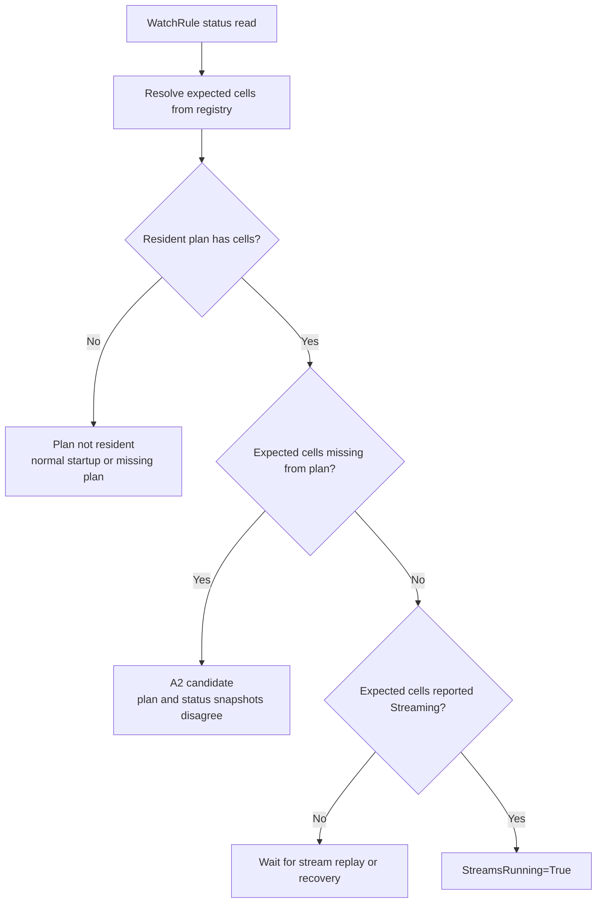
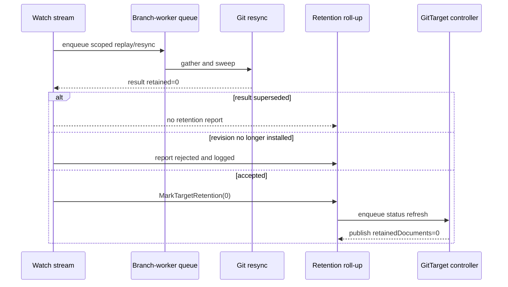

# Status convergence failures on the watch-plane rework

**Open.** Two reproducible failures on `feat/target-watch-cell-identity` (PR #315), both in
status the branch's own rework produces, plus an inventory of what is ambient and must not be
confused with them. Written so a fresh context can continue without re-deriving anything.

**Facts are separated from hypotheses.** Nothing below is a conclusion unless it says so. Move
this page to `docs/finished/` when both failures are named and fixed.

---

## 1. The short version

The data plane is not implicated in either failure. Files land in Git correctly and on time in
every case examined — what fails is the **status that describes them**. The failures are
intermittent in which spec catches them, but the same status mechanisms have now failed repeatedly
under CI load and once locally.

| # | Symptom | Seen | Verdict |
| --- | --- | --- | --- |
| **A** | A `WatchRule` never reaches `Ready=True` within 90s while its streams are demonstrably running | 3× (CI twice, local once) | **Plan/status ordering defect remains open; diagnostic over-classified startup until the latest fix** |
| **B** | `status.retention.retainedDocuments` stays at its pre-sweep value after `prune.mode` is widened, on a target whose files were swept | 2× (CI) | **Open, new; latest run still reproduced it** |
| C | Argo CD `selfHeal` commit count moves 3 → 5 during a `Consistently` | 1× (CI, never re-run) | Unclassified |
| D | Encryption-secret recreation spec times out | 1× (CI) | **Ambient, pre-existing** — see §5 |

A green run is not evidence against A or B. Both have produced a fully green CI run on the same
commit that failed locally.

### 1.1 Latest run

CI run `33103011476` on `9e4e3ce9` completed with Unit tests and `E2E (full-manager)` failed.
The unit failure was the known ambient encryption-secret recreation test. The full-manager leg
failed both the source-namespace wildcard readiness spec and the prune-mode retention spec. The
other five e2e legs passed.

The new diagnostics showed that the implementation was also logging many ordinary startup reads
as A2: expected cells existed, but the target had no resident plan or reported cells yet. That is
normal while the owner loop is applying the first plan, so the diagnostic itself needed a third
classification. This is now called `plan not resident`; A2 is reserved for a non-empty plan whose
cell set omits an expected cell.

---

## 2. Failure A — a WatchRule that never goes Ready

### 2.1 What was observed

Two independent reproductions of one signature: `Eventually` at
[`e2e_test.go:234`](../../test/e2e/e2e_test.go), the generic condition waiter, timing out after
**90s** with `Expected <string>: False to equal <string>: True`.

| Where | Commit | Rule |
| --- | --- | --- |
| CI, `E2E (full-manager)`, run `33082534675` attempt 1 | `5e054717` | `srcns-wildcard-rule` — "resolves a wildcard item to exactly the target's admitted set" |
| **Local**, `task test-e2e` | `c24844a1` | `signing-per-event-wr` — "Commit Signing … per-event commits verifiable locally and by Gitea" |

The condition is `Ready`, and in the source-namespace case `SourceNamespaceAuthorized` had
already passed — so authorization is fine, and it is readiness that never lands.

### 2.2 The decisive evidence

From the local run's controller log, for `signing-per-event-dest`:

```text
15:36:27  target watch plan reconciled  start:5  startCells:"configmaps in …, …"
15:36:27  target watch replay complete  gvr:"apps/v1, Resource=deployments"
15:36:27  target watch replay complete  gvr:"/v1, Resource=secrets"
15:36:27  target watch replay complete  gvr:"/v1, Resource=configmaps"
15:36:27  target watch replay complete  gvr:"networking.k8s.io/v1, …"
…
15:36:25–15:37:55  WatchRuleReconciler "Starting reconciliation" (repeatedly, throughout)
15:37:55  spec fails: Ready still False
```

All five cells opened and finished replay within **seconds**, and the rule reconciled
**continuously** for the following ninety seconds while still publishing `Ready=False`.

**Therefore A is not a missed notification.** The rule was being reconciled the whole time. The
roll-up is computing not-ready while the streams are running, which means the cells the rule
**expects** disagree with the cells the plan **opened**.

That is a mismatch, not a latency problem, and no amount of waiting fixes it. It resolves only
when something changes the plan or the registry.

### 2.3 Findings

Both live in [`stream_readiness.go`](../../internal/watch/stream_readiness.go), in code this
branch rewrote from GVR keys to cell keys.

**A1 — a zero expected set reads as not-running.**

```go
func (s StreamSummary) StreamsRunning() bool {
    return s.Total > 0 && s.Ready == s.Total
}
```

`Total == 0` reports **not running**, forever. `StreamSummaryForWatchRule` returns
`streamSummaryForTypes(nil, nil, nil)` when `m.RuleStore` is nil or `GetWatchRule` misses, and
`Total` is `len(byType)`, which is empty when `reg.Followable()` returns nothing at that instant.
A rule that resolves zero types is indistinguishable from one whose streams are all down. This is
a real status semantics gap for an empty-but-valid rule, but it does **not** explain this failure:
the failing target had five opened cells and the rule was repeatedly reconciled. The relevant
implementation is [`StreamsRunning`](../../internal/watch/stream_readiness.go), and the controller
maps its false result directly to `StreamsRunning=False` in
[`streamConditionStatus`](../../internal/controller/stream_status.go).

**A2 — expected and opened are computed from different snapshots. Identified as the likely failure class.**

The rule's expected set is rebuilt from `reg.Followable()` at **read** time, on the controller
worker, in [`StreamSummaryForWatchRule`](../../internal/watch/stream_readiness.go):

```go
reg := m.registryForGitTarget(gitDest)
m.refreshClusterTypeRegistry(m.cluster(m.clusterIDForGitTarget(gitDest)))
records := reg.Followable()
```

The plan's opened set came from the watched-type table at **plan** time, on the owner loop, in
[`replaceGitTargetWatches`](../../internal/watch/target_watch.go). A type that becomes followable
between the two makes the rule expect a cell that by construction does not exist yet. The e2e
suite installs CRDs concurrently across specs, which is exactly the condition that produces it.

The mechanism is **structurally reachable** — §2.6 reproduces it in a unit test — but that is not
the same as proving it caused either observed occurrence. The diagnostic in §2.4 is what settles
that on the next reproduction; until then treat A2 as the leading candidate, not the verdict.

This is not merely a missed notification. The WatchRule controller's own comment says the summary
read describes state from **before** the owner pass ([`watchrule_controller.go`](../../internal/controller/watchrule_controller.go)).
That makes a persistent false result possible whenever the registry moves after the plan snapshot
but before a controller status read. The existing wildcard and source-namespace tests prove the
cell-key and compiled-rule behavior, but do not cover this cross-snapshot interleaving.

The doc comment on `StreamSummaryForWatchRule` already warns about this class one level up
("a perfectly healthy wildcard rule would report permanently not-ready while its streams run —
the same class of bug the singular field already hit once"). A2 is that warning coming true at a
different seam.

### 2.4 How to settle it

Make the disagreement state itself. When a rule reports not-ready, log the **expected** cells
against the **reported** ones. That converts "Ready=False for 90s" into a line naming the
specific cell nobody opened, and distinguishes A1 (expected set empty) from A2 (expected set
contains a cell the plan never opened) on the first occurrence.

This is the same one-line-diagnostic-then-fix loop already applied to B in §3.4. The diagnostic
should be emitted from the summary path when the result is not running, and should include:

- the expected cell set derived from the compiled rule;
- the reported cell set currently present in `watchPlane().streams`; and
- the target watch plan's cell set, read without refreshing it.

That gives three-way evidence. Expected but absent from both reported and planned identifies a
registry/compiled-rule mismatch; expected and planned but not reported identifies a stream that
has not reached or has left `Streaming`; expected but not planned identifies the A2 race directly.

There is one ordinary fourth state: expected cells exist while both planned and reported sets are
empty. That is a pre-plan status read, not A2. It must be labelled `plan not resident` and treated
as startup convergence, otherwise normal bootstrap noise obscures the failure signal.



### 2.5 Fix plan for A

1. Add a deterministic unit test that freezes the plan table, advances the registry, and proves
  the current implementation can derive an expected cell that the frozen plan does not contain.
  Keep the existing cell-key tests as regression coverage for the version and namespace cases.
2. Make the status read use the same resident watched-type table as the owner plan, or publish the
  plan's expected cells as part of the immutable watch-plane snapshot. The first option is the
  smaller repair if the table already contains the compiled rule's resolved cells; the second
  gives all status readers one atomic source if that invariant cannot be maintained.
3. Add a test that changes discovery between plan and status reads and asserts that a running plan
  cannot report a cell outside its opened set. Then run the focused `internal/watch` and
  `internal/controller` tests before any e2e rerun.
4. Decide separately whether `0/0` should mean `StreamsRunning=True` for an admitted rule with no
  resolved types. That is not part of Failure A and should not be mixed into its fix.

### 2.6 Attempted fix, and why it was not landed

Step 2 of §2.5 — narrow the status read to the cells the plan opened — was implemented and
reverted. It works, and it is the wrong change to make on the evidence available.

**What was built.** A temporary reproduction test first: a wildcard rule whose compiled namespace
set had expanded to two namespaces while the plan had opened one. It failed against the then-current
implementation exactly as predicted, confirming the A2 mechanism is reachable and is not merely a
reading of the code. The permanent coverage now asserts the diagnostic and preserves the current
not-ready semantics.

Narrowing was then tried two ways — intersecting against the resident watched-type table, and
against the published readiness surface (which `resetTargetStreamStates` maintains as exactly the
declared cell set, making it the atomic in-snapshot answer §2.5 step 2 asks for). Both make the
reproduction pass.

**Why it was reverted.** Both break three pre-existing tests that encode the *opposite* invariant
deliberately:

| Test | What it asserts |
| --- | --- |
| `TestStreamSummaryForWatchRule_WildcardWithOnePendingNamespaceIsNotReady` | "one namespace of a wildcard still converging must hold the type back" |
| `TestStreamSummaryForWatchRule_WrongNamespaceKeyMisses` | a stream keyed on the wrong namespace is not found, and "the rule still expects its one type" |
| `TestStreamSummaryForWatchRule_LegacyRuleUnchanged` | a rule expects its type whether or not a plan is resident |

Those say: **an expected cell with no stream must hold the rule not-ready.** That is the defence
against a summary quietly ignoring a stream that was never opened, and narrowing removes it. A
rule would then report `Ready=True` while a cell it requires has no stream at all — the same
class of silent wrongness as the retention roll-up in Failure B, arrived at from the other side.

**What that reframes.** Reporting not-ready for an unopened cell is defensible and is the current
design. The defect is not that the rule says not-ready; it is that **the plan never opens the cell
and never converges**. `markInvalidatedTargets` compares each target's rendered plan fingerprint
across a re-projection and marks it dirty when it moves, so a compiled rule gaining a namespace
*should* produce a replan within one sweep. In both observed failures it did not, for ninety
seconds.

So the open question moves from the status side to the plan side: **why did the fingerprint diff
not mark the target dirty, or why did the replanned table not contain the cell the compiled rule
requires?** Answering that is what §2.4's diagnostic is for, and it must come before any change
to what a rule is allowed to expect. Landing the narrowing first would have converted a visible
failure into an invisible one.

The latest CI evidence does not yet answer that question. In the failed wildcard spec, the
diagnostic was absent for the exact rule name in the extracted log, while many neighboring rules
were reported during normal bootstrap. That makes the current instrumentation useful for future
runs, but it does not prove whether the failed rule missed a plan invalidation, read a stale
compiled rule, or failed before its diagnostic path ran.

---

## 3. Failure B — a retention count that stops advancing

### 3.1 What was observed

`Manager GitTarget prune policy` → "converges an existing orphan when `prune.mode` is widened,
without touching the WatchRule",
[`prune_mode_e2e_test.go:280`](../../test/e2e/prune_mode_e2e_test.go):

```text
Timed out after 30.000s.
a resync that retains nothing must drive the count back to zero, not leave it stale
Expected <int>: 1 to equal <int>: 0
```

Seen twice, both in CI `E2E (full-manager)`: run `33074976097` attempt 1 (`1eb958a0`) and run
`33082534675` attempt 2 (`5e054717`). Never reproduced locally across four full local suites.

### 3.2 The decisive evidence

Controller log for `prune-default-target`, run `33082534675` attempt 2:

| Time | Event |
| --- | --- |
| 15:07:11.466 | widen patch applied (`prune.mode: Always`) |
| **15:07:13** | plan reconciled — **`restart:1`** — the force replay fires correctly |
| 15:07:13 | replay complete; resync **handled and applied**, `resources:2`, `deleted:1` (only `prune-orphan`) |
| **15:07:15** | plan reconciled — **`keep:1`** |
| 15:07:15 | `Deleted` **both** orphans; `git resync commit created deleted:2` — **no `Handling resync request`, no `Resync request applied`** |
| 15:07:25 → :45 | `keep:1` only. No restart, no resync, for the remaining 30s |

The force replay works. The sweep works — both orphans left Git by 15:07:15, which is why the
file assertions passed.

**The report that is missing is the last one**, from the sweep that retained nothing. After it
the plan reports only `keep`, so no further resync runs and **nothing re-measures**. The count
sits stale until the steady requeue, minutes past any test budget.

Note the asymmetry: two resync commits, one handle/apply pair. The second commit also re-deletes
a file the first already removed, which means its gather predates the first apply.

### 3.3 Findings — root cause still unclassified

**B1 — the revision gate.** [`MarkTargetRetention`](../../internal/watch/retention_rollup.go)
drops any report whose revision the plan has moved past, or whose cell the plan no longer holds.
Dropping is correct; it is how a tail from a
replaced stream is kept out. The consequence is a published count that no longer describes the
mirror with nothing scheduled to correct it.

**B2 — the superseded path.** [`handleScopedResyncError`](../../internal/watch/event_router.go)
returns on `ErrResyncSuperseded` without marking acceptance, fidelity or retention, on the
reasoning that the replacement marks them
instead. That holds only if the replacement's own report is then accepted — which B1 can prevent.
The comment there says "nothing was missed", and for **writes** that is true; for **reports** it
is an assumption.

### 3.4 Diagnostics added (commit `c24844a1`)

Both paths were silent. Now:

- `MarkTargetRetention` logs every dropped report at Info, naming which reason applied and
  carrying both revisions:

  ```text
  retention report dropped; the published count is now stale until this cell is replanned
    gitDest=… cell=… reason="the reporting stream has been replaced"
    reportedRevision=1 installedRevision=2 retained=0
  ```

- The superseded-resync line is raised V(1) → Info, **marked `TEMPORARY`**. It is normally V(1)
  because coalescing is routine under exactly the load it protects against. Lower it once the
  cause is named.

Reading the next failure:

| Log | Mechanism |
| --- | --- |
| `retention report dropped` | **B1** — revision gate |
| `superseded … roll-up reports were skipped`, no drop line | **B2** — coalescing |
| Neither, count still stale | Both wrong; the report was never made, and the search moves to resync dispatch |

As of `c24844a1` neither line has fired: the local run that failed did so on **A**, not B. The
existing tests cover each behavior in isolation, but not the ordering that matters here: an old
report is superseded or rejected, the replacement stream runs, and the replacement's zero report
is either accepted or dropped.

### 3.5 Fix plan for B

1. Add a deterministic `EventRouter` test for two same-cell resyncs: supersede the first, drain
  both results, and assert that the replacement's zero retention report is accepted and enqueues
  the target status refresh.
2. Add a deterministic revision-order test: report a non-zero count, install a new revision,
  deliver the old report, then deliver the replacement's zero report. Assert that the final
  roll-up is reported, uses the replacement mode, and contains zero.
3. Preserve the revision gate and superseded semantics unless the tests show that a valid
  replacement report is being discarded. The stale old report must remain unable to overwrite a
  newer stream's result.
4. If either deterministic test fails, add the existing Info diagnostics to the assertion or
  capture them in the test so the repair targets dispatch, supersession, or revision acceptance
  rather than weakening stale-report protection.
5. Only after these tests pass, rerun the focused prune e2e spec. Treat a green full suite without
  the sequencing tests as insufficient evidence for B.

### 3.6 Status-reporting flow

Failure B has a different shape from A. A sweep can mutate Git successfully while its report is
lost before status publication. The report path is independent of the file-write path:



This explains why a file assertion can pass while the status assertion fails. The next B fix must
restore an accepted report or a deterministic retry, while preserving rejection of stale stream
revisions.

---

## 4. What is ruled out

- **The data plane.** In every failure examined, files landed in Git correctly and promptly. Both
  `waitForPruneFile` assertions passed in B; the sweep, the force replay, and the commit path are
  all working.
- **A deterministic break.** Four full local suites passed on the same code, and CI went fully
  green on `c24844a1`.
- **Cluster poisoning.** The failing legs ran 60+ specs to completion. A wedged k3d cluster fails
  at bring-up, not 64 specs deep.
- **The channel split as the cause of B.** It was a real design error and its fix stands
  (see §6), but B predates it: B's first occurrence is on `1eb958a0`, before the split.
- **Eviction as a mechanism.** A Go buffered channel drops the **arriving** value when full and
  never displaces a queued one. Where a shared buffer hurts, the correct description is
  *crowding out*: the expensive event arrives to find the buffer full of cheap ones. This matters
  because it says what to measure — buffer depth at arrival, not a displacement event.

---

## 5. Flake inventory — what is ambient, and must not be misattributed

Three separate branches have now been blamed for failures that reproduce on `main`. Check this
table before bisecting.

### 5.1 Ambient, confirmed

| Flake | Signature | Rate | Notes |
| --- | --- | --- | --- |
| **Encryption-secret recreation** | `secrets "recreated-sops-age-key" not found`, 45s, `gittarget_controller_test.go:1140` | ~1 in 11, **on branches and on main** | Unit tests. Root cause and the reason a Secret watch is forbidden are in [`TODO.md`](../TODO.md). Passed on a re-run of the identical code. |
| **Refused-GitTarget recovery** | `GitPathAccepted` projection racy both ways; next requeue up to 10 min | Reproduces locally and deterministically in the `unsupported-folder` refusal spec | Do not chase when the diff is test/docs-only. |
| **`target_watch` forbidden race** | `TestTargetWatchReplayAndStream_FallsBackWhenReplayWatchIsForbidden` | Only under `-race`; CI does not use it | Pre-existing shutdown race. |

### 5.2 Environmental, not code

| Symptom | Cause | Fix |
| --- | --- | --- |
| k3d wedged, Prometheus OOMKilled, nodes NotReady | Host OOM, or a run killed mid-flight | `task clean-cluster`. Do not debug the diff. |
| `prepare-e2e` hangs on `kubectl get ns` while docker looks healthy | k3s server shut itself down on a cloud-controller-manager RBAC race | Same. |
| e2e aborts at flux-operator install | Stale ghcr token (`DENIED` → `docker logout ghcr.io`) or a dead VS Code bridge (`exit status 255` → reload window) | Diagnose by the helper's exit code; 1 = healthy. |
| Fast `failed to get server groups` + zero ginkgo reports | apiserver-discovery flake at bring-up | `gh run rerun --failed`. Do not bisect. |

### 5.3 Traps when reading CI

- **`gh run rerun --failed` may not re-run everything you think.** On run `33082534675` attempt 2,
  only `full-manager` has a new `started_at`; every other job — bi-directional included — carries
  the attempt-1 timestamp and its result is **carried forward**. The UI shows both red. Always
  check `started_at` per attempt before concluding "it failed again".
- **`gh` refuses logs containing terminal escapes.** Use
  `gh api --allow-escape-sequences repos/:owner/:repo/actions/jobs/<id>/logs`. Job logs are not
  retrievable via `gh run view --log` until the whole run completes; the API works sooner.
- **Controller logs are captured in the e2e job log**, so a CI failure can be diagnosed without
  reproducing it. Read them before theorising.
- **`cancel-in-progress: true`** is set per PR. Any push cancels the run in flight.
- **`E2E_LABEL_FILTER` replaces the default filter** — re-AND the exclusions, or a zero-match
  filter skips both suite hooks and passes vacuously.
- **Local `task test-e2e` does not run the bi-directional corner.** It is opt-in:
  `task test-e2e-bi-directional`.

---

## 6. Run inventory

Branch `feat/target-watch-cell-identity`, 2026-08-27.

| Run | Commit | Result |
| --- | --- | --- |
| `33071092006` | `416f8596` | success |
| `33074976097` att.1 | `1eb958a0` | **full-manager: B** |
| `33074976097` att.2 | `1eb958a0` | success |
| `33079663111` | `26683846` | **Unit tests: D**; cancelled by a push |
| `33081182327` / `33082178520` | `58e19599` / `310c3b84` | cancelled by a push |
| `33082534675` att.1 | `5e054717` | **full-manager: A** (wildcard); **bi-directional: C** |
| `33082534675` att.2 | `5e054717` | **full-manager: B**; bi-directional **not re-run** |
| `33087980631` | `c24844a1` | **success — all six e2e legs, Lint, Unit tests** |

Local suites, same code:

| Run | Commit | Result |
| --- | --- | --- |
| `task test-e2e` ×2 | `5e054717` and earlier tree | 80/80 pass |
| `task test-e2e-bi-directional` | `5e054717` | 3/3 pass, including the spec that failed as C |
| `task test-e2e` | `c24844a1` | **75 pass, 1 fail — A** (`signing-per-event-wr`) |

Related change that landed and is **not** a suspect for either open failure: `14eeef46` split
stream-state transitions off the acceptance channel. Sharing one 256-slot drop-on-full buffer
between rare load-bearing events (acceptance, render-fidelity, retention — up to ~5 min of stale
status when dropped) and high-volume ones (stream transitions — ~10s) is a real design error, and
the fix stands on that reasoning. It does not explain B, which predates it.

---

## 7. Next steps

1. **Fix A using one plan snapshot** — add the interleaving test, align status expectations with
  the resident plan, and add the expected/reported/planned diagnostic.
2. **Add B's two sequencing tests** — supersession-to-zero and stale-revision-before-replacement-
  to-zero.
3. **Run focused unit tests**, then the focused A and B e2e specs. Do not treat a green full run
  as evidence unless the deterministic tests pass.
4. **Keep the B diagnostics until classified.** A dropped report may be correctly rejected while
  still leaving status stale; the fix must restore a report path without allowing stale writes.
5. **Classify C separately.** The Argo `selfHeal` failure has been seen once and never re-run, and
  passes locally. It may be a third instance of status settling later than the assertion samples,
  or ambient.
