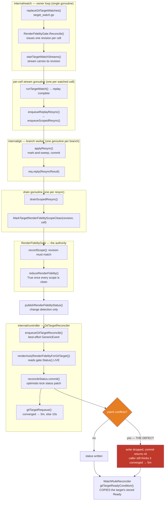
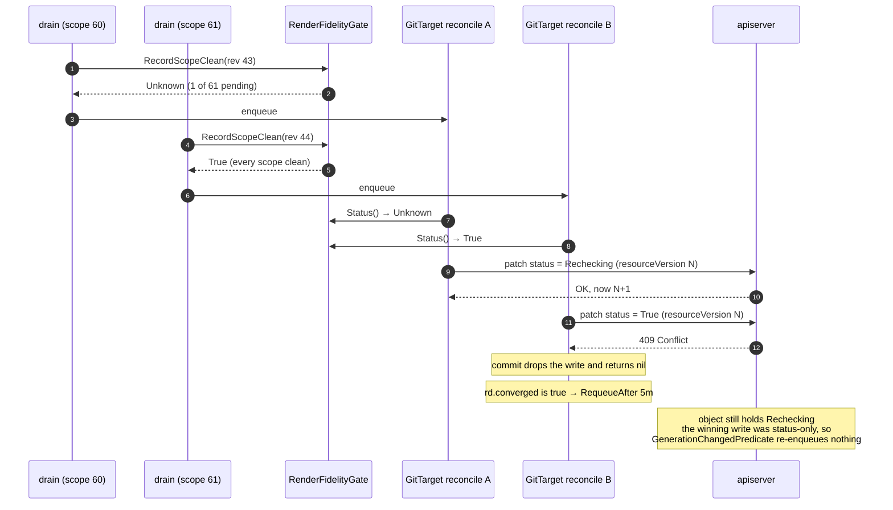

# Status convergence failures on the watch-plane rework

> **design**: Failure A solved, Failure B open. An investigation log rather than a proposal,
> written so a fresh context can continue without re-deriving anything.
> Index: [`../INDEX.md`](../INDEX.md)
> Related: [`target-watch-plan.md`](target-watch-plan.md),
> [`watch-manager-ownership.md`](watch-manager-ownership.md)

**Failure A solved; Failure B open.** Two reproducible failures on
`feat/target-watch-cell-identity` (PR #315), both in status the branch's own rework produces, plus
an inventory of what is ambient and must not be confused with them. Written so a fresh context can
continue without re-deriving anything.

**Facts are separated from hypotheses.** Nothing below is a conclusion unless it says so. Move
this page to `docs/finished/` when the fix has landed and held.

---

## 1. The short version

The data plane is not implicated in either failure. Files land in Git correctly and on time in
every case examined — what fails is the **status that describes them**.

**A is solved and fixed; B is open and probably the same defect.** Both are status roll-ups whose
result is produced correctly and then fails to reach the object that publishes it. A lost a
render-fidelity result — which pins the GitTarget at not-Ready, and through it **every WatchRule
pointing at it**. That is why A read as a rule-level streams failure for three reproductions
running. It never was one.

| # | Symptom | Seen | Verdict |
| --- | --- | --- | --- |
| **A** | A `WatchRule` never reaches `Ready=True` within 90s while its streams are demonstrably running | 6× (CI 4×, local 2×) | **SOLVED (§2).** A status write that loses an optimistic-lock race is discarded, the reconcile is told it succeeded, and nothing re-enqueues it — the winning write is status-only and every `For()` filters those |
| **B** | `status.retention.retainedDocuments` stays at its pre-sweep value after `prune.mode` is widened, on a target whose files were swept | 3× (CI twice, local once) | **Open**, narrowed to the roll-up's accept path; predicted to be the same defect as A, with a falsifier — see §3.5 |
| C | Argo CD `selfHeal` commit count moves 3 → 5 during a `Consistently` | 1× (CI, never re-run) | Unclassified, and probably unrelated |
| D | Encryption-secret recreation spec times out | 4× in one day | **Ambient, pre-existing** — and now the dominant CI blocker; see §5.1 |

**A green run is not evidence, and this page has been wrong twice for forgetting that.** Run
`33113743391` was green on all six e2e legs with a matching 80/80 local suite, on a commit where
both defects were fully intact; and a withdrawn fix (§3.3) passed the very spec it targeted, once,
while contradicting the logs. Require a mechanism, not a colour — including for A, whose fix rests
on the mechanism in §2.3 rather than on run `33127240827` being green.

### 1.1 What settled it

Commit `742344ee` made the e2e condition waiter print the condition's `reason` and `message`
instead of only `Expected False to equal True`. The very next failing run said:

```text
watchrule "srcns-wildcard-rule" condition Ready: status="False"
  reason="Rechecking"
  message="Waiting for every render scope to report under its current revision"
```

That is not a stream reason. A stream failure reads `0/1 streams running (configmaps)`. This
string is produced by [`reduceRenderFidelity`](../../internal/git/render_fidelity_gate.go), and it
reaches the WatchRule because `Ready` gates on `GitTargetReady` as an independent prerequisite —
see [`ruleReadiness`](../../internal/controller/stream_status.go), fed from the GitTarget's own
published Ready by [`gitTargetReadyCondition`](../../internal/controller/gittarget_dependency_status.go).

**One printed reason string replaced three rounds of log archaeology**, and every subsequent step
followed the same shape: a reproduction arrived, its evidence could not distinguish two branches,
and the fix was to make the component say what it had done. §2.8 tabulates all eight of those.

---

## 2. Failure A — SOLVED

A status write that loses an optimistic-lock race is discarded, the reconcile is told it succeeded,
and nothing brings it back. The object keeps the winner's older answer for a full steady interval —
five minutes for a GitTarget — and every WatchRule copies that into its own `Ready`.

Fixed in `8ad84416` (record the loss, shorten the requeue) and `fcdb3de9` (the same repair for all
five controllers). First fully green CI run: `33127240827`.

### 2.1 The defect

[`reconcileStatus.commit`](../../internal/controller/status.go) used to end a conflict like this:

```go
case apierrors.IsConflict(err):
    log.V(1).Info("status write skipped; object changed during reconcile", …)
    return nil          // the write is dropped AND the reconcile reports success
```

Dropping the **write** is right: by the time the conflict is known, the observation describes a
generation that is no longer current. Dropping the **reconcile** with it was not. The comment
justified that with *"The write that beat us enqueued us again"*, and that is **false by
construction in this package**: the winning write is a STATUS-only update, and every `For()` carries
`predicate.GenerationChangedPredicate` precisely to filter those out and break the
status-write-triggers-reconcile loop.

So the loser's observation vanished, its caller saw success and chose its CONVERGED cadence, and
nothing was left to correct the object.

### 2.2 How the code flows, and where it broke

Everything from the watch stream to the published condition, with the failure point marked. Each
box names the function that does the work.



Two properties of this picture did most of the damage during the investigation:

- **`renderAxis` reads the gate LIVE**, so the published condition is not a cache of the gate — any
  reconcile at all would have published the right answer. That is what proves the gate was never
  the problem.
- **A rule's `Ready` is a COPY.** `gitTargetReadyCondition` folds the GitTarget's *stored* condition
  into the rule as an independent prerequisite, so a rule reporting `Rechecking` says only what the
  target said when the rule last reconciled. Every earlier draft of this page read that message as
  a live view of the gate.

### 2.3 The race itself

Concurrency is what makes the conflict, and a scope-per-cell design supplies it: each scope report
enqueues the GitTarget, so a 61-scope target produced ~66 reconciles in four seconds.



Reconcile B computed the correct answer, could not write it, and was told it had succeeded — so it
chose the cadence for a healthy target. Nothing revisited the object for five minutes.

### 2.4 The evidence, in the order it eliminated things

Each row is a reproduction that removed a branch. None of it was reasoning ahead of measurement;
two hypotheses that were reasoned ahead of measurement are in §2.7, both withdrawn.

| Run | What it proved |
| --- | --- |
| `33103011476` | The condition reason is `Rechecking`, a RENDER-FIDELITY reason — A is not a streams failure, which is where three reproductions had been spent |
| `33116777679` | The new message names ONE scope of five and its revision, replacing log archaeology |
| `33118310453` | No refusal clause on the named scope ⇒ no report ever arrived under a wrong revision |
| local, `f277f074` | Zero `not applied`, zero superseded, no error path — every gate refusal branch excluded |
| `33120703394` | **The gate ACCEPTED the named scope and reached `True`.** The gate was never stuck |
| `33123538889` | Zero dropped-reconcile lines ⇒ the notification was delivered; and the GitTarget's OWN condition is stale, not just the rule's copy |
| local, `26cd36c3` | 66 publishes for one target; the LAST computes `True` with `requeue=5m0s`; object still `Unknown` 84s later |
| `33126282153` | The same signature independently on quickstart: 5 scopes, 12 publishes, same outcome |

The chain from watch stream to published condition is now instrumented at every hop, which is what
made the last step a lookup rather than a guess.

### 2.5 Why it looked intermittent

It was not intermittent. With the fix in place, one local e2e run logged `status write lost a race`
**74 times**, **55** of them on a reconcile that had computed a CONVERGED status and would therefore
have taken the five-minute cadence.

So A was happening dozens of times per run throughout, and only FAILED a spec when a stalled object
happened to be one an assertion was waiting on inside its 90-second budget. That is the whole of its
apparent randomness — and it is why an early draft of the fix comment calling the race "by
definition, rare" was wrong, and why eight focused low-load runs of the A-prone spec all passed.

### 2.6 The fix

`commit()` still drops the stale write; it now RECORDS that it did, and
`reconcileStatus.requeueAfter` shortens the caller's cadence to the settle interval when the write
was lost. Five controllers share `commit()` and the same `GenerationChangedPredicate`, so all five
ask it — fixing only the GitTarget would have left a WatchRule's own stale `Ready` for five
minutes, which is the value the failing assertion actually reads.

The conflict is deliberately NOT returned as an error: it is expected and frequent, and turning it
into a reconcile failure would distort every controller's error metrics for a race the system is
designed to lose sometimes.

### 2.7 Two hypotheses tried and withdrawn

Recorded so they are not re-derived.

**A1/A2 — cell-identity mismatch.** The theory was that the rule's expected cell set and the plan's
opened set were computed from different snapshots. A diagnostic was built for it, and a narrowing
fix written and reverted for breaking three tests that deliberately encode the opposite invariant.
The diagnostic then fired **zero times** for the rule that failed. It was instrumenting the wrong
subsystem: the cells never disagreed.

**A stale prune mode on the resync** (Failure B's first theory, §3.3) — implemented, passed the very
spec it targeted once, and reverted when the logs contradicted its mechanism.

Both cost real time, and both were withdrawn on evidence rather than quietly dropped. The lesson the
page keeps re-learning: **require a mechanism, not a colour.**

### 2.8 The pattern underneath all of it

Six components in this chain logged what they REJECTED and said nothing about what they ACCEPTED:

| Component | Before | Now |
| --- | --- | --- |
| the render-fidelity condition | a constant string naming nothing | names each pending scope and the revision it owes |
| `recordScope` revision mismatch | silent | recorded on the scope, surfaced in the condition |
| `recordScope` `!found` guards | silent | logged, naming cell and revision |
| zero-revision report | silent early return | logged as anomalous |
| fidelity accept path | silent | logged (this is what proved the gate converged) |
| retention roll-up accept | silent | Info on the one ambiguous shape, V(1) otherwise |
| `enqueueGitTargetReconcile` drop | silent | logged as load-bearing |
| **`commit()` lost write** | **`V(1)`, and reports success** | **Info, and the caller is told** |

`commit()` was the last and the fatal one. A component that reports its refusals and hides its
successes cannot be debugged from the outside, and every hour of this investigation that produced
progress was an hour spent closing one of these rather than theorising about the watch plane.

## 3. Failure B — named, with a local reproduction

Reproduced **locally** for the first time on `fc04b15b`, which is what settled it. The local
failure carries one field the CI reproductions did not print:

```text
a resync that retains nothing must drive the count back to zero, not leave it stale;
retainedDocuments=1 mode="OnEvent"
```

`mode` is the **pre-widening** value, and that is the whole diagnosis.

### 3.1 The timeline

For `prune-default-target`, all inside 32 seconds:

| Time | Event |
| --- | --- |
| 21:11:03 | `resync retained managed documents … retained:1 pruneMode:"OnEvent"` |
| 21:11:19 | widen patch applied (`prune.mode: Always`) |
| **21:11:25** | plan reconciled — **`restart:1`** — the force replay fires correctly |
| 21:11:25 | replay complete `count:2`; `Handling resync request` → **`Resync request applied`, `committed:true deleted:1`** |
| 21:11:27 → 21:11:57 | `keep:1` only. No restart, no further resync |

The force replay works. The resync applied and committed. And the roll-up never moved.

### 3.2 The proof, by elimination

`MarkTargetRetention` assigns `state.mode = mode.OrDefault()` **unconditionally** on its accepted
path. So a published `mode` still reading `OnEvent` admits only two explanations: no report
arrived, or the report itself carried `OnEvent`.

A report certainly arrived — the resync applied successfully, and `drainScopedResync` calls
`MarkTargetRetention` unconditionally on a successful result. No `retention report dropped` line
fired, so it was not refused.

And the second branch is excluded too: the resync logged `deleted:1`, which only a plan built under
`Always` can produce (§3.3), so the report cannot have carried `OnEvent`.

**Both explanations are excluded, so one of the observations is not what it appears.** That is the
honest state of B, and §3.4 says which link is unobserved. Do not close this by picking whichever
branch is convenient — the last attempt to do that is recorded in §3.3 as a withdrawn fix.

### 3.3 What is NOT the cause — a hypothesis tried and withdrawn

A first reading blamed a stale prune mode: the replay is forced by the owner (which learned the new
mode from the declare) while the branch worker re-derives the mode independently through its
**cached** client in [`resolveTargetMetadata`](../../internal/git/pending_writes.go), so a worker
cache lagging the patch could plan the forced replay under the mode it was forced to replace.

**The evidence refutes it.** `resyncPlanPolicy` maps `onEvent` and `never` alike to
`SweepRetainOrphans`, so a resync planned under anything but `always` emits **no managed drop at
all**. The widening resync logged `deleted:1`, and the spec's `waitForPruneFile(…, false)`
assertions for **both** orphans passed before the failing one. So that resync planned under
`Always`, swept correctly, and its `RetainedOrphans` should have been zero.

A fix that threaded the policy onto the `ResyncRequest` was written, passed the previously failing
spec once locally, and was **reverted**. One green run is not evidence for a mechanism the logs
contradict, and the change carried a real hazard in the safety-critical direction: narrowing the
mode deliberately does NOT force a replay (see `pruneModeRequiresReplay`), so a stream carrying a
snapshotted `always` would sweep under it on any later re-replay — after an operator had tightened
to `never` to stop exactly that. Tightening must stay the cheap, quiet direction.

### 3.4 Where B actually stands

Established:

- the force replay fires (`restart:1`);
- the resync applies, commits, and sweeps under `Always` (`deleted:1`, both files gone);
- `drainScopedResync` therefore reached its success branch, which calls `MarkTargetRetention`
  unconditionally;
- no `retention report dropped` line fired, so nothing was refused;
- and the published roll-up did not move — still `retained=1`, `mode="OnEvent"`.

Those cannot all be true at once, which means one of them is not what it appears. The roll-up is
the only unobserved link: `MarkTargetRetention` logs its refusals but says nothing when it accepts,
and `mutateWatchPlane` **discards the entire mutation** when `changed` is false, so an accepted
report and an absent one look identical from outside.

That is the next thing to instrument, and it is the same asymmetry that left A blind: the roll-up
reports what it rejects and stays silent about what it takes.

### 3.5 Prediction: B is probably the SAME defect as A

Stated before the evidence, so it can be wrong: **`8ad84416` may fix B as well.**

B publishes through the same path A did. `MarkTargetRetention` accepts the post-widening report,
publishes it into the watch-plane snapshot and enqueues a GitTarget reconcile; that reconcile
computes the new `status.retention` and writes it with the same `commit()` that silently discarded
A's write on a conflict — returning success, so the caller chose the converged five-minute requeue
with nothing scheduled to correct it.

That accounts for the one thing about B that never fit: §3.4 established that the report was
neither dropped, nor refused, nor superseded, and that the roll-up therefore appeared to be
working. It was. The loss was downstream of it, in the status write — exactly where A's was.

It also fits B's shape. The widening resync lands in the same burst of scope reports that produces
the concurrent reconciles a conflict needs, which is why B is load-dependent and why it has never
reproduced on a quiet target.

**How to falsify it:** B reproducing on a build that carries `8ad84416` refutes this outright, and
the search returns to §3.4 with the roll-up's accept diagnostics. B *not* reproducing is weaker
evidence — it is intermittent — so do not treat a few green runs as confirmation. What would
confirm it is a reproduction whose logs show the retention report accepted, a reconcile computing
the new count, and `writeLost=true` on that reconcile.

### 3.6 Why every earlier diagnostic missed it

The `resync retained managed documents` Info line is throttled to once per ten minutes per
`gitTarget@base` by `shouldLogRetention`, and its unthrottled twin is `V(1)`, which CI does not run.
The drop diagnostic could not fire because nothing was dropped. B1 and B2 as originally posed — the
revision gate and the superseded path — are both retired.

## 4. What was changed, and what is left

Nothing here was a new reporter bolted on. The system already computed every fact needed and
declined to publish it — so most of the work was making components say what they had done, and the
one behavioural fix (§4.9) is four lines.

### 4.1 Landed

| # | Change | Commit |
| --- | --- | --- |
| 1 | The render-fidelity condition names its pending scopes and the revision each owes, instead of a constant string | `c87db68d` |
| 2 | Deleted `explainNotRunning` / `notRunningHypothesis` / `cellNames` — ~70 lines aimed at the wrong subsystem — and lowered the supersession log | `17a57352` |
| 3 | The resync drain starts even when the enqueue was dropped, so a queue-full reply is read by the drain the contract promises will read it | `fc04b15b` |
| 4 | All four fidelity refusal branches name the cell, the revision and the gate's message | `32b75e02` |
| 5 | A refused revision is recorded on the scope and surfaced in the condition | `f1ae80a9` |
| 6 | The retention roll-up reports the one ambiguous acceptance (re-measured, same answer) at Info and the routine one at `V(1)` | `8ceb5902` |
| 7 | The fidelity accept path is logged — this is what proved the gate converges | `e3356796` |
| 8 | A stale fidelity snapshot can no longer overwrite a fresh one; a dropped reconcile request is logged | `43c4740b` |
| 9 | The GitTarget publishes what it published and how long it will wait | `26cd36c3` |
| 10 | **A lost status write is recorded and requeued promptly** — the fix | `8ad84416` |
| 11 | The same repair for all five controllers, via `reconcileStatus.requeueAfter` | `fcdb3de9` |
| 12 | The e2e assertion prints the referenced GitTarget's own conditions beside a failing rule's | `9b6142d4` |

Two invariants were deliberately NOT weakened along the way:

- **The revision gate still refuses stale reports.** A report from a replaced stream must not stand
  in for a fresh one; the repair was to make the refusal visible, not permissive.
- **`commit()` still drops the stale write.** By the time a conflict is known the observation is
  out of date. Only the silence was fixed.

### 4.2 Left

1. **Failure B.** Narrowed to the roll-up's accept path, with a falsifiable prediction that
   `8ad84416` already fixed it (§3.5). Needs a reproduction, not a theory — §3.3 records what
   guessing cost.
2. **The encryption-secret unit flake (§5.1).** It failed 3 of 4 CI runs on 2026-08-27 against a
   recorded rate of ~1 in 11. It is unrelated to this branch, and at that rate it alone keeps CI
   from going green, so it needs its own fix before this branch merges on a real green run rather
   than a re-run.
3. **Lower the TEMPORARY logs.** The fidelity accept line, the supersession line and the GitTarget
   publish line are at Info while B is open. Lower them when it closes; the condition-level
   diagnostics stay.

### 4.3 Reading a future reproduction

The chain in §2.2 is instrumented at every hop, so a reproduction should be read, not theorised.

| Signal | Meaning |
| --- | --- |
| `status write lost a race` on the target, then a stale condition | A's mechanism, recurring — check the requeue that followed it |
| `render scope result accepted` … `state:True`, condition still stale | the gate is fine; the failure is downstream in publication |
| `a render scope result was not applied` | the gate refused a report — read `reportedRevision` against the owed revision |
| `stream carries no revision` | the plan pass and the gate disagree about the cell |
| `a GitTarget reconcile request was dropped` | a load-bearing notification was crowded out |
| `retention report accepted but published nothing` | a re-measurement produced the count already published — the bug is upstream of the roll-up |
| `superseded by a newer resync` | the coalescing path skipped this scope's reports; check the replacement reported |
| none of the above, condition still stale | nothing reached the mark path — go to the drain and `enqueueReplayResync` |

And the trap that cost the most: **a rule's `Ready` is a copy of its GitTarget's.** The e2e
assertion now prints both, so never infer the target's state from the rule's message again.

## 5. Flake inventory — what is ambient, and must not be misattributed

Branches have been blamed for failures that reproduce on `main`. Check this table before
bisecting.

### 5.1 Ambient, confirmed

| Flake | Signature | Rate | Notes |
| --- | --- | --- | --- |
| **Refused-GitTarget recovery** | `GitPathAccepted` projection racy both ways; next requeue up to 10 min | Reproduces locally and deterministically in the `unsupported-folder` refusal spec | Do not chase when the diff is test/docs-only. |
| **`target_watch` forbidden race** | `TestTargetWatchReplayAndStream_FallsBackWhenReplayWatchIsForbidden` | Only under `-race`; CI does not use it | Pre-existing shutdown race. |

### 5.2 Environmental, not code

| Symptom | Cause | Fix |
| --- | --- | --- |
| k3d wedged, Prometheus OOMKilled, nodes NotReady | Host OOM, or a run killed mid-flight | `task clean-cluster`. Do not debug the diff. |
| `prepare-e2e` hangs on `kubectl get ns` while docker looks healthy | k3s server shut itself down on a cloud-controller-manager RBAC race | Same. |
| e2e aborts at flux-operator install | Stale ghcr token (`DENIED` → `docker logout ghcr.io`) or a dead VS Code bridge (`exit status 255` → reload window) | Diagnose by the helper's exit code; 1 = healthy. |
| Fast `failed to get server groups` + zero ginkgo reports | apiserver-discovery flake at bring-up | `gh run rerun --failed`. Do not bisect. |

### 5.3 Traps when reading CI

- **`gh run rerun --failed` may not re-run everything you think.** On run `33082534675` attempt 2,
  only `full-manager` has a new `started_at`; every other job — bi-directional included — carries
  the attempt-1 timestamp and its result is **carried forward**. The UI shows both red. Always
  check `started_at` per attempt before concluding "it failed again".
- **`gh` refuses logs containing terminal escapes.** Use
  `gh api --allow-escape-sequences repos/:owner/:repo/actions/jobs/<id>/logs`. Job logs are not
  retrievable via `gh run view --log` until the whole run completes; the API works sooner.
- **Controller logs are captured in the e2e job log**, so a CI failure can be diagnosed without
  reproducing it. Read them before theorising.
- **`cancel-in-progress: true`** is set per PR. Any push cancels the run in flight.
- **`E2E_LABEL_FILTER` replaces the default filter** — re-AND the exclusions, or a zero-match
  filter skips both suite hooks and passes vacuously.
- **Local `task test-e2e` does not run the bi-directional corner.** It is opt-in:
  `task test-e2e-bi-directional`.

---

## 6. Run inventory

Branch `feat/target-watch-cell-identity`, 2026-08-27.

| Run | Commit | Result |
| --- | --- | --- |
| `33071092006` | `416f8596` | success |
| `33074976097` att.1 | `1eb958a0` | **full-manager: B** |
| `33074976097` att.2 | `1eb958a0` | success |
| `33079663111` | `26683846` | **Unit tests: D**; cancelled by a push |
| `33081182327` / `33082178520` | `58e19599` / `310c3b84` | cancelled by a push |
| `33082534675` att.1 | `5e054717` | **full-manager: A** (wildcard); **bi-directional: C** |
| `33082534675` att.2 | `5e054717` | **full-manager: B**; bi-directional **not re-run** |
| `33087980631` | `c24844a1` | **success — all six e2e legs, Lint, Unit tests** |
| `33100142551` | — | failure |
| `33103011476` | `9e4e3ce9` | **full-manager: A and B**; Unit tests: D. The run that named the cause — its waiter printed `reason="Rechecking"` |
| `33113743391` | `773f6cc0` | **success — all six e2e legs, Lint, Unit tests.** Proves nothing; the failing path was untouched |
| `33116777679` | `fc04b15b` | **quickstart-install: A**, and the new condition message named the stuck scope outright; Unit tests: D (ambient). Remaining legs cancelled by a push |
| `33118310453` | `cf08e467` | Lint, Unit, quickstart-install, bi-directional, source-cluster, image-refresh green |
| `33120703394` | `e3356796` | **full-manager: A**, and the accept log proved the gate reaches True — the run that solved A's shape; **quickstart-install: A** independently |
| `33123538889` | `43c4740b` | **full-manager: A**; drop log fired 0×, excluding the dropped-enqueue candidate |
| `33126282153` | `26cd36c3` | **quickstart-install: A** with the publish log — 12 publishes, last computing True/5m, object stale 100s later |
| `33127240827` | `a339d783` | **success — all six e2e legs, Lint, Unit tests**, on the A fix |

Local suites, same code:

| Run | Commit | Result |
| --- | --- | --- |
| `task test-e2e` ×2 | `5e054717` and earlier tree | 80/80 pass |
| `task test-e2e-bi-directional` | `5e054717` | 3/3 pass, including the spec that failed as C |
| `task test-e2e` | `c24844a1` | **75 pass, 1 fail — A** (`signing-per-event-wr`) |
| `task test-e2e` | `773f6cc0` | 80/80 pass |
| `task test-e2e` | `fc04b15b` | **79 pass, 1 fail — B**, the first local reproduction of B |
| `task test-e2e` | `cf08e467` | 80/80 pass — on the since-reverted fix, so it validates nothing |
| `task test-e2e` | `f277f074` | **79 pass, 1 fail — A**, fully instrumented; the run that eliminated every gate branch |
| `task test-e2e` | `26cd36c3` | **A reproduced** on a 61-scope target: 66 publishes, the last computing True/5m |
| `task test-e2e` | `a339d783` | 80/80 pass on the fix, with 74 lost-write races handled at 10s |
| focused `--focus='WatchRule source namespace'` ×8 | `f277f074` | 8/8 pass — A needs concurrent load, not this spec alone |

Related change that landed and is **not** a suspect for either open failure: `14eeef46` split
stream-state transitions off the acceptance channel. Sharing one 256-slot drop-on-full buffer
between rare load-bearing events (acceptance, render-fidelity, retention — up to ~5 min of stale
status when dropped) and high-volume ones (stream transitions — ~10s) is a real design error, and
the fix stands on that reasoning. It does not explain B, which predates it.
