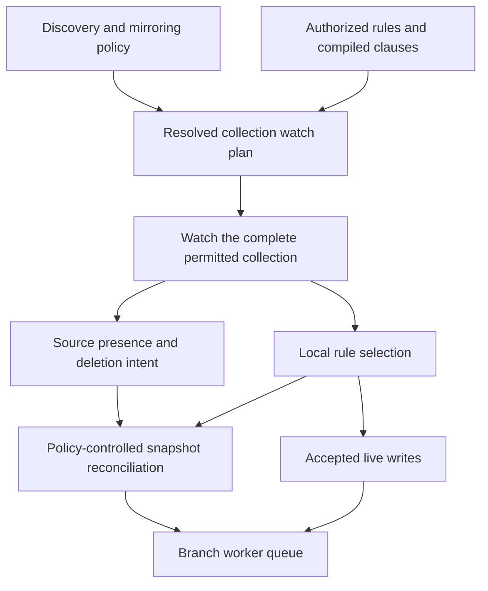

# Resource collections and watches: simplifying the operator model

Review and proposal based on repository commit `65233aaf`, inspected on 2026-09-28.
The definitions now adopt Kubernetes terminology. Internal type changes, object selectors, and
the design decisions below remain proposed; source references describe current behavior.

Use **resource collection** for the observed object set and **watch** for its observation lifecycle.
Keep compiled rule selection consistent through live processing and Git reconciliation. Include
[issue #146: per-rule objectSelector](https://github.com/ConfigButler/gitops-reverser/issues/146)
before fixing the replacement key and plan shape. Label selection is absent from the current API.

This proposal builds on [Definitions](../definitions.md), [Architecture](../architecture.md),
and [Configuration](../configuration.md). Kubernetes behavior and upstream evidence live in
[Kubernetes watch options](../facts/kubernetes-watch-options.md); this document owns the
operator-specific interpretation and design choices.

## Design priorities

Kubernetes terminology and API semantics are the design target. Prefer its existing resource
identity types, label selectors, list/watch behavior, and controller conventions wherever they
express the required behavior. Project-specific concepts need a responsibility that those
primitives do not already cover.

The project is pre-1.0, and a larger refactor is acceptable. Judge alternatives by the clarity
and complexity of the resulting model, including its failure and recovery paths. Internal
types, controller boundaries, API fields, and observability names can change together when
that produces a more coherent design. Record migration and versioning requirements as part
of the change; preserving the existing structure is not a design goal.

Correctness, source authorization, and explicit selection and pruning semantics remain
requirements. Existing types and tests are evidence about those requirements, not a mandate
to retain every current abstraction or behavior. `CollectionKey` below is a candidate whose
need and shape must be tested against the resolved selection model.

## Kubernetes facts this proposal relies on

| Reference | Design question it informs |
|---|---|
| [Watch endpoints and namespace scope](../facts/kubernetes-watch-options.md#what-one-watch-covers) | What belongs in a collection identity? |
| [Label selectors](../facts/kubernetes-watch-options.md#label-selection) | How should rule selection compile and combine? |
| [Membership event semantics](../facts/kubernetes-watch-options.md#event-types-describe-membership-in-the-selected-collection) | What do entry and exit mean for operations, attribution, and pruning? |
| [Initial state and recovery](../facts/kubernetes-watch-options.md#initial-state-progress-and-recovery) | When is a new snapshot required, and what does a cursor prove? |
| [Selectors and authorization](../facts/kubernetes-watch-options.md#selectors-and-authorization) | When is broader observation authorized? |
| [Other capabilities and limits](../facts/kubernetes-watch-options.md#other-capabilities-and-limits) | What work remains in the operator even with server-side filtering? |

Those references hold the selector syntax, request options, and event-transition details.
The proposal below uses them without repeating the protocol explanation.

## The architectural story

The proposed default observes a complete group/resource/namespace collection and evaluates
object selectors locally. Use Kubernetes resource identities and `metav1.LabelSelector`, with
one resolved watch plan carrying complete rule clauses. Broad observation preserves evidence
about objects that exist but are not selected; only selected desired content is written.



This is the proposed selector design. Current watches already observe broadly, but do not carry
object-selector clauses or separate presence evidence from selected desired state. Source
readiness, queue acceptance, and Git publication remain distinct observations.

## Model selection independently of watch connections

[`CellKey`](../../internal/types/cell.go) contains `Group`, `Resource`, and `Namespace`; `Matches`
tests resource membership. It carries no connection or runtime state. Snapshot cleanup,
render-fidelity results, and queued-event provenance all use this boundary while watches can be
blocked, disconnected, or replaced. Naming every use a stream would obscure that responsibility.

`CollectionKey` would identify the version-independent observed collection. The containing
`GitTarget` supplies target and source-cluster context. Local selectors belong in its plan
specification; they do not require separate transport keys. A selected subset remains a distinct
write-policy boundary even when several rules share that observation.

Three distinctions must remain explicit in the resulting model:

- **Collection identity and served version.** `targetWatchStreams` chooses one served version
  per collection and combines operations; `cellSpec` stores that version separately. A version
  change restarts the watch without changing membership. `ResyncScope` likewise separates
  `CellKey` from `Version`. A requested served version is not necessarily the storage version.
- **Resource scope and namespace selection.** An empty namespace selects all namespaces for a
  namespaced type; discovery distinguishes this from a cluster-scoped type. `WatchRule` selects
  namespaced resources, including `sourceNamespace: "*"`; `ClusterWatchRule` selects
  cluster-scoped resources. See [source namespace configuration](../configuration.md#watching-a-different-source-namespace).
- **Eligibility and API capability.** [`Evaluate`](../../internal/typeset/funnel.go) checks
  discovery trust, verbs, origin, sensitivity, and policy. Calling its verdict `watchable` would
  conceal mirroring restrictions beyond Kubernetes' support for watches.

The earlier reason for `cell` was that `type` and `scope` already had meanings. **Resource
collection** avoids both overloads and is Kubernetes vocabulary. Reserve resource type for
`GroupResource`, resource scope for namespaced versus cluster-scoped, and namespace selection
for the collection's namespace extent. `WatchRule` names a configuration kind; **watch** names
the API activity. Using each kind's full name avoids the proposed naming collision without
inventing another word for Kubernetes watches.

## Suggested vocabulary

| Current wording or identifier | Candidate | Meaning |
|---|---|---|
| Cell / `CellKey` | Resource collection / `CollectionKey` | Observed object set, independent of locally selected subsets |
| `CellKeyFor`, `SourceCell` | `CollectionKeyFor`, `SourceCollection` | Construction and provenance of that boundary |
| `cellSpec` | `watchSpec` | Served version and compiled selection policy |
| Claimed | Selected by a rule | User demand |
| Followable | Eligible for mirroring | Discovery and product-policy verdict |
| Stream, for running activity | Watch | Managed observation lifecycle |
| Stream, for delivered data | Watch stream | Events from a connection |
| `GitTargetEventStream` | `TargetEventForwarder` | Forwarding adapter with no watch connection or event buffer |
| Replay, for startup | Initialization / initial events | Establishing current state |
| Cursor | Resume `resourceVersion` | Position used for reconnecting |
| Resync, for Git work | Snapshot reconciliation | Applying the observed collection to managed documents |

The definitions contract now accepts this prose vocabulary; implementation names are migration
candidates. Public fields, conditions, metrics, and enum values can follow the same redesign,
with their migration impact recorded.
Client-go informer resync has different semantics from this project's snapshot-carrying
`ResyncRequest`; the proposed wording makes that distinction explicit.

## Current implementation and source references

| Responsibility | Source and behavior |
|---|---|
| Discovery and eligibility | [API resource catalog](../../internal/watch/api_resource_catalog.go) normalizes discovery; [type registry](../../internal/typeset/registry.go) tracks eligibility and uncertain disappearance. |
| Rule compilation and resolution | [Rule store](../../internal/rulestore/store.go), [resolver](../../internal/watch/watched_type_resolver.go), and [watched-type table](../../internal/watch/watched_type_table.go) resolve target coverage and combine namespace operations. |
| Watch planning | [`targetWatchStreams`](../../internal/watch/target_watch.go) chooses versions; [`diffTargetWatchPlans`](../../internal/watch/target_watch_plan.go) classifies keep, start, restart, and stop. |
| Initialization and resume | `targetWatchReplayAndStream` requests initial events, `NotOlderThan`, and bookmarks; `targetWatchResumeAndStream` uses a stored RV and bookmarks. |
| Compatibility fallback | `targetWatchListAndStream` buffers an opened watch before LIST, applies the snapshot, then keeps events newer than its watermark. |
| Endpoint and event processing | Callers of `openTargetWatch` and `openTargetList` supply no label or field selectors. `routeLiveTargetWatchEvent` applies operation policy, skips unchanged sanitized updates, resolves attribution, and routes events. |
| Event forwarding | [`GitTargetEventStream`](../../internal/reconcile/git_target_event_stream.go) enqueues live events on the branch worker. |
| Snapshot application | [`ResyncScope`](../../internal/git/types.go) and [resync flush](../../internal/git/resync_flush.go) bound policy-controlled writes and cleanup. |
| Render evidence | [Render-fidelity gate](../../internal/git/render_fidelity_gate.go) associates results with the collection and watch revision. |

Function names without a separate link above are in `target_watch.go`.

## Include object selection before fixing the model

Issue #146 requests `metav1.LabelSelector` on each rule item. Its Cozystack example selects
Secrets labeled `internal.cozystack.io/tenantresource=true`. A label-defined application can use
several selected resource types; no additional resource-group kind is needed.

The issue sketch predates the watch-first architecture. Translate its audit filtering,
`namespaceSelector`, `v1alpha1`, and namespaced `ClusterWatchRule` examples to the current model:
watch-supplied object state, optional audit attribution, and `WatchRule.sourceNamespace`.

### Proposed API contract

Add optional `objectSelector` to both
[`ResourceRule`](../../api/v1alpha3/watchrule_types.go) and
[`ClusterResourceRule`](../../api/v1alpha3/clusterwatchrule_types.go), evaluated on source object
labels before sanitization. This example is proposed and is not accepted by the current CRD:

```yaml
apiVersion: configbutler.ai/v1alpha3
kind: WatchRule
metadata:
  name: tenant-handoff-secrets
  namespace: tenant-a
spec:
  gitTargetRef:
    name: tenant-config
  rules:
    - apiGroups: [""]
      apiVersions: ["v1"]
      resources: ["secrets"]
      operations: [CREATE, UPDATE, DELETE]
      objectSelector:
        matchLabels:
          internal.cozystack.io/tenantresource: "true"
```

Use the standard selector semantics linked above. Define omitted and empty selectors as matching
all otherwise permitted objects, normalizing the helper's nil behavior explicitly. Reject invalid
selectors; a valid empty result initializes successfully. Existing authorization, mirroring
eligibility, and Secret encryption requirements remain applicable.

### Preserve complete selection clauses

Within a rule, type, namespace, and object selection must all match. Across rules, accept an
event if any complete clause accepts it. For example:

| Selector | Operations |
|---|---|
| `team=a` | `UPDATE` |
| `team=b` | `DELETE` |

Independent unions would wrongly permit updates to `team=b` and deletes of `team=a`. Preserve
and compile each `(object selector, operation filter)` pair. A broad selector on one rule must
not erase another rule's operation restrictions.

`foldTargetReplayEvent` and the LIST fallback construct desired state separately from live
operation filtering. Apply object selection to both snapshot paths as well as live events;
keep presence evidence for unselected objects instead of dropping them from all snapshot inputs.

### Decision: observe broadly and filter locally

Use one raw watch for each resolved base collection, with local matching of complete clauses.
This choice exposes label changes as ordinary object updates and keeps a complete inventory
for snapshot reconciliation. It also permits a direct comparison with standard client-go
reflectors or informers; adopting Kubernetes terms does not require server-side label filtering.

```text
observation key:  group/resource + namespace selection, within one GitTarget/source context
watch spec:       chosen served version + canonical namespace/selector/operation clauses
snapshot input:   complete source presence + selected desired objects + eligible prune candidates
runtime state:   watch cancellation + observation progress + selection/render revision
```

Native RBAC does not provide label-based object permissions, so the extra cost on such sources
is traffic, decoding, and state for unselected objects. However, authorization webhooks can
inspect selectors, as the facts explain. This design requires permission to observe the broad
collection; a denied request remains an observation failure. It does not silently downgrade
a selector-restricted source to an apparently complete empty snapshot.

Server-side filtering remains a later optimization, with equivalent exit and absence evidence
required first. A single-clause collection still has those requirements. Metadata-only watches
omit manifest content, and sharding does not express the selected label groups.

### Compile clauses into one resolved plan

`targetWatchStreams` currently unions `OperationSet` values, and `operationSpec` renders only
operations. Replace this flattening with complete clauses carried from the rule store through
resolution and the watch plan. Include selectors, operations, and namespace restrictions in
canonical comparison; normalize requirement/value ordering and clause order.

A semantic clause edit restarts initialization under a new selection/render revision, even if
its observation key stays the same. This observes unchanged objects that newly match. Preserve
unaffected watches and avoid restarts for mechanical reorderings. These are central change
points, but compilation, snapshot payloads, matching, and write-side cleanup also change.

The broader refactor can remove intermediate table/spec conversions and forwarding adapters
where their responsibilities collapse. Neither `CellKey` nor `ResyncScope` must retain its
current shape merely to make #146 a small patch. Preserve authorization and operation clauses
when considering shared all-namespace and named-namespace observation; local label filtering
alone does not remove that existing overlap.

### Decision: retain deselected content and preserve deletion intent

Operation filters describe source lifecycle changes inferred from unfiltered watches, including
updates made by PATCH. They cannot promise exact audit verbs. In particular, the live entry point
is `operationForLiveTargetWatchEvent`: an object carrying `deletionTimestamp` becomes `DELETE`
before physical removal. [`desiredFromObject`](../../internal/watch/scope_resolve.go) excludes
terminating objects from snapshot desired state for the same reason.

Adopt these policies for #146:

- Label entry is an `UPDATE` on an existing object, subject to the matching clause's operations;
  initialization can still establish its current desired state.
- Label exit or selector removal retains the last mirrored document. It does not synthesize a
  delete or overwrite it with excluded content. Another matching rule can continue managing it.
- A source deletion or deletion intent remains eligible for removal under the applicable rule
  and pruning policy. Determine that before treating an event as ordinary label deselection;
  preserve the membership evidence needed to apply the correct clause.
- `Always` may infer cleanup for eligible managed objects absent from a complete observation,
  including logically absent terminating objects. A present, non-terminating, unselected object
  is retained. `Never` and `OnEvent` do not infer deletion from snapshot absence.

Retained manifests can restore a removed label on a later GitOps apply. That is a documented
consequence of retaining content. No cleanup is inferred outside active authorized observation,
and withdrawal of a rule must not turn its previously covered collection into an empty snapshot.

### Separate source presence from selected desired state

Broad observation supplies the evidence, but the existing writer cannot yet use it this way.
`ResyncScope.Matches` tests resource identity, and `resyncPlan` interprets absence from `Desired`
as potential deletion. Passing only selected objects would still turn present-but-unselected
objects into prune candidates. Passing every object as desired would instead write excluded
content. Extend the snapshot/planner contract to distinguish those two inputs.

Pruning also needs explicit evidence of which documents the target manages under this selection.
A document must not become eligible merely because its group/resource/namespace matches; that
would expose never-selected documents to cleanup. Preserve or reconstruct membership evidence
across selector edits and restart, and protect objects still covered by another rule. Unknown
membership or incomplete observation cannot authorize deletion. See
[deletion policy](../configuration.md#deletion-policy-specprunemode).

### Selection revisions still matter for recovery

Local filtering lets the transport cursor remain keyed by the observed base collection. The
current Redis implementation takes a GVR argument but persists target UID, group/resource, and
namespace; [`watchCursorKey`](../../internal/queue/redis_store.go) deliberately drops the version.
There is no need for one cursor per local selector. Selection changes still need fresh desired
state and render evidence, so canonical clause changes must invalidate initialization results.

The only production cursor lookup consumer found is `targetWatchReplayAndStream`. Its first
attempt ignores the returned cursor for resume; later loop attempts may use it. Persistent
cursors therefore provide no normal warm-start shortcut. They can still be consulted after a
failed first initialization, before a fresh cursor has replaced the old value. Test that path
against render readiness before replacing the store with an in-memory cursor. Cursor durability
also does not make accepted Git writes durable. Redis has other attribution and coordination
roles, so simplifying this store does not by itself remove Redis from every deployment.

## Ordering and attribution belong to the implementation contract

The [attribution-grace explainer](../spec/watch-event-ordering-and-attribution-grace.md) owns the
current call sequence and its limits. Inline author resolution preserves enqueue order within
one watch. The branch worker serializes arrivals but does not merge overlapping watches by RV;
all-namespace and named-namespace watches can both deliver one object.

The [target watch plan](../design/target-watch-plan.md#where-the-bound-is-thin) already records
that gap. Architecture now states the per-watch boundary. Label selection extends the overlap
question, so sharing or stale-event handling needs its own guarantee and tests. This review
identifies the missing guarantee without claiming a new runtime reproduction.

The spec now retains the ordered-release requirement for any concurrent attribution work.
The definitions and architecture also distinguish collection keys from target context and
first-attempt initialization from later cursor resume.

## Follow-up implementation checks

- `streamStatusesByType` folds collection state into resource-type counts, while the open-watch
  gauge counts connections. Preserve explicit units when redesigning status.
- Source comments on `NamespaceOps`, `ClusterWide`, and `WatchScopes` still describe older rule
  semantics; update them with the code refactor. The architecture now distinguishes source
  namespace selection from control-cluster provider access.
- Verify cursor failure/reconnect paths and the in-memory write queue before promising startup
  resume or durable delivery; see [write-queue durability](../architecture.md#durability-of-the-write-queue-planned).

## Simplification and implementation sequence

1. Define the target model using Kubernetes concepts and resolve issue #146's membership,
   operation, attribution, retention, and recovery contract. Identify the responsibilities that
   still require project-specific types.
2. Prototype the broad-observation plan with complete clauses and separate snapshot inputs.
   Compare native client-go building blocks with custom watch management on correctness,
   recovery, state, and memory costs. Include overlapping-source ordering in that comparison.
3. Inventory status, metrics, version resolution, and manifest-analysis consumers. Replace
   redundant representations and adapters as part of the coherent refactor; a preliminary
   mechanical rename is optional.
4. Apply the accepted model across snapshot and live paths, API and status naming, and
   documentation. Record intentional behavior changes and their migration requirements.
5. Validate the required invariants and selector scenarios below. Make ordering and restart
   durability guarantees explicit, including any remaining gaps.

The current source path uses dynamic watches and temporary snapshots; control-plane informers
serve a different purpose. Existing library choices do not constrain the target design.
Broader changes, including CRDs or deployment components, should each explain the responsibility
they simplify and how the resulting model meets its correctness and authorization requirements.

## Invariants and acceptance tests

| Invariant | Existing test reference |
|---|---|
| Two served versions resolve to one collection watch | `TestTargetWatchStreams_OneStreamPerCellAcrossServedVersions` in [target watch tests](../../internal/watch/target_watch_test.go) |
| All-namespace and named-namespace selections retain their filters | `TestTargetWatchSpecs_NamedAndClusterWideScopesStayDistinctStreams` in the same file |
| Unchanged watches survive unrelated rule changes | `TestReplaceGitTargetWatches_AddingARuleStartsOnlyTheNewCell` in the same file |
| Replacement initializes before live delivery | `TestReplaceGitTargetWatches_ReusesUnchangedSetAndRestartsOnSpecChange` in the same file |
| Served-version changes preserve collection identity | `TestTargetWatchPlanFor_AServedVersionBumpKeepsTheSameCell` in [plan tests](../../internal/watch/target_watch_plan_test.go) |
| Cleanup preserves sibling namespaces | `TestResync_NamespaceScopedSweepLeavesSiblingNamespacesAlone` in [scope tests](../../internal/git/resync_scope_test.go) |
| Pending collections hold back type readiness | `TestStreamSummaryForWatchRule_OnePendingNamespaceHoldsTheTypeBack` in [readiness tests](../../internal/watch/source_namespace_stream_summary_test.go) |

Also preserve revision checks, observation failure versus authoritative absence, and
[source provenance](../../internal/git/source_cell.go): queued provenance is diagnostic, and
cancellation occurs at the producer rather than by filtering queued writes against the latest plan.

Issue #146 needs additional tests for:

- Omitted, empty, invalid, and zero-match selectors; consistent initial-event, LIST, and live selection.
- Label entry and exit under the agreed policies, including `deletionTimestamp` on a membership change.
- Snapshots retain present unselected objects without writing their content, protect never-selected
  documents, and handle terminating objects consistently with live deletion intent.
- Overlapping clauses, preservation of operation filters, and retention while another rule selects.
- Selector edits include unchanged existing objects and invalidate old render evidence; equivalent
  clause reorderings keep watches running. Shared base-collection cursors remain independent of labels.
- Recovery of membership after restart, failed first initialization with a stored cursor, source
  authorization including rejected broad watches, and Secret encryption constraints.

These are proposed implementation checks. This documentation update does not implement selectors
or establish their runtime correctness. Run `task lint-docs` and Vale for documentation changes;
follow [AGENTS.md](../../AGENTS.md) for later code and watch-plumbing validation.

Keep this working proposal local as requested. When implementation is ready, put the accepted
argument and behavior changes in the #146 PR description or a tracked design record so reviewers
can assess them without access to this file.
