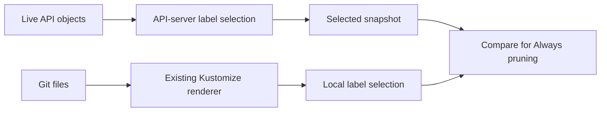

# Label selection for watch rules

> **accepted direction, not built**: server-side selection and membership semantics are settled.
> Kustomize support and rule-edit retention below are proposed refinements awaiting a choice.
> Design for
> [issue #146](https://github.com/ConfigButler/gitops-reverser/issues/146).
> Index: [`../INDEX.md`](../INDEX.md)
> Date: 2026-09-28, checked against `main` at `b43ecf61`.
> Related: [Kubernetes watch options](../facts/kubernetes-watch-options.md),
> [Definitions](../definitions.md),
> [Watch event ordering](../spec/watch-event-ordering-and-attribution-grace.md),
> [Target watch plan](target-watch-plan.md)

Issue #146 asks for a label selector on each watch rule, so that a GitTarget can mirror, for
example, only the Secrets labeled `internal.cozystack.io/tenantresource=true`.

**The kube-apiserver does the selecting.** A rule's selector becomes the `labelSelector` of
the list and watch requests the operator already makes. One resource collection is exactly one
Kubernetes list/watch request: group, resource, namespace, and label selector. The operator
evaluates no label logic on the event path, and it adopts the Kubernetes membership semantics
as they are rather than modeling membership itself.

Snapshot pruning under `Always` introduces a separate Git-side selection decision. Server-side
filtering does not establish which Git documents a snapshot may remove; the
[Kustomize support boundary](#kustomize-support-boundary) explains that distinction and its limits.

The cost is more watches: one per distinct selector. That cost is accepted.

## The API

Add an optional `objectSelector` of type `metav1.LabelSelector` to
[`ResourceRule`](../../api/v1alpha3/watchrule_types.go) and
[`ClusterResourceRule`](../../api/v1alpha3/clusterwatchrule_types.go):

```yaml
apiVersion: configbutler.ai/v1alpha3
kind: WatchRule
metadata:
  name: tenant-handoff-secrets
  namespace: tenant-a
spec:
  gitTargetRef:
    name: tenant-config
  rules:
    - apiGroups: [""]
      resources: ["secrets"]
      objectSelector:
        matchLabels:
          internal.cozystack.io/tenantresource: "true"
```

The name and type follow the admission webhook `objectSelector`, which sits beside the same
`apiGroups`/`resources`/`operations` rule shape that `ResourceRule` already copies. The
matching semantics are those of list and watch, described below; admission's old-or-new match
does not apply to a watch.

The structured type follows the Kubernetes convention for a selector in an API object.
`metav1.LabelSelectorAsSelector` validates and compiles it. The compiler then normalizes the
requirements as described below and sends the resulting query string to the API server.

Validation, at admission and again at compile time:

- **Omitted and `{}` both select everything.** `LabelSelectorAsSelector` maps nil to "nothing",
  so the compiler normalizes an omitted selector explicitly rather than inheriting that.
- **An unparsable selector refuses the rule.** A valid selector that matches no objects is not an
  error: its watch initializes to an empty collection.
- **A selector may not use a label that sanitize strips.** `isOperationalLabel` in
  [`internal/sanitize/types.go`](../../internal/sanitize/types.go) removes the Flux, kro, and
  applyset labels before a document reaches Git. The prune boundary below reads labels from Git,
  so a selector on a stripped key could never be evaluated there.

## One collection is one list/watch request

Today a collection (in code, [`CellKey`](../../internal/types/cell.go)) is
`(group, resource, namespace)` within a GitTarget, and the served version is carried as data.
The selector joins the identity:

```text
collection:  group, resource, namespace ("" = all namespaces), canonical label selector
watch spec:  served version + operation filter
```

[`targetWatchStreams`](../../internal/watch/target_watch.go) currently unions the operation
filters of every rule that lands on one collection. That union stays correct, because every
rule on one collection now selects exactly the same objects. Rules with different selectors
land on different collections, each with its own operation filter. Separate unions of
selectors and operations would have let `team=a` rules' operations apply to `team=b` objects;
keying on the selector makes that impossible without any clause machinery.

### Canonical selector identity

The compiler produces one stable string for the watch request and every collection key.
`labels.Selector.String()` alone does not provide that identity:
[`ByKey.Less`](https://github.com/kubernetes/apimachinery/blob/v0.37.0/pkg/labels/selector.go#L152)
sorts requirements only by key. Two requirements on the same key can retain their input order:

```text
team in (a,b),team notin (b)
team notin (b),team in (a,b)
```

Both select the same objects. Treating their strings as distinct would restart a watch, change
its cursor key, and potentially refuse a compatible rule as an overlap conflict.

Normalize after validation:

1. Omitted and empty selectors both become the empty query string.
2. Represent `matchLabels` equality as a singleton `In` requirement, so it has the same identity
   as the corresponding `matchExpressions` entry.
3. Sort and deduplicate each requirement's values, then deduplicate identical requirements.
4. Sort complete requirements by key, operator, and values. Serialize them in that order;
   sorting only by key again would lose the tie-break.

This normalization preserves matching semantics and makes presentation changes inert. It does
not attempt general Boolean simplification: `team in (a,b),team notin (b)` and `team in (a)` may
still have different identities. Overlap compatibility compares the normalized identities.
Watch planning, operation union, cursor storage, resync coalescing, and render-fidelity scopes
must all use the same identity.

### One selector per overlapping collection

Two collections of one group/resource in one GitTarget overlap when their namespaces are equal,
or when one of them is all-namespaces. **Overlapping collections must use the same selector.**
Disjoint ones are unrestricted, so the multi-tenant case works: the `tenant-a` and `tenant-b`
WatchRules may each carry their own selector for Secrets.

The restriction exists because two watches over the same objects are not ordered against each
other; see [Overlapping watches](../spec/watch-event-ordering-and-attribution-grace.md#overlapping-watches-are-a-separate-ordering-problem).
With different selectors, one object can leave one collection (`DELETED`) while it stays in the
other (`MODIFIED`), and the Git outcome would depend on which event arrives first.

**Decided:** a rule that would create an overlapping collection with a different selector is
refused. The oldest rule (by creation timestamp, then name) keeps the
collection, and the newer rule reports the refusal on its own status. Keys that need several
values stay expressible in one selector with a set-based requirement, such as
`team in (a,b)`.

The all-namespaces-plus-named-namespace overlap that exists today, both unselected, is
unchanged by this proposal.

## Membership follows Kubernetes

A label-filtered watch reports membership transitions; see
[event types](../facts/kubernetes-watch-options.md#event-types-describe-membership-in-the-selected-collection).
The operator maps them through the existing operation mapping without reinterpreting them:

| Source change | Watch event | Operation |
|---|---|---|
| A matching object is created, or an existing object gains the label | `ADDED` | `CREATE` |
| A matching object changes and still matches | `MODIFIED` | `UPDATE` |
| A matching object gets a `deletionTimestamp` | `MODIFIED` | `DELETE` (deletion intent, as today) |
| A matching object is deleted, or loses the label | `DELETED` | `DELETE` |

**Decided: removing the label is a deletion.** From the watch's point of view the two are the
same event, and the operator does not try to tell them apart. The Git folder shows what
`kubectl get -l <selector>` shows, which is the point of offloading selection. Whether the
document leaves Git is decided by `spec.prune.mode`, exactly as for a deleted object:

| `spec.prune.mode` | Label removed while the watch runs | Label removed while nothing watched |
|---|---|---|
| `Never` | Document kept | Document kept |
| `OnEvent` (default) | Document removed | Document kept |
| `Always` | Document removed | Document removed at the next snapshot sweep |

The `Always` row requires support for pruning the target's Git layout with a selector. The
proposed first implementation below defers that combination for Kustomize. It must report an
unsupported combination explicitly.

A rule without `DELETE` in its operations ignores the event for both causes alike. There is no
separate retention option for deselected objects; `Never` is the way to keep them. Telling a
deselection apart from a deletion would need a follow-up GET after each `DELETED`, and a failed
GET would leave the answer unknown, so this is not planned.

### Attribution for filtered removals

A Git `DELETE` describes what the writer does. Its attribution must also retain the source watch
event type, the presence of a nonempty selector, and the unsanitized UID, `resourceVersion`, and
deletion timestamp. Those observations distinguish the attribution policies without a follow-up
GET or local label matching.

The current [`attachAuthor`](../../internal/watch/target_watch.go) sets `ExactCapable=false`
for every Git deletion. [`FactIndex.Await`](../../internal/queue/fact_index.go) can then return
an earlier writer's fact when the grace expires. For example, Alice edits at RV 10, Bob removes
the selector label at RV 11, and Bob's audit fact is missing. Reusing that lookup attributes
Bob's change to Alice instead of reporting unresolved attribution.

Filtered `DELETED` events therefore need a strict lookup policy:

- Join a fact to the observed mutation using the same audit route, group/resource, UID, and RV.
  Wait up to the existing grace for eligible evidence; otherwise use the unresolved author.
- Do not fall through to the latest writer, a sticky deletion pointer, collection membership or
  scope, or a name-only match. Those facts do not establish which mutation ended this membership.
- An exact PATCH or UPDATE fact can name a label-exit mutation when the event's previous object
  has no deletion timestamp. The payload contains the old labels, so its labels cannot prove
  the new selection state; the server's event provides that observation.
- If the previous object is already terminating, an exact finalizer PATCH must not name the
  actor who requested deletion. Require an exact deletion fact or leave this completion event
  unresolved. Physical deletions whose facts lack the matching UID/RV also remain unresolved.

This intentionally gives filtered removals a narrower attribution guarantee. A live
`MODIFIED` carrying a deletion timestamp still uses the existing deletion-intent policy, and
unfiltered watches keep their current policy. Merely setting `ExactCapable=true` is insufficient:
the current lookup still has broader fallback tiers, and a finalizer PATCH needs the distinction
above. The implementation needs an explicit policy at the resolver/index boundary.

Resolution remains inline, so both a matched fact and a grace expiry preserve the
[per-watch release order](../spec/watch-event-ordering-and-attribution-grace.md#two-updates-on-one-watch).
Attribution uncertainty changes the author, not the membership transition or prune decision.

### User-facing documentation

The configuration reference for `objectSelector` must say, before any example:

- A selector defines which objects are mirrored. An object that stops matching leaves the
  mirror the same way a deleted object does, because Kubernetes reports both as one `DELETED`
  event.
- The table above, including the default: with `OnEvent`, removing the label removes the
  document from Git.
- If the folder is applied elsewhere by a GitOps tool that prunes, removing the label there
  deletes the object there.
- A rule whose collection would overlap another rule's with a different selector is refused,
  with the reason on the rule's status.
- The selected Kustomize support boundary, including unsupported prune combinations and render
  failures. Under `Always`, a filtered snapshot is compared with effective Git labels; admission,
  later updates, or independent Git edits can make those differ from live labels.
- The rule-edit retention behavior below, and that `OnEvent` retains documents when removal
  events are missed and recovery starts from a fresh snapshot.
- A filtered removal with insufficient audit evidence uses the unresolved author. It is still
  processed according to the prune policy.

## Snapshot and prune boundary

Initial events, and the LIST fallback, carry the same selector, so a snapshot is exactly the
selected collection. Under `Always`, the writer also needs a Git-side scope: without one, an
empty filtered snapshot could make every document of that resource type appear removable.

The rendered-label approach below specifies that scope if filtered `Always` pruning is enabled
for Kustomize. Supporting filtered watches with `OnEvent` or `Never` does not require this sweep.

[`ResyncScope`](../../internal/git/types.go) gains the normalized selector. A sweep candidate
must have both a matching effective group/resource/namespace and matching **effective Git
labels**, determined at the Git revision the writer evaluates. A candidate absent from the
selected snapshot can then be removed under `Always`.

For plain YAML, those labels are the document's `metadata.labels`. For Kustomize, they are the
rendered object's labels. The source file may omit or override them: the writer deliberately
preserves that source form, as
[`TestSourceForm_InjectedMetadataStaysOutOfTheSource`](../../internal/manifestanalyzer/source_form_test.go)
demonstrates. Raw source labels cannot define a Kustomize sweep boundary.

For example, an overlay adds `env=prod` to an unlabeled source document. An `env=prod` watch
selects the live object, and its document must be eligible for an `Always` sweep if the object
disappears. Conversely, an `env!=prod` watch excludes it. Testing the unlabeled source file in
that second case would select and delete a document outside the watched collection.

Effective Git labels are the state represented by the evaluated Git revision. They are not a
durable record of every previously observed membership: rule edits, missed watch events, and
independent Git edits can change the comparison. The retention boundary is specified below.

### Kustomize support boundary

Kustomize support and filtered snapshot pruning are separate decisions. Kustomize builds
manifests before they reach the API server; the server selects the stored objects resulting
from those manifests. See the upstream
[Kustomize documentation](https://kubernetes.io/docs/tasks/manage-kubernetes-objects/kustomization/).
The operator already runs the Kustomize library in
[`renderRoot`](../../internal/manifestanalyzer/kustomize_render.go), and exposes its output through
[`DocumentModel.Rendered`](../../internal/manifestanalyzer/store.go) and
[`RenderedOverrides.Object`](../../internal/manifestanalyzer/overrides_attribution.go).

A server-selected live event can use the existing source-editing machinery. An `Always` sweep
also needs to select Git documents locally, using the compiled Kubernetes selector against
their effective labels. This uses Kubernetes' selector library and the existing renderer;
it requires no simulation of API-server admission or controller behavior.



With `OnEvent` or `Never`, a fresh snapshot upserts the selected objects and retains documents
that are absent. There is no absence-based deletion to scope by Git labels. The existing
[`resyncPlanPolicy`](../../internal/git/resync_flush.go) already makes this prune-mode distinction.
Source mapping and render verification still apply to the writes that the snapshot or live
events request.

### Options for the first implementation

**Proposed recommendation: support filtered Kustomize watches with `OnEvent` and `Never`, and
defer filtered `Always` pruning for Kustomize.** This is a proposal awaiting a choice. It keeps
the default prune mode useful while leaving the Git-side selection contract explicit.

| Option | Added work | Main consequence |
|---|---|---|
| `OnEvent` and `Never` first | Reuse supported Kustomize editing; reject filtered `Always` | Missing removal events can leave retained documents |
| Add `Always` using rendered Git labels | Scope sweeps by rendered labels and source mapping | Git-side scope can differ from live membership |
| Add a durable membership inventory | Persist observed membership and its Git ownership | Adds recovery, adoption, and rule-transition state |
| Block all filtered Kustomize targets initially | Detect and refuse the combination | Also excludes layouts usable with `OnEvent` and `Never` |

Under the first option, reject a nonempty selector with `Always` when its resource collection
requires Kustomize context in the target. Do this before applying the affected snapshot or live
writes. Recheck when rules, prune mode, or Git layout change, and report the reason on the
target and referencing rules. An unsupported combination must not silently weaken the prune
mode. Omitted and empty selectors keep the existing unfiltered behavior.

A durable inventory could record the observed membership of previously mirrored objects.
It still needs a source mapping, ownership records tied to successful Git writes, and explicit
handling of restarts and rule changes. Pre-existing Git documents have no such history, so
adoption must be defined. This is a larger design than reusing the renderer.

Blocking Kustomize alone does not remove local selector evaluation from `Always`: plain YAML
also needs a Git-side scope. Requiring no local label matching anywhere would defer this
rendered-label pruning approach for all filtered targets.

### Limits and refusal behavior

**A successful render establishes only the Git representation. Cluster membership can differ.**
[Mutating admission](https://kubernetes.io/docs/reference/access-authn-authz/admission-controllers/)
can change an object before storage, and controllers can change its labels later. Deployment-time
substitutions or other transformations outside the supplied Git build inputs are also outside
the local renderer's knowledge. The operator must not attempt to reproduce those processes.

For example, Git renders `env=prod`, but admission changes the stored label to `env=qa`. An
`env=prod` snapshot excludes the object. Under the proposed Git-side `Always` rule, its document
is eligible for removal even though the object still exists. A GitOps tool that applies that
Git deletion with pruning can then delete the live object. The same mismatch can occur with
plain YAML. This consequence must be accepted and documented before enabling that pruning rule.

Git edits, missed events, and operation filters also mean rendered labels cannot prove whether
an object previously belonged to a watch. In particular, the renderer does not resolve the
[rule-narrowing retention case](#rule-edits). `OnEvent` avoids inferring deletion from a fresh
snapshot, at the cost of retaining documents for missed removals. An observed label exit still
removes its document under `OnEvent`, subject to the operation filter and existing write checks.

If rendered-label `Always` support is chosen, the writer needs these boundaries:

- Before a sweep, classify candidates in its effective type and namespace scope as plain YAML
  with readable labels, Kustomize with verified rendered labels and source mapping, or unknown.
  Unknown membership refuses the affected snapshot before any writes. It cannot be interpreted
  as an empty label set or silently left outside the scope.
- A nil `Rendered` value can mean conflicting render roots or unavailable attribution. Require
  explicit evidence of plain-YAML context before reading raw source labels as effective labels.
- A source shared by incompatible overlays can affect another environment when edited or
  deleted. Preserve the existing write-fan-in and
  [`VerifyBatchRenders`](../../internal/manifestanalyzer/render_verify.go) checks for live writes
  and sweeps; selector membership alone cannot authorize that source change.
- A failed render, conflicting roots, or unreadable required label metadata refuses the affected
  operation. Name the candidate and reason through the existing acceptance/render-fidelity
  reporting. Do not report successful convergence or fall back to a broader sweep. Retry after
  the relevant inputs change. These new sweep checks are additional to existing write checks.
- Evaluate labels, source mapping, and the write plan against the same Git revision. Reuse its
  rendered objects when possible and invalidate them when the inputs change. Rendering consumes
  CPU and memory; this feature should not introduce a separate build for every watch event.

The proposed LIST/WATCH requests stay filtered. Once watch history has expired, a fresh LIST or
GET cannot recover a deleted object's historical labels for the writer. Availability of a
rendered object is useful evidence, but integration and tests must establish the new scope
checks. Unsupported Kustomize features stay outside the existing
[support boundary](support-boundary/support-contract.md).

### Scope integration and queue ordering

Today `ResyncScope.Matches` receives only a `ResourceIdentifier`, and
[`resyncPlan`](../../internal/git/resync_flush.go) passes it to `BuildScopedPlan`. The sweep
predicate needs effective labels and a way to report unknown membership as a refusal. A Boolean
predicate over an identifier cannot express that boundary.

Keep queue-ordering checks separate from the sweep predicate.
[`markResyncTailForWriteLocked`](../../internal/git/branch_worker.go) currently uses scope
matching to prevent a new snapshot from moving ahead of an already queued live write. A Git
`DELETE` carries no object payload. That check must conservatively match target, group/resource,
and namespace even when labels are unavailable. Overmatching can prevent coalescing; dropping
the ordering check can let an older deletion erase an object restored by a newer snapshot.

## Rule edits

A selector edit changes the collection key. The planner stops the old watch and starts a new
one, which initializes from initial events, so objects that match the new selector without
having changed since are still mirrored.

**Proposed choice: keep the existing prune policy and qualify retention.** Stopping a collection
does not enqueue a cleanup of its former scope. The new collection's snapshot applies the
configured prune mode to its effective Git-side selection. Documents outside that selection
are retained by that sweep. Other active collections can still cover and update them.

This does not guarantee retention of every live object a narrowed rule now excludes. Consider:

1. The old selector is `team in (a,b)`, and Git represents an object with `team=a`.
2. While observation is interrupted, its live label changes to `team=b`.
3. The rule narrows to `team=a` before observation resumes.
4. The new snapshot excludes the object, but its effective Git labels still match `team=a`.

Where filtered `Always` is supported, the new snapshot removes the document. Under `Never` and
`OnEvent`, that snapshot retains it. A Git document already representing `team=b` stays outside
the new sweep under all three modes. An operation filter that missed an earlier UPDATE can
leave the same stale-label case even without a disconnected watch.

Strict retention across rule narrowing is the alternative. It requires a separate record or
transition protocol to distinguish retired coverage from absence inside the new collection;
the filtered snapshot and current Git labels alone cannot establish that history. The proposed
choice adds no retention ledger and makes this prune behavior explicit in the configuration docs.

## Recovery and status

- **Cursors.** [`watchCursorKey`](../../internal/queue/redis_store.go) persists target UID,
  group/resource, and namespace. It adds the canonical selector (or a hash of it), so a cursor
  is never resumed under a different selection. A new selector is a new key, and the first
  attempt of a new watch initializes regardless; see the cursor entry in
  [Definitions](../definitions.md).
- **Render fidelity** is already per collection and per watch revision, and it follows the key.
- **`status.streams`** counts resource types. The overlap restriction keeps a type from
  appearing under two selectors in one namespace, but a type watched in two namespaces with two
  selectors still folds into one entry, as a type in two namespaces does today.

## Cost and authorization

Each distinct selector is one more watch on the kube-apiserver's watch cache, which is cheap on
the server. The operator receives only selected objects, which matters most for large
populations such as Helm release Secrets.

The operator's credential needs `list` and `watch` on the resource either way; RBAC does not
match objects by label. An authorization webhook can see the selector; see
[selectors and authorization](../facts/kubernetes-watch-options.md#selectors-and-authorization).
A filtered request is therefore the least-privilege request, and a denial is an observation
failure, never an empty snapshot.

## Out of scope

- **Different selectors on overlapping collections.** This needs per-object membership across
  collections and a per-object `resourceVersion` guard. `resourceVersion` is comparable within
  one group/resource on kube-apiserver; see [resource versions](../facts/resource-versions.md).
  The same mechanism would also close the existing all-namespaces-plus-named overlap.
- **Field selectors.** They use the same request machinery, but supported fields vary by type.
- **Identifier renames.** [Definitions](../definitions.md) already uses the Kubernetes terms in
  prose. The code follows in its own change: `CellKey` → `CollectionKey`, `SourceCell` →
  `SourceCollection`, `cellSpec` → `watchSpec`, and the stream, replay, and cursor names.

## Tests

Keep the invariants the current tests pin:

| Invariant | Test |
|---|---|
| Two served versions resolve to one collection watch | `TestTargetWatchStreams_OneStreamPerCellAcrossServedVersions` |
| All-namespace and named-namespace collections keep their own filters | `TestTargetWatchSpecs_NamedAndClusterWideScopesStayDistinctStreams` |
| Unchanged watches survive unrelated rule changes | `TestReplaceGitTargetWatches_AddingARuleStartsOnlyTheNewCell` |
| Replacement initializes before live delivery | `TestReplaceGitTargetWatches_ReusesUnchangedSetAndRestartsOnSpecChange` |
| A served-version change keeps the collection | `TestTargetWatchPlanFor_AServedVersionBumpKeepsTheSameCell` |
| A sweep leaves sibling namespaces alone | `TestResync_NamespaceScopedSweepLeavesSiblingNamespacesAlone` |

The first four live in `internal/watch/target_watch_test.go`, the fifth in
`target_watch_plan_test.go`, and the last in `internal/git/resync_scope_test.go`.

Add:

- Omitted, `{}`, invalid, zero-match, and stripped-key selectors.
- The selector reaches initial events, the LIST fallback, and the live watch alike.
- Two collections of one type with different selectors in disjoint namespaces both run; an
  overlapping pair refuses the newer rule.
- Reordered requirements, including two expressions on the same key, reordered values, and
  duplicate requirements keep the watch and cursor key. `matchLabels: {team: a}` and its singleton
  `In` expression share an identity and pass overlap compatibility. A selection change starts
  a new collection and mirrors unchanged objects that now match.
- Label entry and exit produce `CREATE` and `DELETE` under each prune mode.
- Alice's earlier RV 10 fact is present; Bob removes the label at RV 11. With Bob's exact fact,
  resolve Bob, including when it arrives during grace. Without it, expire as unresolved even
  when Alice's fact, an unrelated deletion pointer, or a collection deletion fact is available.
- A filtered physical deletion with insufficient exact evidence is unresolved. A terminating
  object's exact finalizer-PATCH fact does not author its removal; deletion-intent `MODIFIED`
  events and unfiltered watches retain their existing policy.
- An event waiting for its author cannot be overtaken by a later event on the same watch, and
  cancellation during the wait prevents enqueue. See the ordering spec's
  [regression cases](../spec/watch-event-ordering-and-attribution-grace.md#regression-cases).
- A label removed while nothing watched: the document stays under `Never` and `OnEvent`, and the
  next supported `Always` sweep removes it. The same sweep leaves a document whose effective
  Git labels do not match the selector untouched, even in the same namespace.
- A selected Kustomize live update or deletion would change another root's unselected object.
  The existing render/write-fan-in checks refuse the write. Rechecking a changed Git revision
  uses that revision's labels and source mapping.
- Narrow `team in (a,b)` to `team=a` after a missed `a` to `b` label change. Git still represents
  `team=a`. Under the proposed prune-policy choice, `Always` removes the document; `Never` and
  `OnEvent` retain it. Repeat with the UPDATE excluded by the operation filter. A control case
  whose Git labels already say `team=b` is retained by the new sweep under every mode.
- Queue snapshot R100, a label-exit `DELETE` at R101 with no object payload, then a reconnect
  snapshot R103 where the object matches again. Preserve all three FIFO positions so the final
  object is present. The delete must prevent R103 from coalescing into R100's earlier position.
- A cursor recorded under one selector is not resumed under another.
- An e2e run against a real kube-apiserver, since label-filtered initial events are server
  behavior that unit fakes do not reproduce.

### Kustomize support and pruning limits

For the proposed `OnEvent`/`Never` first implementation:

- An overlay supplies `env=prod`; its source manifest omits the label. Filtered initial and
  live events update that source through the existing writer. No additional Git-side label
  selection is needed for pruning. The render and source mapping still have to pass the existing
  write checks.
- A live label exit removes the document with `OnEvent` and retains it with `Never`. When the
  event is missed and recovery instead delivers an empty fresh snapshot, both modes retain the
  document, even if its rendered labels still match.
- A nonempty selector combined with `Always` and Kustomize context refuses the affected work
  before any writes and reports the unsupported combination. Repeat after changing an existing
  target from `OnEvent` to `Always`, and after Git introduces Kustomize context. Omitted and empty
  selectors keep existing behavior.

If rendered-label `Always` support is chosen, also require:

- Kustomize adds `env=prod`, while the source manifest has no `env` label. With an `env=prod`
  selector, an empty snapshot removes its document under `Always`. With `env!=prod`, it leaves
  the document untouched. Repeat with a source label overridden by the overlay and a
  `DoesNotExist` selector; source labels must not determine rendered membership.
- Git renders `env=prod`, while admission or a later controller stores `env=qa`. The `env=prod`
  snapshot excludes the object. Assert the documented Git-side rule: `Always` may remove its
  document despite the object's existence; `OnEvent` and `Never` retain it on that snapshot.
  Include plain-YAML and Kustomize cases so the test does not imply rendering solves this gap.
- Kustomize roots disagree about a candidate's labels, rendering fails, or required label
  metadata cannot be read. Refuse the affected snapshot before writing, report the failure, and
  recover after the inputs are corrected. Prove that nil `Rendered` cannot silently enter the
  plain-YAML path and unknown labels cannot be treated as an empty set. Keep a valid plain-YAML
  control case.
- Git changes between plan construction and application. Rebuild or revalidate against the new
  revision before pruning; cached labels from the previous revision cannot authorize deletion.

These `Always` cases describe the deferred option's contract. They do not make it part of the
first implementation while the support choice remains open.
