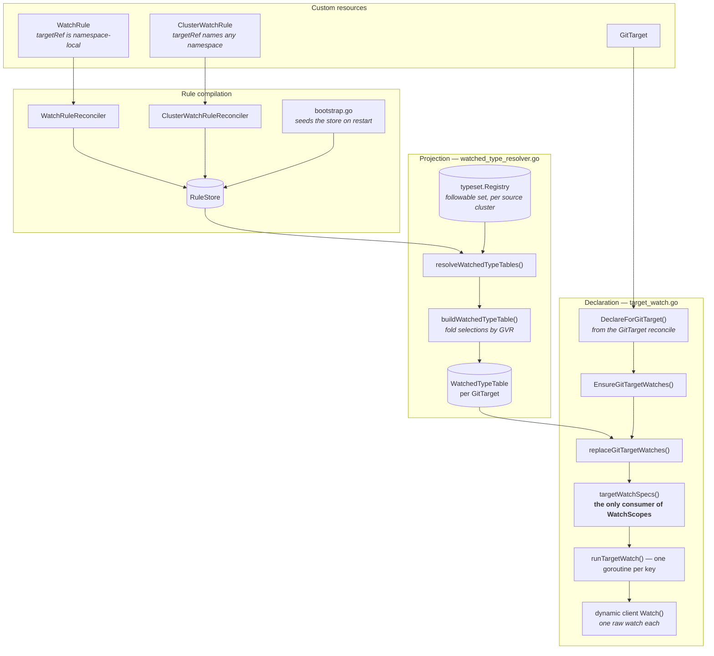
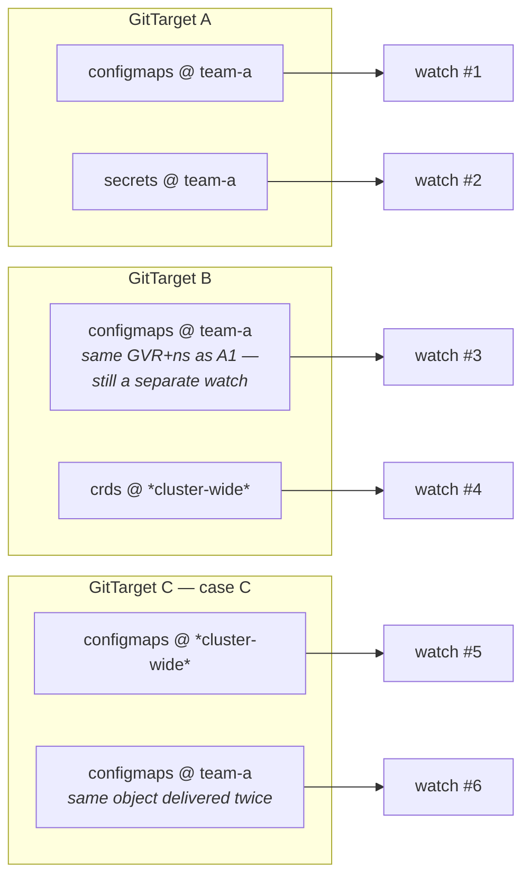
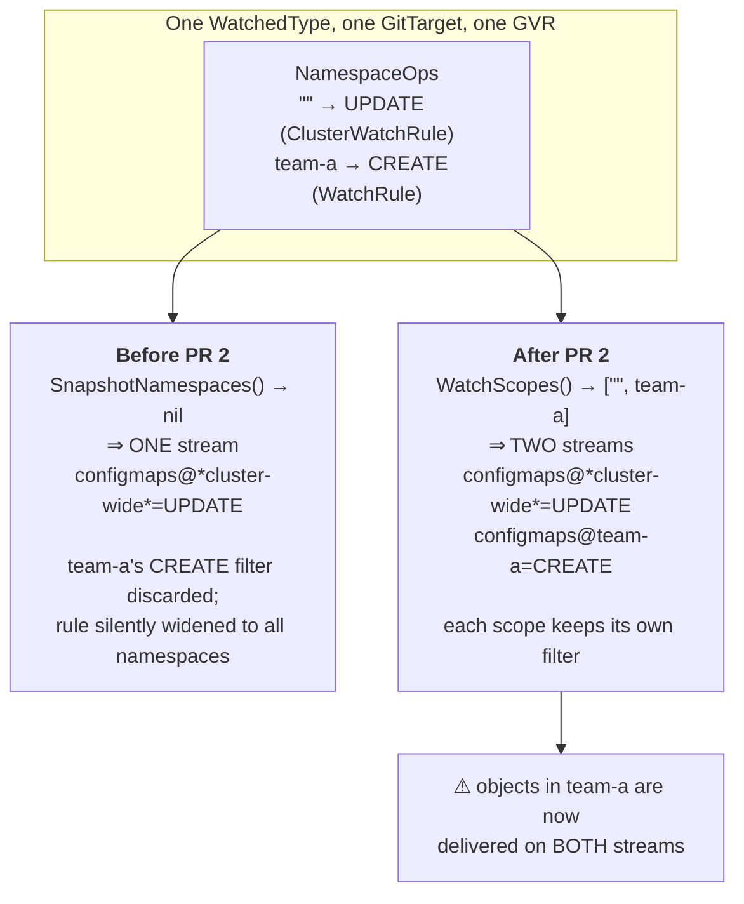
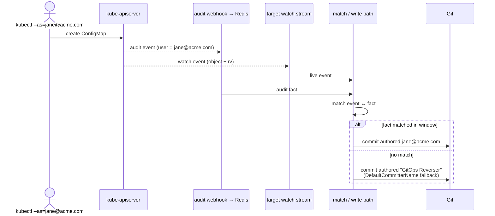

# How watches are built — an overview

> Written 2026-07-20 while investigating the PR 2 attribution regression
> ([session log](pr2-session-log-and-findings.md)). Describes the tree as it is **today**,
> verified against the code, not as designed. Every claim here was checked by reading the
> named function.
>
> Short answers to the three questions this page exists for:
> **(1)** Yes — watches follow from the GitTarget reconcile, but the *content* is projected
> from the rule set, not from the GitTarget. **(2)** No reuse across GitTargets: every
> GitTarget opens its own watches, even for an identical (GVR, namespace). **(3)** One watch
> per `(GitTarget, GVR, namespace-scope)` triple — so yes, combinations.

## 1. The build pipeline

Rules are compiled into a store; the store is projected into a per-GitTarget table; the table
is projected into a set of watch keys; each key becomes one goroutine holding one API watch.



**What triggers a rebuild.** `refreshWatchedTypeTables()` is gated on three fingerprints, so
the common no-change reconcile is a cheap compare rather than a rescan: the rule set
(`rulesFingerprint`), every active cluster's discovery revision
(`activeRegistriesFingerprint`), and the GitTarget→source-cluster mapping
(`clusterMappingFingerprint`).

**Your intuition is right, with one correction.** The watch set *is* driven by the GitTarget
reconcile — `DeclareForGitTarget` is what creates the `targetWatches` entry. But the GitTarget
contributes only its *identity and destination*; **what** to watch comes entirely from the
rules that point at it. A GitTarget with no rules gets an empty table and no streams. That
asymmetry matters: the rule controllers can change a resident table, but
`refreshRunningTargetWatches` only refreshes GitTargets that are **already running**, so a
rule alone cannot bootstrap a stream. (This is the incidental protection that
[PR 3](pr3-clusterwatchrule-target-admission.md) exists to make deliberate.)

## 2. The namespace scope of a selection

The one rule that determines everything downstream:

| Rule kind | Namespace recorded in the selection |
|---|---|
| `WatchRule` | the rule's own source namespace (`rule.Source.Namespace`) |
| `ClusterWatchRule` | **always `""`** — regardless of the rule's `scope:` |

`""` means *cluster-wide* — a watch with no namespace, i.e. all namespaces. A cluster-scoped
type (CRDs, Namespaces) can only ever be `""`, because `collectWatchRuleSelections` hardcodes
`ResourceScopeNamespaced` and so a WatchRule can never match a cluster-scoped record.

`buildWatchedTypeTable` then folds selections into one `WatchedType` per GVR, carrying
`NamespaceOps: map[namespace]OperationSet` — the union of operation filters per namespace.

## 3. Cardinality — what actually gets opened

**One watch per `(GitTarget, GVR, namespace-scope)`.** Nothing is shared.



So the total is a genuine product:

```text
streams = Σ over GitTargets  Σ over watched GVRs  |namespace scopes for that GVR|
```

- **Across GitTargets: no reuse.** `m.targetWatches` is keyed by `gitDest.Key()`, and
  `openTargetWatch` calls the dynamic client's `Watch()` directly — a raw watch, not a shared
  informer cache. Two GitTargets mirroring the same ConfigMaps in the same namespace open two
  independent watches against the API server.
- **Across reconciles: yes, reuse.** `replaceGitTargetWatches` compares the newly computed
  spec map against the running one (`equalTargetWatchSpecs`) and returns early when unchanged,
  so a no-op reconcile does not churn streams. The reuse that exists is *temporal*, not
  *cross-target*.
- **Per namespace: one each.** A GVR selected in `team-a` and `team-b` is two watches, because
  a namespaced watch takes exactly one namespace.

## 4. What PR 2 changed

Only the third bullet. Before PR 2, the presence of the `""` key made `SnapshotNamespaces()`
return `nil`, and `nil` meant *all namespaces* — so a co-resident named namespace was
**silently discarded**, along with its operation filter.



For every other shape the output is byte-identical:

| `NamespaceOps` | Before | After | Same? |
|---|---|---|---|
| `{team-a}` | `configmaps@team-a` | `configmaps@team-a` | ✅ |
| `{""}` | `configmaps@*cluster-wide*` | `configmaps@*cluster-wide*` | ✅ |
| `{team-a, team-b}` | both | both | ✅ |
| `{"", team-a}` | cluster-wide **only** | **both** | ❌ the fix |
| `{}` (empty) | cluster-wide | **none** | ❌ unreachable in practice |

## 5. Where the attribution suspicion sits

A commit's author is not carried by the watch event. The event says *what* changed; a separate
audit-webhook fact says *who* did it, and the two are matched.



The observed failure is the lower branch: the file and commit landed, only the author was
wrong. Note that `"GitOps Reverser"` is **also** the configured-author identity, which is why
the failure was initially misread — see
[the investigation](pr2-e2e-attribution-investigation.md).

**Why the diagram above makes case C interesting.** If one object is delivered on two streams,
the write path sees it twice, but there is only ever **one** audit fact. Whichever delivery
consumes or races the match, the other has none — and a second, unattributed write of the same
object is a plausible way to land a commit authored by the fallback. This is the hypothesis
the instrumented run is testing: the declare log now names every stream, so a GVR appearing
twice for one GitTarget is case C caught in the act.

It is still a hypothesis. The controlled experiment says PR 2 causes the failure; it does not
yet say by which mechanism.
