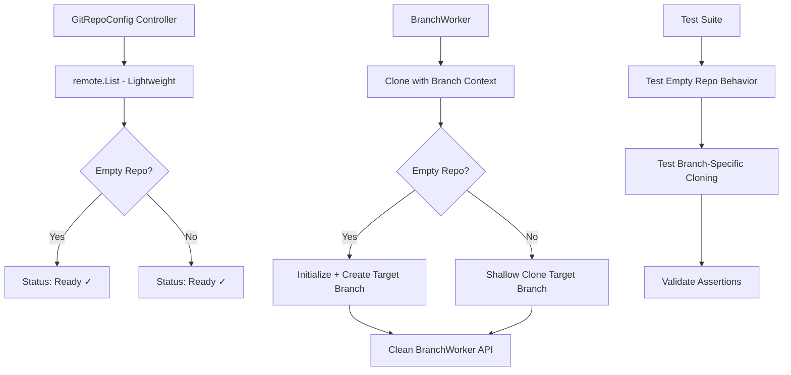

# Empty Repository Handling Plan

## Git Internals Background

### How Git Tracks Branches
In a checked-out Git directory, branch state is tracked in the `.git` folder:

- **`.git/HEAD`**: Contains a reference to the current branch (e.g., `ref: refs/heads/main`)
- **`.git/refs/heads/`**: Directory containing branch reference files
- **Empty repositories**: Have `.git/HEAD` but no commits, so `refs/heads/` is empty

### Unborn Branch State
Empty repositories exhibit a special "unborn branch" state where:

- **HEAD exists**: Points to a symbolic reference like `ref: refs/heads/main`
- **Branch reference missing**: The actual file `.git/refs/heads/main` doesn't exist because no commits have been made
- **git status behavior**: Shows "On branch main" for user-friendliness, indicating intended state
- **git branch --list behavior**: Returns empty list since no branch reference files exist
- **go-git challenge**: Library attempts to resolve HEAD reference and fails when branch ref is missing, unlike Git CLI which handles this gracefully

This state occurs during repository initialization before the first commit creates the branch reference.

**Note on Branch Creation**:
- **In empty repositories**: Creating a new branch creates the reference file, but the branch remains unborn until the first commit is made, as there's no commit SHA to point to.
- **In repositories with commits**: Creating a new branch immediately sets the branch reference to the current HEAD commit SHA, so it's not unborn.
- **Unborn state is exclusive to repositories with zero commits**, regardless of branch creation attempts.

### go-git Issue with Empty Repositories
go-git has a known issue where `Checkout()` fails on empty repositories because:
- HEAD exists but points to a non-existent branch reference (unborn branch state)
- The refs directory is empty (no branch refs created yet)
- Unlike Git CLI, go-git strictly resolves references and reports "reference not found" errors
- This differs from standard `git clone` behavior which masks the initial state

**Reference**: https://github.com/go-git/go-git/issues/118#issuecomment-1759167978

## Problem Statement

The `make test-e2e` is failing due to incorrect handling of empty Git repositories in the GitOps Reverser. The core issues are:

1. **go-git HEAD/ref mismatch**: Empty repos have HEAD but no branch refs, causing checkout failures
2. **Connectivity vs. Clone discrepancy**: GitRepoConfig controller accepts empty repos via lightweight checks, but BranchWorker fails during actual cloning
3. **Incorrect test assertions**: Tests assume `branchExists=false` for empty repos, but HEAD existence complicates this
4. **BranchWorker exposed to plumbing**: Direct use of go-git plumbing details instead of clean abstractions

## Alternative Strategies

### Detecting Unborn Branch State
To handle empty repositories in go-git, implement detection logic:

1. **Check for commits**: Attempt to resolve HEAD; if it fails with "reference not found", check if repository has any commits
2. **HEAD inspection**: Read `.git/HEAD` directly to confirm symbolic reference to intended branch
3. **Branch reference existence**: Verify if target branch ref file exists in `.git/refs/heads/`
4. **Graceful initialization**: If unborn state detected, initialize repository with first commit on target branch

### Handling Approaches
- **Pre-clone detection**: Use lightweight remote operations to assess repository state before full clone
- **Post-clone handling**: After clone, detect unborn state and initialize appropriately
- **Branch-specific logic**: Always operate with known target branch from GitDestination context
- **Error masking**: Wrap go-git errors to provide user-friendly messages for initial state

### go-git Clone Options for Empty Repositories

#### 1. The "Correct" Way (Explicit Branch Reference)
Use `remote.List()` to determine the remote's default branch, then clone with explicit `ReferenceName`:

```go
// Determine target branch via remote.List()
remote, err := git.NewRemote(memory.NewStorage(), &config.RemoteConfig{
    URLs: []string{repoURL},
})
refs, err := remote.List(&git.ListOptions{})
defaultBranch := "refs/heads/main" // Extract from refs

// Clone with explicit branch reference
cloneOpts := &git.CloneOptions{
    URL:           repoURL,
    ReferenceName: defaultBranch,
    SingleBranch:  true,
}
repo, err := git.PlainClone(repoPath, false, cloneOpts)
// Leaves repository in correct unborn branch state
```

This tells go-git exactly which branch to expect, avoiding checkout failures when the branch doesn't exist as a commit.

#### 2. The "Simple" Way (Skip Checkout)
Skip the checkout step entirely to avoid reference resolution issues:

```go
cloneOpts := &git.CloneOptions{
    URL:        repoURL,
    NoCheckout: true, // Skip checkout entirely
}
repo, err := git.PlainClone(repoPath, false, cloneOpts)
// Creates .git directory with HEAD pointing correctly, empty working directory
```

This approach succeeds by not attempting to resolve references during clone, leaving the working tree empty but the repository properly initialized.

## Key Insights

### Repository Connectivity Check Discrepancy

**GitRepoConfig Controller** (`checkRemoteConnectivity`):
- Uses lightweight `remote.List()` with in-memory storage
- **Accepts empty repositories** as valid (returns `branchCount=0, err=nil`)
- Sets GitRepoConfig status to `Ready=True`

**BranchWorker** (`Clone` function):
- Actually clones repository to disk
- For empty repos, calls `initializeEmptyRepository()`
- go-git may create default branches during clone

### Branch Context Awareness

**Important Learning**: We don't need to assume default branch names because:
- GitDestinations already know which branch they're targeting
- We can do shallow clones handling only that specific branch
- No need for generic "main" assumptions

## Implementation Context

### GitOps Reverser Specific Behaviors
The GitOps Reverser has unique operational characteristics that simplify empty repository handling:

- **No unnecessary commits**: We won't create commits during checkout/initialization unless there's actual event data to commit. Empty repositories remain empty until real changes occur.
- **Cluster as source of truth**: The cluster state is authoritative; we don't perform merges or pull before committing, expecting to be the primary contributor to target branches.
- **Conflict resolution strategy**: On push conflicts, perform hard reset and reapply the buffered events rather than merging. This prioritizes speed over complex merge strategies.
- **Speed optimization**: These design choices enable fast, conflict-free operations by avoiding traditional Git workflow complexities.

## Solution Architecture



## Implementation Plan

### Phase 1: Understanding & Testing

#### 1.1 Create Low-Level Tests (`internal/git/git_test.go`)
```go
func TestClone_EmptyRepository_BranchSpecific(t *testing.T)
func TestClone_Shallow_SingleBranch(t *testing.T)
func TestInitializeEmptyRepository_WithTargetBranch(t *testing.T)
func TestRemoteList_vs_ActualClone_Discrepancy(t *testing.T)
```

#### 1.2 Investigate go-git Behavior
- Document exact differences between `remote.List()` and `git.PlainClone()`
- Test branch creation during empty repo initialization
- Validate shallow clone behavior with specific branches

### Phase 2: Fix Test Assertions

#### 2.1 Update `internal/git/branch_worker_test.go`
- Fix `TestBranchWorker_EmptyRepository` expectations
- Update `GetBranchMetadata()` assertions based on real behavior
- Add tests for branch-specific empty repo handling

### Phase 3: Abstract Plumbing Logic

#### 3.1 Add to `Repo` struct (`internal/git/git.go`)
```go
// Branch-aware empty repository handling
func (r *Repo) InitializeForBranch(branch string) error
func (r *Repo) IsEmptyForBranch(branch string) bool
func (r *Repo) IsUnbornBranch(branch string) bool  // Detect unborn state
func (r *Repo) EnsureBranchExists(branch string) error

// Shallow clone for specific branch
func CloneForBranch(url, path, branch string, auth transport.AuthMethod) (*Repo, error)
```

#### 3.2 Clean BranchWorker Interface
- Remove direct plumbing calls (`repo.Head()`, `plumbing.ErrReferenceNotFound`)
- Use new `Repo` methods for all git operations
- Simplify error handling

### Phase 4: Update BranchWorker Logic

#### 4.1 Context-Aware Cloning
```go
// Instead of generic Clone + Checkout
repo, err := git.CloneForBranch(repoURL, repoPath, worker.Branch, auth)
```

#### 4.2 Empty Repository Handling
```go
// BranchWorker no longer assumes "main"
if repo.IsUnbornBranch(worker.Branch) {
    // Handle unborn branch state specifically
    err := repo.InitializeForBranch(worker.Branch)
    // Handle first commit creation
} else if repo.IsEmptyForBranch(worker.Branch) {
    err := repo.InitializeForBranch(worker.Branch)
    // Handle first commit creation
}
```

### Phase 5: Validation & Documentation

#### 5.1 Testing
- `make lint` - Code quality
- `make test` - Unit tests pass
- `make test-e2e` - End-to-end validation
- Test with real empty repositories

#### 5.2 Documentation Updates
- Update godoc comments for new methods
- Document go-git behavior quirks
- Add examples for empty repository bootstrap

## Expected Outcomes

### Functional Improvements
- **Consistent empty repo handling**: Connectivity checks and actual cloning agree
- **Branch-specific operations**: No more default branch assumptions
- **Shallow cloning**: Faster, more efficient repository operations
- **Better error messages**: Clear distinction between connectivity and operational issues

### Code Quality Improvements
- **Clean abstractions**: BranchWorker shielded from go-git plumbing details
- **Testable code**: Low-level tests validate actual behavior
- **Maintainable**: Centralized git logic in `git.go`
- **Robust**: Handles go-git quirks gracefully

## Risk Mitigation

### Backward Compatibility
- Internal changes only - no API modifications
- Existing GitRepoConfig validation unchanged
- BranchWorker interface remains stable

### Testing Strategy
- Comprehensive low-level tests before high-level changes
- Incremental validation at each phase
- Real repository testing for e2e validation

## Success Criteria

1. ✅ `make test-e2e` passes with empty repositories
2. ✅ BranchWorker correctly handles empty repo initialization
3. ✅ No default branch assumptions in code
4. ✅ Clean separation between connectivity validation and actual operations
5. ✅ Comprehensive test coverage for edge cases

## Implementation Notes

### go-git Shallow Clone Considerations
- Use `git.CloneOptions{Depth: 1, SingleBranch: true, Branch: branch}`
- Handle cases where shallow clone isn't possible
- Fallback to full clone if needed

### Empty Repository State Management
- Track whether repository was initialized by us vs. pre-existing
- Ensure consistent branch creation during first commit
- Handle race conditions between multiple BranchWorkers
- Detect and handle unborn branch state during initialization

### Error Handling Strategy
- Distinguish between connectivity failures and operational failures
- Provide actionable error messages
- Graceful degradation for edge cases

### Concurrent Branch Initialization
When multiple GitDestinations target different branches in the same empty repository:

- **Race condition risk**: Multiple BranchWorkers may attempt simultaneous first commits on different branches
- **Resolution approach**: Since cluster is source of truth, the first successful push establishes the initial commit. Subsequent workers detect the repository is no longer empty and operate normally.
- **Branch isolation**: Each branch remains independent; no automatic merging occurs between branches during initialization.
- **Conflict handling**: If concurrent pushes conflict, hard reset and reapply strategy applies, ensuring eventual consistency.
- **No cross-branch coordination**: Workers don't merge branches; each maintains its own branch state as per GitDestination specification.