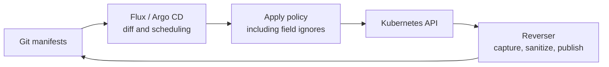

# GitOps apply, three-way merge, and field ignores

Source review recorded on 2026-09-22. This reference explains how Git-to-API apply interacts with
GitOps Reverser's API-to-Git publication. The
[three-way comparison investigation](../future/git-api-three-way-comparison.md) defines the proposed
merge and its unresolved baseline requirements. Implementation remains deferred while development
focuses on API-first publication.

## Four separate decisions

The word merge covers operations with different promises. Keep these decisions separate:

| Decision | Question answered |
|---|---|
| Diff | Does live state differ from the expected result of applying Git? |
| Scheduling | Should the reconciler sync now? |
| Apply | Which values and field ownership will the API write change? |
| Reverse publication | Which captured API fields will Reverser write into Git? |

Ignoring a difference can change the first decision without changing the third. No applier ignore
setting automatically changes the fourth. Reverser uses the ordinary captured object's sanitized
contents under its [field-ownership contract](../spec/manifestedit-field-ownership-spike.md).

## Reviewed versions and evidence

The findings below refer to these release sources, rather than a moving default branch:

| Component | Reviewed version | Source |
|---|---|---|
| Flux kustomize-controller | `v1.9.5` | [Controller](https://github.com/fluxcd/kustomize-controller/blob/v1.9.5/internal/controller/kustomization_controller.go) |
| Flux SSA library | `ssa/v0.76.2`, selected by that controller | [Dependency declaration](https://github.com/fluxcd/kustomize-controller/blob/v1.9.5/go.mod) |
| Argo CD and its in-tree GitOps Engine | `v3.5.3` | [Module and local engine replacement](https://github.com/argoproj/argo-cd/blob/v3.5.3/go.mod) |

This is source and upstream-test inspection, without a new cluster experiment. The repository's
[bi-directional e2e coverage](../bi-directional.md#what-the-tests-prove) remains separate evidence;
for example, its [Argo setup](../../test/e2e/setup/argocd/README.md) describes `v3.4.5`.
It does not establish coverage of the newly reviewed Flux ignore implementation. The Argo corner
checks preservation and reverse publication of an ignored API edit; it does not test a later Git
edit to that ignored field or simultaneous writers.

## Three-way content merge versus Kubernetes apply

A symmetric content merge compares each side with a shared baseline and preserves a change made
on only one side. Kubernetes client-side apply computes a patch from desired configuration, live
state, and `kubectl.kubernetes.io/last-applied-configuration`. The last-applied value helps identify
fields to remove. Fields declared in the new desired configuration are enforced against live state.
See [Kubernetes' merge calculation](https://kubernetes.io/docs/tasks/manage-kubernetes-objects/declarative-config/#how-apply-calculates-differences-and-merges-changes).

For a scalar field declared in Git, with no ignore rule:

| Previous value | Git desired | API live | Symmetric merge | Client-side apply |
|---|---|---|---|---|
| `3` | `3` | `5` | Preserve `5`: only API changed | Restore desired `3` |
| `3` | `7` | `5` | Conflict: both changed | Set desired `7` |

Client-side apply can preserve live fields outside its declared configuration. That preservation
does not extend to every field whose Git value remained unchanged. Its last-applied annotation is
also an applier record, not proof of the common baseline required by reverse publication.

[Server-side apply](https://kubernetes.io/docs/reference/using-api/server-side-apply/) uses the API
schema and `managedFields` to track ownership. Its conflicts concern managers attempting to change
fields owned by others. That differs from a content conflict between Git and API edits, and from
Reverser's compare-and-swap rejection when a branch moves. A field manager identifies an API
client's ownership set; it does not identify a human author or an applied Git revision.

## Flux: apply and ignore share the same reconciliation path

In `kustomization_controller.go`, `apply` converts `spec.ignore` into `DriftIgnoreRules` and calls
`ApplyAllStaged`. In the SSA library,
[`ApplyAll`, `dryRunApply`, and `apply`](https://github.com/fluxcd/pkg/blob/ssa/v0.76.2/ssa/manager_apply.go)
read the live object, predict the apply result through a server-side dry run, evaluate drift, and
apply when needed. Both dry-run and actual SSA requests use `client.ForceOwnership`.

Consequently, ordinary declared fields can be restored from Git even after another client changes
them. SSA does not automatically refuse that overwrite. Flux's `Kustomization.spec.force` controls
recreation for immutable-field changes; it is separate from forcing SSA field ownership.

### What the new ignore rules do

`Kustomization.spec.ignore` arrived in kustomize-controller `v1.9.0`, released on 2026-06-17. Its
[release notes](https://github.com/fluxcd/kustomize-controller/blob/v1.9.5/CHANGELOG.md#190) describe
JSON pointer paths, optionally scoped to selected resources, excluded from drift detection and
apply. Flux's [feature explanation](https://fluxcd.io/blog/2026/08/ignore-rules-drift-detection/)
describes the ownership handling. This is resource-field filtering, distinct from
`GitRepository.spec.ignore`, which filters source artifact files. `HelmRelease` drift-ignore
configuration belongs to a different controller and is outside this source review.

For matching resources, the implementation distinguishes these cases:

| Situation | Behavior |
|---|---|
| Only ignored fields differ, with no metadata cleanup needed | Skip the object apply |
| Apply is needed; an ignored field differs and another SSA `Apply` manager owns it | Remove that ignored field from the apply payload |
| Apply is needed; an ignored field differs and no other `Apply` manager owns it | Copy its live value into the apply payload |
| Object does not exist | Create from Git, including ignored fields |

`computeDriftedPaths` chooses between removing and adopting values. `parseManagedFieldsApply`
considers non-subresource `Apply` entries for that ownership decision. A normal update or
client-side patch is not equivalent to another SSA owner. Adopting the live value can leave Flux
owning the field: ignoring it does not necessarily relinquish ownership.

The upstream
[ignore tests](https://github.com/fluxcd/pkg/blob/ssa/v0.76.2/ssa/manager_apply_ignore_test.go)
exercise `CreateSkipsIgnore`, `NonIgnoredFieldDrift`, `TwoPhaseOwnershipLifecycle`, and
`ClientSideEditConsequences`. The last case checks that client-side edits survive another apply,
including an adopted replicas value still owned by Flux.

With `/spec/replicas` ignored, Git can provide an initial value of `3`. A later API scale to `5`
survives an ordinary image update. A subsequent Git change to replicas `7` does not take effect
on that existing object while the rule applies. The ignore establishes continuing live authority;
it does not detect whether a particular Git edit is newer or intentional.

## Argo CD: comparison, sync, and self-heal are separate

### A three-way diff predicts declarative apply

In the reviewed version,
[`Diff` and `ThreeWayDiff`](https://github.com/argoproj/argo-cd/blob/v3.5.3/gitops-engine/pkg/diff/diff.go)
select server-side diff when enabled, otherwise structured merge diff for SSA, otherwise the
legacy path. With a usable last-applied annotation, the legacy path computes a three-way patch,
applies it to live state to predict the result, and compares that prediction with live state.
It falls back to a two-way diff when it cannot use that path.

This is why the name `ThreeWayDiff` does not promise to preserve a concurrent API-only change to
a field declared in Git. It detects what a declarative apply would change. Known Kubernetes types
use strategic merge metadata; custom resources take a different patch path.

The actual write path in
[`newApplyOptions`](https://github.com/argoproj/argo-cd/blob/v3.5.3/gitops-engine/pkg/utils/kube/resource_ops.go)
sets client-side `Overwrite: true`, or `ForceConflicts: true` when server-side apply is selected.
Changing to SSA therefore does not provide an automatic conflict refusal policy for this design.
Replacement, forced recreation, and resource deletion need separate treatment from ordinary apply.

Version details matter: `v3.5.3`
[`state.go`](https://github.com/argoproj/argo-cd/blob/v3.5.3/controller/state.go) still selects
structured merge diff for SSA unless server-side diff is independently enabled. The moving
[latest diff guide](https://argo-cd.readthedocs.io/en/latest/user-guide/diff-strategies/) describes
a newer arrangement where SSA selects server-side diff and structured merge diff is discontinued.
The source findings here use the release version above.

### Ignoring the diff does not automatically change the write

Argo CD documents this distinction under
[`RespectIgnoreDifferences`](https://argo-cd.readthedocs.io/en/latest/user-guide/sync-options/#respect-ignore-differences-configs):

| Configuration | Diff and sync decision | Ordinary sync of an existing object |
|---|---|---|
| `ignoreDifferences` alone | Ignore matching differences | Desired Git values can still be applied |
| Also `RespectIgnoreDifferences=true` | Ignore matching differences | Preserve matching live values in the apply target |

In [`sync.go`](https://github.com/argoproj/argo-cd/blob/v3.5.3/controller/sync.go), the respect option
calls `normalizeTargetResources`. It copies ignored live values into the desired target before
applying it. For a new object without live state, it retains the original target. This gives the
same initial-create versus later-update distinction as the Flux example, through different code.

Diff-only ignores can suppress an automatic sync when they hide the only difference. They do not
protect the field during a later manual sync or another change that causes the object to apply.
With the respect option, a later Git edit to the ignored field remains unapplied to the existing
object. Manager-based ignore rules select API field ownership; they do not infer human intent.

### Self-heal changes scheduling

[`autoSync`](https://github.com/argoproj/argo-cd/blob/v3.5.3/controller/appcontroller.go) requires
automated sync and `OutOfSync` status. After a successful sync of the same revision and parameters,
`selfHeal: false` suppresses another automatic sync for live drift. A new desired revision or a
manual sync can still apply Git values. Turning self-heal off leaves more opportunity to publish
an API edit; it does not reserve a protected editing interval.

Flux's periodic drift correction is another scheduling mechanism. Lengthening its interval does
not prevent a new source revision or another reconciliation trigger from applying earlier.

## How the two directions interact

The following consequences are deductions from the source paths above and Reverser's current
whole-object publication contract. They are not results of a new concurrent-edit test.

An ignore rule changes the upper apply path. Reverser's capture and publication path still needs
its own contract. For example:

| Scenario | Consequence with current Reverser |
|---|---|
| API sets ignored replicas to `5` | Apply preserves `5`; Reverser can publish `5` into Git |
| Git later sets those ignored replicas to `7` | Ordinary apply keeps live `5`; a subsequent reverse write can replace Git `7` with `5` |
| Git changes image while an API replicas event still carries the old image | Reverse replay can overwrite the Git image even when replicas are ignored during apply |
| Apply restores a live edit before Reverser observes it | Reverser has no observation from which to recover that value |

The third row is the original independent-field race. Forward field ignores protect replicas
against Git-to-API writes; they do not protect the image against API-to-Git writes. Conversely,
a reverse merge alone cannot stop the forward applier from enforcing an older Git value before
publication completes.

The same issue matters for runtime-controller fields. Keeping an HPA's replicas out of forward
drift correction does not keep them out of reverse commits. If Git should retain a bootstrap seed
instead of recording live replicas, that requires a reverse publication policy too. Applier ignore
rules do not add that capability to Reverser.

### Implications for a future merge

The design needs to specify authority for both directions, including whether Git records API-owned
fields and whether any fields permit shared editing. Equality on fields managed by the applier
can establish convergence even while deliberately ignored fields differ. A successful applied
revision therefore cannot be treated as evidence that every field equals Git.

This qualifies the proposed applied-revision watermark: correlate status with object observations
and the effective apply policy, and re-establish affected baselines when that policy changes.
Retained snapshots and semantic deltas still matter for shared fields. Ignore rules can reduce
the shared field set, but they do not supply those missing historical relationships.
