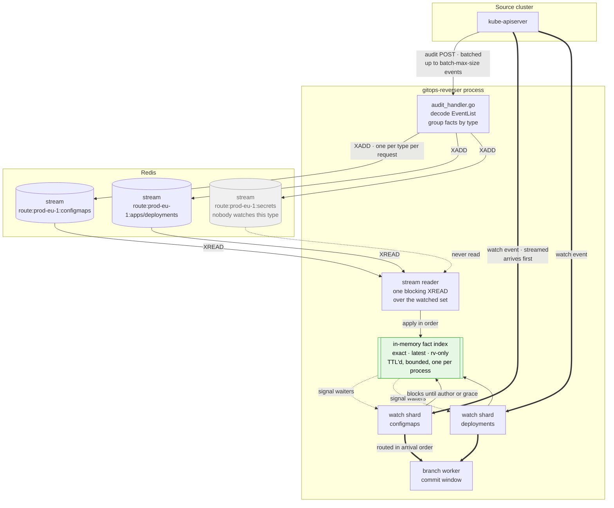

# Attribution facts as a stream, not a keyspace

> **design**: BUILT and shipped. The v1 fact keyspace and the `deletecollection` expander are gone,
> the resolver waits on the in-memory index, and the transport is selectable. See
> [what is built](#what-is-built-and-what-the-code-settled) for what each piece landed as, and for
> the numbers the implementation chose. Index: [`../INDEX.md`](../INDEX.md)
>
> Supersedes an option analysis that priced six ways to stop polling Redis (folded away; see
> `git log`). This record picks one and specifies it: the audit receiver publishes facts,
> the watch side subscribes per type and holds them in memory, and the per-key Redis lookup is
> deleted rather than optimized.
>
> Three deliberate deviations from the brief are argued in [the push back](#the-push-back). The
> largest is the transport: a Redis **stream** rather than plain publish and subscribe.
>
> It also deletes the `deletecollection` expander outright: a collection delete becomes one fact
> that every removal in its scope joins, which is both less code and more capable than parsing a
> response body that is often not there. See [collection deletes](#collection-deletes-are-one-fact).
>
> The transport sits behind a two-method seam so a single-pod install can run attribution on an
> in-memory ring instead of Redis. See
> [the transport seam](#the-transport-seam-and-running-without-redis), which also records what the
> deleted `RedisByTypeStreamQueue` did and what it never had.
>
> It is also chosen to move toward high availability rather than away from it. See
> [what this buys for HA](#what-this-buys-for-high-availability) for which part of that problem it
> solves and which part it leaves open.

## The decision

Attribution facts stop being a keyspace that the watch side reads, and become a **log that the
watch side follows**.

The audit receiver, which already decodes a whole batch of audit events per request, appends one
entry per type to a per-type stream. Every process that watches that type follows the stream and
keeps the facts in a bounded, TTL'd in-memory index. The resolver's join becomes a map lookup
against that index, and the grace window becomes a wait on an in-process signal rather than a poll
against Redis.

`SET`, `GET`, and the three fact key shapes in
`attribution_index.go` go away. Redis keeps the watch
resume cursors and the command-author records, which are unrelated and unchanged.

## What is built, and what the code settled

The design shipped in four pieces. The first three changed no behaviour, because the resolver still
read the v1 keys; the fourth is where the behaviour change landed, all at once, so no install is
left half on each path.

| Piece | State | What landed |
|---|---|---|
| The design | merged, [#283](https://github.com/ConfigButler/gitops-reverser/pull/283) | this record |
| The transport seam | merged, [#284](https://github.com/ConfigButler/gitops-reverser/pull/284) | `FactPublisher` / `FactFollower`, the Redis-stream and in-memory implementations, one conformance suite over both |
| The index and the publish side | merged, [#286](https://github.com/ConfigButler/gitops-reverser/pull/286) | the four match structures, the subscription set, the waiter registry, the follower loop, and `audit_handler.go` appending one entry per type per request |
| The switch-over | merged, [#287](https://github.com/ConfigButler/gitops-reverser/pull/287) | the resolver waits on the index, the v1 keys and the collection expander are deleted, `cmd/main.go` selects the transport |

Six things the code decided that this record only pointed at:

**`FactStreamKey` holds a typed `schema.GroupResource`, not a rendered string.** The stream name
embeds the API-path form (`apps/deployments`) that `groupResourceKey` produces, while
`schema.GroupResource.String()` produces the reversed dotted form (`deployments.apps`). A caller
rendering its own key would publish to a stream nobody follows, with no compile error and no failing
test. Holding the type and rendering at the transport boundary makes that unrepresentable.

**The v2 streams are deliberately not siblings of the v1 keys.** The stream key suffix is
`:author:v2:audit:` and the keyspaces are unrelated, so an install that rolls back keeps reading v1
keys while the v2 streams age out on their own.

**Expiry is decided on read, not only by the sweep.** A lookup checks each entry's TTL itself, so an
aged-out fact is never joined merely because the sweep has not run. `SweepInterval` bounds memory,
never correctness.

**A trim gap is only reported when the follower was actually behind.** Detection is gated on that,
so ordinary retention ageing out an entry a caught-up follower already read is not counted as loss.

**`ResolveAuthor` took a query struct rather than keeping its parameter list.** This record said the
signature would not change, and that turned out to be wrong: the collection tier joins on the
object's namespace and labels, and neither could be expressed in the six arguments the resolver
took. Keeping the signature would have left step 4 — the body-less collection delete, the case the
expander gave up on and the whole reason the collection tier exists — unreachable from production.
Everything the constraint was protecting held: the grace window, the blocking behaviour, the outcome
classification, and both metric names.

**The replica count is a flag, because the process cannot see it.** The in-memory transport has to
be refused with more than one replica, and nothing in the downward API reports a Deployment's
replica count, so the chart templates `--replica-count` in from `.Values.replicaCount`. The chart's
own `validate-replica-count.yaml` still fails a chart install outright; this is the gate for
everything installed another way.

And two the code refused to guess at until now: `cmd/main.go` stayed untouched through #284 and
#286, so the transport-selection flag and the in-memory-plus-multiple-replicas rejection landed with
the switch-over — a flag whose consumer does not exist yet is a flag nobody can test. The tuning
numbers were likewise constants and `FactIndexConfig` fields, defaulted to the values in
[the open questions](#open-questions), and became flags at the same moment.

## What this is replacing

Today the write side stores each fact under up to two of three key shapes, and the read side polls
for up to three seconds trying up to three keys per attempt. The measurement that motivates the
change is in the previous record: audit delivery is **batched** by the apiserver, so the watch event
arrives first by roughly `--audit-webhook-batch-max-wait`, the first lookup is a near-guaranteed
miss, and the poll loop runs to completion on essentially every attributable event.

The keyspace was built for a lookup that was assumed to usually hit. It usually misses, and the
thing it is being asked to do is deliver a fact that has not happened yet. That is a queue's
job.

## The push back

### 1. Use a stream, not plain publish and subscribe

Plain `PUBLISH` and `SUBSCRIBE` is fire-and-forget and at-most-once. A message reaches only the
subscribers connected at that instant, and there is no way to notice that one was missed.

Dropping the keys removes the safety net that currently makes those properties tolerable. Today a
missed notification would cost latency, because the fact is still sitting in Redis under a key and
the next poll finds it. Once the keys are gone, a message lost during a reconnect is **gone**, and
the commits that needed it are authored `unknown (attribution unresolved)`, silently and
permanently. Attribution is the product's reason for existing, so trading a latency problem for a
correctness problem is the wrong trade even at low probability.

Three concrete cases turn this from theory into routine:

- **Every process restart.** A rollout, an upgrade, an OOM kill. A fresh subscriber's in-memory
  index is empty, and pure publish and subscribe has no way to fill it. Every event in flight
  during that window loses its author.
- **Every reconnect.** A dropped Redis connection loses whatever was published while it was down,
  with nothing to detect afterward.
- **Every new watch.** A `WatchRule` that starts watching a type subscribes with an empty index,
  and its first events find nothing.

A Redis **stream** is the same idea with the same shape and none of those costs. It is still a queue
the receiver appends to and the watch side follows. It still replaces the keyspace. But entries
persist for a bounded window, each has an ID, and a reader resumes from the last ID it processed.
That single property turns all three cases above into a replay of the last few minutes:
[start from the TTL horizon](#starting-up-and-catching-up) and the index is warm before the first
event needs it.

It also makes loss **detectable**, which fire-and-forget never can. If a reader falls so far behind
that the stream trimmed past its position, the gap is visible in the IDs, so it becomes a metric and
a log line instead of a quiet run of unattributed commits.

The cost is one Redis data structure the codebase has not used before. That is a smaller price than
the three cases above.

### 2. One index per process, not one per GitTarget

The brief asks for "an in-memory TTL'ed set of attribution facts for every GitTarget". That would
undo the property worth keeping: a fact names a write that happened in Kubernetes, not a consumer
interested in it, so one fact already serves every `GitTarget` that needs it. Five `GitTarget`s
mirroring one `Deployment` would hold five copies of every fact, and the memory bill would scale
with a number that has nothing to do with how much is happening in the cluster.

Instead: **one process-wide index**, keyed exactly as the fact keys are keyed today, and a
**subscription set that is the union** of the types any watch is following, reference counted so a
type is unsubscribed when the last watch on it goes away. `GitTarget`s share the index the same way
they share the keyspace today. The fan-out the brief asks for still happens, at the level where it
does useful work: the process never receives facts for a type nobody watches.

### 3. Keep the loss bounded and visible

Redis enforced two things for free: a TTL on every fact, and a memory ceiling with an eviction
policy on the server. Moving the index in-process moves both jobs to this codebase.

A `deletecollection` over ten thousand objects, or a large rollout, arrives as a burst of facts.
The index therefore needs a per-type cap with oldest-first eviction, and eviction has to be
**counted and exported**, not silently absorbed. An attribution that was dropped because the index
was full must look different in the metrics from one that was never published.

## The design

### Stream naming

One stream per `(audit route, group/resource)`:

```text
gitops-reverser:author:v2:audit:route:<route>:<group/resource>
```

The route infix stays exactly as it is today and for the same reason: an apiserver posts under one
route, several `ClusterProvider`s naming one cluster share that route and therefore share its facts,
and a fact from cluster A must never name the author of an object watched on cluster B. See
[the attribution spec](../spec/attribution.md#the-scope-is-an-audit-route-and-a-type).

The group/resource suffix is the new part, and it is what makes the fan-out meaningful. A process
watching only `configmaps` and `deployments` follows two streams and never receives a fact for
anything else.

### The publish side

[`serveEventListRequest`](../../internal/webhook/audit_handler.go#L186) already decodes one
`EventList` per request, and [`processEvent`](../../internal/webhook/audit_handler.go#L289) already
decides which events produce a usable fact. The change is to accumulate rather than write
immediately:

1. Each accepted event is reduced to an `AuthorFact`
   as `RecordFact` does now, with one change: a
   `deletecollection` is published as **one fact describing the collection**, not expanded into one
   fact per object. See [collection deletes](#collection-deletes-are-one-fact).
2. Facts are grouped by `(route, group/resource)` across the whole request.
3. One `XADD` per group, carrying that group's facts as a single entry.

An apiserver batch of 400 events over three types becomes **three appends**, not 400 writes and 800
key updates. The batching that causes the delivery delay is the same batching that makes the
publish cheap, which is the part of the brief that is exactly right.

Only facts that would have been stored are published. An event with no `objectRef` or no user
produces nothing today and must produce nothing here, or waiters get woken by facts that cannot name
anyone. The "no resolvable name" rule is the one exception that changes: a name-less
`deletecollection` is now exactly the case that produces a fact, so the check becomes "no name and
not a collection verb".

`AuthorFact` gains two fields: the label selector
from the request URI, and the optional set of uids the collection covered, reduced from the response
body at the receiver and dropped past a size cap. It already carries the namespace, verb, and stage
timestamp that the collection join reads, and it stops needing the per-item name and namespace the
expander used to fill in.

#### A retried audit POST may append twice, and that is safe

The API server retries a webhook delivery it did not get an acknowledgement for, so the same batch
can be appended more than once, under a fresh stream ID each time. No deduplication is needed for
that, because a fact is **keyed data rather than a position in a sequence**: the second copy carries
the same author under the same `(uid, rv)`, the `latest` map is last-writer-wins over identical
content, and a waiter woken twice resolves to the same name. The duplicate costs one entry's worth
of retention and nothing else.

This is the property the [transport seam](#the-transport-seam-and-running-without-redis) is built
on, and it is what separates this from the high-water-mark ordering the deleted per-type stream
layer needed. It also means the design does not depend on `XADD`'s idempotency options, which would
put a floor under the Redis and Valkey versions this operator supports in exchange for nothing.

### Trimming is the TTL

Each `XADD` carries `MAXLEN ~ <cap>` so a hot type cannot grow without bound, and a periodic `XTRIM
MINID <now - factTTL>` drops entries past the retention horizon. Stream IDs are millisecond
timestamps, so a time-based trim is a plain `MINID` bound and needs no side index.

`--author-attribution-ttl` keeps its meaning: how long a fact remains available for a watch event to
join. It now bounds stream retention and the in-memory index together.

### The subscribe side

One reader goroutine per process issues a single blocking `XREAD` across every stream in the
subscription set, with a per-stream last-seen ID.

Two things to get right:

**No consumer groups.** They are the obvious reach and the wrong one. A consumer group distributes
entries *between* consumers, and this is a fan-out: every process that watches a type needs every
fact for that type. Each process reads independently, from its own last-ID cursor, held in memory.

**The subscription set changes at runtime**, whenever a `WatchRule` starts or stops covering a type.
The reader blocks with a bounded `BLOCK` interval and re-issues, so a set change takes effect within
one block period rather than needing the connection torn down.

### The in-memory index

Entries are applied in stream order into four structures:

| Structure | Key | Serves |
|---|---|---|
| exact | `(route, group/resource, uid, rv)` | `ADDED` and `MODIFIED`, the only exact-capable join |
| latest | `(route, group/resource, uid)` | single-object removals, whose rv never matches; last write wins |
| rv-only | `(route, group/resource, rv)` | the escape hatch for a fact with an rv but no uid |
| collection | `(route, group/resource, namespace)`, time-bounded, with an optional uid set | removals caused by a `deletecollection` |

The first three mirror the key shapes the lookup already knows, so the join policy in
`LookupAuthorResolution` survives unchanged. The
fourth is new and is described in [the next section](#collection-deletes-are-one-fact).

**The route leads every key, and it has to.** The index is one per process while the streams are one
per `(route, group/resource)`, so an index keyed on the type alone would pool two clusters' facts in
one map and hand a watch event on cluster B an author from cluster A. The rv-only hatch is where
that bites hardest, because a resourceVersion is opaque and not unique across clusters, and the
collection tier is where it bites most quietly, because a namespace name says nothing about which
cluster it is in. The v1 fact keys already carry the route for this reason
([the attribution spec](../spec/attribution.md#the-scope-is-an-audit-route-and-a-type)), and the same dimension has to
travel through the waiter candidate keys and the collection scope match, not only the four maps
above. A test that stores identical `(group/resource, uid, rv)` facts under two routes and resolves
each from its own is the one that proves it, and it belongs with the index rather than the
transport: the transport already partitions by route because the stream name does.

Stream order matters for exactly one of these. The `latest` map is last-writer-wins, so entries have
to be applied in the order they were appended. A single stream is ordered, and a uid belongs to one
group/resource and therefore to one stream, so per-object order is preserved without any
cross-stream coordination.

Each entry carries its insertion time for the TTL sweep, and each map is bounded per type with
oldest-first eviction.

### The resolver

[`ResolveAuthor`](../../internal/watch/author_resolver.go) keeps its grace window and its blocking
behavior. Only the middle changes:

1. Register a waiter for this event's candidate keys.
2. Check the in-memory index.
3. If absent, block on the waiter, `ctx.Done()`, or the grace deadline.
4. On a hit, return with the
   [outcome classification](../../internal/watch/author_resolver.go) that distinguishes
   not-attempted from unresolved.

Step 1 must precede step 2. Registering after the check loses a fact applied in the gap between
them, which is the same race the poll loop currently papers over by looking again.

**A hit does not always end the wait, and assuming it did was a bug this record shipped with.**
Ordering the tiers only decides between facts that are both PRESENT. The watch event reliably beats
the audit batch carrying its delete — that is the entire reason the grace window exists — so when a
removal is resolved, the only fact in the index is often the object's last write. Returning on it
answered "who deleted this" with "who last edited it" every time someone else had touched the object
first, and no ordering could have helped, because the right fact had not been delivered yet.

So a per-object match on a REMOVAL is held as a fallback rather than returned, unless the fact is
itself about a deletion. The wait continues for evidence about the removal — either collection tier,
or the object's own delete fact — and the fallback is returned when the grace expires with nothing
better. Waiting never costs an attribution: the worst case returns exactly what returning early
would have, one grace window later, which is the case the grace window is for.

It does cost LATENCY, and the number belongs here rather than in a dashboard someone discovers it
from. Measured over one e2e run, by tier: a removal that finds its delete evidence resolves in about
70ms, and one that never does averages about 3.1s before falling back to the last write. Creates and
updates never consult those tiers. So the cost is not spread across attribution, it is concentrated
in removals for which no delete fact ever arrives, which is most often a type the cluster's AUDIT
POLICY excludes rather than anything Kubernetes withholds: those spend the grace to end up exactly
where they started. (An earlier draft of this said a graceful pod delete produces no audit event at
all. It does — the DELETE request is audited like any other, and under deletion-as-intent that
request is the fact the join wants. Pods are absent from this repository's own e2e facts because the
recommended policy drops them as runtime noise.) The
shard is single-threaded, so the wait also delays whatever is queued behind it, and
`--author-attribution-grace` is the one lever that bounds both.

**What is deliberately NOT claimed here is a before-and-after.** Comparing a run of this against a
run of the previous behaviour looked easy and was not: the two runs' populations differed by more
than the change (one had 203 non-exact resolutions against the other's 59, and the specs added
alongside this work generate collection deletes that shift the mix by construction), and the
baseline was never captured per tier. A headline "the mean wait moved from X to Y" out of those two
runs would have been a workload difference wearing a causal claim's clothes. The per-tier numbers
above are from a single run and need no comparison to mean something.

Trading the wait back is a product decision about how much commit latency a correct deletion author
is worth; the alternative on offer is naming an innocent person.

Its parameter list does change, into an `AuthorQuery` carrying the object's namespace and labels
alongside the route, type, uid and resourceVersion it already took. Those two fields are what the
collection tier joins on, so without them a body-less `deletecollection` could never reach step 4
from production — see [what the code settled](#what-is-built-and-what-the-code-settled).

The waiter signal comes from the goroutine applying stream entries. There is no Redis call anywhere
on this path: the fast case is a map read, and the waiting case is a channel receive.

## Collection deletes are one fact

A `deletecollection` is published as a single fact describing the collection, and every removal that
falls inside that collection joins it. The expander that reconstructs per-object facts by parsing
the response body is deleted.

### Why the current expander is the wrong shape

`kubectl delete configmaps --all -n team-a` produces **one** name-less audit event and **N**
independent watch events. That asymmetry is not an accident of our plumbing, it is what the two
mechanisms are: audit reports the request that was made, and the watch reports each object that
changed. The lab corpus records exactly this shape for row 9, watch times N against audit times one.

`RecordDeleteCollectionFacts` tries to erase the
asymmetry by rebuilding the N from the one, parsing `responseObject` into a list of per-object
identities and writing a fact for each. Everything about that is fragile:

- **It needs a body that may not be there.** An aggregated API, a metadata-only response, or a
  truncated audit event yields nothing, and the whole collection silently degrades to
  committer-authored removals. The code says so itself.
- **It parses an untyped list shape** and has to accept typed lists, `v1.List`, and anything else
  carrying an `items` array.
- **It writes N entries for one request.** A collection delete over ten thousand objects is ten
  thousand writes for one audit event, which is also the burst most likely to overflow the index.
- **It carries its own reason code and its own test file** for a case that the join could have
  handled structurally.

### The replacement

Publish one fact carrying what the audit event actually said: the actor, the verb, the
group/resource, the namespace, the stage timestamp, and the selector from the request URI when one
was given. Then a removal joins it by **scope** instead of by identity.

For a removal event, the resolver tries in order:

1. the exact `(group/resource, uid, rv)` fact,
2. a **collection** fact whose **uid set contains this object**, when the collection carried a
   usable response body,
3. the `latest` fact for that uid,
4. a **collection** fact whose group/resource and namespace match the object, whose selector matches
   the object's labels, and whose stage timestamp is within the collection window,
5. the rv-only hatch.

**The two collection tiers sit on opposite sides of `latest`, and this record originally had both
below it.** That was wrong, and the implementation corrected it. The `latest` tier answers "who last
WROTE this object"; a removal asks "who DELETED it". For a single-object delete the two coincide,
because the delete files its own fact under that uid and overwrites what was there. A collection
delete files one fact about the collection, so the uid's `latest` entry is left holding whoever
edited the object last — and ranking it above the collection's uid set credited every removal to the
previous editor while the uid set went unread. It is the one thing the expander got right, by
overwriting that entry per object. Uid membership is the API server stating that THIS request
deleted THIS object, so nothing weaker may answer ahead of it.

Scope matching stays below `latest`, because it is the weakest evidence here and the only tier that
can name the wrong human. An unrelated delete by another actor during the same window is claimed by
its own fact at step 3 and never reaches step 4.

Steps 3 and 4 are the same fact matched two ways, and the split is the subject of
[the next section](#should-the-response-body-travel-with-the-fact). Step 4 alone is already more
capable than the expander, because it does not depend on the response body existing at all, so the
aggregated-API and metadata-only cases that degrade to committer today start resolving.

### Should the response body travel with the fact?

Carrying the body so the join can still be uid-precise is worth doing, in a reduced form. Two
questions hide inside it and they have different answers.

**What travels** and **when it is parsed** are separate decisions. The instinct to "defer it to the
real lookup moment" is right about the second and wrong about the first.

#### What travels: the uid set, not the body

| Option | What is stored | Verdict |
|---|---|---|
| 1. Nothing | scope only | The necessary floor, but gives up precision that is sometimes free |
| 2. The raw response body | the full list of deleted objects | Rejected |
| 3. A reduced uid set | one fact plus the uids it covered | **Chosen** |
| 4. Per-object facts (today) | N facts for one request | Rejected, this is what is being removed |

Option 2 fails on size. A `deletecollection` over ten thousand ConfigMaps carries a response body in
the tens of megabytes, and in this design that body would be broadcast to every subscriber of the
type, retained for the whole TTL window, and replayed into memory on every restart backfill. The
transport is a fact log, and full object bodies are not facts.

Option 3 keeps everything the join needs and almost none of the size. The receiver already has the
body decoded, so it reduces it there to the set of uids the request covered and publishes
`{actor, scope, selector, uids}`. A uid is 36 bytes, so ten thousand of them is a few hundred
kilobytes rather than tens of megabytes, and it is still **one** entry for one audit event. This is
not the expander in disguise: write amplification stays at one, and no per-object key is created.

The set needs a cap, and the cap is where the design gets its safety: past some size the uids are
dropped and the fact degrades to scope matching, which is exactly step 4 and is already correct.
Degradation must be counted, so "we fell back to scope" is visible rather than inferred.

#### What that buys: over-attribution goes to zero when the body is there

This is the strongest argument for your suggestion, and it is worth being explicit about.

Scope matching accepts a bounded risk of naming the **wrong** human, which is worse than naming
nobody. Uid membership has no such risk: either the object was in the set the apiserver said it
deleted, or it was not. So when the body is present, the weakest tier in the table stops being weak.

One clarification on what "exact" can mean here. The body's items carry the **pre-delete**
resourceVersion, which no watch removal event ever presents, which is why the current expander
writes only the `:last` key. So the body upgrades the join from scope to **uid membership**, not to
the `(uid, rv)` exact tier. That is still a large improvement, and it is the reason step 3 sits
above step 4 rather than replacing it.

#### When it is parsed: at ingest, not at lookup

Parsing at lookup sounds cheaper and is not, for two reasons.

The lookup runs **once per removal event**, so a lazily parsed body is parsed N times for one
collection delete, unless it is memoized, at which point it is option 3 with extra steps. And the
lookup runs on the watch shard's blocking path, where the event's whole stream is stalled behind it.
Parsing a ten thousand item list belongs on the stream reader goroutine, not there.

The one thing lazy parsing wins is a collection fact that expires with no removal ever arriving,
where the parse was wasted. A `deletecollection` that produced facts almost always produces
removals, so that saving is rare.

What **should** stay at lookup time is the **decision**, not the parsing: try uid membership, fall
back to scope. Deferring the decision is what makes the fallback possible at all, and it is the part
of the suggestion worth keeping.

#### Why the scope fallback is the primary path, not the corner case

The body is least likely to be there exactly when it would be most valuable.

[`audit-webhook-api-server-connectivity.md`](../facts/audit-webhook-api-server-connectivity.md)
recommends enabling `--audit-webhook-truncate-enabled` in production, and truncation drops
request and response bodies from oversized events. The oversized event is the ten-thousand-object
collection delete. A well-configured production cluster is therefore the one most likely to hand us
a body-less `deletecollection`, and the current expander gives up entirely in that case.

So the ordering is deliberate: scope matching is the floor that must work on its own, and the uid
set is an opportunistic upgrade taken when the apiserver happened to send a body.

#### Bodies stay out of the stream for everything else

This applies to collection deletes only. For a normal write, the watch event already carries the
full object, so an audit body would duplicate it for no gain, and the fact already extracts the one
thing it needs from `responseObject`, the post-write resourceVersion
(`rvFromRawObject`).

That question is settled in this repository rather than open. Row 15 of the lab corpus established
that an aggregated-API write produces an audit event with an **empty** body while the watch carries
the full object, and the supplementary body-enrichment proxy was retired on the strength of it
([`test/mutationlab/README.md`](../../test/mutationlab/README.md)). Re-introducing bodies into the
fact path generally would walk that decision back.

### The selector is better evidence than the body

The request URI's `labelSelector` is the *intent* the actor expressed. The watch event carries the
*object*. Evaluating one against the other is a better test of membership than reading back a list
the apiserver may not have sent, and it uses each stream for what it uniquely knows. This is the
difference the brief points at, and it is worth stating as the design rule: **audit says what was
asked for, the watch says what changed, and the join belongs at the point where both are in hand.**

A collection fact with no selector matches every object of that type in the namespace, which is
correct, because that is what `--all` means.

### Why the window can be tight

Over-attribution is the real risk here and it deserves a plain statement: a scope match can name the
wrong human, which is worse than naming nobody. Three things bound it, and the third is the one that
makes it safe.

Namespace and selector narrow the scope. Precedence keeps anything with its own fact out. And the
window is short, because of the deletion-as-intent rule in
[the attribution spec](../spec/attribution.md#1-deletion-is-attributed-at-intent-time): the
removal being attributed happens at **delete-request time**, when `deletionTimestamp` is set, not at
whatever later moment finalization completes. Finalizers do not stretch the window. So the fact's
own `stageTimestamp` plus a small allowance for skew and delivery is enough, and it can be far
shorter than the fact TTL.

That last point is what makes this design safe and would not hold under the old framing, where
attribution chased the eventual removal.

## How it fits together



The heavy arrows are the mirroring path, which is unchanged and stays serial per shard. The dotted
arrow to `secrets` is the fan-out doing its job: the stream is written, nobody follows it, and it
trims itself away.

## What is deliberately kept

**The blocking property.** A watch event still waits inline for its author, up to the same grace
window, on the same single-threaded shard. This is what keeps a late fact from ever rewriting a
shipped commit, and it is why the wait exists at all.

**Commit order.** Nothing here touches the ordering chain: one goroutine per
`(GitTarget, GVR, scope)` that finishes one event before reading the next, feeding one FIFO into the
branch worker. Attribution decides what author is stamped, never when an event is routed relative to
its siblings. See
[`watch-event-ordering-and-attribution-grace.md`](../facts/watch-event-ordering-and-attribution-grace.md),
including its warning that resolving events concurrently without a sequence-numbered reassembly
buffer would let a later event overtake an earlier one on the same object. Faster resolution makes
that refactor tempting. It is still out of scope, and still wrong without the buffer.

Order improves in one respect. An open commit window accepts one `(author, GitTarget)` pair, so
[`canAppend`](../../internal/git/branch_worker.go#L730) finalizes on any author change. Today an
event whose fact lands a moment after the grace expires ships unresolved between two resolved
siblings and splits one person's change into three commits. Resolving from a delivered fact rather
than from a race against a deadline removes most of that class.

**Attribution stays optional.** A nil `Manager.AuthorResolver` remains configured-author mode, with
no stream reader started and no subscription taken.

**The fan-in property.** One fact still serves every `GitTarget` that needs it, now through a shared
index instead of a shared key.

**Facts that never resolve.** Some events produce no audit fact at all, so no wait and no transport
can name their author. They still spend the grace window and ship unresolved. That is unchanged, and
it is the population that keeps
the circuit breaker for a route that has never resolved anything
worth building separately — see
[when a removal should stop waiting](../design/attribution-removal-wait-options.md).

**What that population is, corrected.** This record named "a status subresource update and a
graceful pod delete" and called them structural. They are not: this repository's e2e audit policy
drops `pods` and every `*/status` as runtime noise, and the mutation-capture lab runs against that
same cluster, so corpus rows 5 and 7 recorded the POLICY's silence rather than the API server's. A
`DELETE` request on a pod is audited like any other request, and under the deletion-as-intent rule
that request is exactly the fact the join wants. The population that can never resolve is therefore
mostly **the types the cluster's audit policy excludes** — which is configuration, is knowable, and
is a far better thing to be up against than a wall. Confirming it by measurement, rather than by
reading the policy, is worth a lab run.

## Starting up and catching up

On start, and on any reconnect, the reader begins from the retention horizon rather than from `$`.
`XREAD` takes one concrete position per stream, so the horizon is rendered as the stream ID
`<now - factTTL in unix milliseconds>-0`: stream IDs are millisecond timestamps, so a point in time
is directly a position, and the read resumes from the entry after it. (`MINID` is an `XTRIM` strategy and
never appears in a read; the trim that enforces the same horizon is described in
[trimming is the TTL](#trimming-is-the-ttl).) The index is populated with the whole retention window
before the first watch event needs it, which is what makes a restart cost nothing.

The last-seen ID per stream lives in memory only. It does not need to be durable: a process that
lost it also lost its watch connections and its in-memory index, so it is starting from the horizon
anyway.

If a reader's last-seen ID is older than the stream's first surviving entry, it was trimmed past and
lost facts. That is detectable by comparing the two, and it must be reported: a counter plus a log
line naming the stream. This is the case pure publish and subscribe cannot detect at all.

## Failure modes

| Failure | Today | Publish and subscribe only | This design |
|---|---|---|---|
| Process restart | facts survive in Redis, re-read by key | index empty, facts lost | replay from the TTL horizon |
| Redis connection drop | next poll finds the key | messages during the gap lost, undetectably | resume from last ID, gap detected if trimmed |
| New watch on a type | reads existing keys | starts empty | replays that type's window |
| Reader falls behind | not possible, reads are on demand | silent loss | trim gap detected and counted |
| Redis unavailable | every lookup misses, all unresolved | same | same |
| Index full under a burst | Redis evicts per its policy | unbounded growth | oldest-first eviction, counted |
| Fact never published | unresolved after the grace | unresolved after the grace | unresolved after the grace |

The last row is the one that does not move, and it is the honest limit of the whole exercise.

## What it costs

**Every process receives every fact for every type it watches**, whether or not it holds an object
that matches. That is the fan-out working as intended, and the brief's judgment that some unmatched
messages are acceptable is right. The volume is bounded by the audit event rate on watched types.

**Today that cost is zero anyway.** The chart rejects `replicaCount > 1`
([`validate-replica-count.yaml`](../../charts/gitops-reverser/templates/validate-replica-count.yaml)),
so there is exactly one process, and it is both the audit receiver and the watch host.

**Memory moves from Redis into the pod**, bounded by the caps above and observable through the
eviction counter.

That single-replica fact raises a fair question: if one process both publishes and consumes, why go
through Redis at all? An in-process channel would work today and would be simpler. The answer is in
the next section, and it is the main reason not to take the shortcut.

## What this buys for high availability

HA is wanted, and this design is chosen partly to move toward it rather than away from it. Being
precise about which part of the problem it solves matters, because it is not the hard part.

**It removes a coupling HA would otherwise create.** Under multiple replicas, the apiserver's audit
webhook posts through a Service to *whichever* replica answers, while a given object's watch shard
lives on *whichever* replica owns that `GitTarget`. Those are unrelated choices, so the fact and the
watcher that needs it routinely land in different processes. A per-type stream with independent
per-reader cursors is exactly the primitive for that: the receiving replica appends, and every
replica watching the type reads it, with no knowledge of each other. The alternative shapes are all
worse. Sticky audit routing makes the apiserver's load balancing this operator's problem, and a
shared lookup keyed per object is what is being deleted here.

**It makes rolling updates safe, which is where HA spends its time.** A replicated deployment is
almost always mid-rollout, reconnecting, or restarting a pod. Those are precisely the three cases
where plain publish and subscribe loses facts silently, and where a resumable stream replays the
retention window instead. An HA install rolls far more often than a single-replica one, so this is
the difference between attribution being reliable and attribution being reliable except during
deploys.

**The fan-out cost scales the right way.** A replica subscribes only to the types it hosts shards
for. If HA distributes `GitTarget`s across replicas, the subscription sets are largely disjoint, so
total fact traffic tracks the number of watched types rather than replicas times types. Fan-out
only becomes expensive if every replica watches everything, which is the topology HA exists to
avoid.

**In-process delivery would foreclose all of that.** A channel between the receiver and the resolver
works perfectly on one replica and has to be thrown away on the second. Going through Redis now
costs a sub-millisecond round trip against a batch window measured in seconds, which is not a
trade-off worth thinking about, and Redis is already a hard dependency for the resume cursors.

**What it does not solve.** Attribution stops being an HA blocker; it was never the main one. The
open problems live in [`ha-gittarget-distribution-plan.md`](../future/ha-gittarget-distribution-plan.md)
and are about ownership: which replica owns a `GitTarget`, how ownership moves without dropping or
duplicating a watch, and above all that commits to one `(GitProvider, branch)` stay serialized
through a single writer. Two replicas committing to one branch is the real problem, and nothing
here addresses it. What this design does is make sure that when that work happens, attribution
already works across processes instead of needing its own answer.

## The transport seam, and running without Redis

### What existed before, and what did not

The memory is half right, and the half that is right is useful.

A per-type Redis stream layer did exist. `RedisByTypeStreamQueue` in
`internal/queue/redis_bytype_queue.go` mirrored audit events into one stream per resource type, and
it already used the primitives this design needs: `XADD`, `XTRIM` with `MINID` to bound retention,
a `__index__` set so the keyspace could be enumerated without `SCAN`, and a per-type high-water mark
for ordering. A sibling file added a parallel watch-event stream. The whole audit-stream layer,
about 3,500 lines with its tests, was deleted on 2026-06-30 in commit `e25b5ebd` when watch-first
ingestion made it unnecessary.

It is worth reading before writing this, from `git show e25b5ebd^:internal/queue/redis_bytype_queue.go`.
Not to restore: it carried an ordering model this design does not need, because facts are keyed data
rather than a sequence to replay. But the stream mechanics, the trim cursor, and the key layout were
worked out once already.

The abstraction was `AuditEventQueue`, a **one-method interface declared at the consumer** in
`internal/webhook/audit_handler.go`, satisfied by the Redis type and by test fakes.

**There was never a second implementation.** No in-memory queue existed at any point. The seam was
there, the alternative behind it never was. That matters for estimating this work: the interface is
not the hard part, and having had one before is not evidence that the memory-backed side is close to
free.

The idiom is alive in the current code and should be followed rather than invented.
[`AttributionLookup`, `CursorStore`, and `AuthorResolver`](../../internal/watch/author_resolver.go)
are all narrow interfaces declared where they are consumed, with the Redis-backed type satisfying
them from the other side.

### Redis is already optional, which makes this small

The dependency is narrower than it looks. `--redis-addr` may be empty today, and validation only
rejects that when author attribution or the admission webhook is enabled
([`cmd/main.go`](../../cmd/main.go)). The watch cursor store is already nil-tolerant: with no store,
[`lookupTargetWatchCursor`](../../internal/watch/target_watch.go#L956) returns a miss and the watch
cold-replays on restart, which is correct and only more expensive.

So Redis is a hard requirement for **attribution**, and for nothing else. Making attribution work
without it is one seam, not a project.

**A correction to that sentence, which this record got wrong.** It claimed the admission webhook
required Redis too. It does not, and deliberately so: the webhook is `failurePolicy: Ignore` and the
controller is the real gate, so without Redis it simply no-ops command-author capture and
`CommitRequest`s claim no actor. That is a supported, degraded mode rather than a usage error, it
pre-dates this design, and a test pins it. Turning it into a startup error to match this record
would have broken a shape installs already run. The record is what changed.

The remaining requirement narrows once the transport is selectable, and the startup validation has
to narrow with it or the in-memory mode is unreachable: an empty `--redis-addr` becomes an error
only when the **Redis** transport is selected, and the combination of the in-memory transport with
an empty address becomes a supported configuration rather than a rejected one. The flag, the validation in [`cmd/main.go`](../../cmd/main.go), and
[`configuration.md`](../configuration.md) move together in that change, because a flag whose
validation and documentation disagree is how a mode ends up unreachable in the first place.

One correction belongs with that work: the doc comment on
[`RedisStore`](../../internal/queue/redis_store.go#L45) calls it "a hard dependency in every mode",
which the validation above contradicts.

### Abstract the capability, not the client

The seam goes around what the transport *does*, not around Redis. Two methods:

- **publish** a batch of facts for one `(route, group/resource)`,
- **follow** a set of `(route, group/resource)` from a horizon, yielding entries in append order.

Everything above that line has exactly one implementation and never learns which transport it has:
the four match structures, the TTL sweep and eviction, the waiter registry, the resolver, and the
collection join. Only the transport is doubled.

The wrong seam, worth naming because it is the tempting one, is a storage interface with `get` and
`set` that Redis and a map both implement. That reintroduces the per-key lookup this design deletes,
and it would make the in-memory side a cache rather than a log.

### The in-memory implementation is the same data structure

This is the argument that the second implementation is honest rather than a stub.

A Redis stream is a capped, ordered log with per-reader cursors. That is a ring buffer. The
in-memory transport is a per-`(route, group/resource)` ring with a TTL-based trim and one cursor per
follower, which is not an approximation of the Redis behavior, it is the same structure in process
memory. Replay from the horizon on start is reading the ring from its tail. Trim-gap detection is
comparing a follower's cursor against the ring's oldest surviving entry. Both fall out rather than
being simulated.

That shared shape is what makes a single conformance suite meaningful, and running it against both
implementations is the condition for building this at all. Two transports that are only tested apart
will drift, and the drift will land in whichever one the maintainers do not run daily.

### Guard rails

**In-memory means one process, and that has to fail loudly.** The transport only works when the
audit receiver and the resolver are the same process. That is true today, and the chart already
refuses `replicaCount > 1`, so the gate exists. It must stay coupled: the memory transport plus more
than one replica is a configuration error, refused at startup rather than degraded into silent
attribution loss. The same applies if the audit ingress is ever split into its own Deployment.

**Select it explicitly.** An empty `--redis-addr` currently means attribution is off. Making it also
mean "attribution over an in-memory transport" would change existing installs by inference. A
separate choice, defaulting to the Redis transport, keeps the change opt-in and keeps the
combinations checkable at startup.

**Redis stays the default when attribution is on.** In-memory is for the single-pod install where
running a StatefulSet to name commit authors is out of proportion to the benefit. It is not the
production recommendation, and the cost is worth stating in the user-facing docs: facts do not
survive a restart, so events in flight across one lose their author. That is already true of any
restart today, which is what keeps the delta small.

## Code inventory

| Change | Where | State |
|---|---|---|
| New: the two-method transport seam, plus a Redis-stream and an in-memory implementation and one conformance suite over both | [`fact_stream.go`](../../internal/queue/fact_stream.go), [`fact_stream_redis.go`](../../internal/queue/fact_stream_redis.go), [`fact_stream_memory.go`](../../internal/queue/fact_stream_memory.go) | done, #284 |
| New: subscription set, in-memory index, waiter registry, all transport-agnostic | [`fact_index.go`](../../internal/queue/fact_index.go), [`fact_index_store.go`](../../internal/queue/fact_index_store.go), [`fact_streams.go`](../../internal/queue/fact_streams.go), [`fact_waiters.go`](../../internal/queue/fact_waiters.go) | done, #286 |
| Group per request, one append per type; publish a collection as one fact | [`audit_handler.go`](../../internal/webhook/audit_handler.go), [`author_fact.go`](../../internal/queue/author_fact.go) | done, #286 |
| Add the eviction, trim-gap, and collection-degraded counters | [`telemetry/exporter.go`](../../internal/telemetry/exporter.go) | done |
| Wait on a signal instead of polling; drop `attributionPollInterval` | [`author_resolver.go`](../../internal/watch/author_resolver.go) | done |
| Subscribe and unsubscribe a type as watches come and go | [`target_watch.go`](../../internal/watch/target_watch.go) | done |
| Delete the fact key builders, `SET`/`GET` paths, and the SCAN-based size gauge. The file goes with them: what survived is the fact shape and the result taxonomy, in [`author_fact.go`](../../internal/queue/author_fact.go), and the shared key helpers, in [`key_prefix.go`](../../internal/queue/key_prefix.go). `attribution_fact_index_size` survives too, now a field read on the sweep rather than a SCAN of the whole keyspace | `attribution_index.go`, deleted | done |
| Delete the collection expander: `RecordDeleteCollectionFacts`, `storeDeleteCollectionFacts`, and their tests. `deleteCollectionItems` survives, reduced to uids only: the publish side still needs the body parsed once, to build the uid SET one fact carries. Nothing rebuilds N per-object facts from one request | `attribution_index.go` and `attribution_index_deletecollection_test.go`, deleted | done |
| Retire §5 and §8 of the expander spec; the deletion-as-intent render rule is untouched and still binds. The spec has since been folded into [`attribution.md`](../spec/attribution.md), which carries that rule as §1 | `deletecollection-attribution-expander.md`, deleted | done |
| Add the transport selection flag, narrow the `--redis-addr` validation, and reject in-memory with more than one replica | [`cmd/main.go`](../../cmd/main.go), [`configuration.md`](../configuration.md) | done |
| Correct the stale "hard dependency in every mode" comment | [`redis_store.go`](../../internal/queue/redis_store.go) | done |
| Document the three new counters and the replaced result label | [`interpreting-metrics.md`](../interpreting-metrics.md) | done |

`AttributionResolutionsTotal` and `AttributionResolutionWaitSeconds` keep their names and meanings,
so the e2e reporting in [`reportAttributionStats`](../../test/e2e/e2e_suite_test.go) and every
existing dashboard keep working across the change. That continuity is deliberate: the wait
histogram is how the improvement gets measured.

## Rollout

The fact schema is ephemeral by construction. Facts carry a TTL measured in minutes and nothing
reads them after that, so there is no migration to write: the new version stops writing keys and
starts appending to streams, and the old keys expire on their own within `--author-attribution-ttl`
of the upgrade.

The one visible effect is that events in flight across the restart lose their author, which is
already true of any restart today.

### What a fact holds about a person

A fact names an actor, so it carries personal data and should be described as such: the username,
and the display name and email when the API server supplied them, alongside the object's namespace
and uid, the verb, and the stage timestamp. That is taken from the audit event's `user` field, and
moving it from a key to a stream entry changed where it lives rather than what it is.

It carries **less** than the v1 keys did. The switch-over dropped the object's name and subresource
and the group/resource from the wire, because no join tier reads them — the type is the stream's own
name, and the join is by uid, resourceVersion, or scope. `isServiceAccount` went too, being a prefix
check on the username rather than evidence. A fact is broadcast to every process following its type,
held for the whole TTL, and replayed into memory on every restart, so a field nothing reads is paid
for three times; on a real collection-delete fact the removals cut the entry by about a quarter. The
one field kept without being read is `auditID`, which is what ties a commit authored by the wrong
person back to the audit event that named them.

Retention moves the same way. A fact is held for `--author-attribution-ttl` (ten minutes by default)
in the Redis stream and, once read, in the process's in-memory index, and the trim and the TTL sweep
drop it after that. The stream KEY carries the same deadline, refreshed by every append, so a type
that stops being written to takes its stream with it instead of leaving an immortal key behind; the
in-memory transport forgets an idle ring on the same horizon. Nothing writes it to Git: the commit carries the author's
name and email as commit metadata, which is what the actor already published by making the change.
Access is whoever can read the Redis keyspace and the pod's memory, which is why the keyspace is
namespaced per install ([`--redis-key-prefix`](../configuration.md)) and why an install that
declines to store any of it can leave attribution off and commit as the configured author.

### A rolling upgrade is one process, not two formats

Old writers produce keys and new writers produce streams, and neither reads the other, so an install
running both at once would lose attribution for whatever the wrong half handled. It cannot run both
at once: the chart rejects `replicaCount > 1`
([`validate-replica-count.yaml`](../../charts/gitops-reverser/templates/validate-replica-count.yaml)),
so a single process is replaced by a single process, and the window is one pod restart in which
in-flight events lose their author: the same cost as any restart today, bounded by the
[TTL-horizon replay](#starting-up-and-catching-up) to the events in flight at that moment.

Under the [HA topology](#what-this-buys-for-high-availability), where replicas overlap during a
rollout, that stops being true and a mixed-version window becomes real. The answer belongs with the
ownership work rather than here, and it is cheap when it arrives: a new writer can append to the
stream and write the v1 keys for one release, so an old reader keeps resolving. Taking that on now
would build a compatibility path for a topology the chart refuses to start.

## Open questions

### Answered by the implementation

Each of these is a constant in [`internal/queue/`](../../internal/queue/) today and becomes a flag
in the switch-over, when a consumer for it first exists.

| Question | Answer | Why that number |
|---|---|---|
| How large may a collection's uid set be? | **10000 uids** (`DefaultCollectionUIDCap`) | A few hundred kilobytes against a body for the same request that runs to tens of megabytes. A collection larger than that is exactly the one a cluster with audit truncation enabled would not have sent a body for anyway. |
| How long is the collection window? | **30s** (`DefaultFactCollectionWindow`) | Ten times the default grace window. Under the deletion-as-intent rule it only has to cover audit batching plus clock skew, so it can be far shorter than the fact TTL, and short enough that an unrelated delete a minute later is not claimed. |
| Cap per type, or one global cap? | **Both**: 4096 per `(route, group/resource)`, 65536 total | Per-type is the primary because it is the fair one — a burst on one noisy type must not evict every other type's facts. The total cap bounds the pod with a number that does not scale with how many types happen to be watched; overflow evicts from the type holding the most, so the pressure lands where it came from. |
| `BLOCK` interval | **1s** (`DefaultFactStreamBlock`) | A follower re-reads the subscription set on every `Next`, so this is also how long a subscribe or unsubscribe takes to land. |

**What replaces the `exact_deletecollection_item` result label**: two labels rather than one, because
the match is now two-tiered. `collection_uid` is a removal whose uid was in the set the API server
said it deleted — no over-attribution risk at all — and `collection_scope` is one matched by
namespace, selector, and window alone, which is the weaker evidence. `exact_deletecollection_item`
disappears with the expander in the switch-over, and that is the visible metric-label change the
release notes have to carry.

Three counters were added alongside them, registered with the index and first emitted when it is
wired in: `attribution_fact_index_evictions_total{reason}` (`per_type` or `total`),
`attribution_fact_stream_gaps_total{stream}`, and `attribution_collection_degraded_total{reason}`
for a collection fact published without its uid set. They get their row in
[`interpreting-metrics.md`](../interpreting-metrics.md) in the switch-over, where they start moving.

### Still open

- **Is one entry per type per request the right granularity?** It matches the apiserver's batching
  exactly, but a single entry can then carry hundreds of facts. An entry-size ceiling that splits
  oversized groups may be needed. `DefaultFactStreamMaxLen` bounds a stream in *entries*, not bytes,
  so nothing bounds one entry's size today.
- **Does the per-type stream count stay reasonable?** One `XREAD` across a few dozen streams is
  ordinary. A cluster watching several hundred types would want checking before it is assumed.
- **Should the trim-gap counter feed a condition?** A reader that is losing facts is a real
  degradation, and it is currently only visible as an unresolved rate.
- **Under HA, must a replica warm its index before starting a watch it has taken over?** Replaying
  the type's window is cheap, but starting the watch first would lose attribution for the handover
  window. Ordering the two is a small decision with a visible effect, and it belongs with the
  ownership work rather than here.
