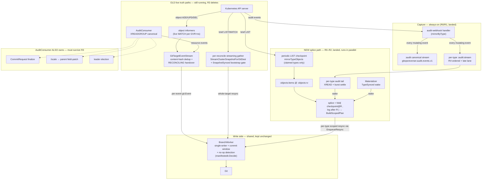
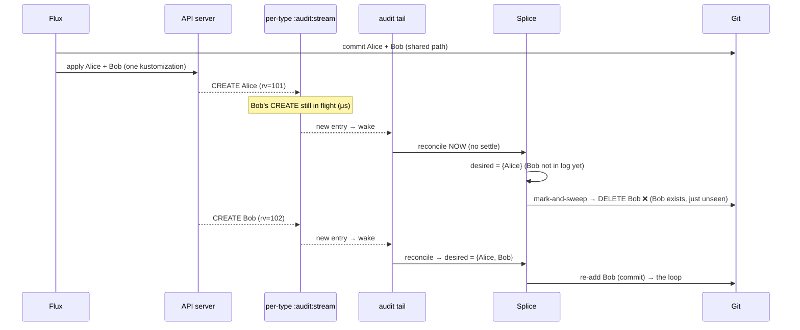
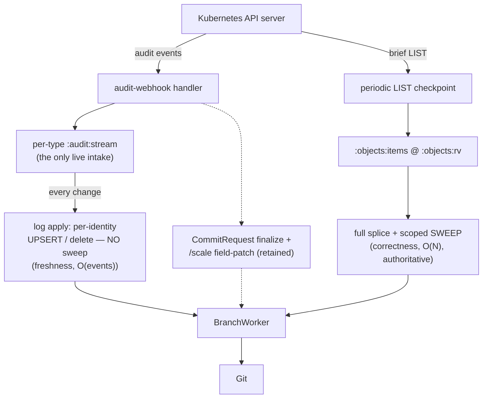

# Where the events flow today — the dual-path picture and how close R3 is

> ## ⚠️ HISTORICAL — the cutover is COMPLETE (R3 landed 2026-06-11; C-track too)
> This doc captured the **dual-path** moment *during* the cutover (R1+R2 landed, R3 pending).
> **R3 ("the great deletion") has since landed**, so the "OLD live-truth path" described below
> — the long-lived object informers, the single-canonical-stream resource fan, the
> RECONCILING handover, the per-reconcile gather, and content hashing — **no longer exists**
> (`informers.go` and `snapshot_stream.go` are deleted). The §4 "AuditConsumer side-jobs"
> were then relocated and the canonical stream itself deleted
> ([canonical-stream-retirement.md](canonical-stream-retirement.md), all stages landed
> 2026-06-11): `/scale` rides the parent type's stream, CommitRequest finalize is
> controller-driven behind audit attribution + the watermark barrier, and the
> `AuditConsumer`, the canonical stream, and the Joiner's auditID dedupe are gone. The
> per-type checkpoint+log **splice** (correctness) and the per-type **audit tail**
> (freshness) are the **sole** path. This file is kept as the cutover record; **for the
> current single-path architecture read
> `architecture-and-bootstrap.md`.**
>
> Original status: **explainer / snapshot after R1 + R2 landed** (commit `3d249e3`). Companion
> to the three design docs; this one is the "you are here" map, not a spec.
> Captured: 2026-06-10
> Related:
> [api-source-of-truth-reconcile.md](api-source-of-truth-reconcile.md) (the plan + §5.1 demolition list),
> `audit-log-ingestion-and-ordering.md` (the per-type log producer),
> `demand-driven-type-materialization-lifecycle.md` (the checkpoint demand layer).

## 1. One paragraph

> *(Historical — describes the dual-path moment during the cutover. R3 has since landed; the old
> path described here is now deleted. See the banner above.)*

At the time of capture **two pipelines ran at once**. The *old* one — long-lived object
**informers** plus the single-canonical-stream **AuditConsumer**, both feeding one
`GitTargetEventStream` (deduped by a content hash), with a per-reconcile streaming **gather** for
bootstrap/rule-change — was the live truth path. The *new* one — the per-type `:audit:stream` log
+ the demand-gated `:objects` **checkpoint**, folded by the **splice** into a per-type reconcile —
was fully built and running **beside** it. R3 ("the great deletion") then **removed the old
machinery** so the splice + per-type audit tail are the *sole* live feed, and hardened the
freshness wake (the per-type tail) now that the old path's backstop is gone.

## 2. The current dual-path flow



Reading it:

- **Capture (top)** is the future and is already complete: the webhook mirrors **every** event into
  both the legacy canonical stream *and* the per-type `:audit:stream`. The per-type streams carry
  100% of traffic today.
- **Old paths (left)** are still the load-bearing live truth. Note the informers **and** the
  AuditConsumer both write into the same `GitTargetEventStream` — that overlap is precisely why
  **content hashing** exists (to keep the same change from being committed twice). The **gather** is
  the bootstrap / rule-change whole-target snapshot, gated by `SnapshotSynced`.
- **New path (right)** is the splice, woken two ways: by the Materializer's **TypeSynced** (after a
  fresh, authoritative checkpoint LIST) and by the per-type **audit tail** (freshness, between
  checkpoints). It enters the BranchWorker via `EnqueueResync` — a *scoped mark-and-sweep*, not a
  per-event write.
- **Write side (bottom)** is shared and unchanged: one BranchWorker per branch, commit window,
  no-op detection at the commit boundary.
- **AuditConsumer's other jobs (dashed)** — CommitRequest finalize, `/scale` field-patch, leader
  election — are *not* resource mirroring and must be preserved or relocated when R3 retires the
  single-stream fan.

## 3. The partial-burst mark-and-sweep — what it is and why it bites

The splice does not write events one by one; it computes a **whole desired set for the type** and
mark-and-sweeps:

```text
desired := decode(:objects:items)            # the checkpoint, complete as of revision R
for entry in XRANGE :audit:stream (R +:      # the log, strictly after R
    delete or upsert desired[identity]
plan := BuildScopedPlan(store, desired, scope=this type)   # upsert desired; SWEEP any managed doc of this type NOT in desired
```

The **sweep** is the feature: it catches orphans and missed deletes the checkpoint reveals. It is
**safe only when `desired` is complete**. The checkpoint half is always a consistent snapshot (an
atomic LIST at `R`). The **log half can be momentarily incomplete**: an object created after `R`
whose audit event has not landed in the stream *yet* is not in `desired` — and if the reconcile
sweeps then, it **deletes that object from Git**.

Under the design's core assumption — *gitops-reverser is the sole writer of its path* — this is
harmless: an object it hasn't observed isn't in Git yet, so there's nothing to sweep. The
**bi-directional** case breaks that assumption: **Flux writes the object to Git first**, then
applies it; gitops-reverser sees Git holding an object its log hasn't caught up to → spurious
delete → re-add when the event arrives → **commit loop**.



### How it's contained **today**

1. **The old path is still live and backstops it.** In R2 the splice is *additive*; the informer/
   audit-consumer live path already wrote both objects, so even a bad splice sweep is corrected.
2. **The burst-settle window** ([audit_tail.go](../../internal/watch/audit_tail.go)). The tail no
   longer reconciles on the first arrival; it **drains until the stream is quiet for one settle
   window**, so a co-arriving burst (Alice+Bob land μs apart) is folded together → `desired =
   {Alice, Bob}` → no spurious sweep. Each arrival extends the window, so even a spread-out burst
   coalesces into one reconcile. This is what made the bi-directional e2e green again.
3. **The fail-closed gate** (§7): the splice only runs while the checkpoint phase is `Synced`; a
   Dormant/Syncing type holds rather than sweeping a non-view.

### Why R3 makes it sharp

The moment R3 deletes the old live path, **backstop #1 is gone** — the splice is the *only* writer,
so a partial-burst sweep is a real, uncorrected data loss until the next re-anchor. The settle
window narrows the race but does not close it for a straggler event arriving after the window. So R3
must deliberately resolve it. The recommended resolution — **upsert on the log, sweep only on the
checkpoint** — is in §6; it removes the hazard by construction rather than narrowing the race.

## 4. How far are we from "all events through the new streams"?

Short answer: **the new streams already carry every event end-to-end; we are one campaign (R3) away
from them being the *only* path.** Capture is 100% done; consume is built and proven in parallel;
what remains is removing the old machinery and promoting the freshness wake from "accelerator with a
backstop" to "sole live feed."

| Stage | What it is | State |
|---|---|---|
| **Capture → per-type log** | every mutating event mirrored to `:audit:stream`, RV-ordered + late lane | ✅ **100%** — all traffic already flows here (R0/R1) |
| **Checkpoint** | `:objects:items @ :objects:rv`, demand-gated LIST, durable + boot-replayed, trimmed on re-anchor | ✅ for **claimed** types (by design — unclaimed types are intentionally not materialized) |
| **Splice consume** | per-(GitTarget, type) reconcile folds checkpoint + log; zero per-reconcile API calls | ✅ **landed (R2)** — woken by TypeSynced + audit tail |
| **Old live paths** | informers + AuditConsumer + gather + content hash + RECONCILING handover + `SnapshotSynced` gate | ❌ **still running in parallel** — this is the R3 delete |
| **AuditConsumer side-jobs** | CommitRequest finalize, `/scale` field-patch, leader election | ⚠️ live in the consumer — R3 must **preserve/relocate**, not delete |
| **Freshness wake at scale** | one blocking-read goroutine **per** Synced type | ⚠️ fine as an accelerator; **load-bearing after R3** → wants a single multiplexed `XREAD` + bounded debounce |

So the gap is not "build more pipeline" — the pipeline is built and carrying traffic. The gap is
**subtractive**: cut the parallel old path (R3a–e in the plan), keep the three things the consumer
also does, and harden the audit-arrival wake for the day it has no backstop.

## 5. The target state (post-R3), for contrast



One always-on intake (the audit push) + one periodic checkpoint. **Two jobs, split by trigger:** the
log drives cheap per-identity **upserts** (freshness, never sweeps); the checkpoint drives the full
**splice + sweep** (correctness, only off an authoritative LIST — see §6). No object informers, no
live gather, no content-hash maps, no handover buffer, no `SnapshotSynced` gate. The diff that gets
us there is mostly red — that's the point.

## 6. Recommended R3 shape — split freshness from correctness

R2 reuses one mechanism (full fold + `BuildScopedPlan` *with sweep*) for both freshness and
correctness. That is exactly what creates the partial-burst hazard (§3) and an `O(N-objects-of-type)`
cost on **every** burst. In R3, separate the two responsibilities **by trigger** — this removes the
hazard by construction, not by tuning a window:

- **Log → incremental UPSERT (freshness).** The per-type `:audit:stream` wake should apply only the
  **identities that changed** in the slice it read — upsert creates/updates, `PlanDelete` an explicit
  RV-bearing delete — and **never sweep**. This is the old per-event apply, just **re-sourced** from
  the canonical stream onto the per-type stream; keep that proven logic, do not reinvent it. Cost is
  `O(events)`, and with no sweep it **cannot** delete an unseen object, so the partial-burst race
  disappears and the settle window becomes a nicety, not a correctness crutch.
- **Checkpoint → full splice WITH sweep (correctness).** Mark-and-sweep is the only way to catch
  orphans / missed deletes, and it is safe **only** off an authoritative full LIST. Run it
  exclusively on checkpoint-authoritative moments: the periodic re-anchor (`TypeSynced`), a new claim
  on an already-Synced type (the declare-time wake), and boot-restore. Never off log membership alone.

Mechanically this is one predicate on the existing planner: the upsert path calls `BuildScopedPlan`
with an **empty sweep scope** (nothing swept; desired still upserted) or `PlanDelete` per identity;
the checkpoint path calls it with the **full type scope** (sweep on). RV-less / uncertain deletes
stay best-effort on the log and are backstopped by the next checkpoint sweep (DEC-5) — do not act on
them incrementally.

Net effect: the log path becomes the cheap, sweep-free freshness feed (safe as the sole live intake),
and the expensive authoritative reconcile happens only when it is both safe and worth it. This is the
shape the "just handle events + reconcile periodically" intuition points at.
