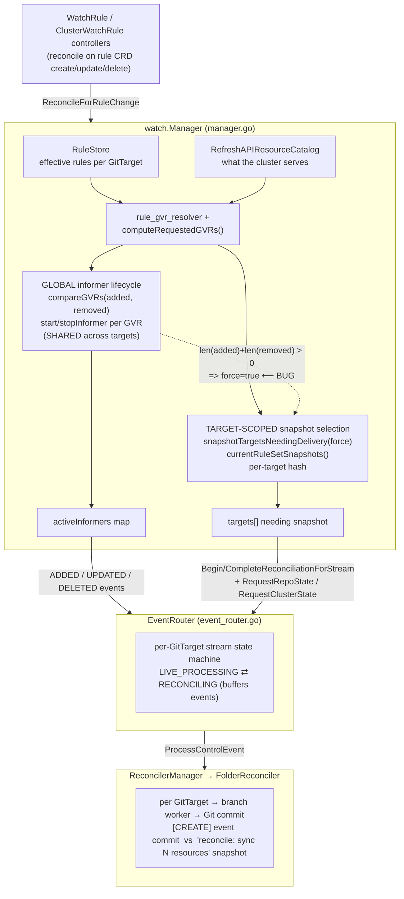

# GitTarget Isolation on Rule Changes

> **Status: ✅ Implemented and shipped.** Snapshot selection is now driven purely
> by a per-target *effective watch plan* hash (resolved GVR + scope + unioned
> operations + destination); the global `force` flag is gone. Validated by unit
> tests, a non-Serial e2e regression, and a `--procs=4` smoke run (21/21). See
> the Rollout Plan below for the per-step landing notes. The sections before it
> are kept as the original design rationale.

## Problem

`GitTarget` should be a user-facing isolation boundary: rules for one target
should not change the commit behavior of another target.

The parallel e2e smoke run exposed a cross-target coupling:

- `Manager WatchRule ConfigMap and Secret should create Git commit when
  ConfigMap is added via WatchRule` created a ConfigMap and expected an event
  commit such as `[CREATE] v1/configmaps/...`.
- Another spec changed WatchRules/GVRs at roughly the same time.
- The manager target entered rule-change snapshot mode even though its own
  user-visible rule set had not changed.
- The ConfigMap was written correctly, but the latest commit was
  `reconcile: sync 2 resources`, not `[CREATE] ...`.

That is more than a brittle test assertion. It means unrelated GitTargets can
affect each other's audit/commit semantics.

## Why It Matters

GitTarget isolation keeps the system predictable:

- Auditability: an event commit preserves operation, resource path, and author
  intent. A snapshot commit is less specific.
- Multi-tenancy: one team or namespace changing rules should not perturb another
  target's repo history.
- Testability: parallel e2e should reveal real isolation problems, not require
  broad `Serial` markings to hide them.
- Operational clarity: rule-change behavior is easier to reason about when it is
  scoped to the target whose effective watch plan changed.

## Current Behavior

Per-target snapshot tracking **already exists**. `currentRuleSetSnapshots`
(`internal/watch/manager.go`) computes a per-GitTarget hash, and
`snapshotTargetsNeedingDelivery` already compares each target's current hash
against its last-delivered hash and skips targets whose hash is unchanged. So
the machinery for target-scoped snapshots is in place.

The coupling comes from a single global override. `ReconcileForRuleChange`
computes global GVR additions/removals and passes them as a `force` flag:

```go
targets := m.snapshotTargetsNeedingDelivery(len(added) > 0 || len(removed) > 0)
```

`added`/`removed` are *global* deltas. When `force=true`,
`snapshotTargetsNeedingDelivery` **bypasses the per-target hash comparison** and
selects every current GitTarget — even targets whose effective rule set did not
change. That one wire is the cross-target coupling.

There is a second, subtler reason the global `force` exists, and it constrains
the fix. The per-target hash is computed over the **rule text**
(`rule.ResourceRules`, source, provider, branch, path) — *not* over the
**resolved GVR set**. So if target A has a wildcard rule and a newly installed
CRD makes that wildcard match a new served resource, A's *rule text* is
unchanged, A's hash is unchanged, and without `force` A would never snapshot —
letting the new informer's initial `ADDED` events leak as individual `[CREATE]`
commits. The global `force` was masking this by snapshotting everyone.

Shared informers are fine. The coupling is purely that global informer churn is
wired into per-target snapshot selection as a `force` override, and that the
per-target hash is not yet sensitive to the resolved watch set.

## Desired Behavior

Only GitTargets whose effective watched resource set changed should receive a
rule-change snapshot.

Examples:

- If target A watches ConfigMaps in namespace A, and target B adds a signing
  WatchRule, target A should keep processing live events normally.
- If target A's own WatchRule changes, target A should snapshot.
- If target A has a wildcard rule and a newly installed CRD makes that wildcard
  match a new served resource, target A should snapshot.
- If a global informer has to start because target B now needs a GVR, only
  targets that depend on that new watch should be protected from its initial
  ADDED events.

## Component Overview



Key takeaway: informers are legitimately **global/shared** (left branch);
snapshot selection is already **per-target** (right branch). The bug is purely
that the global left branch (`added`/`removed`) is wired into the right branch
as a `force` override. The fix is to cut that wire and make the per-target hash
sensitive to the *resolved* watch set so the right branch can stand on its own.

## How the Data Structures Work Together

The behavior above is the product of four data structures that are computed
fresh (or compared) on every `ReconcileForRuleChange`. Understanding where each
one comes from makes it clear why the coupling exists and what the fix touches.

**1. The rule set — `RuleStore` (`internal/rulestore`).**
The controllers for `WatchRule` and `ClusterWatchRule` write the user's rules
into a shared `RuleStore`. It is the single source of *intent*: "target T wants
to watch these resources, write them to this provider/branch/path." Everything
downstream is derived from `RuleStore.SnapshotWatchRules()` and
`SnapshotClusterWatchRules()`.

**2. What the cluster actually serves — `APIResourceCatalog`.**
`RefreshAPIResourceCatalog` queries discovery and records which GVRs are served,
listable, and watchable. Rules can name wildcards or resources that do not exist
yet, so intent (1) must be intersected with reality (2) before anything can be
watched.

**3. The desired GVR set — `computeRequestedGVRs()`.**
This is the *global* join of (1) and (2): rules resolved against the catalog,
producing the flat set of GVRs that informers must cover across all targets.
`compareGVRs` diffs this against `activeInformers` to produce `added`/`removed`.
This drives informer lifecycle and is deliberately **target-agnostic** —
informers are shared, so it does not matter *which* target needs a GVR, only
that *some* target does.

```
RuleStore (intent) ─┐
                    ├─► computeRequestedGVRs() ─► added/removed ─► start/stopInformer
APIResourceCatalog ─┘                                              (global, shared)
```

**4. The per-target snapshot ledger — `currentRuleSetSnapshots()` +
`lastDeliveredRuleSetHash` / `pendingRuleSetHash`.**
This is the target-scoped half. `currentRuleSetSnapshots()` walks the same
`RuleStore`, but instead of flattening everything into one GVR set it groups
entries **by GitTarget** (`gitDest.Key()`) and hashes each group. Today it hashes
the raw rule text; after the fix it hashes the target's *effective watch plan*
(resolved GVR + scope + operations + destination — see Section 2):

```
RuleStore ─► currentRuleSetSnapshots() ─► []ruleSetSnapshotTarget{gitDest, hash}
                                                      │
                  snapshotTargetsNeedingDelivery(...) compares each target's
                  hash against lastDeliveredRuleSetHash[key]:
                     hash unchanged  → skip (target already in sync)
                     hash changed    → select, record in pendingRuleSetHash[key]
```

Two maps keyed by `gitDest.Key()` hold the ledger state across reconciles:

- `lastDeliveredRuleSetHash[key]` — the hash whose snapshot was last successfully
  emitted for that target. Updated by `markRuleSetSnapshotDelivered` only after
  the snapshot actually reaches a reconciler.
- `pendingRuleSetHash[key]` — targets selected this pass but not yet confirmed
  delivered. (The unit tests read this map to observe *which* targets were
  selected, without wiring a full `EventRouter`.)

**Where the two halves meet — and where it goes wrong.**
`ReconcileForRuleChange` is the only place that uses both halves, and it crosses
the wires here:

```go
targets := m.snapshotTargetsNeedingDelivery(len(added) > 0 || len(removed) > 0)
```

The argument is the *global* GVR delta from structure (3); the function it feeds
is the *per-target* ledger from structure (4). When `force=true`, the
per-target hash comparison is skipped entirely and **every** target is selected.
So a global informer change — even one caused by an unrelated target — overrides
the otherwise-correct per-target isolation.

The second flaw is upstream of the ledger: structure (4) hashes only **rule
text**, never the **resolved GVR** from structure (3). So a wildcard rule whose
*resolved* set grows (a new CRD appears) does not change the target's hash. The
`force` flag was the crude compensation for that blind spot. The fix is to feed
the resolved GVR into structure (4)'s hash so the ledger sees real watch-surface
changes, after which structure (3)'s global delta no longer needs to override
it.

## Proposed Approach

### 1. Test the Invariant First — ✅ done

The invariant is pinned in `internal/watch/rule_change_snapshot_test.go`. The
first test was written **red against the old `force` behavior** and is now green
under the fix:

- `TestReconcileForRuleChange_UnrelatedTargetNotSnapshotted_OnGlobalGVRChurn` —
  two GitTargets A and B both watch ConfigMaps, both in steady state. Only B's
  effective plan changes (it starts watching secrets) while unrelated global
  informer churn happens concurrently (a stale GVR is dropped). It asserts B is
  selected *and* A is not. This failed against the global `force` flag and passes
  now that selection is purely per-target.
- `TestSnapshotTargetsNeedingDelivery_PerTargetHashIsolatesTargets` — exercises
  the selection function directly and confirms only the changed target is
  returned.
- `TestReconcileForRuleChange_RedundantDuplicateRule_DoesNotSnapshot` — the flip
  side: a duplicate rule resolving to the same surface does not snapshot (what
  dropping source identity buys).
- `TestReconcileForRuleChange_TargetGainsAlreadyWatchedGVR_Snapshots` — issue
  #146 under the new model: a target gaining coverage of an already-watched GVR
  still snapshots, with no informer churn.
- `TestCurrentRuleSetSnapshots_NamespacedWatchRulePlanByNamespace` — the
  namespace dimension of the plan hash for namespaced WatchRules.

How A's selection is observed without a full `EventRouter`:
`snapshotTargetsNeedingDelivery` records every selected target in
`pendingRuleSetHash` before emission, and with `EventRouter == nil` the emit
path is a guarded no-op that never clears it — so `pendingRuleSetHash` is a
faithful record of who was selected (see structure 4 above).

### 2. Make the Per-Target Hash Reflect the Resolved Watch Set

This is the core change. `currentRuleSetSnapshots` already produces a per-target
hash, but it hashes the **rule text** verbatim — the raw `apiGroups` /
`apiVersions` / `resources` patterns, scope, operations, destination, *and* the
source rule's namespace/name. The fix is to hash the target's **effective watch
plan** — what it actually watches after rule resolution and API discovery — not
what the rule literally says:

```go
type targetWatchPlan struct {
    GitDest types.ResourceReference
    Entries []targetWatchPlanEntry
    Hash    uint64
}
```

Not all of the rule text is equal. Split each field by whether GVR resolution
already captures it:

| Rule field | In the plan hash? | Why |
|---|---|---|
| `apiGroups` / `apiVersions` / `resources` (incl. wildcards) | **Replace** with the resolved GVR set | These are *inputs* to resolution; the resolved GVR is the *output*, intersected with the catalog. The resolved set is strictly more accurate — it catches wildcard-meets-new-CRD, which the raw patterns miss. Hashing the raw patterns is exactly the blind spot that forced `force` to exist. |
| `scope` (namespaced/cluster) | **Replace** with resolved namespace scope | An input to namespace resolution; the resolved scope subsumes it. |
| `operations` | **Keep** | Not part of GVR resolution. Changes *which events* become commits (the existing narrowing test depends on an operations-only change still emitting a snapshot). |
| destination: `provider` / `branch` / `path` | **Keep** | Not part of GVR resolution. Changes *where* writes land. |
| source rule identity (namespace/name) | **Drop** | Pure identity — it does not change the effective watch surface. A redundant duplicate rule resolving to the same plan should not trigger a no-op snapshot. |

So a `targetWatchPlanEntry` is built from the *resolved* watch surface plus the
non-resolvable fields that still affect writes:

- **resolved GVR** (the missing ingredient today)
- resolved namespace / cluster scope
- operations
- destination details that affect writes: provider, branch, and path

When more than one rule for the same target resolves to the same GVR, the plan
entry's `operations` is the **union** across those rules — operations add up,
there is no first-wins precedence. This matches how matching already works:
`RuleStore.GetMatchingRules` evaluates per-operation and returns every rule whose
operation set covers it, so a resource covered by rule A=`[CREATE]` and rule
B=`[UPDATE]` is effectively watched for both. The plan builder must preserve that
union rather than letting one rule's operations shadow another's. This invariant
is pinned by `TestGetMatchingRules_OverlappingRulesUnionOperations` in
`internal/rulestore/store_test.go`.

Then:

- The union of all target plans determines which informers must run (this is
  effectively what `computeRequestedGVRs` already does — see Open Questions on
  whether to wrap or replace it).
- The per-target plan hash determines which GitTargets need snapshots.
- Global GVR churn no longer forces unrelated targets into snapshot mode.

Why the resolved GVR matters: once it is in the hash, the wildcard-meets-new-CRD
case (target A's effective set grows even though its rule text is unchanged)
naturally changes A's hash and selects A — which is exactly the case that breaks
if you only remove the `force` flag without enriching the hash. This is what
lets the global `force` go away safely.

This should simplify the mental model: one resolved plan drives both informer
lifecycle and snapshot decisions.

### 3. Keep Informers Global, But Snapshots Target-Scoped

Informer management can remain global and shared:

- start informers needed by the union of all target plans
- stop informers no longer needed by any target

Snapshot management should be target-scoped:

- call `BeginReconciliationForStream`
- emit `RequestRepoState`
- emit `RequestClusterState`
- call `CompleteReconciliationForStream`

only for targets whose effective plan hash changed, or targets directly affected
by a newly available resolved resource.

### 4. Preserve Protection Against Initial ADDED Events

The current snapshot path exists for a good reason. When a new informer starts,
its cache emits initial ADDED events. Those should not become a burst of
individual `[CREATE]` commits.

The refined rule should be:

- if a newly started informer is relevant to target A, buffer/snapshot target A
- if that informer is irrelevant to target B, do not move target B into
  `RECONCILING`

That preserves safety without globally disturbing every target.

Note that if Section 2 is done — the per-target hash includes resolved GVRs —
this protection mostly falls out for free and may not need a separate
informer→target index. A new informer only starts because some target's resolved
GVR set grew; that target's hash therefore changes and it is already selected for
a snapshot. The hash diff and the "which targets depend on this new informer"
question have the same answer. Prefer the resolved-plan-hash mechanism over
maintaining a second informer→target mapping; treat the two as alternatives, not
complementary layers.

### 5. Add an E2E Regression

After unit coverage proves the target selection logic, add or adapt an e2e
regression:

- run two non-Serial targets concurrently
- trigger a rule change for target B
- create a ConfigMap for target A
- assert target A still receives the expected event commit, not a snapshot commit

This should be smaller and more intentional than relying on incidental
cross-spec timing in the full e2e suite.

## Non-Goals

- Do not make every manager spec `Serial` as the primary fix. That hides the
  product coupling.
- Do not remove shared informers. Sharing informers is efficient and not the
  core problem.
- Do not weaken event-commit assertions unless the product decision is that
  snapshot commits are acceptable for unrelated rule changes.

## Rollout Plan

1. ✅ Done — `rule_change_snapshot_test.go` has a two-target isolation test plus
   a control test; alongside them
   `TestReconcileForRuleChange_TargetGainsAlreadyWatchedGVR_Snapshots` (issue
   #146 under the new model) and
   `TestCurrentRuleSetSnapshots_NamespacedWatchRulePlanByNamespace` (namespace
   dimension) pin the surrounding contract.
2. ✅ Done — `currentRuleSetSnapshots` now hashes the effective watch plan via a
   `targetWatchPlan`: it **replaces** the raw resource-matching patterns and
   scope with the resolved GVR + namespace scope, **keeps** operations
   (unioned across rules per GVR) and the destination (provider/branch/path),
   and **drops** source rule identity. A target with no resolvable rules has an
   empty plan and is omitted.
3. ✅ Done — `snapshotTargetsNeedingDelivery` no longer takes a `force` argument;
   selection relies solely on per-target hash diffs.
4. ✅ Done — the new-informer ADDED-burst protection falls out of the enriched
   hash (a new informer only starts when some target's resolved GVR set grew, so
   that target's hash changes and it is selected). No separate informer→target
   index was needed.
5. ✅ Done — `test/e2e/gittarget_isolation_e2e_test.go` ("Manager GitTarget
   Isolation", non-Serial, smoke) runs two GitTargets in one repo at separate
   paths, repeatedly churns target B's rule set while creating ConfigMaps for
   target A, and asserts target A's path-scoped commit stays a `[CREATE]` event
   commit (never `reconcile: sync`).
6. ✅ `task fmt`, `task vet`, `task lint`, `task test`, `task generate`, and
   `task manifests` all pass with no drift. `task test-e2e` (smoke) green at the
   default 2 procs (20/20) and at `--procs=4` (21/21, isolation spec included and
   passing under real parallel contention — the scenario that originally flaked).

## Open Questions

- ~~Should path/provider/branch changes be part of the same watch-plan hash?~~
  They already are (`currentRuleSetSnapshots` hashes provider/branch/path today),
  and they should stay: changing the write destination genuinely requires a
  fresh snapshot to populate the new branch/path. Keep them in the hash.
- For removed rules, should the affected target always snapshot to remove stale
  files, or should deletion cleanup be handled by a more explicit target-state
  transition?
- Should the resolved-GVR plan builder replace `computeRequestedGVRs` /
  `currentRuleSetSnapshots`, or wrap them? Recommendation: wrap initially.
  `computeRequestedGVRs` drives the tested informer lifecycle; derive the
  per-target resolved entries alongside it and feed them into the hash rather
  than rewriting the resolver, to keep the change low-risk.

## Recommendation

Work on this before further e2e speed work. Parallel e2e uncovered a user-facing
isolation issue: unrelated GitTargets can change each other's commit semantics.
The cleanest end state is a per-target effective watch plan that drives both
global informer lifecycle and target-scoped snapshot decisions.
