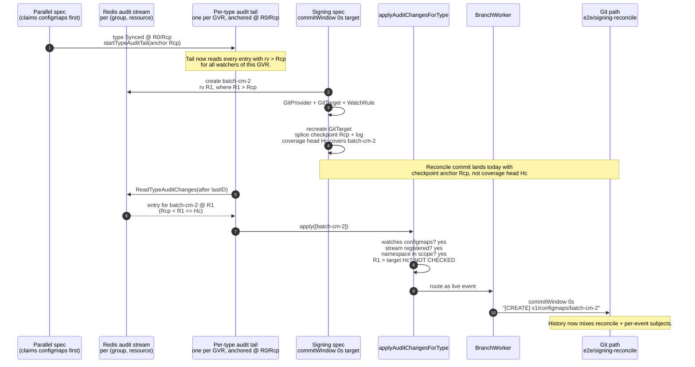
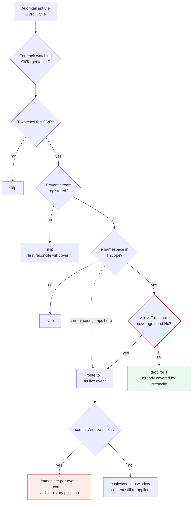
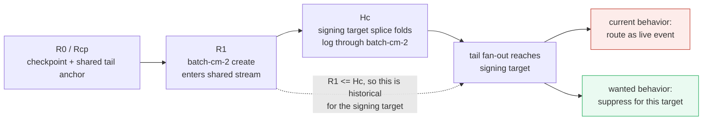
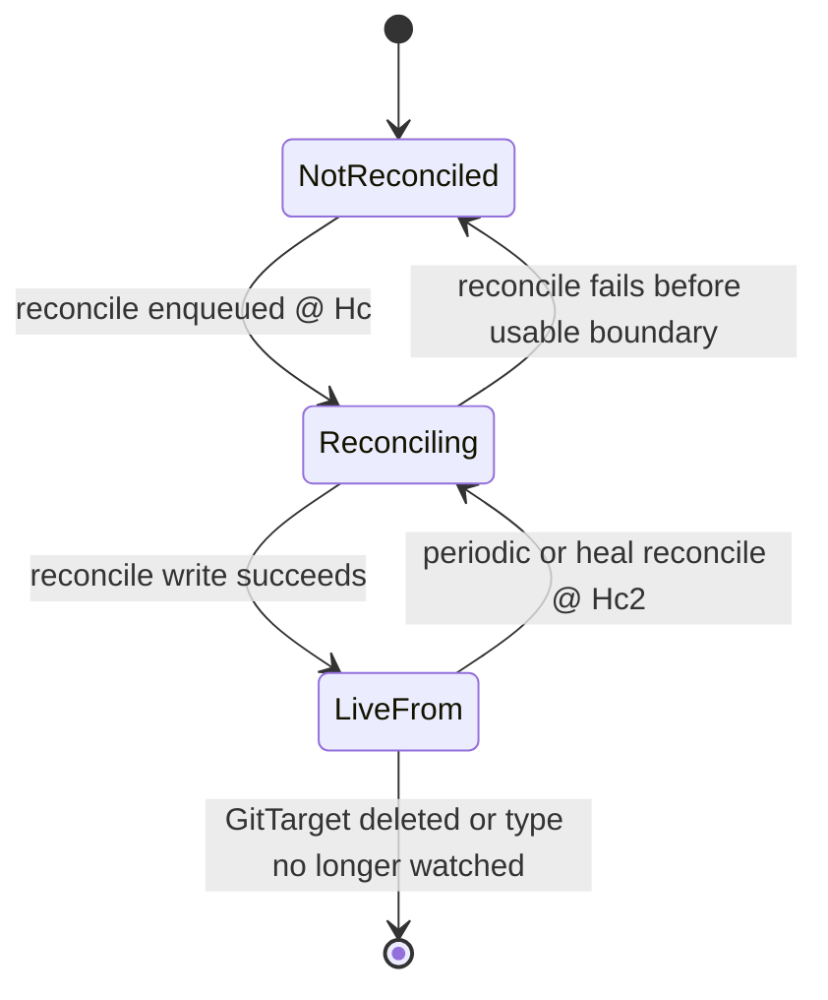
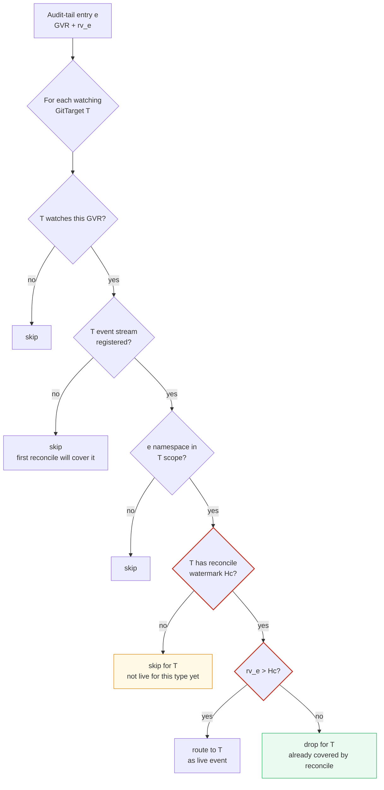
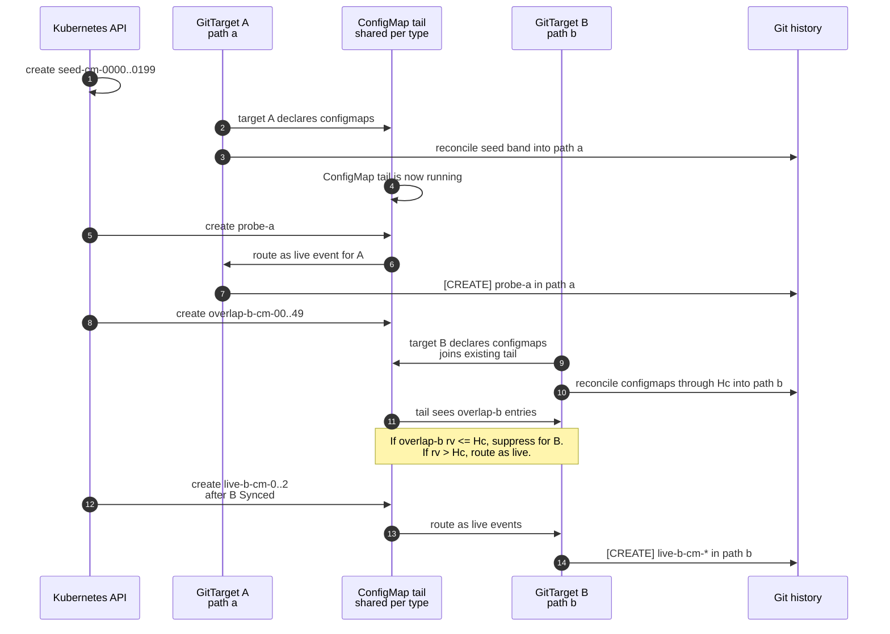
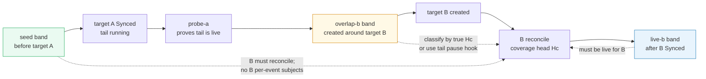

# Signing reconcile E2E failure: per-type tail replay creates event commits

> **finished** — shipped or closed. Kept for context only; **nothing here binds**. For current behaviour see [`../spec/`](../spec/). Index: [`../INDEX.md`](../INDEX.md)

> Status: investigation note. The chosen fix is a per-target coverage watermark.
> Captured 2026-06-12, refreshed 2026-06-13 after the materialization-healing and
> GitTarget status work landed.
>
> Context: GitHub Actions run
> [27377310456](https://github.com/ConfigButler/gitops-reverser/actions/runs/27377310456),
> attempt 1, commit `113b4bc0224cfc0e5f900e38f877b8676828dfe9`.
>
> Related:
> [materialization-tail-and-live-readiness-review.md](materialization-tail-and-live-readiness-review.md)
> (Gap 2 / Rec 2),
> [github-e2e-per-type-tail-failure-investigation.md](signing-snapshot-tail-replay-failure-investigation.md).
>
> Scope: why a reconcile-only signing path can still receive per-event commits,
> and how the per-target coverage watermark should close that gap.

## 1. Executive Summary

The failed run did not reproduce the earlier CommitRequest `NoOpenWindow`
failure. The visible problem was different: a signing E2E path expected only
reconcile commits, but its Git history also contained normal per-event subjects
such as:

```text
e2e-reconcile: synced 1 v1/configmaps@1331 to signing-reconcile-dest
e2e-reconcile: synced 6 v1/secrets@1412 to signing-reconcile-dest
[CREATE] v1/secrets/signing-key-batch
e2e-reconcile: synced 4 rbac.authorization.k8s.io/v1/rolebindings@1490 to signing-reconcile-dest
[CREATE] v1/configmaps/batch-cm-2
```

The reconcile path itself worked: it produced type-scoped, revision-pinned
reconcile commits. The extra commits came from the **type-global audit tail**,
which replayed entries into a GitTarget after that GitTarget registered. Because
the signing GitProvider uses `commitWindow: 0s`, every delivered tail event became
an immediate per-event commit.

This is a **target-local freshness** bug. A type-global tail can route an audit
entry that predates a GitTarget's active watch relationship into that GitTarget
as if it were live for that target.

Current state in code:

- The type-healing work is implemented: later `TypeSynced` events re-fan as
  deferred `Heal` reconciles instead of being skipped.
- The GitTarget status work is implemented: `Ready` is the control-plane axis,
  `Synced` is the data-plane axis, and the roll-up buckets on serviceability.
- The signing history-shape bug is still present: `applyAuditChangesForType`
  routes by membership, stream registration, and namespace scope only. It does
  **not** check whether the tail entry is newer than the target's own coverage
  watermark.

## 2. Expected Behavior

The signing test builds a reconcile-only situation:

1. Create `batch-cm-0`, `batch-cm-1`, and `batch-cm-2` before the relevant
   WatchRule is active.
2. Create a signing GitProvider with:
   - `commitWindow: "0s"`;
   - a custom per-event template such as `[{{.Operation}}] ...`;
   - a custom reconcile template such as
     `e2e-reconcile: synced {{.Count}} {{.APIVersion}}/{{.Resource}}@{{.Revision}} to {{.GitTarget}}`;
   - `generateWhenMissing: true`, which creates the signing key Secret.
3. Create the GitTarget and WatchRule.
4. Recreate the GitTarget to force a fresh reconcile batch.
5. Assert that the Git history for the target path contains no subject with `[`,
   because `[` identifies the per-event template.

The intended distinction is:

| Input shape | Expected path into Git | Expected subject |
|---|---|---|
| Resources that already exist when the target/rule becomes active | Reconcile/backfill splice | `e2e-reconcile: synced N apiVersion/resource@RV to target` |
| New audit event after the target/rule is active | Live event tail | `[CREATE] ...` |

In other words, the pre-created ConfigMaps and generated signing Secret should
be represented by reconcile commits only. They should not later be replayed as
normal live events for the same GitTarget.

## 3. What Happened

The failed history shows both paths acting on the same logical objects:

| Evidence | Meaning |
|---|---|
| `e2e-reconcile: synced 1 ...` | A reconcile commit landed. |
| `e2e-reconcile: synced 6 ...` | Another type-scoped reconcile commit landed. |
| `[CREATE] v1/secrets/signing-key-batch` | The generated signing-key Secret was also committed through the live event path. |
| `e2e-reconcile: synced 4 ...` | A later reconcile corrected or re-folded state. |
| `[CREATE] v1/configmaps/batch-cm-2` | One of the pre-created ConfigMaps was also committed through the live event path. |

The failing assertion is therefore meaningful. Git content converged, but the
commit history was not reconcile-only.

## 4. Why the Event Commits Were Made

### 4.1 Code Path

1. `DeclareForGitTarget` drives an initial-backfill splice for newly claimed,
   already-Synced types and then starts the per-type audit tail
   ([internal/watch/materialization.go](../../internal/watch/materialization.go)).
2. `startTypeAuditTail` is idempotent per GVR. If a tail is already running for
   the type, a later GitTarget joins the existing shared tail; the existing tail
   keeps its cursor.
3. `applyAuditChangesForType` fans every audit-tail batch to every current
   GitTarget that watches that GVR and has a registered event stream
   (internal/watch/audit_tail.go).
4. That fan-out checks:
   - the GitTarget watches the GVR;
   - the GitTarget's event stream is registered;
   - the event namespace is in the target's scope.
5. It does **not** check whether the audit entry is newer than this GitTarget's
   own coverage watermark.
6. With `commitWindow: 0s`, the branch worker finalizes every delivered live
   event immediately as its own commit.

So the extra commits were not produced by the reconcile path. They were produced
by the normal event path after the type-global tail replayed entries that were
old for this newly active target.

### 4.2 Why This Is Cross-Test By Nature

The per-type stream is keyed by `(group, resource)` and the tail by GVR. The
fan-out walks all watched-type tables, so a tail started by one GitTarget's
activation delivers to another GitTarget that later watches the same GVR in
scope.

`configmaps` and `secrets` are claimed by many parallel specs. A shared tail can
therefore be anchored before this signing test creates its batch objects. Those
objects enter the shared stream above the tail's anchor, the tail reads them, and
the fan-out later hands them to the signing target after the signing target has
already reconciled them.



## 5. The Watermark Mismatch

There are two kinds of watermarks in play:

- **Type-global watermarks**: the tail's anchor (`auditTailAnchor`) and the log
  trim cursor (`trimTypeAuditLog`). These bound what is available in the shared
  stream for the type.
- **Target-local watermark**: the coverage head a specific GitTarget's reconcile
  actually covered (`Hc` below). This determines whether an entry is historical
  or live for that target.

The fan-out currently gates only on membership and scope. It does not enforce the
target-local coverage head. A recreated or late-registering target can have a
reconcile that folds log entries ahead of the shared tail cursor, so entries in
`(tail anchor, Hc]` get applied twice:

1. once by that target's reconcile;
2. once by the tail as a live per-event commit.

The coverage head is **not** the value currently printed as the reconcile
revision. Today `RedisTypeSplicer.SpliceType` reads checkpoint `Rcp`, folds every
audit-log entry strictly after `Rcp` to the stream head, and returns `Rcp`.
`SpliceSnapshotForType` then places that value in `snapshot.Revision`, which
becomes the resync request revision and the `@{{.Revision}}` commit-message
value. That value identifies the checkpoint anchor, not the full set of API
events the reconcile folded.

The freshness gate must therefore use:

```text
Hc = full stream position of the highest folded audit-log entry
   = the last entry the splice's "(Rcp +" XRANGE returned,
     or "<Rcp>-<maxseq>" (the top of the checkpoint rv) when nothing was folded
```

When no log entries are folded, `Hc` is the top of `Rcp`. When entries are
folded from the audit log, `Hc` is the head of that fold. Using `Rcp` as the
target watermark would reproduce the bug for exactly the common case where the
desired set came from checkpoint `Rcp` plus log entries in `(Rcp, Hc]`.

**`Hc` is a full Redis stream position `<rv>-<seq>`, not a bare resourceVersion.**
The per-type audit stream uses `<rv>-<seq>` IDs precisely because distinct entries
can share an `rv`: an rv-less event (a DELETE or `Status` body with no extractable
resourceVersion) is ingested attached to the stream's high-water as `<rv>-<seq>`,
and duplicate or genuinely same-`rv` writes get fresh sub-sequences. If the gate
compared bare `rv` with `>`, it would do one of two wrong things at the boundary
`rv`:

- gating on the checkpoint `Rcp` re-delivers the post-checkpoint log entries the
  reconcile already folded (the original bug);
- gating on the bare `rv` of `Hc` (e.g. suppressing every `rv <= 124`) would
  **suppress a legitimate same-`rv` live entry that arrived after the fold** — for
  example an rv-less DELETE that landed at `124-7` when the fold head was `124-3`.
  That silently drops a live event and leaves a file wrong until the next heal,
  which §7.3 flags as the more dangerous failure.

Comparing full stream positions is exact: the splice's XRANGE has no count bound,
so every entry in `(Rcp, head]` is folded, and therefore an entry at stream
position `id <= Hc` was covered by this reconcile while `id > Hc` is genuinely
later. This matches the existing tail anchor, which already treats the checkpoint
as `Rcp-<maxseq>` rather than a bare `Rcp`. The RV-only examples below are
illustrative of the band logic; the implementation compares `(rv, seq)`.

Concrete examples:

| Example | Checkpoint `Rcp` | Folded audit-log RVs | Desired set after splice | Coverage head `Hc` |
|---|---:|---|---|---:|
| No new log entries | `100` | none | checkpoint objects at `100` | `100` |
| One create after checkpoint | `100` | `117 create cm-a` | checkpoint objects + `cm-a` | `117` |
| Several changes after checkpoint | `100` | `117 create cm-a`, `121 update cm-b`, `124 delete cm-c` | checkpoint, plus `cm-a`, updated `cm-b`, without `cm-c` | `124` |
| Re-anchored checkpoint already includes the object | `150` | none | checkpoint objects at `150` | `150` |

The leak happens in the second and third rows if the target watermark is set to
`Rcp` instead of `Hc`:

| Audit-tail entry | If watermark is `Rcp=100` | If watermark is `Hc=124` |
|---|---|---|
| `117 create cm-a` | `117 > 100`, routed as live, duplicate commit | `117 <= 124`, suppressed as already reconciled |
| `121 update cm-b` | `121 > 100`, routed as live, duplicate commit | `121 <= 124`, suppressed as already reconciled |
| `130 create cm-live` | `130 > 100`, routed as live | `130 > 124`, routed as live |



The missing implementation is the `G4` gate. Everything above it already exists.

The same mismatch as a timeline:



## 6. Reconciliation With the Readiness Review

The readiness review's
[Rec 2 "Implementation note (landed)"](materialization-tail-and-live-readiness-review.md)
explicitly declined to add a per-`(GitTarget, type)` tail-delivery gate:

> The broader "tail does not *deliver* to an un-backfilled target" per-target gate
> was deliberately **not** added... tracking per-(GitTarget, type) tail-delivery
> state to gate that narrow, self-healing window is not worth the new state and the
> risk of dropping legitimate events.

That decision addressed a different failure mode:

| | Review Gap 2 / Rec 2 | This signing failure |
|---|---|---|
| Scenario | Initial backfill failed or was missing | Initial backfill succeeded |
| Tail effect | Fills a missing file | Adds a redundant event commit for an object already reconciled |
| Why "benign"? | File content converges | File content converges, but history shape is wrong |
| Harm | Usually none | Visible `[CREATE] ...` subject in a reconcile-only path |

The review's benignity argument is about file content. This failure is about
commit shape. An idempotent upsert can still produce a per-event commit subject
when `commitWindow == 0s`.

Neither landed recommendation closes this exact path:

- **Rec 1: deferred heal** restores periodic full correction without stealing an
  open commit window. It does not change what the tail delivers.
- **Rec 2: retry + withhold tail-start on failed initial backfill** fixes the
  failed-backfill hole. It does not stop an already-running type-global tail from
  delivering historical entries to a later target.

So this is a target-local freshness fix, not a forgotten implementation step.
The decision below records the chosen behavior.

## 7. Decision: Per-Target Coverage Watermark

Use an explicit watermark for each `(GitTarget, GVR)`:

```text
targetTypeWatermark[GitTarget, GVR] = Hc
```

`Hc` is the full stream position (`<rv>-<seq>`) this GitTarget's reconcile for
that type has covered. It is the splice coverage head: the last entry the splice
folded, or the top of the checkpoint rv (`<Rcp>-<maxseq>`) when nothing was
folded.

Tail fan-out then becomes target-local, comparing full stream positions:

```text
For audit-tail entry e at stream position id_e:
  id_e <= Hc  => historical for this target; suppress
  id_e > Hc   => live for this target; route as a per-event write
```

The comparison is by `(rv, seq)`, not bare `rv` (see §5): an entry that shares
`Hc`'s `rv` but has a higher `seq` arrived after the fold and is live.

This is the clean model because it matches the contract directly. A type-global
tail can stay type-global, but delivery is only live relative to a specific
GitTarget's reconcile boundary.

This requires a code change at the splice boundary. `SpliceType` should expose
both the checkpoint RV and the coverage head. The checkpoint RV can keep serving
callers that need checkpoint identity or commit-message continuity; the
watermark gate must use the coverage head. Do not wire `snapshot.Revision`
straight into the watermark unless `snapshot.Revision` has first been changed to
mean coverage head.

### 7.1 State Model

Each `(GitTarget, GVR)` should have a small lifecycle:

| State | Meaning | Tail delivery |
|---|---|---|
| `NotReconciled` | The target watches the type, but no reconcile boundary is known yet. | Suppress; the first reconcile owns history. |
| `Reconciling(Hc)` | A reconcile for this target/type through coverage head `Hc` has been enqueued and is in flight. | Suppress entries `rv <= Hc`; route entries `rv > Hc`. |
| `LiveFrom(Hc)` | The reconcile through `Hc` has landed or the system has accepted it as the active boundary. | Suppress entries `rv <= Hc`; route entries `rv > Hc`. |

The important point is that the watermark is **target-local**, not only
type-local. Two GitTargets can watch the same `v1/configmaps` stream and have
different reconcile boundaries. The underlying coverage head is type-global for
one splice, but each target needs its own "has reconciled this type through Hc"
state because targets join, delete, recreate, and re-declare at different times.



### 7.2 Fan-Out Gate

`applyAuditChangesForType` should keep the existing checks and add the
target-local RV gate:



### 7.3 Lifecycle Rules

Implementation should keep the lifecycle boring and explicit:

1. When a GitTarget starts watching a type, initialize that `(GitTarget, GVR)` as
   `NotReconciled`.
2. When the reconcile planner/splicer determines coverage head `Hc`, enqueue the
   reconcile write and move the entry to `Reconciling(Hc)`.
3. While `Reconciling(Hc)`, tail events at `rv <= Hc` are historical for that
   target and must not become per-event commits.
4. Tail events at `rv > Hc` are live for that target and may be routed.
5. When the reconcile write succeeds, move to `LiveFrom(Hc)`.
6. On a later periodic or heal reconcile through `Hc2`, update the watermark to
   `Reconciling(Hc2)` and then `LiveFrom(Hc2)` after success.
7. When the GitTarget is deleted, recreated, changes its watched type set, or no
   longer watches the GVR, clear the stale `(GitTarget, GVR)` state.

If the implementation cannot distinguish a failed reconcile write from a
successful one at the place where the watermark is updated, be conservative: keep
the state in `Reconciling(Hc)` and rely on the next reconcile/heal to make the
target correct. Do not convert historical entries into event commits just to
paper over a failed reconcile.

The update from `NotReconciled` to `Reconciling(Hc)` must happen only after the
scoped reconcile has been enqueued, and it must be synchronized with
`applyAuditChangesForType`. That gives the worker queue a happens-before edge:
the reconcile write is already in the target's queue before the tail can observe
`Hc` and route `rv > Hc` events behind it.

Watermarks should advance monotonically per `(GitTarget, GVR)` while a boundary is
held; they must never move backward to an earlier stream position while still
claiming to be a boundary. Clearing the boundary outright — resetting to `NotReconciled` on a failed
or recreated reconcile (the `Reconciling -> NotReconciled` transition above) — is
the safe exception, not a violation: with no boundary the gate suppresses every
tail entry rather than over-routing, and the next reconcile/heal re-establishes
one. A stale-high watermark is more dangerous than this bug: it can suppress a
legitimate live event and leave a file missing until the next heal. The guardrails
are:

- never reuse a watermark across GitTarget delete/recreate; clear it alongside
  `ForgetGitTargetDeclaration`;
- never advance a watermark from an uncertain or unparsable stream position;
- once a target has a usable boundary, prefer routing over suppressing when the
  comparison cannot be made safely;
- rely on the periodic/heal reconcile as the backstop for a wrongly suppressed
  event, but treat that as a safety net rather than the normal path.

On controller restart, in-memory watermarks are lost. That should degrade to
`NotReconciled`: tail delivery to each target/type is suppressed until the boot
reconcile re-establishes `Reconciling(Hc)` / `LiveFrom(Hc)`. Multi-pod HA for
this state is out of scope here, consistent with the existing HA deferral around
claim state.

### 7.4 Worker Ordering

The watermark gate controls freshness, but the branch worker still controls write
ordering. A live event with `rv > Hc` must not be allowed to enqueue before the
scoped reconcile through `Hc`; otherwise the later reconcile's mark-and-sweep
could remove or rewrite the live event and the tail would have to recreate it.

The intended ordering is:

```text
splice desired set through Hc
enqueue scoped reconcile @ Hc
publish targetTypeWatermark[GitTarget, GVR] = Reconciling(Hc)
tail may now route rv > Hc for this target/type
```

Because both scoped reconciles (`EnqueueResync`) and per-event writes (`Enqueue`)
push onto the same single FIFO `eventQueue` the branch worker drains, that sequence
keeps live writes behind the reconcile that made the target live for the type —
the ordering is a property of the shared queue, not an assumption about relative
goroutine timing.

### 7.5 Alternatives Considered

Three alternatives were considered and rejected:

| Alternative | Why not |
|---|---|
| Loosen the signing E2E assertion | This drops the useful guarantee that pre-existing resources appear as reconcile commits, not per-event commits. |
| Use only the shared type checkpoint RV | This is smaller, but it is not the real boundary. The real question is whether **this GitTarget** has reconciled **this type** through `Hc`. |
| Suppress empty-diff commits in the worker | This may hide the visible `[CREATE]` subject when the tail re-applies byte-identical content, but it does not stop redundant routing, does not fix ordering hazards, and weakens the reconcile-only history guarantee rather than modeling it. |

## 8. Regression Tests to Add

Use a red-first approach. Add the failing regression first, run it against the
current code, and verify that it produces the wrong history shape: target B gets
at least one per-event `[CREATE] ...` subject for an object that should have been
covered by its reconcile. Only then add the per-target watermark gate and turn
the test green.

Start with a deterministic unit or integration test for the newly registered
target case:

1. A type already has a running tail anchored at `R0`.
2. An audit entry for `configmaps/batch-cm-2` exists in the type stream at
   `R1`, where `R0 < R1`.
3. `SpliceType` reads checkpoint `R0`, folds the audit log through `R1`, and
   exposes coverage head `Hc == R1`.
4. A new GitTarget starts watching ConfigMaps and its initial reconcile is
   enqueued with watermark `Hc`.
5. The reconcile commit includes the object.
6. The tail must not route the `R1` entry to that GitTarget as a per-event write.

This test must not use the current reconcile commit subject as the boundary
unless the message data has explicitly been changed to expose the coverage head.
Today `@{{.Revision}}` is the checkpoint RV, not `Hc`.

### 8.1 E2E Shape

> **Follow-up (2026-06-15):** the content-convergence claim below ("Present eventually … regardless
> of which path delivers it", step 8) was observed to **break** — one `overlap-b` object was
> permanently absent under target B. See
> [`signing-overlap-band-coverage-drop-investigation.md`](signing-snapshot-tail-replay-failure-investigation.md).

A ConfigMap E2E is useful, but it should be framed as a user-path guard, not as
the only proof of the watermark logic. The red-first proof should be the
deterministic unit/integration test above. A full e2e cannot strictly classify
the middle overlap band unless either:

- the true coverage head `Hc` is externally observable; or
- the test can pause the type tail after it has read overlap entries but before
  it fans them out to GitTargets.

Without one of those, an e2e can accidentally assert the wrong thing: an
`overlap-b` object not yet ingested/folded when B splices is legitimately live
for B, while an object already read and fully delivered to A before B exists will
not be replayed to B by the same tail cursor. Both outcomes are correct, but
neither gives a crisp red-first signal.

Use one namespace, one signing GitProvider with `commitWindow: "0s"`, and two
GitTargets that both track `v1/configmaps` into different paths:

| Target | Purpose | Path |
|---|---|---|
| `cm-load-a` | Starts the shared ConfigMap tail and proves the type is already active. | `e2e/signing-overlap/a` |
| `cm-load-b` | Joins the existing tail later and must suppress historical tail events. | `e2e/signing-overlap/b` |

Proposed object bands:

| Band | Creation time | Example names | Expected in target B | Expected target B commit subjects |
|---|---|---|---|---|
| `seed` | Before target A exists | `seed-cm-0000` ... `seed-cm-0199` | Present after B reconcile | No `[CREATE] .../seed-cm-*` |
| `overlap-b` | After target A's tail is proven live, immediately around target B creation | `overlap-b-cm-00` ... `overlap-b-cm-49` | Present eventually | Strict history assertion only with observable `Hc` or a tail pause hook |
| `live-b` | After target B is `Synced` | `live-b-cm-0` ... `live-b-cm-2` | Present eventually | `[CREATE] .../live-b-cm-*` |

Use a moderate `seedCount`, such as 100 or 200. The goal is to make the overlap
reproducible while keeping the normal e2e suite reasonable.

The test flow:

1. Create `seedCount` ConfigMaps in the test namespace.
2. Create signing provider `signing-overlap-load` with:
   - event template: `[{{.Operation}}] {{.APIVersion}}/{{.Resource}}/{{.Name}}`;
   - reconcile template:
     `e2e-reconcile: synced {{.Count}} {{.APIVersion}}/{{.Resource}}@{{.Revision}} to {{.GitTarget}}`.
3. Create target A and its WatchRule for ConfigMaps.
4. Wait for target A `Synced` and assert the seed files exist under path A.
5. Create one `probe-a` ConfigMap and wait until path A has a `[CREATE]` subject
   for it. This proves the shared ConfigMap tail is running before target B joins.
6. Create the `overlap-b` ConfigMaps and immediately create target B and its
   WatchRule. This widens the chance that B joins while the shared tail is still
   around the same entries, but it is not by itself deterministic.
7. Wait for target B `Synced`.
8. Assert all `seed` and `overlap-b` files exist under path B. Presence is
   deterministic regardless of which path delivers an `overlap-b` object
   (reconcile splice or live tail), so this content-convergence check is safe even
   when the commit-subject classification is not.
9. Assert path B history has no per-event subject for `seed`.
10. If `Hc` is observable, classify each `overlap-b` object by RV:
    - `rv <= Hc`: it was covered by B's reconcile, so path B must not contain a
      per-event subject for it;
    - `rv > Hc`: it was live for B, so a per-event subject is allowed.
11. If a tail pause hook is available, use it for a strict red-first e2e:
    pause ConfigMap tail fan-out after reading `overlap-b`, create target B,
    wait for B's reconcile to establish `Hc`, release the tail, then assert no
    path-B per-event subjects for `overlap-b`.
12. Create the `live-b` ConfigMaps after target B is `Synced` and assert path B
    receives per-event subjects for them.

Do not recover determinism by waiting for path A to commit every `overlap-b`
object before creating B. That proves the shared tail has already consumed the
entries before B exists, so the same tail cursor will not replay them to B. It is
stable, but it no longer tests the late-target fan-out bug. Also do not read the
boundary from the reconcile commit subject: today that is the checkpoint RV, not
the coverage head.



The same test as an RV timeline:



### 8.2 Pushback on the Timing Assumption

The intuitive rule "start watching only after the first reconcile commit is
finished" is close, but too tied to Git wall-clock time. The system should use
the audit-stream position boundary (rv-ordered, with the sub-sequence breaking
ties within an rv — see §5):

```text
For target B and ConfigMaps:
  id <= Hc  => historical for B; reconcile owns it
  id > Hc   => live for B; tail may route it
```

That means an event recorded while the reconcile commit is still being written
can still be a legitimate live event if its stream position is after `Hc` —
including a same-`rv` entry with a higher sub-sequence. The branch worker should
preserve write ordering, but the freshness decision itself belongs to the stream
position boundary, not to the moment the Git commit finishes.

Also, making the test too large can make failures noisy. Prefer a moderate
`seedCount` with strict RV/history assertions over a very large count that mostly
tests CI capacity.

## 9. Current Reconcile Message Surface

The message-template surface is not part of the open decision anymore. Current
reconcile commits already carry enough identity to make per-type history readable:

- reconcile message data includes `Group`, `Version`, `Resource`, `APIVersion`,
  and `Revision`;
- the default subject names the resource and pins the last resourceVersion;
- custom signing tests can use the fully qualified form:

```text
e2e-reconcile: synced {{.Count}} {{.APIVersion}}/{{.Resource}}@{{.Revision}} to {{.GitTarget}}
```

That implemented surface is useful context for this investigation because it
makes the duplicate path visible: reconcile commits name the type and revision,
while accidental tail commits still show up as per-event subjects such as
`[CREATE] v1/configmaps/batch-cm-2`.
