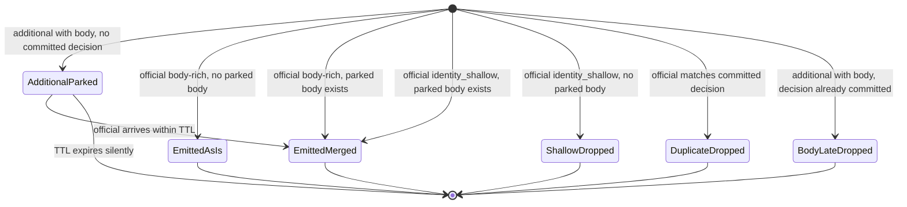

# Design: audit ingestion hardening

> Status: design — implemented in the same change set.
> Date: 2026-05-14
> Implemented baseline: [Audit Ingestion Pipeline](../architecture.md#audit-ingestion-pipeline).

## What changes and why

The shipped joiner parks both additional bodies *and* shallow officials. The official-parking
branch has two real problems:

1. **It breaks stream ordering on the official channel.** When official A arrives shallow and
   gets parked, then official B arrives complete and emits, then A's body arrives and A
   finally emits — the canonical stream order is B → A. For two events targeting the same
   object that's wrong.
2. **Its terminal failure is silent.** A parked official whose body never arrives just
   TTL-evicts and disappears. The headline design promise "no silent shallow writes" only
   holds with extra observability work (a sweeper) that we'd rather not pay for.

This change drops the official-parking branch. Officials emit synchronously. A shallow
official with no matching parked body is immediately counted as lost and logged. We rely on
the assumption below to keep merges working.

The change also bundles four small cleanups whose value only becomes obvious once the joiner
shrinks.

## Assumption: additional arrives before official

Events posted to `/audit-webhook-additional` for an `auditID` reach gitops-reverser before
the corresponding kube-apiserver event for the same `auditID`.

**Rationale.** `apiservice-audit-proxy` emits in line with the request. kube-apiserver's
audit webhook batches with `--audit-webhook-batch-max-wait` (default 30s). In the steady
state the proxy has a margin of seconds to minutes.

**Verification.** Confirm `apiservice-audit-proxy` does not implement its own batching. This
is the only realistic way the assumption breaks. Out of scope for this change set; tracked
as a verification step against the proxy source.

**Failure modes if violated.**

| Failure | New design | Shipped design |
| --- | --- | --- |
| Proxy unreachable during request | Immediate shallow drop + metric + log | Silent TTL expiry |
| Late additional after gitops-reverser blip | `body_late` + drop | `body_late` + drop |
| Proxy batches internally | Shallow drops where shipped design would merge | Merges (with broken ordering) |

The third row is the cost. The first row is an improvement (loss surfaces immediately
instead of silently after `body-ttl`). The second row is unchanged.

## Result: simplified joiner



`audit:body:v1:<auditID>` now holds only proxy-side body contributions. Orphan bodies (no
matching official ever arrives) expire silently on Redis TTL — we **accept** that visibility
loss for simplicity. The mitigation is the alert on `audit_join_body_late_total` and
operator awareness of the proxy/official deployment match.

## Code cleanups bundled in this change

These were tracked separately but only become obvious once the joiner shrinks:

1. **Classify quality once.** The handler classifies in the no-joiner path; the joiner
   classifies again inside `Decide`. Move classification into the handler, pass the result
   to `Decide`. One source of truth.
2. **`body_late` only fires when the decision is committed.** Today it fires when the
   decision key exists regardless of state. Inspect the decision envelope; `state=emitted`
   → `body_late`; `state=claimed` → `duplicate_dropped{reason="in_flight_claim"}`.
3. **Drop the `processed` label** on `audit_events_received_total`. The label was only ever
   set from `Subresource != "status"` and is meaningless next to the quality and join
   metrics. Dashboards switch to `audit_event_quality_total`.
4. **Drop unused envelope fields.** `AuditBodyEnvelope.Source` and `Event` only existed to
   support parking shallow officials. Both removed.

## Metrics after the change

Re-export and now actually drive:

| Metric | When |
| --- | --- |
| `gitopsreverser_audit_shallow_dropped_total{gvr, action}` | Synchronous, in the joiner when an identity-shallow official finds no parked body |

Removed:

| Metric | Reason |
| --- | --- |
| `gitopsreverser_audit_join_body_miss_total` | Replaced by `audit_shallow_dropped_total`; same intent, clearer name |

Not re-exported (deliberately):

| Metric | Reason |
| --- | --- |
| `gitopsreverser_audit_join_body_orphan_total` | Requires a sweeper to drive; we accept silent TTL expiry instead |

Unchanged:

`audit_events_received_total` (minus `processed`), `audit_event_quality_total`,
`audit_join_parked_total`, `audit_join_emitted_total`,
`audit_join_duplicate_dropped_total{reason}`, `audit_join_body_late_total`.

## Operator log on shallow drop

Single WARN line, copy-pasteable remediation, at the joiner boundary:

```
audit shallow event dropped: install apiservice-audit-proxy or update kube-apiserver
audit policy to include request/response bodies (auditID=<id> gvr=<g/v/r> verb=<verb>)
```

Structured fields: `auditID`, `gvr`, `verb`, `source`, `quality`, `hasRequestObject`,
`hasResponseObject`. Rate-limiting deferred until real flood data exists.

## Tests added in this change

- Shallow official with no parked body → immediate drop + `audit_shallow_dropped_total`
  increments + WARN log emitted.
- Shallow official with parked body → still merges (no change, existing coverage).
- `body_late` increments only when the decision is `emitted`; `claimed` state increments
  `duplicate_dropped`.
- `quality=collection` survives joiner → stream → consumer with the full `*List` body
  preserved in the stream entry.

## Open questions

- Verify `apiservice-audit-proxy` does not batch internally. If it does, we either push back
  on the proxy or reintroduce an ordering-preserving official-park path (separate design).
- Rate-limit the shallow-drop log per `(gvr, verb)`? Defer until flood data exists.
