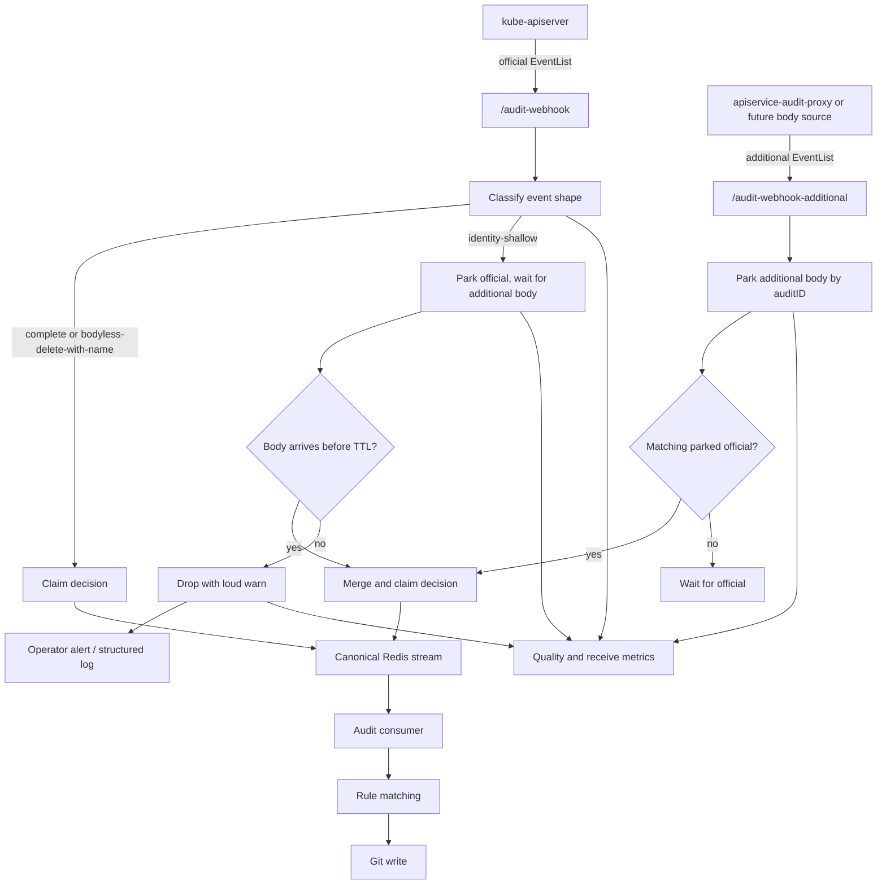
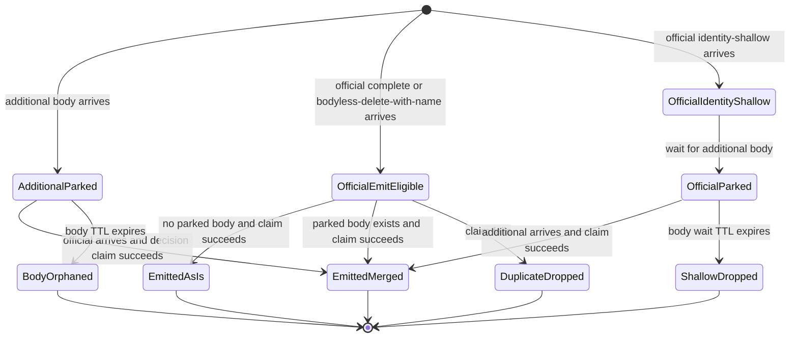
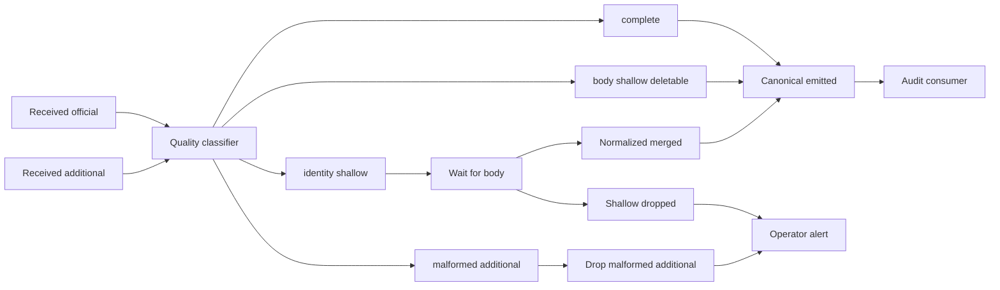

# Design: audit ingestion quality and simplification

> Status: future design
> Date: 2026-05-08
> Builds on:
> [audit event body parking implementation](../design/audit-event-body-parking-implementation.md)
> and [original body parking design](design-audit-event-body-parking.md).

## Original prompt that led to this document

> Can you recognize a "shallow" event now with all the information that you have available
> (I guess it's just a matter of seeing that some objects are not filled)? Can you warn
> specifically on it so that operators can be notified that they should be installing the
> apiservice-audit-proxy (or excluding the shallow events from their audit Policy).
>
> Any event that is sent to `/audit-webhook-additional` is to be handled as eligible for body
> parking: I would like to drop the `--audit-event-body-parking-api-groups` setting.
>
> I also would like to have more clarity on what we are achieving with this ingestion pipeline:
>
> 1. Full trust in who did what in Kubernetes. You can use this as a high-quality audit tool.
> 2. A stream with unique audit IDs — we make sure that events are deduplicated.
> 3. A stream without shallow events — we drop them, or we normalize them (which we only can do
>    if we also receive `audit-webhook-additional` calls in time).
> 4. Full visibility on how the stream is behaving: how many things do we dedup, do we get all
>    bodies from `audit-webhook-additional` in time, etc. Basically metrics; eventually a live
>    picture on the exact numbers/information flowing through these channels.
> 5. Easy setup: we should not ask users to configure difficult settings themselves. Only knobs
>    that genuinely change audit semantics should remain.

## Summary

The first body-parking implementation removed duplicate canonical events for the same `auditID`
and restored bodies for aggregated API requests when `/audit-webhook-additional` contributes a
matching payload in time. It is correct but exposes too much of the internal mechanism, and it
keeps a silent low-quality fallback in the consumer that produces stub Git writes from shallow
audit events.

This iteration proposes five concrete changes:

1. Remove `--audit-event-body-parking-api-groups`. Anything sent to `/audit-webhook-additional`
   is treated as a body source.
2. Remove `--audit-event-join-mode` and the `first` mode. Official is always the authority.
3. Make shallow detection a first-class classification of event shape, with an explicit delete
   carve-out so bodyless deletes with a complete `objectRef` are still emitted.
4. Drop identity-shallow events unconditionally with a loud, single-line operator warning.
   No `observe`/`complete-preferred`/`complete-required` policy split. No degraded side-stream.
5. Replace the silent stub fallback in
   [redis_audit_consumer.go:476-484](../../internal/queue/redis_audit_consumer.go#L476-L484) with
   an explicit drop-and-log. Today the consumer hides shallow events from operators by emitting
   a minimal `apiVersion+kind+namespace+name` stub straight into the Git pipeline.

The product promise becomes simple: high-quality audit identity, unique audit IDs, no shallow
Git writes, and setup that does not require API-group bookkeeping.

## What we want

1. **Trustworthy audit identity.** The official kube-apiserver audit event is the authority for
   who did what, when, and what status was returned.
2. **Unique canonical stream.** Within the decision TTL, one `auditID` produces at most one
   canonical event.
3. **No shallow canonical events.** A shallow event is normalized by a matching additional body
   or dropped with a warning. It does not silently produce a stub Git write.
4. **High visibility.** Operators see counts for received events, parked bodies, dedupe
   decisions, shallow drops, join latency, body misses, late bodies, and orphan bodies.
5. **Easy setup.** Users choose deployment intent, not low-level parking mechanics.

## Current shortcomings

- `--audit-event-body-parking-api-groups` makes operators maintain an allowlist that drifts as
  aggregated APIs are installed and removed.
  See [audit_joiner.go:212-223](../../internal/webhook/audit_joiner.go#L212-L223).
- Shallow detection exists only indirectly inside
  [shouldParkOfficialUntilAdditional](../../internal/webhook/audit_joiner.go#L537-L545). It
  parks an allowlisted official event when there is no body and no `objectRef.Name`, but it is
  not a first-class quality state with metrics.
- `gitopsreverser_audit_join_body_unexpected_total` exists only because of the allowlist. With
  the allowlist gone, the metric goes away.
- `first` mode lets a proxy event become canonical
  ([audit_joiner.go:228-230](../../internal/webhook/audit_joiner.go#L228-L230)), which weakens
  the "official audit is authority" story for a small latency win.
- The consumer's
  [extractObject](../../internal/queue/redis_audit_consumer.go#L469-L492) emits a minimal stub
  when no body is present. That is the silent failure mode this design eliminates.
- There is no orphan-body metric. Parked additional bodies that expire without an official
  twin disappear silently via TTL.

## Recognizing shallow events

The classifier runs over the incoming `auditv1.Event` shape. A mutating `ResponseComplete`
event is **emit-eligible** if either of these holds:

- It has a `requestObject` or `responseObject`, **or**
- Its verb is `delete` and `objectRef` has both `Resource` and `Name`.

Otherwise it is shallow, with two sub-kinds:

| Quality | Condition | Treatment |
| --- | --- | --- |
| `complete` | request or response body present, `objectRef` complete | emit |
| `body_shallow_deletable` | no body, but `verb=delete` and `objectRef.Resource` and `Name` set | emit (delete carve-out) |
| `identity_shallow` | `objectRef` missing `Resource` or `Name` on a single-object verb | wait briefly for additional body, then drop |
| `malformed` | additional event without any body and without parked official twin | drop and count |

### The delete carve-out is load-bearing

A bodyless delete with full `objectRef` is kube-apiserver's normal shape for "I deleted X by
name." Treating it as shallow would lose deletes from Git history. The handler already has the
right rule today as
[allowsBodylessDelete](../../internal/webhook/audit_handler.go#L432-L437); the classifier
must mirror it.

### `deletecollection` is a known limitation

`deletecollection` does not carry a single `objectRef.Name`. The classifier marks it
`identity_shallow` until we design a real strategy for collection deletes. This document does
not solve that. Operators who care should currently exclude `deletecollection` from their
audit policy or accept the drop-with-warn.

## Proposed pipeline



## Proposed state machine



## Settings

### Remove

| Setting | Why |
| --- | --- |
| `--audit-event-body-parking-api-groups` / `auditEventJoin.bodyParkingAPIGroups` | The endpoint already encodes intent. Operators should not maintain allowlists. |
| `--audit-event-join-mode` and the `first` value | Only `wait-official` semantics remain. Removing the flag also removes the `mode` label on existing metrics. |

### Keep

| Setting | Why |
| --- | --- |
| `--audit-event-body-ttl` / `auditEventJoin.bodyTTL` | Operational TTL for parked payload bytes. Reused by both additional-body parking and official-shallow waiting. |
| `--audit-event-decision-ttl` / `auditEventJoin.decisionTTL` | Defines the dedupe window. |
| `--audit-additional-only` / `auditEventJoin.additionalOnly` | Genuinely changes audit authority semantics; must be explicit. |

### Add

Nothing user-facing. Shallow drop is unconditional and loud. If real users hit a case where
they want shallow events to keep flowing through, we add a single escape-hatch flag at that
point — not in advance.

## Metrics

The aim is to make the pipeline self-explanatory and to power a future live view.

| Metric | Type | Labels | Meaning |
| --- | --- | --- | --- |
| `gitopsreverser_audit_events_received_total` | counter | `source`, `gvr`, `action`, `user`, `processed` | Existing receive counter. Keep. |
| `gitopsreverser_audit_event_quality_total` | counter | `source`, `quality`, `gvr`, `action` | First-class shape classification: `complete`, `body_shallow_deletable`, `identity_shallow`, `malformed`. |
| `gitopsreverser_audit_join_parked_total` | counter | `parked_kind` | Count parked entries: `additional_body`, `official_shallow`. |
| `gitopsreverser_audit_join_emitted_total` | counter | `source`, `result` | Canonical emissions: `as_is`, `merged`, `additional_only`. |
| `gitopsreverser_audit_join_duplicate_dropped_total` | counter | `reason` | Duplicate drops from existing decision keys. |
| `gitopsreverser_audit_join_body_miss_total` | counter | `gvr`, `action` | Eligible official event emitted without a parked body in time. |
| `gitopsreverser_audit_join_body_late_total` | counter | `gvr`, `action` | Additional body arrived after the canonical decision was already emitted. |
| `gitopsreverser_audit_join_body_orphan_total` | counter | (none) | Parked additional body expired with no matching official event. |
| `gitopsreverser_audit_shallow_dropped_total` | counter | `kind`, `gvr`, `action` | Identity-shallow event dropped after the body wait window expired. |
| `gitopsreverser_audit_join_latency_seconds` | histogram | `result`, `gvr` | Time between first sibling arrival and canonical decision. |
| `gitopsreverser_audit_join_inflight` | gauge | `state` | Parked entries currently waiting: `additional_body`, `official_shallow`. |

Removed compared to today:

- `gitopsreverser_audit_join_body_unexpected_total` (allowlist drift no longer exists).
- `mode` label on `audit_join_emitted_total` and `audit_join_duplicate_dropped_total` (only one
  mode remains).

Suggested alerts:

- `audit_shallow_dropped_total` non-zero — operator misconfiguration; either install
  `apiservice-audit-proxy` or adjust the kube-apiserver audit policy.
- `audit_join_body_miss_total` above a small threshold when the proxy is expected.
- `audit_join_body_late_total` non-zero — TTLs or proxy latency may be too tight.
- `audit_join_body_orphan_total` sustained non-zero — additional source is disconnected from
  the official stream.
- `audit_join_duplicate_dropped_total` sudden spike — probable webhook retry storm.

## Audit policy and operator guidance

Shallow events almost always mean one of two things: kube-apiserver's audit policy did not
request bodies for that resource, or the request traversed an aggregated API path where
kube-apiserver cannot see the backend body.

For core resources, adjust the audit policy. See
[test/e2e/cluster/audit/policy.yaml](../../test/e2e/cluster/audit/policy.yaml).

For aggregated APIs, install `apiservice-audit-proxy` and point it at
`/audit-webhook-additional`.

The operator-facing log line emitted on each drop should be a single line with copy-pasteable
remediation. Example shape (do not split across lines in the implementation):

```text
WARN audit shallow event dropped: install apiservice-audit-proxy or update kube-apiserver audit policy to include request/response bodies (auditID=<id> gvr=<g/v/r> verb=<verb> source=<source>)
```

Structured fields the log entry must carry:

- `auditID`
- `gvr`
- `verb`
- `source`
- `quality`
- `objectRefName` (presence indicator)
- `hasRequestObject`
- `hasResponseObject`

## Dashboard shape



A live view should show events per second by source, quality split by source, parked entry
counts, join latency percentiles, emitted results, duplicate drops, shallow drops, and
orphan bodies.

## Implementation plan

1. Add a quality classifier near
   [hasAuditV1ObjectBody](../../internal/webhook/audit_handler.go#L424-L426). It must mirror
   [allowsBodylessDelete](../../internal/webhook/audit_handler.go#L432-L437) so bodyless
   deletes with a complete `objectRef` are classified `body_shallow_deletable` and emitted.
2. Make every additional-source event with a body eligible for parking; drop only those with
   no body and count them as `malformed`.
3. Remove the API-group allowlist:
   - [cmd/main.go](../../cmd/main.go) flag wiring
   - [charts/gitops-reverser/values.yaml](../../charts/gitops-reverser/values.yaml)
   - [charts/gitops-reverser/templates/deployment.yaml](../../charts/gitops-reverser/templates/deployment.yaml)
   - [config/deployment.yaml](../../config/deployment.yaml)
   - `BodyParkingAPIGroups` and `allowGroups` in
     [audit_joiner.go](../../internal/webhook/audit_joiner.go)
4. Remove `--audit-event-join-mode` and the `first` code path. Drop the `mode` label from
   join metrics.
5. Replace the silent stub fallback in
   [extractObject](../../internal/queue/redis_audit_consumer.go#L469-L492) with an explicit
   drop-and-log. The classifier in step 1 makes this safe by guaranteeing only emit-eligible
   events reach the consumer; the consumer-side drop is a defense-in-depth assertion.
6. Add the new metrics in
   [internal/telemetry/exporter.go](../../internal/telemetry/exporter.go); remove
   `AuditJoinBodyUnexpectedTotal`.
7. Add the orphan-body metric. A periodic sweeper or Redis keyspace-notification listener can
   count expirations of `audit:body:v1:<auditID>` that never had a paired official event.
8. End-to-end coverage:
   - additional-source event for a new API group parks and merges without configuration
   - additional-source event without a body increments `quality_total{quality="malformed"}`
     and is dropped
   - official `body_shallow_deletable` (delete with complete `objectRef`, no body) is emitted
     as-is
   - official identity-shallow normalized by a later additional body emits once
   - official identity-shallow with no additional body increments
     `audit_shallow_dropped_total` and is not enqueued
   - `deletecollection` follows the same identity-shallow drop path (call out as known
     limitation in docs)
9. Update setup docs and Helm README to describe deployment profiles
   (official-only, official-plus-proxy, additional-only) instead of body parking internals.

## Open questions

- Should the operator-facing warning be rate-limited per `(gvr, verb)` to avoid log floods on
  noisy clusters? Likely yes, but the rate-limit shape is a follow-up.
- Should `deletecollection` get a dedicated emit path that records "deleted by selector"
  without a per-object body? Out of scope here; tracked separately.
- Should the body-wait TTL for identity-shallow officials be shorter than the additional-body
  TTL in practice? We start with one shared TTL and only split if data shows we need to.

## Recommendation

Ship the five changes together: remove the allowlist, remove `first` mode, add the explicit
classifier with the delete carve-out, drop identity-shallow loudly, and replace the consumer's
silent stub fallback with an explicit drop-and-log. No new user-facing policy knob. We can
reconsider an escape-hatch if real operator feedback shows the unconditional drop is wrong for
some deployment.
