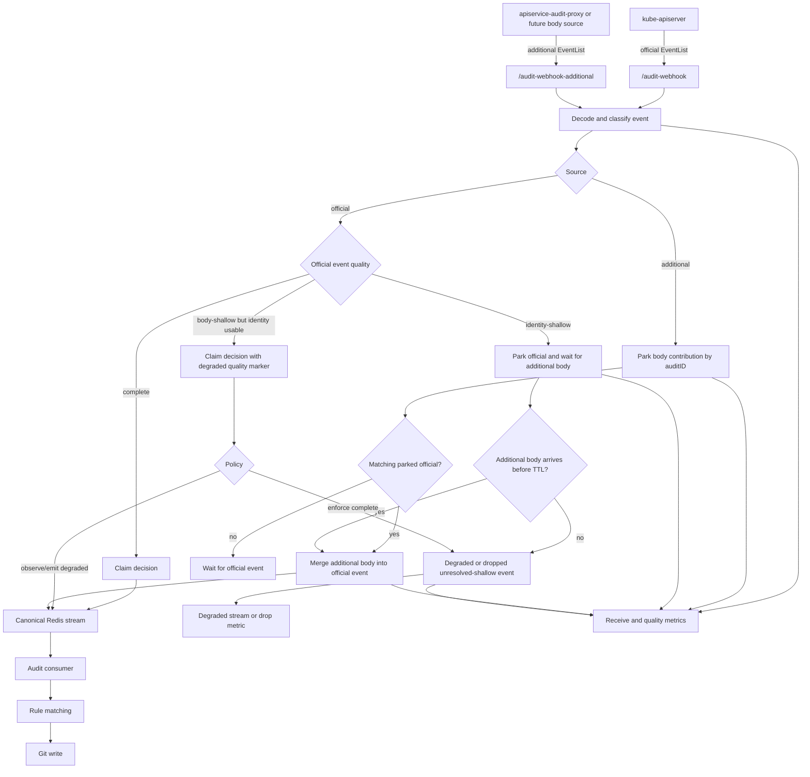
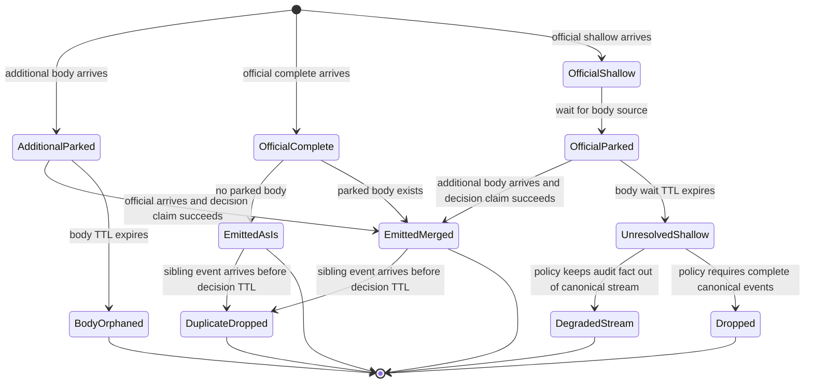
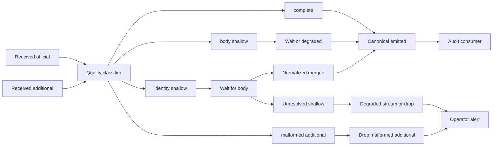

# Design: audit ingestion quality and simplification

> Status: future design
> Date: 2026-05-08
> Builds on:
> [audit event body parking implementation](../design/audit-event-body-parking-implementation.md)
> and [original body parking design](design-audit-event-body-parking.md).

## Summary

The current audit body parking implementation fixed the first correctness issue: duplicate
official/proxy events with the same `auditID` no longer both enter the canonical Redis stream.
It also restored request and response bodies for aggregated API requests when
`/audit-webhook-additional` contributes the missing payload in time.

The next step should simplify the mental model:

- `/audit-webhook` is the official source of audit authority.
- `/audit-webhook-additional` is always eligible as a body/completion source.
- The canonical stream should contain unique, usable audit events.
- Shallow events should be visible as an operational quality signal and should not quietly produce
  low-quality Git writes.
- Operators should not have to understand body parking internals to get a good default setup.

This document proposes removing the `--audit-event-body-parking-api-groups` knob, making shallow
event detection explicit, and adding quality metrics that can power alerts and a future live
ingestion dashboard.

## What We Want

GitOps Reverser should make these promises clear:

1. **Trustworthy audit identity.**
   The official kube-apiserver audit event remains the authority for who did what, when it happened,
   and what Kubernetes response status was returned.

2. **Unique canonical stream.**
   Within the decision TTL, one `auditID` should produce at most one canonical stream event.

3. **No shallow canonical events.**
   A shallow event should either be normalized by a matching additional body or diverted away from
   the canonical stream. It should not silently create a malformed or low-quality Git write.

4. **High visibility.**
   Operators should see counts for received events, parked bodies, dedupe decisions, shallow events,
   join latency, missed bodies, late bodies, and degraded/dropped events.

5. **Easy setup.**
   Users should choose deployment intent, not low-level parking mechanics. Knobs should remain only
   when they materially change audit semantics.

## Current Shortcomings

The current implementation is useful, but it exposes too much of the internal mechanism:

- `--audit-event-body-parking-api-groups` requires users to know which API groups need the proxy.
  That is fragile setup knowledge and causes allowlist drift.
- Shallow detection exists only indirectly. `shouldParkOfficialUntilAdditional` parks an allowlisted
  official event when it has no object body and no `objectRef.name`, but this is not a first-class
  quality state with dedicated metrics.
- `gitopsreverser_audit_join_body_unexpected_total` exists only because of the allowlist. If every
  additional endpoint event is eligible, this metric should be replaced by source-shape metrics.
- `first` mode exposes a low-level latency/correctness trade-off. It can make the proxy event the
  canonical event, which weakens the simple story that the official audit event is authoritative.
- There is no explicit unresolved-shallow path. If an official shallow event cannot be normalized in
  time, we need an intentional decision: emit degraded, drop from canonical, or move to a degraded
  side stream.
- There is no body orphan metric yet. The original design called out
  `gitopsreverser_audit_join_body_orphan_total`, but the implementation relies on TTL expiry only.

Relevant implementation links:

- [Audit joiner](../../internal/webhook/audit_joiner.go)
- [Audit handler](../../internal/webhook/audit_handler.go)
- [Telemetry exporter](../../internal/telemetry/exporter.go)
- [Redis audit queue](../../internal/queue/redis_audit_queue.go)
- [Audit consumer](../../internal/queue/redis_audit_consumer.go)
- [Helm values](../../charts/gitops-reverser/values.yaml)
- [E2E audit policy](../../test/e2e/cluster/audit/policy.yaml)

## Can We Recognize Shallow Events?

Yes, with the information currently available. We can classify an audit event from the event shape:

| Signal | Meaning |
| --- | --- |
| `requestObject == nil && responseObject == nil` | No body was captured. |
| `objectRef == nil` | The event cannot identify a Kubernetes object. |
| `objectRef.resource == ""` | The event cannot identify a resource type. |
| `objectRef.name == ""` on a single-object mutating event | The event cannot identify the object instance. |
| `verb in create/update/patch/delete/deletecollection` | The event can affect desired state. |
| `stage == ResponseComplete` | The event is the consumer-relevant final audit stage. |

This suggests two related classifications:

- **Body-shallow:** a mutating `ResponseComplete` event has neither `requestObject` nor
  `responseObject`.
- **Identity-shallow:** a mutating `ResponseComplete` event lacks enough `objectRef` data to route
  or write a specific object safely.

The operator-facing warning should be about both. A body-shallow event may still be usable for a
delete if `objectRef` is complete. An identity-shallow event is more severe because it can produce
an empty or wrong resource identity.

## Proposed Pipeline



## Proposed State Machine



## Remove the API Group Parking Knob

I agree with removing `--audit-event-body-parking-api-groups`.

The endpoint already carries the intent: anything sent to `/audit-webhook-additional` is an
additional audit body source. If an operator points an additional source at that endpoint, they are
asking GitOps Reverser to use it for body parking. Requiring an API group allowlist makes the setup
harder without adding much safety.

Current settings to remove:

- Manager flag: `--audit-event-body-parking-api-groups`
- Helm value: `auditEventJoin.bodyParkingAPIGroups`
- Config field: `RedisAuditJoinerConfig.BodyParkingAPIGroups`
- Internal allowlist fields and metrics tied to allowlist drift

Replacement behavior:

- All additional-source events with request or response bodies are parked or joined.
- Additional-source events without bodies are acknowledged and counted as malformed additional
  input.
- Official-source shallow detection is based on event shape, not API group.

## Pushback: Do Not Silently Drop Official Audit Facts

The goal "canonical stream without shallow events" is right, but there is a sharp edge: if a cluster
does not install `apiservice-audit-proxy`, dropping every unresolved shallow official event means
GitOps Reverser may erase real audit facts.

A safer rollout is:

1. **Observe first.**
   Detect and count shallow events, but keep current behavior for events that are still usable.

2. **Warn loudly.**
   Add metrics and logs that say: "This event is shallow; install `apiservice-audit-proxy` or adjust
   the audit policy if you expect complete bodies."

3. **Introduce an explicit quality policy only if needed.**
   If users truly want "no shallow canonical events," make that a named product-level choice, not a
   low-level joiner knob.

Recommended policy names:

| Policy | Canonical stream behavior | Intended user |
| --- | --- | --- |
| `observe` | Emit usable shallow events but mark/count them. | Default migration path and official-only clusters. |
| `complete-preferred` | Wait briefly for additional bodies, then emit degraded if still routeable. | Default long-term path. |
| `complete-required` | Divert unresolved shallow events away from canonical stream. | Strict audit quality deployments. |

This is one knob that does change audit semantics. It is easier to explain than API-group parking.

## Metrics Needed

These metrics should make the pipeline explain itself and later power a live view.

| Metric | Type | Labels | Meaning |
| --- | --- | --- | --- |
| `gitopsreverser_audit_events_received_total` | counter | `source`, `gvr`, `action`, `user`, `processed` | Existing receive counter; keep it. |
| `gitopsreverser_audit_event_quality_total` | counter | `source`, `quality`, `gvr`, `action` | Count `complete`, `body_shallow`, `identity_shallow`, `malformed`. |
| `gitopsreverser_audit_join_parked_total` | counter | `source`, `parked_kind` | Count parked `additional_body` and `official_shallow`. |
| `gitopsreverser_audit_join_emitted_total` | counter | `source`, `result`, `quality` | Count canonical emissions: `as_is`, `merged`, `degraded`, `additional_only`. |
| `gitopsreverser_audit_join_duplicate_dropped_total` | counter | `reason` | Count duplicate drops caused by existing decision keys. |
| `gitopsreverser_audit_join_body_miss_total` | counter | `source`, `gvr`, `action` | Official event expected a body but none arrived in time. |
| `gitopsreverser_audit_join_body_late_total` | counter | `gvr`, `action` | Additional body arrived after the canonical decision was already emitted or dropped. |
| `gitopsreverser_audit_join_body_orphan_total` | counter | `source` | Parked body expired without an official event. |
| `gitopsreverser_audit_join_shallow_unresolved_total` | counter | `policy`, `gvr`, `action` | Shallow official event could not be normalized before TTL. |
| `gitopsreverser_audit_join_degraded_total` | counter | `reason`, `gvr`, `action` | Event was emitted or diverted with degraded quality. |
| `gitopsreverser_audit_join_latency_seconds` | histogram | `result`, `gvr` | Time between first sibling arrival and canonical decision. |
| `gitopsreverser_audit_join_inflight` | gauge | `state` | Number of parked body/official entries currently waiting. |

Suggested `quality` label values:

- `complete`
- `body_shallow`
- `identity_shallow`
- `malformed`
- `normalized`
- `degraded`

Suggested alert rules:

- `identity_shallow` above zero for watched resources in official-plus-additional mode.
- `body_miss` above a small threshold when the proxy is expected.
- `body_late` above zero, because TTLs or proxy latency may be too tight.
- `duplicate_dropped` sudden spikes, because they may indicate webhook retry storms.
- `body_orphan` sustained non-zero, because the additional source is ahead of or disconnected from
  official audit delivery.

## Variables and Settings

The target should be fewer settings than today.

### Remove

| Setting | Why remove |
| --- | --- |
| `--audit-event-body-parking-api-groups` | The additional endpoint already defines body-source intent. |
| `auditEventJoin.bodyParkingAPIGroups` | Helm should not ask users to maintain parking allowlists. |
| User-facing `first` mode | It exposes an internal latency trade-off and can weaken the official-source authority story. |

### Keep

| Setting | Why keep |
| --- | --- |
| `--audit-event-body-ttl` / `auditEventJoin.bodyTTL` | Operational TTL for parked payload bytes. |
| `--audit-event-decision-ttl` / `auditEventJoin.decisionTTL` | Defines the dedupe window. |
| `--audit-additional-only` / `auditEventJoin.additionalOnly` | This changes audit authority semantics and must be explicit. |

### Add or Rename

| Setting | Default | Why |
| --- | --- | --- |
| `--audit-event-quality-policy` | `complete-preferred` after migration, `observe` during migration | Controls unresolved shallow behavior. |
| `auditEventJoin.qualityPolicy` | same as flag | Helm value for the same semantic choice. |
| `--audit-event-shallow-wait-ttl` | same as body TTL or shorter | Optional separate TTL for shallow official events waiting for additional bodies. |

The quality policy is the main knob worth exposing because it changes what enters the canonical
stream. The others are operational TTLs.

## Audit Policy Guidance

Shallow events often mean the kube-apiserver audit policy did not request bodies for that resource,
or that the request traversed an aggregated API path where kube-apiserver cannot see the backend
body.

For core resources, operators can often adjust the audit policy. See the e2e policy at
[test/e2e/cluster/audit/policy.yaml](../../test/e2e/cluster/audit/policy.yaml).

For aggregated APIs, the better answer is usually installing and wiring
`apiservice-audit-proxy` to `/audit-webhook-additional`, because kube-apiserver may not be able to
record the backend request and response bodies itself.

Operator warning text should be direct:

```text
Detected shallow official audit event; canonical event quality is degraded.
Install apiservice-audit-proxy for aggregated APIs, or adjust the kube-apiserver audit policy
if this resource should include request/response bodies.
```

The log should include at least:

- `auditID`
- `gvr`
- `verb`
- `source`
- `quality`
- `objectRef.name` presence
- `hasRequestObject`
- `hasResponseObject`

## Dashboard Shape



A live view should show:

- events per second by source
- quality split by source
- parked body/official counts
- join latency percentiles
- emitted results
- duplicate drops
- unresolved shallow counts
- degraded/dropped events

## Implementation Plan

1. Add a first-class quality classifier near `hasAuditV1ObjectBody` in
   [AuditHandler](../../internal/webhook/audit_handler.go) or [AuditJoiner](../../internal/webhook/audit_joiner.go).
2. Add quality metrics in [telemetry exporter](../../internal/telemetry/exporter.go).
3. Treat every additional-source event with a body as eligible for parking.
4. Remove API-group allowlist config from:
   - [cmd/main.go](../../cmd/main.go)
   - [charts/gitops-reverser/values.yaml](../../charts/gitops-reverser/values.yaml)
   - [charts/gitops-reverser/templates/deployment.yaml](../../charts/gitops-reverser/templates/deployment.yaml)
   - [config/deployment.yaml](../../config/deployment.yaml)
5. Replace allowlist-drift metrics with source-shape metrics.
6. Add unresolved-shallow handling behind `observe` first.
7. Add e2e coverage:
   - additional endpoint event for a new API group parks without configuration
   - bodyless additional event is counted and dropped
   - official identity-shallow event increments quality metrics
   - official-first plus additional-later normalizes and emits once
   - unresolved shallow event follows the configured quality policy
8. Update setup docs and Helm README to explain deployment profiles instead of body parking
   internals.

## Open Questions

- Should unresolved shallow events go to a separate Redis stream, a log-only path, or a structured
  dead-letter queue?
- Should `complete-required` be supported immediately, or should the first implementation be
  observe-only plus metrics?
- Should `first` mode remain as a hidden/dev flag, or be removed entirely from public docs?
- How should the UI group GVRs so operators can identify "this aggregated API needs the proxy"?
- Should quality decisions be persisted in the decision envelope so operators can inspect recent
  outcomes by `auditID`?

## Recommendation

Do not jump straight to dropping unresolved shallow official events. First remove the API-group
parking allowlist, add first-class quality classification, and ship metrics/logs that expose shallow
events clearly.

Once those metrics prove the behavior in real clusters, make the canonical-stream quality policy a
small, intentional deployment choice. That gets us closer to the product story: high-quality audit
identity, unique audit IDs, no accidental shallow Git writes, and setup that users can understand.
