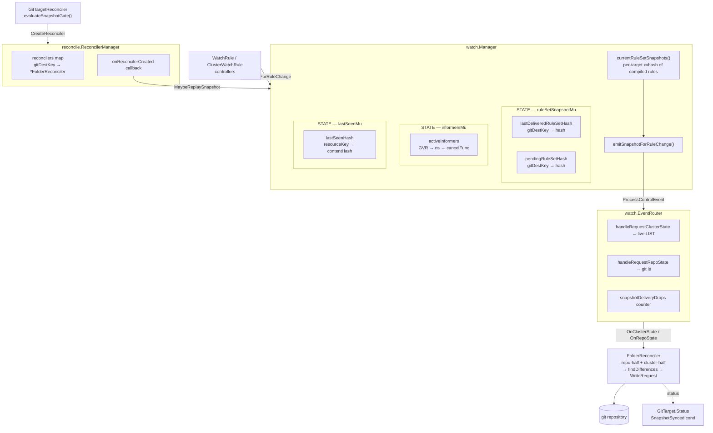
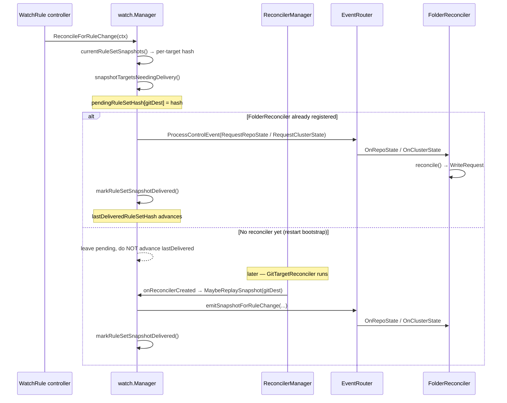
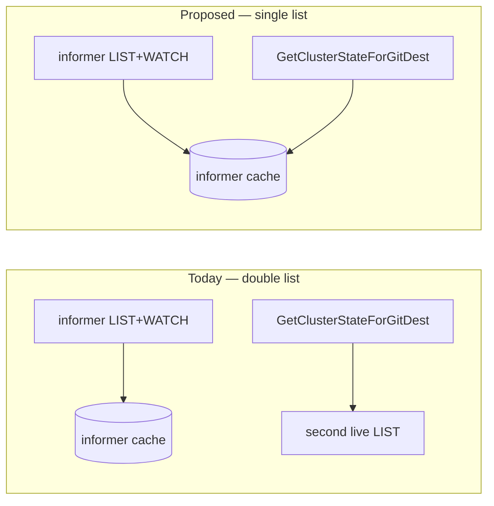
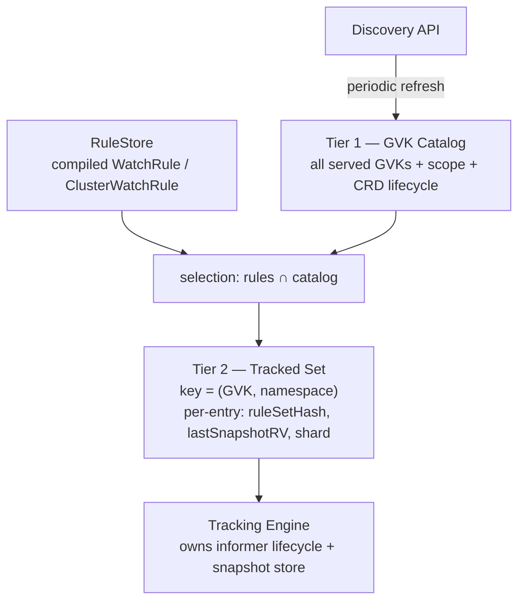
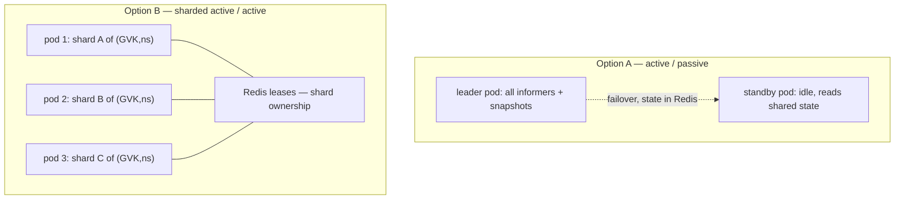
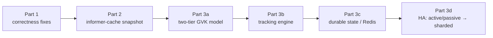

# Design: snapshot engine evolution

> Status: proposed — continuation of
> [design-rule-change-snapshot-trigger.md](../finished/design-rule-change-snapshot-trigger.md).
> Date: 2026-05-21
> Author context: written after a critical review of the rule-change snapshot
> trigger implementation ([ed3a1db](#) "fix: better reconcile").

This plan picks up where the rule-change snapshot trigger left off. That work
closed the *delivery contract* gap (a snapshot now stays pending until a
`FolderReconciler` exists). This document covers what is still wrong, what is
still expensive, and a longer-term architecture for the watch/snapshot engine —
including a two-tier GVK model, a dedicated tracking engine, a Redis-backed
state layer, and a path to multi-pod HA.

It is deliberately staged: Part 1 is correctness, Part 2 is cost, Part 3 is
architecture. Parts 1 and 2 are small and should land first; Part 3 is a
direction, not a committed design.

## Background: GVR vs GVK

The rest of this document — and the Part 3 architecture in particular — hinges
on a distinction that is easy to blur. Both forms address a Kubernetes type by
**Group / Version**, but the third component differs:

| Form | Third component | Example | What it identifies |
|------|-----------------|---------|--------------------|
| **GVK** — GroupVersionKind | **Kind** — schema type name, singular, PascalCase | `apps/v1`, Kind `Deployment` | The *type* as written in a manifest's `apiVersion` + `kind` |
| **GVR** — GroupVersionResource | **Resource** — plural, lowercase REST path segment | `apps/v1`, Resource `deployments` | The *HTTP endpoint* you `LIST`/`WATCH` against |

The mapping between them is **not** a trivial pluralisation. It is owned by the
cluster's RESTMapper, populated from API discovery, and it is many-to-one in
both directions in practice:

- One Kind can expose several Resources — subresources such as `pods/status`,
  `deployments/scale`. These share a Kind but are distinct Resources.
- The Resource (plural) is irregular often enough (`ingresses`, `endpoints`,
  `networkpolicies`) that it must be discovered, not guessed.

**Why it matters here.** Everything on the *watch path* is GVR-addressed: the
`watch.GVR` type, the dynamic client (`dc.Resource(gvr)` requires a GVR), and
the informer keys are all GVR. Everything on the *git representation path* is
GVK-addressed: a file written to the repo carries `apiVersion` + `kind`, i.e. a
GVK. The engine therefore lives on a GVR↔GVK seam, and the Tier 1 catalog in
[Part 3.1](#31-two-tier-gvk-model) must hold **both** keys plus the mapping —
calling it a "GVK catalog" is shorthand; its watch-facing index is GVR. Where
this document says GVK loosely, read it as "the type", and where precision
matters the explicit form is used.

## What the Kubernetes API server can deliver

Before proposing a new engine it is worth being explicit about what the API
server actually offers a read/watch client, which of those capabilities we use
today, and what we leave on the table. A prior document,
[docs/design/kubernetes-api-discovery.md](../design/kubernetes-api-discovery.md),
already covers *discoverability and verbs* — this section is the read/watch
mechanics complement to it, and capacity tuning is covered separately in
[docs/design/kubernetes-apf-and-inflight-tuning.md](../design/kubernetes-apf-and-inflight-tuning.md).



```mermaid
flowchart TD
  APISERVER["kube-apiserver"]
  APISERVER --> DISC["Discovery<br/>/api, /apis, aggregated discovery"]
  APISERVER --> LIST["LIST<br/>collection GET"]
  APISERVER --> WATCH["WATCH<br/>streamed deltas"]
  APISERVER --> STREAM["Streaming list<br/>WATCH + initial events"]

  DISC --> D1["groups, versions, resources"]
  DISC --> D2["scope, verbs, Kind↔Resource"]

  LIST --> L1["labelSelector / fieldSelector — server-side filter"]
  LIST --> L2["limit + continue — pagination"]
  LIST --> L3["resourceVersion=0 — served from watch cache"]
  LIST --> L4["list carries its own resourceVersion (snapshot point)"]

  WATCH --> W1["ADDED / MODIFIED / DELETED since RV"]
  WATCH --> W2["BOOKMARK events — cheap RV checkpoint"]
  WATCH --> W3["410 Gone — RV compacted, must re-LIST"]
  STREAM --> S1["sendInitialEvents=true - synthetic ADDED"]
  STREAM --> S2["initial-events BOOKMARK - sync boundary"]
  STREAM --> S3["then normal WATCH without a separate LIST"]

  classDef used fill:#1b5e20,color:#fff;
  classDef unused fill:#5d4037,color:#fff;
  class DISC,D1,D2,L4,WATCH,W1,W3 used;
  class L1,L2,L3,W2,STREAM,S1,S2,S3 unused;
```

Green = used today, brown = available but unused.

### Discovery

`/api`, `/apis`, and the per-group endpoints enumerate every served Group /
Version / Resource together with each resource's **scope** (namespaced or not),
its **verbs** (`list`, `watch`, …), and its **Kind**. Newer clusters also serve
*aggregated discovery* (`APIGroupDiscovery`), collapsing the whole catalog into
one round-trip.

**We use this** via `ServerPreferredResources` in
[`FilterDiscoverableGVRs`](../../internal/watch/discovery.go#L44). The benefit
is concrete: CRDs and `APIService`-backed (aggregated) resources are supported
with no hardcoding — if a type is in discovery with `list`+`watch`, it is a
candidate. This is exactly the Tier 1 catalog of [Part 3.1](#31-two-tier-gvk-model)
in embryonic form.

### LIST

A collection `GET` is the bulk-read primitive. Its options matter a great deal
for cost:

- **`labelSelector` / `fieldSelector`** — server-side filtering, so the wire
  payload is already narrowed. We do **not** use these. This is the same
  selector-parity gap flagged in the predecessor doc: the snapshot LIST returns
  everything of a GVR while the live path filters — they must converge.
- **`limit` + `continue`** — pagination, bounding peak client memory. We do
  **not** use these; `listResourcesForGVR`
  ([manager.go:616](../../internal/watch/manager.go#L616)) passes a bare
  `metav1.ListOptions{}`, materialising every object of a GVR at once.
- **`resourceVersion=0`** — serve the list from the API server's in-memory
  watch cache instead of a quorum read from etcd. Much cheaper on the
  apiserver; bounded staleness. We do **not** set it.
- Every list response carries its own **`resourceVersion`** — the consistent
  snapshot point a subsequent watch resumes from. We rely on this *indirectly*
  through informers but never read it ourselves.

### WATCH

A `WATCH` streams `ADDED` / `MODIFIED` / `DELETED` deltas since a given
`resourceVersion`:

- **`410 Gone`** — if that RV has aged out of the watch cache / been compacted,
  the watch fails and the client *must* fall back to a full re-LIST. This is
  the fundamental limit on "give me everything since an arbitrary moment" —
  detailed in [Part 2.2](#22-resourceversion-and-watches--what-they-can-and-cannot-do).
- **`BOOKMARK` events** (`allowWatchBookmarks=true`) — the server periodically
  emits an object-free event that only advances the RV, letting a client
  cheaply checkpoint progress. A controller that persists the latest bookmark
  RV can resume a watch after a short restart *without* a full re-LIST,
  provided it stays inside the compaction window. We do **not** use bookmarks
  today; they become relevant to the durable-state work in
  [Part 3.3](#33-redis-backed-state-layer).

**We use WATCH** only transitively: the `dynamicinformer` factory performs
LIST+WATCH internally for each tracked GVR. We never open a raw watch, so we
also never see bookmarks or drive the resume logic ourselves.

### Streaming LIST+WATCH

Kubernetes also exposes a watch form known as
[streaming lists](https://kubernetes.io/docs/reference/using-api/api-concepts/#streaming-lists).
The current upstream docs mark it as `Kubernetes v1.34 [beta]` and enabled by
default. Instead of issuing a separate collection `LIST` before the `WATCH`,
the client starts one watch with `sendInitialEvents=true`,
`allowWatchBookmarks=true`, `resourceVersion=`, and
`resourceVersionMatch=NotOlderThan`.

The server begins the stream with synthetic `ADDED` events for the current
collection. It then sends a `BOOKMARK` annotated as the end of initial events;
that bookmark carries the RV for the established snapshot. After that point the
same connection continues as an ordinary watch stream from that RV.

This is conceptually a better primitive for GitOps Reverser's future tracking
engine than a hand-rolled `LIST` then `WATCH`, because the API server gives us
one ordered stream and an explicit "initial state is complete" marker. It does
not remove the need to keep a local store: the engine still has to accumulate
the synthetic `ADDED` events into its snapshot cache, persist the bookmark RV
if we want resume, and fall back to classic list/watch or re-list on
unsupported APIs and `410 Gone`.

**We do not use this today.** The current `dynamicinformer` path owns the
bootstrap internally, and the snapshot path does a second raw `LIST`. The
project is already on Kubernetes libraries that expose the needed knobs in
`metav1.ListOptions` (`SendInitialEvents`, `AllowWatchBookmarks`,
`ResourceVersionMatch`), so no dependency upgrade is required to prototype a
custom tracker.

### What we use, and what we benefit from

| Capability | Used today | Benefit / cost left on the table |
|------------|-----------|----------------------------------|
| Discovery (`ServerPreferredResources`) | Yes | CRD + aggregated-API support with zero hardcoding |
| Informer LIST+WATCH per GVR | Yes | Live deltas; in-memory cache already holds every object |
| Raw LIST in `GetClusterStateForGitDest` | Yes | **Redundant** — second full list of an already-cached GVR (Part 2.1) |
| `limit`/`continue` pagination | No | Unbounded peak memory on large GVRs |
| `resourceVersion=0` (watch-cache read) | No | Cheaper apiserver path for the unavoidable lists |
| `labelSelector`/`fieldSelector` | No | Server-side narrowing; also closes the selector-parity gap |
| Watch bookmarks | No | Cheap restart resume without full re-LIST |
| Streaming lists (`sendInitialEvents=true`) | No | One ordered initial-state + live-delta stream for a custom tracker |
| Protobuf encoding | No (dynamic client → JSON) | Smaller payloads for built-in types |

The headline: we extract real value from **discovery** and from the
**informer** machinery, but the snapshot read path uses the *least* efficient
shape of LIST the API server offers, and ignores every incremental-resume
mechanism. Streaming lists sharpen the Part 3 direction: the future tracking
engine should probably speak in watch streams with explicit sync bookmarks,
not in ad-hoc full-list snapshots.

## Where we are today

The rule-change snapshot trigger added a per-GitTarget delivery contract in
`watch.Manager`. The moving pieces:



The full delivery sequence, including the restart-bootstrap replay path:



Key source:

- [internal/watch/manager.go](../../internal/watch/manager.go) —
  `ReconcileForRuleChange`, `snapshotTargetsNeedingDelivery`,
  `currentRuleSetSnapshots`, `emitSnapshotForRuleChange`, `MaybeReplaySnapshot`,
  `GetClusterStateForGitDest`, `listResourcesForGVR`.
- [internal/watch/event_router.go](../../internal/watch/event_router.go) —
  `RouteClusterStateEvent`, `RouteRepoStateEvent`, `snapshotDeliveryDrops`.
- [internal/reconcile/reconciler_manager.go](../../internal/reconcile/reconciler_manager.go) —
  `CreateReconciler`, `SetOnReconcilerCreated`.
- [internal/controller/gittarget_controller.go](../../internal/controller/gittarget_controller.go) —
  `evaluateSnapshotGate`.

All snapshot-trigger state (`pendingRuleSetHash`, `lastDeliveredRuleSetHash`,
`activeInformers`, `lastSeenHash`) is **in-memory and leader-local**. The only
persisted state is `GitTarget.Status` and git itself.

## Lessons from recent failures

Two failures in the current watch/audit path make the rebuild constraints more
concrete:

1. A startup snapshot once interpreted a wildcard-versioned rule differently
   from the live audit path. The snapshot resolved to zero resources, the
   reconciler treated that as authoritative, and it deleted the existing Git
   mirror. A failed `List()` that is logged and skipped has the same shape:
   "partial cluster view" becomes "cluster deletion" at the diff boundary.
2. The audit webhook path once tried to join shallow audit bodies before it
   knew whether the event could match a rule. Unwatched pod churn then paid
   Redis lookups and waits inside the kube-apiserver request context, producing
   timeout noise and `context canceled` failures before exact rule routing even
   ran.

These are not only point bugs. They show where the current system is fragile:
rule selection, snapshot completeness, event enrichment, and delivery ownership
are split across several paths with different timing and failure behavior.

The future engine should turn those failure modes into invariants:

- **One selection contract.** Snapshot bootstrap, live tracking, audit
  relevance checks, and final Git routing may operate at different precision,
  but they must share the same interpretation of wildcard versions, groups,
  resources, operations, scope, and selectors. An early "could match" gate may
  be conservative; it must not contradict the exact matcher downstream.
- **Completeness before deletion.** A snapshot or tracked shard is either known
  complete for its rule predicate or it is an error / pending state. Missing
  data from discovery, wildcard resolution, LIST, aggregated APIs, cache sync,
  or cross-shard fan-in must not be converted into delete writes.
- **Initial sync is not recoverable from future deltas.** After a bad snapshot,
  only objects that emit later audit/watch events heal themselves; quiet
  resources stay absent from Git. The tracker must establish and record an
  explicit initial-sync boundary before deltas are allowed to stand in for
  state.
- **Cheap relevance before expensive enrichment.** Mutating events should be
  classified by stage, verb, subresource, GVR, and possible rule relevance
  before body joins, waits, or API fallback reads. Complete events should take
  the short path. Exact filtering still belongs after enrichment.
- **Readiness and ownership are state, not timing assumptions.** Startup and
  failover will briefly have incomplete rule, discovery, and shard state. Gates
  must either fail open for non-destructive ingestion or fail closed for
  destructive reconciliation, and the reason must be observable.

The incident evidence therefore supports the Part 3 direction: a tracker with a
durable notion of "selected", "synced", "pending", and "owned" is not just a
scaling convenience for HA. It is how destructive Git convergence stops
depending on duplicated best-effort paths.

## Part 1 — Correctness: finish the delivery contract

The delivery contract is sound in shape but has gaps the original doc either
under-specified or claimed as handled when they are not.

### 1.1 Per-gitDest emission mutex (the real concurrency fix)

The original doc's risk section says *"A per-gitDest mutex (or the existing
`activeInformers` lock) is enough."* It was not implemented. `ruleSetSnapshotMu`
guards **only the hash maps**. The actual emission — `emitSnapshotForRuleChange`
→ `reconciler.ResetState()` → cluster LIST → routing — runs with no lock.

A 30 s periodic `ReconcileForRuleChange` and a `MaybeReplaySnapshot` (fired
synchronously from `CreateReconciler`) can run concurrently for the *same*
gitDest. Both call `ResetState()`
([folder_reconciler.go:111](../../internal/reconcile/folder_reconciler.go#L111));
one can wipe a half-arrived state pair from the other, so `reconcile()` either
never fires or fires on mismatched halves.

**Fix:** a per-gitDest mutex held across the whole emit (reset → emit repo →
emit cluster → mark delivered). A `map[string]*sync.Mutex` keyed by
`gitDest.Key()`, or a single emission mutex if contention is acceptable at MVP
scale.

### 1.2 Stop using `context.Background()` in `MaybeReplaySnapshot`

`MaybeReplaySnapshot`
([manager.go](../../internal/watch/manager.go) — see `MaybeReplaySnapshot`)
runs a full cluster-wide LIST with no deadline, **synchronously inside the
GitTarget reconcile loop** (`CreateReconciler` → `onReconcilerCreated`
callback). A slow API server stalls a controller-runtime reconcile worker.

**Fix:** thread the reconcile `ctx` through the callback, or dispatch the
replay onto the Manager's own goroutine with a bounded context.

### 1.3 Mark delivered only on confirmed receipt

`emitSnapshotForRuleChange` calls `markRuleSetSnapshotDelivered` immediately
after `ProcessControlEvent` returns `nil`. But `RouteClusterStateEvent` /
`RouteRepoStateEvent` return `nil` *even when they drop the event* — they only
bump `snapshotDeliveryDrops`
([event_router.go:260-281](../../internal/watch/event_router.go#L260-L281)).
The `GetReconciler` existence check just above guards this today, but it is
TOCTOU: a reconciler deleted between check and route advances the hash on a
dropped snapshot → permanent silent loss until the next rule change.

**Fix:** have the route functions return a `delivered bool`; advance
`lastDeliveredRuleSetHash` only when delivery is confirmed.

### 1.4 Make `force` per-target, not global

`snapshotTargetsNeedingDelivery(len(added) > 0 || len(removed) > 0)`
([manager.go:695](../../internal/watch/manager.go#L695)) passes a **global**
boolean. Any GVR add/remove anywhere forces a snapshot for *every* GitTarget,
including unaffected ones. The original doc claims the hash version *"pays the
same cost only when the hash changes"* — true only on the non-force path.

**Fix:** drop `force` entirely. A genuine GVR change already changes the
affected target's rule hash, so the hash alone is sufficient and naturally
per-target. This removes a whole-cluster re-list amplification on CRD install.

### 1.5 Doc hygiene

[design-rule-change-snapshot-trigger.md](../finished/design-rule-change-snapshot-trigger.md)
still cites `manager.go:660` for the old early-return; it is now line 696.
Fix the stale reference since the doc is marked "implemented".

## Part 2 — Cost: stop paying for the cluster twice

This addresses the open worry: *will this concept eat too many resources in big
clusters with many resources?*

### 2.1 Serve the snapshot from the informer cache

`GetClusterStateForGitDest` → `listResourcesForGVR`
([manager.go:616](../../internal/watch/manager.go#L616)) does a fresh
`dc.Resource(gvr).List(...)` — a **second full cluster LIST** — for a GVR whose
informer is *already synced and already holding every object in its in-memory
indexer*. We pay for the list twice: once for `WaitForCacheSync`
([manager.go:1165](../../internal/watch/manager.go#L1165)), once for the
snapshot.

**Fix:** read the snapshot from `informer.GetIndexer().List()` instead of a
live API LIST. The snapshot becomes essentially free — no API round-trip, no
second in-memory copy. The reconcile flow already guarantees the informer is
synced before emission, so correctness holds.

This is the single highest-leverage change for big-cluster cost.

### 2.2 resourceVersion and watches — what they can and cannot do

The idea of "request changesets since a moment" using `resourceVersion` is
exactly what informers already do (LIST, remember RV, WATCH from that RV). Two
hard limits stop it from being a primary snapshot mechanism:

- **Watch history is bounded.** The API server retains only recent watch events
  (etcd compaction + watch-cache window — minutes, not hours). A watch from an
  aged-out RV returns `410 Gone`, forcing a full re-LIST. "Everything changed
  since the last restart" is therefore not reliable across any restart longer
  than the compaction window.
- **`resourceVersion` is opaque.** It is not an ordered comparable integer in
  the API contract. You cannot do `if obj.RV > lastSyncedRV` in your own diff
  logic; you can only hand it back to the API server.

Where per-object RV *does* help: as a **persisted dedup key**. Storing the
last-synced RV per resource lets a re-LIST skip the sanitize + diff for any
object whose RV is unchanged — it does not save the LIST, but it saves CPU when
the diff is the bottleneck. This is the natural successor to the in-memory
`lastSeenHash` map.

### 2.3 Bound the unavoidable LISTs

For the LISTs that remain (initial sync, post-`410` re-sync):

- **Pagination** — `ListOptions{Limit: N, Continue: ...}` bounds peak memory.
  `listResourcesForGVR` currently passes a bare `metav1.ListOptions{}`.
- **`ResourceVersion: "0"`** — serves the LIST from the API server watch cache
  rather than a quorum etcd read; much cheaper on the apiserver, with bounded
  staleness that is acceptable here.



### 2.4 Treat streaming lists as a tracker primitive, not the Part 2 fix

Streaming lists are tempting because they sound like "a cheaper snapshot." For
this codebase, the immediate Part 2 fix is still to serve snapshots from the
already-synced informer cache. That removes the redundant raw `LIST` without
rewriting the watch stack.

Streaming lists become valuable when Part 3 introduces an explicit tracking
engine. At that point the engine can replace the classic bootstrap:

```text
LIST collection -> remember list RV -> WATCH from RV
```

with:

```text
WATCH sendInitialEvents=true -> accumulate synthetic ADDED events
-> initial-events BOOKMARK -> mark tracked shard synced
-> continue processing live events
```

That gives the engine a natural state machine:

| Phase | Input | Engine behavior |
|-------|-------|-----------------|
| `bootstrapping` | synthetic `ADDED` | Populate the snapshot store, but do not emit per-object git writes yet |
| `initial-synced` | initial-events `BOOKMARK` | Persist the snapshot RV and emit one coherent snapshot/reconcile signal |
| `live` | normal watch events | Apply deltas and update per-object RV/hash dedup state |
| `expired` | `410 Gone` or unsupported option | Fall back to classic relist/bootstrap |

This also fits the Redis/state-store idea in [Part 3.3](#33-redis-backed-state-layer):
the initial-events bookmark is the clean point at which the engine can record
"this `(GVR, namespace)` shard is current through RV X."

## Part 3 — Architecture: a two-tier GVK model and a tracking engine

This part responds to the broader question: *should there be an abstraction
over all GVKs (split per namespace), with a catalog of all available GVKs and a
second, narrower set of tracked GVKs — and should tracking/storing move into a
separate process and a Redis layer, in preparation for HA?*

Short answer: yes to the two-tier model and the dedicated engine — they
formalise concepts that are already implicit in the code. Redis and multi-pod
HA are a real direction but should come last and be entered with eyes open.

### 3.1 Two-tier GVK model

The code already computes two GVK sets but does not name them as a model:

- **Requested** GVRs — `ComputeRequestedGVRs`
  ([gvr.go:53](../../internal/watch/gvr.go#L53)) — derived from rules.
- **Discoverable** GVRs — `FilterDiscoverableGVRs`
  ([discovery.go:44](../../internal/watch/discovery.go#L44)) — filtered against
  the discovery API.

Promote this into an explicit two-tier registry:

- **Tier 1 — GVK Catalog.** Every GVK the cluster exposes, refreshed
  periodically from the discovery API, annotated with scope (namespaced vs
  cluster), served-ness, and CRD lifecycle. This is cluster-global and
  rule-independent.
- **Tier 2 — Tracked Set.** The subset the rules actually select, keyed by
  `(GVK, namespace)` so namespace-scoped informers are first-class rather than
  a special case threaded through `getNamespacesForGVR`. Each tracked entry
  carries its delivery state: rule-set hash, last snapshot RV, owning shard.



Benefits: CRD-availability retry logic
(`updateUnavailableGVRTracking` and friends) becomes a property of Tier 1
rather than ad-hoc maps; the `(GVK, namespace)` key removes the cluster-wide vs
namespaced branching that currently runs through `compareGVRs`,
`getNamespacesForGVR`, and `collectInformersToStart`.

### 3.2 A dedicated tracking engine

Today `watch.Manager` is a controller-runtime `Runnable` that does discovery,
informer lifecycle, dedup, snapshot emission, and the delivery contract — all
in one object, all on the leader. Splitting the *tracking/storing* concern into
its own component (not necessarily its own OS process — a clearly-bounded
internal service with its own goroutine and queue) gives:

- A single owner for informer lifecycle and the snapshot store.
- A single owner for tracked-shard completeness: only synced shards may
  contribute authoritative absence/deletion facts to a GitTarget snapshot.
- A natural seam to make snapshot emission a queued, retried, observable
  operation instead of inline calls inside `ReconcileForRuleChange`. The
  original doc's "future improvements" already names this: *"a small
  pending-snapshot work queue with retry, backoff, and metrics."*
- A place to keep the conservative audit "could match" gate aligned with the
  tracked set without moving exact Git routing into the webhook hot path.
- A boundary that can later be moved across a process or pod boundary without
  re-plumbing the controllers.

### 3.3 Redis-backed state layer

Everything fragile in Part 1 is fragile because it is in-memory and
leader-local. A shared store would hold:

- `pendingRuleSetHash` / `lastDeliveredRuleSetHash` — survive restart and
  failover, so a pending snapshot is not silently lost on leader change.
- The per-resource RV / content-hash index (today `lastSeenHash`) — dedup
  survives restart and can be shared across pods.
- The Tier 2 Tracked Set, per-shard sync/completeness state, and shard ownership
  leases.

Redis is a reasonable first choice (leases, hashes, pub/sub for cross-pod
notification). **But be honest about the cost:** it adds an external dependency
and a new failure mode to a project whose code still says *"Single-pod MVP"*.
An intermediate step worth considering first: persist the delivery contract
into `GitTarget.Status` (already durable, already reconciled) and keep only the
high-churn dedup index in memory. That removes the worst silent-loss case
without a new dependency.

### 3.4 Multi-pod / HA

Today `Manager.NeedLeaderElection()` returns `true`
([manager.go:207](../../internal/watch/manager.go#L207)) — strictly
single-active. Two evolution paths:



- **Option A — active/passive with fast failover.** Keep single-active, but
  persist the delivery contract so the new leader resumes pending snapshots
  and initial-sync boundaries instead of dropping them. Low complexity, no
  informer fan-out change. This is the recommended next HA step.
- **Option B — sharded active/active.** Partition the Tier 2 Tracked Set across
  pods by `(GVK, namespace)`, each shard leased via Redis. This is true
  horizontal scale but the hard part is that rules map GitTargets to GVKs
  many-to-many — a snapshot for one GitTarget may need GVKs owned by several
  shards. That cross-shard fan-in needs its own design and should not be
  attempted before Options A and the two-tier model are in place.

**Recommendation:** treat Option B as a stated direction, not a near-term
commitment. The selector-parity hazard already flagged in the prior doc must
also be resolved before sharding, or different shards will diff against
different predicates.

## Staging and acceptance



- **Part 1** — small, self-contained, no API change. Acceptance: the four
  existing tests in
  [rule_change_snapshot_test.go](../../internal/watch/rule_change_snapshot_test.go)
  still pass, plus a new test that runs a periodic reconcile and a
  `MaybeReplaySnapshot` concurrently for one gitDest and asserts exactly one
  coherent reconcile.
- **Part 2** — no API change. Acceptance: `GetClusterStateForGitDest` issues
  zero live LIST calls for an already-synced GVR; a load test over a large
  synthetic cluster shows bounded memory.
- **Part 3** — each sub-stage is its own design doc. The two-tier model
  (3a) and tracking engine (3b) are internal refactors with no CRD change.
  Durable state (3c) and HA (3d) change operational surface and need their own
  acceptance criteria, including a `SnapshotDeliveryDrops()`-equivalent staying
  at zero across a simulated failover, no destructive reconcile from a partial
  shard/snapshot, and parity tests that run wildcard-version and aggregated-API
  rules through bootstrap and live event selection.

## Non-goals

- No CRD changes in Parts 1 and 2.
- No new external dependency before Part 3c, and only after the
  `GitTarget.Status`-only intermediate step is evaluated.
- No sharded active/active before the two-tier model, the tracking engine, and
  selector parity all land.

## References

- Predecessor:
  [design-rule-change-snapshot-trigger.md](../finished/design-rule-change-snapshot-trigger.md).
- API discovery background (discoverability and verbs):
  [docs/design/kubernetes-api-discovery.md](../design/kubernetes-api-discovery.md).
- API server capacity tuning:
  [docs/design/kubernetes-apf-and-inflight-tuning.md](../design/kubernetes-apf-and-inflight-tuning.md).
- Kubernetes API concepts, especially streaming lists and resourceVersion
  semantics:
  [kubernetes.io/docs/reference/using-api/api-concepts](https://kubernetes.io/docs/reference/using-api/api-concepts/#streaming-lists).
- Related coordination concern:
  [idea-cross-kind-dependency-watches.md](idea-cross-kind-dependency-watches.md).
- Snapshot walk and double-list:
  [GetClusterStateForGitDest / listResourcesForGVR](../../internal/watch/manager.go).
- Delivery contract state:
  `snapshotTargetsNeedingDelivery`, `markRuleSetSnapshotDelivered`,
  `MaybeReplaySnapshot` in [manager.go](../../internal/watch/manager.go).
- Drop instrumentation:
  `RouteRepoStateEvent` / `RouteClusterStateEvent` in
  [event_router.go](../../internal/watch/event_router.go).
- GVK discovery: `ComputeRequestedGVRs`
  ([gvr.go](../../internal/watch/gvr.go)),
  `FilterDiscoverableGVRs`
  ([discovery.go](../../internal/watch/discovery.go)).
</content>
</invoke>
