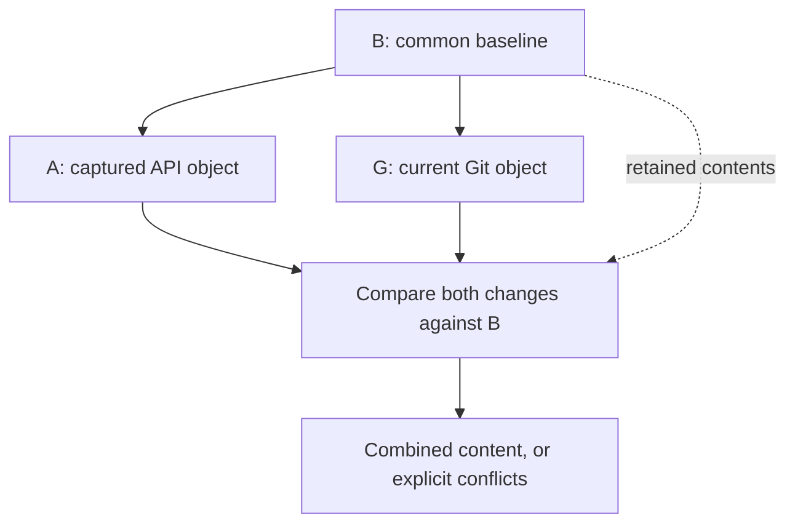
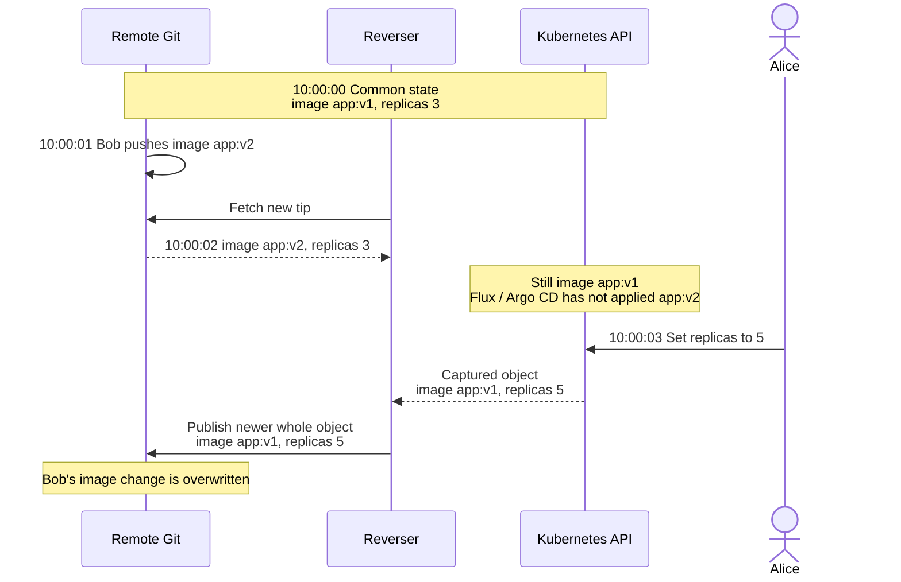
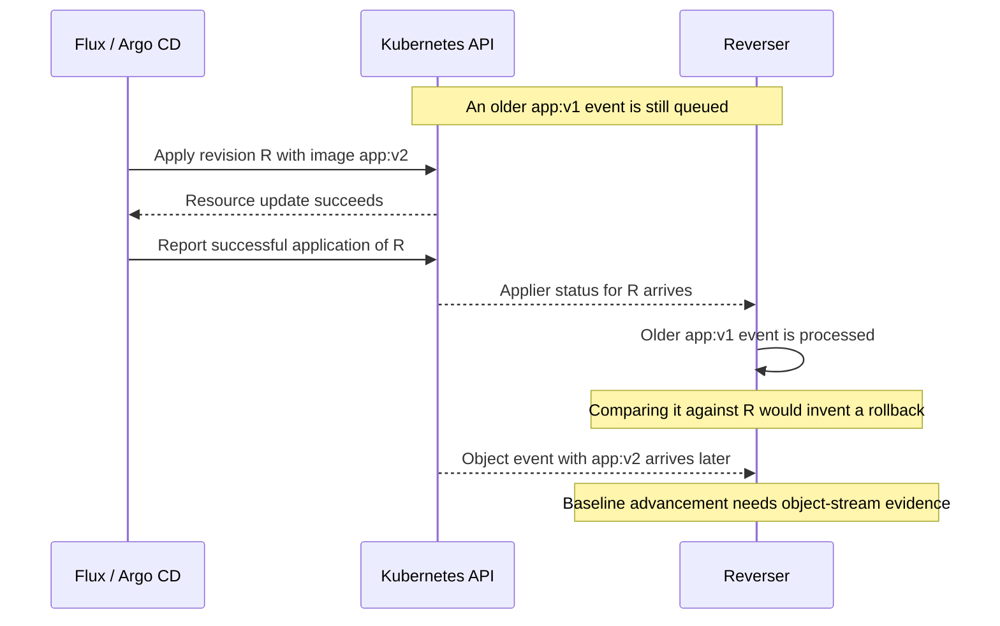

# Three-way comparison for concurrent Git and API edits

Status: **deferred**. Initial investigation recorded on 2026-09-22.

We are developing GitOps Reverser for API-first publication. We are not implementing three-way
comparison or changing conflict policy now. This record preserves the options we investigated,
the counterexamples, and the questions a future implementation would need to answer. It does not
schedule the work or select a new merge mode.

The current [field-ownership contract](../spec/manifestedit-field-ownership-spike.md) remains in
effect: ordinary captured API objects drive the complete desired content of their managed
documents. [API-first publication](../api-first-publication.md) describes replay and its overwrite
behavior. Deploying Git into Kubernetes remains the responsibility of Flux or Argo CD.

Each direction has exactly one writer, and neither reads the other's intent:

| Writer | Kubernetes API → Git | Git → Kubernetes API |
|---|---|---|
| GitOps Reverser | ✅ publishes captured live state | ❌ never applies Git to a cluster |
| Flux or Argo CD | ❌ never publishes live state | ✅ applies the declared revision |

Where the two overlap on one object, the captured API object wins. That is the whole conflict
policy today, and it is deliberate.

## What the shipped approach already settles

This record is about one open corner, so it is worth stating what the current design already does.
These are properties of API-first publication today, not gaps waiting on this investigation.

- **Any incoming Git change is handled.** A branch that moved under a publication is an ordinary
  outcome. The compare-and-swap push sees it on the connection the cycle was already making, the
  worker replans its retained writes against the new tip, and pushes again. Nothing is dropped and
  no operator has to intervene.
- **Nothing is resolved in Git.** There are no merge commits, no rebases, no conflict markers, and
  no half-finished resolution state left in a checkout for a person to finish. A publication either
  lands as a fast-forward or is replanned and retried.
- **The blast radius is one document.** Replay writes the captured object into the document that
  holds it. A change to another file, or to another document in the same file, is untouched. Most
  concurrent edits in a repository are therefore not in conflict at all.
- **It is fast, and idle costs nothing.** Planning is local work on a checkout already on disk.
  A healthy publication is a single remote exchange, and a target with nothing to publish makes no
  Git requests at all.
- **The rule is one sentence.** Replay writes what the cluster said. An operator can predict which
  side wins before making the edit, which is the property a partial merge would take away.

This is what API-first means in practice, and it is API-first rather than API-only: Git remains
writable, and the API decides only where the two writers overlap on one object.

| Situation | What survives today | Why |
|---|---|---|
| Change to a file no captured object writes | ✅ Git | Replay only touches the document holding the captured object |
| Push that moved the branch under a publication | ✅ both | The publication is replanned on the new tip, with no merge and nothing to resolve |
| Same object and field, changed on both sides | ❌ Git loses | The captured API object is the desired content |
| Same object, **different** fields, changed on both sides | ❌ Git loses | The captured object carries an old value for Git's field |

The last row is the corner this record investigates. The row above it is a decision, not a defect.

## The problem considered

Independent edits to different fields of one object can overwrite each other during replay.
Alice changes `replicas` through the API while Bob changes `image` in Git. Alice's captured object
still carries the old image, so replay can overwrite Bob's change even though Alice did not edit
that field. Bob's commit survives in history; its image value does not survive in the final tree.

A three-way comparison could distinguish those edits if it had a suitable common base:

| Field | Common base | Captured API object | New Git object | Current behavior | Candidate merged result |
|---|---|---|---|---|---|
| `replicas` | `3` | `5` | `3` | ✅ `5`, Alice's edit lands | `5` |
| `image` | `app:v1` | `app:v1` | `app:v2` | ❌ `app:v1`, Bob's edit is gone from the tree | `app:v2` |

The current behavior column is not a failure of the write. Replay published exactly the object the
cluster reported, including the image Alice was looking at when she scaled. Nothing in that object
distinguishes a field she chose to set from a field she carried along.

## What three-way merge means here

A two-way comparison establishes that API and Git differ. A three-way comparison also uses a
common base to establish which side changed. A merge then combines compatible changes and reports
conflicts. Resolving a conflict requires a separate policy; timestamps are not part of the merge
definition.

In this proposal, `B` is a common object baseline, `A` is the captured API object, and `G` is the
current Git object. These are comparable resource contents after agreed normalization. The latest
fetched Git commit does not automatically qualify as `B`.

For a comparable field, evaluate these rules in order:

| Condition | Meaning | Merged value |
|---|---|---|
| `A = G` | Same result, including no change | That value |
| `A = B` | Only Git changed | `G` |
| `G = B` | Only API changed | `A` |
| Otherwise | Both changed to different values | Unresolved conflict |

For example, `B=3`, `A=5`, `G=3` produces `5`; `B=3`, `A=5`, `G=7` is a conflict. API priority
and refusing the affected write are possible conflict policies. Neither follows automatically
from using three inputs. A full before-snapshot supplies enough information to derive a delta;
the event does not have to arrive as a patch.

Absence must be distinguishable from an explicit `null`. A deletion against an unchanged value
can be merged; deletion against a concurrent edit conflicts. Parent deletion and child edits also
overlap. Maps and lists need Kubernetes schema semantics, including associative keys and atomic
collections, so independently changed text lines are not necessarily independent fields. Even a
conflict-free content merge can produce an invalid application configuration.

### Kubernetes apply uses a different contract

Kubernetes client-side apply also uses three inputs: last-applied configuration, new desired
configuration, and the live object. It enforces values declared in the desired configuration and
uses the previous configuration to identify removals. With last-applied `replicas: 3`, Git still
declaring `3`, and live replicas `5`, apply can restore `3`. The proposed merge above would retain
`5`. See [Kubernetes' apply calculation](https://kubernetes.io/docs/tasks/manage-kubernetes-objects/declarative-config/#how-apply-calculates-differences-and-merges-changes).

Server-side apply uses schema-aware field ownership in `managedFields`. An ownership conflict is
different from two edits disagreeing relative to a common baseline. Neither apply mechanism
supplies Reverser with a synchronized Git/API history. Our
[Flux and Argo CD source review](../facts/gitops-apply-and-field-ignore.md) separates their diff,
apply, ignore, and scheduling behavior, with versions and code references.

## Both reconciliation directions affect the result

The source review shows why field-ignore settings are related to this proposal. Flux
`Kustomization.spec.ignore` and Argo CD `ignoreDifferences` with
`RespectIgnoreDifferences=true` preserve selected live fields during ordinary updates. Git can
seed those fields when creating an object, but later Git edits to them do not normally apply while
the rule is active. These settings configure field authority in the Git-to-API direction.

Reverser still captures those fields in the API-to-Git direction. Ignoring `replicas` in the
applier can preserve Alice's scale change in Kubernetes, but her captured object still contains
the old `image`. Current replay can therefore overwrite Bob's pending Git image change. Conversely,
without an apply ignore, the applier can restore old Git replicas before Reverser publishes them.
A reverse merge cannot reconstruct an API value that was lost before it was observed.

The future contract must specify which fields each direction can write and what counts as
convergence when selected live fields deliberately differ from Git. Static field delegation can
avoid some conflicts; it does not provide shared editing of the same field. Reducing the delay in
either direction reduces exposure to these races without deciding their outcome.

## Evidence from the current implementation

The implementation already supplies several parts of a future comparison path:

- [`Event` and `PendingWrite`](../../internal/git/types.go) carry captured objects and publication
  metadata. An ordinary event records its observed `resourceVersion`; it carries no corresponding
  before-object or before-version. Retained writes can be replayed during the worker's lifetime.
- [`targetWatchGitEvent` and `skipUnchangedLiveUpdate`](../../internal/watch/target_watch.go) capture
  the resulting object and deduplicate using a sanitized-content hash. That hash detects equality
  but cannot reconstruct the previous field values.
- Commit-message provenance already exists. The default reconcile template includes a collection
  `resourceVersion`, and live templates can access a version per resource. The
  [commit-version tests](../../internal/git/commit_resource_version_test.go) cover rendering,
  grouping, and keeping those identifiers out of manifest content.
- [`PartialDesired`, `OwnsAssignedPaths`, and `PatchFields`](../../internal/git/manifestedit/fieldpatch.go)
  implement bounded field assignments. [`applyFieldPatch`](../../internal/git/plan_flush.go) routes
  those assignments through the writer, including supported Kustomize overrides. This machinery
  can preserve fields outside an assignment; a future design need not invent that primitive.
- [`baseTrustedState` and `ExpireBaseTrust`](../../internal/git/branch_worker.go) track whether the
  Git checkout remains usable for optimistic publication. They do not track cluster application.

The field-patch machinery originated in scale rehydration, but its current producer boundary
matters. A search of non-test Go code finds the payload and writer dispatch, with no construction
of a `FieldPatch` event. The current [audit handler](../../internal/webhook/audit_handler.go) forwards
top-level mutations and mutating `/scale` events into attribution. It reduces them to
[`AuthorFact`](../../internal/queue/author_fact.go) records, which carry no object or patch bodies.
The apply primitive exists; deriving paths for ordinary events and carrying that evidence through
the current ingestion pipeline remain future work.

These findings come from source, checked-in tests, and the captured mutation corpus. This review
adds no merge prototype, concurrency experiment, or timing benchmark. The examples below are
reasoned scenarios, not results from a new test run.

## Separate Git freshness from the comparison baseline

Git already stores candidate object history. The missing relationship is between a chosen Git
snapshot and the API state being compared with it.

| Concept | What it establishes | What remains unknown |
|---|---|---|
| Publication base and trust | Git revision used for planning and push comparison | Whether the cluster incorporated that revision |
| Previously published object snapshot | Desired content Reverser wrote at a known revision | Which later API observations include Git-side changes |
| Applied-revision watermark | Applier reports successful application for its scope | Exact state represented by each queued API event |

For a plain manifest, the last commit Reverser published for an object can supply its previous
desired contents. Grouping does not remove that object from the commit's tree. We do not always
need a second object store. The design still has to locate that commit, preserve access to its
objects, and associate it with the correct source cluster and resource lifetime.

The distinction becomes sharper once a proposed merge preserves Git changes that have not reached
the cluster: the published tree then contains a combination that the API has never reported.
Option 4 explores confirmation from the applier. A fetch or expiry of publication trust cannot
advance that confirmation.

## Option 1: compare commit and event timestamps

Timestamps could define a policy that gives priority to the later timestamp. They do not identify
which fields changed or establish which Git state an API edit incorporated.

Git records author and committer dates, and both can be supplied by the committing client. Those
dates do not record when the remote accepted a push. A commit may remain local before publication.
See [Git's commit metadata documentation](https://git-scm.com/docs/git-commit-tree).

On the API side, persistence time, audit time, and worker receipt time describe different events.
Independent clocks and delivery delays make cross-system ordering weaker. Recording all arrivals
on the worker's clock orders receipt, but still cannot recover the order of the original edits.

Even perfect clocks leave this counterexample. The final write shows the result of choosing the
newer whole object; times are illustrative, and publication delays are omitted.

Choosing Alice's newer whole object would revert the image. The timestamps cannot distinguish an
intentional rollback from an unchanged field carried along with her replicas edit.

Assessment: useful for measuring lag and scheduling work. Insufficient as evidence for field-level
merge decisions. A timestamp priority policy would be a deliberate overwrite policy.

## Option 2: retain exact before and after resource versions

Recording both `resourceVersion` identifiers could identify the observed API transition. Computing
its field changes also requires the corresponding object contents, or a retained patch with the
old values needed to check conflicts.

The identifiers alone do not contain those values or map to a Git commit. Kubernetes retains watch
history for a limited time and can return `410 Gone` when older history is unavailable. A saved
version identifier cannot serve as a durable object archive. See
[Kubernetes watch semantics](https://kubernetes.io/docs/reference/using-api/api-concepts/#efficient-detection-of-changes).

A possible future record would associate source cluster and object identity, including UID, with
the before and after versions, sanitized contents, and the Git baseline used for publication.
The UID distinguishes deletion and recreation under the same name. A continuous watch can provide
successive observations; an initial snapshot or a reconnect after lost history needs a separate
rule for establishing a baseline. An observed transition can include controller or admission
changes, so it does not by itself prove human authorship.

### Commit metadata and possible storage locations

Sanitization governs deployable manifest content. It does not prohibit version identifiers in
commit metadata. [`Sanitize`](../../internal/sanitize/sanitize.go) removes runtime fields from the
object; the existing message path records provenance separately.

There are several possible carriers, with different costs:

| Carrier | What it can retain | Principal limitation |
|---|---|---|
| Existing branch history | Previously published object contents | Finding and retaining the right revision and identity |
| Commit message | Version pairs and other per-object provenance | User templates can omit it; identifiers do not contain values |
| Git notes | Metadata or payload blobs associated with commits | Explicit ref transport and rewrite handling |
| Dedicated companion ref | Per-object snapshots and synchronization records | New publication, retention, and encryption contract |

The default reconcile message's version identifies the collection snapshot. Live message data
provides `Resources[i].ResourceVersion`, but the default live template does not print it. Custom
templates can include it, as the tests demonstrate. A recovery contract would need guaranteed,
machine-readable metadata independent of user-edited templates.

Git notes are separate objects under a notes ref. They can hold arbitrary blobs, including object
contents; they are not restricted to short identifiers. Fetching and pushing the notes ref must
be configured explicitly, and copying notes across rewrites needs a policy. A separate push is
one implementation choice, not a requirement of notes. See
[Git notes](https://git-scm.com/docs/git-notes).

A companion ref such as `refs/gitops-reverser/<target-id>/base` could hold a tree of records keyed
by source identity and UID. Its contents would stay outside the branch tree rendered by a
normally configured applier. Naming would also need to distinguish target lifetimes and branches.
One record per object accommodates commit grouping without one Git commit per API mutation.
This would be durable storage in Git, with explicit fetch rules, lifecycle, and access control.
It would preserve only records that reached the remote; unpublished events would still need
recovery after a crash.

Atomic publication is possible, but the current
[`PushAtomic`](../../internal/git/git_atomic_push.go) sends one branch command and packs objects
reachable from that branch. It sets `Atomic: true`; the pinned go-git transport
[requests atomic updates only when the server advertises support](https://github.com/go-git/go-git/blob/v6.0.0-alpha.5/plumbing/transport/push.go).
Adding a companion ref would require packing its objects, checking both expected ref values,
requiring server atomic support, and handling retry and no-op outcomes across both refs. Merely
adding a second command would not establish the required all-or-nothing guarantee.

### Sensitive content is a storage constraint

A sanitized `Secret` still contains its values. Writing that object to a notes blob or companion
tree in plaintext would violate the encryption rule even though an applier never renders it.
An obscure ref name does not provide confidentiality.

Any stored sensitive baseline must use an encrypted representation, with a defined decryption
and key-lifecycle policy, or be excluded from the proposed mode. The existing
[content writer](../../internal/git/content_writer.go) protects ordinary manifest publication;
a new bookkeeping writer would have to enforce that rule too. Existing encrypted branch history
may avoid another copy, but comparison still requires authorized access to the decrypted values.

Assessment: before/after contents can supply API changes. Git history or a companion ref might
provide durable storage; a new external database is not inherently required. Version identifiers
alone remain insufficient, and storage location does not settle synchronization or conflict policy.

## Option 3: analyze the fields changed in Git

Git history can reveal the changes between the publication base and the new remote tip. Comparing
those endpoint trees captures the net change even when several commits arrived. A per-commit view
can add history and attribution, but requires explicit treatment of merge parents. Git's
[tree comparison documentation](https://git-scm.com/docs/git-diff-tree) describes these comparisons.

For plain manifests, a candidate implementation could parse both versions, match Kubernetes
resource identities, and compare field values. It would need semantic comparisons: a line diff
also reports formatting and comments, while a file can contain several objects or move paths.

This reveals Bob's image edit. It still does not reveal whether Alice changed the image. Refusing
every disagreement with a Git-edited field would also refuse independent API edits. Giving Git
priority for all such fields would discard deliberate API changes. Combining Git differences with
API before/after contents or a verified common baseline is the more useful direction to explore.

Comparing our own generated commit with its parent does not automatically solve this. If its
original plan already overwrote a Git value missing from the cluster, that diff includes the
overwrite; it cannot prove that the API editor intended it.

The supported layouts add further questions:

- Lists need defined element identity and atomicity. Kubernetes schemas distinguish atomic, set,
  and map lists; a position-based comparison cannot serve every resource type. See
  [Kubernetes merge strategies](https://kubernetes.io/docs/reference/using-api/server-side-apply/#merge-strategy).
- Kustomize source changes need comparison in rendered object space, followed by a supported
  projection back into source files. One source edit can affect several rendered objects.
- Encrypted files need a defined plaintext comparison and re-encryption path. Ciphertext
  differences cannot identify the resource fields that changed.
- Deletes, recreation, and rewritten or unavailable Git history need explicit handling.

The last object snapshot written by Reverser is a candidate comparison endpoint, subject to the
baseline rules above. Availability is not automatic: the current
[`SmartFetch`](../../internal/git/git_smart_fetch.go) uses `Depth: 1`. A previous commit's SHA does
not ensure its tree is available in a fresh checkout. A future design must retain or fetch the
needed history and handle rewritten or missing refs.

Assessment: supplies Git changes and may reuse existing object history. It becomes more useful
when combined with API transitions, application evidence, or supported request intent.

## Option 4: use the applier's applied-revision watermark

Flux or Argo CD status can provide evidence about which Git revision reached the cluster. This
could let a future mode reuse Git history instead of maintaining duplicate baseline snapshots.
Here, a watermark means a confirmed revision for a particular applier and resource scope.

The e2e suite already reads these signals:

- The [Flux helper](../../test/e2e/flux_bi_directional_e2e_test.go) checks `Ready=True` and
  `status.lastAppliedRevision`; scenarios also check live resource values. Flux documents that
  field as the last successfully applied source revision. It distinguishes it from
  `lastAttemptedRevision`. See [Flux status](https://fluxcd.io/flux/components/kustomize/kustomizations/#last-applied-revision).
- The [Argo CD helper](../../test/e2e/argocd_bi_directional_e2e_test.go) requires a newly finished
  operation, `status.operationState.phase: Succeeded`, the expected
  `status.operationState.syncResult.revision`, and nonempty resource results. The revision field
  alone does not assert success. Argo's
  [operation result types](https://github.com/argoproj/argo-cd/blob/master/pkg/apis/application/v1alpha1/types.go)
  also carry per-resource results and revisions for multiple sources.

These helpers establish evidence in controlled test setups. A production integration needs a
binding from each target's source cluster and objects to the correct applier, source, path, and
render configuration. An application-level revision is too broad when resources or fields were
excluded, skipped, or selectively synchronized. Status such as `Unknown`, a failed operation,
or an unrelated successful operation cannot advance the watermark.

Field-ignore rules make this a concrete constraint. A revision can successfully apply `image`
while an ignored `replicas` keeps its live value, even when Git declares another value. That
revision cannot become the whole-object baseline by assuming every field reached the API. The
confirmation must cover the fields the applier manages; waiting for ignored fields to equal Git
could wait forever. Changing those rules requires re-establishing the affected baseline.

### Correlate confirmation with the object stream

Successful application establishes an event in the applier's history. It does not give every
queued watch event the state of that revision. Consider an image change to `app:v2`:

This is a possible ordering across independently processed streams. The future design must
associate confirmation with the relevant observed object state and any pending local edits before
advancing the comparison baseline. Status alone supplies no per-object before/after version pair.
An apply can also include defaults, admission mutations, or partial field ownership; the
comparison needs a defined projection instead of assuming byte equality with the source YAML.

A suspended or failing applier might never advance. The mode would need a visible waiting or
refusal state, retention limits, and an explicit recovery policy. Falling back to whole-object
overwrite would change its preservation promise. Appliers that skip intermediate revisions,
roll back, change configuration, or manage multiple sources require equivalent rules.

Assessment: a promising way to obtain application evidence and reuse Git storage. It adds applier
dependencies and an event-correlation contract. It does not remove the need to handle pending
writes, restarts, and an indefinitely stalled applier.

## Option 5: use audit request intent for supported mutations

Audit request bodies can identify the paths a client submitted for some patch operations. For a
known scalar assignment, that could avoid reconstructing a complete before-object merely to learn
which field was addressed. Overlapping edits would still need conflict evidence or an explicit
priority rule.

The [mutation corpus](../../test/mutationlab/README.md) captures `RequestResponse` events. The
[server-side apply example](../../test/mutationlab/corpus/configmap/server-side-apply/audit.patch.yaml)
contains both the submitted object and the response. These bodies reach the current audit handler,
but it uses their metadata for attribution and unchanged-version filtering. It does not retain
them in the author-fact stream or turn them into ordinary field edits.

Request intent is also different from persisted state. Kubernetes records `requestObject` before
defaulting, admission, and merging, while `responseObject` is the returned result. See the
[audit event contract](https://kubernetes.io/docs/reference/config-api/apiserver-audit.v1/#audit-k8s-io-v1-Event).
Any proposed use of request paths must correlate them with a successful, persisted mutation and
use confirmed resulting values. Failed requests and dry runs supply no state to publish.

| Request shape | Potential evidence | Additional requirement |
|---|---|---|
| JSON Patch | Explicit operations and paths | Handle tests, removals, moves, copies, and list positions |
| JSON Merge Patch | Submitted fields and null removals | Preserve object and whole-array replacement semantics |
| Strategic merge patch | Submitted fields and directives | Resource schema and list merge rules |
| Server-side apply | Declared field set | Prior ownership and omission semantics; submitted fields may be unchanged |
| Whole-object update | Proposed replacement and resulting state | Previous persisted contents to identify changed fields |

The audit verb `patch` does not identify all these semantics. A standard audit event does not
provide the original HTTP content type as a dedicated field, so recognizing supported request
forms needs evidence beyond guessing from that verb.

For a whole-object update, the request and response are **not a before/after object pair**. The
[captured update](../../test/mutationlab/corpus/configmap/update/audit.update.yaml) makes this
concrete: both bodies contain `data.key: updated`, while the request names `<rv-1>` and the
response names `<rv-2>`. The older identifier accompanies the proposed new contents. Comparing
those two bodies would miss the client's change.

Audit is opt-in, depends on the configured logging level, and can arrive late, in batches, or
with gaps. Expanding its role would require payload retention, deduplication, correlation with
watch state, sensitive-content handling, and a defined outcome when evidence is absent. The
current subresource gate accepts mutating `/scale` and drops other subresources; it does not drop
top-level patches. A feature depending on request bodies would be an explicit capability beyond
today's optional attribution contract.

The existing field-assignment writer is reusable for supported assignments. It is not a general
JSON Patch interpreter: deletion and list operations need their own translation and checks.
There is currently no production audit-to-`FieldPatch` producer to extend directly.

Assessment: worth considering for a bounded set of request forms. It may reduce the API history
needed for those forms, but neither every patch nor every update reveals an exact field delta.

## Why faster Git delivery helps but does not settle the merge

Faster notification reduces how long the engine plans against stale Git state. The
[inbound notification proposal](../design/push-notification-and-reconcile-trigger.md) can improve
that latency independently of this investigation.

The timestamp example already gives Reverser the Git change before Alice edits. The remaining gap
is between the Git state and the state in the cluster. Faster application by Flux or Argo CD, and
observation of the resulting API state, reduce that gap further. Simultaneous edits, delayed apply,
and outages still require a conflict policy.

A fetched Git revision is a publication base. Option 4 adds evidence of application, while
Options 2 and 5 can help explain API changes. Publishing a merged image while the cluster still
has the old image creates another window: the next API event or snapshot resync could overwrite
the merge unless the design retains the distinction between unapplied Git changes and new API
changes. Fast notification complements that evidence.

Three-way comparison would not inherently require a fetch before every healthy publication. The
worker could compare retained state locally and fetch on remote movement as it does today.
Historical objects or rendered bases that are no longer available locally could add fetch cost.
The storage and convergence requirements need to be solved before claiming a network budget.

## Decision and conditions for revisiting

We defer this work because the current development priority is API-first publication. Whole-object
ownership is the existing contract. Preserving concurrent Git changes would introduce a different
contract covering conflicts, retained history, and convergence across two independent reconcilers.

This is hard material, and the deferral is a choice rather than an oversight. Each option above
supplies one piece of the answer and leaves a dependency that reaches into storage, identity,
encryption, or another controller's scheduling. A first version that merged some fields some of
the time would be worse than the rule we have, because an operator could no longer predict which
of their edits survives. Keeping early versions small is how the behavior stays describable: it is
more useful to know exactly what you get than to have a merge that works in the cases we happened
to test. When the evidence in this record is available, the contract can grow deliberately.

The options supply different pieces and can be combined:

| Option | Contribution | Main unresolved dependency |
|---|---|---|
| 1. Timestamps | Timing and a possible priority policy | Cannot identify field changes |
| 2. Versioned contents | API transitions and recoverable baselines | Storage, identity, encryption, and recovery |
| 3. Git tree comparison | Git changes and existing snapshots | Suitable baseline and available history |
| 4. Applier watermark | Evidence of application | Scope, stream correlation, and stalled appliers |
| 5. Audit request intent | Paths addressed by supported requests | Patch semantics, confirmed values, and delivery gaps |

If the work resumes, a bounded investigation could start with plain manifests, one supported
applier, and Git history as the snapshot store. That would test how far Option 4 can reduce the
storage required by Option 2. A separate experiment could assess Option 5 for known scalar
assignments. Neither direction is selected or scheduled by this record.

Revisit when a concrete shared-editing workflow requires preserving independent changes on both
sides. Before implementation, specify how to establish and recover the baseline, select the
conflict policy, and decide whether the behavior is an explicit target option. The existing
API-first contract must remain clear to operators.

A prototype would need evidence for at least these cases:

| Scenario | Evidence required |
|---|---|
| Different fields edited concurrently | Both values survive either delivery order |
| Same field changed identically or differently | Equality is a no-op; disagreement follows the chosen policy |
| Git fetched before the cluster receives it | Stale carried fields are not mistaken for API edits |
| Another API edit or resync before the merged Git state is applied | The earlier merge is preserved |
| Apply status arrives before older object events are drained | A delayed event cannot advance or contradict the wrong baseline |
| Applier is suspended, failing, absent, or never applies | Waiting, retention bounds, and recovery are explicit |
| Partial sync, skipped fields, changed applier scope, or rollback | Confirmation covers the relevant objects and configuration |
| Apply ignores one field while Git changes its sibling | Forward preservation does not hide a reverse overwrite |
| Git edits an ignored field, or the ignore policy changes | Field authority, confirmation, and baseline recovery remain explicit |
| Forward apply restores an API edit before reverse publication | Retained observations and the selected policy determine recovery |
| Grouped events and repeated push rejection | Baselines and changes survive grouping and replay |
| Restart, lost watch history, or initial adoption | Missing baseline has an explicit recovery outcome |
| Companion-ref rejection or absent atomic capability | Branch and bookkeeping cannot publish inconsistently |
| Custom messages, rewritten history, or shallow recovery fetch | Recovery does not depend on optional text or missing trees |
| Audit is missing, duplicated, delayed, rejected, or a dry run | Unconfirmed intent cannot become a published value |
| Request values change during admission, or an update repeats new values | Persisted state and previous contents are identified correctly |
| Delete against edit, or recreation under the same name | Identity and conflict handling are defined |
| Lists, Kustomize, and every supported patch form | Comparisons and writeback respect their semantics |
| Sensitive objects stored in notes or companion refs | No plaintext sensitive values reach any Git object |

These are acceptance questions for future work. The current documentation change implements none
of these behaviors.
