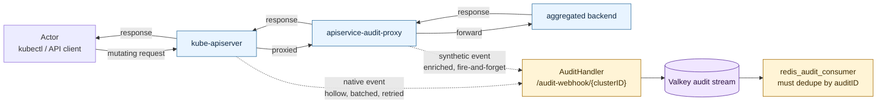
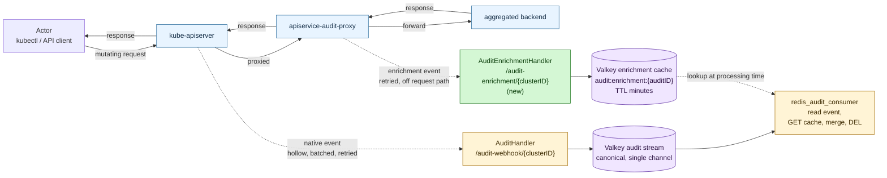

# Idea: dedicated audit enrichment side-channel

> Status: exploratory — improvement proposal for the broader audit pipeline.
> Related to but not blocking [design-commit-context-api.md](design-commit-context-api.md).
> Date: 2026-05-07

## Why this idea exists

Today gitops-reverser ingests audit events from two sources through a single endpoint:

- kube-apiserver, via `--audit-webhook-config-file`
- `apiservice-audit-proxy`, when deployed in front of an aggregated API

Both POST `auditv1.EventList` payloads to `/audit-webhook/{clusterID}` and both flow through
the same `AuditHandler`. For a request that passes through the proxy, two events with the same
`auditID` end up in the canonical audit stream — one hollow native event from kube-apiserver,
one enriched synthetic event from the proxy.

This works but couples the two channels and forces every consumer to reason about the
duplicate. The [CommitContext design](design-commit-context-api.md) notes this as the reason
for an idempotency-marker mechanism in its consumer logic. A cleaner alternative is to give
the proxy its own ingestion endpoint that does *not* feed the canonical stream, and instead
populates a side-cache the consumer reads when processing the canonical event.

## Current shape

`AuditHandler.ServeHTTP` accepts both kube-apiserver and proxy POSTs, decodes the
`EventList`, and enqueues each event to the Valkey audit stream
([internal/webhook/audit_handler.go:107](../../internal/webhook/audit_handler.go#L107),
[internal/webhook/audit_handler.go:226](../../internal/webhook/audit_handler.go#L226)).

The proxy's send is fire-and-forget with no retry
([handler.go:202](../../external-sources/apiservice-audit-proxy/pkg/proxy/handler.go#L202)):

```go
go h.buildAndSendAuditEvent(...)  // 5s timeout, single attempt
```

kube-apiserver's send is batched and retried per its own audit-webhook semantics.

Two costs of the current shape:

1. **Two events with the same `auditID` reach the consumer.** Every consumer has to reason
   about both arrivals. For designs like `CommitContext` this means an idempotency marker is
   needed to avoid false stash-miss alarms.
2. **The proxy and kube-apiserver share an ingestion endpoint.** In principle the proxy
   could delay or perturb native event ordering. In practice they do not interfere, but the
   coupling is real.



Both audit channels converge on the same handler and the same stream. The consumer ends up
holding the duplicate-detection responsibility.

## Proposed shape

Move `apiservice-audit-proxy` ingestion to its own endpoint, working name
`/audit-enrichment/{clusterID}`, served by a new `AuditEnrichmentHandler` separate from
`AuditHandler`. The new handler's only job:

1. Validate the inbound `EventList` came from a trusted proxy (mTLS / kubeconfig as today).
2. For each event, write the enriched payload to a Valkey cache keyed by `auditID`:
   - key: `audit:enrichment:<audit-id>`
   - value: the full event including `requestObject`, `responseObject`, and `objectRef.name`
   - TTL: minutes — long enough to outlive kube-apiserver batch delivery, short enough not
     to pile up
3. Return 200.

The canonical audit stream now contains *only* native kube-apiserver events. When the
consumer processes one for an aggregated-API kind, it does a single Valkey GET on
`audit:enrichment:<audit-id>`:

- **Hit:** merge the enriched payload onto the hollow native event, process the merged
  result, DEL the cache entry.
- **Miss:** process the hollow event as-is. For built-in resources this is already the
  default. For aggregated APIs with no proxy in their path, it is the existing degraded
  behaviour.



The enrichment becomes a *side-channel* (green): a separate endpoint, a separate Valkey key
space, a separate retry policy, separate metrics. The canonical pipeline (yellow boxes plus
the audit stream) carries exactly one event per request and the consumer joins enrichment in
on demand. By the time a batched native event reaches the consumer, the enrichment write —
which happens directly after the proxied response — has already landed in cache. Ordering
becomes a structural property of the architecture rather than an empirical one.

## Why this is better

- **One event per request in the canonical pipeline.** No more sibling-event reasoning, no
  more idempotency markers, no "is this miss real or already-attached?" branching. The
  consumer's logic for `CommitContext` and similar designs collapses to "GET stash, attach,
  DEL."
- **Ordering is structurally guaranteed.** The proxy's enrichment lands in cache via a fast
  direct write before the kube-apiserver batch delay even starts. By the time the canonical
  audit event reaches the consumer, the cache entry is already there. The current empirical
  "proxy usually arrives first" claim is replaced with a structural guarantee: cache write
  happens at proxy response time; canonical event delivery happens at batch-flush time,
  which is strictly later.
- **Separation of concerns / uptime isolation.** The proxy is an enrichment side-channel,
  not a parallel main channel. Its uptime, retries, and timing cannot affect the order or
  completeness of native audit events. If the proxy is down, audit ingestion still works —
  events are just hollow for aggregated APIs the proxy was supposed to enrich.
- **Testable independently.** A separate handler is its own RBAC scope, its own cert, its
  own metrics, and its own e2e surface.

## Required upstream changes in `apiservice-audit-proxy`

- The proxy must **retry** on transient send failures. The current shape (one attempt, 5s
  timeout) is acceptable for best-effort delivery alongside native audit, but in the
  enrichment role losing the event loses the only source of `requestObject`/`responseObject`
  for that request. A bounded retry with backoff (e.g., 3 attempts over ~10s) is the
  minimum. Retry must run in a goroutine pool that does not block the main request path, so
  a slow receiver cannot back-pressure the proxy's pass-through duty.
- The proxy chart needs a way to point its webhook kubeconfig at the new
  `/audit-enrichment/` endpoint instead of `/audit-webhook/`.

## Observability for "something is wrong"

There is no existing miss or orphan counter on the audit pipeline today. `AuditHandler`
exports `gitopsreverser_audit_events_received_total`
([internal/telemetry/exporter.go:70-71](../../internal/telemetry/exporter.go#L70-L71)) but
nothing equivalent for "expected enrichment did not arrive." Net-new counters that land
alongside this work:

- `audit_enrichment_miss_total` — incremented when the consumer processes a native event
  for a resource that should have been enriched (aggregated API kind) but found no
  enrichment cache entry.
- `audit_enrichment_orphan_total` — incremented when an enrichment cache entry expires
  without ever being matched by a native event.
- `audit_enrichment_received_total` — total enrichments received (parallel to the existing
  `audit_events_received_total`).
- `audit_enrichment_handler_errors_total{reason}` — handler-side errors (TLS, decode,
  validation).

Persistent non-zero rates on the miss or orphan counters indicate one of: proxy down,
cluster has aggregated APIs that bypass the proxy, network partition between proxy and
gitops-reverser, or misconfigured Valkey routing. Alert thresholds and runbook entries
should land alongside the metrics themselves.

## Open questions

- **TTL value.** "Minutes" is a placeholder. Concrete value should be longer than the
  cluster's `--audit-webhook-batch-max-wait` plus typical processing lag, but short enough
  not to bloat Valkey. 5–15 minutes is a reasonable starting range; whether to expose this
  to operators or fix it in code is open.
- **Cache value schema versioning.** Different proxy versions may emit different enrichment
  shapes. The cache value should carry a schema version (`{"v":1, "event": ...}`) so a
  future proxy upgrade does not surprise the consumer.
- **Multi-proxy support.** If multiple proxies front different aggregated APIs, they all
  write to the same enrichment cache. Should the proxy identify itself in the value
  (proxy name + version) for debugging? Audit annotations on the event itself would carry
  this naturally.
- **Marker for "this kind is expected to be enriched."** The miss counter only makes sense
  if the consumer knows which audit events *should* have had enrichment. Either the
  consumer keeps a list of aggregated-API kinds it knows the proxy fronts, or the proxy
  attaches a flag (`apiservice-audit-proxy/expected: true`) to enrichment payloads at
  registration time. Worth pinning the rule before metrics start firing alerts.
- **Should the CommitContext stash collapse into this cache?** Probably no. The
  CommitContext stash holds the request body that *gitops-reverser's own handler* saw — the
  proxy is not in the picture and is not even required to be deployed for `CommitContext`.
  Two caches with two purposes is fine; the doc should make the distinction clear.
- **Is the enrichment endpoint a good place for other advisory data?** Future signals
  (a webhook-policy decision log, a downstream replication confirmation) could ride on the
  same envelope. Premature to commit, but the endpoint should be designed not to lock out
  adjacent uses.

## Potential problems and risks

The refinement is not free. Concrete things that can go wrong:

- **Trust boundary on the new endpoint.** The enrichment payload carries `requestObject` and
  `responseObject` that the consumer treats as the source of truth for a hollow native
  event. A compromised or misconfigured proxy can therefore inject false content for a
  specific `auditID`. mTLS and kubeconfig restrict *who can write*, but the consumer has no
  independent way to verify *what was written* against kube-apiserver's view (the native
  event has no body). Mitigations: pin the proxy identity in the cache value, log
  prominently on first-of-kind enrichments per cluster, and treat any merge as a low-trust
  enrichment for security-sensitive audit consumers.
- **Cache memory pressure.** Every aggregated-API mutation goes through the enrichment
  cache. For high-volume aggregated APIs (metrics-server-style traffic, custom-metrics
  apiservers, etc.) this can become significant Valkey memory. TTL bounds it but the
  steady-state working set scales with traffic — capacity planning becomes a deployment
  concern.
- **Replay after consumer crash.** If the consumer DELs the enrichment cache entry but
  crashes before durably committing the joined event downstream, on restart the audit
  event replay finds an empty cache. The consumer must either write the joined-event
  result downstream first and DEL only after success, or accept "process hollow on replay
  and lose enrichment." Pick one and document it.
- **Proxy retry backpressure.** With retry semantics, a slow or down receiver causes the
  proxy to spend time retrying. If retry runs on the proxy's request path it back-pressures
  the proxy's pass-through duty and slows the apiserver's view of the aggregated API. Retry
  must be off the request path, in a goroutine pool with bounded concurrency.
- **Disagreement between native and synthetic views of the same request.** In pathological
  cases (proxy and kube-apiserver disagree on response status, or one drops the request
  mid-flight) the cache might say `responseStatus.code == 201` while the canonical event
  says `responseStatus.code == 500`. Pick a rule: consumer trusts the canonical event for
  status, identity, and timestamps; only `requestObject` / `responseObject` / `objectRef.name`
  come from enrichment. The synthetic event's view of `responseStatus` is only useful as
  debugging context, never as authority.
- **Operator runbook complexity.** Two audit endpoints, two caches, two retry stories, two
  metrics families. Troubleshooting "why isn't this commit landing?" now has more variables.
  A runbook section that walks through the layered failures becomes a release requirement,
  not a nicety.
- **Cluster federation / multi-Valkey deployments.** If gitops-reverser runs multiple
  instances pointing at separate Valkeys (per-tenant, per-region), the proxy needs to know
  which Valkey to land in. Today the kubeconfig-based webhook delivery routes per-cluster
  via the URL path; the new endpoint must follow the same model so split deployments still
  work.
- **Net-new TLS surface.** The new endpoint needs its own TLS terminus. Either share the
  existing audit-webhook cert (works if DNS / SANs match) or issue a second cert. Either
  way it is a deployment item that did not exist before, and rotation procedures must
  cover both.
- **Distinguishing "no proxy in path" from "proxy delivered nothing".** Both look like
  enrichment misses to the consumer. Without the "should-have-been-enriched" hint (see
  open questions) the alert metric will fire on benign cases — every audit event for an
  aggregated API the cluster does not run a proxy for will count as a miss. Until that
  hint exists, the metric is best treated as a debugging signal rather than an alerting
  signal.
- **Schema drift across proxy versions.** If a future proxy version adds a field to the
  cache value and an older consumer ignores it, that is fine. If a future consumer expects
  a field an older proxy never wrote, the consumer must degrade gracefully. The schema
  version field listed under open questions is the seatbelt for this.

## Migration

This refinement is non-breaking with respect to `CommitContext` v1alpha1:

- If the refinement lands first, the idempotency-marker case in
  [design-commit-context-api.md](design-commit-context-api.md)'s failure-modes list
  disappears — only one event per `auditID` reaches the consumer, so there is no
  double-attach to defend against.
- If `CommitContext` ships first, the marker mechanism handles the dual-event case until
  the refinement lands.

Either ordering works. The refinement is best treated as its own design pass when it
becomes a priority.

## References

- Existing audit handler:
  [internal/webhook/audit_handler.go](../../internal/webhook/audit_handler.go)
- Existing proxy send path:
  [external-sources/apiservice-audit-proxy/pkg/proxy/handler.go](../../external-sources/apiservice-audit-proxy/pkg/proxy/handler.go)
- Audit-ID propagation through the serving hierarchy:
  [Audit ID Chain (kubernetes/kubernetes#101597)](https://github.com/kubernetes/kubernetes/issues/101597)
- Native audit gap context:
  [external-sources/apiservice-audit-proxy/README.md](../../external-sources/apiservice-audit-proxy/README.md)
- Related design that surfaces this trade-off:
  [design-commit-context-api.md](design-commit-context-api.md)
