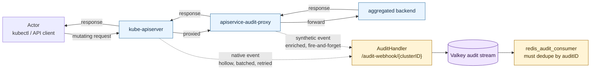
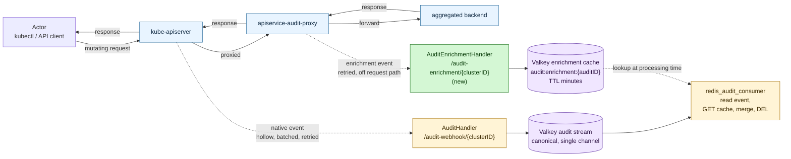
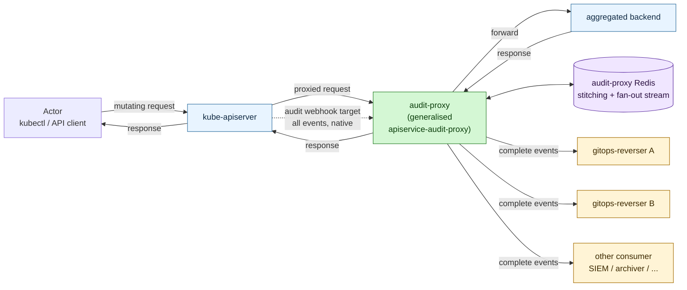

# Idea: dedicated audit enrichment side-channel

> Status: exploratory — improvement proposal for the broader audit pipeline.
> Related to but not blocking [design-commit-context-api.md](design-commit-context-api.md).
> Concrete simplified follow-up:
> [design-audit-event-body-parking.md](design-audit-event-body-parking.md).
> Date: 2026-05-07

## Why this idea exists

Today gitops-reverser ingests audit events from two sources through a single endpoint:

- kube-apiserver, via `--audit-webhook-config-file`
- `apiservice-audit-proxy`, when deployed in front of an aggregated API

Both POST `auditv1.EventList` payloads to `/audit-webhook/{clusterID}` and both flow through
the same `AuditHandler`. For a request that passes through the proxy, two events with the same
`auditID` end up in the canonical audit stream — one hollow native event from kube-apiserver,
one enriched synthetic event from the proxy.

This works but couples the two channels and forces every consumer to reason about the
duplicate. The [CommitContext design](design-commit-context-api.md) notes this as the reason
for an idempotency-marker mechanism in its consumer logic. A cleaner alternative is to give
the proxy its own ingestion endpoint that does *not* feed the canonical stream, and instead
populates a side-cache the consumer reads when processing the canonical event.

This is best treated as **pipeline cleanup, not a `CommitContext` prerequisite.**
`CommitContext` v1 should ship with the local stash plus idempotency marker described in
[design-commit-context-api.md](design-commit-context-api.md); the side-channel is the
follow-up that removes the marker workaround once the broader pipeline is reshaped.
Treating it as a prerequisite would block `CommitContext` behind a refactor that does not
need to be in the critical path.

## Current shape

`AuditHandler.ServeHTTP` accepts both kube-apiserver and proxy POSTs, decodes the
`EventList`, and enqueues each event to the Valkey audit stream
([internal/webhook/audit_handler.go:107](../../internal/webhook/audit_handler.go#L107),
[internal/webhook/audit_handler.go:226](../../internal/webhook/audit_handler.go#L226)).

The proxy's send is fire-and-forget with no retry
([handler.go:202](../../external-sources/apiservice-audit-proxy/pkg/proxy/handler.go#L202)):

```go
go h.buildAndSendAuditEvent(...)  // 5s timeout, single attempt
```

kube-apiserver's send is batched and retried per its own audit-webhook semantics.

Two costs of the current shape:

1. **Two events with the same `auditID` reach the consumer.** Every consumer has to reason
   about both arrivals. For designs like `CommitContext` this means an idempotency marker is
   needed to avoid false stash-miss alarms.
2. **The proxy and kube-apiserver share an ingestion endpoint.** In principle the proxy
   could delay or perturb native event ordering. In practice they do not interfere, but the
   coupling is real.



Both audit channels converge on the same handler and the same stream. The consumer ends up
holding the duplicate-detection responsibility.

## Proposed shape

Move `apiservice-audit-proxy` ingestion to its own endpoint, working name
`/audit-enrichment/{clusterID}`, served by a new `AuditEnrichmentHandler` separate from
`AuditHandler`. The new handler's only job:

1. Validate the inbound `EventList` came from a trusted proxy (mTLS / kubeconfig as today).
2. For each event, write the enriched payload to a Valkey cache keyed by `auditID`:
   - key: `audit:enrichment:<audit-id>`
   - value: the full event including `requestObject`, `responseObject`, and `objectRef.name`
   - TTL: minutes — long enough to outlive kube-apiserver batch delivery, short enough not
     to pile up
3. Return 200.

The canonical audit stream now contains *only* native kube-apiserver events. When the
consumer processes one for an aggregated-API kind, it does a single Valkey GET on
`audit:enrichment:<audit-id>`:

- **Hit:** merge the enriched payload onto the hollow native event, process the merged
  result, DEL the cache entry.
- **Miss:** process the hollow event as-is. For built-in resources this is already the
  default. For aggregated APIs with no proxy in their path, it is the existing degraded
  behaviour.



The enrichment becomes a *side-channel* (green): a separate endpoint, a separate Valkey key
space, a separate retry policy, separate metrics. The canonical pipeline (yellow boxes plus
the audit stream) carries exactly one event per request and the consumer joins enrichment
in on demand. The enrichment write happens in a goroutine right after the proxied response,
so under normal conditions it lands in cache before the kube-apiserver batched native
delivery — but this is "almost always" rather than "structurally guaranteed" (see the
ordering point in the next section). The architecture's real win is removing the
duplicate-event problem; the consumer accepts a brief wait-or-degrade fallback for the
rare cases where native arrives first.

## Why this is better

- **One event per request in the canonical pipeline.** No more sibling-event reasoning, no
  more idempotency markers, no "is this miss real or already-attached?" branching. The
  consumer's logic for `CommitContext` and similar designs collapses to "GET stash, attach,
  DEL."
- **Ordering: usually right, but not strictly guaranteed.** The proxy's enrichment send
  starts in a goroutine *after* the proxied response is written
  ([handler.go:196](../../external-sources/apiservice-audit-proxy/pkg/proxy/handler.go#L196)),
  so it generally beats kube-apiserver's batched native delivery — but only generally. If
  the receiver is slow, the proxy's goroutine pool backs up, retries kick in, or audit
  webhook batching is configured aggressively, the native event can still arrive first.
  The consumer should therefore be designed as "GET the cache; for events from kinds
  that are *expected* to be enriched, optionally wait or retry briefly before degrading
  to the hollow event," not "single GET is always enough." The architecture's real
  structural win is removing the duplicate-event problem entirely; ordering is "almost
  always wins, with a defined fallback" rather than a hard guarantee.
- **Separation of concerns / uptime isolation.** The proxy is an enrichment side-channel,
  not a parallel main channel. Its uptime, retries, and timing cannot affect the order or
  completeness of native audit events. If the proxy is down, audit ingestion still works —
  events are just hollow for aggregated APIs the proxy was supposed to enrich.
- **Testable independently.** A separate handler is its own RBAC scope, its own cert, its
  own metrics, and its own e2e surface.

## Required upstream changes in `apiservice-audit-proxy`

- The proxy must **retry** on transient send failures. The current shape (one attempt, 5s
  timeout) is acceptable for best-effort delivery alongside native audit, but in the
  enrichment role losing the event loses the only source of `requestObject`/`responseObject`
  for that request. A bounded retry with backoff (e.g., 3 attempts over ~10s) is the
  minimum. Retry must run in a goroutine pool that does not block the main request path, so
  a slow receiver cannot back-pressure the proxy's pass-through duty.
- The proxy chart needs a way to point its webhook kubeconfig at the new
  `/audit-enrichment/` endpoint instead of `/audit-webhook/`.

## Observability for "something is wrong"

There is no existing miss or orphan counter on the audit pipeline today. `AuditHandler`
exports `gitopsreverser_audit_events_received_total`
([internal/telemetry/exporter.go:70-71](../../internal/telemetry/exporter.go#L70-L71)) but
nothing equivalent for "expected enrichment did not arrive." Net-new counters that land
alongside this work:

- `audit_enrichment_miss_total` — incremented when the consumer processes a native event
  for a resource that should have been enriched (aggregated API kind) but found no
  enrichment cache entry.
- `audit_enrichment_orphan_total` — incremented when an enrichment cache entry expires
  without ever being matched by a native event.
- `audit_enrichment_received_total` — total enrichments received (parallel to the existing
  `audit_events_received_total`).
- `audit_enrichment_handler_errors_total{reason}` — handler-side errors (TLS, decode,
  validation).

Persistent non-zero rates on the miss or orphan counters indicate one of: proxy down,
cluster has aggregated APIs that bypass the proxy, network partition between proxy and
gitops-reverser, or misconfigured Valkey routing. Alert thresholds and runbook entries
should land alongside the metrics themselves.

**Implementation note on orphan counters.** Valkey TTL expiry does not natively emit a
counter increment, so `audit_enrichment_orphan_total` (and the analogous
`commit_context_stash_orphan_total`) cannot be assumed for free. Implementing them
requires either subscribing to Valkey keyspace notifications
(`__keyevent@*__:expired`, configured via `notify-keyspace-events`) or maintaining a
small secondary index of in-flight cache entries plus a sweeper that decrements on a
successful match and counts on expiry. Either approach is straightforward but is a
non-trivial implementation choice that should be designed deliberately and land
alongside the metric — not promised in advance and discovered missing later.

## Open questions

- **TTL value.** "Minutes" is a placeholder. Concrete value should be longer than the
  cluster's `--audit-webhook-batch-max-wait` plus typical processing lag, but short enough
  not to bloat Valkey. 5–15 minutes is a reasonable starting range; whether to expose this
  to operators or fix it in code is open.
- **Cache value schema versioning.** Different proxy versions may emit different enrichment
  shapes. The cache value should carry a schema version (`{"v":1, "event": ...}`) so a
  future proxy upgrade does not surprise the consumer.
- **Multi-proxy support.** If multiple proxies front different aggregated APIs, they all
  write to the same enrichment cache. Should the proxy identify itself in the value
  (proxy name + version) for debugging? Audit annotations on the event itself would carry
  this naturally.
- **Marker for "this kind is expected to be enriched."** The miss counter only makes sense
  if the consumer knows which audit events *should* have had enrichment. Either the
  consumer keeps a list of aggregated-API kinds it knows the proxy fronts, or the proxy
  attaches a flag (`apiservice-audit-proxy/expected: true`) to enrichment payloads at
  registration time. Worth pinning the rule before metrics start firing alerts.
- **Should the CommitContext stash collapse into this cache?** Probably no. The
  CommitContext stash holds the request body that *gitops-reverser's own handler* saw — the
  proxy is not in the picture and is not even required to be deployed for `CommitContext`.
  Two caches with two purposes is fine; the doc should make the distinction clear.
- **Is the enrichment endpoint a good place for other advisory data?** Future signals
  (a webhook-policy decision log, a downstream replication confirmation) could ride on the
  same envelope. Premature to commit, but the endpoint should be designed not to lock out
  adjacent uses.

## Potential problems and risks

The refinement is not free. Concrete things that can go wrong:

- **Trust boundary on the new endpoint.** The enrichment payload carries `requestObject` and
  `responseObject` that the consumer treats as the source of truth for a hollow native
  event. A compromised or misconfigured proxy can therefore inject false content for a
  specific `auditID`. mTLS and kubeconfig restrict *who can write*, but the consumer has no
  independent way to verify *what was written* against kube-apiserver's view (the native
  event has no body). Mitigations: pin the proxy identity in the cache value, log
  prominently on first-of-kind enrichments per cluster, and treat any merge as a low-trust
  enrichment for security-sensitive audit consumers.
- **Cache memory pressure.** Every aggregated-API mutation goes through the enrichment
  cache. For high-volume aggregated APIs (metrics-server-style traffic, custom-metrics
  apiservers, etc.) this can become significant Valkey memory. TTL bounds it but the
  steady-state working set scales with traffic — capacity planning becomes a deployment
  concern.
- **Replay after consumer crash.** If the consumer DELs the enrichment cache entry but
  crashes before durably committing the joined event downstream, on restart the audit
  event replay finds an empty cache. The consumer must either write the joined-event
  result downstream first and DEL only after success, or accept "process hollow on replay
  and lose enrichment." Pick one and document it.
- **Proxy retry backpressure.** With retry semantics, a slow or down receiver causes the
  proxy to spend time retrying. If retry runs on the proxy's request path it back-pressures
  the proxy's pass-through duty and slows the apiserver's view of the aggregated API. Retry
  must be off the request path, in a goroutine pool with bounded concurrency.
- **Disagreement between native and synthetic views of the same request.** In pathological
  cases (proxy and kube-apiserver disagree on response status, or one drops the request
  mid-flight) the cache might say `responseStatus.code == 201` while the canonical event
  says `responseStatus.code == 500`. Pick a rule: consumer trusts the canonical event for
  status, identity, and timestamps; only `requestObject` / `responseObject` / `objectRef.name`
  come from enrichment. The synthetic event's view of `responseStatus` is only useful as
  debugging context, never as authority.
- **Operator runbook complexity.** Two audit endpoints, two caches, two retry stories, two
  metrics families. Troubleshooting "why isn't this commit landing?" now has more variables.
  A runbook section that walks through the layered failures becomes a release requirement,
  not a nicety.
- **Cluster federation / multi-Valkey deployments.** If gitops-reverser runs multiple
  instances pointing at separate Valkeys (per-tenant, per-region), the proxy needs to know
  which Valkey to land in. Today the kubeconfig-based webhook delivery routes per-cluster
  via the URL path; the new endpoint must follow the same model so split deployments still
  work.
- **Net-new TLS surface.** The new endpoint needs its own TLS terminus. Either share the
  existing audit-webhook cert (works if DNS / SANs match) or issue a second cert. Either
  way it is a deployment item that did not exist before, and rotation procedures must
  cover both.
- **Distinguishing "no proxy in path" from "proxy delivered nothing".** Both look like
  enrichment misses to the consumer. Without the "should-have-been-enriched" hint (see
  open questions) the alert metric will fire on benign cases — every audit event for an
  aggregated API the cluster does not run a proxy for will count as a miss. Until that
  hint exists, the metric is best treated as a debugging signal rather than an alerting
  signal.
- **Schema drift across proxy versions.** If a future proxy version adds a field to the
  cache value and an older consumer ignores it, that is fine. If a future consumer expects
  a field an older proxy never wrote, the consumer must degrade gracefully. The schema
  version field listed under open questions is the seatbelt for this.

## Migration

This refinement is non-breaking with respect to `CommitContext` v1alpha1:

- If the refinement lands first, the idempotency-marker case in
  [design-commit-context-api.md](design-commit-context-api.md)'s failure-modes list
  disappears — only one event per `auditID` reaches the consumer, so there is no
  double-attach to defend against.
- If `CommitContext` ships first, the marker mechanism handles the dual-event case until
  the refinement lands.

Either ordering works in principle, but the recommended sequencing is `CommitContext`
first with the marker in place, side-channel afterwards as a pipeline-cleanup follow-up.
See the [Recommendation chapter](#recommendation-which-approach-fits-best) for the full
argument.

## Alternative: `audit-proxy` as universal audit fan-out hub

A more ambitious option, raised because the same maintainer owns
`apiservice-audit-proxy`: expand its scope substantially. Rename it to `audit-proxy`, point
kube-apiserver's `--audit-webhook-config-file` at it instead of at gitops-reverser, give it
its own Redis, and let it own the entire job of producing a trustworthy unified audit
stream. The proxy then fans that stream out to one or more downstream consumers —
gitops-reverser becoming one consumer among potentially many.

### Sketch

- kube-apiserver's audit webhook target moves from gitops-reverser to `audit-proxy`.
- `audit-proxy` continues to do what `apiservice-audit-proxy` does today: sit in front of
  aggregated API backends, capture request and response bodies, attach `Audit-ID`.
- All native kube-apiserver audit events also land in `audit-proxy`.
- `audit-proxy` runs its own Redis (or dedicated Valkey database) used as a short-lived
  stitching cache: it joins the hollow native event with the body it captured for the same
  `auditID`, in-process, without crossing a public network boundary.
- The stitched result is a single, complete, audit-id-deduplicated stream that
  `audit-proxy` exposes as one or more output channels.
- gitops-reverser drops its audit-webhook receiver entirely. It becomes a plain consumer of
  `audit-proxy`'s output channel. The transport between the hub and its consumers is itself
  a design choice — covered below — and is not necessarily a Redis stream.



### Transport: Redis stream vs webhook-style HTTP

The diagram above leaves the transport between the hub and its consumers deliberately
underspecified. The instinct of "audit-proxy publishes to a Redis stream and consumers
attach with consumer groups" is one option, but probably not the right default. A more
conservative choice is to keep the *external* contract of the hub identical to
kube-apiserver's audit webhook — same wire format, same shape, just with the bodies filled
in.

The webhook-style transport has real advantages:

- **Consumers do not change their receive model.** gitops-reverser already speaks
  audit-webhook. If `audit-proxy` is just "kube-apiserver but with complete events," every
  existing consumer integrates without a code change. The hub becomes drop-in.
- **Simple installations stay simple.** A cluster that does not run any aggregated APIs —
  or that accepts hollow audit for the ones it does — can skip the hub entirely and point
  kube-apiserver directly at gitops-reverser, exactly as today. The hub becomes optional
  rather than mandatory. The cost is real and explicit: without the hub, aggregated-API
  events stay hollow.
- **No public Redis surface.** The hub's Redis can stay strictly internal. The network
  contract between hub and consumer is HTTPS, not a Redis pubsub/stream. Smaller exposure
  area, simpler TLS story, no need to publish a Redis client API.

The Redis-stream transport in turn has its own strengths — durable replay, consumer-group
back-pressure, easy multi-consumer fan-out — which matter more if there are many
consumers or a consumer needs to catch up after extended downtime.

Best read: keep the *external* contract on the hub webhook-shaped (same wire format as
kube-apiserver's audit webhook). The hub uses whatever it wants internally — including a
Redis stream as an internal staging buffer — but consumers see audit-webhook. If a
consumer later needs durable replay across restarts, the hub can grow a Redis-stream
output channel alongside the webhook output without breaking anyone.

### Configurable enrichment policy

The hub has to make a choice when the synthetic enriched event and the hollow native
event both exist for the same `auditID`. Rather than hardcoding one strategy, this should
be configuration:

- **Stitch and emit one merged event.** Hold the hollow native event briefly, wait for
  the synthetic enrichment, merge native identity/timestamps with synthetic body, emit one
  record. Highest fidelity, highest latency.
- **Synthetic wins, drop native.** When the synthetic enriched event lands first (the
  expected case for aggregated APIs the proxy fronts), emit it immediately into the
  output and discard the hollow native event when it arrives later. Lowest latency for
  aggregated APIs; trades the native event's batch-and-retry durability for speed.
- **Native wins, drop synthetic.** Emit the native hollow event as it arrives and
  discard the synthetic. Equivalent to "no enrichment" — useful when the operator only
  wants the hub for fan-out, not for body recovery.
- **Pass both.** Today's accidental behaviour. Useful as a debugging mode, but not a
  steady-state strategy.

The choice can be cluster-wide, per-aggregated-APIService, or even per audit-policy rule.
A reasonable default for a typical gitops-reverser deployment is "synthetic wins, drop
native" for aggregated APIs (fastest path to a complete event) and pass-through for
built-in resources (no synthetic exists, so nothing to choose). The merge mode is for
consumers that need both the native event's exact stage timestamps *and* the body — a
security audit archive, for example.

Making this configurable also gives a clean upgrade path: a new strategy can be added
without breaking existing consumers, and operators can tune for latency vs durability per
their constraints. It also acknowledges the maintainer's point that this is a *choice*,
not a single right answer.

### Why it is appealing

- **Dedicated Redis means fast.** The stitching cache is internal to one process boundary;
  reads and writes do not cross mTLS, kubeconfig, or pod-to-pod network. Latency is
  fundamentally lower than any cross-pod design and there is no shared cluster-wide Valkey
  to compete with.
- **Ordering is guaranteed at the source.** The proxy is the only thing that emits events
  downstream. It can hold a hollow native event briefly until the matching enrichment
  arrives (or a timeout fires) and emit one complete record. Downstream consumers see one
  ordered stream of fully-formed events. gitops-reverser shrinks because it no longer has
  to defend against duplicates, hollow events, or missing bodies.
- **Reusable. The audit-stream-trust problem is general.** Other projects that consume
  Kubernetes audit logs face the same hollow-events-for-aggregated-APIs gap. A standalone
  `audit-proxy` that solves it is useful well beyond gitops-reverser. The fix lives once,
  in the right place — auditing infrastructure rather than a downstream consumer.
- **Fan-out to multiple receivers — the killer feature.** kube-apiserver's audit webhook
  configuration accepts exactly one URL per cluster. Today that makes it impossible to run
  multiple gitops-reverser instances against one cluster, or to layer in a SIEM and an
  archiver alongside gitops-reverser. With the proxy as the only direct webhook target,
  fan-out happens cheaply on the proxy side: each subscriber gets its own consumer group
  on the output stream. Multi-consumer audit becomes a Day 1 capability, including the
  "two gitops-reverser instances in one test cluster" case the maintainer hits today.
- **Enterprise adoption depends on it.** Many companies already point their kube-apiserver
  audit webhook at a SIEM, compliance archiver, or in-house security tool. Because
  kube-apiserver supports exactly one webhook target, gitops-reverser cannot be deployed
  alongside that existing consumer without displacing it — and security teams will not
  allow displacing audit infrastructure they already depend on. A fan-out hub turns this
  from "you'd have to convince our security team to replace the SIEM" into "point
  everything at the hub; nothing on the existing consumer side changes." For larger
  clusters this is potentially the difference between "tool that runs in test clusters"
  and "tool a company can actually adopt without a security review of replacing audit
  infrastructure."

### Trade-offs and risks

The reach is much wider than the side-channel proposal, and so is the surface area.

- **Massively expanded scope for `apiservice-audit-proxy`.** Today it is a small focused
  tool that closes one gap. Becoming the cluster's audit hub means owning fan-out semantics,
  consumer-group management, retention, replay, observability for *all* downstream
  consumers, security sensitivity for the full audit log, and an upgrade story that does
  not break any consumer in the wild. The maintainer cost approximately doubles.
- **Single point of failure for the entire cluster's audit ingestion.** Today
  gitops-reverser is also a single point, but the blast radius is "gitops-reverser stops
  working." With the hub, the blast radius is "no audit-driven tool in the cluster gets
  events." That changes how operator teams think about uptime, blue/green upgrades, and HA.
- **One more network hop, paid by every event.** Native audit events that did not need
  enrichment (built-in resources) now traverse the proxy anyway. For an off-request-path
  signal this is acceptable, but it is a tax on every audited mutation in the cluster.
- **Security blast radius concentrates.** Audit events carry identity, request bodies, and
  occasionally secrets-adjacent content. Concentrating that in one fan-out hub raises the
  consequences of a compromise. The hub has to be hardened to a higher bar than a
  consumer-side proxy that only sees a subset.
- **gitops-reverser may or may not gain a hard dependency on `audit-proxy` — it depends
  entirely on the transport choice.** Under a Redis-stream-coupled transport, the
  dependency is real: gitops-reverser cannot ingest audit at all without the hub running.
  Under a webhook-shaped transport (see
  [Transport: Redis stream vs webhook-style HTTP](#transport-redis-stream-vs-webhook-style-http)),
  the property the `CommitContext` design relies on — that gitops-reverser runs without
  `apiservice-audit-proxy` in simple installs — is preserved: a cluster can point
  kube-apiserver directly at gitops-reverser and skip the hub entirely, losing only
  enrichment of aggregated-API events. So this risk is avoidable by design and lands on
  the transport decision, not on the hub idea itself. The recommended default is
  webhook-shaped output, which keeps simple installs simple and makes the hub an
  *optional* component rather than a required one.
- **Consumer-group semantics need a real design pass.** At-least-once vs at-most-once,
  per-consumer retention, slow-consumer back-pressure, replay from a given audit ID,
  ordering guarantees across fan-out edges — none of this is hand-wave. Each consumer's
  failure mode has to be characterised.
- **Operationally heavier.** A second Redis (the proxy's), a second TLS chain (between the
  proxy and each consumer), separate alerting, separate runbooks, separate upgrade
  sequencing.
- **For non-aggregated-API events, enrichment value is zero.** Most audit volume in most
  clusters is not an aggregated API — it is core resources whose native events are already
  complete. Putting them through a stitching cache buys nothing for those events but pays
  the cost.
- **Dual-purpose proxy mixes concerns.** The proxy today has one job: pass-through with
  enrichment. Adding fan-out, retention, and consumer management mixes two
  responsibilities inside one binary. A future split (e.g., a "front-proxy" that does
  pass-through and an "audit-hub" that does fan-out) may eventually become natural — and
  reversing course is harder once consumers have integrated against the combined surface.

### Where it differs from the side-channel proposal

The side-channel proposal keeps gitops-reverser as the audit ingestion point and adds an
internal cache for proxy enrichment. It is a small change, scoped to gitops-reverser, with
no operator-facing impact. The hub proposal moves audit ingestion *out* of gitops-reverser
entirely, into a tool the maintainer already owns, and turns the
one-receiver-per-cluster constraint into a fan-out feature. The two are different
architectural commitments, not deployment variants of the same idea.

### Prior art

A fan-out hub for Kubernetes audit events is not a new idea. The existence of several
mature implementations is itself an argument for the pattern — and a reason to study them
before designing this one from scratch.

- **[gardener/auditlog-forwarder](https://github.com/gardener/auditlog-forwarder)** —
  the closest direct analogue. A webhook server that receives Kubernetes audit events,
  enriches them with metadata annotations, and forwards to multiple configured backends.
  Same architectural shape (single inbound webhook from kube-apiserver, multiple
  outbound backends, optional enrichment). Worth studying for its config model and
  transport choices before committing to building.
- **[KubeSphere kube-auditing-webhook](https://kubesphere.io/docs/v3.4/toolbox/auditing/auditing-receive-customize/)** —
  KubeSphere's CRD-based audit webhook with multiple receiver types (alertmanager and
  more). Tied to KubeSphere as a platform, but demonstrates the same multi-receiver
  need with a CRD-driven configuration model.
- **[sysdiglabs/aks-audit-log](https://github.com/sysdiglabs/aks-audit-log)** —
  Azure-specific (AKS), forwards to Sysdig and Log Analytics. Confirms the
  multi-destination pattern in a managed-Kubernetes context.
- **General-purpose log routers** like
  [Fluent Bit](https://fluentbit.io/), [Fluentd](https://www.fluentd.org/),
  [Vector](https://vector.dev/), and the
  [OpenTelemetry Collector](https://opentelemetry.io/docs/collector/) can be configured
  to receive a Kubernetes audit webhook and fan out to multiple sinks. They do not
  reconstruct hollow events for aggregated APIs, but they are what most enterprises
  already have available for log-shaped fan-out — and they are battle-tested at scale.

What is *not* yet a turnkey component is "fan-out hub plus aggregated-API enrichment in
one tool." Gardener's forwarder enriches but does not (as far as the public docs show)
reconstruct hollow events for aggregated APIs the way `apiservice-audit-proxy` does. The
general-purpose routers do neither. The hub direction therefore has a real
differentiation story — it is not "yet another audit forwarder" but specifically "the
one that closes the aggregated-API gap *and* fans out."

The prior art also opens a build-vs-borrow question. Rather than growing
`apiservice-audit-proxy` into a full hub, an alternative is to extend (e.g.)
`gardener/auditlog-forwarder` with the aggregated-API capture role and let it own the
fan-out side it already does well. Worth weighing if the hub direction is taken — it
trades maintenance commitment on a familiar codebase for cooperation with an upstream
project that already has its own roadmap.

### If upstream solved it

The honest meta-point: this whole class of work is firefighting around an upstream
Kubernetes gap. If kube-apiserver one day populated `requestObject`, `responseObject`, and
`objectRef.name` for aggregated API audit events natively, the entire enrichment story
disappears. Consumers would receive complete events directly, the side-channel cache
becomes unnecessary, and `audit-proxy`'s pass-through-with-enrichment role evaporates.

What does *not* go away in that future is the fan-out problem. kube-apiserver still
accepts only one audit webhook target per cluster. A cluster that wants multiple audit
consumers (gitops-reverser plus a SIEM, or two gitops-reverser instances) still needs a
fan-out hub between the apiserver and the consumers — even if every event the hub
forwards is already complete out of the box.

So the layered reality:

- **If upstream fills the audit gap:** the side-channel and the enrichment role both
  retire. The hub stays alive but only for fan-out.
- **If upstream also adds multi-target audit webhook configuration:** the hub retires
  entirely. None of these documents are needed.
- **If neither lands:** the maintenance burden is permanent and the hub becomes a more
  attractive long-term investment.

This framing matters for sequencing. Investing heavily in stitching infrastructure has
diminishing returns if upstream is moving on the gap; investing in fan-out is durable
regardless. If the maintainer has to pick which capability of the hub to harden first,
fan-out is the most upstream-resilient bet.

## Recommendation: which approach fits best

| Aspect | Current shape | Side-channel cache | `audit-proxy` hub |
|--------|---------------|--------------------|-------------------|
| Scope of change | none | gitops-reverser only | `apiservice-audit-proxy` generalisation + gitops-reverser drops audit ingestion |
| New components | none | new endpoint + cache in gitops-reverser | new Redis + fan-out story in audit-proxy |
| Cluster operator impact | none | audit-policy update | new audit-webhook target, new component to operate |
| Multiple consumers? | no | no | yes — major win |
| gitops-reverser complexity | high (consumer-side dedupe) | medium (cache lookup) | low (plain stream consumer) |
| Single point of failure for cluster audit | gitops-reverser | gitops-reverser | audit-proxy |
| Reusable for other projects | no | no | yes |
| Time to first viable implementation | already shipped | days to weeks | months — design + maintenance commitment |
| Reversibility | n/a | easy to roll back | hard once consumers integrate |
| Solves "two gitops-reverser in one cluster" | no | no | yes |

The honest read:

- **The side-channel is pipeline cleanup, not a `CommitContext` prerequisite.**
  `CommitContext` v1 should ship with the local stash + idempotency marker described in
  [design-commit-context-api.md](design-commit-context-api.md). That is enough to get the
  feature working under the current single-endpoint shape. The side-channel comes
  afterwards as the follow-up that removes the marker, removes consumer-side reasoning
  about duplicate `auditID`s, and stops every future audit-driven feature from inheriting
  the same workaround. Treating it as a prerequisite would block `CommitContext` on a
  broader audit-pipeline refactor that does not need to be in the critical path.
- **Pursue it eventually — sooner if aggregated-API enrichment matters beyond
  `CommitContext`.** The side-channel pays for itself the moment a second feature in
  gitops-reverser depends on a complete (non-hollow) audit event for an aggregated API.
  Until then it is "valuable but not urgent." It is contained, low-risk, and reversible,
  so when it does become a priority it is a normal-sized engineering project rather than
  a risky refactor.
- **The hub direction is probably not worth pursuing — and the prior art is the reason.**
  Fan-out for Kubernetes audit events is already a solved problem at enterprise scale.
  Companies that need it use Fluent Bit, Fluentd, Vector, the OpenTelemetry Collector,
  [gardener/auditlog-forwarder](https://github.com/gardener/auditlog-forwarder), or
  whichever log router their observability or security team has already standardised on.
  Building another forwarder means competing with battle-tested components inside
  someone else's standardised pipeline — a hard place to win adoption from. The unique
  value `apiservice-audit-proxy` carries today is closing the aggregated-API audit gap,
  which none of those tools do; that capability does not require fan-out to be shipped,
  and bundling fan-out into the proxy dilutes the differentiation. See
  [Prior art](#prior-art).
- **Multi-consumer audit needs are best deferred to existing fan-out tools.** A cluster
  with a SIEM and gitops-reverser points the kube-apiserver audit webhook at (e.g.)
  Fluent Bit, which fans out to both. If the cluster also wants aggregated-API bodies,
  place `apiservice-audit-proxy` *upstream* of the fan-out tool — every event the proxy
  emits looks like a normal kube-apiserver audit event with bodies filled in, and any
  compliant fan-out tool ingests it as-is.
- **The deciding question for the maintainer flips.** It stops being "should we grow
  `apiservice-audit-proxy` into a hub?" and becomes "do we keep it narrowly focused on
  the aggregated-API gap, where it is differentiated?" The latter framing fits the
  smaller maintenance commitment naturally and aligns with the upstream-resilience
  point below.
- **Upstream may eventually obsolete the proxy itself.** If kube-apiserver fills the
  aggregated-API audit gap, `apiservice-audit-proxy` retires entirely — and the cluster
  is left with whatever fan-out tool it already had, which was the right answer all
  along. Investing in fan-out as a proxy capability is double-fragile: redundant against
  existing fan-out tools today, and obsoleted against upstream tomorrow. Investing in
  the narrow enrichment role is at least useful for as long as the gap exists. See
  [If upstream solved it](#if-upstream-solved-it).

## Conclusion

The prior-art survey above is the strongest argument *against* the hub direction, not
for it. Fan-out for Kubernetes audit events is already a solved problem in any serious
enterprise environment. Companies that need it have Fluent Bit, Fluentd, Vector, the
OpenTelemetry Collector, gardener/auditlog-forwarder, or whichever log router their
observability or security team has already standardised on. They are not waiting for
another audit forwarder, and they will not adopt one when an existing component already
fits their pipeline.

The unique thing `apiservice-audit-proxy` does today is close the aggregated-API audit
gap by capturing `requestObject` and `responseObject` for requests that pass through it.
That is genuinely differentiated work — none of the general fan-out tools do it. Keeping
the proxy narrowly focused on that one job preserves the differentiation, avoids the
maintenance cost of competing in a crowded category, and lets enterprises drop the
proxy into whatever audit pipeline they already run.

The duplicate-`auditID` ordering problem is real but small, and it is gitops-reverser's
problem to solve internally. The side-channel proposal in the first half of this
document does exactly that, with a contained change scoped to one project. Enterprises
do not care about gitops-reverser's internal pipeline shape; they care that the tool
integrates with the audit forwarder they already trust. That is a much smaller surface
to defend.

End-state recommendation:

1. **Keep `apiservice-audit-proxy` doing its one unique thing.** Aggregated-API audit
   enrichment via a synthetic webhook event. Do not grow it into a fan-out hub.
2. **Solve gitops-reverser's duplicate-`auditID` issue inside gitops-reverser**, via
   the side-channel pattern in this document, after `CommitContext` v1 ships with the
   local-stash + idempotency-marker approach.
3. **Direct enterprise users with multi-consumer audit needs at the existing fan-out
   tools.** Place `apiservice-audit-proxy` *upstream* of those tools — every event the
   proxy emits looks like a normal kube-apiserver audit event with bodies filled in,
   and any compliant fan-out tool consumes it as-is. ConfigButler composes with
   whatever audit forwarder the cluster already runs; it does not ask to replace it.
4. **Revisit only if** multi-consumer audit *plus* aggregated-API enrichment together
   becomes a real gap that no existing fan-out tool covers. By then upstream Kubernetes
   may have closed the audit gap and made the proxy itself redundant — which would moot
   the question.

This is a tighter scope than the hub direction promised, and that is the point.
Differentiation lives in the narrow capability that no one else covers; everything else
should compose with what enterprises already run.

## References

- Existing audit handler:
  [internal/webhook/audit_handler.go](../../internal/webhook/audit_handler.go)
- Existing proxy send path:
  [external-sources/apiservice-audit-proxy/pkg/proxy/handler.go](../../external-sources/apiservice-audit-proxy/pkg/proxy/handler.go)
- Audit-ID propagation through the serving hierarchy:
  [Audit ID Chain (kubernetes/kubernetes#101597)](https://github.com/kubernetes/kubernetes/issues/101597)
- Native audit gap context:
  [external-sources/apiservice-audit-proxy/README.md](../../external-sources/apiservice-audit-proxy/README.md)
- Related design that surfaces this trade-off:
  [design-commit-context-api.md](design-commit-context-api.md)
