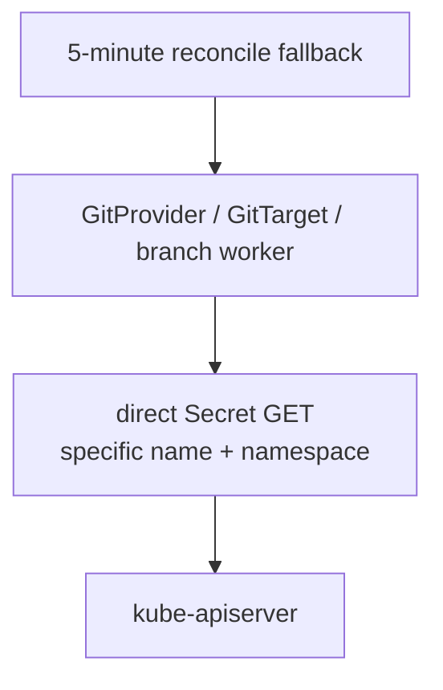

# Stop retaining Secret values

> Status: implementation plan.
> Date: 2026-07-07
> Roadmap: [Secret handling roadmap](secret-handling-roadmap.md).
> Scope: remove full Secret values from the controller-runtime cache, keep direct reads
> fresh, drop control-plane Secret watches, and remove private age identities from the SOPS
> encrypt path.

## Summary

This plan is the first implementation slice of the Secret handling work. It does not try
to solve RBAC. It solves the process-level problem: the controller should not keep every
Secret value in the cluster in memory.

The target state:

- no controller-runtime informer stores full `corev1.Secret` objects;
- no controller-runtime Secret informer is started for control-plane dependencies;
- typed Secret reads go directly to the API server;
- external Secret changes are noticed by direct reads and a 5-minute reconcile fallback;
- SOPS encryption uses public age recipients only;
- no private age identity is written to disk or passed to the `sops` process.

TTL is a fallback load optimization, not the design.

## Current problem

The manager is created without cache options:
[cmd/main.go](../../cmd/main.go#L841). Any informer started by the shared cache is
cluster-wide unless configured otherwise.

`GitTarget.SetupWithManager` registers a full Secret watch:
[gittarget_controller.go](../../internal/controller/gittarget_controller.go#L965).
The map function only needs the Secret name and namespace, but the current watch stores
full Secret objects, including `data`.

Several code paths also read specific Secrets through the cached client:

- GitProvider credentials:
  [gitprovider_controller.go](../../internal/controller/gitprovider_controller.go#L262)
- branch-worker credentials:
  [branch_worker.go](../../internal/git/branch_worker.go#L504)
- age encryption Secret:
  [encryption.go](../../internal/git/encryption.go#L173)
- signing keys:
  [helpers.go](../../internal/git/helpers.go#L37)

Result: one reactivity watch can make the process retain cleartext Secret values for the
whole cluster, even though the operator only needs a small number of named Secrets.

## Target model

Use one default access mode for controller-owned Secret inputs:

- **Read values directly** only when code actually needs a specific Secret.
- **Reconcile every 5 minutes** so out-of-band Secret changes are picked up without a
  Secret watch.



This gives up instant Secret-rotation reaction in exchange for a cleaner default: no
Secret list/watch, no metadata informer, no namespace flag, and no Secret values retained
by the controller cache. Mirroring watches are separate and remain required for selected
resources.

## Implementation steps

### 1. Delete the GitTarget Secret watch

Remove the control-plane Secret watch from `GitTarget.SetupWithManager`:

```go
// internal/controller/gittarget_controller.go
- Watches(&corev1.Secret{}, handler.EnqueueRequestsFromMapFunc(r.encryptionSecretToGitTargets)).
```

Do not replace it with `WatchesMetadata` by default. Generated age Secret recovery and
out-of-band age-key updates can wait for the 5-minute GitTarget reconcile. That is a
better least-privilege baseline than keeping a cluster-wide Secret metadata watch.

### 2. Disable cached reads for typed Secrets

Add `Client.Cache.DisableFor` in `newManager`:

```go
mgr, err := ctrl.NewManager(ctrl.GetConfigOrDie(), ctrl.Options{
    Scheme:                 scheme,
    Metrics:                metricsOptions,
    HealthProbeBindAddress: probeAddr,
    WebhookServer:          webhookServer,
    Client: client.Options{
        Cache: &client.CacheOptions{
            DisableFor: []client.Object{&corev1.Secret{}},
        },
    },
})
```

This keeps typed Secret reads live and prevents a typed Secret `Get` from starting a
full-object Secret cache.

### 3. Keep GitProvider credential rotation pull-based

Do not add a GitProvider Secret watch by default. `GitProvider` should revalidate on its
own spec changes and on the common 5-minute periodic reconcile.

Branch workers also read credentials directly when they need them, so writes can pick up
new credentials on the next operation. GitProvider status may lag until the next 5-minute
validation pass, which is acceptable for the default least-privilege mode.

### 4. Standardize control-plane reconcile fallback at 5 minutes

After removing Secret watches, use 5 minutes as the common control-plane periodic
reconcile cadence. This replaces the old split where fast paths used 2 minutes, some
Secret/config failures used 5 minutes, and steady validation could wait up to 10 minutes.
In code terms, collapse the control-plane uses of the short, medium, and long requeue
intervals to a 5-minute steady fallback for GitProvider, GitTarget, WatchRule, and
ClusterWatchRule reconcilers.

The intent is simple to explain:

- no Secret watch by default;
- external Secret changes become visible within 5 minutes through reconcile;
- direct reads still use the freshest Secret value when work is already happening.

### 5. Remove redundant credential reads where practical

The branch worker reads the same credentials Secret several times during a push cycle.
Prefer a structural fix:

- resolve auth once at the start of a flush or push operation;
- pass the resolved auth through clone, fetch, push, force-push, and retry code;
- keep direct reads as the default.

Only add a short TTL memo if an install measures API pressure. If added, keep it opt-in
and off by default. A long TTL recreates stale-credential behavior.

Direct reads are acceptable because the operator reads a small set of named Secrets, not
every object during every reconcile. A direct `GET` is real API/etcd work, so avoid tight
loops; the structural read-once change above is the preferred load fix.

### 6. Stop passing private age identities to SOPS

The write path only encrypts. It does not decrypt.

Evidence in the current code:

- `Encryptor` only exposes `Encrypt`:
  [encryption.go](../../internal/git/encryption.go#L35)
- `SOPSEncryptor.Encrypt` runs `sops --encrypt`:
  [sops_encryptor.go](../../internal/git/sops_encryptor.go#L43)
- encrypted-content reuse compares plaintext digest plus Kubernetes identity markers and
  never decrypts Git content:
  [content_writer.go](../../internal/git/content_writer.go#L87)

age encryption needs public recipients. The private age identity is for decryption, and
this operator does not decrypt. So remove it from the hot path:

- drop `AgeIdentities` from `ResolvedEncryptionConfig`;
- stop returning `secretIdentities` from `ResolveTargetEncryption`;
- remove `writeAgeIdentityFile`, `SOPS_AGE_KEY_FILE`, and the age identity temp-file path;
- remove blanket `toSOPSEnvironment(secret.Data)` for the age path.

After this step, the operator may still read a BYO private age key to derive a recipient,
but it does not write the private key to disk or pass it to `sops`.

### 7. Later: publish recipients as metadata

This is useful but larger than the first slice.

For generated age keys, the controller already writes
`configbutler.ai/age-recipient`. For BYO age-key Secrets, the controller can derive the
recipient once and publish a controller-owned annotation such as
`configbutler.ai/age-recipients`.

Then the write path can read recipients from spec plus metadata and avoid reading private
age-key `data` except during bootstrap or rotation.

Security rule: never blindly trust a user-written recipient annotation. If an attacker can
set the annotation to their public key, mirrored Secrets can be encrypted to a key they
control. The controller must derive and overwrite the annotation from the actual key
material, or the GitTarget spec must carry the public recipient directly.

## RBAC impact

The default plan no longer needs `secrets list/watch` for controller-owned credential and
age-key inputs. It still needs scoped `secrets get` for referenced input Secrets, plus
scoped write verbs where the operator generates signing or age-key Secrets.

The runtime change can land before the generated default RBAC is narrowed. The important
contract is that `list/watch` becomes unnecessary for controller-owned Secret inputs, so
the least-privilege packaging can remove those verbs.

If optional Secret metadata watches are added later, they use the normal Secret endpoint
and require `secrets get,list,watch` in their scope. Kubernetes RBAC does not provide a
metadata-only Secret permission.

RBAC narrowing is covered by
[scoped-rbac-least-privilege-plan.md](scoped-rbac-least-privilege-plan.md).

## Optional fast-rotation mode

Add Secret metadata watches only if 5-minute rotation reaction is not good enough:

- first preference: no Secret watch;
- second preference: have the RBAC generator or Helm values derive the static namespace set
  from `GitProvider` and `GitTarget` manifests;
- last resort: add an explicit `--secret-watch-namespaces=ns1,ns2` flag for metadata
  reactivity.

If the flag exists, use the more precise name above rather than `--secret-namespaces`.
The original issue name sounds like it scopes a value cache. This plan scopes metadata
reactivity only and must not reintroduce a full Secret value cache.

## Tests

- Unit: Secret-to-GitProvider and Secret-to-GitTarget map functions enqueue only matching
  objects only if optional metadata watch mode is implemented.
- Unit: SOPS environment no longer includes private age identity material.
- Envtest: typed Secret reads see fresh data after a direct Secret update, proving they do
  not come from a stale cache.
- Unit or controller test: control-plane steady reconciles use a 5-minute interval.
- E2E: rotating a Git credential Secret is picked up by direct reads or by GitProvider
  status within 5 minutes.
- E2E: rotating an age key Secret is picked up by direct reads or by GitTarget reconcile
  within 5 minutes.

## Done

This plan is complete when:

- no full-object Secret informer is created by the manager;
- no Secret metadata informer is created by default;
- typed Secret reads bypass the cache;
- control-plane controllers use a 5-minute fallback reconcile for external changes;
- SOPS encryption no longer receives private age identities;
- docs clearly state the default mode needs Secret `get` for inputs, not Secret
  `list/watch`.
