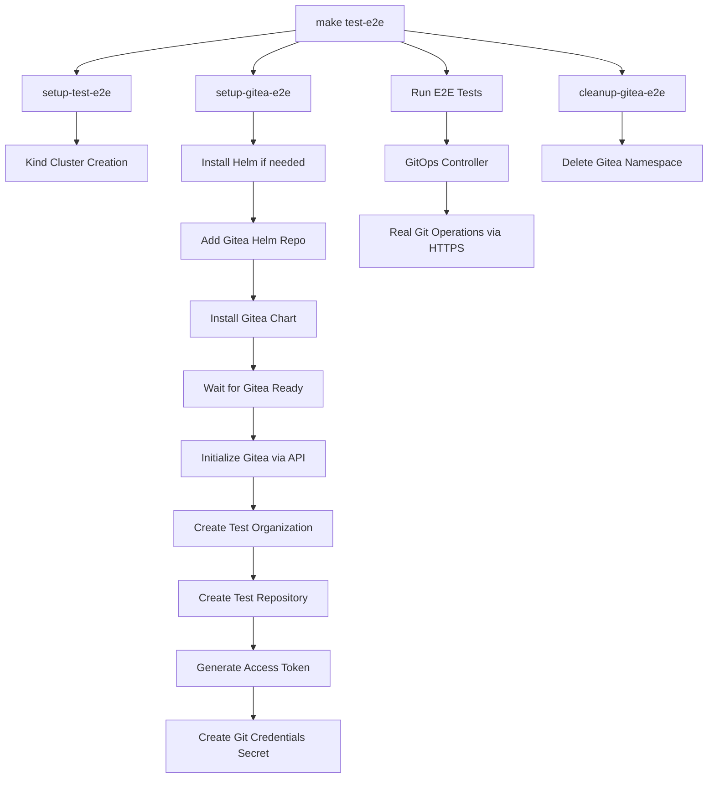

# Gitea E2E Testing Setup

This document outlines the integration of Gitea into the e2e testing pipeline for realistic Git operations testing.

## Architecture Overview



## Implementation Strategy

### 1. Authentication Method: HTTPS + Tokens
- **Rationale**: Simpler K8s integration, easier debugging, reliable in CI
- **Secret Format**: Maintain existing `ssh-privatekey`/`known_hosts` structure but use HTTPS URLs
- **Token Storage**: Store Git token in `ssh-privatekey` field (semantic mismatch but functional)

### 2. Makefile Integration
- **New Target**: `setup-gitea-e2e` - modular installation
- **New Target**: `cleanup-gitea-e2e` - proper cleanup
- **Integration Point**: Eventually merge into `test-e2e` workflow

### 3. Gitea Configuration
- **Storage**: Memory-based for speed (not persistent)
- **Database**: SQLite in memory
- **Users**: Single admin user with API access
- **Repository**: Auto-created test repo per run

## Technical Specifications

### Helm Values Configuration
```yaml
# test/e2e/gitea-values.yaml
persistence:
  enabled: false
postgresql:
  enabled: false
mysql:
  enabled: false
gitea:
  config:
    database:
      DB_TYPE: sqlite3
      PATH: ":memory:"
    server:
      PROTOCOL: http
      HTTP_PORT: 3000
    security:
      INSTALL_LOCK: true
    service:
      DISABLE_REGISTRATION: true
  admin:
    username: giteaadmin
    password: giteapassword123
    email: admin@example.com
service:
  http:
    type: ClusterIP
    port: 3000
```

### API Integration Points
1. **Health Check**: `GET /api/healthz`
2. **Create Organization**: `POST /api/v1/orgs`
3. **Create Repository**: `POST /api/v1/orgs/{org}/repos`
4. **Generate Token**: `POST /api/v1/users/{username}/tokens`

### Secret Structure
```yaml
apiVersion: v1
kind: Secret
metadata:
  name: git-creds
  namespace: sut
type: Opaque
data:
  ssh-privatekey: <base64-encoded-git-token>
  known_hosts: <base64-encoded-gitea-host-key>
```

## Expected Repository URLs
- **Format**: `https://gitea.gitea-e2e.svc.cluster.local:3000/testorg/testrepo.git`
- **Authentication**: Via Bearer token in Git credentials
- **Sample Update**: Update `configbutler.ai_v1alpha1_gitrepoconfig.yaml` to use this URL

## Benefits
1. **Realistic Testing**: Real Git clone/push operations
2. **CI Compatibility**: Memory-based, fast setup/teardown
3. **Debugging**: HTTP logs easier to trace than SSH
4. **Isolation**: Fresh instance per test run
5. **Maintainability**: Standard Helm chart, minimal custom configuration

## Implementation Order
1. Add Helm installation check/setup to Makefile
2. Create Gitea values file for e2e testing
3. Implement setup-gitea-e2e Makefile target
4. Create Gitea initialization script
5. Update sample configurations
6. Test integration with existing e2e suite
7. Add cleanup and error handling
8. Documentation and CI integration