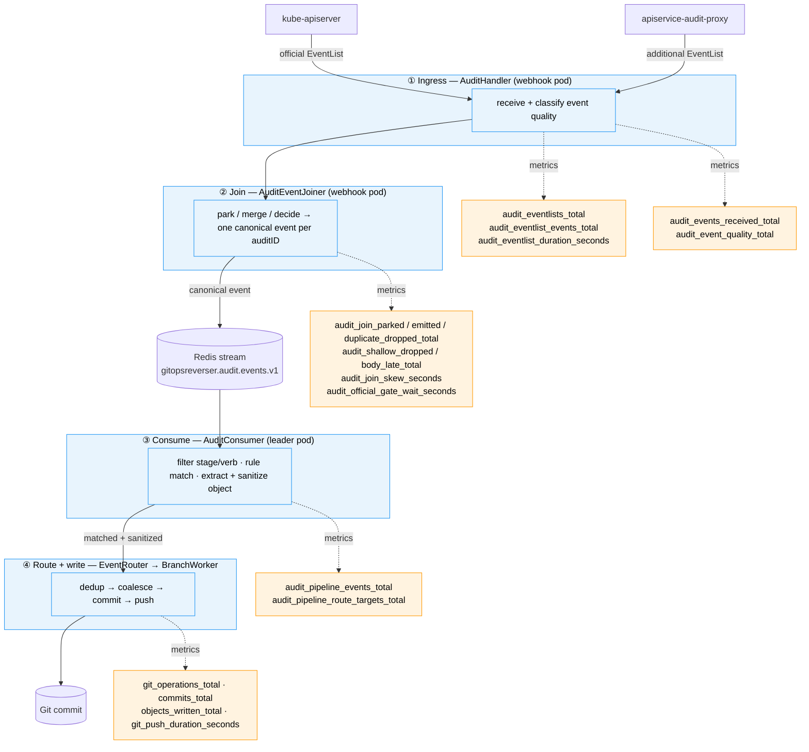

# Interpreting GitOps Reverser Metrics

> Last updated: May 2026

This is the operator's field guide to the metrics GitOps Reverser exports. It explains how to
read each metric family and gives copy-pasteable PromQL for the questions operators actually
ask.

It is a living document. New metrics should arrive here with at least one example query — a
metric nobody knows how to read is not observable.

---

## Where metrics come from

GitOps Reverser exports Prometheus-format metrics via the controller-runtime metrics server.
The bind address is `servers.metrics.bindAddress` (default `:8080`); metrics are served at
`/metrics`.

All metric names are prefixed `gitopsreverser_`. Throughout this document the prefix is
omitted in prose but kept in queries.

Three instrument shapes appear:

| Shape | Suffix | How to read it |
| --- | --- | --- |
| **Counter** | `_total` | Monotonic. Always wrap in `rate(...[5m])` or `increase(...[1h])` — the raw value is meaningless. |
| **Histogram** | `_seconds` | Exposes `_bucket`, `_sum`, `_count`. Use `histogram_quantile()` for percentiles; `_count` is a free counter of observations. |
| **Gauge** | (none) | Instantaneous value; read directly. |

### Reading a histogram

A histogram named `foo_seconds` produces three series:

- `foo_seconds_bucket{le="..."}` — cumulative count per bucket boundary
- `foo_seconds_count` — total number of observations (use it like a counter)
- `foo_seconds_sum` — sum of all observed values

Percentile:

```promql
histogram_quantile(0.95, sum by (le) (rate(gitopsreverser_foo_seconds_bucket[5m])))
```

Mean:

```promql
rate(gitopsreverser_foo_seconds_sum[5m]) / rate(gitopsreverser_foo_seconds_count[5m])
```

---

## Audit ingestion pipeline

This is the most timing-sensitive subsystem, so it gets the most coverage. Background:
[architecture.md → Audit Ingestion Pipeline](architecture.md#audit-ingestion-pipeline).

The pipeline has four stages — ingress, join, consume, route+write — and metrics are emitted
at the edge of each. This map shows where every audit-pipeline metric is recorded before you
read the per-metric rows:



Event-identity labels read consistently as `group`/`version`/`resource`/`verb` across every
stage, so one PromQL `sum by (group, version)` aggregates the whole pipeline.

The pipeline joins two event sources per `auditID`: the **official** kube-apiserver audit event
(authoritative for *who/when*) and an **additional** body contribution from a proxy
(authoritative for *what*, on aggregated-API paths). They race. The healthy case is the
additional body arriving first and parking; when the official wins the race it waits up to
`--audit-event-body-wait` (default `500ms`) for the body before dropping.

### The metrics

| Metric | Type | Labels | Stage |
| --- | --- | --- | --- |
| `audit_eventlists_total` | counter | `source`, `outcome` | ① ingress |
| `audit_eventlist_events_total` | counter | `source`, `outcome` | ① ingress |
| `audit_eventlist_duration_seconds` | histogram | `source`, `outcome` | ① ingress |
| `audit_events_received_total` | counter | `source`, `group`, `version`, `resource`, `subresource`, `verb` | ① ingress |
| `audit_event_quality_total` | counter | `source`, `quality`, `group`, `version`, `resource`, `verb` | ① ingress |
| `audit_join_parked_total` | counter | — | ② join |
| `audit_join_emitted_total` | counter | `source`, `result` (`as_is`, `merged`) | ② join |
| `audit_join_duplicate_dropped_total` | counter | `reason` | ② join |
| `audit_shallow_dropped_total` | counter | `group`, `version`, `resource`, `verb` | ② join |
| `audit_join_body_late_total` | counter | `group`, `version`, `resource`, `verb` | ② join |
| `audit_join_skew_seconds` | histogram | `arrival` (`body_first`/`official_first`), `outcome` (`merged`/`timed_out`) | ② join |
| `audit_official_gate_wait_seconds` | histogram | — | ② join |
| `audit_pipeline_events_total` | counter | `group`, `version`, `resource`, `verb`, `outcome` | ③ consume |
| `audit_pipeline_route_targets_total` | counter | `git_target_namespace`, `git_target`, `rule_kind`, `outcome` | ③ route |

**Stage ① — EventList ingress.** `audit_eventlists_total` and `audit_eventlist_duration_seconds`
count request attempts at the webhook's two audit endpoints; `audit_eventlist_events_total`
counts the decoded event items inside them. `outcome` is bounded: `processed`, `empty`,
`decode_error`, `process_error`. This is the raw delivery boundary — it answers "are EventLists
arriving?" before any join or rule logic runs. `audit_events_received_total` and
`audit_event_quality_total` then describe individual decoded events.

`audit_events_received_total` carries a `subresource` label: empty for top-level resources, and
a bounded value (`exec`, `status`, `scale`, `log`, …) for subresource requests. Subresource
events are counted here but then dropped at ingress — they do not describe a top-level object
the Git pipeline can mirror — so any non-empty `subresource` row is "received then dropped". The
label exists so a `pods/exec` flood is visible as exactly that, rather than collapsing into
`resource="pods"` and looking like real pod mutations.

**Stage ③ — consumer output.** `audit_pipeline_events_total` is recorded once per canonical
event in the consumer, after rule matching. `outcome` tells you which resource events reach the
consumer but do not become Git work: `routed` (reached at least one BranchWorker), `unmatched`
(no rule matched), `dropped_no_body` (matched but no usable body), `route_failed` (every matched
target route failed). `audit_pipeline_route_targets_total` breaks routed/failed attempts down by
destination GitTarget.

`audit_join_skew_seconds` is the centerpiece for timing health. Every official↔additional pair
produces one observation:

- **`arrival="body_first"`** — the additional body was already parked when the official arrived.
  The value is the proxy's *lead time*: how long the body sat parked. Always `outcome="merged"`.
- **`arrival="official_first"`** — the official arrived first and waited on the canonical gate.
  The value is the wait duration. `outcome="merged"` if the body arrived in time,
  `outcome="timed_out"` if the grace period expired (that event is also counted in
  `audit_shallow_dropped_total`).

### Query cookbook

**Are both audit sources delivering EventLists?** If one `source` flatlines, that sender is
down or misrouted:

```promql
sum by (source, outcome) (rate(gitopsreverser_audit_eventlists_total[5m]))
```

**How many audit event items arrive per second from each source?**

```promql
sum by (source) (rate(gitopsreverser_audit_eventlist_events_total[5m]))
```

**What strange or high-volume traffic is the webhook receiving?** The top received event shapes —
this surfaces an unexpected resource flood at a glance, and because the result is split by
`subresource`, a streaming `pods/exec` storm shows up as its own row instead of hiding inside
`resource="pods"`:

```promql
topk(15, sum by (resource, subresource, verb) (
  rate(gitopsreverser_audit_events_received_total[5m])))
```

Any row with a non-empty `subresource` is received-then-dropped at ingress (subresources are not
mirrorable top-level objects). A large `pods`/`exec` row is the canonical example — see
[shallow-audit-event-misclassification.md](finished/shallow-audit-event-misclassification.md). To
look only at the dropped subresource traffic:

```promql
topk(10, sum by (resource, subresource, verb) (
  rate(gitopsreverser_audit_events_received_total{subresource!=""}[5m])))
```

**Are EventLists failing to decode?** Should be zero — non-zero means a sender is posting
something that is not an `audit.k8s.io/v1 EventList`:

```promql
sum by (source) (rate(gitopsreverser_audit_eventlists_total{outcome="decode_error"}[5m]))
```

**Is the join working at all?** Rate of canonical emissions, split by how they resolved:

```promql
sum by (result) (rate(gitopsreverser_audit_join_emitted_total[5m]))
```

`result="merged"` means an official was completed by a parked/awaited body; `as_is` means the
official already carried its own body.

**How often does the race go the "wrong" way?** Fraction of joins where the official arrived
before its body:

```promql
sum(rate(gitopsreverser_audit_join_skew_seconds_count{arrival="official_first"}[5m]))
/
sum(rate(gitopsreverser_audit_join_skew_seconds_count[5m]))
```

Near `0` is healthy. Climbing toward `1` means the proxy is consistently behind the apiserver.

**Is `--audit-event-body-wait=500ms` enough?** p95 of the time officials spend waiting:

```promql
histogram_quantile(0.95,
  sum by (le) (rate(gitopsreverser_audit_join_skew_seconds_bucket{arrival="official_first"}[5m])))
```

If this creeps toward the configured `bodyWait`, raise the flag **before** drops start — this
is the early-warning signal. If it sits near zero, the wait budget has plenty of headroom.

**Did waiting actually pay off?** Merged-after-wait vs timed-out:

```promql
sum by (outcome) (rate(gitopsreverser_audit_join_skew_seconds_count{arrival="official_first"}[5m]))
```

`outcome="timed_out"` here equals `rate(audit_shallow_dropped_total[5m])` — two views of the
same failure.

**What's the margin against `--audit-event-body-ttl` (5m)?** p99 of the proxy's lead time:

```promql
histogram_quantile(0.99,
  sum by (le) (rate(gitopsreverser_audit_join_skew_seconds_bucket{arrival="body_first"}[5m])))
```

Parked bodies expire at `bodyTTL`. If p99 lead time approaches it, bodies are parking far too
early (or the official stream has stalled) and orphan expiry is imminent.

**Are shallow events being lost?** Non-zero means misconfiguration — no proxy, or an audit
policy that omits bodies:

```promql
sum by (resource, verb) (rate(gitopsreverser_audit_shallow_dropped_total[5m]))
```

**Is the canonical gate causing backpressure?** A shallow official holds the in-pod gate for up
to `bodyWait`; later officials queue behind it. p95 of that queueing delay:

```promql
histogram_quantile(0.95,
  sum by (le) (rate(gitopsreverser_audit_official_gate_wait_seconds_bucket[5m])))
```

Sub-millisecond is normal. Sustained values near `bodyWait` mean officials are serializing
behind shallow events — consider whether the audit policy should be supplying bodies directly.

**Is a webhook retry storm happening?** Duplicate drops should be rare:

```promql
sum by (reason) (rate(gitopsreverser_audit_join_duplicate_dropped_total[5m]))
```

**"Am I seeing a lot of pod create events flow through?"** The question this pipeline exists to
answer — routed events by resource:

```promql
sum by (resource) (
  increase(gitopsreverser_audit_pipeline_events_total{verb="create",outcome="routed"}[1h]))
```

**Which events reach the consumer but never become Git work?** A high `unmatched` rate for a
resource you expect to capture points at a missing or wrong `WatchRule`:

```promql
topk(10, sum by (group, version, resource, verb, outcome) (
  rate(gitopsreverser_audit_pipeline_events_total{outcome!="routed"}[5m])))
```

**Is runtime traffic reaching each GitTarget, and is routing into it failing?**

```promql
sum by (git_target_namespace, git_target, outcome) (
  rate(gitopsreverser_audit_pipeline_route_targets_total[5m]))
```

### Suggested alerts

| Condition | Meaning |
| --- | --- |
| `rate(audit_shallow_dropped_total[10m]) > 0` | Bodies are being lost — install the proxy or fix the audit policy. |
| `histogram_quantile(0.95, ...skew_seconds_bucket{arrival="official_first"}...) > 0.4` (with `bodyWait=500ms`) | Grace period about to be exhausted; raise `--audit-event-body-wait`. |
| `rate(audit_join_body_late_total[15m]) > 0` sustained | Additional bodies arriving after the decision — proxy slower than `bodyTTL`. |
| `rate(audit_join_duplicate_dropped_total[5m])` spike | Likely webhook retry storm. |
| `rate(audit_eventlists_total{outcome="decode_error"}[10m]) > 0` | A sender is posting non-EventList payloads to an audit endpoint. |
| `rate(audit_pipeline_route_targets_total{outcome="route_failed"}[10m]) > 0` | Matched events are failing to reach their GitTarget — check GitTarget/GitProvider readiness. |

---

## Git write pipeline

Metrics for the path from matched event to pushed commit. Background:
[architecture.md → Git Operations](architecture.md#git-operations).

| Metric | Type | Notes |
| --- | --- | --- |
| `git_operations_total` | counter | Git operations attempted. |
| `commits_total` | counter | Commit batches pushed. |
| `commit_bytes_total` | counter | Approximate bytes written across commits. |
| `objects_scanned_total` | counter | Objects seen by list/informer paths. |
| `objects_written_total` | counter | Objects that resulted in a file write. |
| `files_deleted_total` | counter | Files removed during orphan cleanup. |
| `rebase_retries_total` | counter | Non-fast-forward push retries (conflict → fetch + replay). |
| `ownership_conflicts_total` | counter | Marker/lease ownership conflicts. |
| `lease_acquire_failures_total` | counter | Failures to acquire/renew a lease. |
| `marker_conflicts_total` | counter | Repository marker conflicts. |
| `watch_duplicates_skipped_total` | counter | Watch events skipped by content-hash dedup. |
| `git_push_duration_seconds` | histogram | End-to-end push latency. |
| `repo_branch_active_workers` | gauge | Active `BranchWorker` goroutines. |
| `repo_branch_queue_depth` | gauge | Per-`(provider,branch)` pending-event depth. |

**Push latency p95:**

```promql
histogram_quantile(0.95, sum by (le) (rate(gitopsreverser_git_push_duration_seconds_bucket[5m])))
```

**Conflict rate** — how often pushes hit a diverged remote and replayed:

```promql
rate(gitopsreverser_rebase_retries_total[5m]) / rate(gitopsreverser_commits_total[5m])
```

A steadily rising ratio means remotes are being written by something other than this operator,
or multiple branches are contending.

**Is a branch worker backing up?** A persistently rising gauge indicates a stalled remote:

```promql
gitopsreverser_repo_branch_queue_depth
```

---

## API resource catalog

The API resource catalog is GitOps Reverser's single trusted in-memory view of the cluster's
served API surface — every `WatchRule` and `ClusterWatchRule` is resolved against it. The watch
manager refreshes it from Kubernetes discovery on its 30 s reconcile ticker, on every
CRD/APIService change, and on every rule change. Background:
[audit-metrics-overhaul-plan.md → API resource catalog observability](design/audit-metrics-overhaul-plan.md).

| Metric | Type | Labels |
| --- | --- | --- |
| `api_catalog_resources` | gauge | `state` (`allowed`/`excluded`) |
| `api_catalog_group_versions` | gauge | `state` (`trusted`/`degraded`) |
| `api_catalog_refresh_total` | counter | `outcome` (`changed`/`unchanged`/`error`) |
| `api_catalog_refresh_duration_seconds` | histogram | — |
| `api_catalog_generation` | gauge | Current published catalog generation. |

`excluded` resources are the default-watch-policy set (pods, events, leases, jobs, …) — served
by the cluster but deliberately never watched. `degraded` group/versions are ones discovery
reported as failed, usually a broken aggregated APIService.

**How many resources is GitOps Reverser actually willing to watch?**

```promql
gitopsreverser_api_catalog_resources{state="allowed"}
```

**Is the 30 s refresh doing real work, or just confirming a stable surface?** A healthy cluster
sits almost entirely on `unchanged`. A steady `changed` rate means part of the API surface is
flapping, and each change re-runs informer reconciliation:

```promql
sum by (outcome) (rate(gitopsreverser_api_catalog_refresh_total[15m]))
```

**Is part of the API surface hidden behind a broken APIService?** Should be zero:

```promql
gitopsreverser_api_catalog_group_versions{state="degraded"} > 0
```

**Discovery latency** — catches a slow or non-aggregated apiserver. Normal is single-digit
milliseconds; the call is two cached GETs on Kubernetes ≥ 1.27:

```promql
histogram_quantile(0.95,
  rate(gitopsreverser_api_catalog_refresh_duration_seconds_bucket[5m]))
```

---

## Secret encryption

Background: [architecture.md → Encryption](architecture.md#encryption). Secrets are never
committed in plaintext; these metrics confirm the encryption path is healthy.

| Metric | Type | Notes |
| --- | --- | --- |
| `secret_encryption_attempts_total` | counter | Total encryption attempts. |
| `secret_encryption_success_total` | counter | Successful encryptions. |
| `secret_encryption_failures_total` | counter | Failed encryptions (the write is rejected). |
| `secret_encryption_cache_hits_total` | counter | Reused already-encrypted content. |
| `secret_encryption_marker_skips_total` | counter | Marker-based skips reusing cached content. |

**Encryption failure rate** — should be zero; non-zero means Secret writes are being rejected:

```promql
rate(gitopsreverser_secret_encryption_failures_total[5m])
```

**Cache effectiveness:**

```promql
rate(gitopsreverser_secret_encryption_cache_hits_total[5m])
/
rate(gitopsreverser_secret_encryption_attempts_total[5m])
```

---

## Adding a new metric to this document

When you add a metric, add a row here too. The bar: a reader who has never seen the metric
should learn (1) what it measures, (2) at least one query that answers a real operator
question, and (3) what a bad value looks like. A metric without an interpretation is noise.
