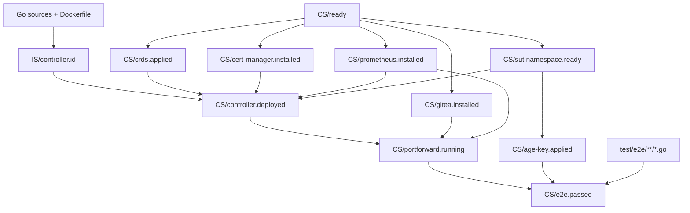

# E2E: move suite setup into Make stamps (clean plan)

## Goal

Make `go test ./test/e2e` run **only test logic**, not cluster provisioning or stable suite setup.

Principle:
- If a step is deterministic and its completion can be captured by a file mtime, it belongs in a Make stamp.
- If it must be unique per run (e.g., unique repo name), it stays in `BeforeAll`.

## Target outcome

After this change, `BeforeAll` does only:
- Gitea per-run repo setup (unique repo + checkout dir)
- Prometheus client init + availability check (pure Go + port-forward)

Everything else becomes stamp-based and runs *outside* the test binary.

## Changes (implementation checklist)

## Proposed dependency graph (parallel-friendly)

This graph is the target Make stamp topology to enable `make -j` parallelism while keeping dependencies correct.



Parallelism notes:
- `IS/controller.id` can run in parallel with `CS/ready`.
- After `CS/ready`, `CS/crds.applied`, `CS/cert-manager.installed`, `CS/prometheus.installed`, `CS/gitea.installed`,
  and `CS/sut.namespace.ready` can run in parallel.
- `CS/age-key.applied` only needs the `sut` namespace; it should not wait for controller rollout.

### 1) Replace suite Age key generation with a stamp + Go tool

Why:
- The suite key does not need to change per run.
- The Secret YAML should be materialized as a real file (auditable, diffable).
- The test should not generate keys or apply Secrets.

Actions:
1. Add a small Go tool:
   - Path: `test/e2e/tools/gen-age-key/main.go`
   - Output files:
     - `--key-file` writes an `age` identity in `age-keygen`-compatible format.
     - `--secret-file` writes a Kubernetes Secret manifest containing `stringData.identity.agekey`.
2. Add a cluster-scoped stamp:

```make
# Where tests read the private key from (overridable).
E2E_AGE_KEY_FILE ?= /tmp/e2e-age-key.txt

$(CS)/sut.namespace.ready: $(CS)/ready config/namespace.yaml
	mkdir -p $(CS)
	kubectl --context $(CTX) apply -f config/namespace.yaml
	kubectl --context $(CTX) label --overwrite ns sut pod-security.kubernetes.io/enforce=restricted
	touch $@

$(CS)/age-key.applied: $(CS)/sut.namespace.ready test/e2e/tools/gen-age-key/main.go
	mkdir -p $(CS)
	go run ./test/e2e/tools/gen-age-key \
	  --key-file $(CS)/age-key.txt \
	  --secret-file $(CS)/age-key-secret.yaml \
	  --namespace sut \
	  --secret-name sops-age-key
	kubectl --context $(CTX) apply -f $(CS)/age-key-secret.yaml
	touch $@
```

3. Stop copying keys around by making the test configurable:
   - In `test/e2e/e2e_test.go`, replace the hardcoded key path with:
     - `E2E_AGE_KEY_FILE` env var (default `/tmp/e2e-age-key.txt`).
   - In `Makefile` set `E2E_AGE_KEY_FILE=$(CS)/age-key.txt` for the test run.

### 2) Move namespace creation/labeling out of `BeforeAll`

Namespace creation already happens via Kustomize (`config/namespace.yaml`).

Make it explicit and parallel-friendly by adding a namespace stamp that runs immediately after cluster readiness:
- `$(CS)/sut.namespace.ready` (create + label)

Then:
- remove namespace creation + label commands from `BeforeAll`
- ensure `controller.deployed` depends on `$(CS)/sut.namespace.ready` (so the label is applied before pods are created)

### 3) Remove certificate Secret polling from `BeforeAll`

Delete `waitForCertificateSecrets()` usage and the helper entirely.

Rationale:
- The controller `Deployment` mounts `admission-server-cert` and `audit-server-cert` as Secret volumes.
- Pods cannot become Ready (and `kubectl rollout status` cannot succeed) until those Secrets exist.

### 4) Run preventive CRD cleanup only when the suite actually runs

Do not put CRD cleanup in `controller.deployed` (it won’t re-run when the stamp is fresh).

Instead, run it in the `$(CS)/e2e.passed` recipe immediately before `go test`:
- `kubectl --context $(CTX) delete crd icecreamorders.shop.example.com --ignore-not-found=true`

This guarantees:
- Cleanup happens exactly when the test suite runs.
- It does not rely on stamp invalidation.

### 5) Wire the new stamps into the existing chain

Keep `portforward.running` focused on port-forward readiness.

Preferred wiring:
- Add `$(CS)/age-key.applied` (and `$(CS)/namespace.configured` if used) as dependencies of `$(CS)/e2e.passed`.

Example:

```make
$(CS)/e2e.passed: $(CS)/portforward.running $(CS)/age-key.applied $(shell find test/e2e -name '*.go')
	mkdir -p $(CS)
	kubectl --context $(CTX) delete crd icecreamorders.shop.example.com --ignore-not-found=true
	KIND_CLUSTER=$(CLUSTER_FROM_CTX) \
	  E2E_AGE_KEY_FILE=$(CS)/age-key.txt \
	  go test ./test/e2e/ -v -ginkgo.v
	touch $@
```

## Code edits summary

- `Makefile`: add `age-key.applied` (and optionally `namespace.configured`) stamps; wire into `e2e.passed`; export `E2E_AGE_KEY_FILE`.
- `test/e2e/tools/gen-age-key/main.go`: new tool to write key file + Secret YAML.
- `test/e2e/e2e_test.go`: remove suite-side namespace/label, age secret setup, and cert-secret wait; read key path from env.
- `test/e2e/helpers.go`: delete `setupSOPSAgeSecret` and `waitForCertificateSecrets` (and related imports).

## Validation

Run:
- `make lint`
- `make test`
- `docker info` (must work before e2e)
- `make test-e2e`
- `make test-e2e-quickstart-manifest`
- `make test-e2e-quickstart-helm`
