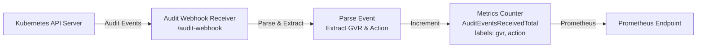

# Experimental Audit Webhook Receiver Design

## Overview
This document outlines the design for adding experimental audit webhook support to GitOps Reverser. The goal is to receive audit events directly from the Kubernetes API server and collect basic metrics split by Group Version Resource (GVR) and action.

## Current Architecture Context
- **Existing Webhook**: Validating admission webhook at `/process-validating-webhook` for correlation storage
- **Metrics**: OpenTelemetry-based Prometheus-compatible metrics in `internal/metrics/exporter.go`
- **No Existing Audit Handling**: Current system uses admission webhook + watch streams

## Proposed Architecture

## Key Components

### 1. Audit Event Structure
Based on Kubernetes audit API (`audit.k8s.io/v1`), events contain:
- `objectRef`: Contains `apiGroup`, `apiVersion`, `resource`, `subresource`
- `verb`: Action like "create", "update", "delete", "patch"
- `user`: Username info (available but not used for metrics per requirements)

### 2. GVR Mapping
- **GVR Format**: `{apiGroup}/{apiVersion}/{resource}`
- **Examples**:
  - ConfigMaps: `/v1/configmaps`
  - Deployments: `apps/v1/deployments`
  - Custom Resources: `example.com/v1alpha1/widgets`

### 3. Metrics Design
- **New Counter**: `gitopsreverser_audit_events_received_total`
- **Labels**:
  - `gvr`: Group/Version/Resource string
  - `action`: Verb (create, update, delete, patch, etc.)
- **Example Prometheus Query**: `gitopsreverser_audit_events_received_total{gvr="/v1/configmaps", action="create"}`

### 4. Webhook Handler
- **Path**: `/audit-webhook` (separate from existing admission webhook)
- **Method**: POST (standard for audit webhooks)
- **Processing**:
  1. Receive JSON audit EventList (using official `k8s.io/apiserver/pkg/apis/audit.EventList` struct)
  2. Iterate through `eventList.Items` array
  3. For each event: Parse `objectRef` to construct GVR, extract `verb` as action
  4. Increment metrics counter for each event
  5. Return 200 OK (no admission decision needed)

### 5. Integration Points
- **main.go**: Register new webhook endpoint
- **internal/metrics/exporter.go**: Add new counter definition
- **internal/webhook/audit_handler.go**: New handler implementation

## Deployment Requirements
To enable audit webhook in cluster:
1. Configure `audit-policy.yaml` with desired audit level (RequestResponse recommended)
2. Create `AuditSink` or `Webhook` configuration pointing to gitops-reverser service
3. Ensure TLS certificates are properly configured
4. Set appropriate RBAC for audit webhook access

## Experimental Scope
- **Minimal Processing**: Only metrics collection, no event queuing or Git operations
- **No Filtering**: Receives all audit events (cluster admin responsibility to configure audit policy)
- **Stateless**: No persistence or correlation needed
- **Observability**: Basic logging of received events

## Risk Considerations
- **Event Volume**: Audit events can be high-volume; monitor performance
- **Security**: Audit webhooks receive sensitive cluster activity data
- **Configuration Complexity**: Requires cluster admin setup for audit policy

## Implementation Plan
1. Add audit event metrics counter to `internal/metrics/exporter.go`
2. Create `internal/webhook/audit_handler.go` with event parsing and metrics increment
3. Register `/audit-webhook` endpoint in `cmd/main.go`
4. Add basic error handling and logging
5. Update documentation with deployment instructions

This design provides a clean, minimal starting point for audit webhook integration while maintaining separation from existing admission webhook functionality.