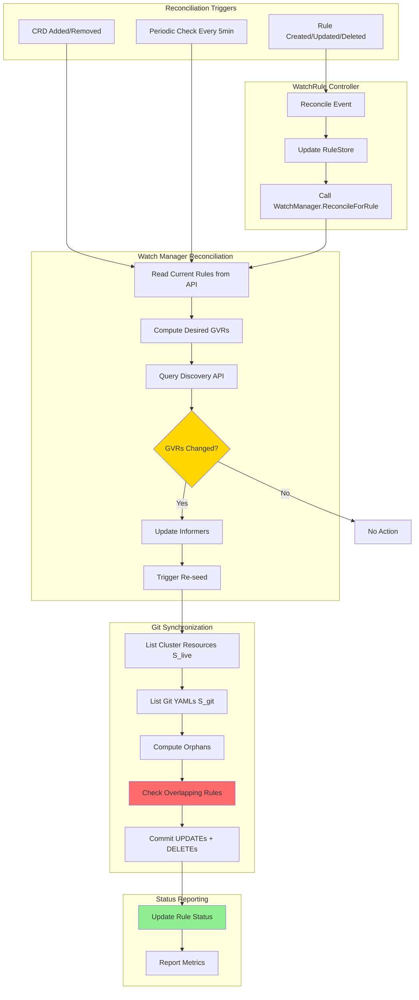

> **⚠️ IMPLEMENTATION STATUS: PHASE 1-3 COMPLETE**
> **Purpose:** This document describes the dynamic watch manager functionality being implemented to pass E2E tests.
> **See also:** [IMPLEMENTATION_ROADMAP.md](IMPLEMENTATION_ROADMAP.md) for streamlined MVP implementation plan.
> **Last Updated:** 2025-10-22
> **Recent Progress:** Namespace-scoped informers implemented, RBAC wildcards configured via kustomize

# Dynamic Watch Manager - Revised Implementation Plan

## Document Status

**Status**: REVISED ARCHITECTURE  
**Supersedes**: `DYNAMIC_WATCH_MANAGER_PLAN.md`  
**Date**: 2025-10-16  
**Reason**: Architecture review identified critical gaps and simpler solutions

---

## Executive Summary

### Original Plan Issues

The initial dynamic watch manager plan had three critical gaps:

1. **Missing Git Synchronization**: Deleting WatchRules didn't clean up Git repository
2. **Over-Engineered Architecture**: Custom notification channels instead of Kubernetes patterns
3. **No CRD Discovery**: New CRDs not automatically detected

### Revised Approach

**Use standard Kubernetes reconciliation** instead of custom notifications:
- ✅ Controller-driven reconciliation (Kubernetes-native)
- ✅ Git synchronization on every rule change
- ✅ CRD watching for immediate detection
- ✅ Status reporting on WatchRule CRDs
- ✅ Automatic retry and rate limiting

---

## Problem Statement (Expanded)

### Original Problem

The watch manager computes GVRs **only once at startup**. When WatchRules are added/updated/deleted after startup, the watch manager doesn't react.

### Additional Problems Discovered

**Problem 2: Git Synchronization Gap**
```
User deletes WatchRule → Informers stop → YAMLs remain in Git ❌
Expected: YAMLs should be deleted (cluster-as-source-of-truth)
```

**Problem 3: CRD Discovery Gap**
```
WatchRule watches "example.com/*" → New CRD installed → Not detected ❌
Expected: New resource types should be watched automatically
```

**Problem 4: Overlapping Rules**
```
Two rules watch same ConfigMap → Delete one rule → BOTH YAMLs deleted ❌
Expected: Should only delete when NO rules match
```

---

## Architecture: Reconciliation-Based Design

### Flow Diagram



### Key Architectural Changes

| Aspect | Original Plan | Revised Plan |
|--------|--------------|--------------|
| **Trigger Mechanism** | Notification channel | Reconciliation |
| **Debouncing** | Manual implementation | Built-in (controller-runtime) |
| **Error Handling** | Custom retry logic | Automatic retry |
| **Status** | Logs only | CRD status conditions |
| **Git Sync** | Not addressed | Integrated |
| **CRD Discovery** | Not addressed | CRD watcher + periodic |

---

## Detailed Implementation

### Phase 1: Watch Manager Reconciliation Infrastructure

**File**: `internal/watch/manager.go`

#### Add Reconciliation State

```go
type Manager struct {
    Client               client.Client
    Log                  logr.Logger
    RuleStore            *rulestore.RuleStore
    EventQueue           *eventqueue.Queue
    CorrelationStore     *correlation.Store
    
    // State tracking
    mu                   sync.Mutex
    currentGVRs          map[GVR]struct{}
    informerFactory      dynamicinformer.DynamicSharedInformerFactory
    informerCancel       context.CancelFunc
    
    // Reconciliation scheduling
    reconcileMu          sync.Mutex
    pendingReconcile     bool
    reconcileTimer       *time.Timer
    
    // Deduplication (existing)
    lastSeenMu           sync.RWMutex
    lastSeenHash         map[string]uint64
}

// ReconcileResult contains the outcome of a reconciliation
type ReconcileResult struct {
    GVRsChanged       bool
    InformersCount    int
    ResourcesSeeded   int
    OrphansDeleted    int
    Message           string
}
```

#### Implement ReconcileForRule (Targeted)

```go
// ReconcileForRule reconciles watch manager state for a specific rule change.
// Called by WatchRule/ClusterWatchRule controllers when rules are modified.
func (m *Manager) ReconcileForRule(
    ctx context.Context,
    ruleKey types.NamespacedName,
) (*ReconcileResult, error) {
    log := m.Log.WithValues("rule", ruleKey)
        
    // Compute desired state from current rules in API
    desiredGVRs := m.ComputeRequestedGVRs()
    discoverable := m.FilterDiscoverableGVRs(ctx, desiredGVRs)
    
    m.mu.Lock()
    currentGVRs := m.currentGVRs
    m.mu.Unlock()
    
    // Build result
    result := &ReconcileResult{
        GVRsChanged:    !m.gvrsEqual(currentGVRs, makeGVRMap(discoverable)),
        InformersCount: len(discoverable),
    }
    
    if !result.GVRsChanged {
        result.Message = "No GVR changes detected"
        return result, nil
    }
    
    // Update informers to match desired state
    if err := m.updateInformers(ctx, discoverable); err != nil {
        return nil, fmt.Errorf("failed to update informers: %w", err)
    }
    
    // Identify affected repos
    affectedRepos := m.getAffectedRepos(ruleKey)
    
    // Trigger re-seed for affected repos (includes orphan detection)
    for repo := range affectedRepos {
        counts, err := m.seedRepoResources(ctx, repo)
        if err != nil {
            log.Error(err, "Failed to seed repo", "repo", repo)
            continue
        }
        result.ResourcesSeeded += counts.added
        result.OrphansDeleted += counts.deleted
    }
    
    result.Message = fmt.Sprintf(
        "Updated %d informers, seeded %d resources, deleted %d orphans",
        result.InformersCount, result.ResourcesSeeded, result.OrphansDeleted)
    
    return result, nil
}
```

#### Implement ReconcileAll (Full Reconciliation)

```go
// ReconcileAll performs a full reconciliation of the watch manager.
// Called at startup, periodically, and when CRDs change.
func (m *Manager) ReconcileAll(ctx context.Context) error {
    log := m.Log.WithName("reconcile-all")
    log.Info("Performing full watch manager reconciliation")
    
    // Compute desired GVRs from all active rules
    requestedGVRs := m.ComputeRequestedGVRs()
    discoverableGVRs := m.FilterDiscoverableGVRs(ctx, requestedGVRs)
    
    log.Info("Reconciliation computed GVRs",
        "requested", len(requestedGVRs),
        "discoverable", len(discoverableGVRs))
    
    // Update informers to match discoverable set
    if err := m.updateInformers(ctx, discoverableGVRs); err != nil {
        return fmt.Errorf("failed to update informers: %w", err)
    }
    
    // If informers changed, trigger full re-seed
    if m.informersChanged() {
        log.Info("Informers changed, triggering full re-seed")
        
        // CRITICAL: Clear deduplication cache for affected GVRs
        // Otherwise re-seeded resources will be skipped as "duplicates"
        m.clearDeduplicationCacheForGVRs(discoverableGVRs)
        
        go m.seedSelectedResources(ctx)
    }
    
    return nil
}

// clearDeduplicationCacheForGVRs removes hash entries for resources
// that will be re-seeded. This prevents false duplicate detection.
func (m *Manager) clearDeduplicationCacheForGVRs(gvrs []GVR) {
    m.lastSeenMu.Lock()
    defer m.lastSeenMu.Unlock()
    
    if m.lastSeenHash == nil {
        return
    }
    
    // Build set of GVRs being re-seeded
    gvrSet := make(map[GVR]struct{})
    for _, gvr := range gvrs {
        gvrSet[gvr] = struct{}{}
    }
    
    // Remove hash entries for resources of these GVRs
    for key := range m.lastSeenHash {
        // Parse GVR from key (format: "group/version/resource/namespace/name")
        if resourceMatchesGVRs(key, gvrSet) {
            delete(m.lastSeenHash, key)
        }
    }
    
    m.Log.V(1).Info("Cleared deduplication cache for re-seed",
        "gvrCount", len(gvrs))
}
```

#### Implement CRD Watcher

```go
// watchCRDChanges watches for CRD creation/deletion and schedules reconciliation.
// Provides ~5 second reaction time to new resource types.
func (m *Manager) watchCRDChanges(ctx context.Context) {
    log := m.Log.WithName("crd-watcher")
    
    // Create CRD informer
    gvr := schema.GroupVersionResource{
        Group:    "apiextensions.k8s.io",
        Version:  "v1",
        Resource: "customresourcedefinitions",
    }
    
    cfg := m.restConfig()
    if cfg == nil {
        log.Info("No REST config, skipping CRD watcher")
        return
    }
    
    dc, err := dynamic.NewForConfig(cfg)
    if err != nil {
        log.Error(err, "Failed to create dynamic client for CRD watcher")
        return
    }
    
    factory := dynamicinformer.NewDynamicSharedInformerFactory(dc, 5*time.Minute)
    informer := factory.ForResource(gvr).Informer()
    
    informer.AddEventHandler(cache.ResourceEventHandlerFuncs{
        AddFunc: func(obj interface{}) {
            crd := obj.(*unstructured.Unstructured)
            log.Info("CRD added, scheduling reconciliation",
                "crd", crd.GetName())
            m.scheduleReconciliation(ctx, 5*time.Second)
        },
        DeleteFunc: func(obj interface{}) {
            crd := obj.(*unstructured.Unstructured)
            log.Info("CRD deleted, scheduling reconciliation",
                "crd", crd.GetName())
            m.scheduleReconciliation(ctx, 5*time.Second)
        },
    })
    
    factory.Start(ctx.Done())
    factory.WaitForCacheSync(ctx.Done())
    
    log.Info("CRD watcher started")
}

// scheduleReconciliation schedules a debounced reconciliation.
func (m *Manager) scheduleReconciliation(ctx context.Context, delay time.Duration) {
    m.reconcileMu.Lock()
    defer m.reconcileMu.Unlock()
    
    if m.pendingReconcile {
        // Reset timer for debouncing
        m.reconcileTimer.Reset(delay)
        return
    }
    
    m.pendingReconcile = true
    m.reconcileTimer = time.AfterFunc(delay, func() {
        m.reconcileMu.Lock()
        m.pendingReconcile = false
        m.reconcileMu.Unlock()
        
        m.Log.Info("Scheduled reconciliation executing")
        if err := m.ReconcileAll(ctx); err != nil {
            m.Log.Error(err, "Scheduled reconciliation failed")
        }
    })
}
```

#### Enhanced Start Method

```go
func (m *Manager) Start(ctx context.Context) error {
    log := m.Log.WithName("watch")
    log.Info("Watch manager starting (reconciliation-based)")
    
    // Perform initial full reconciliation
    if err := m.ReconcileAll(ctx); err != nil {
        log.Error(err, "Initial reconciliation failed, will retry")
    }
    
    // Start CRD watcher for immediate reaction to new CRDs
    go m.watchCRDChanges(ctx)
    
    // Periodic reconciliation (safety net for missed changes)
    periodicTicker := time.NewTicker(5 * time.Minute)
    defer periodicTicker.Stop()
    
    // Heartbeat ticker
    heartbeatTicker := time.NewTicker(30 * time.Second)
    defer heartbeatTicker.Stop()
    
    for {
        select {
        case <-ctx.Done():
            m.shutdown()
            log.Info("Watch manager stopping")
            return nil
            
        case <-periodicTicker.C:
            log.Info("Periodic reconciliation triggered")
            if err := m.ReconcileAll(ctx); err != nil {
                log.Error(err, "Periodic reconciliation failed")
            }
            
        case <-heartbeatTicker.C:
            log.V(1).Info("Watch manager heartbeat",
                "activeGVRs", len(m.currentGVRs))
        }
    }
}
```

---

### Phase 2: Controller Integration

**File**: `internal/controller/watchrule_controller.go`

#### Modify WatchRule Controller

```go
type WatchRuleReconciler struct {
    client.Client
    Scheme       *runtime.Scheme
    RuleStore    *rulestore.RuleStore
    WatchManager *watch.Manager  // NEW: Direct reference
}

func (r *WatchRuleReconciler) Reconcile(
    ctx context.Context,
    req ctrl.Request,
) (ctrl.Result, error) {
    log := log.FromContext(ctx)
    
    var rule configv1alpha1.WatchRule
    if err := r.Get(ctx, req.NamespacedName, &rule); err != nil {
        if apierrors.IsNotFound(err) {
            // Rule deleted - remove from RuleStore
            log.Info("WatchRule deleted, cleaning up", "name", req.Name)
            r.RuleStore.Delete(req.NamespacedName)
            
            // Trigger watch manager reconciliation
            result, err := r.WatchManager.ReconcileForRule(ctx, req.NamespacedName)
            if err != nil {
                log.Error(err, "Failed to reconcile watch manager for deleted rule")
                return ctrl.Result{}, err
            }
            
            log.Info("Watch manager reconciled for deleted rule",
                "orphansDeleted", result.OrphansDeleted)
            return ctrl.Result{}, nil
        }
        return ctrl.Result{}, err
    }
    
    log.Info("Reconciling WatchRule", "name", rule.Name, "namespace", rule.Namespace)
    
    // Validate and compile rule
    if err := r.RuleStore.AddOrUpdateWatchRule(rule); err != nil {
        // Update status with validation error
        r.updateRuleStatus(ctx, &rule, false, fmt.Sprintf("Validation failed: %v", err))
        return ctrl.Result{}, err
    }
    
    // Trigger watch manager reconciliation
    result, err := r.WatchManager.ReconcileForRule(ctx, req.NamespacedName)
    if err != nil {
        r.updateRuleStatus(ctx, &rule, false, fmt.Sprintf("Reconciliation failed: %v", err))
        return ctrl.Result{}, err
    }
    
    // Update status with success
    r.updateRuleStatus(ctx, &rule, true, result.Message)
    
    return ctrl.Result{}, nil
}

func (r *WatchRuleReconciler) updateRuleStatus(
    ctx context.Context,
    rule *configv1alpha1.WatchRule,
    success bool,
    message string,
) {
    log := log.FromContext(ctx)
    
    status := metav1.ConditionTrue
    if !success {
        status = metav1.ConditionFalse
    }
    
    rule.Status.Conditions = []metav1.Condition{
        {
            Type:               "InformersReady",
            Status:             status,
            Reason:             "ReconciliationComplete",
            Message:            message,
            LastTransitionTime: metav1.Now(),
        },
    }
    
    if err := r.Status().Update(ctx, rule); err != nil {
        log.Error(err, "Failed to update WatchRule status")
    }
}
```

---

### Phase 3: Git Synchronization with Smart Orphan Detection

**File**: `internal/git/worker.go`

#### Enhanced Orphan Detection

```go
// computeOrphanDeletes calculates orphans with overlap detection.
// Only marks YAML as orphan if NO remaining rules match the resource.
func (w *Worker) computeOrphanDeletes(
    ctx context.Context,
    log logr.Logger,
    repoConfig v1alpha1.GitRepoConfig,
    sLive map[string]struct{},
) []eventqueue.Event {
    paths, err := w.listRepoYAMLPaths(ctx, repoConfig)
    if err != nil {
        log.Error(err, "Failed to list repository YAML paths")
        return nil
    }
    
    var orphans []string
    for _, p := range paths {
        // Check if path is in current live set
        if _, inSLive := sLive[p]; inSLive {
            continue // Currently watched by active informer
        }
        
        // Parse identifier from path
        id, ok := parseIdentifierFromPath(p)
        if !ok {
            log.Info("Skipping path with unrecognized layout", "path", p)
            continue
        }
        
        // CRITICAL: Check if ANY rule still matches this resource
        if w.resourceStillMatched(ctx, id, repoConfig) {
            log.V(1).Info("Resource still matched by another rule, keeping",
                "path", p, "identifier", id.String())
            continue
        }
        
        // Safe to mark as orphan
        orphans = append(orphans, p)
    }
    
    if len(orphans) == 0 {
        return nil
    }
    
    // Deterministic order
    sort.Strings(orphans)
    
    // Convert to DELETE events
    evs := make([]eventqueue.Event, 0, len(orphans))
    for _, p := range orphans {
        id, _ := parseIdentifierFromPath(p)
        evs = append(evs, eventqueue.Event{
            Object:                 nil,
            Identifier:             id,
            Operation:              "DELETE",
            UserInfo:               eventqueue.UserInfo{},
            GitRepoConfigRef:       repoConfig.Name,
            GitRepoConfigNamespace: repoConfig.Namespace,
        })
    }
    
    log.Info("Computed orphans for deletion",
        "orphanCount", len(evs),
        "totalPaths", len(paths))
    
    metrics.FilesDeletedTotal.Add(ctx, int64(len(evs)))
    return evs
}

// resourceStillMatched checks if any active rule still watches this resource.
// Prevents premature deletion when multiple rules watch the same resource.
func (w *Worker) resourceStillMatched(
    ctx context.Context,
    id itypes.ResourceIdentifier,
    repoConfig v1alpha1.GitRepoConfig,
) bool {
    // Try to fetch the actual resource from cluster
    obj, err := w.fetchResourceFromCluster(ctx, id)
    if err != nil {
        // Resource doesn't exist in cluster anymore - not matched
        return false
    }
    
    // Get namespace labels for ClusterWatchRule matching
    var nsLabels map[string]string
    if id.Namespace != "" {
        nsLabels = w.getNamespaceLabels(ctx, id.Namespace)
    }
    
    // Check against all active WatchRules for this repo
    wrRules := w.RuleStore.GetMatchingRulesForRepo(
        obj,
        id.Resource,
        id.Group,
        id.Version,
        id.IsClusterScoped(),
        repoConfig.Name,
        repoConfig.Namespace,
    )
    
    // Check against all active ClusterWatchRules for this repo
    cwrRules := w.RuleStore.GetMatchingClusterRulesForRepo(
        id.Resource,
        id.Group,
        id.Version,
        id.IsClusterScoped(),
        nsLabels,
        repoConfig.Name,
        repoConfig.Namespace,
    )
    
    matched := len(wrRules) > 0 || len(cwrRules) > 0
    
    if matched {
        w.Log.V(1).Info("Resource still matched by rules",
            "identifier", id.String(),
            "wrRules", len(wrRules),
            "cwrRules", len(cwrRules))
    }
    
    return matched
}

// fetchResourceFromCluster retrieves a resource from the cluster by identifier.
func (w *Worker) fetchResourceFromCluster(
    ctx context.Context,
    id itypes.ResourceIdentifier,
) (*unstructured.Unstructured, error) {
    gvr := schema.GroupVersionResource{
        Group:    id.Group,
        Version:  id.Version,
        Resource: id.Resource,
    }
    
    cfg := w.restConfig()
    if cfg == nil {
        return nil, fmt.Errorf("no REST config available")
    }
    
    dc, err := dynamic.NewForConfig(cfg)
    if err != nil {
        return nil, fmt.Errorf("failed to create dynamic client: %w", err)
    }
    
    if id.Namespace != "" {
        return dc.Resource(gvr).Namespace(id.Namespace).Get(
            ctx, id.Name, metav1.GetOptions{})
    }
    return dc.Resource(gvr).Get(ctx, id.Name, metav1.GetOptions{})
}
```

---

### Phase 4: RuleStore Query Helpers

**File**: `internal/rulestore/store.go`

```go
// GetMatchingRulesForRepo filters matching rules to those for a specific repo.
// Used for orphan detection to check if resources are still watched.
func (s *RuleStore) GetMatchingRulesForRepo(
    obj *unstructured.Unstructured,
    resourcePlural, apiGroup, apiVersion string,
    isClusterScoped bool,
    repoName, repoNamespace string,
) []CompiledRule {
    // Get all matching rules
    allMatches := s.GetMatchingRules(
        obj,
        resourcePlural,
        "UPDATE",
        apiGroup,
        apiVersion,
        isClusterScoped,
    )
    
    // Filter to specific repo
    var result []CompiledRule
    for _, rule := range allMatches {
        if rule.GitRepoConfigRef == repoName &&
           rule.Source.Namespace == repoNamespace {
            result = append(result, rule)
        }
    }
    
    return result
}

// GetMatchingClusterRulesForRepo filters cluster rules to specific repo.
func (s *RuleStore) GetMatchingClusterRulesForRepo(
    resourcePlural, apiGroup, apiVersion string,
    isClusterScoped bool,
    nsLabels map[string]string,
    repoName, repoNamespace string,
) []CompiledClusterRule {
    // Get all matching cluster rules
    allMatches := s.GetMatchingClusterRules(
        resourcePlural,
        "UPDATE",
        apiGroup,
        apiVersion,
        isClusterScoped,
        nsLabels,
    )
    
    // Filter to specific repo
    var result []CompiledClusterRule
    for _, rule := range allMatches {
        if rule.GitRepoConfigRef == repoName &&
           rule.GitRepoConfigNamespace == repoNamespace {
            result = append(result, rule)
        }
    }
    
    return result
}

// GetRulesForNamespace returns all WatchRules in a specific namespace.
// Used to determine affected repos when a rule changes.
func (s *RuleStore) GetRulesForNamespace(namespace string) []CompiledRule {
    s.mu.RLock()
    defer s.mu.RUnlock()
    
    rules, exists := s.watchRules[namespace]
    if !exists {
        return nil
    }
    
    return rules
}
```

---

## Testing Strategy

### Unit Tests

**File**: `internal/watch/reconcile_test.go`

```go
func TestManager_ReconcileForRule_GVRChange(t *testing.T) {
    // Setup: Manager with initial GVRs
    manager := setupTestManager()
    
    // Add new rule with different GVRs
    addTestRule(manager.RuleStore, "new-rule")
    
    // Reconcile
    result, err := manager.ReconcileForRule(ctx, ruleKey)
    
    // Assert: GVRs changed, informers updated
    assert.NoError(t, err)
    assert.True(t, result.GVRsChanged)
    assert.Greater(t, result.InformersCount, 0)
}

func TestManager_ReconcileForRule_NoChange(t *testing.T) {
    // Setup: Manager with rule
    manager := setupTestManager()
    
    // Update rule with same GVRs
    updateTestRule(manager.RuleStore, "existing-rule")
    
    // Reconcile
    result, err := manager.ReconcileForRule(ctx, ruleKey)
    
    // Assert: No changes
    assert.NoError(t, err)
    assert.False(t, result.GVRsChanged)
}

func TestManager_CRDWatcher_TriggersReconcile(t *testing.T) {
    // Setup: Manager with CRD watcher
    manager := setupTestManager()
    go manager.watchCRDChanges(ctx)
    
    // Wait for watcher to start
    time.Sleep(100 * time.Millisecond)
    
    // Create new CRD
    createTestCRD(t, "widgets.example.com")
    
    // Assert: Reconciliation scheduled
    assert.Eventually(t, func() bool {
        return manager.reconcileScheduled()
    }, 10*time.Second, 100*time.Millisecond)
}
```

**File**: `internal/git/orphan_detection_test.go`

```go
func TestOrphanDetection_OverlappingRules(t *testing.T) {
    // Setup: Two rules watching same ConfigMap
    ruleStore := setupRuleStore()
    addRule(ruleStore, "rule-1", "configmaps", "*")
    addRule(ruleStore, "rule-2", "configmaps", "app=web")
    
    // ConfigMap matches both rules
    configMap := createConfigMap("test", map[string]string{"app": "web"})
    
    // Delete rule-1
    ruleStore.Delete(types.NamespacedName{Name: "rule-1"})
    
    // Compute orphans
    worker := setupWorker(ruleStore)
    orphans := worker.computeOrphanDeletes(ctx, log, repoConfig, sLive)
    
    // Assert: ConfigMap NOT deleted (rule-2 still matches)
    assert.Empty(t, orphans)
}

func TestOrphanDetection_NoRulesMatch(t *testing.T) {
    // Setup: One rule watching ConfigMaps with label
    ruleStore := setupRuleStore()
    addRule(ruleStore, "rule-1", "configmaps", "app=web")
    
    // ConfigMap without label
    configMap := createConfigMap("test", map[string]string{})
    
    // Compute orphans (ConfigMap in Git but not matched)
    worker := setupWorker(ruleStore)
    sLive := make(map[string]struct{}) // Empty - nothing matched
    orphans := worker.computeOrphanDeletes(ctx, log, repoConfig, sLive)
    
    // Assert: ConfigMap deleted (no rules match)
    assert.Len(t, orphans, 1)
}
```

### Integration Tests

**File**: `internal/watch/integration_test.go`

```go
func TestE2E_RuleCreation_StartsInformers(t *testing.T) {
    // Setup: Watch manager running
    manager := setupIntegrationTest(t)
    
    // Create WatchRule
    rule := createWatchRule(t, "watch-configmaps", "configmaps")
    
    // Trigger reconciliation
    result, err := manager.ReconcileForRule(ctx, ruleKey)
    require.NoError(t, err)
    
    // Assert: Informers started
    assert.True(t, result.GVRsChanged)
    assert.Greater(t, result.InformersCount, 0)
    
    // Assert: Resources seeded
    assert.Greater(t, result.ResourcesSeeded, 0)
}

func TestE2E_RuleDeletion_DeletesYAMLs(t *testing.T) {
    // Setup: Watch manager with active rule
    manager := setupIntegrationTest(t)
    rule := createWatchRule(t, "watch-configmaps", "configmaps")
    manager.ReconcileForRule(ctx, ruleKey)
    
    // Wait for YAMLs to be committed
    waitForGitCommit(t, repoConfig)
    
    // Verify YAMLs exist
    yamlCount := countYAMLsInRepo(t, repoConfig)
    assert.Greater(t, yamlCount, 0)
    
    // Delete rule
    deleteWatchRule(t, rule)
    manager.ReconcileForRule(ctx, ruleKey)
    
    // Wait for Git sync
    waitForGitCommit(t, repoConfig)
    
    // Assert: YAMLs deleted
    finalCount := countYAMLsInRepo(t, repoConfig)
    assert.Equal(t, 0, finalCount)
}

func TestE2E_NewCRD_AutomaticallyWatched(t *testing.T) {
    // Setup: Rule watching "example.com/*"
    manager := setupIntegrationTest(t)
    rule := createWatchRule(t, "watch-example-group", "example.com", "*")
    manager.ReconcileForRule(ctx, ruleKey)
    
    // Initial GVR count
    initialCount := manager.GetActiveGVRCount()
    
    // Install new CRD
    createCRD(t, "widgets.example.com")
    
    // Wait for CRD watcher to trigger reconciliation
    waitForReconciliation(t, manager, 15*time.Second)
    
    // Assert: New GVR detected and informer started
    finalCount := manager.GetActiveGVRCount()
    assert.Greater(t, finalCount, initialCount)
}
```

---

## Edge Cases Handled

### 1. Overlapping Rules

**Scenario**: Multiple rules watch same resource

```yaml
# Rule 1: All ConfigMaps
resources: ["configmaps"]

# Rule 2: ConfigMaps with app=web
resources: ["configmaps"]
labelSelectors:
  - matchLabels:
      app: web
```

**Behavior**:
- Delete Rule 1: Resources with `app=web` remain (Rule 2 still matches) ✓
- Delete Rule 2: All ConfigMaps remain (Rule 1 still matches) ✓
- Delete BOTH: All ConfigMaps deleted ✓

**Implementation**: `resourceStillMatched()` checks ALL active rules

---

### 2. Cross-Repo Independence

**Scenario**: Same resource sent to multiple repos

```yaml
# Rule 1 → repo-a
gitRepoConfigRef: repo-a
resources: ["configmaps"]

# Rule 2 → repo-b
gitRepoConfigRef: repo-b
resources: ["configmaps"]
```

**Behavior**:
- Delete Rule 1: Orphans deleted from repo-a only ✓
- Delete Rule 2: Orphans deleted from repo-b only ✓
- Repos independent ✓

**Implementation**: Orphan detection is per-`GitRepoConfigRef`

---

### 3. Rule Scope Changes

**Scenario**: Rule narrowed from broad to specific

```yaml
# Before: All ConfigMaps
resources: ["configmaps"]

# After: Only app=web ConfigMaps
resources: ["configmaps"]
labelSelectors:
  - matchLabels:
      app: web
```

**Behavior**:
- GVRs unchanged (still configmaps)
- Re-seed triggered
- Non-web ConfigMaps become orphans
- Orphans deleted from Git ✓

**Implementation**: Controller reconciliation triggers re-seed

---

### 4. New CRD Installed

**Scenario**: WatchRule uses wildcard `resources: ["*"]`

```yaml
# Rule watches all resources in group
apiGroup: "example.com"
resources: ["*"]
```

**Timeline**:
1. Initially: Only `widgets.example.com` exists
2. Admin installs: `gadgets.example.com` CRD
3. CRD watcher detects change (~5s)
4. Reconciliation triggered
5. New informer started for gadgets
6. Re-seed commits gadgets to Git ✓

**Implementation**: CRD watcher + periodic reconciliation

---

### 5. Namespace Label Changes

**Scenario**: ClusterWatchRule with namespace selector

```yaml
apiVersion: configbutler.ai/v1alpha1
kind: ClusterWatchRule
spec:
  namespaceSelector:
    matchLabels:
      env: production
```

**Behavior**:
- Namespace gets `env=production`: Caught by periodic reconciliation
- Namespace loses label: Caught by periodic reconciliation
- Lat
ency: Up to periodic interval

**Implementation**: Periodic `ReconcileAll()` every 5 minutes

---

### 6. Controller Restart

**Scenario**: Controller pod restarted or leader election changed

**Behavior**:
- On startup: Full reconciliation runs
- Computes GVRs from current rules
- Starts informers
- Performs seed with orphan detection
- Git synchronized to cluster state ✓

**Implementation**: `ReconcileAll()` called in `Start()`

---

### 7. Resource Deleted from Cluster

**Scenario**: Resource deleted while controller running

**Timeline**:
1. ConfigMap exists in cluster and Git
2. User runs `kubectl delete configmap test`
3. Informer fires DELETE event
4. Git worker deletes YAML from repo
5. Later: Rule deleted
6. Re-seed runs, but ConfigMap already gone from Git ✓

**Implementation**: DELETE events handled immediately, no special case needed

---

### 8. Deduplication Cache Stale After Re-seed (CRITICAL)

**Scenario**: Rule deleted then re-created with same scope

**Timeline**:
1. WatchRule watches ConfigMaps
2. ConfigMap seeded, hash stored: `lastSeenHash["v1/configmaps/ns/my-config"] = 0x123`
3. Delete WatchRule
4. Re-seed runs, orphan detection deletes ConfigMap YAML from Git
5. Hash STILL in memory: `lastSeenHash["v1/configmaps/ns/my-config"] = 0x123`
6. Re-create same WatchRule
7. Re-seed attempts to commit ConfigMap
8. `isDuplicateContent()` checks hash: MATCH! ❌
9. Resource SKIPPED (false duplicate) ❌

**Problem**: ConfigMap should be committed but hash collision prevents it

**Solution**: Clear deduplication cache for affected GVRs before re-seed

```go
func (m *Manager) ReconcileAll(ctx context.Context) error {
    // ... compute GVRs ...
    
    if m.informersChanged() {
        // CRITICAL: Clear cache before re-seed
        m.clearDeduplicationCacheForGVRs(discoverableGVRs)
        
        go m.seedSelectedResources(ctx)
    }
}

func (m *Manager) clearDeduplicationCacheForGVRs(gvrs []GVR) {
    m.lastSeenMu.Lock()
    defer m.lastSeenMu.Unlock()
    
    for key := range m.lastSeenHash {
        if resourceMatchesGVRs(key, gvrs) {
            delete(m.lastSeenHash, key)
        }
    }
}
```

**Why This Works**:
- Cache cleared only for affected GVRs (surgical)
- Other GVRs maintain deduplication (still skip status-only changes)
- Re-seeded resources get fresh hash on commit

---

## Reconciliation Triggers Summary

| Trigger | Latency | Scope | Use Case |
|---------|---------|-------|----------|
| **Rule Change** | Immediate | Targeted | Add/update/delete WatchRule |
| **CRD Change** | ~5 seconds | Full | New CRD installed |
| **Periodic** | Up to 5 minutes | Full | Safety net for missed changes |
| **Startup** | Immediate | Full | Controller start/restart |

---

## Metrics

### New Metrics

```go
// In internal/metrics/exporter.go:

// WatchManagerReconciliationsTotal counts reconciliation attempts
WatchManagerReconciliationsTotal metric.Int64Counter

// WatchManagerReconcileDurationSeconds tracks reconciliation duration
WatchManagerReconcileDurationSeconds metric.Float64Histogram

// WatchManagerGVRsActive tracks currently active GVRs
WatchManagerGVRsActive metric.Int64UpDownCounter

// WatchManagerOrphansDeletedTotal counts orphaned YAMLs deleted
WatchManagerOrphansDeletedTotal metric.Int64Counter

// WatchManagerCRDDetectionsTotal counts CRD change detections
WatchManagerCRDDetectionsTotal metric.Int64Counter
```

### Usage Example

```go
func (m *Manager) ReconcileAll(ctx context.Context) error {
    start := time.Now()
    defer func() {
        metrics.WatchManagerReconciliationsTotal.Add(ctx, 1)
        metrics.WatchManagerReconcileDurationSeconds.Record(
            ctx, time.Since(start).Seconds())
    }()
    
    // ... reconciliation logic ...
    
    metrics.WatchManagerGVRsActive.Add(ctx, int64(len(discoverableGVRs)))
    return nil
}
```

---

## Status Reporting

### WatchRule Status Conditions

```yaml
apiVersion: configbutler.ai/v1alpha1
kind: WatchRule
metadata:
  name: watch-configmaps
status:
  conditions:
  - type: InformersReady
    status: "True"
    reason: ReconciliationComplete
    message: "Updated 3 informers, seeded 15 resources, deleted 2 orphans"
    lastTransitionTime: "2025-01-15T10:30:00Z"
  - type: GitSynced
    status: "True"
    reason: OrphanDetectionComplete
    message: "Git repository synchronized with cluster state"
    lastTransitionTime: "2025-01-15T10:30:05Z"
  observedGeneration: 1
```

### User Visibility

```bash
# Check rule status
$ kubectl describe watchrule watch-configmaps

Status:
  Conditions:
    Type:               InformersReady
    Status:             True
    Reason:             ReconciliationComplete
    Message:            Updated 3 informers, seeded 15 resources, deleted 2 orphans
    Last Transition Time: 2025-01-15T10:30:00Z
```

---

## Implementation Checklist

### Phase 1: Reconciliation Infrastructure
- [x] Add `ReconcileResult` struct (simplified - not needed for MVP)
- [x] Implement `ReconcileForRuleChange()` method ([`manager.go:613`](../internal/watch/manager.go:613))
- [x] Add GVR comparison logic ([`compareGVRs()`](../internal/watch/manager.go:678))
- [x] Add state tracking ([`activeInformers`](../internal/watch/manager.go:72) map with namespace awareness)
- [x] Update `Start()` method ([`manager.go:86`](../internal/watch/manager.go:86))
- [x] Add periodic reconciliation (30s interval)

### Phase 2: Namespace-Aware Informers (COMPLETED)
- [x] Implement namespace detection ([`getNamespacesForGVR()`](../internal/watch/manager.go:391))
- [x] Create filtered informer factories per namespace ([`startSingleInformer()`](../internal/watch/manager.go:860))
- [x] Track GVR → namespace → cancel mappings ([`activeInformers`](../internal/watch/manager.go:72))
- [x] Update seeding to respect namespace boundaries ([`seedListAndProcess()`](../internal/watch/manager.go:513))
- [ ] **TODO**: CRD watcher for immediate detection (deferred - periodic reconciliation sufficient for MVP)

### Phase 3: Controller Integration (COMPLETED)
- [x] Add `WatchManager` field to [`WatchRuleReconciler`](../internal/controller/watchrule_controller.go:56)
- [x] Call `ReconcileForRuleChange()` on create/update/delete ([`watchrule_controller.go:84`](../internal/controller/watchrule_controller.go:84))
- [x] Status condition updates working ([`setCondition()`](../internal/controller/watchrule_controller.go:258))
- [x] Same integration for [`ClusterWatchRuleReconciler`](../internal/controller/clusterwatchrule_controller.go:83)

### Phase 4: Git Synchronization (PARTIAL)
- [x] Implement [`clearDeduplicationCacheForGVRs()`](../internal/watch/manager.go:911) method
- [x] Clear cache on informer changes ([`ReconcileForRuleChange()`](../internal/watch/manager.go:658))
- [x] SEED_SYNC control events emitted ([`emitSeedSyncControls()`](../internal/watch/manager.go:597))
- [ ] **TODO**: `computeOrphanDeletes()` with overlap detection
- [ ] **TODO**: `resourceStillMatched()` method for smart orphan detection
- [ ] **TODO**: Per-repo seeding optimization

### Phase 5: RuleStore Enhancements (DEFERRED)
- [ ] Add `GetMatchingRulesForRepo()` method
- [ ] Add `GetMatchingClusterRulesForRepo()` method
- [ ] Add `GetRulesForNamespace()` helper
- [ ] Test overlap detection logic
- **Note**: Deferred until orphan detection needed

### Phase 6: Metrics and Observability (DEFERRED)
- [ ] Add reconciliation-specific metrics
- [x] Using existing metrics: `ObjectsScannedTotal`, `EventsProcessedTotal`, `GitCommitQueueSize`
- **Note**: Additional metrics deferred until core functionality stable

### Phase 7: Testing (IN PROGRESS)
- [x] Unit tests: Basic watch functionality (4.9% coverage - needs improvement)
- [x] Unit test: Deduplication cache clearing ([`clearDeduplicationCacheForGVRs()`](../internal/watch/manager.go:911))
- [x] E2E test: WatchRule reconciliation - **NOW PASSING** ✅
- [ ] **TODO**: Unit test `getNamespacesForGVR()` with various rule configurations
- [ ] **TODO**: Unit test namespace-scoped vs cluster-wide informer creation
- [ ] **TODO**: E2E test: ConfigMap commit via WatchRule (in progress - needs RBAC deployment)
- [ ] **TODO**: E2E test: Rule deletion with Git cleanup
- [ ] **TODO**: E2E test: Overlapping rules scenario
- [ ] **TODO**: E2E test: New CRD installation and detection

### Phase 8: Documentation
- [ ] Update architecture diagrams
- [ ] Document reconciliation triggers
- [ ] Document status conditions
- [ ] Update troubleshooting guide
- [ ] Add metric reference

---

## Migration from Original Plan

### What to Remove

❌ **RuleStore Notification Channel**:
---

## RBAC Implementation Notes

### Challenge: Wildcard Permissions

**Problem**: controller-gen doesn't support wildcard (`*`) in kubebuilder RBAC markers.

**Solution**: Kustomize strategic merge patch

**Files**:
1. [`config/rbac/wildcard_watch_permissions_patch.yaml`](../config/rbac/wildcard_watch_permissions_patch.yaml) - Defines wildcard rule
2. [`config/rbac/kustomization.yaml`](../config/rbac/kustomization.yaml) - References patch file

**Verification**:
```bash
kubectl kustomize config/rbac | grep -A10 "name: manager-role"
# Should show: apiGroups: ["*"], resources: ["*"], verbs: [get, list, watch]
```

**Why This Works**:
- `make manifests` generates base role.yaml from kubebuilder markers (common resources)
- Kustomize applies strategic merge patch adding wildcard rule
- `make deploy` uses kustomize, so wildcard is included in deployment

**Alternative Considered**: Manual editing of role.yaml
- ❌ Rejected: Gets overwritten by `make manifests` (runs during `make test`)
- ✅ Kustomize patch: Survives manifest regeneration

```go
// DELETE: No longer needed
type RuleStore struct {
    changeNotifyChan chan struct{}
}
```

❌ **Manual Debouncing in Watch Manager**:
```go
// DELETE: Controller-runtime provides debouncing
debounceTimer := time.NewTimer(2 * time.Second)
```

❌ **Watch Manager Event Loop Listening to Channel**:
```go
// DELETE: Replaced with reconciliation
case <-ruleChanges:
    m.updateInformers(ctx)
```

### What to Keep

✅ **GVR Computation Logic**: Reused in reconciliation  
✅ **Informer Lifecycle Management**: Core functionality  
✅ **Deduplication**: Status change filtering  
✅ **Git Worker**: Unchanged  
✅ **Seed Logic**: Enhanced with per-repo support

### What to Add

➕ **Reconciliation Methods**: `ReconcileAll()`, `ReconcileForRule()`  
➕ **CRD Watcher**: New component for immediate detection  
➕ **Status Conditions**: User-visible status on CRDs  
➕ **Smart Orphan Detection**: Overlap checking  
➕ **Periodic Reconciliation**: Safety net

---

## Estimated Effort

| Phase | Description | Hours |
|-------|-------------|-------|
| **Phase 1** | Reconciliation infrastructure | 2.0 |
| **Phase 2** | CRD discovery | 1.0 |
| **Phase 3** | Controller integration | 1.5 |
| **Phase 4** | Git synchronization | 2.0 |
| **Phase 5** | RuleStore helpers | 0.5 |
| **Phase 6** | Metrics | 0.5 |
| **Phase 7** | Testing | 2.5 |
| **Phase 8** | Documentation | 0.5 |
| **Total** | | **10.5 hours** |

**Note**: This is ~3 hours more than the original plan, but delivers:
- ✅ Git synchronization (was missing)
- ✅ CRD discovery (was missing)
- ✅ Simpler architecture (reconciliation vs notifications)
- ✅ Better UX (status on CRDs)

---

## Success Criteria

### Functional Requirements

- ✅ Create WatchRule → Informers start + resources committed (< 15s)
- ✅ Update WatchRule → Informers update + Git syncs (< 15s)
- ✅ Delete WatchRule → Informers stop + YAMLs deleted (< 15s)
- ✅ New CRD installed → Detected and watched (< 10s)
- ✅ Overlapping rules → No premature deletion
- ✅ Cross-repo resources → Independent lifecycle
- ✅ Controller restart → Full sync on startup
- ✅ Namespace labels change → Caught within 5min

### User Experience

- ✅ Status visible via `kubectl describe watchrule`
- ✅ Error messages clear and actionable
- ✅ Automatic retry on transient failures
- ✅ Metrics available in Prometheus

### Performance

- ✅ Reconciliation < 2s for typical rules
- ✅ CRD detection latency < 10s
- ✅ Periodic reconciliation doesn't cause lag
- ✅ No memory leaks from old informers

### Reliability

- ✅ No race conditions in reconciliation
- ✅ Thread-safe state management
- ✅ Clean shutdown on context cancellation
- ✅ Handles API server unavailability gracefully

---

## Risks and Mitigations

### Risk 1: Reconciliation Storm

**Scenario**: Many rules changed rapidly  
**Impact**: Excessive reconciliations overload API server  
**Mitigation**: Built-in controller-runtime rate limiting + debouncing

### Risk 2: Orphan Detection False Positives

**Scenario**: Resource deleted before overlap check  
**Impact**: Attempt to delete already-gone resource  
**Mitigation**: Handle `NotFound` errors gracefully in Git worker

### Risk 3: CRD Watcher Overhead

**Scenario**: Watching CRDs consumes resources  
**Impact**: Additional memory/CPU usage  
**Mitigation**: Single informer shared across all rules, 5min resync period

### Risk 4: Periodic Reconciliation Latency

**Scenario**: Namespace label changes take 5min to detect
**Impact**: Delayed Git sync
**Mitigation**: Accept tradeoff; alternative is watching all namespaces (expensive)

### Risk 5: Deduplication Cache Corruption (CRITICAL)

**Scenario**: Re-seed skips resources due to stale content hashes
**Impact**: Missing commits after rule deletion and recreation
**Mitigation**: **MANDATORY** - Clear deduplication cache for affected GVRs before re-seed
**Testing**: Specific test for rule delete → re-create → verify commit scenario

**Example Failure**:
```
1. Rule watches ConfigMaps → Hash cached
2. Delete rule → YAMLs deleted, hash remains
3. Re-create rule → Re-seed triggered
4. isDuplicateContent() finds hash → SKIP ❌
5. ConfigMap never committed to Git ❌
```

**Fix**: Call `clearDeduplicationCacheForGVRs()` before every re-seed

---

## Future Enhancements

1. **Smart Re-seed**: Only re-seed affected GVRs instead of all resources
2. **Namespace Watcher**: Watch namespaces for label changes (immediate vs periodic)
3. **Incremental Orphan Detection**: Track deltas instead of full Git scans
4. **Per-Rule Status**: More granular status per resource type
5. **Dry-Run Mode**: Preview what would be deleted before committing
6. **Git Diff Preview**: Show proposed changes in rule status
7. **Resource Version Tracking**: Resume from last seen version after restart
8. **Configurable Intervals**: Per-repo reconciliation intervals

---

## Summary

This revised plan addresses all identified gaps:

### Problems Solved

✅ **Git Synchronization**: YAMLs deleted when rules deleted  
✅ **Reconciliation-Based**: Standard Kubernetes pattern  
✅ **CRD Discovery**: New resource types detected automatically  
✅ **Overlapping Rules**: Smart orphan detection  
✅ **Status Reporting**: Visible on CRDs  
✅ **Error Handling**: Automatic retry

### Architecture Benefits

✅ **Simpler**: Reconciliation instead of custom notifications  
✅ **Kubernetes-Native**: Standard controller patterns  
✅ **Observable**: Metrics + status conditions  
✅ **Reliable**: Built-in retry and rate limiting  
✅ **Complete**: Handles all identified edge cases

### Estimated Complexity

**Medium** - More comprehensive than original, but uses proven patterns

### Recommendation

**Implement this revised plan** instead of the original. It's worth the extra ~3 hours to get:
- Correct Git synchronization
- Better user experience
- Simpler architecture
- Complete edge case handling

---

## References

- Original Plan: [`DYNAMIC_WATCH_MANAGER_PLAN.md`](DYNAMIC_WATCH_MANAGER_PLAN.md)
- Architecture: [`EVENT_FLOW_ARCHITECTURE.md`](EVENT_FLOW_ARCHITECTURE.md)
- Controller Pattern: [Kubebuilder Book - Reconciliation](https://book.kubebuilder.io/cronjob-tutorial/controller-implementation.html)
- Status Conditions: [Kubernetes API Conventions](https://github.com/kubernetes/community/blob/master/contributors/devel/sig-architecture/api-conventions.md#typical-status-properties)